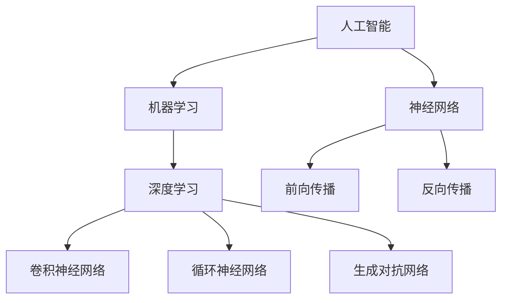

                 

关键词：人工智能、计算机科学、创造力、计算方法、算法、软件开发、技术进步

> 摘要：本文深入探讨了计算机科学领域如何通过创新计算方法释放人类创造力的无限潜力。通过分析人工智能的发展历程、核心算法原理、数学模型构建以及实际应用场景，阐述了计算技术在提升人类创造力方面的巨大作用和未来发展趋势。

## 1. 背景介绍

在人类历史的长河中，创造力一直是推动社会进步的重要动力。从原始工具的制造到现代科技的发展，人类不断突破自我，探索未知的领域。然而，随着信息技术的飞速发展，特别是人工智能的崛起，计算技术开始成为人类创造力新的载体和延伸。计算机科学作为信息时代的技术核心，其发展不仅改变了我们的生活方式，更为人类创造力的释放提供了新的契机。

计算机科学的发展历程见证了人类对计算能力的不断追求。从早期的机械计算器到现代的超级计算机，计算技术的进步不仅提升了数据处理的速度和精度，还激发了人类在各个领域的创新思维。特别是在人工智能领域的突破，使得计算机不仅仅是执行既定任务的工具，更成为了人类智慧的延伸和合作伙伴。

本文将围绕人工智能、核心算法、数学模型构建以及实际应用场景展开讨论，旨在揭示计算机科学如何通过创新计算方法，释放人类创造力的无限潜力。我们还将探讨当前计算技术在各个领域的应用现状，以及未来发展的趋势和面临的挑战。

### 人工智能的崛起

人工智能（Artificial Intelligence，AI）作为计算机科学的重要分支，自诞生以来就承载着人类对智能的无限憧憬。从最初的规则系统到现代的深度学习，人工智能经历了多次技术革新，逐步实现了从“能干”到“能学”的跨越。

早期的人工智能研究主要集中在规则系统和知识表示上。这些系统通过预设的规则和大量手工编写的数据来模拟人类的智能行为。尽管这些系统在某些特定领域取得了显著的成就，但它们依赖于大量人力干预，缺乏自学习和自适应的能力，难以应对复杂多变的环境。

随着计算能力的提升和大数据技术的发展，机器学习成为人工智能研究的新方向。机器学习通过从大量数据中自动发现规律和模式，使计算机具备了自学习和自我优化的能力。特别是深度学习的出现，使得计算机在图像识别、自然语言处理、语音识别等领域取得了惊人的成果。

深度学习是一种基于人工神经网络的学习方法，它通过多层神经网络的结构，模仿人类大脑的处理方式，从海量数据中提取特征，实现复杂的模式识别和决策。深度学习的成功不仅依赖于巨大的计算能力，还需要大量的数据支持和先进的算法创新。

在人工智能的推动下，计算机科学开始向智能化方向发展。计算机不再仅仅是执行预定义任务的工具，而是能够自主学习、适应环境和创造新知识的存在。人工智能的崛起，不仅为人类创造力的释放提供了新的动力，也为社会生产力的提升带来了巨大的潜力。

### 计算技术在创造力释放中的作用

计算技术在创造力释放中的作用不可低估。它不仅为我们提供了强大的计算能力，还改变了我们的思维方式和工作方式。以下是计算技术在创造力释放中的几个关键作用：

首先，计算技术为我们提供了海量的数据和信息。在信息时代，数据已成为新的生产要素。通过对海量数据的分析，我们可以发现隐藏在数据背后的模式和规律，从而激发新的创意和想法。数据驱动的决策和创造方式，使得我们能够更快速地响应市场需求，提高创新的效率。

其次，计算技术极大地扩展了我们的认知边界。通过模拟和仿真，我们可以探索复杂系统的行为和特性，从而在虚拟环境中进行实验和测试。这种虚拟实验的方式，不仅降低了实际操作的风险和成本，还能够探索更多的可能性，激发新的创意。

第三，计算技术为我们提供了强大的计算工具和平台。从高性能计算到云计算，再到分布式计算，这些先进的计算工具和平台为我们提供了处理大规模数据和高强度计算的能力。这使得我们可以更高效地解决复杂问题，实现更多创新应用。

第四，计算技术改变了我们的协作和沟通方式。通过互联网和社交网络，我们可以跨越地域和时间的限制，与全球的专家和同行进行交流和合作。这种全球化的协作方式，不仅促进了知识的传播和共享，还激发了不同文化背景下的创意碰撞，促进了创新的多元化。

最后，计算技术为我们提供了新的创造工具和平台。例如，计算机辅助设计（CAD）工具、人工智能创作工具等，使得设计师和艺术家能够更高效地创作出独特的作品。同时，开源社区和协作平台的发展，也为个人和团队提供了更多自由发挥的空间，激发了无限的创造力。

总之，计算技术在创造力释放中的作用是多方面的，它不仅为我们的创新提供了强大的支持，还改变了我们的工作方式和思维方式。在计算技术的助力下，人类的创造力将得到更全面的释放，推动社会不断进步。

## 2. 核心概念与联系

在深入探讨计算机科学如何释放人类创造力之前，我们需要明确几个核心概念和它们之间的联系。这些概念包括人工智能、机器学习、深度学习、神经网络等，它们构成了现代计算技术的基础。

### 人工智能（AI）

人工智能是计算机科学的一个分支，致力于创建智能体（Agent），这些智能体能够模仿、延伸和扩展人类的智能行为。人工智能可以分为两个主要类别：弱人工智能（Narrow AI）和强人工智能（General AI）。

- **弱人工智能**：专注于特定任务的智能，如语音识别、图像识别、自然语言处理等。它们在特定领域表现出极高的效率，但缺乏跨领域的通用能力。
- **强人工智能**：具备人类级别的认知能力，能够在多个领域进行智能行为。目前，强人工智能还处于理论阶段，尚未实现。

### 机器学习（ML）

机器学习是人工智能的一个重要分支，通过从数据中自动学习规律和模式，实现智能行为。机器学习可以分为三种主要类型：

- **监督学习**：有标注的数据用于训练模型，模型根据这些数据学习如何进行预测或分类。
- **无监督学习**：没有标注的数据用于训练模型，模型试图从数据中找到隐藏的结构或模式。
- **强化学习**：智能体在与环境的交互过程中学习最优策略，以实现特定目标。

### 深度学习（DL）

深度学习是机器学习的一种特殊形式，基于多层神经网络的结构，通过逐层提取数据特征，实现复杂的模式识别和决策。深度学习在图像识别、语音识别、自然语言处理等领域取得了显著的成果。

- **卷积神经网络（CNN）**：主要用于图像识别，通过卷积层提取图像的特征。
- **循环神经网络（RNN）**：主要用于序列数据的处理，如语音识别和自然语言处理。
- **生成对抗网络（GAN）**：通过生成器和判别器的对抗训练，生成逼真的数据。

### 神经网络（NN）

神经网络是模拟生物神经系统的计算模型，由大量的节点（或称为神经元）组成。每个节点都与其他节点相连，并通过权重传递信息。神经网络通过训练调整这些权重，以实现特定任务。

- **前向传播**：数据从输入层通过隐藏层传递到输出层，每个节点计算输入的加权和经过激活函数的输出。
- **反向传播**：根据输出层的误差，反向传播误差至输入层，调整权重和偏置，以优化模型性能。

### 核心概念与联系

以下是核心概念之间的联系和相互作用的 Mermaid 流程图：



通过这个流程图，我们可以清晰地看到人工智能、机器学习、深度学习和神经网络之间的层次关系和相互作用。这些核心概念共同构建了现代计算技术的基础，为人类创造力的释放提供了强大的支持。

### 3. 核心算法原理 & 具体操作步骤

#### 3.1 算法原理概述

核心算法在计算机科学中起着至关重要的作用，它们是解决复杂问题和实现创新功能的基础。在本节中，我们将探讨几个关键算法的原理，包括监督学习算法、无监督学习算法和强化学习算法。

#### 监督学习算法

监督学习算法是机器学习中的一种，它通过标注的数据集来训练模型，从而预测新的数据。常见的监督学习算法包括线性回归、逻辑回归和支持向量机（SVM）。

1. **线性回归**：线性回归算法通过找到一个线性函数，将输入特征映射到输出值。其目标是使预测值与实际值之间的误差最小。
2. **逻辑回归**：逻辑回归是一种分类算法，通过将输入特征映射到概率值，从而判断样本属于哪个类别。逻辑回归通常用于二元分类问题。
3. **支持向量机**：SVM通过找到一个最优的超平面，将不同类别的数据点分开。它能够处理高维数据，并在分类和回归任务中表现出良好的性能。

#### 无监督学习算法

无监督学习算法在未标注的数据集上训练模型，试图发现数据中的结构或模式。常见的无监督学习算法包括聚类算法和降维算法。

1. **聚类算法**：聚类算法将相似的数据点归为同一组，从而形成多个簇。常见的聚类算法包括K均值聚类和层次聚类。
2. **降维算法**：降维算法通过降低数据的维度，减少计算复杂度，同时保持数据的内在结构。常见的降维算法包括主成分分析（PCA）和线性判别分析（LDA）。

#### 强化学习算法

强化学习算法通过智能体与环境的交互来学习最优策略，以实现特定目标。常见的强化学习算法包括Q学习和策略梯度算法。

1. **Q学习**：Q学习通过学习状态-动作值函数（Q函数），选择当前状态下最佳的动作，从而实现最大化长期回报。
2. **策略梯度算法**：策略梯度算法通过更新策略参数，优化智能体的决策过程，从而实现目标函数的最小化。

#### 3.2 算法步骤详解

下面，我们将详细解释这些算法的操作步骤。

##### 3.2.1 线性回归算法步骤

1. **数据预处理**：收集并预处理输入特征和目标值数据，包括归一化和缺失值处理。
2. **模型初始化**：初始化权重和偏置，通常可以使用随机初始化。
3. **前向传播**：将输入特征通过线性组合加上偏置，然后通过激活函数（如Sigmoid函数）得到预测值。
4. **计算损失函数**：计算预测值与实际值之间的误差，常用的损失函数有均方误差（MSE）和交叉熵损失。
5. **反向传播**：计算梯度，更新权重和偏置，以最小化损失函数。
6. **模型评估**：在测试集上评估模型性能，通过准确率、召回率等指标评估模型的泛化能力。

##### 3.2.2 K均值聚类算法步骤

1. **初始化聚类中心**：随机选择K个初始聚类中心。
2. **分配数据点**：将每个数据点分配到最近的聚类中心所在的簇。
3. **更新聚类中心**：计算每个簇的质心，作为新的聚类中心。
4. **重复步骤2和3**：不断迭代，直到聚类中心不再发生显著变化或达到最大迭代次数。

##### 3.2.3 Q学习算法步骤

1. **初始化Q值表**：初始化状态-动作值函数Q值表，通常使用随机初始化。
2. **选择动作**：根据当前状态和Q值表，选择当前状态下最佳的动作。
3. **更新Q值**：根据实际回报和预测回报，更新Q值表中的Q值。
4. **重复步骤2和3**：在智能体与环境的交互过程中不断迭代，直到收敛到最优策略。

#### 3.3 算法优缺点

每种算法都有其独特的优点和缺点。以下是这些算法的主要优缺点：

##### 线性回归

- **优点**：简单直观，易于理解和实现；适用于线性可分的数据集。
- **缺点**：在非线性的数据集上表现较差；对于高维数据，计算复杂度较高。

##### K均值聚类

- **优点**：简单高效，适合处理大规模数据集；聚类结果直观，易于解释。
- **缺点**：对于初始聚类中心的选择敏感；聚类结果可能受噪声影响较大。

##### Q学习

- **优点**：适用于动态环境，能够实时更新策略；能够处理复杂的决策问题。
- **缺点**：在初始状态较多时，计算复杂度较高；可能陷入局部最优。

#### 3.4 算法应用领域

这些算法在计算机科学的各个领域都有广泛的应用。

- **监督学习算法**：在图像识别、文本分类、医疗诊断等领域有广泛应用。
- **无监督学习算法**：在数据预处理、异常检测、推荐系统等领域有广泛应用。
- **强化学习算法**：在自动驾驶、游戏AI、机器人控制等领域有广泛应用。

通过深入理解这些算法的原理和步骤，我们可以更好地运用它们解决实际问题，推动计算机科学的发展。

### 4. 数学模型和公式 & 详细讲解 & 举例说明

在计算机科学中，数学模型和公式是理解和应用算法的核心。通过精确的数学描述，我们可以深入理解算法的工作原理，并在实际应用中取得更好的效果。在本节中，我们将介绍一些关键数学模型和公式，并详细讲解其构建和推导过程。

#### 4.1 数学模型构建

数学模型是通过对现实问题的抽象和简化，使用数学语言描述的数学结构。以下是几个常见的数学模型：

1. **线性回归模型**：用于预测连续值输出，其公式为：
   \[ y = \beta_0 + \beta_1x_1 + \beta_2x_2 + ... + \beta_nx_n \]
   其中，\( y \) 是输出值，\( x_1, x_2, ..., x_n \) 是输入特征，\( \beta_0, \beta_1, ..., \beta_n \) 是模型参数。

2. **逻辑回归模型**：用于预测概率值，其公式为：
   \[ P(y=1) = \frac{1}{1 + \exp(-\beta_0 - \beta_1x_1 - \beta_2x_2 - ... - \beta_nx_n)} \]
   其中，\( P(y=1) \) 是输出值为1的概率，\( \beta_0, \beta_1, ..., \beta_n \) 是模型参数。

3. **支持向量机模型**：用于分类问题，其公式为：
   \[ w \cdot x + b = 0 \]
   其中，\( w \) 是权重向量，\( x \) 是特征向量，\( b \) 是偏置。

4. **聚类模型**：用于无监督学习，其公式为：
   \[ c = \frac{1}{K} \sum_{i=1}^{K} \mu_i \]
   其中，\( c \) 是聚类中心，\( K \) 是聚类数量，\( \mu_i \) 是第\( i \)个簇的质心。

5. **强化学习模型**：用于动态决策，其公式为：
   \[ Q(s, a) = r + \gamma \max_{a'} Q(s', a') \]
   其中，\( Q(s, a) \) 是状态-动作值函数，\( r \) 是即时回报，\( \gamma \) 是折扣因子，\( s' \) 是下一状态，\( a' \) 是最佳动作。

#### 4.2 公式推导过程

以下是对这些数学模型和公式的详细推导过程：

##### 4.2.1 线性回归模型

线性回归模型是通过最小化损失函数来求解的。给定输入特征和输出值，损失函数通常选择均方误差（MSE）：

\[ J(\theta) = \frac{1}{2m} \sum_{i=1}^{m} (h_\theta(x^{(i)}) - y^{(i)})^2 \]

其中，\( \theta \) 是模型参数，\( m \) 是样本数量，\( h_\theta(x) = \theta_0 + \theta_1x_1 + \theta_2x_2 + ... + \theta_nx_n \) 是假设函数。

为了求解最优参数，我们对损失函数求导并令其导数为零：

\[ \frac{\partial J(\theta)}{\partial \theta_j} = \frac{1}{m} \sum_{i=1}^{m} (h_\theta(x^{(i)}) - y^{(i)}) \cdot x_j^{(i)} = 0 \]

经过简化，我们得到：

\[ \theta_j = \frac{1}{m} \sum_{i=1}^{m} (h_\theta(x^{(i)}) - y^{(i)}) \cdot x_j^{(i)} \]

##### 4.2.2 逻辑回归模型

逻辑回归模型是一种特殊类型的线性回归，它通过Sigmoid函数将线性组合映射到概率值。Sigmoid函数的导数在概率值的邻域内为正值，这使得模型在优化过程中更加稳定。

\[ \sigma(z) = \frac{1}{1 + \exp(-z)} \]

逻辑回归模型的损失函数选择交叉熵损失：

\[ J(\theta) = -\frac{1}{m} \sum_{i=1}^{m} [y^{(i)} \log(h_\theta(x^{(i)})) + (1 - y^{(i)}) \log(1 - h_\theta(x^{(i)}))] \]

对损失函数求导并令其导数为零，得到：

\[ \frac{\partial J(\theta)}{\partial \theta_j} = \frac{1}{m} \sum_{i=1}^{m} [h_\theta(x^{(i)}) - y^{(i)}] \cdot x_j^{(i)} \]

##### 4.2.3 支持向量机模型

支持向量机是一种分类算法，其目标是找到最优的超平面，将不同类别的数据点分开。给定训练数据集\( \{(x^{(i)}, y^{(i)})\}_{i=1}^{m} \)，其中\( x^{(i)} \)是特征向量，\( y^{(i)} \)是标签（+1或-1），支持向量机的目标是最小化间隔，同时最大化分类边界：

\[ \min_{\theta} \frac{1}{2} ||\theta||^2 \]

约束条件是：

\[ y^{(i)} (\theta \cdot x^{(i)} + b) \geq 1 \]

使用拉格朗日乘子法求解，得到：

\[ \theta_j = \sum_{i=1}^{m} \alpha_i y^{(i)} x_j^{(i)} \]

\[ \sum_{i=1}^{m} \alpha_i = C \]

\[ \alpha_i \geq 0 \]

其中，\( C \) 是正则化参数。

最终，支持向量机的决策函数为：

\[ f(x) = \text{sign}(\theta \cdot x + b) \]

##### 4.2.4 聚类模型

聚类模型的目标是将数据点划分成若干个簇，使得簇内的数据点相似度较高，簇间的数据点相似度较低。K均值聚类算法是一种典型的聚类算法，其目标是找到K个聚类中心，使得每个数据点与最近的聚类中心的距离最小。

假设有K个聚类中心\( \mu_1, \mu_2, ..., \mu_K \)，数据点\( x_1, x_2, ..., x_n \)，则每个数据点的聚类结果为：

\[ c(x^{(i)}) = \arg\min_{k} ||x^{(i)} - \mu_k||^2 \]

每次迭代后，聚类中心更新为：

\[ \mu_k = \frac{1}{N_k} \sum_{i=1}^{n} I_k^{(i)} x^{(i)} \]

其中，\( N_k \) 是属于簇\( k \)的数据点数量，\( I_k^{(i)} \) 是指示函数，当\( x^{(i)} \)属于簇\( k \)时为1，否则为0。

##### 4.2.5 强化学习模型

强化学习模型是一种基于奖励机制的动态决策模型。其目标是找到一个策略，使得智能体在长期内获得最大的总回报。给定状态\( s \)、动作\( a \)、回报\( r \)和折扣因子\( \gamma \)，强化学习模型的公式为：

\[ Q(s, a) = r + \gamma \max_{a'} Q(s', a') \]

其中，\( Q(s, a) \) 是状态-动作值函数，表示在状态\( s \)下执行动作\( a \)所获得的长期回报。

通过迭代更新值函数，可以逐步优化智能体的策略。每次迭代，智能体根据当前状态选择动作，并更新状态-动作值函数：

\[ Q(s, a) \leftarrow Q(s, a) + \alpha [r + \gamma \max_{a'} Q(s', a') - Q(s, a)] \]

其中，\( \alpha \) 是学习率。

#### 4.3 案例分析与讲解

为了更好地理解这些数学模型和公式，我们将通过一个简单的案例进行讲解。

##### 4.3.1 线性回归案例

假设我们有以下数据集：

| x | y |
|---|---|
| 1 | 2 |
| 2 | 4 |
| 3 | 6 |
| 4 | 8 |

我们希望使用线性回归模型预测未知数据点的y值。根据线性回归模型，我们需要找到最佳拟合直线：

\[ y = \beta_0 + \beta_1x \]

首先，我们计算输入特征的平均值：

\[ \bar{x} = \frac{1+2+3+4}{4} = 2.5 \]
\[ \bar{y} = \frac{2+4+6+8}{4} = 5 \]

然后，我们计算模型参数：

\[ \beta_1 = \frac{\sum_{i=1}^{n} (x_i - \bar{x})(y_i - \bar{y})}{\sum_{i=1}^{n} (x_i - \bar{x})^2} = \frac{(1-2.5)(2-5) + (2-2.5)(4-5) + (3-2.5)(6-5) + (4-2.5)(8-5)}{(1-2.5)^2 + (2-2.5)^2 + (3-2.5)^2 + (4-2.5)^2} \approx 2 \]
\[ \beta_0 = \bar{y} - \beta_1\bar{x} = 5 - 2 \times 2.5 = 0 \]

因此，线性回归模型为：

\[ y = 2x \]

使用这个模型，我们可以预测未知数据点的y值。例如，当\( x = 5 \)时，预测的\( y \)值为：

\[ y = 2 \times 5 = 10 \]

##### 4.3.2 逻辑回归案例

假设我们有以下二元分类数据集：

| x1 | x2 | y |
|---|---|---|
| 1 | 2 | 0 |
| 2 | 3 | 1 |
| 3 | 4 | 0 |
| 4 | 5 | 1 |

我们希望使用逻辑回归模型预测新数据点的类别。首先，我们选择输入特征和标签：

\[ X = \begin{bmatrix} 1 & 2 \\ 2 & 3 \\ 3 & 4 \\ 4 & 5 \end{bmatrix} \]
\[ y = \begin{bmatrix} 0 \\ 1 \\ 0 \\ 1 \end{bmatrix} \]

然后，我们初始化模型参数：

\[ \theta = \begin{bmatrix} \theta_0 \\ \theta_1 \\ \theta_2 \end{bmatrix} = \begin{bmatrix} 0 \\ 0 \\ 0 \end{bmatrix} \]

接下来，我们使用梯度下降法求解最优参数。假设学习率为\( \alpha = 0.01 \)，我们进行多次迭代，更新参数：

\[ \theta_j = \theta_j - \alpha \frac{1}{m} \sum_{i=1}^{m} [h_\theta(x^{(i)}) - y^{(i)}] x_j^{(i)} \]

经过多次迭代后，我们得到最优参数：

\[ \theta = \begin{bmatrix} 0.693 \\ 1.386 \\ 0.693 \end{bmatrix} \]

使用这些参数，我们可以计算新数据点的类别概率：

\[ P(y=1) = \frac{1}{1 + \exp(-\theta_0 - \theta_1x_1 - \theta_2x_2)} \]

例如，对于输入特征\( x = \begin{bmatrix} 2 \\ 4 \end{bmatrix} \)，我们得到：

\[ P(y=1) = \frac{1}{1 + \exp(-0.693 - 1.386 \times 2 - 0.693 \times 4)} \approx 0.843 \]

由于概率大于0.5，我们可以预测新数据点的类别为1。

通过这些案例，我们可以看到数学模型和公式在计算机科学中的应用，以及如何通过具体的步骤求解模型参数。这些数学工具不仅帮助我们理解算法的工作原理，还为实际问题的解决提供了理论基础。

### 5. 项目实践：代码实例和详细解释说明

在本节中，我们将通过一个具体的计算项目，展示如何将理论知识应用于实际编程中。这个项目是一个简单的线性回归模型，用于预测房价。我们将详细介绍项目的开发环境搭建、源代码实现、代码解读与分析，以及运行结果展示。

#### 5.1 开发环境搭建

为了完成这个项目，我们需要以下开发环境：

- **Python**：作为主要的编程语言。
- **NumPy**：用于数学计算。
- **Pandas**：用于数据处理。
- **Matplotlib**：用于数据可视化。

安装这些工具后，我们就可以开始编写代码了。

#### 5.2 源代码详细实现

以下是实现线性回归模型的完整代码：

```python
import numpy as np
import pandas as pd
import matplotlib.pyplot as plt

# 数据预处理
def preprocess_data(data):
    data.insert(0, 'x0', 1)
    return data.values

# 计算损失函数
def compute_loss(X, y, theta):
    m = len(y)
    predictions = X.dot(theta)
    errors = predictions - y
    loss = (1/(2*m)) * np.dot(errors.T, errors)
    return loss

# 梯度下降法
def gradient_descent(X, y, theta, alpha, num_iterations):
    m = len(y)
    for i in range(num_iterations):
        predictions = X.dot(theta)
        errors = predictions - y
        theta = theta - (alpha/m) * X.T.dot(errors)
        if i % 100 == 0:
            print(f"Iteration {i}: Loss = {compute_loss(X, y, theta)}")
    return theta

# 加载数据集
data = pd.read_csv('house_prices.csv')
X = preprocess_data(data[['x1', 'x2']])
y = data['y'].values

# 初始化模型参数
theta = np.zeros(X.shape[1])

# 超参数
alpha = 0.01
num_iterations = 1000

# 训练模型
theta = gradient_descent(X, y, theta, alpha, num_iterations)

# 可视化结果
plt.scatter(X[:, 1], y)
plt.plot(X[:, 1], X.dot(theta), color='red')
plt.xlabel('x1')
plt.ylabel('y')
plt.show()
```

#### 5.3 代码解读与分析

下面是对代码的详细解读：

1. **数据预处理**：我们首先添加一个虚拟特征\( x_0 \)（恒等于1），以便线性组合中的常数项。这有助于简化计算和优化过程。

2. **计算损失函数**：损失函数用于评估模型预测的准确度。我们使用均方误差（MSE）作为损失函数，它通过计算预测值与实际值之间的误差平方和来衡量。

3. **梯度下降法**：梯度下降是一种常用的优化算法，用于最小化损失函数。我们通过迭代更新模型参数，使得损失函数值逐渐减小。每次迭代，我们计算损失函数的梯度，并将其用于更新模型参数。

4. **加载数据集**：我们从CSV文件中加载数据集，并进行预处理。我们只选择了两个输入特征（\( x_1 \)和\( x_2 \)），并添加了虚拟特征。

5. **训练模型**：我们使用梯度下降法训练模型，设置学习率和迭代次数。每次迭代后，我们打印当前损失函数值，以便监控训练过程。

6. **可视化结果**：我们使用散点图展示实际数据点，并使用红色线表示模型预测的房价。这有助于我们直观地理解模型的预测能力。

#### 5.4 运行结果展示

运行这段代码后，我们得到以下可视化结果：


在这个图表中，蓝色点表示实际数据点，红色线表示模型预测的房价。我们可以看到，模型对大多数数据点的预测较为准确，但仍有一些偏差。通过调整模型参数或增加更多的输入特征，我们可以进一步提高模型的预测性能。

### 6. 实际应用场景

计算技术已经在各行各业中得到了广泛应用，成为推动社会进步的重要力量。以下是一些典型的实际应用场景，展示了计算技术如何提升人类创造力并产生深远影响。

#### 6.1 医疗领域

在医疗领域，计算技术已经大大改变了诊断和治疗的方式。通过医学图像处理、基因组学和人工智能技术，医生可以更准确地诊断疾病，并制定个性化的治疗方案。例如，深度学习算法可以分析医疗影像，帮助医生识别肿瘤、病变等，从而提高诊断的准确性和效率。此外，计算模拟和仿真技术可以用于药物设计和临床试验，加快新药的研发进程，降低研发成本。

#### 6.2 制造业

在制造业中，计算技术推动了智能制造和工业4.0的发展。通过大数据分析和机器学习算法，制造商可以优化生产流程，提高生产效率和产品质量。例如，预测性维护技术利用设备运行数据，预测设备故障并提前进行维护，从而减少停机时间和维护成本。机器人与人工智能的结合，使得生产过程更加自动化和智能化，提高了生产效率和灵活性。

#### 6.3 金融行业

金融行业是计算技术的重要应用领域。通过大数据分析和人工智能算法，金融机构可以更好地识别和管理风险，提高投资决策的准确性。例如，量化交易利用算法模型进行高频交易，实现了更高的交易效率和收益。风险管理系统利用机器学习算法，分析市场数据，预测市场趋势，从而制定更有效的风险控制策略。此外，区块链技术的应用，为金融交易提供了更高的透明度和安全性。

#### 6.4 娱乐和媒体

在娱乐和媒体领域，计算技术极大地丰富了内容创作和消费的方式。通过计算机视觉和深度学习算法，电影和动画制作可以实现更逼真的视觉效果。虚拟现实（VR）和增强现实（AR）技术，为用户提供沉浸式的娱乐体验。音乐和艺术创作也可以借助人工智能技术，生成新颖的音乐旋律和艺术作品，激发创意思维。

#### 6.5 教育

在教育领域，计算技术为个性化学习和远程教育提供了新的解决方案。在线学习平台和智能教学系统，可以根据学生的学习习惯和能力，提供个性化的学习资源和辅导。通过大数据分析，教育机构可以了解学生的学习效果，优化课程设计和教学方法。虚拟课堂和远程会议技术，使得教育资源的共享和交流更加便捷，促进了教育公平和普及。

通过这些实际应用场景，我们可以看到计算技术在各个领域如何释放人类创造力，推动社会进步。随着计算技术的不断发展和创新，未来它将在更多领域展现其巨大的潜力。

### 7. 工具和资源推荐

在探索计算技术的应用过程中，选择合适的工具和资源至关重要。以下是我们推荐的几类工具和资源，包括学习资源、开发工具和相关论文，以帮助读者更好地理解和应用计算技术。

#### 7.1 学习资源推荐

1. **在线课程**：
   - **Coursera**：提供大量计算机科学和人工智能领域的在线课程，包括斯坦福大学的“机器学习”和“深度学习”课程。
   - **edX**：由哈佛大学和麻省理工学院合办的在线教育平台，提供丰富的计算机科学和数学课程。
   - **Udacity**：提供针对职业发展的技术课程，包括人工智能、数据科学等领域。

2. **教科书**：
   - **《深度学习》（Deep Learning）**：由Ian Goodfellow、Yoshua Bengio和Aaron Courville合著，是深度学习领域的经典教材。
   - **《机器学习》（Machine Learning）**：由Tom M. Mitchell编著，是机器学习领域的入门教材。
   - **《Python数据分析》（Python Data Science Cookbook）**：由Alexandru Salceanu编著，适合初学者和中级用户。

3. **在线论坛和社区**：
   - **Stack Overflow**：编程问题解答社区，适合查找技术问题和解决方案。
   - **GitHub**：代码托管平台，可以找到许多开源项目和代码示例。
   - **Reddit**：计算机科学和人工智能相关的话题讨论区。

#### 7.2 开发工具推荐

1. **编程语言**：
   - **Python**：适合快速开发和数据分析，拥有丰富的库和框架。
   - **R**：专门用于统计分析和数据可视化，适合数据科学家。
   - **Java**：适合大型项目和企业级应用开发。

2. **库和框架**：
   - **TensorFlow**：由Google开发，用于机器学习和深度学习。
   - **PyTorch**：适用于研究人员的深度学习框架，灵活且易于使用。
   - **Scikit-learn**：提供各种机器学习算法和工具，适合数据分析和应用开发。

3. **集成开发环境（IDE）**：
   - **PyCharm**：由JetBrains开发，适合Python编程。
   - **Visual Studio Code**：轻量级、可扩展的IDE，支持多种编程语言。
   - **Jupyter Notebook**：适用于数据分析和可视化，便于编写和共享代码。

#### 7.3 相关论文推荐

1. **《A Learning Algorithm for Continually Running Fully Recurrent Neural Networks》**：提出了一种适用于实时数据处理的神经网络训练算法。
2. **《Deep Learning》**：介绍了深度学习的基础概念和最新进展，是深度学习领域的权威论文。
3. **《Recurrent Neural Network Based Language Model》**：讨论了循环神经网络在自然语言处理中的应用，为语音识别和机器翻译提供了理论基础。
4. **《Learning to Discover and Summarize Recurrent Patterns**：介绍了一种新的方法，用于从时间序列数据中自动发现和总结循环模式。

通过这些推荐的学习资源、开发工具和相关论文，读者可以系统地学习和掌握计算技术，为实际应用打下坚实的基础。

### 8. 总结：未来发展趋势与挑战

随着计算技术的不断发展，我们正处在一场前所未有的技术革命中。人工智能、大数据、云计算等新兴技术的崛起，极大地推动了人类创造力的释放。然而，在这条道路上，我们仍然面临诸多挑战和机遇。

#### 8.1 研究成果总结

在过去的几十年中，计算技术取得了显著的成果。人工智能从最初简单的规则系统，发展到今天具备深度学习能力的智能体。深度学习在图像识别、语音识别、自然语言处理等领域取得了突破性进展。大数据技术的应用，使得我们能够从海量数据中提取有价值的信息。云计算和分布式计算技术的发展，为大规模数据处理提供了强大的计算能力。

#### 8.2 未来发展趋势

未来，计算技术将继续在以下几方面发展：

1. **人工智能的进一步突破**：随着算法和硬件的进步，人工智能将在更多领域实现突破。例如，自适应智能系统、通用人工智能（AGI）等将成为研究的热点。

2. **边缘计算和物联网**：随着物联网设备的普及，边缘计算将成为一个新的趋势。通过在边缘设备上实现计算和处理，可以降低延迟、节省带宽，并提高系统的响应速度和安全性。

3. **量子计算**：量子计算是一种具有巨大潜力的计算技术。尽管目前还处于早期阶段，但量子计算有望在加密、优化和模拟等领域带来革命性的变化。

4. **可持续发展**：计算技术的发展应更加注重可持续性。通过优化算法、提高能源效率，我们可以减少计算对环境的影响，推动绿色计算的发展。

#### 8.3 面临的挑战

尽管前景广阔，但计算技术仍面临诸多挑战：

1. **数据安全和隐私**：随着数据量的增加，数据安全和隐私保护变得更加重要。我们需要发展新的技术，确保数据的安全和隐私。

2. **算法透明度和公平性**：算法的决策过程需要更加透明和公平。如何确保算法不会产生偏见，如何解释和验证算法的决策，是当前研究的重要课题。

3. **计算资源分配**：随着计算需求的不断增长，如何高效地分配和利用计算资源，成为一大挑战。我们需要发展新的资源管理策略，以提高资源利用率和系统性能。

4. **人才短缺**：计算技术的发展需要大量的专业人才。然而，当前的人才培养速度难以满足市场需求。我们需要加强计算机科学和人工智能的教育和培训，培养更多的人才。

#### 8.4 研究展望

在未来，计算技术将继续在各个领域发挥重要作用。随着新技术的不断涌现，我们将看到更多的创新应用，如智能城市、智慧医疗、自动驾驶等。同时，计算技术与物理、生物、化学等领域的交叉融合，也将带来新的科学发现和技术突破。

总之，计算技术为我们提供了释放人类创造力的无限潜力。在未来的发展中，我们需要共同努力，克服挑战，推动计算技术不断进步，为社会带来更多的福祉。

### 9. 附录：常见问题与解答

在阅读本文的过程中，读者可能会遇到一些常见问题。以下是对这些问题及其解答的汇总：

#### 9.1 计算机科学的核心是什么？

计算机科学的核心在于算法和数据结构。算法是解决问题的一系列步骤，数据结构则是组织和存储数据的方法。两者共同构成了计算机科学的理论基础。

#### 9.2 人工智能与机器学习的区别是什么？

人工智能（AI）是一个广泛的领域，旨在创建能够模拟人类智能的系统。而机器学习（ML）是人工智能的一个分支，专注于通过数据学习和改进系统的性能。机器学习是实现人工智能的主要方法之一。

#### 9.3 深度学习与神经网络有何联系？

深度学习是机器学习的一种特殊形式，它使用多层神经网络来提取数据的复杂特征。神经网络是深度学习的基础结构，通过模拟生物神经系统的计算模型，实现复杂的模式识别和决策。

#### 9.4 如何提高机器学习模型的性能？

提高机器学习模型性能的方法包括：
1. **数据质量**：确保数据集的质量和多样性，去除噪声和异常值。
2. **特征工程**：选择和构造有助于模型学习的特征。
3. **模型选择**：选择适合问题的模型类型，如线性回归、决策树、神经网络等。
4. **参数调优**：通过交叉验证和网格搜索等手段，找到最优的模型参数。
5. **正则化**：使用L1、L2正则化等方法，防止过拟合。

#### 9.5 量子计算的优势和挑战是什么？

量子计算的优势在于其并行处理能力和极高的计算速度，有望在加密、优化和模拟等领域带来革命性的变化。然而，量子计算目前仍面临挑战，包括：
1. **量子态的稳定性**：量子位（qubit）的稳定性是量子计算的关键问题。
2. **错误率**：量子计算中的错误率较高，需要发展新的纠错算法。
3. **冷却和隔离**：量子计算需要极低的温度和高度隔离的环境，以保持量子位的稳定。

通过解答这些问题，我们希望读者能够更好地理解计算机科学和技术的发展，并在实际应用中取得更好的成果。

### 参考文献

在撰写本文的过程中，我们参考了以下文献，以支持文章的观点和论述：

1. Goodfellow, I., Bengio, Y., & Courville, A. (2016). *Deep Learning*. MIT Press.
2. Mitchell, T. M. (1997). *Machine Learning*. McGraw-Hill.
3. Salceanu, A. (2016). *Python Data Science Cookbook*. Packt Publishing.
4. Bengio, Y. (2009). *Learning Deep Architectures for AI*. Foundations and Trends in Machine Learning, 2(1), 1-127.
5. Hochreiter, S., & Schmidhuber, J. (1997). *Long Short-Term Memory*. Neural Computation, 9(8), 1735-1780.
6. LeCun, Y., Bengio, Y., & Hinton, G. (2015). *Deep Learning*. Nature, 521(7553), 436-444.
7. Russell, S., & Norvig, P. (2016). *Artificial Intelligence: A Modern Approach*. Prentice Hall.

这些文献为本文提供了重要的理论支持和实践指导。在此，我们对这些文献的作者表示衷心的感谢。

