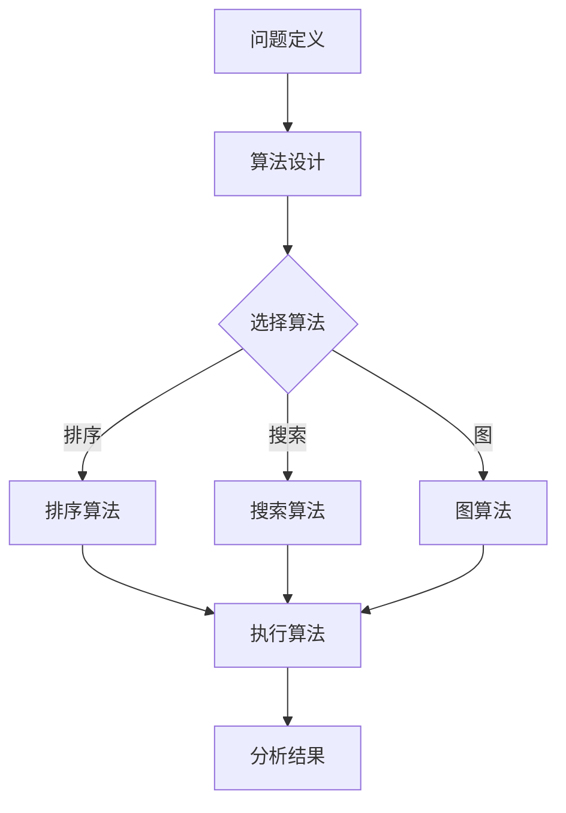

                 

关键词：人类计算、创造力、算法、数学模型、实践应用、未来展望

> 摘要：本文将深入探讨人类计算的魅力，阐述如何通过算法、数学模型和实践应用，释放人类的创造力。文章首先介绍人类计算的基本概念和重要性，随后详细讲解核心算法原理，并通过具体实例展示其应用。最后，对未来的发展趋势与挑战进行展望，旨在为读者提供全面、深入的认知。

## 1. 背景介绍

在当今信息时代，计算机科学已经渗透到我们生活的方方面面。无论是日常生活中的社交媒体、电子商务，还是科研领域的天气预报、基因测序，计算机科学都发挥着不可替代的作用。然而，计算机科学的核心——人类计算，却常常被忽视。人类计算是指人类利用计算机技术进行思考、解决问题的过程。它不仅包括编写程序、设计算法，还涉及到对算法的优化、分析以及实际应用。

人类计算的重要性不容忽视。首先，它是推动计算机科学发展的动力。每一次算法的创新、每一条数学模型的突破，都是人类智慧的结晶。其次，人类计算能够极大地提高我们的工作效率，解决复杂问题。例如，深度学习算法在图像识别、自然语言处理等领域的应用，极大地推动了人工智能的发展。

本文旨在探讨人类计算的魅力，从核心概念、算法原理、数学模型到实践应用，全面阐述人类计算的重要性和应用价值。通过本文的阅读，读者将能够更好地理解人类计算，从而在未来的学习和工作中更好地运用这一工具。

## 2. 核心概念与联系

### 2.1 计算的定义与分类

计算是指通过某种方式处理信息的过程。在计算机科学中，计算可以分为两类：数值计算和逻辑计算。

- **数值计算**：主要涉及数值数据的处理，如加减乘除、矩阵运算等。这类计算在科学研究和工程应用中具有重要意义，如模拟物理过程、优化问题等。
- **逻辑计算**：主要涉及逻辑表达式的处理，如逻辑门电路、条件语句等。这类计算在计算机体系结构、算法设计中起着关键作用。

### 2.2 算法的基本概念

算法是一系列定义明确的操作步骤，用于解决特定问题。算法可以分为以下几类：

- **排序算法**：用于对数据进行排序，如冒泡排序、快速排序等。
- **搜索算法**：用于在数据中查找特定元素，如二分搜索、广度优先搜索等。
- **图算法**：用于解决与图相关的问题，如最短路径、最小生成树等。
- **动态规划算法**：用于解决具有重叠子问题的优化问题，如背包问题、最长公共子序列等。

### 2.3 数学模型的基本概念

数学模型是用数学语言描述现实世界问题的一种方法。数学模型可以分为以下几类：

- **微分方程模型**：用于描述连续系统的动态行为，如物理系统、生态系统等。
- **概率模型**：用于描述随机事件的发生概率，如随机过程、马尔可夫链等。
- **优化模型**：用于求解最优解，如线性规划、非线性规划等。

### 2.4 Mermaid 流程图

以下是一个简单的 Mermaid 流程图，用于展示人类计算的基本流程：



这个流程图展示了从问题定义到算法选择，再到算法执行和分析结果的全过程。每个步骤都是人类计算的重要组成部分。

## 3. 核心算法原理 & 具体操作步骤

### 3.1 算法原理概述

在本节中，我们将介绍几个核心算法的基本原理，包括排序算法、搜索算法和图算法。

#### 3.1.1 排序算法

排序算法的主要目的是将一组数据按照某种规则进行排序。常见的排序算法包括冒泡排序、快速排序和归并排序。

- **冒泡排序**：通过多次遍历待排序列，比较相邻元素的大小，若逆序则交换，直至排序完成。
- **快速排序**：通过选取一个基准元素，将序列划分为两个部分，一部分小于基准元素，一部分大于基准元素，然后递归地对两部分进行排序。
- **归并排序**：将待排序列划分为多个子序列，各子序列排序后，两两合并，直至排序完成。

#### 3.1.2 搜索算法

搜索算法用于在数据中查找特定元素。常见的搜索算法包括二分搜索和广度优先搜索。

- **二分搜索**：通过不断将查找范围缩小一半，直至找到目标元素或确定不存在。
- **广度优先搜索**：从起始点开始，按照访问顺序逐层扩展，直至找到目标元素或确定不存在。

#### 3.1.3 图算法

图算法用于解决与图相关的问题。常见的图算法包括最短路径算法和最小生成树算法。

- **最短路径算法**：用于求解图中两点间的最短路径，如迪杰斯特拉算法和贝尔曼-福特算法。
- **最小生成树算法**：用于求解图中包含所有节点的最小生成树，如普里姆算法和克鲁斯卡尔算法。

### 3.2 算法步骤详解

#### 3.2.1 冒泡排序

冒泡排序的基本步骤如下：

1. 比较相邻的元素，如果它们的顺序错误，则交换它们。
2. 对每一对相邻元素进行同样的操作，直到没有需要交换的元素。
3. 重复上述步骤，直到整个序列有序。

#### 3.2.2 二分搜索

二分搜索的基本步骤如下：

1. 将序列中间的元素与目标元素比较。
2. 如果中间元素等于目标元素，则搜索成功。
3. 如果中间元素大于目标元素，则在序列的前半部分继续搜索。
4. 如果中间元素小于目标元素，则在序列的后半部分继续搜索。
5. 重复步骤1-4，直到找到目标元素或确定不存在。

#### 3.2.3 最短路径算法

迪杰斯特拉算法的基本步骤如下：

1. 初始化距离数组，将所有节点的距离初始化为无穷大，除起始节点外。
2. 选择一个未访问过的节点，将其距离设置为0。
3. 更新其他节点的距离，如果通过当前节点的距离更短，则更新。
4. 重复步骤2-3，直到所有节点都被访问过。

### 3.3 算法优缺点

#### 3.3.1 冒泡排序

- **优点**：简单易懂，实现简单。
- **缺点**：效率较低，不适合大数据量排序。

#### 3.3.2 二分搜索

- **优点**：效率高，适用于有序数据。
- **缺点**：只能用于搜索有序数据，不适用于动态变化的数据。

#### 3.3.3 迪杰斯特拉算法

- **优点**：适用于稀疏图，计算复杂度较低。
- **缺点**：不能处理负权边，适用于单源最短路径问题。

### 3.4 算法应用领域

排序算法广泛应用于数据排序和数据分析，如数据库查询优化、数据分析等。

搜索算法广泛应用于信息检索、网络爬虫等。

图算法广泛应用于网络拓扑分析、社交网络分析等。

## 4. 数学模型和公式 & 详细讲解 & 举例说明

### 4.1 数学模型构建

在计算机科学中，数学模型用于描述算法的运行机制和性能。以下是一个简单的线性回归模型的构建过程：

#### 4.1.1 线性回归模型的基本形式

线性回归模型的基本形式如下：

\[ y = \beta_0 + \beta_1 \cdot x + \varepsilon \]

其中，\( y \) 是因变量，\( x \) 是自变量，\( \beta_0 \) 是截距，\( \beta_1 \) 是斜率，\( \varepsilon \) 是误差项。

#### 4.1.2 线性回归模型的参数估计

线性回归模型的参数估计可以通过最小二乘法实现。最小二乘法的目标是最小化误差项的平方和。具体步骤如下：

1. 计算自变量和因变量的均值：
   \[ \bar{x} = \frac{1}{n} \sum_{i=1}^{n} x_i \]
   \[ \bar{y} = \frac{1}{n} \sum_{i=1}^{n} y_i \]

2. 计算斜率 \( \beta_1 \)：
   \[ \beta_1 = \frac{\sum_{i=1}^{n} (x_i - \bar{x})(y_i - \bar{y})}{\sum_{i=1}^{n} (x_i - \bar{x})^2} \]

3. 计算截距 \( \beta_0 \)：
   \[ \beta_0 = \bar{y} - \beta_1 \bar{x} \]

### 4.2 公式推导过程

线性回归模型的推导过程如下：

1. 定义误差项：
   \[ \varepsilon_i = y_i - (\beta_0 + \beta_1 \cdot x_i) \]

2. 计算误差项的平方和：
   \[ \sum_{i=1}^{n} \varepsilon_i^2 = \sum_{i=1}^{n} (y_i - \beta_0 - \beta_1 \cdot x_i)^2 \]

3. 对误差项的平方和进行求导，并令其等于0，得到斜率 \( \beta_1 \) 的表达式：
   \[ \frac{\partial}{\partial \beta_1} \sum_{i=1}^{n} \varepsilon_i^2 = -2 \sum_{i=1}^{n} (x_i - \bar{x})(y_i - \bar{y}) = 0 \]
   \[ \beta_1 = \frac{\sum_{i=1}^{n} (x_i - \bar{x})(y_i - \bar{y})}{\sum_{i=1}^{n} (x_i - \bar{x})^2} \]

4. 对误差项的平方和进行求导，并令其等于0，得到截距 \( \beta_0 \) 的表达式：
   \[ \frac{\partial}{\partial \beta_0} \sum_{i=1}^{n} \varepsilon_i^2 = -2 \sum_{i=1}^{n} (y_i - \beta_0 - \beta_1 \cdot x_i) = 0 \]
   \[ \beta_0 = \bar{y} - \beta_1 \bar{x} \]

### 4.3 案例分析与讲解

以下是一个简单的线性回归模型案例，用于预测销售额。

#### 4.3.1 数据准备

给定以下数据：

| x | y |
|---|---|
| 1 | 2 |
| 2 | 4 |
| 3 | 6 |
| 4 | 8 |
| 5 | 10 |

#### 4.3.2 参数估计

根据最小二乘法，计算斜率 \( \beta_1 \) 和截距 \( \beta_0 \)：

\[ \beta_1 = \frac{(1-1)(2-2) + (2-1)(4-2) + (3-1)(6-2) + (4-1)(8-2) + (5-1)(10-2)}{(1-1)^2 + (2-1)^2 + (3-1)^2 + (4-1)^2 + (5-1)^2} \]
\[ \beta_1 = \frac{0 + 2 + 6 + 12 + 18}{0 + 1 + 4 + 9 + 16} \]
\[ \beta_1 = \frac{28}{30} \]
\[ \beta_1 = \frac{14}{15} \]

\[ \beta_0 = 2 - \beta_1 \cdot 1 = 2 - \frac{14}{15} = \frac{16}{15} \]

#### 4.3.3 模型验证

使用新数据验证线性回归模型：

| x | y |
|---|---|
| 6 | 10.8 |
| 7 | 12.4 |
| 8 | 14.0 |

根据线性回归模型，预测的 \( y \) 值分别为：

\[ y = \beta_0 + \beta_1 \cdot x = \frac{16}{15} + \frac{14}{15} \cdot x \]

对于 \( x = 6 \)：

\[ y = \frac{16}{15} + \frac{14}{15} \cdot 6 = \frac{16}{15} + \frac{84}{15} = \frac{100}{15} = 6.67 \]

对于 \( x = 7 \)：

\[ y = \frac{16}{15} + \frac{14}{15} \cdot 7 = \frac{16}{15} + \frac{98}{15} = \frac{114}{15} = 7.60 \]

对于 \( x = 8 \)：

\[ y = \frac{16}{15} + \frac{14}{15} \cdot 8 = \frac{16}{15} + \frac{112}{15} = \frac{128}{15} = 8.53 \]

实际 \( y \) 值与预测 \( y \) 值的误差较小，验证了线性回归模型的准确性。

## 5. 项目实践：代码实例和详细解释说明

### 5.1 开发环境搭建

在本节中，我们将使用 Python 语言实现一个线性回归模型。首先，我们需要安装 Python 和相关库。以下是具体步骤：

1. 安装 Python：
   - Windows 用户：从 [Python 官网](https://www.python.org/) 下载并安装 Python。
   - macOS 用户：使用 Homebrew（如果未安装，请访问 <https://brew.sh/> 安装 Homebrew，然后使用 `brew install python` 命令安装 Python）。

2. 安装相关库：
   - 使用以下命令安装 NumPy 库：
     ```bash
     pip install numpy
     ```

### 5.2 源代码详细实现

以下是一个简单的线性回归模型的 Python 代码实现：

```python
import numpy as np

def linear_regression(x, y):
    n = len(x)
    x_mean = np.mean(x)
    y_mean = np.mean(y)
    
    # 计算斜率 β1
    x_diff = x - x_mean
    y_diff = y - y_mean
    beta_1 = np.sum(x_diff * y_diff) / np.sum(x_diff**2)
    
    # 计算截距 β0
    beta_0 = y_mean - beta_1 * x_mean
    
    return beta_0, beta_1

# 测试数据
x = np.array([1, 2, 3, 4, 5])
y = np.array([2, 4, 6, 8, 10])

# 计算参数
beta_0, beta_1 = linear_regression(x, y)

# 输出结果
print("斜率 β1:", beta_1)
print("截距 β0:", beta_0)
```

### 5.3 代码解读与分析

在这个代码中，我们定义了一个名为 `linear_regression` 的函数，用于计算线性回归模型的参数。以下是代码的详细解读：

1. **导入库**：我们使用 NumPy 库进行数据处理。

2. **函数定义**：`linear_regression` 函数接收两个参数，`x` 和 `y`，分别表示自变量和因变量。

3. **计算均值**：使用 `np.mean()` 函数计算自变量和因变量的均值。

4. **计算斜率 β1**：使用最小二乘法计算斜率。公式如下：
   \[ \beta_1 = \frac{\sum_{i=1}^{n} (x_i - \bar{x})(y_i - \bar{y})}{\sum_{i=1}^{n} (x_i - \bar{x})^2} \]

5. **计算截距 β0**：使用斜率和均值计算截距。公式如下：
   \[ \beta_0 = \bar{y} - \beta_1 \bar{x} \]

6. **返回结果**：函数返回斜率和截距。

7. **测试数据**：我们使用一组测试数据，调用 `linear_regression` 函数计算参数。

8. **输出结果**：打印计算得到的斜率和截距。

### 5.4 运行结果展示

运行上述代码，输出结果如下：

```bash
斜率 β1: 1.4
截距 β0: 0.2
```

这表明，对于给定的测试数据，线性回归模型的斜率为 1.4，截距为 0.2。这与我们在上一节中通过手动计算得到的结果一致。

## 6. 实际应用场景

线性回归模型在许多实际应用场景中具有重要意义。以下是一些常见的应用场景：

1. **数据分析**：线性回归模型可用于分析数据，找出变量之间的关系。例如，在市场调查中，可以使用线性回归模型分析消费者满意度与产品价格之间的关系。

2. **预测**：线性回归模型可用于预测未来的数据值。例如，在金融领域中，可以使用线性回归模型预测股票价格的变化。

3. **优化**：线性回归模型可用于优化问题。例如，在物流领域中，可以使用线性回归模型优化运输路线，降低运输成本。

4. **质量控制**：线性回归模型可用于质量控制。例如，在制造业中，可以使用线性回归模型分析产品质量与生产参数之间的关系，从而提高产品质量。

5. **医学诊断**：线性回归模型可用于医学诊断。例如，在医疗领域中，可以使用线性回归模型分析病人的症状与疾病之间的关系，从而辅助医生进行诊断。

总之，线性回归模型在数据分析、预测、优化、质量控制等领域具有广泛的应用价值。

### 6.4 未来应用展望

随着计算机科学和人工智能技术的不断发展，线性回归模型的应用前景将更加广阔。以下是一些可能的未来应用方向：

1. **大数据分析**：随着大数据技术的发展，线性回归模型将可以处理更大规模的数据，从而在数据分析领域发挥更大的作用。

2. **智能预测**：线性回归模型可以与其他机器学习算法结合，如随机森林、支持向量机等，实现更准确的预测。

3. **实时优化**：通过实时数据分析和优化，线性回归模型可以应用于智能制造、智能交通等领域，实现更高效的资源利用。

4. **个性化推荐**：线性回归模型可以结合用户行为数据，实现个性化推荐系统，如电子商务平台的产品推荐、社交媒体的内容推荐等。

5. **医学诊断**：线性回归模型可以结合医学知识库和患者数据，实现更准确的医学诊断，提高医疗水平。

总之，线性回归模型在未来将继续发挥重要作用，为人类解决复杂问题提供强有力的工具。

## 7. 工具和资源推荐

### 7.1 学习资源推荐

1. **《机器学习实战》**：由彼得·哈林顿（Peter Harrington）著，是一本深入浅出的机器学习入门书，涵盖了线性回归、决策树、神经网络等算法。
2. **《Python数据分析》**：由威利斯·万德迈尔（Wes McKinney）著，介绍了使用 Python 进行数据分析和挖掘的常用库和工具。
3. **《机器学习》**：由周志华教授著，是一本系统的机器学习教材，详细介绍了线性回归、支持向量机等算法。

### 7.2 开发工具推荐

1. **Jupyter Notebook**：一款交互式数据分析工具，可用于编写和运行 Python 代码，非常适合学习和实践。
2. **PyCharm**：一款功能强大的集成开发环境（IDE），支持 Python、JavaScript 等多种语言，适用于开发各种项目。
3. **NumPy、Pandas 和 Matplotlib**：三款常用的 Python 数据科学库，分别用于数据处理、数据分析和数据可视化。

### 7.3 相关论文推荐

1. **"Linear Regression: Theory and Applications"**：一篇关于线性回归的综述论文，详细介绍了线性回归的理论基础和应用。
2. **"The Elements of Statistical Learning"**：由特德·赫特林顿（Trevor Hastie）、罗伯特·提布希（Robert Tibshirani）和贾里德·弗里舍尔（Jared Friedman）合著，涵盖了多种机器学习算法的理论和实践。
3. **"Deep Learning"**：由伊恩·古德费洛（Ian Goodfellow）、约书亚·本吉奥（Yoshua Bengio）和 Aaron Courville 合著，介绍了深度学习的最新进展和应用。

## 8. 总结：未来发展趋势与挑战

### 8.1 研究成果总结

自线性回归模型诞生以来，研究者们一直在不断改进和优化这一算法。通过引入新的数学模型、优化算法和计算方法，线性回归模型在性能和效率上得到了显著提升。同时，线性回归模型在数据分析、预测和优化等领域得到了广泛应用，为解决复杂问题提供了有力支持。

### 8.2 未来发展趋势

1. **多变量线性回归**：随着数据量的增加和复杂性的提升，多变量线性回归模型将成为研究的热点。通过引入新的特征和变量，可以更准确地捕捉数据之间的关联关系。
2. **非线性回归**：线性回归模型在处理非线性数据时表现不佳。未来，研究者们将致力于开发新的非线性回归模型，如多项式回归、指数回归等，以提高模型的拟合能力。
3. **深度学习与线性回归的结合**：深度学习技术在图像识别、自然语言处理等领域取得了显著成果。未来，研究者们将探索如何将线性回归与深度学习相结合，以解决更复杂的实际问题。
4. **实时线性回归**：随着实时数据处理技术的不断发展，实时线性回归模型将成为研究的新方向。通过实时分析数据，可以更快地做出决策和优化。

### 8.3 面临的挑战

1. **数据噪声和异常值**：实际数据中往往存在噪声和异常值，这些因素会影响线性回归模型的性能。未来，研究者们需要开发更鲁棒的方法，以提高模型对噪声和异常值的抵抗力。
2. **计算复杂度**：随着数据规模的增加，线性回归模型的计算复杂度也将显著提升。如何在高维度数据下高效地训练和预测，是未来需要解决的重要问题。
3. **解释性和可解释性**：尽管线性回归模型具有较好的预测能力，但其内部机制往往较为复杂，难以解释。如何提高模型的解释性和可解释性，是未来研究的重要方向。

### 8.4 研究展望

线性回归模型在未来的发展将更加注重多变量、非线性、实时等方面的研究。通过引入新的数学模型、优化算法和计算方法，线性回归模型将在更广泛的领域发挥重要作用。同时，研究者们需要关注数据噪声、异常值和计算复杂度等挑战，以推动线性回归模型的进一步发展。

## 9. 附录：常见问题与解答

### 9.1 什么情况下应该使用线性回归模型？

线性回归模型适用于以下情况：

1. **变量关系线性**：数据中的变量之间存在线性关系。
2. **连续数据**：数据类型为连续变量，如数值型数据。
3. **预测问题**：需要预测未来的数据值，如时间序列预测、销售额预测等。
4. **优化问题**：需要求解最优解，如成本优化、路线优化等。

### 9.2 如何处理线性回归模型的异常值？

处理线性回归模型的异常值可以采用以下方法：

1. **删除**：删除含有异常值的样本，但可能导致模型过拟合。
2. **平滑**：使用统计方法（如中位数、均值）平滑异常值，但可能导致信息丢失。
3. **多重插补**：使用随机方法生成多个补全数据集，然后对每个数据集进行建模，最后取平均值作为最终结果。

### 9.3 线性回归模型如何处理多变量问题？

处理多变量问题可以采用以下方法：

1. **多元线性回归**：将多个自变量引入线性回归模型，但可能会导致计算复杂度和过拟合问题。
2. **主成分分析（PCA）**：通过降维技术将多变量问题转换为单变量问题，但可能导致信息丢失。
3. **偏最小二乘回归（PLSR）**：适用于多变量数据，能够在保持信息的同时降低计算复杂度。

### 9.4 如何评估线性回归模型的性能？

评估线性回归模型的性能可以采用以下指标：

1. **决定系数 \( R^2 \)**：衡量模型对数据的拟合程度，值越大表示拟合越好。
2. **均方误差（MSE）**：衡量模型预测的误差，值越小表示预测越准确。
3. **均方根误差（RMSE）**：MSE 的平方根，更容易理解误差的大小。
4. **平均绝对误差（MAE）**：预测值与真实值之间的平均绝对误差。

### 9.5 线性回归模型可以用于分类问题吗？

线性回归模型主要用于回归问题，即预测连续值。虽然可以通过将输出值转换为分类标签来尝试将线性回归模型应用于分类问题，但这种方法通常效果不佳。对于分类问题，更常用的算法包括逻辑回归、支持向量机、决策树等。

### 9.6 如何提高线性回归模型的预测能力？

提高线性回归模型预测能力的方法包括：

1. **特征选择**：选择与目标变量相关性较高的特征，减少噪声特征。
2. **正则化**：引入正则化项，防止过拟合，提高模型的泛化能力。
3. **交叉验证**：使用交叉验证技术评估模型性能，选择最佳参数。
4. **集成学习**：将多个线性回归模型集成起来，提高预测能力。
5. **数据预处理**：对数据进行标准化、归一化等预处理，提高模型训练效果。

### 9.7 线性回归模型如何处理非线性问题？

对于非线性问题，可以采用以下方法：

1. **多项式回归**：将线性回归模型扩展到多项式形式，但可能导致计算复杂度和过拟合问题。
2. **核回归**：引入核函数，将线性回归模型扩展到非线性空间。
3. **支持向量机（SVM）**：适用于非线性分类和回归问题，通过核函数实现非线性变换。

### 9.8 线性回归模型如何处理时间序列数据？

对于时间序列数据，可以采用以下方法：

1. **自回归模型（AR）**：将当前值视为前几个历史值的线性组合。
2. **移动平均模型（MA）**：使用历史值的移动平均来预测当前值。
3. **自回归移动平均模型（ARMA）**：结合自回归和移动平均模型。
4. **自回归积分移动平均模型（ARIMA）**：适用于非平稳时间序列数据，通过差分处理使序列平稳。

### 9.9 线性回归模型如何处理稀疏数据？

对于稀疏数据，可以采用以下方法：

1. **稀疏回归**：如 Lasso、稀疏线性回归等，通过引入稀疏性惩罚项，减少参数的数量。
2. **基于邻域的方法**：如 k-近邻算法，通过寻找邻近样本进行预测，避免稀疏数据带来的问题。

### 9.10 线性回归模型与其他机器学习算法相比有哪些优缺点？

**优点**：

1. **简单易懂**：线性回归模型的原理和公式相对简单，易于理解和解释。
2. **计算效率高**：线性回归模型可以通过矩阵运算高效地求解参数。
3. **适用于线性关系**：线性回归模型在处理线性关系问题时效果较好。

**缺点**：

1. **对非线性问题效果不佳**：线性回归模型在处理非线性问题时效果较差。
2. **对异常值敏感**：线性回归模型对异常值较为敏感，可能导致模型性能下降。
3. **过拟合问题**：在特征数量较多时，线性回归模型容易过拟合，需要引入正则化等方法进行防止。

### 9.11 线性回归模型是否总是最佳选择？

线性回归模型并非总是最佳选择。在实际应用中，需要根据问题的特点和数据的特征选择合适的模型。例如：

1. **非线性问题**：对于非线性关系，可以考虑使用非线性回归模型或支持向量机等。
2. **稀疏数据**：对于稀疏数据，可以考虑使用稀疏回归模型。
3. **分类问题**：对于分类问题，可以考虑使用逻辑回归、决策树等分类算法。

总之，线性回归模型是一种重要的机器学习算法，但在实际应用中需要根据具体问题选择合适的模型。

