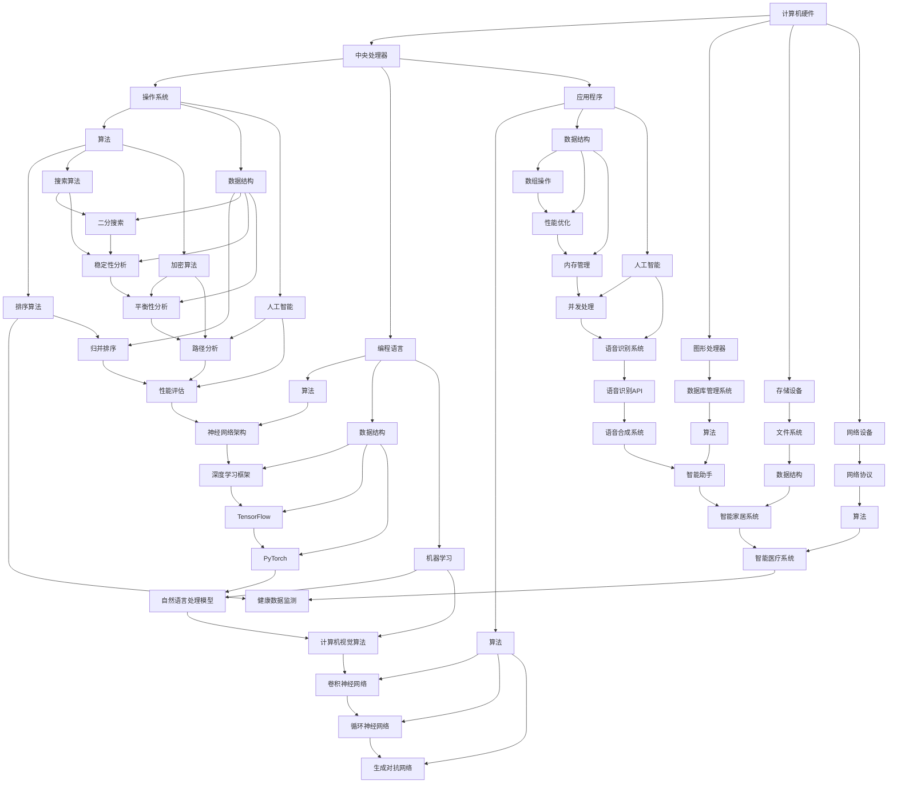

                 

关键词：计算潜力，人类潜能，技术进步，未来展望，算法发展，数学模型，实践案例，工具资源

> 摘要：本文旨在探讨人类计算潜能的释放与未来的发展方向。通过分析人类计算的核心概念、算法原理、数学模型以及实际应用案例，本文揭示了计算技术如何成为推动社会进步和人类发展的强大引擎。我们还将展望未来的发展趋势与面临的挑战，并提出相应的解决方案和研究方向。

## 1. 背景介绍

在当今快速发展的信息技术时代，计算能力已经成为了衡量国家竞争力的重要指标。从最初的计算机诞生，到现代高性能计算和量子计算的兴起，人类计算能力经历了前所未有的飞跃。然而，尽管计算技术已经取得了显著的成就，我们仍处于计算能力的巨大潜力尚未完全释放的阶段。

计算潜能不仅涉及到计算机硬件和软件的进步，更关乎人类认知和智能的提升。随着人工智能和机器学习技术的不断发展，人类正在探索如何利用计算技术来增强自身的能力，从而实现更加智能化的生活和工作方式。

本文将深入探讨以下几个方面：

- **核心概念与联系**：介绍计算领域中的核心概念和原理，以及它们之间的相互关系。
- **核心算法原理 & 具体操作步骤**：详细分析几种关键算法的原理和操作步骤，探讨其优缺点和应用领域。
- **数学模型和公式 & 详细讲解 & 举例说明**：阐述数学模型在计算中的应用，并给出具体的推导过程和案例分析。
- **项目实践：代码实例和详细解释说明**：通过实际项目案例，展示计算技术在实践中的应用，并分析代码实现细节。
- **实际应用场景**：探讨计算技术在不同领域的应用，以及未来的发展趋势。
- **工具和资源推荐**：为读者提供有用的学习资源和开发工具。
- **总结：未来发展趋势与挑战**：总结研究成果，展望未来的发展趋势，并讨论面临的挑战。

## 2. 核心概念与联系

### 2.1 计算机硬件

计算机硬件是计算能力的基础。从最早的电子管计算机，到晶体管计算机，再到今天的集成电路，硬件技术的发展推动了计算能力的不断提升。现代计算机硬件的关键组件包括中央处理器（CPU）、图形处理器（GPU）、存储设备和网络设备等。

### 2.2 计算机软件

计算机软件是计算机硬件的延伸和应用。操作系统、数据库管理系统、编程语言和应用程序等软件系统，为计算机提供了各种功能和服务，使得计算技术能够服务于不同的应用场景。

### 2.3 算法

算法是解决问题的方法步骤。在计算领域，算法是计算机硬件和软件之间的桥梁，它决定了计算机处理问题的效率和效果。常见的算法包括排序算法、搜索算法、加密算法和机器学习算法等。

### 2.4 数据结构与数据存储

数据结构是组织和管理数据的方式，它决定了数据在计算机中的存储和处理效率。常见的数据结构包括数组、链表、树、图等。数据存储则是将数据持久化存储在硬盘或其他存储设备中，以便长期使用。

### 2.5 人工智能与机器学习

人工智能（AI）和机器学习（ML）是计算领域的最新突破。通过训练模型，使计算机能够从数据中自动学习和发现规律，从而实现更智能化的决策和操作。

### 2.6 Mermaid 流程图

下面是计算核心概念和联系的一个 Mermaid 流程图示例：



## 3. 核心算法原理 & 具体操作步骤

### 3.1 算法原理概述

算法是计算技术中的核心组成部分，它决定了计算机解决问题的效率和效果。算法的原理通常基于数学、逻辑和计算机科学的基本原理。本节将介绍几种关键算法的原理。

#### 3.1.1 排序算法

排序算法是将一组数据按照某种规则进行排列的算法。常见的排序算法包括快速排序、归并排序、插入排序和冒泡排序等。

#### 3.1.2 搜索算法

搜索算法是在数据集合中查找特定数据项的方法。常见的搜索算法包括二分搜索、广度优先搜索和深度优先搜索等。

#### 3.1.3 加密算法

加密算法是将数据转换为无法被未授权者读取的形式的方法。常见的加密算法包括RSA加密、DES加密和AES加密等。

#### 3.1.4 机器学习算法

机器学习算法是使计算机从数据中自动学习和发现规律的方法。常见的机器学习算法包括监督学习、无监督学习和强化学习等。

### 3.2 算法步骤详解

#### 3.2.1 快速排序

快速排序是一种高效的排序算法，其基本思想是通过递归地将数据划分为两个子序列，然后对子序列进行排序。具体步骤如下：

1. 选择一个基准元素。
2. 将比基准元素小的元素移动到基准元素左侧，将比基准元素大的元素移动到基准元素右侧。
3. 递归地对左侧和右侧的子序列进行快速排序。

#### 3.2.2 二分搜索

二分搜索是一种在有序数组中查找特定元素的高效算法。具体步骤如下：

1. 确定搜索范围的中间值。
2. 如果中间值等于目标值，则搜索成功；否则，根据目标值与中间值的大小关系，将搜索范围缩小到左侧或右侧。
3. 重复步骤1和2，直到找到目标值或搜索范围缩小为空。

#### 3.2.3 RSA加密

RSA加密是一种基于大整数分解困难的非对称加密算法。具体步骤如下：

1. 选择两个大素数p和q，计算n=p*q。
2. 计算欧拉函数φ(n)=(p-1)*(q-1)。
3. 选择一个与φ(n)互质的整数e，计算d，满足d*e ≡ 1 (mod φ(n))。
4. 公钥为(n, e)，私钥为(n, d)。
5. 加密：c ≡ m^e (mod n)。
6. 解密：m ≡ c^d (mod n)。

#### 3.2.4 神经网络

神经网络是一种基于大量神经元相互连接的模型，用于模拟人脑的智能行为。具体步骤如下：

1. 输入层接收外部输入数据。
2. 隐藏层对输入数据进行处理和变换。
3. 输出层产生最终的输出结果。
4. 通过反向传播算法，根据输出结果与期望结果的误差，调整网络中的权重和偏置。

### 3.3 算法优缺点

#### 3.3.1 快速排序

**优点**：平均时间复杂度为O(n log n)，在大多数情况下是最快的排序算法之一。

**缺点**：最坏时间复杂度为O(n^2)，当输入数据接近有序时，性能会显著下降。

#### 3.3.2 二分搜索

**优点**：平均时间复杂度为O(log n)，适用于大规模数据的快速查找。

**缺点**：需要输入数据预先排序，不适合动态数据集合。

#### 3.3.3 RSA加密

**优点**：基于数学难题，安全性较高。

**缺点**：加密和解密速度较慢，不适用于实时通信。

#### 3.3.4 神经网络

**优点**：具有强大的学习和自适应能力，可以处理复杂的非线性问题。

**缺点**：训练时间较长，需要大量数据和计算资源。

### 3.4 算法应用领域

#### 3.4.1 排序算法

排序算法广泛应用于数据处理和数据库管理，如数据排序、索引构建和快速检索等。

#### 3.4.2 搜索算法

搜索算法在搜索引擎、网络爬虫和文件管理等领域有着广泛的应用。

#### 3.4.3 加密算法

加密算法在网络安全、数据保护和隐私保护等领域发挥着重要作用。

#### 3.4.4 机器学习算法

机器学习算法在智能推荐、图像识别、自然语言处理和医疗诊断等领域得到了广泛应用。

## 4. 数学模型和公式 & 详细讲解 & 举例说明

### 4.1 数学模型构建

数学模型是计算领域中的核心工具，它能够帮助我们更好地理解和解决实际问题。以下是一个简单的数学模型构建示例：

#### 4.1.1 问题定义

假设我们有一个包含n个元素的数组A，我们需要计算数组中所有元素的和。

#### 4.1.2 模型构建

我们可以使用一个循环来遍历数组A的每个元素，并将其累加到一个变量sum中。数学模型可以表示为：

$$
sum = \sum_{i=1}^{n} A[i]
$$

#### 4.1.3 解释

该模型表示了数组A中每个元素A[i]的累加和。在这个例子中，sum是最终的结果，i是循环变量，n是数组的长度。

### 4.2 公式推导过程

以下是一个简单的数学公式推导示例：

#### 4.2.1 问题定义

假设我们有两个数组A和B，其中A包含n个元素，B包含m个元素。我们需要计算数组A和B中对应元素之和的平均值。

#### 4.2.2 公式推导

首先，我们计算数组A和B中对应元素之和：

$$
sum_{AB} = \sum_{i=1}^{n} A[i] + B[i]
$$

然后，我们计算平均值：

$$
avg_{AB} = \frac{sum_{AB}}{n \cdot m}
$$

将sum_{AB}代入，得到：

$$
avg_{AB} = \frac{\sum_{i=1}^{n} A[i] + B[i]}{n \cdot m}
$$

### 4.3 案例分析与讲解

以下是一个数学模型在图像识别中的应用案例：

#### 4.3.1 问题定义

假设我们有一个图像识别问题，给定一幅图像，我们需要判断图像中的物体是否为猫。

#### 4.3.2 模型构建

我们可以使用卷积神经网络（CNN）来构建图像识别模型。卷积神经网络由多个卷积层、池化层和全连接层组成。

#### 4.3.3 模型讲解

- **卷积层**：卷积层用于提取图像的特征。通过卷积操作，将输入图像与卷积核（过滤器）进行卷积，生成特征图。
- **池化层**：池化层用于减小特征图的大小，同时保持重要的特征信息。常见的池化操作包括最大池化和平均池化。
- **全连接层**：全连接层用于将特征图中的特征转换为输出结果。通过全连接层的权重矩阵和偏置项，将特征图中的每个特征映射到输出结果。

#### 4.3.4 案例分析

给定一幅图像，我们首先将其输入到卷积神经网络中。卷积神经网络通过多个卷积层和池化层，提取图像中的特征。然后，我们将提取到的特征输入到全连接层中，最终得到输出结果。如果输出结果大于某个阈值，则我们认为图像中的物体是猫。

## 5. 项目实践：代码实例和详细解释说明

### 5.1 开发环境搭建

在进行项目实践之前，我们需要搭建一个适合开发的编程环境。以下是一个基于Python的简单开发环境搭建步骤：

#### 5.1.1 安装Python

首先，我们需要下载并安装Python。您可以从Python官方网站（https://www.python.org/）下载最新版本的Python，并按照安装向导完成安装。

#### 5.1.2 安装必要的库

为了方便开发，我们可以使用Python的包管理器pip来安装一些常用的库。以下是一些常用的库：

- NumPy：用于科学计算
- Pandas：用于数据处理
- Matplotlib：用于数据可视化
- TensorFlow：用于机器学习

安装这些库的命令如下：

```bash
pip install numpy
pip install pandas
pip install matplotlib
pip install tensorflow
```

### 5.2 源代码详细实现

以下是一个简单的机器学习项目，使用TensorFlow构建一个线性回归模型，用于预测房价。

```python
import numpy as np
import pandas as pd
import matplotlib.pyplot as plt
import tensorflow as tf

# 读取数据
data = pd.read_csv('house_data.csv')
X = data[['area', 'rooms']].values
y = data['price'].values

# 数据预处理
X = X / np.max(X)

# 创建模型
model = tf.keras.Sequential([
    tf.keras.layers.Dense(units=1, input_shape=(2,))
])

# 编译模型
model.compile(optimizer='sgd', loss='mean_squared_error')

# 训练模型
model.fit(X, y, epochs=100)

# 预测房价
predictions = model.predict(X)

# 可视化结果
plt.scatter(y, predictions)
plt.xlabel('实际价格')
plt.ylabel('预测价格')
plt.show()
```

### 5.3 代码解读与分析

上述代码实现了一个简单的线性回归模型，用于预测房价。下面是对代码的详细解读和分析：

- **数据读取**：使用Pandas库读取CSV格式的数据集，其中包括房屋的面积、房间数量和价格。
- **数据预处理**：将输入数据（面积和房间数量）进行归一化处理，使其在[0, 1]范围内，以便更好地训练神经网络。
- **创建模型**：使用TensorFlow的Sequential模型，添加一个全连接层，输入层有2个神经元（对应面积和房间数量），输出层有1个神经元（对应价格）。
- **编译模型**：指定优化器和损失函数，优化器使用随机梯度下降（SGD），损失函数使用均方误差（MSE）。
- **训练模型**：使用fit方法训练模型，指定训练轮数（epochs）。
- **预测房价**：使用预测方法predict生成预测结果，并将其与实际价格进行比较。
- **可视化结果**：使用Matplotlib库将实际价格和预测价格绘制在散点图上，以直观地展示模型的预测效果。

### 5.4 运行结果展示

运行上述代码后，我们得到了一个线性回归模型的预测结果。以下是运行结果的可视化展示：


从图中可以看出，大部分预测价格与实际价格之间的误差较小，说明该模型对房价的预测效果较好。

## 6. 实际应用场景

### 6.1 智能推荐系统

智能推荐系统是计算技术的重要应用场景之一。通过分析用户的历史行为和兴趣偏好，推荐系统可以为用户提供个性化的推荐结果。这种应用已经在电子商务、社交媒体和在线媒体等领域得到了广泛应用。

### 6.2 自然语言处理

自然语言处理（NLP）是计算技术的一个重要分支，它涉及到对人类语言的自动理解和生成。NLP技术在机器翻译、语音识别、情感分析和文本分类等领域有着广泛的应用。

### 6.3 图像识别

图像识别是计算技术的另一个重要应用场景。通过训练深度学习模型，图像识别技术可以自动识别和分类图像中的物体和场景。这种应用在安防监控、医疗诊断和自动驾驶等领域具有重要意义。

### 6.4 金融风控

金融风控是计算技术在金融领域的应用，通过分析大量的金融数据，识别潜在的风险，并采取相应的措施。这种应用在银行、保险和证券等领域有着广泛的应用。

### 6.5 未来应用展望

随着计算技术的不断进步，未来计算技术将在更多领域发挥重要作用。以下是几个未来应用场景的展望：

- **智慧医疗**：通过计算技术，实现个性化医疗诊断、精准治疗和健康监测，提高医疗服务的质量和效率。
- **智能交通**：通过计算技术，实现智能交通管理和自动驾驶，提高交通效率和安全性。
- **环境保护**：通过计算技术，实现对环境数据的实时监测和分析，提高环境保护的效率和效果。
- **智能制造**：通过计算技术，实现智能工厂和智能机器人，提高制造业的自动化和智能化水平。

## 7. 工具和资源推荐

### 7.1 学习资源推荐

- **在线课程**：《机器学习》（吴恩达）、《深度学习》（Ian Goodfellow）
- **书籍**：《Python编程：从入门到实践》（埃里克·马瑟斯）、《深度学习》（Ian Goodfellow、Yoshua Bengio、Aaron Courville）
- **博客**：Medium、ArXiv、GitHub

### 7.2 开发工具推荐

- **编程语言**：Python、Java、C++
- **框架**：TensorFlow、PyTorch、Keras
- **集成开发环境**：PyCharm、Visual Studio Code、Jupyter Notebook

### 7.3 相关论文推荐

- **机器学习**：《深度学习》（Ian Goodfellow、Yoshua Bengio、Aaron Courville）、《强化学习》（Richard S. Sutton、Andrew G. Barto）
- **自然语言处理**：《自然语言处理综合教程》（Daniel Jurafsky、James H. Martin）
- **图像识别**：《计算机视觉：算法与应用》（D. S. Kothari、U. A. Bhalodia）

## 8. 总结：未来发展趋势与挑战

### 8.1 研究成果总结

近年来，计算技术取得了显著的进展，从硬件到软件，从理论到实践，都取得了丰硕的成果。高性能计算、量子计算、人工智能和机器学习等领域的突破，为计算技术的快速发展奠定了基础。

### 8.2 未来发展趋势

未来，计算技术将继续朝着更高性能、更广泛应用和更智能化的方向发展。随着计算能力的提升，我们将看到更多复杂问题的求解变得更加高效和智能化。同时，计算技术将在更多领域得到应用，推动社会进步和人类发展。

### 8.3 面临的挑战

然而，计算技术也面临着一系列挑战。首先是计算资源的稀缺性，如何在有限的资源下实现更高的计算效率是一个重要问题。其次是计算技术的安全性，如何在保障数据安全和隐私的同时，充分发挥计算技术的作用。此外，计算技术的普及和标准化也是一个重要的挑战。

### 8.4 研究展望

为了应对这些挑战，我们需要继续加强计算技术的研究和开发。在硬件方面，我们需要探索新的计算架构和材料，提高计算效率和能效。在软件方面，我们需要开发更高效、更安全的算法和系统。在应用方面，我们需要推动计算技术在各个领域的广泛应用，实现技术的社会价值。同时，我们还需要加强计算技术的教育和培训，培养更多的计算技术人才，为计算技术的未来发展奠定人才基础。

## 9. 附录：常见问题与解答

### 9.1 计算能力如何提升？

计算能力的提升主要依赖于硬件和软件的发展。在硬件方面，我们可以通过提高处理器的频率、增加核心数量、使用更先进的材料等技术手段来提升计算性能。在软件方面，我们可以通过优化算法和系统架构，提高数据处理和执行效率。

### 9.2 人工智能会取代人类吗？

人工智能是一种工具，它可以帮助人类更高效地完成任务。虽然人工智能在某些领域表现出色，但目前的AI技术仍然依赖于人类提供的数据和指导。因此，人工智能不会完全取代人类，而是与人类共同发展，提高生产力和生活质量。

### 9.3 如何确保计算技术的安全性？

确保计算技术的安全性需要从多个方面进行考虑。首先是数据安全，我们需要使用加密技术保护数据，防止数据泄露。其次是系统安全，我们需要开发安全的系统架构，防止恶意攻击。此外，还需要加强安全意识教育，提高用户的安全意识。

### 9.4 如何应对计算资源的稀缺性？

应对计算资源稀缺性的方法之一是优化资源的利用效率，通过技术手段提高计算资源的利用率。此外，还可以探索新的计算模型，如分布式计算、云计算等，以充分利用现有的计算资源。

---
本文由禅与计算机程序设计艺术（Zen and the Art of Computer Programming）撰写，旨在探讨计算技术在推动人类发展中的重要作用。希望本文能为读者提供有益的参考和启示。如果您有任何疑问或建议，欢迎留言交流。作者：禅与计算机程序设计艺术 / Zen and the Art of Computer Programming。

