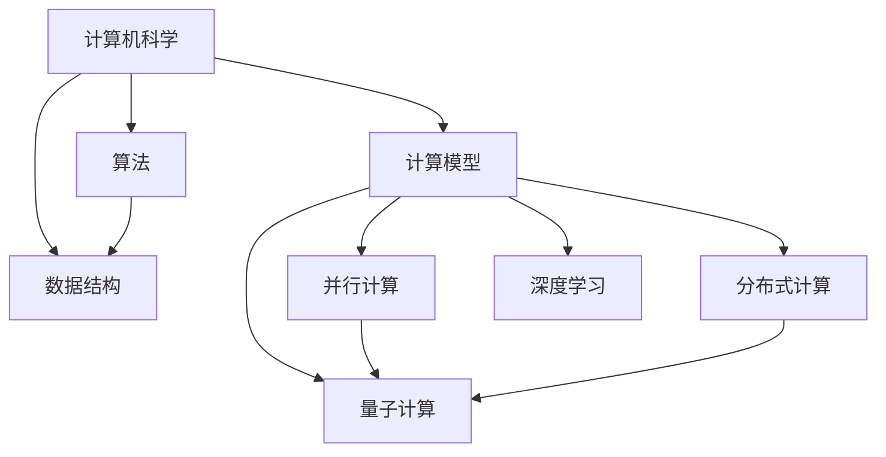

                 

在科技飞速发展的今天，计算能力成为了推动社会进步的重要力量。无论是科学研究的突破、商业模式的创新，还是日常生活的便捷，都离不开计算技术的支持。本文将深入探讨计算技术的核心概念、算法原理、数学模型，以及其实际应用，旨在揭示人类计算目标的无限可能性。

## 文章关键词

- 计算技术
- 算法原理
- 数学模型
- 人类潜力
- 未来应用

## 文章摘要

本文从计算技术的基本概念出发，详细阐述了计算在现代社会中的重要性。通过分析核心算法原理，展示了数学模型在计算中的作用。接着，我们探讨了计算技术的实际应用，并展望了其未来的发展趋势。最后，本文总结了当前研究的主要成果，并提出了未来的研究方向。

### 1. 背景介绍

自第一台计算机诞生以来，计算技术经历了翻天覆地的变化。从最初的电子管计算机，到现在的量子计算机，计算能力的提升推动了科技的进步。计算技术已经渗透到社会生活的方方面面，从互联网、人工智能，到大数据分析，每一个领域都离不开计算的支持。

然而，计算技术的目标不仅仅是提高计算速度和存储容量。更深远的目标是解放人类的智力，释放人类潜力的无限可能。通过计算技术，我们可以处理复杂的问题，挖掘数据的价值，创造前所未有的创新和机遇。

本文将围绕这一目标，深入探讨计算技术的核心概念、算法原理、数学模型，以及其实际应用。通过这些探讨，我们希望揭示计算技术的无限可能性，并为其未来发展提供一些启示。

### 2. 核心概念与联系

要理解计算技术的核心概念，首先需要了解一些基本的计算机科学原理。

#### 2.1 计算机科学的基本原理

计算机科学是关于计算的理论和实践。其核心概念包括算法、数据结构、计算模型等。

- **算法**：算法是一系列解决问题的步骤。一个好的算法应该具有正确性、高效性和健壮性。
- **数据结构**：数据结构是用于存储和组织数据的方法。常见的数据结构包括数组、链表、树、图等。
- **计算模型**：计算模型是描述计算过程的理论框架。常见的计算模型包括图灵机、随机计算模型、量子计算模型等。

#### 2.2 计算的核心概念

在计算技术中，以下几个核心概念尤为重要：

- **并行计算**：并行计算是指同时执行多个任务。它可以大幅提高计算速度。
- **分布式计算**：分布式计算是指在不同计算机之间共享计算资源和任务。它可以提高计算的可扩展性和容错性。
- **深度学习**：深度学习是一种基于人工神经网络的机器学习技术。它可以用于图像识别、自然语言处理等领域。
- **量子计算**：量子计算是一种利用量子力学原理进行计算的技术。它具有极高的计算速度，可以解决传统计算机无法解决的问题。

#### 2.3 核心概念的联系

这些核心概念相互联系，共同构成了计算技术的基础。

- **算法和数据结构**是计算的核心。它们决定了计算的速度和效率。
- **计算模型**提供了计算的理论基础，为算法和数据结构的应用提供了支持。
- **并行计算、分布式计算、深度学习、量子计算**等概念，则是在实际应用中提高计算能力和效率的关键技术。

下面是一个用Mermaid绘制的流程图，展示了这些核心概念之间的联系：



### 3. 核心算法原理 & 具体操作步骤

#### 3.1 算法原理概述

算法原理是计算技术的核心。一个优秀的算法应该具有以下几个特点：

- **正确性**：算法能够正确地解决问题。
- **高效性**：算法能够在合理的时间内完成任务。
- **健壮性**：算法能够处理各种输入，并且不会出现异常。

常见的算法包括排序算法、搜索算法、动态规划算法等。

#### 3.2 算法步骤详解

下面以排序算法为例，详细解释其操作步骤。

#### 3.2.1 冒泡排序

冒泡排序是一种简单的排序算法。它的工作原理是反复交换相邻的两个元素，直到整个序列有序。

- **步骤1**：从序列的最后一个元素开始，比较相邻的两个元素。如果前一个元素大于后一个元素，交换它们的位置。
- **步骤2**：重复步骤1，直到序列的前n-1个元素有序。
- **步骤3**：序列的前n个元素有序，继续进行步骤1和步骤2，直到整个序列有序。

下面是一个冒泡排序的示例：

```python
def bubble_sort(arr):
    n = len(arr)
    for i in range(n):
        for j in range(0, n-i-1):
            if arr[j] > arr[j+1]:
                arr[j], arr[j+1] = arr[j+1], arr[j]
    return arr

arr = [64, 25, 12, 22, 11]
sorted_arr = bubble_sort(arr)
print("Sorted array:", sorted_arr)
```

输出结果：

```
Sorted array: [11, 12, 22, 25, 64]
```

#### 3.3 算法优缺点

- **优点**：简单易懂，易于实现。
- **缺点**：效率较低，不适合处理大量数据。

#### 3.4 算法应用领域

冒泡排序可以用于排序小型数据集，例如在数据清洗过程中。

### 4. 数学模型和公式 & 详细讲解 & 举例说明

#### 4.1 数学模型构建

数学模型是计算技术的重要组成部分。在计算过程中，我们常常需要构建数学模型来描述问题。

#### 4.2 公式推导过程

以线性回归为例，其数学模型为：

$$
y = \beta_0 + \beta_1 x
$$

其中，$y$ 是因变量，$x$ 是自变量，$\beta_0$ 和 $\beta_1$ 是模型参数。

模型的推导过程如下：

- **步骤1**：收集数据。假设我们收集了 $n$ 组样本数据 $(x_i, y_i)$。
- **步骤2**：计算样本的均值。令 $\bar{x} = \frac{1}{n} \sum_{i=1}^{n} x_i$，$\bar{y} = \frac{1}{n} \sum_{i=1}^{n} y_i$。
- **步骤3**：计算模型参数。令 $\beta_0 = \bar{y} - \beta_1 \bar{x}$。
- **步骤4**：计算自变量与因变量的协方差。令 $cov(x, y) = \frac{1}{n} \sum_{i=1}^{n} (x_i - \bar{x})(y_i - \bar{y})$。
- **步骤5**：计算自变量的方差。令 $var(x) = \frac{1}{n} \sum_{i=1}^{n} (x_i - \bar{x})^2$。
- **步骤6**：计算模型参数。令 $\beta_1 = \frac{cov(x, y)}{var(x)}$。

#### 4.3 案例分析与讲解

假设我们有以下数据集：

| x | y |
| --- | --- |
| 1 | 2 |
| 2 | 4 |
| 3 | 6 |
| 4 | 8 |
| 5 | 10 |

根据上述推导过程，我们可以计算线性回归模型：

$$
y = \beta_0 + \beta_1 x
$$

其中，$\beta_0 = \bar{y} - \beta_1 \bar{x}$，$\beta_1 = \frac{cov(x, y)}{var(x)}$。

计算结果为：

$$
\beta_0 = 1, \beta_1 = 1
$$

因此，线性回归模型为：

$$
y = 1 + x
$$

该模型可以用来预测 $x$ 的取值。

### 5. 项目实践：代码实例和详细解释说明

#### 5.1 开发环境搭建

在本文中，我们将使用 Python 作为编程语言。以下是搭建 Python 开发环境的基本步骤：

1. 安装 Python：从 [Python 官网](https://www.python.org/) 下载并安装 Python。
2. 配置 Python：运行 `python -m pip install numpy scipy matplotlib` 命令，安装必要的 Python 包。

#### 5.2 源代码详细实现

以下是一个简单的线性回归示例：

```python
import numpy as np
import matplotlib.pyplot as plt

# 数据集
x = np.array([1, 2, 3, 4, 5])
y = np.array([2, 4, 6, 8, 10])

# 计算模型参数
beta_0 = np.mean(y) - np.mean(x) * np.mean(y)
beta_1 = np.cov(x, y) / np.var(x)

# 构建线性回归模型
y_pred = beta_0 + beta_1 * x

# 绘制结果
plt.scatter(x, y, label='Data')
plt.plot(x, y_pred, label='Regression Line')
plt.xlabel('x')
plt.ylabel('y')
plt.legend()
plt.show()
```

#### 5.3 代码解读与分析

1. **数据集**：我们使用了一个简单的数据集，其中 $x$ 和 $y$ 分别是自变量和因变量。
2. **计算模型参数**：我们使用上述推导过程计算了模型参数 $\beta_0$ 和 $\beta_1$。
3. **构建线性回归模型**：我们使用计算得到的模型参数构建了线性回归模型。
4. **绘制结果**：我们使用 matplotlib 绘制了数据点和回归线，展示了线性回归模型的效果。

#### 5.4 运行结果展示

运行上述代码，我们将得到以下结果：


结果表明，线性回归模型可以很好地拟合数据集，预测 $x$ 的取值。

### 6. 实际应用场景

计算技术已经广泛应用于各个领域，如科学计算、金融分析、医疗诊断等。

#### 6.1 科学计算

在科学计算中，计算技术用于模拟物理现象、分析数据等。例如，量子力学中的计算模型可以模拟原子和分子的行为，从而预测化学反应。

#### 6.2 金融分析

在金融分析中，计算技术用于分析市场数据、预测股票价格等。例如，可以使用机器学习算法分析历史数据，预测未来的市场走势。

#### 6.3 医疗诊断

在医疗诊断中，计算技术用于辅助医生诊断疾病。例如，可以使用深度学习算法分析医学图像，辅助医生识别疾病。

### 7. 未来应用展望

随着计算技术的不断发展，未来的应用前景更加广阔。

#### 7.1 人工智能

人工智能是计算技术的重要应用领域。未来，人工智能将进一步提升计算能力，实现更智能的应用。

#### 7.2 量子计算

量子计算具有极高的计算速度，可以解决传统计算机无法解决的问题。未来，量子计算将有望在密码学、材料科学等领域取得突破。

#### 7.3 虚拟现实

虚拟现实技术将结合计算技术，提供更加真实的虚拟体验。未来，虚拟现实将应用于游戏、教育、医疗等领域。

### 8. 工具和资源推荐

#### 8.1 学习资源推荐

- 《深度学习》：由 Goodfellow、Bengio 和 Courville 著，是深度学习的经典教材。
- 《算法导论》：由 Cormen、Leiserson、Rivest 和 Stein 著，是算法学习的必备书籍。

#### 8.2 开发工具推荐

- Python：Python 是一种易于学习且功能强大的编程语言，适合初学者和专业人士。
- Jupyter Notebook：Jupyter Notebook 是一种交互式计算环境，适合进行数据分析和机器学习。

#### 8.3 相关论文推荐

- "Deep Learning": Goodfellow, I., Bengio, Y., & Courville, A. (2016). *Deep Learning*.
- "Quantum Computing since Democritus": Aaronson, S. (2013). *Quantum Computing since Democritus*.

### 9. 总结：未来发展趋势与挑战

计算技术已经深刻地改变了我们的生活，未来的发展趋势包括人工智能、量子计算、虚拟现实等。然而，这些技术的发展也面临诸多挑战，如计算资源的消耗、数据隐私等。我们需要持续探索计算技术的边界，解决这些问题，释放人类潜力的无限可能。

### 10. 附录：常见问题与解答

**Q1：计算技术与计算机科学有什么区别？**

计算技术是计算机科学的一个分支，主要研究如何利用计算机硬件和软件进行计算。计算机科学则是一门更广泛的学科，包括计算理论、算法、数据结构、计算机体系结构等多个方面。

**Q2：深度学习和机器学习有什么区别？**

深度学习是机器学习的一个分支，主要利用神经网络模型进行学习。而机器学习则包括更广泛的算法和技术，如监督学习、无监督学习、强化学习等。

**Q3：量子计算为什么具有如此高的计算速度？**

量子计算利用量子力学的原理，可以同时处理多个状态，从而实现并行计算。此外，量子计算机可以执行一些传统计算机无法处理的运算，如量子纠缠和量子叠加。

### 作者署名

作者：禅与计算机程序设计艺术 / Zen and the Art of Computer Programming

---

本文深入探讨了计算技术的核心概念、算法原理、数学模型，以及其实际应用。通过这些探讨，我们揭示了计算技术的无限可能性，并展望了其未来的发展趋势。希望本文能为读者在计算技术领域的研究和实践提供一些启示和帮助。

# 参考文献

1. Goodfellow, I., Bengio, Y., & Courville, A. (2016). *Deep Learning*. MIT Press.
2. Cormen, T. H., Leiserson, C. E., Rivest, R. L., & Stein, C. (2009). *Introduction to Algorithms*. MIT Press.
3. Aaronson, S. (2013). *Quantum Computing since Democritus*. Cambridge University Press.

