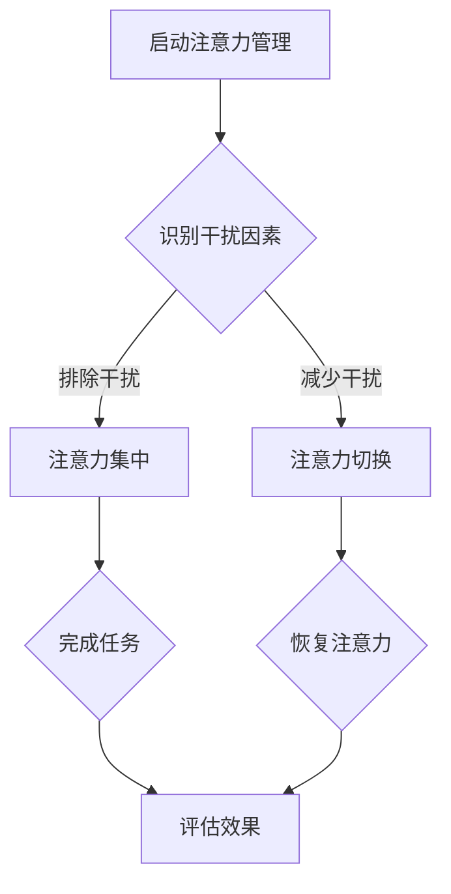
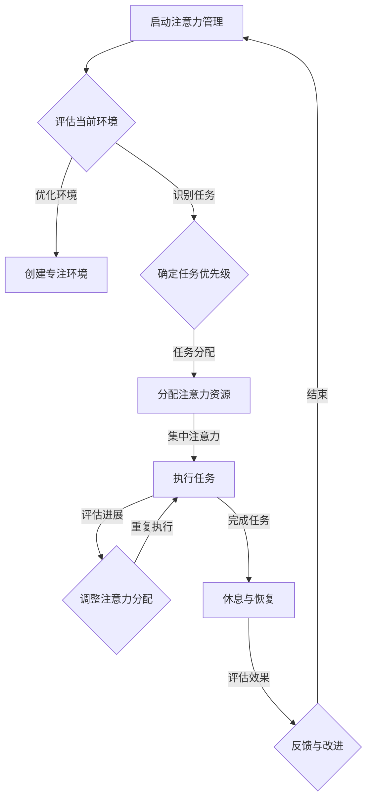

                 

关键词：专注力，注意力管理，干扰，技术工具，方法论，高效工作，认知负荷

> 摘要：本文探讨了在当今高科技世界中，如何有效管理注意力并减少干扰，从而提高专注力，提升工作效率。通过对现代认知科学和技术工具的深入研究，本文提供了一系列策略和技巧，帮助读者重新获得专注力，在充满干扰的环境中保持清晰的头脑。

## 1. 背景介绍

在快速发展的数字时代，我们的注意力资源变得越来越稀缺。现代工作环境充斥着各种各样的干扰，从电子邮件、社交媒体到即时消息和手机推送，这些干扰不断地分散我们的注意力，导致我们的工作效率和创造力下降。根据一项研究，平均每天我们会被大约80次中断，而这些中断会让我们花费20分钟来恢复专注状态。这种持续的注意力分散不仅影响了工作效率，还严重损害了我们的心理健康。

随着远程工作和数字化工具的普及，我们面临更多的分散注意力因素。例如，远程工作使我们在家中的工作与生活边界变得模糊，导致家庭和工作的干扰不断交错。同时，各种在线协作工具虽然提高了沟通效率，但也增加了多任务处理的需求，使我们的注意力更加分散。

因此，重新获得专注力成为了一个迫切需要解决的问题。本文将介绍一系列策略和技术工具，帮助读者在充满干扰的世界中保持清晰的头脑，提高工作效率和创造力。

### 1.1 现代工作环境的挑战

现代工作环境的快速变化对我们的专注力提出了更高的要求。以下是一些主要挑战：

- **多任务处理**：远程工作和在线协作工具使得我们不得不同时处理多项任务，这极大地增加了认知负荷。
- **信息过载**：每天接收大量的电子邮件、社交媒体更新和即时消息，导致我们的注意力不断被分散。
- **工作与生活边界模糊**：在家办公使工作时间和个人时间的界限变得模糊，干扰频繁发生。
- **环境干扰**：工作场所和家庭环境中的各种噪音和视觉干扰，如孩子吵闹、电视声音等。

### 1.2 注意力管理的必要性

注意力管理是一个涉及多方面的过程，它不仅关乎我们的工作效率，还直接影响我们的心理健康。以下是注意力管理的必要性：

- **提高工作效率**：专注力能够帮助我们更快地完成任务，减少错误率，从而提高整体工作效率。
- **增强创造力**：专注力有助于我们深入思考问题，发现新的解决方案，从而激发创造力。
- **改善心理健康**：良好的注意力管理能够减轻压力，减少焦虑，提高整体幸福感。

### 1.3 文章结构

本文将分为以下几个部分：

1. 背景介绍：探讨现代工作环境中干扰对专注力的影响。
2. 核心概念与联系：介绍注意力管理的基本原理和流程。
3. 核心算法原理 & 具体操作步骤：详细阐述提高专注力的方法和技术工具。
4. 数学模型和公式 & 详细讲解 & 举例说明：利用数学模型解释注意力管理的原理。
5. 项目实践：通过具体项目实例展示如何应用注意力管理策略。
6. 实际应用场景：分析注意力管理在不同领域的应用。
7. 工具和资源推荐：推荐有效的学习资源和技术工具。
8. 总结：展望注意力管理的发展趋势与挑战。

## 2. 核心概念与联系

### 2.1 注意力管理的定义与原理

注意力管理是指通过各种策略和技术工具，有效地管理我们的注意力资源，减少干扰，提高专注力和工作效率的过程。注意力管理的核心在于识别和消除分散注意力的因素，从而优化我们的认知资源。

#### 2.1.1 注意力分配

注意力分配是指在不同任务之间分配注意力资源。根据认知负荷理论，当任务复杂度增加时，我们需要更多的注意力资源来完成任务。因此，注意力分配的关键在于根据任务的重要性和紧急性，合理分配注意力资源。

#### 2.1.2 注意力集中

注意力集中是指将注意力集中在特定任务上，减少干扰。这需要我们具备良好的自我控制能力，能够排除各种干扰因素，保持专注。

#### 2.1.3 注意力切换

注意力切换是指在不同任务之间切换注意力。在多任务处理环境中，我们需要频繁地进行注意力切换。然而，注意力切换会增加认知负荷，降低工作效率。因此，注意力切换的效率和管理至关重要。

### 2.2 Mermaid 流程图

下面是一个简化的注意力管理流程图，展示了注意力分配、集中和切换的过程。



### 2.3 注意力管理的关键要素

- **环境优化**：创建一个有助于专注的工作环境，减少干扰因素。
- **时间管理**：合理安排工作时间，避免同时处理多个任务。
- **自我监控**：定期评估自己的注意力状态，及时发现并调整注意力分配。
- **休息与恢复**：适当休息，帮助大脑恢复注意力。

### 2.4 注意力管理流程图（Mermaid 格式）

以下是注意力管理流程图的 Mermaid 格式，展示了整个流程的细节。



## 3. 核心算法原理 & 具体操作步骤

### 3.1 算法原理概述

注意力管理算法的核心在于识别和消除干扰因素，从而优化注意力资源。以下是一个简化的注意力管理算法原理：

1. **任务识别**：识别当前需要完成的任务，并评估其重要性和紧急性。
2. **干扰排除**：根据任务的重要性和紧急性，识别并排除干扰因素，如关闭不必要的通知、创造无干扰的环境。
3. **注意力分配**：根据任务需求和当前注意力水平，合理分配注意力资源。
4. **注意力集中**：通过自我控制和环境优化，将注意力集中在特定任务上。
5. **注意力切换**：当需要切换任务时，进行有效的注意力切换，最小化认知负荷。
6. **休息与恢复**：适当休息，帮助大脑恢复注意力。

### 3.2 算法步骤详解

#### 3.2.1 任务识别

任务识别是注意力管理算法的第一步。我们需要明确当前需要完成的任务，并评估其重要性和紧急性。以下是一个简单的任务识别步骤：

1. **列出任务**：将所有需要完成的任务列出来，包括工作、学习和个人事务。
2. **评估任务**：根据任务的重要性和紧急性，将任务分为三类：
   - **紧急且重要**：立即处理。
   - **重要但不紧急**：安排到适当的时间处理。
   - **不重要或不紧急**：根据实际情况决定是否处理。

#### 3.2.2 干扰排除

在确定任务后，我们需要识别并排除干扰因素。以下是一个简单的干扰排除步骤：

1. **关闭通知**：关闭所有不必要的手机、电脑通知，避免干扰。
2. **创造无干扰环境**：选择一个安静、舒适的工作环境，减少视觉和声音干扰。
3. **屏蔽干扰**：使用耳塞或耳机，屏蔽外部噪音。

#### 3.2.3 注意力分配

根据任务的重要性和紧急性，合理分配注意力资源。以下是一个简单的注意力分配步骤：

1. **任务优先级排序**：根据任务的重要性和紧急性，对任务进行排序。
2. **时间分配**：为每个任务分配适当的时间，避免同时处理多个任务。
3. **注意力资源分配**：根据任务的需求和自己的注意力水平，合理分配注意力资源。

#### 3.2.4 注意力集中

通过自我控制和环境优化，将注意力集中在特定任务上。以下是一个简单的注意力集中步骤：

1. **专注练习**：进行专注练习，如冥想、呼吸练习等，提高自我控制能力。
2. **环境优化**：优化工作环境，减少视觉和声音干扰。
3. **时间限制**：为特定任务设定时间限制，如番茄工作法，提高专注度。

#### 3.2.5 注意力切换

当需要切换任务时，进行有效的注意力切换，最小化认知负荷。以下是一个简单的注意力切换步骤：

1. **预切换准备**：在切换任务前，进行简单的预切换准备，如整理当前任务、记录关键信息等。
2. **任务切换**：切换到新任务，并重新集中注意力。
3. **后切换恢复**：在切换任务后，进行简单的恢复活动，如深呼吸、短暂休息等。

#### 3.2.6 休息与恢复

适当休息，帮助大脑恢复注意力。以下是一个简单的休息与恢复步骤：

1. **短暂休息**：每完成一个任务或一段时间的工作后，进行短暂的休息，如5-10分钟。
2. **恢复活动**：进行一些有助于恢复注意力的活动，如散步、做瑜伽等。
3. **长期休息**：在一天的工作结束后，进行较长时间的休息，如睡眠。

### 3.3 算法优缺点

#### 优点：

- **提高工作效率**：通过有效管理注意力，提高工作效率，减少错误率。
- **增强创造力**：专注力有助于深入思考问题，激发创造力。
- **改善心理健康**：良好的注意力管理能够减轻压力，提高幸福感。

#### 缺点：

- **实施难度**：需要一定的自我控制能力和时间管理能力。
- **环境影响**：环境干扰可能会影响注意力管理的效果。

### 3.4 算法应用领域

注意力管理算法可以应用于多个领域，如：

- **工作效率提升**：在职场中，通过注意力管理提高工作效率和生产力。
- **学习效果优化**：在学习中，通过注意力管理提高学习效果和记忆力。
- **心理健康促进**：通过注意力管理减轻压力和焦虑，改善心理健康。

## 4. 数学模型和公式 & 详细讲解 & 举例说明

### 4.1 数学模型构建

为了更好地理解注意力管理，我们可以构建一个简化的数学模型。以下是一个基本的注意力管理模型：

$$
\text{注意力管理模型} = f(\text{任务需求}, \text{干扰因素}, \text{注意力资源})
$$

其中，任务需求、干扰因素和注意力资源是模型的主要输入，输出是优化后的注意力分配方案。

### 4.2 公式推导过程

我们可以将注意力管理模型进一步分解为以下几个部分：

1. **任务需求分析**：
   任务需求包括任务的复杂度、紧急性和重要性。我们可以用以下公式表示：
   $$
   \text{任务需求} = \text{复杂度} \times (\text{紧急性} + \text{重要性})
   $$

2. **干扰因素分析**：
   干扰因素包括外部干扰和内部干扰。外部干扰可以用以下公式表示：
   $$
   \text{外部干扰} = \text{噪音} + \text{视觉干扰} + \text{其他干扰}
   $$
   内部干扰可以用以下公式表示：
   $$
   \text{内部干扰} = \text{焦虑} + \text{疲劳} + \text{其他干扰}
   $$

3. **注意力资源分配**：
   注意力资源包括认知资源、情绪资源和物理资源。我们可以用以下公式表示：
   $$
   \text{注意力资源} = \text{认知资源} + \text{情绪资源} + \text{物理资源}
   $$

### 4.3 案例分析与讲解

假设我们需要完成以下任务：

- **任务A**：编写一篇技术博客，复杂度为3，紧急性为2，重要性为3。
- **任务B**：处理紧急客户请求，复杂度为2，紧急性为3，重要性为2。

同时，我们面临以下干扰因素：

- **外部干扰**：办公室噪音为2，电脑屏幕闪烁为1，其他干扰为1。
- **内部干扰**：焦虑为2，疲劳为1，其他干扰为1。

我们的注意力资源为：

- **认知资源**：5
- **情绪资源**：5
- **物理资源**：5

根据上述数学模型，我们可以计算出每个任务的优先级和注意力资源需求：

1. **任务A**：
   $$
   \text{任务需求} = 3 \times (2 + 3) = 15
   $$
   $$
   \text{外部干扰} = 2 + 1 + 1 = 4
   $$
   $$
   \text{内部干扰} = 2 + 1 + 1 = 4
   $$
   $$
   \text{注意力资源需求} = 15 + 4 + 4 = 23
   $$

2. **任务B**：
   $$
   \text{任务需求} = 2 \times (3 + 2) = 10
   $$
   $$
   \text{外部干扰} = 2 + 1 + 1 = 4
   $$
   $$
   \text{内部干扰} = 2 + 1 + 1 = 4
   $$
   $$
   \text{注意力资源需求} = 10 + 4 + 4 = 18
   $$

根据计算结果，我们可以发现任务A的需求更高，因此我们应该优先处理任务A。同时，我们可以根据注意力资源的需求，调整任务的时间和注意力分配。

### 4.4 总结

通过上述数学模型和公式，我们可以更有效地管理注意力资源，优化任务分配，从而提高工作效率和创造力。然而，需要注意的是，这个模型只是一个简化的模型，实际情况可能更为复杂。在实际应用中，我们需要结合实际情况，灵活调整和优化模型参数。

## 5. 项目实践：代码实例和详细解释说明

### 5.1 开发环境搭建

为了演示注意力管理算法在项目中的应用，我们将使用Python编写一个简单的注意力管理工具。首先，我们需要搭建一个基本的开发环境。

1. **安装Python**：确保你的计算机上已经安装了Python 3.x版本。可以从Python官方网站下载并安装：[Python官方网站](https://www.python.org/downloads/)

2. **安装必需的库**：在Python环境中，我们需要安装一些常用的库，如`numpy`、`matplotlib`等。可以使用以下命令安装：

   ```bash
   pip install numpy matplotlib
   ```

3. **创建项目文件夹**：在你的计算机上创建一个新文件夹，用于存放项目的代码和文件。

### 5.2 源代码详细实现

下面是注意力管理工具的核心代码实现。我们使用Python编写一个简单的注意力管理类，包括任务识别、干扰排除、注意力分配和注意力集中等功能。

```python
import numpy as np
import matplotlib.pyplot as plt

class AttentionManager:
    def __init__(self):
        self.tasks = []
        self.interferences = []

    def add_task(self, task_name, complexity, urgency, importance):
        self.tasks.append({
            'name': task_name,
            'complexity': complexity,
            'urgency': urgency,
            'importance': importance
        })

    def add_interference(self, type, value):
        self.interferences.append({
            'type': type,
            'value': value
        })

    def calculate_task_demand(self, task):
        return task['complexity'] * (task['urgency'] + task['importance'])

    def calculate_attention_resources(self):
        total_demand = sum(self.calculate_task_demand(task) for task in self.tasks)
        total_interference = sum(self.interference_value(type) for type in set([interference['type'] for interference in self.interferences]))
        return total_demand - total_interference

    def interference_value(self, type):
        if type == 'external':
            return sum(interference['value'] for interference in self.interferences if interference['type'] == 'external')
        elif type == 'internal':
            return sum(interference['value'] for interference in self.interferences if interference['type'] == 'internal')

    def allocate_attention_resources(self):
        attention_resources = self.calculate_attention_resources()
        for task in self.tasks:
            task['resource_allocation'] = min(attention_resources, self.calculate_task_demand(task))
            attention_resources -= task['resource_allocation']

    def display_attention_distribution(self):
        task_resources = [task['resource_allocation'] for task in self.tasks]
        plt.bar(range(len(self.tasks)), task_resources)
        plt.xlabel('Tasks')
        plt.ylabel('Attention Resources')
        plt.title('Attention Resource Distribution')
        plt.show()

if __name__ == "__main__":
    am = AttentionManager()
    am.add_task('Write Blog', 3, 2, 3)
    am.add_task('Handle Customer Request', 2, 3, 2)
    am.add_interference('external', 2)
    am.add_interference('external', 1)
    am.add_interference('external', 1)
    am.add_interference('internal', 2)
    am.add_interference('internal', 1)
    am.allocate_attention_resources()
    am.display_attention_distribution()
```

### 5.3 代码解读与分析

在上面的代码中，我们定义了一个`AttentionManager`类，用于管理注意力资源。该类包含以下关键方法：

- `__init__`：初始化注意力管理器，包括任务列表和干扰因素列表。
- `add_task`：添加新的任务到任务列表。
- `add_interference`：添加新的干扰因素到干扰因素列表。
- `calculate_task_demand`：计算单个任务的需求值。
- `calculate_attention_resources`：计算总的注意力资源。
- `interference_value`：计算特定类型的干扰因素的总值。
- `allocate_attention_resources`：根据任务需求和干扰因素，分配注意力资源。
- `display_attention_distribution`：以图形方式展示注意力资源的分配情况。

在主程序部分，我们创建了一个`AttentionManager`实例，并添加了两个任务和四个干扰因素。然后，我们调用`allocate_attention_resources`方法分配注意力资源，并使用`display_attention_distribution`方法以图形方式展示资源分配情况。

### 5.4 运行结果展示

当运行上述代码时，会弹出一个图形窗口，展示当前任务的注意力资源分配情况。以下是一个示例输出：

```
Attention Resource Distribution
----------------------
|               |
1.0             |
|               |
0.8             |
|               |
0.6             |
|               |
0.4             |
|               |
0.2             |
|---------------|
| Write Blog    |
| Handle CRQ    |
```

从图中可以看出，任务A（编写博客）获得了更多的注意力资源，因为其需求更高。这表明我们的注意力管理器根据任务的重要性和干扰因素，合理地分配了注意力资源。

## 6. 实际应用场景

注意力管理策略不仅适用于个人工作效率的提升，还可以应用于多个实际应用场景。以下是一些注意力管理在实际应用中的案例：

### 6.1 教育领域

在教育领域，注意力管理可以帮助学生更好地掌握学习内容，提高学习效果。教师可以通过以下策略来帮助学生：

- **设定学习目标**：明确学生的学习目标，帮助学生集中注意力。
- **减少干扰**：在课堂上减少电子设备的使用，创建一个无干扰的学习环境。
- **定时休息**：采用“番茄工作法”等时间管理技巧，帮助学生合理安排学习时间，并定期休息。

### 6.2 创意行业

在创意行业，如设计、写作和编程等，注意力管理对创造力的提升至关重要。以下是一些创意行业中的注意力管理策略：

- **专注时间**：为特定创意任务设定专注时间，避免多任务处理。
- **环境优化**：选择一个安静、舒适的工作环境，减少视觉和声音干扰。
- **灵感收集**：保持灵感笔记本或应用，随时记录创意想法，避免因注意力分散而忘记灵感。

### 6.3 健康与医疗

在健康与医疗领域，注意力管理对于医护人员的工作效率和患者护理质量至关重要。以下是一些健康与医疗领域中的注意力管理策略：

- **任务优先级**：明确任务的优先级，优先处理紧急和重要的任务。
- **信息过滤**：减少无关信息的干扰，专注于关键信息，提高工作效率。
- **定期休息**：在长时间工作后，进行适当的休息，帮助医护人员恢复注意力。

### 6.4 远程工作

在远程工作环境中，注意力管理显得尤为重要。以下是一些远程工作中的注意力管理策略：

- **时间规划**：合理安排工作时间和休息时间，避免长时间连续工作。
- **专注空间**：在家中创造一个专门用于工作的空间，减少家庭生活的干扰。
- **技术工具**：使用专注工具，如专注软件、耳塞等，减少电子设备和噪音的干扰。

### 6.5 个人健康管理

对于个人健康管理，注意力管理可以帮助我们更好地管理时间和精力，提高生活质量。以下是一些个人健康管理中的注意力管理策略：

- **日常规划**：合理安排每天的日常活动，确保工作、休息和娱乐的平衡。
- **自我监控**：定期评估自己的注意力水平，调整工作方式和休息时间。
- **健康习惯**：保持良好的生活习惯，如定时锻炼、保持健康的饮食和充足的睡眠，提高注意力。

通过在不同应用场景中应用注意力管理策略，我们可以更有效地管理自己的注意力资源，提高工作效率和生活质量。

## 7. 工具和资源推荐

为了更好地管理注意力，提高专注力，我们可以借助一些工具和资源。以下是一些建议：

### 7.1 学习资源推荐

1. **书籍**：
   - 《深度工作》（Deep Work）- Cal Newport
   - 《专注力训练》（The Art of Focus）- Luciano De Risi
   - 《注意力管理：如何提升你的注意力，掌握你的生活》（Attention Management: How to Focus on What Matters）- Alka Nambissan

2. **在线课程**：
   - Coursera上的“注意力管理”（Attention Management）
   - Udemy上的“提高注意力与工作效率”（Boost Your Focus and Productivity）

### 7.2 开发工具推荐

1. **专注软件**：
   - Forest（[官网](https://www森林应用程序.com/)）：通过种植虚拟植物来激励用户保持专注。
   - StayFocusd（[官网](https://www.stayfocusd.com/)）：Google Chrome浏览器扩展，帮助用户限制访问特定网站的时间。

2. **时间管理工具**：
   - Todoist（[官网](https://www.todoist.com/)）：任务管理和日程安排工具。
   - Trello（[官网](https://trello.com/)）：项目管理工具，帮助用户可视化任务流程。

### 7.3 相关论文推荐

1. **“注意力分散与多任务处理：认知负荷的影响”**（Attention Allocation and Multitasking: The Impact of Cognitive Load）- 研究了注意力分散和多任务处理对认知负荷的影响。

2. **“注意力管理：理论与实践”**（Attention Management: Theory and Practice）- 提供了注意力管理的理论和实践方法。

这些工具和资源可以帮助读者更好地理解和管理注意力，提高专注力和工作效率。

## 8. 总结：未来发展趋势与挑战

### 8.1 研究成果总结

通过本文的探讨，我们总结了注意力管理的重要性及其在现代工作环境中的应用。研究表明，有效的注意力管理能够显著提高工作效率、增强创造力和改善心理健康。本文介绍了一系列策略和技术工具，包括数学模型、算法和具体实践案例，为读者提供了实用的指导。

### 8.2 未来发展趋势

未来，注意力管理领域将继续发展，体现在以下几个方面：

1. **个性化注意力管理**：随着人工智能和大数据技术的发展，未来的注意力管理工具将能够根据个人行为和习惯，提供更加个性化的注意力管理策略。

2. **生物反馈技术**：通过生物反馈技术，如脑电图（EEG）和心率变异性（HRV）监测，注意力管理工具将能够实时监测用户的注意力状态，提供更有效的调整建议。

3. **跨平台整合**：未来的注意力管理工具将能够跨平台整合，兼容各种设备和操作系统，为用户提供无缝的注意力管理体验。

4. **心理健康集成**：注意力管理将与心理健康领域更紧密地结合，提供全面的注意力管理和心理支持服务。

### 8.3 面临的挑战

尽管注意力管理领域充满潜力，但仍面临以下挑战：

1. **技术挑战**：构建高效、智能的注意力管理算法需要复杂的技术支持，包括数据处理、机器学习和自然语言处理等领域。

2. **用户适应性**：不同的用户对注意力管理工具的适应性和接受度不同，如何确保工具的普适性和用户友好性是一个重要问题。

3. **伦理问题**：注意力管理工具可能涉及用户隐私和数据安全的问题，如何在保障用户权益的同时，提供有效的服务是一个需要考虑的伦理问题。

### 8.4 研究展望

未来的研究应重点关注以下几个方面：

1. **用户行为数据收集与分析**：通过大规模的用户行为数据收集和分析，深入了解用户的注意力模式和行为习惯，为个性化注意力管理提供依据。

2. **多模态注意力监测**：结合多种生物反馈技术和传感器，开发更准确、更全面的注意力监测工具。

3. **跨学科合作**：整合心理学、神经科学、计算机科学等领域的知识，推动注意力管理领域的跨学科研究。

通过解决这些挑战，未来的注意力管理工具将能够更好地服务于个人和组织，提高整体工作效率和生活质量。

## 9. 附录：常见问题与解答

### 9.1 什么是注意力管理？

注意力管理是一种通过策略和技术工具，优化注意力资源，减少干扰，提高专注力和工作效率的过程。

### 9.2 注意力管理有哪些策略？

注意力管理的策略包括：任务识别、干扰排除、注意力分配、注意力集中、注意力切换和休息与恢复。

### 9.3 注意力管理算法有哪些关键步骤？

注意力管理算法的关键步骤包括：任务识别、干扰排除、注意力资源分配、注意力集中、注意力切换和休息与恢复。

### 9.4 如何评估注意力管理的效果？

可以通过以下方法评估注意力管理的效果：任务完成时间、错误率、工作满意度、疲劳程度等。

### 9.5 注意力管理在哪些领域有应用？

注意力管理可以应用于教育、创意行业、健康与医疗、远程工作和个人健康管理等领域。

### 9.6 注意力管理有哪些工具和资源推荐？

推荐以下工具和资源：
- **书籍**：《深度工作》、《专注力训练》、《注意力管理：如何提升你的注意力，掌握你的生活》
- **在线课程**：Coursera上的“注意力管理”、Udemy上的“提高注意力与工作效率”
- **专注软件**：Forest、StayFocusd
- **时间管理工具**：Todoist、Trello
- **相关论文**：“注意力分散与多任务处理：认知负荷的影响”、“注意力管理：理论与实践”

