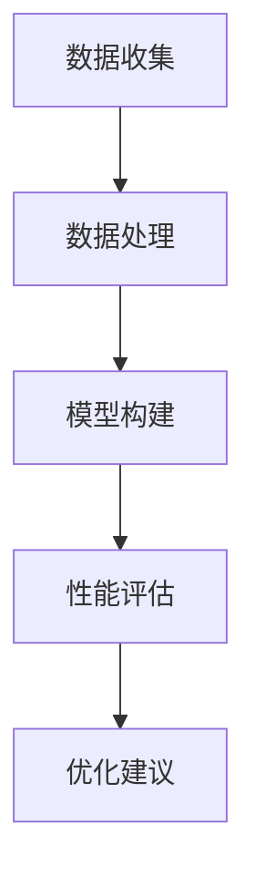

                 

关键词：量化分析、移动设备、性能优化、算法效率、AI应用

> 摘要：随着移动设备的普及和计算能力的提升，量化分析在移动设备中的应用变得越来越重要。本文将深入探讨量化分析的核心概念、算法原理、数学模型及其实际应用，旨在为开发者提供关于如何在移动设备上高效利用量化技术的方法和启示。

## 1. 背景介绍

随着移动互联网的快速发展，移动设备已成为人们生活中不可或缺的一部分。从智能手机到平板电脑，再到可穿戴设备，这些设备不断地提供着丰富的功能和强大的性能。然而，随着应用场景的多样化和复杂化，如何在这类资源有限的设备上高效执行计算任务成为了一个重要问题。

量化分析是一种以数据为基础，通过数学模型和算法来评估系统性能的技术。它在移动设备中的应用主要体现在以下几个方面：

- **性能优化**：量化分析可以帮助开发者识别系统的瓶颈，从而优化代码和算法，提高执行效率。
- **资源管理**：通过量化分析，开发者可以更好地了解设备资源的分配情况，优化资源使用策略。
- **用户体验**：量化分析有助于提升应用的响应速度和稳定性，从而改善用户体验。

本文将围绕量化分析的核心概念和算法原理，详细探讨其在移动设备上的应用，旨在为开发者提供实用的指导。

## 2. 核心概念与联系

### 2.1 量化分析的定义

量化分析是指利用数学模型和算法来对系统的行为进行量化的分析和评估。在移动设备上，量化分析主要用于以下几个方面：

- **计算性能评估**：通过测量应用在不同设备上的执行时间，评估其计算性能。
- **资源消耗评估**：分析应用的内存、CPU、网络等资源使用情况，评估其资源消耗。
- **用户体验评估**：通过量化分析，评估应用的响应速度、流畅度等关键指标，以改善用户体验。

### 2.2 量化分析的核心原理

量化分析的核心原理包括以下几个方面：

- **性能指标测量**：通过准确测量应用的执行时间、内存使用量、CPU占用率等指标，获取系统的性能数据。
- **数据收集与处理**：收集来自不同设备和应用环境的数据，利用统计分析等方法进行处理，以发现系统中的瓶颈和优化机会。
- **模型构建**：根据性能数据和业务需求，构建合适的数学模型，用于预测、评估和优化系统的性能。

### 2.3 Mermaid 流程图

以下是一个简化的 Mermaid 流程图，用于描述量化分析的核心流程：

- **数据收集**：收集来自移动设备的性能数据和资源使用数据。
- **数据处理**：对收集到的数据进行清洗、转换和预处理，以便进行后续分析。
- **模型构建**：根据处理后的数据，构建用于性能评估和预测的数学模型。
- **性能评估**：利用模型对系统性能进行量化评估，识别瓶颈和优化机会。
- **优化建议**：根据评估结果，提出具体的优化建议，以提升系统性能。

通过上述流程，量化分析可以帮助开发者深入了解移动设备的性能和资源使用情况，从而进行有针对性的优化。

## 3. 核心算法原理 & 具体操作步骤

### 3.1 算法原理概述

在量化分析中，常用的核心算法包括性能分析算法、资源管理算法和用户体验评估算法等。以下将简要介绍这些算法的基本原理。

#### 3.1.1 性能分析算法

性能分析算法主要用于评估应用的执行效率和资源消耗。常用的性能分析算法包括：

- **计时算法**：通过测量代码块的执行时间，评估其时间复杂度。
- **计数算法**：通过计数器记录应用在不同阶段的执行次数，评估其执行频率。
- **资源监控算法**：通过监控应用的内存、CPU、网络等资源使用情况，评估其资源消耗。

#### 3.1.2 资源管理算法

资源管理算法主要用于优化移动设备的资源分配。常用的资源管理算法包括：

- **动态分配算法**：根据应用的实时需求，动态分配内存、CPU等资源，以最大化资源利用率。
- **优先级调度算法**：根据任务的优先级和资源需求，调度任务的执行顺序，以优化系统性能。

#### 3.1.3 用户体验评估算法

用户体验评估算法主要用于评估应用的响应速度和流畅度。常用的用户体验评估算法包括：

- **响应时间评估算法**：通过测量应用的响应时间，评估其速度和稳定性。
- **流畅度评估算法**：通过测量应用的帧率、卡顿情况等，评估其流畅度。

### 3.2 算法步骤详解

以下是一个简化的算法步骤，用于说明如何使用量化分析来优化移动设备上的应用：

#### 3.2.1 数据收集

1. **性能数据收集**：通过性能分析工具，收集应用的执行时间、内存使用量、CPU占用率等数据。
2. **资源数据收集**：通过资源监控工具，收集应用的内存、CPU、网络等资源使用数据。
3. **用户体验数据收集**：通过用户行为监控工具，收集用户的操作频率、点击时间等数据。

#### 3.2.2 数据处理

1. **数据清洗**：清洗收集到的数据，去除异常值和重复数据。
2. **数据转换**：将原始数据转换为适合分析的格式，如时间序列数据、直方图数据等。
3. **数据预处理**：对数据进行归一化、标准化等处理，以消除数据之间的差异。

#### 3.2.3 模型构建

1. **性能预测模型**：利用收集到的性能数据，构建性能预测模型，用于预测应用在不同配置下的执行时间。
2. **资源优化模型**：利用收集到的资源数据，构建资源优化模型，用于优化资源的分配和使用。
3. **用户体验模型**：利用收集到的人

