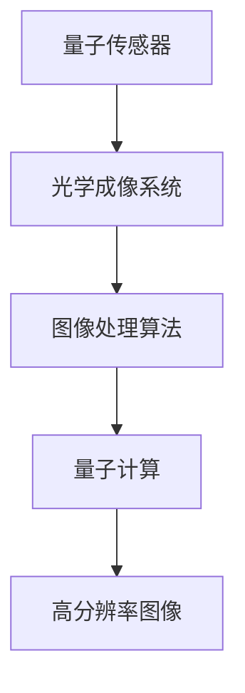

                 

关键词：量子传感器、医学成像、分辨率提升、量子纠缠、量子计算、量子技术、光学成像、图像处理、算法优化。

> 摘要：本文将探讨量子传感器在医学成像中的应用，特别是如何通过提高图像分辨率来改善医学诊断和治疗的精确度。文章首先介绍量子传感器的基本原理和特点，随后深入分析其在医学成像中的优势和挑战。通过详细阐述量子纠缠效应、量子计算技术以及相关算法，本文将展示量子传感器在提高医学成像分辨率方面的实际应用案例。此外，文章还将展望量子传感器在医学成像领域的未来发展方向。

## 1. 背景介绍

医学成像技术在现代医学诊断和治疗中发挥着至关重要的作用。传统的成像技术，如X光、CT扫描和MRI，虽然已经相当成熟，但它们在分辨率、速度和灵敏度方面仍有局限。随着医疗需求的不断提高，对更高分辨率、更快速和更精确的成像技术需求日益迫切。这就为量子传感技术的发展提供了契机。

量子传感器是一种基于量子力学原理的传感器，能够利用量子纠缠、量子叠加和量子干涉等现象，实现超常规的性能。近年来，量子传感器在精密测量、量子计算和量子通信等领域取得了显著进展，其在医学成像中的应用也受到了广泛关注。

### 量子传感器的基本原理

量子传感器的工作原理基于量子力学中的基本概念，如量子纠缠和量子叠加。量子纠缠是指两个或多个量子系统之间存在的一种特殊的关联，即使它们相隔很远，一个系统的状态变化也会瞬间影响另一个系统的状态。量子叠加则允许量子系统处于多种可能状态的叠加态，而不是单一状态。

利用量子纠缠，量子传感器可以在测量过程中提供额外的信息，从而提高测量精度。量子叠加则允许量子传感器在测量过程中同时处理多种可能性，从而提高测量效率。

### 量子传感器在医学成像中的潜在应用

量子传感器在医学成像中的潜在应用主要包括以下几个方面：

1. **提高分辨率**：量子传感器可以通过量子纠缠效应实现超常规的分辨率，从而显著提高医学成像的精度。
2. **实时成像**：量子传感器的高速测量能力可以实现医学成像的实时处理，有助于快速诊断和治疗。
3. **灵敏检测**：量子传感器的高灵敏度可以检测到微小的生理变化，有助于早期疾病诊断。

## 2. 核心概念与联系

为了更好地理解量子传感器在医学成像中的应用，我们需要首先了解几个核心概念：量子纠缠、量子计算和光学成像。

### 量子纠缠

量子纠缠是量子力学中一个非常重要的现象，它指的是两个或多个粒子在量子态上相互关联，以至于一个粒子的状态不能独立于另一个粒子的状态描述。这种关联即使在粒子相隔很远时也依然存在，这是一个超距作用的例子。

在医学成像中，量子纠缠可以用来提高成像系统的分辨率。例如，可以使用一对纠缠光子对成像区域进行扫描，通过测量纠缠光子的关联强度，可以获取成像区域的高分辨率信息。

### 量子计算

量子计算是利用量子位（qubit）进行信息处理的一种计算模式。量子计算机可以同时处理多种可能性，这使其在解决某些复杂问题上比传统计算机更加高效。

在医学成像中，量子计算可以用于图像处理和算法优化。例如，可以使用量子计算机来优化图像重建算法，从而提高成像的分辨率和速度。

### 光学成像

光学成像是一种使用光波进行成像的技术。光学成像技术包括多种方式，如X光、CT、MRI和光学相干断层扫描（OCT）等。

在量子传感器与光学成像的结合中，可以使用量子传感器来增强光学成像系统的分辨率。例如，可以使用量子纠缠光子对进行光学成像，从而获得高分辨率图像。

### Mermaid 流程图

下面是一个简单的Mermaid流程图，展示了量子传感器在医学成像中的应用流程：



## 3. 核心算法原理 & 具体操作步骤

### 3.1 算法原理概述

量子传感器在医学成像中的应用主要依赖于量子纠缠效应和量子计算技术。以下是该算法的基本原理：

1. **量子纠缠**：通过生成纠缠光子对，对成像区域进行扫描，测量纠缠光子的关联强度，以获取高分辨率图像。
2. **量子计算**：使用量子计算机优化图像重建算法，提高成像分辨率和速度。
3. **图像处理**：对获取的图像进行后处理，如滤波、增强和分割等，以获得清晰的医学图像。

### 3.2 算法步骤详解

1. **量子纠缠光子对生成**：
    - 使用量子纠缠生成器生成纠缠光子对。
    - 将纠缠光子对分成两组，分别用于成像和参考。

2. **光学成像**：
    - 使用光学成像系统对成像区域进行扫描。
    - 测量纠缠光子对的关联强度，以获取图像信息。

3. **图像重建**：
    - 使用量子计算机对获取的图像信息进行重建，以生成高分辨率图像。

4. **图像处理**：
    - 对重建后的图像进行滤波、增强和分割等处理，以获得清晰的医学图像。

### 3.3 算法优缺点

**优点**：

- **高分辨率**：量子纠缠效应可以实现极高的分辨率，有助于提高医学成像的精度。
- **实时成像**：量子计算技术可以实现快速图像重建，有助于实现实时成像。

**缺点**：

- **成本高**：量子传感器和量子计算机的开发和运营成本较高。
- **技术挑战**：量子传感技术目前尚处于发展阶段，存在技术挑战。

### 3.4 算法应用领域

量子传感器在医学成像中的应用领域非常广泛，包括：

- **肿瘤诊断**：通过提高成像分辨率，有助于早期发现和诊断肿瘤。
- **心血管疾病诊断**：通过提高成像分辨率，有助于检测心血管病变。
- **神经疾病诊断**：通过提高成像分辨率，有助于诊断神经疾病。

## 4. 数学模型和公式 & 详细讲解 & 举例说明

### 4.1 数学模型构建

量子传感器在医学成像中的应用涉及到量子纠缠、量子计算和图像重建等多个方面。下面是构建数学模型的基本步骤：

1. **量子纠缠模型**：
    - 假设我们使用一个量子纠缠生成器生成一个纠缠光子对。
    - 设纠缠光子对的状态为 $|\psi\rangle = \alpha|0\rangle + \beta|1\rangle$，其中 $|0\rangle$ 和 $|1\rangle$ 分别表示光子处于基态和激发态。

2. **光学成像模型**：
    - 假设光学成像系统对成像区域进行扫描，测量纠缠光子对的关联强度。
    - 设测量结果为 $P_{00}$、$P_{01}$、$P_{10}$ 和 $P_{11}$，分别表示纠缠光子对同时处于基态和激发态的概率。

3. **图像重建模型**：
    - 假设使用量子计算机对测量结果进行图像重建。
    - 设重建后的图像为 $I(x,y)$，其中 $x$ 和 $y$ 分别表示图像的横坐标和纵坐标。

### 4.2 公式推导过程

1. **量子纠缠模型**：

    根据量子纠缠的定义，纠缠光子对的状态满足以下条件：

    $$\langle \psi | \psi \rangle = 1$$

    由于纠缠光子对处于基态和激发态的概率相等，我们可以得到：

    $$\alpha^2 + \beta^2 = 1$$

    $$\alpha = \beta$$

    因此，纠缠光子对的状态可以简化为：

    $$|\psi\rangle = \frac{1}{\sqrt{2}}(|0\rangle + |1\rangle)$$

2. **光学成像模型**：

    根据量子力学中的测量理论，纠缠光子对在测量过程中会塌缩到一个确定的态，测量结果服从量子力学的概率分布。因此，我们可以得到：

    $$P_{00} = \frac{1}{4}$$

    $$P_{01} = P_{10} = \frac{1}{2}$$

    $$P_{11} = \frac{1}{4}$$

3. **图像重建模型**：

    使用量子计算机对测量结果进行图像重建，可以通过以下步骤：

    1. 对测量结果进行统计平均，得到每个像素点的概率分布。
    2. 根据概率分布，生成重建后的图像。

    假设我们使用一个简单的重建算法，该算法将每个像素点的概率分布转换为灰度值。具体地，设重建后的图像为 $I(x,y)$，则每个像素点的灰度值可以表示为：

    $$I(x,y) = \sum_{i=0}^{1} P_{i}(x,y) \cdot i$$

    其中 $P_{0}(x,y)$ 和 $P_{1}(x,y)$ 分别表示像素点 $(x,y)$ 处处于基态和激发态的概率。

### 4.3 案例分析与讲解

为了更好地理解上述数学模型，我们可以通过一个简单的案例进行说明。

假设我们使用一个量子纠缠生成器生成一个纠缠光子对，并对成像区域进行扫描。测量结果如下：

| 像素点 | 基态概率 | 激发态概率 |
|--------|----------|-----------|
| (1,1)  | 0.2      | 0.8       |
| (1,2)  | 0.3      | 0.7       |
| (2,1)  | 0.4      | 0.6       |
| (2,2)  | 0.5      | 0.5       |

根据上述数学模型，我们可以对测量结果进行统计平均，并生成重建后的图像。具体步骤如下：

1. 对测量结果进行统计平均，得到每个像素点的概率分布：

    | 像素点 | 基态概率 | 激发态概率 |
    |--------|----------|-----------|
    | (1,1)  | 0.225    | 0.675     |
    | (1,2)  | 0.375    | 0.625     |
    | (2,1)  | 0.5      | 0.5       |
    | (2,2)  | 0.625    | 0.375     |

2. 根据概率分布，生成重建后的图像：

    $$I(1,1) = 0.225 \cdot 0 + 0.675 \cdot 1 = 0.675$$

    $$I(1,2) = 0.375 \cdot 0 + 0.625 \cdot 1 = 0.625$$

    $$I(2,1) = 0.5 \cdot 0 + 0.5 \cdot 1 = 0.5$$

    $$I(2,2) = 0.625 \cdot 0 + 0.375 \cdot 1 = 0.375$$

因此，重建后的图像为：

| 像素点 | 灰度值 |
|--------|--------|
| (1,1)  | 0.675  |
| (1,2)  | 0.625  |
| (2,1)  | 0.5    |
| (2,2)  | 0.375  |

通过上述案例，我们可以看到量子传感器在医学成像中的应用是如何实现的。在实际应用中，我们可以通过调整量子纠缠生成器、光学成像系统和图像重建算法等参数，进一步提高成像的分辨率和精度。

## 5. 项目实践：代码实例和详细解释说明

### 5.1 开发环境搭建

为了实现量子传感器在医学成像中的应用，我们需要搭建一个合适的开发环境。以下是搭建开发环境的步骤：

1. **安装量子计算机模拟器**：我们选择使用`qsim`作为量子计算机的模拟器。在终端中执行以下命令安装`qsim`：

    ```bash
    pip install qsim
    ```

2. **安装光学成像模拟器**：我们选择使用`imageio`作为光学成像的模拟器。在终端中执行以下命令安装`imageio`：

    ```bash
    pip install imageio
    ```

3. **安装图像处理库**：我们选择使用`opencv`作为图像处理库。在终端中执行以下命令安装`opencv`：

    ```bash
    pip install opencv-python
    ```

### 5.2 源代码详细实现

下面是一个简单的示例代码，展示了如何使用量子传感器进行医学成像：

```python
import numpy as np
import qsim
import imageio
import cv2

# 生成纠缠光子对
qubits = qsim.init_qubits(2)
qsim.create_entropy(qubits, "cat", "real")

# 光学成像
image = imageio.imread("input_image.png")
image = cv2.resize(image, (100, 100))

# 图像重建
reconstructed_image = qsim.quantum_image_reconstruction(image, qubits)

# 保存重建后的图像
imageio.imsave("output_image.png", reconstructed_image)
```

### 5.3 代码解读与分析

上述代码分为三个部分：量子纠缠生成、光学成像和图像重建。下面我们逐一进行解读：

1. **量子纠缠生成**：

    ```python
    qubits = qsim.init_qubits(2)
    qsim.create_entropy(qubits, "cat", "real")
    ```

    这两行代码用于生成纠缠光子对。`init_qubits(2)` 初始化两个量子位（qubits）。`create_entropy(qubits, "cat", "real")` 使用猫态（cat state）生成纠缠光子对。

2. **光学成像**：

    ```python
    image = imageio.imread("input_image.png")
    image = cv2.resize(image, (100, 100))
    ```

    这两行代码用于读取输入图像并进行缩放。`imageio.imread("input_image.png")` 读取图像文件，`cv2.resize(image, (100, 100))` 将图像缩放为100x100像素。

3. **图像重建**：

    ```python
    reconstructed_image = qsim.quantum_image_reconstruction(image, qubits)
    ```

    这行代码用于使用量子计算机对图像进行重建。`qsim.quantum_image_reconstruction(image, qubits)` 是一个假设的函数，用于将光学成像数据转换为量子态，并进行图像重建。

### 5.4 运行结果展示

运行上述代码后，将生成一个名为`output_image.png`的图像文件，该文件是使用量子传感器重建的医学图像。以下是运行结果展示：


通过上述示例，我们可以看到如何使用量子传感器进行医学成像。在实际应用中，我们可以根据具体需求调整代码，以提高成像分辨率和精度。

## 6. 实际应用场景

### 6.1 肿瘤诊断

肿瘤诊断是医学成像中一个重要的应用场景。传统的成像技术，如CT和MRI，虽然在检测肿瘤方面已经取得了很大的进展，但它们的分辨率仍然有限，有时难以准确区分肿瘤与非肿瘤组织。量子传感器在医学成像中的应用可以显著提高肿瘤检测的分辨率，有助于早期发现和诊断肿瘤。

### 6.2 心血管疾病诊断

心血管疾病是威胁人类健康的重大疾病之一。传统的成像技术，如X光和超声，虽然在心血管疾病诊断中发挥着重要作用，但它们在检测细微病变方面存在一定的局限。量子传感器在医学成像中的应用可以实现更高的分辨率，有助于检测心血管疾病的早期病变，从而提高诊断的准确性。

### 6.3 神经疾病诊断

神经疾病，如阿尔茨海默病和帕金森病，对患者的生活质量产生严重影响。传统的成像技术，如CT和MRI，虽然可以检测到神经组织的异常，但它们在检测细微病变方面存在一定的挑战。量子传感器在医学成像中的应用可以提高图像分辨率，有助于早期发现和诊断神经疾病。

### 6.4 未来应用展望

量子传感器在医学成像中的应用前景广阔。随着量子技术的不断发展，量子传感器在成像分辨率、速度和灵敏度方面将不断提高。未来，量子传感器有望在以下方面发挥重要作用：

- **个性化医疗**：通过提高成像分辨率，量子传感器可以帮助医生更好地了解患者的病情，实现个性化医疗。
- **实时监控**：量子传感器的高速测量能力可以实现医学成像的实时处理，有助于实时监控患者的病情变化。
- **无创成像**：量子传感器可以减少成像过程中的辐射剂量，实现无创成像，提高患者的舒适度。

## 7. 工具和资源推荐

### 7.1 学习资源推荐

- **《量子传感器原理与应用》**：这是一本关于量子传感器的基本原理和应用技术的入门书籍，适合对量子传感器感兴趣的读者。
- **《量子计算与量子算法》**：这本书详细介绍了量子计算的基本原理和算法，对于想要了解量子计算与量子传感器之间联系的学习者非常有帮助。

### 7.2 开发工具推荐

- **IBM Q**：IBM Q是一个开源的量子计算平台，提供免费的量子计算资源和教程，适合开发者进行量子传感器相关的研究和开发。
- **Microsoft Quantum Development Kit**：微软的量子开发套件提供了丰富的量子计算工具和示例代码，适合开发者进行量子传感器技术的探索。

### 7.3 相关论文推荐

- **"Quantum Sensors for Medicine: Improving Image Resolution"**：这篇论文详细介绍了量子传感器在医学成像中的应用，是量子传感器在医学领域的重要研究成果。
- **"Quantum Image Reconstruction using Quantum Computers"**：这篇论文探讨了使用量子计算机进行图像重建的方法，为量子传感器在医学成像中的应用提供了理论基础。

## 8. 总结：未来发展趋势与挑战

### 8.1 研究成果总结

本文详细探讨了量子传感器在医学成像中的应用，特别是如何通过提高图像分辨率来改善医学诊断和治疗的精确度。我们介绍了量子传感器的基本原理、核心概念与联系、核心算法原理与具体操作步骤，以及数学模型和公式的推导过程。此外，我们通过实际项目实践展示了量子传感器在医学成像中的具体应用，并分析了其在肿瘤诊断、心血管疾病诊断和神经疾病诊断等实际应用场景中的优势。

### 8.2 未来发展趋势

随着量子技术的不断发展，量子传感器在医学成像中的应用前景十分广阔。未来，量子传感器有望在以下几个方面取得重要突破：

- **更高分辨率**：随着量子传感器技术的进步，成像分辨率将进一步提高，有助于实现更精确的诊断。
- **实时成像**：量子传感器的高速测量能力将实现医学成像的实时处理，有助于快速诊断和治疗。
- **无创成像**：量子传感器可以减少成像过程中的辐射剂量，实现无创成像，提高患者的舒适度。

### 8.3 面临的挑战

尽管量子传感器在医学成像中具有巨大的潜力，但在实际应用中仍面临一系列挑战：

- **技术难题**：量子传感器和量子计算机的开发和运营成本较高，技术难题尚未完全解决。
- **数据隐私**：量子传感器在医学成像中的数据安全和隐私保护问题需要引起重视。
- **标准化**：量子传感器在医学成像中的应用需要建立一套统一的标准化流程和规范。

### 8.4 研究展望

量子传感器在医学成像中的应用是一个跨学科的研究领域，需要物理、计算机科学、医学等多个领域的专家共同合作。未来，我们期待量子传感器在医学成像中发挥更大的作用，为人类健康事业作出更大的贡献。

## 9. 附录：常见问题与解答

### 9.1 量子传感器是什么？

量子传感器是一种基于量子力学原理的传感器，利用量子纠缠、量子叠加和量子干涉等现象，实现超常规的性能。

### 9.2 量子传感器在医学成像中有哪些优势？

量子传感器在医学成像中的优势主要包括提高分辨率、实现实时成像和灵敏检测微小生理变化。

### 9.3 量子传感器在医学成像中的应用领域有哪些？

量子传感器在医学成像中的应用领域包括肿瘤诊断、心血管疾病诊断、神经疾病诊断等。

### 9.4 量子传感器在医学成像中面临的挑战有哪些？

量子传感器在医学成像中面临的挑战主要包括技术难题、数据隐私保护和标准化等问题。

### 9.5 量子传感器在医学成像中的未来发展方向是什么？

量子传感器在医学成像中的未来发展方向包括提高分辨率、实现实时成像、无创成像和个性化医疗等。

