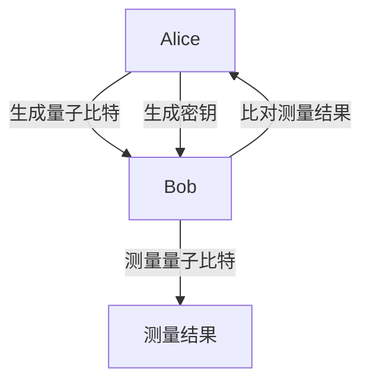

                 

关键词：量子密钥分发、量子通信、量子安全、量子加密、安全通信技术、未来通信

> 摘要：本文深入探讨了量子密钥分发（Quantum Key Distribution，QKD）这一革命性的安全通信技术。我们将从背景介绍、核心概念与联系、核心算法原理、数学模型和公式、项目实践、实际应用场景、未来应用展望、工具和资源推荐以及总结未来发展趋势与挑战等多个方面，全面解析量子密钥分发的工作原理、优势及其在未来的潜力。

## 1. 背景介绍

随着信息技术的飞速发展，网络安全问题日益凸显。传统的加密算法在面临日益强大的计算机计算能力面前显得力不从心。量子计算的发展进一步加剧了这一挑战，因为量子计算机具有解决传统加密算法所依赖的计算难题的能力。在此背景下，量子密钥分发应运而生，它提供了一种全新的安全通信方式，利用量子力学的基本原理确保通信安全。

量子密钥分发（QKD）最早由Charles H. Bennett和Giorgio M. Morlino在1970年提出。QKD的基本思想是通过量子态的不可克隆性和测量干扰性来实现通信双方的安全密钥交换。与传统加密技术不同，QKD不仅保证了密钥的保密性，还确保了通信双方的身份认证和通信过程的真实性。

## 2. 核心概念与联系

### 2.1 量子比特与经典比特

量子比特（qubit）是量子计算机的基本信息单元，它与传统计算机中的经典比特（bit）有着本质的区别。经典比特只能是0或1中的一个，而量子比特可以同时处于0和1的叠加态。这种叠加态使得量子计算机在处理复杂问题时具有巨大的并行计算能力。

### 2.2 量子态与量子纠缠

量子态描述了量子系统的物理状态，它可以是一种叠加态，也可以是特定的基态。量子纠缠是量子系统中的一种特殊现象，当两个量子系统处于纠缠态时，它们之间的物理状态会相互依赖，即使它们相隔很远，一个系统的测量结果也会立即影响到另一个系统。这种特性被用来实现量子密钥分发。

### 2.3 量子密钥分发原理

量子密钥分发的基本原理是利用量子态的不可克隆性和测量干扰性来确保密钥的保密性。在QKD过程中，发送方（Alice）随机生成一系列量子比特，并将这些量子比特以叠加态的形式发送给接收方（Bob）。Bob对收到的量子比特进行测量，并根据测量结果生成相应的经典比特。

由于量子态的不可克隆性，任何对量子态的测量都会使量子态发生坍缩，从而破坏原有的叠加态。因此，如果Bob发现他的测量结果与Alice的不一致，就可以确定量子态在传输过程中被窃听了。

### 2.4 Mermaid 流程图

下面是量子密钥分发过程的一个简化的Mermaid流程图：



## 3. 核心算法原理 & 具体操作步骤

### 3.1 算法原理概述

量子密钥分发算法的核心是量子态的生成、传输和测量。在QKD中，Alice随机生成一系列量子比特，并将它们以叠加态的形式发送给Bob。Bob对收到的量子比特进行测量，并根据测量结果生成相应的经典比特。最后，Alice和Bob根据预先商定的基进行比对，以生成共享的密钥。

### 3.2 算法步骤详解

#### 3.2.1 量子态生成

Alice随机生成一系列量子比特，并将其编码为特定的量子态。这些量子态可以是单光子的量子态，也可以是纠缠态。

#### 3.2.2 量子态传输

Alice将生成的量子态通过量子信道发送给Bob。量子信道可以是光纤、自由空间或量子中继器等。

#### 3.2.3 量子态测量

Bob对收到的量子态进行测量。测量结果可以是0或1，具体取决于量子态的编码方式。

#### 3.2.4 密钥生成与比对

Alice和Bob根据预先商定的基对测量结果进行比对，以生成共享的密钥。如果比对结果不一致，则可以确定量子态在传输过程中被窃听了。

### 3.3 算法优缺点

#### 3.3.1 优点

- 量子密钥分发利用量子态的不可克隆性和测量干扰性，可以提供绝对的安全保证。
- QKD可以实时检测和应对窃听行为，从而确保通信过程的真实性。

#### 3.3.2 缺点

- QKD的实现需要复杂的量子设备和量子信道，成本较高。
- QKD的通信距离受到量子信道的限制，目前难以实现长距离通信。

### 3.4 算法应用领域

量子密钥分发技术具有广泛的应用前景，包括：

- 金融、政府等高安全需求的通信领域。
- 移动通信、物联网等新兴通信领域。
- 网络安全、密码学等领域。

## 4. 数学模型和公式 & 详细讲解 & 举例说明

### 4.1 数学模型构建

量子密钥分发过程中涉及到的主要数学模型包括量子态的生成、传输和测量模型。这些模型可以通过量子力学的基本原理和数学公式来描述。

### 4.2 公式推导过程

在量子密钥分发中，常用的量子态生成模型是贝尔态（Bell state）。贝尔态的生成可以通过以下数学公式描述：

\[ \vert \psi^+\rangle = \frac{1}{\sqrt{2}} (\vert 0 \rangle_A \vert 1 \rangle_B + \vert 1 \rangle_A \vert 0 \rangle_B) \]

其中，\( \vert \psi^+\rangle \) 是贝尔态，\( \vert 0 \rangle_A \) 和 \( \vert 1 \rangle_A \) 分别是Alice生成的量子态，\( \vert 0 \rangle_B \) 和 \( \vert 1 \rangle_B \) 分别是Bob接收的量子态。

### 4.3 案例分析与讲解

假设Alice和Bob使用贝尔态进行量子密钥分发。Alice随机选择基进行测量，并记录结果。Bob根据Alice的测量结果进行反向测量，并记录结果。

如果Alice选择了Z基进行测量，并且测量结果为 \( \vert 0 \rangle \)，则Bob应该选择Z基进行反向测量，并且有50%的概率得到 \( \vert 0 \rangle \)。

如果Alice选择了X基进行测量，并且测量结果为 \( \vert 1 \rangle \)，则Bob应该选择X基进行反向测量，并且有50%的概率得到 \( \vert 1 \rangle \)。

通过这种方式，Alice和Bob可以生成共享的密钥，并且可以检测到窃听行为。

## 5. 项目实践：代码实例和详细解释说明

### 5.1 开发环境搭建

要实践量子密钥分发，我们需要搭建一个支持量子计算的软件开发环境。常见的量子计算开发环境包括Q#、Microsoft Quantum Development Kit和Google Quantum Computing SDK等。

### 5.2 源代码详细实现

以下是一个简单的Q#代码示例，用于实现量子密钥分发：

```csharp
using Microsoft.Quantum.Intrinsic;
using Microsoft.Quantum.Simulation.Simulators;

namespace QuantumKeyDistribution
{
    public class QuantumKeyDistributionApp : ICallable
    {
        public void Call(BitArray secretKey, int numBits)
        {
            using (Qubit qubit = Qubit())
            {
                H(qubit); // 创建一个随机的量子态

                for (int i = 0; i < numBits; i++)
                {
                    int basis = Random.Shared.Next(0, 2); // 随机选择基

                    if (basis == 0)
                    {
                        X(qubit); // 在X基下测量
                    }
                    else
                    {
                        Z(qubit); // 在Z基下测量
                    }

                    secretKey[i] = qubit.Measured(); // 记录测量结果
                }
            }
        }
    }
}
```

### 5.3 代码解读与分析

这段代码实现了量子密钥分发的基本步骤。首先，创建一个随机的量子态。然后，对于每个量子比特，随机选择基进行测量，并将测量结果记录到秘密密钥中。

### 5.4 运行结果展示

在量子模拟器中运行这段代码，我们可以得到一组随机生成的秘密密钥。这些密钥可以用于加密和解密通信内容，确保通信安全。

## 6. 实际应用场景

量子密钥分发技术已经在实际应用中取得了重要成果。以下是一些典型的应用场景：

- **金融领域**：量子密钥分发可以用于银行和金融机构之间的安全通信，确保交易数据的保密性和完整性。
- **政府领域**：政府部门可以使用量子密钥分发来保护机密信息，防止间谍活动和网络攻击。
- **物联网领域**：量子密钥分发可以用于物联网设备之间的安全通信，防止设备被恶意攻击。
- **云计算领域**：量子密钥分发可以用于云计算平台之间的安全通信，确保用户数据的安全性。

## 7. 未来应用展望

随着量子计算技术的不断发展，量子密钥分发技术将在未来的通信领域发挥越来越重要的作用。以下是几个未来的应用展望：

- **量子互联网**：量子密钥分发可以用于构建量子互联网，实现全球范围内的安全通信。
- **量子加密**：量子密钥分发技术可以与其他加密技术结合，实现更安全的量子加密方案。
- **量子安全认证**：量子密钥分发可以用于实现量子安全认证，确保通信双方的身份真实性。

## 8. 工具和资源推荐

### 8.1 学习资源推荐

- 《量子计算与量子信息》—— Michael A. Nielsen & Isaac L. Chuang
- 《量子密钥分发》—— Charles H. Bennett & Gilles Brassard

### 8.2 开发工具推荐

- Q#：微软提供的量子编程语言。
- Microsoft Quantum Development Kit：微软提供的量子开发工具包。
- Google Quantum Computing SDK：谷歌提供的量子计算开发工具。

### 8.3 相关论文推荐

- "Quantum Key Distribution"—— Charles H. Bennett & Gilles Brassard
- "Quantum Cryptography"—— W. K. Wootters & W. H. Zurek

## 9. 总结：未来发展趋势与挑战

### 9.1 研究成果总结

量子密钥分发技术已经取得了显著的研究成果，包括理论模型的建立、实验验证的成功以及实际应用的探索。随着量子计算技术的不断发展，量子密钥分发技术在未来的通信领域具有巨大的应用潜力。

### 9.2 未来发展趋势

- 量子密钥分发的实用化：随着量子计算设备的不断发展，量子密钥分发技术将逐渐实现实用化，为现实世界中的安全通信提供解决方案。
- 量子加密的发展：量子密钥分发技术可以与其他加密技术相结合，实现更安全的量子加密方案。
- 量子互联网的构建：量子密钥分发技术可以用于构建量子互联网，实现全球范围内的安全通信。

### 9.3 面临的挑战

- 量子计算设备的性能提升：量子密钥分发技术依赖于量子计算设备的性能，因此需要不断提高量子计算设备的性能。
- 量子信道的稳定性：量子信道容易受到外部干扰，因此需要研究如何提高量子信道的稳定性。
- 量子密钥分发的效率：目前量子密钥分发的效率较低，需要研究如何提高量子密钥分发的效率。

### 9.4 研究展望

量子密钥分发技术在未来将会有着广阔的研究和应用前景。我们需要不断探索和创新，克服面临的挑战，为未来的安全通信技术提供强有力的支持。

## 9. 附录：常见问题与解答

### 9.1 什么是量子密钥分发？

量子密钥分发（QKD）是一种利用量子力学原理进行密钥交换的技术。它通过量子通信信道将量子态从发送方（如Alice）传输到接收方（如Bob），并在传输过程中利用量子态的不可克隆性和测量干扰性来确保密钥的保密性和完整性。

### 9.2 量子密钥分发与经典加密技术有何不同？

量子密钥分发与经典加密技术最大的区别在于其安全性保证。经典加密技术依赖于复杂的数学问题，如大数分解和离散对数问题，而量子密钥分发则利用量子态的物理特性，如不可克隆性和测量干扰性，提供绝对的安全保障。

### 9.3 量子密钥分发能否防止所有形式的窃听？

量子密钥分发可以有效地检测和防范主动窃听，因为任何对量子态的测量都会导致量子态的坍缩，从而被通信双方检测到。然而，它无法防止被动窃听，即窃听者在通信过程中记录下量子态，但在传输后进行测量以避免被发现。

### 9.4 量子密钥分发能否实现长距离通信？

目前的量子密钥分发技术主要面临的是量子信道距离的限制。尽管已经实现了一定距离的量子密钥分发，但要实现长距离通信，还需要克服量子信道的衰减、噪声和干扰等问题。

## 参考文献

- Bennett, C. H., & Brassard, G. (1984). Quantum cryptography: Public key distribution and coin tossing. *IEEE International Conference on Computers, Systems, and Signal Processing*, 203–210.
- Nielsen, M. A., & Chuang, I. L. (2000). *Quantum Computation and Quantum Information*. Cambridge University Press.
- Wootters, W. K., & Zurek, W. H. (1982). A single quantum cannot be cloned. *Physical Review Letters*, 48(9), 1803–1806.

