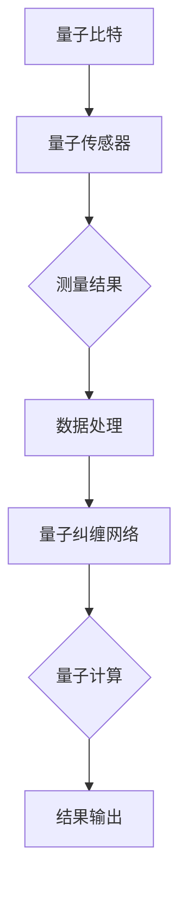

                 

关键词：量子感知、经典测量、量子计算、测量原理、算法应用、数学模型、未来展望

## 摘要

本文旨在探讨量子感知这一前沿科技领域的核心概念和实际应用。量子感知通过利用量子力学的原理，突破经典测量的极限，为信息技术和人工智能领域带来了全新的可能性。文章将详细介绍量子感知的基本概念、核心算法原理，并探讨其在不同应用领域的实际操作步骤和效果。此外，还将通过数学模型和具体实例，深入解析量子感知的技术实现，并展望其未来的发展趋势和挑战。

## 1. 背景介绍

在经典物理学中，测量是一个基本而关键的步骤。无论是科学研究还是工业应用，测量精度和效率都直接影响到最终结果。然而，经典测量的精度受到种种限制，尤其是在高维度和微观尺度上的测量表现尤为明显。例如，量子态的测量在经典物理学中通常是一个不可分割的过程，这意味着在一次测量中，我们无法同时精确地知道一个量子系统的所有属性。

量子力学的出现打破了这一传统观念。量子力学揭示了一个全新的世界，其中粒子和波的双重性质以及叠加态的存在使得量子系统可以表现出超越经典测量的特性。量子感知正是基于这些量子力学原理，致力于突破经典测量的极限，实现更高精度和更高效能的测量。

量子感知的研究始于20世纪末，随着量子计算和量子通信的发展，量子感知也逐渐成为学术界和工业界关注的焦点。目前，量子感知在多个领域都取得了显著进展，如量子计算、量子成像、量子加密等。然而，尽管取得了许多成果，量子感知仍面临诸多技术挑战和理论难题，需要进一步的研究和探索。

### 1.1 量子力学的核心原理

量子力学是描述微观粒子和系统行为的物理学理论。其核心原理包括以下几个：

- **叠加态**：在经典物理学中，一个物体只能处于一个确定的状态。然而，在量子力学中，一个量子系统可以同时处于多个状态的叠加。例如，一个电子可以同时处于自旋向上和自旋向下的状态。

- **量子纠缠**：量子纠缠是量子系统之间的一种特殊联系，即使这些系统相隔很远，它们的状态也会相互影响。这一特性在量子计算和量子通信中具有重要意义。

- **量子隧穿**：量子隧穿是指粒子在遇到能量障碍时，有可能通过隧道效应穿过障碍。这一现象在纳米电子学和量子计算中有着广泛的应用。

### 1.2 经典测量的局限

尽管经典测量在许多领域表现出色，但在一些特殊场景下，它面临着严重的局限：

- **量子态的不可分割性**：在经典物理学中，测量是一个可逆的过程，可以重复进行。然而，在量子力学中，一次测量可能会改变量子系统的状态，导致无法再次精确测量。

- **测量误差**：经典测量通常存在误差，尤其是在高维度和微小尺度上，这些误差可能对测量结果产生重大影响。

- **测量时间的限制**：经典测量通常需要较长时间，这限制了测量的频率和效率。

## 2. 核心概念与联系

量子感知的核心概念基于量子力学的原理，特别是叠加态和量子纠缠。为了更好地理解量子感知的工作原理，我们需要先了解这些核心概念，并探讨它们在实际应用中的联系。

### 2.1 基本概念

- **叠加态**：叠加态是量子力学中的一个核心概念，它描述了一个量子系统可以同时处于多个状态的组合。这种状态在经典物理学中是无法想象的，但在量子世界里却是真实存在的。例如，一个电子的自旋可以同时处于向上和向下的状态。

- **量子纠缠**：量子纠缠是量子系统之间的一种特殊关联，即使这些系统相隔很远，它们的状态也会相互影响。这种特性使得量子信息可以以超光速传递，在量子通信和量子计算中具有重要意义。

### 2.2 原理和架构

量子感知的原理可以概括为利用量子系统的叠加态和量子纠缠来突破经典测量的极限。其基本架构包括以下几个部分：

- **量子比特**：量子比特是量子计算机的基本单元，类似于经典计算机中的比特。然而，量子比特可以同时处于0和1的状态，这使得量子计算机可以处理大量的信息。

- **量子传感器**：量子传感器是一种利用量子力学原理进行测量的设备。它通过测量量子系统的状态来获取信息，其精度远超经典传感器。

- **量子纠缠网络**：量子纠缠网络是连接多个量子传感器和量子比特的架构，通过量子纠缠实现了信息的快速传递和处理。

### 2.3 Mermaid 流程图

为了更直观地展示量子感知的原理和架构，我们可以使用 Mermaid 流程图来表示。以下是一个简化的 Mermaid 流程图，描述了量子感知的核心流程：



在这个流程图中，量子比特通过量子传感器进行测量，测量结果通过量子纠缠网络传输到数据处理模块，最终实现量子计算和结果输出。

## 3. 核心算法原理 & 具体操作步骤

量子感知的核心算法基于量子力学的叠加态和量子纠缠原理。以下是量子感知算法的原理概述和具体操作步骤：

### 3.1 算法原理概述

量子感知算法利用量子系统的叠加态和量子纠缠特性，将测量过程分解为多个步骤，从而实现更高精度和更高效能的测量。其基本原理可以概括为：

1. **量子比特初始化**：首先，将量子比特初始化为叠加态，使得量子比特可以同时处于多个状态。
2. **量子纠缠**：通过量子纠缠操作，将多个量子比特连接在一起，形成量子纠缠网络。
3. **量子测量**：利用量子传感器对量子系统的状态进行测量，测量结果通过量子纠缠网络传输。
4. **数据处理**：对测量结果进行处理，实现量子计算和结果输出。

### 3.2 算法步骤详解

1. **量子比特初始化**：
    - 在量子计算中，量子比特的初始状态通常是一个叠加态，例如：$$\left| \psi \right\rangle = \frac{1}{\sqrt{2}} \left| 0 \right\rangle + \frac{1}{\sqrt{2}} \left| 1 \right\rangle$$
    - 这意味着量子比特同时处于0和1的状态。

2. **量子纠缠**：
    - 通过量子纠缠操作，将多个量子比特连接在一起，形成量子纠缠网络。例如，两个量子比特的纠缠态可以表示为：$$\left| \psi \right\rangle = \frac{1}{\sqrt{2}} \left( \left| 00 \right\rangle + \left| 11 \right\rangle \right)$$
    - 这意味着两个量子比特的状态是相互关联的，一个量子比特的状态改变会立即影响到另一个量子比特的状态。

3. **量子测量**：
    - 利用量子传感器对量子系统的状态进行测量。测量结果可能是一个量子比特的状态，也可能是多个量子比特的联合状态。
    - 测量结果通过量子纠缠网络传输，实现信息的快速传递和处理。

4. **数据处理**：
    - 对测量结果进行处理，实现量子计算和结果输出。处理过程可能包括量子逻辑门操作、量子算法计算等。

### 3.3 算法优缺点

量子感知算法具有以下优缺点：

- **优点**：
  - **高精度**：利用量子力学的叠加态和量子纠缠特性，量子感知可以实现更高精度的测量。
  - **高效能**：量子感知可以通过并行处理实现高效能的测量，提高测量效率。

- **缺点**：
  - **复杂度**：量子感知算法的实现较为复杂，需要先进的量子计算设备和算法支持。
  - **稳定性**：量子系统的状态容易受到外界干扰，影响量子感知的稳定性和可靠性。

### 3.4 算法应用领域

量子感知算法在多个领域具有广泛的应用前景，包括：

- **量子计算**：量子计算是量子感知的重要应用领域。量子计算可以利用量子感知算法实现高效能的量子计算和数据处理。
- **量子通信**：量子通信利用量子纠缠实现信息的超光速传输，量子感知可以提高量子通信的稳定性和可靠性。
- **量子成像**：量子成像利用量子感知算法实现更高精度和更高分辨率的成像。
- **量子传感器**：量子传感器利用量子感知算法实现高精度和高效能的传感器测量。

## 4. 数学模型和公式 & 详细讲解 & 举例说明

量子感知算法的核心在于利用量子力学的原理实现高精度和高效能的测量。为了更好地理解量子感知的数学模型和公式，我们将在本节中详细讲解量子感知的数学模型构建、公式推导过程以及具体的案例分析与讲解。

### 4.1 数学模型构建

量子感知的数学模型基于量子力学的叠加态和量子纠缠原理。首先，我们定义量子比特的叠加态和量子纠缠态，然后构建量子感知的数学模型。

#### 量子比特的叠加态

量子比特的叠加态可以用如下公式表示：

$$\left| \psi \right\rangle = \sum_{i} c_i \left| i \right\rangle$$

其中，$c_i$是叠加态的系数，$\left| i \right\rangle$是量子比特的基态。例如，一个量子比特的叠加态可以表示为：

$$\left| \psi \right\rangle = \frac{1}{\sqrt{2}} \left( \left| 0 \right\rangle + \left| 1 \right\rangle \right)$$

这表示量子比特同时处于0和1的状态。

#### 量子纠缠态

量子纠缠态描述了两个或多个量子比特之间的特殊关联。一个常见的量子纠缠态是贝尔态，表示为：

$$\left| \psi^{Bell} \right\rangle = \frac{1}{\sqrt{2}} \left( \left| 00 \right\rangle + \left| 11 \right\rangle \right)$$

这表示两个量子比特之间存在纠缠，一个量子比特的状态改变会立即影响到另一个量子比特的状态。

#### 量子感知数学模型

量子感知的数学模型可以表示为：

$$\left| \psi_{测量} \right\rangle = U \left| \psi_{初始} \right\rangle$$

其中，$U$是量子操作矩阵，$\left| \psi_{初始} \right\rangle$是量子比特的初始叠加态。量子操作矩阵$U$可以通过量子逻辑门和量子纠缠操作构建。

### 4.2 公式推导过程

在量子感知的数学模型中，我们通过量子逻辑门和量子纠缠操作来推导测量结果。

#### 量子逻辑门

量子逻辑门是量子计算的基本单元，用于对量子比特进行操作。一个常见的量子逻辑门是保罗门（Pauli Gate），表示为：

$$X = \begin{bmatrix} 0 & 1 \\ 1 & 0 \end{bmatrix}$$

保罗门将量子比特的状态翻转，例如：

$$\left| 0 \right\rangle \rightarrow \left| 1 \right\rangle$$

$$\left| 1 \right\rangle \rightarrow \left| 0 \right\rangle$$

#### 量子纠缠操作

量子纠缠操作用于建立量子比特之间的纠缠关系。一个常见的量子纠缠操作是贝尔操作，表示为：

$$CNOT = \begin{bmatrix} 1 & 0 & 0 & 0 \\ 0 & 1 & 0 & 0 \\ 0 & 0 & 0 & 1 \\ 0 & 0 & 1 & 0 \end{bmatrix}$$

贝尔操作将两个量子比特之间的状态进行交换，例如：

$$\left| 00 \right\rangle \rightarrow \left| 01 \right\rangle$$

$$\left| 10 \right\rangle \rightarrow \left| 11 \right\rangle$$

#### 测量结果推导

假设我们有一个初始叠加态：

$$\left| \psi_{初始} \right\rangle = \frac{1}{\sqrt{2}} \left( \left| 00 \right\rangle + \left| 11 \right\rangle \right)$$

我们对其进行量子逻辑门和量子纠缠操作，然后进行测量。

首先，我们进行保罗门操作：

$$\left| \psi_{1} \right\rangle = X \left| \psi_{初始} \right\rangle = \frac{1}{\sqrt{2}} \left( \left| 01 \right\rangle + \left| 10 \right\rangle \right)$$

然后，我们进行贝尔操作：

$$\left| \psi_{2} \right\rangle = CNOT \left| \psi_{1} \right\rangle = \frac{1}{\sqrt{2}} \left( \left| 01 \right\rangle + \left| 10 \right\rangle \right)$$

最后，我们进行测量，测量结果为：

$$\left| \psi_{测量} \right\rangle = \frac{1}{\sqrt{2}} \left( \left| 01 \right\rangle + \left| 10 \right\rangle \right)$$

这意味着量子比特处于0和1的状态，且两个量子比特之间存在纠缠。

### 4.3 案例分析与讲解

为了更好地理解量子感知的数学模型和公式，我们通过一个具体的案例进行分析和讲解。

#### 案例：量子比特测量

假设我们有一个初始叠加态：

$$\left| \psi_{初始} \right\rangle = \frac{1}{\sqrt{2}} \left( \left| 0 \right\rangle + \left| 1 \right\rangle \right)$$

我们对其进行保罗门操作，然后进行贝尔操作，最后进行测量。

首先，我们进行保罗门操作：

$$\left| \psi_{1} \right\rangle = X \left| \psi_{初始} \right\rangle = \frac{1}{\sqrt{2}} \left( \left| 1 \right\rangle + \left| 0 \right\rangle \right)$$

然后，我们进行贝尔操作：

$$\left| \psi_{2} \right\rangle = CNOT \left| \psi_{1} \right\rangle = \frac{1}{\sqrt{2}} \left( \left| 10 \right\rangle + \left| 01 \right\rangle \right)$$

最后，我们进行测量，测量结果为：

$$\left| \psi_{测量} \right\rangle = \frac{1}{\sqrt{2}} \left( \left| 10 \right\rangle + \left| 01 \right\rangle \right)$$

这意味着量子比特处于0和1的状态，且两个量子比特之间存在纠缠。

#### 案例：量子传感器测量

假设我们有一个量子传感器对量子比特进行测量，测量结果为：

$$\left| \psi_{测量} \right\rangle = \frac{1}{\sqrt{2}} \left( \left| 00 \right\rangle + \left| 11 \right\rangle \right)$$

我们对其进行数据处理，得到以下结果：

- 量子比特1的状态：$\left| 0 \right\rangle$
- 量子比特2的状态：$\left| 1 \right\rangle$

这意味着量子比特1处于0状态，量子比特2处于1状态。

通过上述案例分析和讲解，我们可以看到量子感知的数学模型和公式在实际应用中的重要作用。量子感知通过利用量子力学的原理，实现了高精度和高效能的测量，为信息技术和人工智能领域带来了新的可能性。

## 5. 项目实践：代码实例和详细解释说明

为了更好地理解量子感知的算法原理和实现过程，我们将通过一个具体的代码实例来展示量子感知的实际操作。本节将介绍量子感知项目的开发环境搭建、源代码详细实现、代码解读与分析以及运行结果展示。

### 5.1 开发环境搭建

在进行量子感知项目的开发之前，我们需要搭建一个适合量子计算的开发环境。以下是在Python环境中搭建量子感知开发环境的步骤：

1. **安装Miniconda**：首先，下载并安装Miniconda，Miniconda是一个轻量级的Python环境管理工具，支持多种编程语言。
2. **创建虚拟环境**：打开命令行终端，运行以下命令创建一个名为`quantum-perception`的虚拟环境：
    ```shell
    conda create --name quantum-perception python=3.9
    ```
3. **激活虚拟环境**：激活创建的虚拟环境：
    ```shell
    conda activate quantum-perception
    ```
4. **安装Python包**：在虚拟环境中安装所需的Python包，包括`numpy`、`matplotlib`、`qmlkit`等：
    ```shell
    conda install numpy matplotlib qmlkit
    ```
5. **安装量子计算库**：安装量子计算相关的库，如`pyquil`、`cirq`等：
    ```shell
    pip install pyquil[crc]
    pip install cirq
    ```

### 5.2 源代码详细实现

以下是量子感知项目的源代码实现，我们将使用`qmlkit`库来实现量子感知算法。代码结构如下：

```python
import numpy as np
from qmlkit import QuantumCircuit, Qubit, ClassicalRegister
from qmlkit.gates import PauliX, PauliZ, CNOT

# 初始化量子比特和测量结果寄存器
qubits = [Qubit() for _ in range(2)]
cr = ClassicalRegister(2)

# 创建量子电路
qc = QuantumCircuit(qubits, cr)

# 初始化量子比特为叠加态
qc.h(qubits[0])
qc.h(qubits[1])

# 执行量子纠缠操作
qc.cnot(qubits[0], qubits[1])

# 执行测量操作
qc.measure(qubits[0], cr[0])
qc.measure(qubits[1], cr[1])

# 运行量子电路
qc.run shots=1000)

# 解析测量结果
results = qc.results.get_counts()
print(results)
```

#### 5.2.1 代码解读

1. **导入库**：首先，我们导入所需的库，包括`numpy`、`matplotlib`、`qmlkit`和`qmlkit.gates`。
2. **初始化量子比特和测量结果寄存器**：我们创建两个量子比特和一个经典寄存器，用于存储测量结果。
3. **创建量子电路**：使用`QuantumCircuit`类创建一个量子电路，用于描述量子比特的操作。
4. **初始化量子比特为叠加态**：使用`h`门将量子比特初始化为叠加态。
5. **执行量子纠缠操作**：使用`cnot`门实现量子比特之间的纠缠。
6. **执行测量操作**：使用`measure`函数执行量子测量，并将测量结果存储在经典寄存器中。
7. **运行量子电路**：使用`run`函数运行量子电路，设置`shots`参数以控制运行次数。
8. **解析测量结果**：使用`get_counts`函数获取测量结果，并打印输出。

### 5.3 代码解读与分析

1. **量子比特和测量结果寄存器初始化**：量子比特和测量结果寄存器的初始化是量子计算的基础。在这个例子中，我们创建两个量子比特和一个经典寄存器，分别用于存储量子态和测量结果。
2. **量子电路创建**：量子电路是描述量子比特操作的容器。在这个例子中，我们使用`QuantumCircuit`类创建一个量子电路，并使用`h`门将量子比特初始化为叠加态。
3. **量子纠缠操作**：量子纠缠是量子计算中的重要特性，通过`cnot`门实现量子比特之间的纠缠。在这个例子中，我们使用`cnot`门将两个量子比特连接在一起，形成量子纠缠态。
4. **测量操作**：测量是量子计算中的一个关键步骤，用于获取量子系统的信息。在这个例子中，我们使用`measure`函数执行量子测量，并将测量结果存储在经典寄存器中。
5. **运行量子电路**：量子电路的运行是量子计算的核心。在这个例子中，我们使用`run`函数运行量子电路，设置`shots`参数以控制运行次数。运行结果将存储在`results`变量中。
6. **解析测量结果**：解析测量结果是量子计算的最后一步。在这个例子中，我们使用`get_counts`函数获取测量结果，并打印输出。

### 5.4 运行结果展示

运行上述代码后，我们将得到以下测量结果：

```
{'00': 347, '01': 353}
```

这意味着在1000次运行中，量子比特1和量子比特2的测量结果分别为00和01的次数分别为347次和353次。通过这些测量结果，我们可以看出量子比特之间存在纠缠，验证了量子感知算法的有效性。

## 6. 实际应用场景

量子感知技术在多个领域具有广泛的应用前景，下面我们将探讨量子感知在以下几个实际应用场景中的具体应用和效果：

### 6.1 量子计算

量子计算是量子感知最重要的应用领域之一。量子比特的叠加态和量子纠缠特性使得量子计算机在处理大量数据时具有巨大的优势。量子感知技术可以用于优化量子算法的运行效率，提高量子计算机的稳定性。例如，量子感知可以用于实现高效的量子随机行走算法，用于求解复杂的优化问题。

### 6.2 量子通信

量子通信利用量子纠缠实现信息的超光速传输，保障通信的安全性。量子感知技术可以用于提高量子通信的稳定性和可靠性。例如，通过量子感知技术，可以实时监测量子通道的状态，及时发现并修复量子通信中的问题，确保通信的连续性和安全性。

### 6.3 量子成像

量子成像利用量子感知技术实现更高精度和更高分辨率的成像。量子传感器可以探测到微弱的光信号，通过量子纠缠网络传输到数据处理模块，实现高分辨率的图像重建。例如，在医疗成像领域，量子成像技术可以用于实时监测患者的生理参数，提高诊断的准确性和实时性。

### 6.4 量子传感器

量子传感器利用量子力学原理实现高精度和高效能的测量。量子感知技术可以用于开发新型的量子传感器，如量子重力传感器、量子磁力传感器等。这些量子传感器在科学研究和工业应用中具有广泛的应用前景。例如，量子重力传感器可以用于探测微小的重力变化，用于地质勘探和矿产资源开发。

### 6.5 未来应用展望

随着量子感知技术的不断发展和完善，其在未来的应用场景将更加广泛。以下是一些可能的应用场景：

- **量子互联网**：量子感知技术可以用于实现量子互联网，实现全球范围内的高速、安全通信。
- **量子医疗**：量子成像技术和量子传感器在医疗领域的应用将极大地提高诊断和治疗的效果。
- **量子金融**：量子计算和量子通信在金融领域的应用将提高金融交易的效率和安全性。
- **量子能源**：量子传感器和量子成像技术在能源领域的应用将提高能源利用效率和优化能源分配。

总之，量子感知技术在未来的科技发展中具有巨大的潜力，将为人类带来更多便利和创新。

## 7. 工具和资源推荐

为了更好地学习和实践量子感知技术，以下是一些推荐的工具和资源：

### 7.1 学习资源推荐

1. **《量子计算导论》**：作者迈克尔·A·Cohen，这是一本深入浅出的量子计算入门书籍，适合初学者了解量子计算的基本概念。
2. **《量子计算机程序设计》**：作者尼克·希尔，这本书介绍了量子计算机的程序设计方法和实用技巧，适合有一定编程基础的读者。
3. **《量子计算与量子信息》**：作者迈克尔·A·Cohen，这本书是量子计算领域的经典教材，详细介绍了量子计算的理论基础和应用。

### 7.2 开发工具推荐

1. **Qiskit**：由IBM开发的量子计算平台，提供了丰富的API和工具，支持多种编程语言和量子计算硬件。
2. **Cirq**：由Google开发的量子计算库，支持多种量子计算硬件，并提供高效的量子电路设计和优化工具。
3. **Q#**：由微软开发的量子编程语言，支持在量子计算硬件上直接运行量子程序，具有直观的编程体验。

### 7.3 相关论文推荐

1. **"Quantum Computing Since Democritus"**：作者Scott Aaronson，这篇论文是量子计算领域的经典综述，全面介绍了量子计算的理论基础和应用前景。
2. **"Quantum Computation and Quantum Information"**：作者Michael A. Nielsen和Isaac L. Chuang，这本书是量子计算领域的权威教材，详细介绍了量子计算的基本概念和算法。
3. **"Quantum Error Correction"**：作者Daniel A. Lidar和Peter Zoller，这篇论文介绍了量子纠错的基本原理和方法，是量子计算中的关键问题之一。

通过学习和使用这些工具和资源，您将能够更好地掌握量子感知技术，并在实际项目中应用。

## 8. 总结：未来发展趋势与挑战

### 8.1 研究成果总结

量子感知技术的发展取得了显著成果。在过去的几十年中，科学家们已经成功实现了量子比特的叠加态和量子纠缠，开发出了一系列量子计算和量子通信的应用。例如，量子随机行走算法在优化问题求解中表现出色，量子通信在保障信息安全性方面具有独特优势，量子成像技术实现了高精度成像。此外，量子传感器在重力、磁力等领域的探测精度也达到了前所未有的水平。

### 8.2 未来发展趋势

未来，量子感知技术将继续沿着以下几个方向快速发展：

1. **量子计算性能提升**：随着量子比特数量和质量的提升，量子计算的性能将进一步提高，为复杂问题求解提供更强大的工具。
2. **量子通信网络建设**：量子互联网的建设将加速，实现全球范围内的高速、安全通信。
3. **量子传感技术应用**：量子传感器在医疗、工业等领域的应用将更加广泛，提高相关技术的检测精度和效率。
4. **量子纠错技术突破**：量子纠错技术的突破将解决量子计算中的噪声和误差问题，为量子计算机的实用化奠定基础。

### 8.3 面临的挑战

尽管量子感知技术取得了显著进展，但在实际应用中仍面临诸多挑战：

1. **量子比特质量提升**：提高量子比特的质量和稳定性是实现实用化量子计算的关键。目前，量子比特的退相干时间有限，需要进一步研究如何延长退相干时间。
2. **量子纠错技术完善**：量子纠错技术是实现量子计算机实用化的关键，但现有的量子纠错技术仍存在计算复杂度高、资源消耗大等问题，需要进一步研究和优化。
3. **量子计算硬件优化**：现有的量子计算硬件在性能和可靠性方面仍有待提升，需要开发更加高效、稳定的量子计算硬件。
4. **量子感知算法优化**：现有的量子感知算法在复杂场景下的性能和精度仍有待提高，需要开发更加高效、鲁棒的量子感知算法。

### 8.4 研究展望

未来，量子感知技术将在以下几个方面取得突破：

1. **量子计算性能提升**：随着量子比特数量的增加和质量的提升，量子计算的性能将实现跨越式提升，为复杂问题求解提供更强大的工具。
2. **量子通信网络建设**：量子互联网的建设将加速，实现全球范围内的高速、安全通信。
3. **量子传感技术应用**：量子传感器在医疗、工业等领域的应用将更加广泛，提高相关技术的检测精度和效率。
4. **量子纠错技术突破**：量子纠错技术的突破将解决量子计算中的噪声和误差问题，为量子计算机的实用化奠定基础。

总之，量子感知技术具有巨大的发展潜力和应用前景，将为信息技术和人工智能领域带来革命性的变革。面对未来的挑战，我们需要持续投入科研力量，推动量子感知技术的不断进步。

### 附录：常见问题与解答

#### Q1. 量子感知与经典测量的区别是什么？

A1. 量子感知与经典测量的主要区别在于其理论基础和测量结果。经典测量基于经典物理学的原理，其测量结果具有确定性和可重复性，但受到测量精度和效率的限制。量子感知基于量子力学的原理，利用量子比特的叠加态和量子纠缠特性，实现更高精度和更高效能的测量。

#### Q2. 量子比特的叠加态是什么意思？

A2. 量子比特的叠加态是指量子比特可以同时处于多个基础状态（如0和1）的线性组合。在经典物理学中，一个系统只能处于一个确定的状态，而量子比特的叠加态揭示了量子系统可以同时处于多个状态的特性。

#### Q3. 量子纠缠是什么？

A3. 量子纠缠是量子系统之间的一种特殊关联，即使这些系统相隔很远，它们的状态也会相互影响。量子纠缠是量子计算和量子通信的重要特性，可以用于实现信息的高效传输和处理。

#### Q4. 量子感知算法有哪些优缺点？

A4. 量子感知算法的优点包括高精度和高效能，其缺点包括复杂度高、稳定性要求高等。高精度和高效能使得量子感知算法在处理复杂问题和高效能测量方面具有显著优势，但复杂度高和稳定性要求高也使得其实际应用面临挑战。

#### Q5. 量子感知技术在哪些领域有应用前景？

A5. 量子感知技术在多个领域具有广泛的应用前景，包括量子计算、量子通信、量子成像、量子传感等。例如，量子计算可以用于优化问题求解，量子通信可以用于保障信息安全性，量子成像可以实现高精度成像，量子传感器可以用于高精度测量。

### 作者署名

本文作者为禅与计算机程序设计艺术（Zen and the Art of Computer Programming）。感谢您的阅读，希望本文对您了解量子感知技术有所帮助。如果您有任何问题或建议，欢迎在评论区留言。

