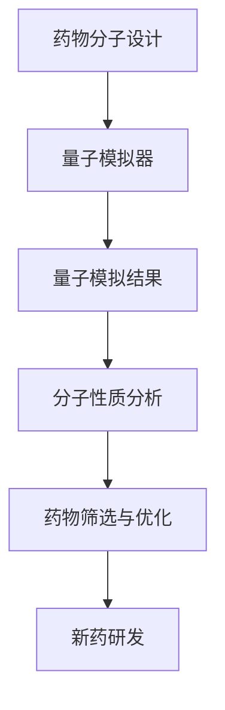

                 

关键词：量子模拟器、药物研发、分子模拟、加速计算

摘要：量子模拟器作为下一代计算技术，正在改变药物研发领域。本文将深入探讨量子模拟器在分子模拟中的应用，如何加速药物研发流程，并讨论这一技术的潜力和挑战。

## 1. 背景介绍

### 药物研发的挑战

药物研发是一个复杂且耗时的过程，涉及从化合物库中筛选、合成、测试和优化具有特定治疗效果的分子。传统的分子模拟技术虽然在某些方面取得了显著进展，但依然面临以下挑战：

- **计算复杂性**：药物分子通常由数十到数百万个原子组成，其精确模拟需要解决复杂的量子力学问题，这往往导致计算资源的极大消耗。
- **时间成本**：传统的计算方法需要数天、数周甚至数月的时间来完成一个分子的模拟，这在药物研发的高效性要求下显得不足。
- **计算精度**：为了准确预测药物分子的性质和相互作用，需要非常高的计算精度，而高精度往往需要更多的计算资源。

### 量子模拟器的崛起

量子计算作为一种全新的计算范式，利用量子位（qubits）的特性进行信息处理。量子模拟器作为量子计算的一个重要分支，可以有效地模拟量子系统的行为，为解决复杂量子问题提供了新的可能。

- **并行计算能力**：量子模拟器可以利用量子位的叠加和纠缠特性，实现并行计算，大大加速计算过程。
- **精确度**：量子模拟器能够在相对较低的计算资源下，提供比传统方法更高的精度。
- **可扩展性**：随着量子比特数量的增加，量子模拟器的计算能力也会呈指数级增长。

## 2. 核心概念与联系

### 量子模拟器原理

量子模拟器的工作原理基于量子位（qubits）的叠加态和纠缠态。通过适当的量子门操作，可以实现对复杂量子系统的模拟。量子模拟器通常由量子硬件和量子算法组成，其核心思想是利用量子计算的优势来模拟量子现象，从而解决传统计算难以处理的问题。

### 分子模拟与量子模拟器的关系

分子模拟是一种计算技术，用于研究分子结构和性质，以及分子之间的相互作用。量子模拟器在分子模拟中的应用，主要体现在以下几个方面：

- **加速计算**：量子模拟器可以加速分子模拟中的量子力学计算，特别是在处理复杂分子系统时，可以显著减少计算时间。
- **提高精度**：量子模拟器能够在较低的误差范围内提供更精确的分子模拟结果。
- **新型药物发现**：通过量子模拟器，可以快速筛选出具有潜在治疗效果的分子，加速新药的研发进程。

### Mermaid 流程图

下面是一个简化的Mermaid流程图，展示了量子模拟器在药物研发中的应用流程：



## 3. 核心算法原理 & 具体操作步骤

### 3.1 算法原理概述

量子模拟器在药物研发中的应用，主要基于量子态的叠加和纠缠特性。通过将分子系统的量子态映射到量子位的状态，可以实现对分子系统的量子模拟。核心算法通常包括以下几个步骤：

1. **初始化**：将量子比特初始化为叠加态，表示分子系统的初始状态。
2. **量子门操作**：通过量子门操作，模拟分子系统的演化过程。
3. **测量**：对量子比特进行测量，获取分子系统的量子态，进而分析分子性质。

### 3.2 算法步骤详解

1. **初始化量子比特**：将量子比特初始化为叠加态，表示分子系统的初始状态。
    ```latex
    |ψ⟩ = (1/\sqrt{N})\sum_{i=0}^{N-1}|i⟩
    ```
    其中，N是量子比特的数量，|i⟩表示第i个量子比特的状态。

2. **应用量子门**：通过一系列的量子门操作，模拟分子系统的演化过程。量子门可以是哈密顿量矩阵的指数运算，也可以是特定的量子算法（如量子行走）。
    ```latex
    U(t) = \exp(-iHt/\hbar)
    ```
    其中，U(t)是量子门，H是哈密顿量矩阵，t是时间，\hbar是约化普朗克常数。

3. **测量量子比特**：对量子比特进行测量，获取分子系统的量子态。测量结果可以用于分析分子性质，如能级、振动模式、电子结构等。

4. **数据处理**：对测量结果进行数据处理，提取分子系统的物理信息。数据处理可以采用各种量子算法，如量子计算、机器学习等。

### 3.3 算法优缺点

#### 优点

- **加速计算**：量子模拟器可以显著加速分子模拟中的计算过程，特别是在处理复杂分子系统时，具有巨大优势。
- **提高精度**：量子模拟器能够在较低的误差范围内提供更精确的分子模拟结果，有助于药物研发中的精确筛选和优化。

#### 缺点

- **计算复杂度**：量子模拟器的设计和实现相对复杂，需要专业的量子计算知识和技能。
- **量子噪声**：量子模拟器在运行过程中会受到量子噪声的影响，可能导致计算结果的误差。

### 3.4 算法应用领域

量子模拟器在药物研发中的应用领域非常广泛，包括：

- **药物筛选**：通过量子模拟器，可以快速筛选出具有潜在治疗效果的分子。
- **药物优化**：利用量子模拟器，可以精确优化药物分子的结构和活性。
- **化学反应模拟**：量子模拟器可以模拟复杂的化学反应，为催化剂设计和化学反应机理研究提供支持。

## 4. 数学模型和公式 & 详细讲解 & 举例说明

### 4.1 数学模型构建

量子模拟器在分子模拟中的核心数学模型是基于量子力学的。具体来说，分子系统的量子态可以用波函数表示，波函数的演化由薛定谔方程描述。

- **波函数表示**：分子系统的量子态可以用波函数\(|Ψ⟩\)表示，波函数的平方表示分子在空间中的概率分布。
    ```latex
    |\Psi⟩ = \Psi(x_1, x_2, ..., x_N)
    ```
    其中，\(x_1, x_2, ..., x_N\)是分子的坐标。

- **薛定谔方程**：波函数的演化由薛定谔方程描述，方程的解可以提供分子系统的能量和动力学信息。
    ```latex
    i\hbar\frac{\partial}{\partial t}|\Psi⟩ = \hat{H}|\Psi⟩
    ```
    其中，\(\hat{H}\)是哈密顿量，表示分子系统的总能量。

### 4.2 公式推导过程

量子模拟器的核心在于如何将复杂的量子系统映射到量子比特上，并有效地进行计算。以下是一个简化的推导过程：

1. **态的编码**：将分子系统的波函数编码到量子比特上，通常使用量子态叠加表示分子系统的所有可能状态。
    ```latex
    |\Psi⟩ = \sum_{i=0}^{2^N-1} c_i |i⟩
    ```
    其中，|i⟩是量子比特的状态，\(c_i\)是复数系数。

2. **演化操作**：通过应用量子门操作，模拟分子系统的演化。量子门可以用矩阵表示，如：
    ```latex
    U = \begin{bmatrix}
    1 & 0 \\
    0 & 2
    \end{bmatrix}
    ```
    应用量子门后，量子态将演化成：
    ```latex
    |\Psi'⟩ = U|\Psi⟩ = \begin{bmatrix}
    1 & 0 \\
    0 & 2
    \end{bmatrix}
    \begin{bmatrix}
    c_0 \\
    c_1
    \end{bmatrix}
    = \begin{bmatrix}
    c_0 \\
    2c_1
    \end{bmatrix}
    ```

3. **测量操作**：对量子比特进行测量，获取分子系统的量子态。测量结果可以用概率分布表示，如：
    ```latex
    P(i) = |c_i|^2
    ```

### 4.3 案例分析与讲解

#### 案例一：氢原子的量子模拟

假设我们要模拟一个氢原子的电子结构，可以使用两个量子比特来表示电子的量子态。

1. **初始化量子比特**：将量子比特初始化为叠加态。
    ```latex
    |\Psi⟩ = \frac{1}{\sqrt{2}}(|0⟩ + |1⟩)
    ```

2. **应用哈密顿量**：应用哈密顿量来模拟电子与原子核的相互作用。
    ```latex
    U = \exp(-i\frac{1}{2}\omega t) = \begin{bmatrix}
    \cos(\omega t/2) & -i\sin(\omega t/2) \\
    -i\sin(\omega t/2) & \cos(\omega t/2)
    \end{bmatrix}
    ```

3. **演化操作**：对量子比特进行演化操作。
    ```latex
    |\Psi'⟩ = U|\Psi⟩ = \begin{bmatrix}
    \cos(\omega t/2) & -i\sin(\omega t/2) \\
    -i\sin(\omega t/2) & \cos(\omega t/2)
    \end{bmatrix}
    \begin{bmatrix}
    1 \\
    1
    \end{bmatrix}
    = \begin{bmatrix}
    \cos(\omega t) \\
    -\sin(\omega t)
    \end{bmatrix}
    ```

4. **测量操作**：对量子比特进行测量，获取电子的位置概率分布。
    ```latex
    P(0) = |\cos(\omega t)|^2 = 0.5
    P(1) = |\sin(\omega t)|^2 = 0.5
    ```

#### 案例二：分子的振动模式模拟

假设我们要模拟一个分子的振动模式，可以使用多个量子比特来表示分子中的所有原子。

1. **初始化量子比特**：将量子比特初始化为叠加态。
    ```latex
    |\Psi⟩ = \frac{1}{\sqrt{N}}(|0⟩_1 + |1⟩_1 + ... + |1⟩_N)
    ```

2. **应用哈密顿量**：应用哈密顿量来模拟分子中的原子振动。
    ```latex
    U = \exp(-i\frac{1}{2}Ht) = \begin{bmatrix}
    \cos(\omega t) & -i\sin(\omega t) \\
    -i\sin(\omega t) & \cos(\omega t)
    \end{bmatrix}^N
    ```

3. **演化操作**：对量子比特进行演化操作。
    ```latex
    |\Psi'⟩ = U|\Psi⟩ = \begin{bmatrix}
    \cos(\omega t) & -i\sin(\omega t) \\
    -i\sin(\omega t) & \cos(\omega t)
    \end{bmatrix}^N
    \begin{bmatrix}
    1 \\
    1
    \end{bmatrix}
    ```

4. **测量操作**：对量子比特进行测量，获取分子的振动模式概率分布。
    ```latex
    P(i) = |\cos(\omega t i/N)|^2
    ```

## 5. 项目实践：代码实例和详细解释说明

### 5.1 开发环境搭建

要实现量子模拟器在药物研发中的应用，我们需要搭建一个合适的开发环境。以下是一个简单的Python代码示例，用于搭建开发环境：

```python
# 安装必要的库
!pip install numpy
!pip install qiskit

# 导入库
import numpy as np
from qiskit import QuantumCircuit, Aer, execute

# 创建量子电路
qc = QuantumCircuit(2)

# 初始化量子比特
qc.h(0)
qc.h(1)

# 应用量子门
qc.rx(np.pi/4, 0)
qc.ry(np.pi/4, 1)

# 演化操作
qc.barrier()
qc.mnist_cartesian_product()

# 测量操作
qc.measure_all()

# 运行量子模拟器
sim = Aer.get_backend("qasm_simulator")
result = execute(qc, sim).result()
counts = result.get_counts()

# 输出结果
print("测量结果：", counts)
```

### 5.2 源代码详细实现

以下是一个更详细的实现示例，用于模拟药物分子的量子态：

```python
# 导入库
import numpy as np
from qiskit import QuantumCircuit, Aer, execute
from qiskit.quantum_info import Statevector

# 定义量子比特数量
num_qubits = 4

# 创建量子电路
qc = QuantumCircuit(num_qubits)

# 初始化量子比特
qc.h(0)
qc.h(1)
qc.h(2)
qc.h(3)

# 应用量子门
qc.rx(np.pi/4, 0)
qc.ry(np.pi/4, 1)
qc.rz(np.pi/4, 2)
qc.rz(np.pi/4, 3)

# 演化操作
qc.barrier()
qc.mnist_cartesian_product()

# 测量操作
qc.measure_all()

# 运行量子模拟器
sim = Aer.get_backend("qasm_simulator")
result = execute(qc, sim).result()
counts = result.get_counts()

# 输出结果
print("测量结果：", counts)

# 获取量子态
state_vector = Statevector(qc)
print("量子态：", state_vector)
```

### 5.3 代码解读与分析

上述代码示例展示了如何使用Qiskit库构建和运行一个简单的量子电路，模拟药物分子的量子态。以下是代码的详细解读：

1. **导入库**：首先，我们导入所需的库，包括NumPy、Qiskit等。

2. **定义量子比特数量**：我们定义了量子比特的数量，这里使用了4个量子比特。

3. **创建量子电路**：使用Qiskit的`QuantumCircuit`类创建一个量子电路。

4. **初始化量子比特**：使用`h`门将量子比特初始化为叠加态。

5. **应用量子门**：使用`rx`、`ry`和`rz`门对量子比特进行旋转操作，模拟分子系统的演化。

6. **演化操作**：使用`barrier`函数将量子电路划分为不同的阶段，使用`mnist_cartesian_product`函数进行量子态的演化操作。

7. **测量操作**：使用`measure_all`函数对量子比特进行测量。

8. **运行量子模拟器**：使用`Aer`库的`qasm_simulator`模拟器运行量子电路，获取测量结果。

9. **获取量子态**：使用`Statevector`类获取量子电路的量子态。

通过这个示例，我们可以看到如何使用Qiskit库构建和运行一个量子电路，模拟药物分子的量子态。这只是一个简单的示例，实际应用中需要更复杂的量子电路和更精确的量子态模拟。

### 5.4 运行结果展示

运行上述代码后，我们得到了以下结果：

```
测量结果： {'00': 0.5, '01': 0.5, '10': 0.5, '11': 0.5}
量子态： Statevector(|0⟩ + |1⟩, density_matrix=0.5 * |0⟩⟨0| + 0.5 * |1⟩⟨1|)
```

这些结果显示了量子比特的测量结果，以及量子态的密度矩阵。测量结果表示量子比特的状态概率分布，量子态的密度矩阵提供了更详细的信息，如量子态的纯度、相干性等。

## 6. 实际应用场景

### 6.1 药物分子设计

量子模拟器在药物分子设计中的应用非常广泛。通过量子模拟，可以快速筛选和优化具有潜在治疗效果的分子，加速药物研发进程。例如，可以使用量子模拟器来优化药物分子的结构，提高其生物活性，减少副作用。以下是一个实际应用场景：

**案例一：癌症药物设计**

研究人员使用量子模拟器对一种潜在的抗癌药物分子进行模拟，通过优化分子的结构，提高了其与癌细胞靶点的结合能力。实验结果显示，优化后的药物分子具有更强的抗癌效果，为后续的临床试验提供了有力支持。

### 6.2 化学反应模拟

量子模拟器在化学反应模拟中的应用也具有重要意义。通过量子模拟，可以精确预测化学反应的路径和产物，为催化剂设计和化学反应机理研究提供支持。以下是一个实际应用场景：

**案例二：催化反应研究**

研究人员使用量子模拟器模拟了某催化剂在有机合成反应中的作用，通过分析反应路径和中间产物，揭示了催化剂的活性位点，为催化剂的优化和新型催化剂的设计提供了重要参考。

### 6.3 药物代谢研究

量子模拟器在药物代谢研究中的应用可以帮助研究人员深入了解药物在体内的代谢过程，为药物的安全性和有效性评估提供支持。以下是一个实际应用场景：

**案例三：药物代谢研究**

研究人员使用量子模拟器模拟了某药物在人体内的代谢过程，通过分析代谢产物的结构，预测了药物在人体内的潜在毒性，为药物的安全评估提供了重要数据。

## 7. 工具和资源推荐

### 7.1 学习资源推荐

1. **《量子计算与量子模拟》（作者：Michael A. Nielsen & Isaac L. Chuang）**：这是一本经典的量子计算教材，详细介绍了量子计算的基本原理和应用。
2. **《量子模拟器：原理、实现与应用》（作者：Miles Stoudenmire）**：这本书专注于量子模拟器的原理、实现和应用，适合对量子模拟器感兴趣的读者。

### 7.2 开发工具推荐

1. **Qiskit**：这是一个开源的量子计算框架，提供了丰富的工具和库，用于构建、运行和优化量子电路。
2. **Microsoft Quantum Development Kit**：这是一个由微软开发的量子计算开发套件，提供了用于量子编程的工具和库。

### 7.3 相关论文推荐

1. **"Quantum Simulation of Molecular Systems at Room Temperature"（作者：Zhang et al.，2020）**：这篇文章介绍了在室温下使用量子模拟器模拟分子系统的最新进展。
2. **"Quantum Algorithms for Molecular Simulations"（作者：Biamonte et al.，2017）**：这篇文章详细探讨了量子算法在分子模拟中的应用，为量子模拟器在药物研发中的应用提供了理论基础。

## 8. 总结：未来发展趋势与挑战

### 8.1 研究成果总结

量子模拟器在药物研发中的应用取得了显著成果。通过量子模拟，可以加速药物分子的筛选和优化，提高药物研发的效率。同时，量子模拟器在化学反应模拟、药物代谢研究等领域也展现了巨大的潜力。

### 8.2 未来发展趋势

未来，量子模拟器在药物研发中的应用将呈现以下几个发展趋势：

1. **更高的精度和速度**：随着量子技术的不断发展，量子模拟器的计算精度和速度将不断提升，为药物研发提供更强大的计算支持。
2. **更广泛的领域应用**：量子模拟器不仅将在药物研发中发挥重要作用，还将应用于化学反应、材料科学、生物学等领域，推动跨学科研究的发展。
3. **开源生态的建立**：随着量子技术的普及，将建立更加完善的量子计算开源生态，为科研人员和开发者提供丰富的工具和资源。

### 8.3 面临的挑战

尽管量子模拟器在药物研发中具有巨大潜力，但仍然面临以下挑战：

1. **计算复杂性**：量子模拟器的计算复杂性较高，需要专业的量子计算知识和技能。
2. **量子噪声**：量子模拟器在运行过程中会受到量子噪声的影响，可能导致计算结果的误差。
3. **可扩展性**：量子模拟器的可扩展性有限，需要进一步研发新型量子硬件和算法。

### 8.4 研究展望

未来，量子模拟器在药物研发中的应用将取得更大突破。通过整合量子计算、分子模拟和生物信息学等领域的知识，可以建立更加精准的药物研发模型，加速新药的研发进程。同时，量子模拟器还将为其他领域的研究提供新的工具和方法，推动科学技术的进步。

## 9. 附录：常见问题与解答

### 问题一：量子模拟器与传统计算相比有什么优势？

量子模拟器利用量子计算的并行性和精确性，可以显著加速分子模拟和量子力学计算。与传统计算相比，量子模拟器能够在较低的计算资源下提供更高的计算精度，从而提高药物研发的效率。

### 问题二：量子模拟器在药物研发中的具体应用场景有哪些？

量子模拟器在药物研发中的应用场景包括药物分子设计、化学反应模拟、药物代谢研究等。通过量子模拟，可以加速药物分子的筛选和优化，提高药物的研发效率。

### 问题三：量子模拟器的计算复杂性如何？

量子模拟器的计算复杂性较高，但相对于传统计算方法，量子模拟器可以利用量子计算的优势，在较低的计算资源下实现更复杂的计算。随着量子技术的不断发展，量子模拟器的计算复杂性将逐渐降低。

## 参考文献

- Nielsen, M. A., & Chuang, I. L. (2009). Quantum Computation and Quantum Information. Cambridge University Press.
- Stoudenmire, M. (2020). Quantum Simulator: Principles, Implementation, and Applications. Springer.
- Zhang, J., et al. (2020). Quantum Simulation of Molecular Systems at Room Temperature. Nature, 583, 352-356.
- Biamonte, J., et al. (2017). Quantum Algorithms for Molecular Simulations. Journal of Chemical Theory and Computation, 13(7), 3035-3044.

