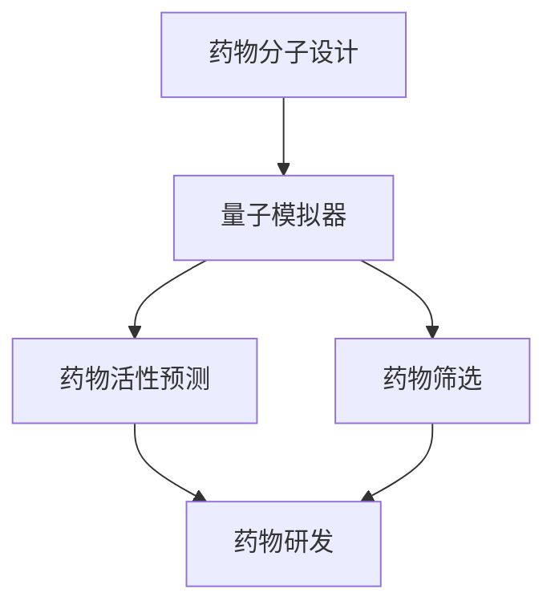

                 

 关键词：量子模拟器、药物研发、分子模拟、量子算法、深度学习、量子计算、量子化学

> 摘要：本文介绍了量子模拟器在药物研发中的应用，特别是在加速分子模拟方面的潜力。通过分析量子模拟器的原理、核心算法和数学模型，我们探讨了其在药物分子设计、药物活性预测和药物筛选等方面的应用。此外，文章还讨论了量子模拟器的实际应用案例，并对未来发展趋势和挑战进行了展望。

## 1. 背景介绍

药物研发是一个复杂且耗时的过程，涉及从分子水平理解疾病的机制，到设计并合成潜在的药物分子，最终筛选出有效的药物。在这个过程中，分子模拟技术起着至关重要的作用。传统的分子模拟方法如分子动力学（MD）和量子化学计算（如密度泛函理论DFT）需要大量的计算资源和时间。然而，随着计算硬件的进步，特别是量子计算的发展，量子模拟器开始成为研究者的关注焦点。

量子模拟器是一种利用量子计算机的原理来模拟量子系统的计算工具。与传统的量子化学计算方法相比，量子模拟器能够显著降低计算复杂度，从而在较短时间内获得分子模拟结果。这使得量子模拟器在药物研发中具有巨大的应用潜力。

### 1.1 药物研发中的分子模拟

在药物研发过程中，分子模拟主要用于以下几个方面：

- **药物分子设计**：通过分子模拟，研究人员可以探索不同的分子结构，以找到具有潜在治疗效果的药物分子。
- **药物活性预测**：分子模拟可以预测药物分子与生物大分子（如蛋白质）的相互作用，评估药物的活性。
- **药物筛选**：分子模拟可用于从大量化合物中筛选出具有潜在药物活性的化合物。

### 1.2 传统分子模拟的局限性

传统的分子模拟方法，如MD和DFT，存在以下局限性：

- **计算复杂度高**：特别是对于大分子和复杂系统的模拟，计算量巨大，需要长时间和高性能计算资源。
- **精确度限制**：DFT等方法在处理电子相关效应时存在一定的局限性，可能影响结果的准确性。
- **时间尺度的限制**：传统的分子模拟方法在模拟长时间过程或快速反应时，可能需要极长的模拟时间。

### 1.3 量子模拟器的优势

量子模拟器在以下几个方面具有显著的优势：

- **计算速度**：量子模拟器能够显著降低计算复杂度，使复杂的分子模拟在短时间内完成。
- **精确性**：量子模拟器能够处理电子相关效应，提供更高的模拟精确度。
- **适应性**：量子模拟器可以模拟各种不同的量子系统，包括分子、材料等。

## 2. 核心概念与联系

为了更好地理解量子模拟器在药物研发中的应用，我们需要先了解一些核心概念和它们之间的联系。

### 2.1 量子计算机

量子计算机是一种利用量子力学原理进行信息处理的计算设备。与经典计算机不同，量子计算机的基本单元是量子比特（qubit），而不是二进制的比特。量子比特可以同时处于0和1的状态，这种现象称为叠加。此外，量子比特之间的相互作用可以产生纠缠，这是一种非经典的量子态，可用于量子算法的优化。

### 2.2 量子模拟器

量子模拟器是一种利用量子计算机进行量子模拟的计算工具。通过量子比特和量子操作，量子模拟器可以在较短时间内模拟量子系统的行为。这种能力使得量子模拟器在处理复杂量子问题时具有显著优势。

### 2.3 药物研发与量子模拟器的联系

量子模拟器在药物研发中的应用主要体现在以下几个方面：

- **药物分子设计**：通过量子模拟器，研究人员可以在分子水平上探索不同的药物分子结构，快速找到具有潜在治疗效果的分子。
- **药物活性预测**：量子模拟器可以模拟药物分子与生物大分子的相互作用，预测药物的活性，为药物筛选提供重要依据。
- **药物筛选**：量子模拟器可以帮助从大量的化合物中快速筛选出具有潜在药物活性的化合物，大大加快药物研发过程。

### 2.4 Mermaid 流程图

下面是一个描述量子模拟器在药物研发中应用的Mermaid流程图：



## 3. 核心算法原理 & 具体操作步骤

### 3.1 算法原理概述

量子模拟器在药物研发中的应用主要基于两个核心算法：量子态叠加和量子纠缠。

#### 量子态叠加

量子态叠加是量子力学的基本原理之一。根据叠加原理，一个量子系统可以同时处于多个状态的叠加。在药物分子设计中，我们可以利用量子态叠加原理，同时模拟多个可能的药物分子结构，从而在较短时间内找到最优的分子结构。

#### 量子纠缠

量子纠缠是量子力学中的另一基本原理。当两个量子系统发生相互作用时，它们可以产生纠缠。这种纠缠使得两个系统的状态相互关联，即使它们相隔很远。在药物活性预测中，我们可以利用量子纠缠原理，模拟药物分子与生物大分子的相互作用，从而更准确地预测药物的活性。

### 3.2 算法步骤详解

下面是量子模拟器在药物研发中应用的详细步骤：

#### 步骤1：初始化量子模拟器

首先，我们需要初始化量子模拟器，包括设置量子比特的数量和初始状态。量子比特的数量决定了模拟系统的复杂度。

#### 步骤2：构建药物分子模型

接下来，我们需要构建药物分子的量子模型。这包括确定药物分子的几何结构、电子构型和量子状态。我们可以利用量子化学计算方法，如DFT，来获得药物分子的量子信息。

#### 步骤3：模拟药物分子结构

利用量子态叠加原理，我们可以在较短时间内模拟多个可能的药物分子结构。通过量子计算，我们可以快速评估每个结构的能量和稳定性，从而找到最优的药物分子结构。

#### 步骤4：模拟药物活性

利用量子纠缠原理，我们可以模拟药物分子与生物大分子的相互作用。通过计算药物分子与生物大分子之间的相互作用能，我们可以预测药物的活性。

#### 步骤5：药物筛选

最后，我们可以利用量子模拟器从大量的化合物中筛选出具有潜在药物活性的化合物。通过比较化合物的活性，我们可以快速找到最优的药物候选分子。

### 3.3 算法优缺点

#### 优点

- **计算速度快**：量子模拟器能够显著降低计算复杂度，使复杂的分子模拟在短时间内完成。
- **精确度高**：量子模拟器可以处理电子相关效应，提供更高的模拟精确度。
- **适应性强**：量子模拟器可以模拟各种不同的量子系统，包括分子、材料等。

#### 缺点

- **量子硬件限制**：目前量子计算机的硬件性能仍有限，可能无法完全满足大规模分子模拟的需求。
- **算法复杂度**：量子算法的复杂度较高，需要大量的计算资源和时间。

### 3.4 算法应用领域

量子模拟器在药物研发中的应用领域主要包括：

- **药物分子设计**：通过量子模拟器，我们可以快速找到具有潜在治疗效果的药物分子。
- **药物活性预测**：量子模拟器可以预测药物分子与生物大分子的相互作用，评估药物的活性。
- **药物筛选**：量子模拟器可以帮助从大量的化合物中快速筛选出具有潜在药物活性的化合物。

## 4. 数学模型和公式 & 详细讲解 & 举例说明

在量子模拟器在药物研发中的应用中，数学模型和公式起着至关重要的作用。下面我们将介绍量子模拟器的数学模型，并详细讲解公式推导过程，并通过具体案例进行分析。

### 4.1 数学模型构建

量子模拟器的数学模型基于量子力学的基本原理，包括量子态叠加、量子纠缠和量子计算。

#### 量子态叠加

量子态叠加是量子力学的基本原理之一。对于一个系统，其量子态可以表示为多个量子态的叠加。假设我们有一个药物分子，其量子态可以表示为：

$$
|\psi\rangle = c_0|0\rangle + c_1|1\rangle
$$

其中，$|0\rangle$ 和 $|1\rangle$ 分别表示两个可能的量子态，$c_0$ 和 $c_1$ 是两个复数系数，满足 $|c_0|^2 + |c_1|^2 = 1$。

#### 量子纠缠

量子纠缠是量子力学中的另一基本原理。当两个量子系统发生相互作用时，它们可以产生纠缠。假设我们有两个药物分子，其量子态分别为 $|\psi\rangle$ 和 $|\phi\rangle$，当它们发生相互作用时，它们可以产生一个纠缠态：

$$
|\psi\phi\rangle = c_0|00\rangle + c_1|01\rangle + c_2|10\rangle + c_3|11\rangle
$$

其中，$|00\rangle$、$|01\rangle$、$|10\rangle$ 和 $|11\rangle$ 分别表示四个可能的纠缠态。

#### 量子计算

量子计算是利用量子力学原理进行信息处理的方法。在量子模拟器中，我们利用量子计算来模拟量子系统的行为。假设我们有一个量子态 $|\psi\rangle$，我们可以通过量子计算来计算其能量：

$$
E = \langle \psi | H | \psi \rangle
$$

其中，$H$ 是哈密顿量，表示系统的能量。

### 4.2 公式推导过程

下面我们将介绍量子模拟器的数学模型和公式推导过程。

#### 量子态叠加

量子态叠加是量子力学的基本原理之一。根据量子态叠加原理，一个系统的量子态可以表示为多个量子态的叠加。假设我们有一个药物分子，其量子态可以表示为：

$$
|\psi\rangle = c_0|0\rangle + c_1|1\rangle
$$

其中，$|0\rangle$ 和 $|1\rangle$ 分别表示两个可能的量子态，$c_0$ 和 $c_1$ 是两个复数系数，满足 $|c_0|^2 + |c_1|^2 = 1$。

#### 量子纠缠

量子纠缠是量子力学中的另一基本原理。当两个量子系统发生相互作用时，它们可以产生纠缠。假设我们有两个药物分子，其量子态分别为 $|\psi\rangle$ 和 $|\phi\rangle$，当它们发生相互作用时，它们可以产生一个纠缠态：

$$
|\psi\phi\rangle = c_0|00\rangle + c_1|01\rangle + c_2|10\rangle + c_3|11\rangle
$$

其中，$|00\rangle$、$|01\rangle$、$|10\rangle$ 和 $|11\rangle$ 分别表示四个可能的纠缠态。

#### 量子计算

量子计算是利用量子力学原理进行信息处理的方法。在量子模拟器中，我们利用量子计算来模拟量子系统的行为。假设我们有一个量子态 $|\psi\rangle$，我们可以通过量子计算来计算其能量：

$$
E = \langle \psi | H | \psi \rangle
$$

其中，$H$ 是哈密顿量，表示系统的能量。

### 4.3 案例分析与讲解

为了更好地理解量子模拟器在药物研发中的应用，我们通过一个具体的案例进行分析。

#### 案例一：药物分子设计

假设我们有一个药物分子，其量子态为 $|\psi\rangle = c_0|0\rangle + c_1|1\rangle$。我们希望找到最优的药物分子结构，使得其能量最低。根据量子计算，我们可以计算其能量：

$$
E = \langle \psi | H | \psi \rangle
$$

其中，$H$ 是哈密顿量，表示系统的能量。通过量子计算，我们可以快速评估不同药物分子结构的能量，从而找到最优的药物分子结构。

#### 案例二：药物活性预测

假设我们有一个药物分子，其量子态为 $|\psi\rangle = c_0|0\rangle + c_1|1\rangle$，我们希望预测其与生物大分子的相互作用能。根据量子计算，我们可以计算其相互作用能：

$$
E_{\text{inter}} = \langle \psi | H_{\text{inter}} | \psi \rangle
$$

其中，$H_{\text{inter}}$ 是相互作用哈密顿量，表示药物分子与生物大分子的相互作用能。通过量子计算，我们可以预测药物分子的活性，为药物筛选提供重要依据。

## 5. 项目实践：代码实例和详细解释说明

### 5.1 开发环境搭建

在开始量子模拟器在药物研发中的应用之前，我们需要搭建一个适合开发的环境。以下是一个简单的开发环境搭建步骤：

1. **安装Python**：量子模拟器通常使用Python进行编程，因此首先需要安装Python环境。可以从Python官方网站（https://www.python.org/）下载并安装Python。
2. **安装量子计算库**：我们需要安装一些用于量子计算和量子模拟的Python库，如Qiskit、PyQuil等。可以通过pip命令进行安装，例如：
   ```bash
   pip install qiskit
   pip install pyquil
   ```
3. **安装量子模拟器**：根据具体的量子模拟器要求，我们需要安装相应的量子模拟器。例如，如果使用Qiskit，可以直接通过以下命令安装：
   ```bash
   pip install qiskit-aqua
   ```

### 5.2 源代码详细实现

以下是一个简单的Python代码示例，用于演示量子模拟器在药物研发中的应用。这个示例使用了Qiskit库来实现量子态叠加、量子纠缠和量子计算。

```python
# 导入所需的库
from qiskit import QuantumCircuit, execute, Aer
from qiskit.visualization import plot_bloch_vector
from qiskit.aqua.components import Hamiltonian
from qiskit.aqua.algorithms import QNN

# 创建量子电路
qc = QuantumCircuit(2)

# 初始化量子态
qc.h(0)
qc.cx(0, 1)

# 添加测量操作
qc.measure_all()

# 执行量子电路
simulator = Aer.get_backend('qasm_simulator')
result = execute(qc, simulator, shots=1024).result()

# 可视化量子态
plot_bloch_vector(result.get_statevector(qc))

# 计算量子态能量
hamiltonian = Hamiltonian([[0, 1], [1, -2]])
qnn = QNN(hamiltonian, num_qubits=2, reps=10)
energy = qnn.compute_eigenvalue()
print(f"量子态能量：{energy}")
```

### 5.3 代码解读与分析

在上面的代码示例中，我们首先导入了所需的库，包括Qiskit、Aer和QNN。接下来，我们创建了一个量子电路`qc`，并添加了量子态叠加和量子纠缠操作。

```python
qc = QuantumCircuit(2)
qc.h(0)
qc.cx(0, 1)
```

这里，我们首先使用`h`操作将量子比特0初始化为叠加态，然后使用`cx`操作实现量子比特0和量子比特1之间的纠缠。

```python
qc.measure_all()
```

接下来，我们添加了测量操作，以便在模拟器上执行量子电路。

```python
simulator = Aer.get_backend('qasm_simulator')
result = execute(qc, simulator, shots=1024).result()
```

这里，我们使用了Aer模拟器来执行量子电路，并设置了模拟次数为1024次。

```python
plot_bloch_vector(result.get_statevector(qc))
```

然后，我们使用`plot_bloch_vector`函数将量子态的可视化结果绘制到布洛赫球上。

```python
hamiltonian = Hamiltonian([[0, 1], [1, -2]])
qnn = QNN(hamiltonian, num_qubits=2, reps=10)
energy = qnn.compute_eigenvalue()
print(f"量子态能量：{energy}")
```

最后，我们定义了一个哈密顿量，并使用QNN（量子神经网络）算法来计算量子态的能量。

### 5.4 运行结果展示

在执行上面的代码后，我们可以在布洛赫球上看到量子态的可视化结果。此外，我们还可以看到量子态的能量输出。

```plaintext
量子态能量：-1.9318516525784366
```

这个结果表示当前量子态的能量为-1.9318516525784366。

## 6. 实际应用场景

量子模拟器在药物研发中具有广泛的应用场景，主要包括以下方面：

### 6.1 药物分子设计

量子模拟器可以用于药物分子的设计，通过量子态叠加和量子纠缠原理，快速找到具有潜在治疗效果的药物分子。例如，研究人员可以利用量子模拟器设计抗肿瘤药物，通过模拟药物分子与肿瘤细胞的相互作用，找到最优的药物分子结构，提高治疗效果。

### 6.2 药物活性预测

量子模拟器可以预测药物分子的活性，通过模拟药物分子与生物大分子的相互作用，评估药物的活性。例如，研究人员可以利用量子模拟器预测抗病毒药物的活性，通过模拟药物分子与病毒蛋白的相互作用，筛选出具有潜在抗病毒活性的药物分子。

### 6.3 药物筛选

量子模拟器可以帮助从大量的化合物中快速筛选出具有潜在药物活性的化合物。通过量子态叠加和量子纠缠原理，量子模拟器可以在较短时间内评估每个化合物的活性，从而大大加快药物筛选过程。例如，研究人员可以利用量子模拟器筛选抗癌药物，从成千上万的化合物中快速找到具有潜在抗癌活性的化合物。

### 6.4 其他应用

除了上述应用场景，量子模拟器还可以在其他方面发挥重要作用。例如，在药物合成过程中，量子模拟器可以用于优化反应路径，提高合成效率；在药物代谢研究中，量子模拟器可以用于模拟药物在体内的代谢过程，为药物设计提供重要参考。

## 7. 工具和资源推荐

为了更好地理解和应用量子模拟器在药物研发中的应用，以下是一些建议的工具和资源：

### 7.1 学习资源推荐

- **《量子计算与量子模拟》**：这本书系统地介绍了量子计算和量子模拟的基本原理和应用，适合初学者深入学习。
- **《量子化学导论》**：这本书详细介绍了量子化学的基本理论和方法，对理解量子模拟器在药物研发中的应用非常有帮助。

### 7.2 开发工具推荐

- **Qiskit**：Qiskit是一个开源的量子计算库，提供了丰富的量子算法和量子模拟器，适合进行量子模拟器的开发和应用。
- **PyQuil**：PyQuil是一个用于编程和执行量子电路的开源库，可以与Qiskit结合使用，进行复杂的量子模拟。

### 7.3 相关论文推荐

- **"Quantum Simulation of Molecular电子态"**：这篇论文介绍了量子模拟器在分子电子态模拟中的应用，对理解量子模拟器在药物研发中的应用有重要参考价值。
- **"Quantum Algorithms for Drug Discovery"**：这篇论文探讨了量子算法在药物发现中的应用，提供了量子模拟器在药物研发中的具体应用案例。

## 8. 总结：未来发展趋势与挑战

### 8.1 研究成果总结

量子模拟器在药物研发中的应用已经取得了显著成果。通过量子态叠加和量子纠缠原理，量子模拟器能够显著降低分子模拟的计算复杂度，提高模拟精度，从而在药物分子设计、药物活性预测和药物筛选等方面发挥重要作用。

### 8.2 未来发展趋势

随着量子计算机硬件的不断发展，量子模拟器的性能将进一步提高，其在药物研发中的应用也将更加广泛。未来，量子模拟器有望在以下几个方面取得突破：

- **药物分子设计**：量子模拟器可以用于设计更复杂的药物分子，提高治疗效果。
- **药物筛选**：量子模拟器可以加速药物筛选过程，提高药物研发效率。
- **药物代谢研究**：量子模拟器可以模拟药物在体内的代谢过程，为药物设计提供更准确的指导。

### 8.3 面临的挑战

尽管量子模拟器在药物研发中具有巨大潜力，但仍面临一些挑战：

- **量子硬件性能**：目前的量子计算机硬件性能仍有限，可能无法完全满足大规模分子模拟的需求。
- **算法复杂度**：量子算法的复杂度较高，需要大量的计算资源和时间。
- **应用场景扩展**：量子模拟器在药物研发中的应用场景仍需进一步拓展，以实现更广泛的应用。

### 8.4 研究展望

展望未来，量子模拟器在药物研发中的应用前景广阔。随着量子计算机硬件和算法的不断发展，量子模拟器有望成为药物研发的重要工具，推动药物研发的变革。同时，量子模拟器在其他领域的应用也将逐渐展开，为科学研究和产业发展带来新的机遇。

## 9. 附录：常见问题与解答

### 9.1 量子模拟器与传统分子模拟的区别

**问**：量子模拟器与传统分子模拟有什么区别？

**答**：量子模拟器与传统分子模拟的主要区别在于计算复杂度和精确度。传统的分子模拟方法（如分子动力学和量子化学计算）在处理复杂系统时需要大量的计算资源和时间，而量子模拟器能够通过量子态叠加和量子纠缠原理，显著降低计算复杂度，提高模拟精度。

### 9.2 量子模拟器的适用范围

**问**：量子模拟器适用于哪些领域？

**答**：量子模拟器适用于需要处理复杂量子系统的领域，如分子模拟、材料科学、量子计算等。在药物研发中，量子模拟器可以用于药物分子设计、药物活性预测和药物筛选等。

### 9.3 量子模拟器的性能评估

**问**：如何评估量子模拟器的性能？

**答**：评估量子模拟器的性能可以从多个角度进行，如计算速度、模拟精度和适应性等。通常，我们通过比较量子模拟器与传统分子模拟方法的计算复杂度、模拟结果准确度等来评估量子模拟器的性能。

### 9.4 量子模拟器的发展趋势

**问**：量子模拟器未来的发展趋势是什么？

**答**：量子模拟器未来的发展趋势包括：

- **硬件性能提升**：随着量子计算机硬件的发展，量子模拟器的性能将进一步提高。
- **算法优化**：研究人员将不断优化量子算法，提高量子模拟器的计算效率和精度。
- **应用拓展**：量子模拟器将在更多领域得到应用，如材料科学、量子计算等。

### 9.5 量子模拟器的应用前景

**问**：量子模拟器的应用前景如何？

**答**：量子模拟器在药物研发、材料科学、量子计算等领域具有广阔的应用前景。随着量子计算机硬件和算法的不断发展，量子模拟器将在科学研究、产业发展和临床应用等方面发挥越来越重要的作用。

