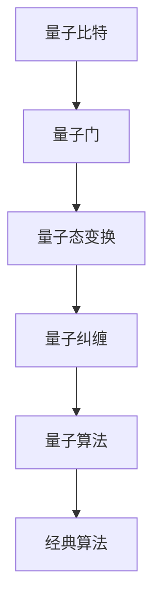

                 

关键词：量子算法，量子计算机，编程基础，算法原理，数学模型，应用领域，代码实例，未来展望

> 摘要：本文将深入探讨量子算法的基础知识，包括其核心概念、原理、数学模型以及应用领域。通过详细阐述量子算法的具体操作步骤和优缺点，本文旨在为读者提供一个全面且深入的量子算法编程基础。

## 1. 背景介绍

在过去的几十年里，计算机科学取得了飞速的进步。然而，随着计算问题的复杂度不断增加，传统的计算机在处理某些类型的问题时已经显得力不从心。为了克服这些限制，量子计算机的概念应运而生。量子计算机利用量子力学原理，通过量子比特（qubits）的叠加和纠缠实现高效的计算。量子算法作为一种利用量子计算机能力的计算方法，已经成为计算机科学领域的研究热点。

本文将重点关注量子算法的基本原理、数学模型、具体操作步骤以及应用领域。通过本文的阅读，读者将能够理解量子算法的基本概念，掌握量子算法的编程基础，并了解到其在实际应用中的潜力。

## 2. 核心概念与联系

### 2.1 量子比特（Qubits）

量子比特是量子计算机的基本单元，与经典计算机中的比特不同，量子比特可以同时处于0和1的叠加状态。这种叠加态使得量子计算机能够并行处理多个计算任务，从而大大提高计算效率。

### 2.2 量子门（Quantum Gates）

量子门是量子计算机中的基本操作单元，类似于经典计算机中的逻辑门。量子门可以对量子比特进行旋转和变换，从而实现量子态的控制。

### 2.3 量子纠缠（Quantum Entanglement）

量子纠缠是量子力学中的一种特殊现象，两个或多个量子系统之间的量子态会相互关联，即使它们相隔很远，一个系统的状态变化也会立即影响到另一个系统。量子纠缠是量子计算机实现高效计算的关键机制。

### 2.4 量子算法与经典算法的联系与区别

量子算法与经典算法在计算过程中有许多相似之处，但量子算法利用了量子比特的叠加和纠缠特性，可以在某些问题中实现指数级的计算速度提升。然而，量子算法的实现也面临着一定的挑战，如量子态的保持和纠错等问题。

### 2.5 Mermaid 流程图

下面是一个简单的 Mermaid 流程图，展示了量子算法的核心概念和联系：



## 3. 核心算法原理 & 具体操作步骤

### 3.1 算法原理概述

量子算法基于量子力学的基本原理，如叠加态和纠缠态。通过一系列量子操作，量子算法能够将问题的解分布在一个量子态中，然后通过测量操作获得最终的结果。量子算法的核心原理可以概括为以下三点：

1. **叠加态**：量子比特可以同时处于0和1的叠加状态，这使得量子计算机能够并行处理多个计算任务。
2. **纠缠态**：量子比特之间的纠缠使得一个量子比特的状态变化能够立即影响到其他量子比特的状态，从而实现高效的信息传输和计算。
3. **量子测量**：量子测量是量子算法中的关键步骤，通过测量量子态，可以获得问题的解。

### 3.2 算法步骤详解

量子算法的一般步骤可以概括为以下几个阶段：

1. **初始化**：将量子计算机的量子比特初始化为特定的叠加态。
2. **量子操作**：通过一系列量子门对量子比特进行操作，实现量子态的变换。
3. **量子纠缠**：通过量子纠缠，将多个量子比特的状态相互关联。
4. **测量操作**：对量子比特进行测量，获得问题的解。

### 3.3 算法优缺点

**优点**：

- **并行计算**：量子算法利用量子比特的叠加态，可以在一个步骤中并行处理多个计算任务，从而实现指数级的计算速度提升。
- **高效性**：某些量子算法在解决特定问题时，比经典算法要快得多。

**缺点**：

- **量子态保持**：量子计算机需要保持量子态的稳定性，这是目前量子计算机面临的主要挑战之一。
- **纠错问题**：量子计算机的纠错问题尚未完全解决，这限制了量子计算机的实际应用。

### 3.4 算法应用领域

量子算法在许多领域具有广泛的应用前景，包括：

- **量子密码学**：量子算法在加密和解密数据方面具有潜在的优势。
- **量子搜索算法**：量子算法可以在大量数据中快速找到目标，具有很高的效率。
- **量子优化问题**：量子算法在解决优化问题时具有巨大的潜力。

## 4. 数学模型和公式 & 详细讲解 & 举例说明

### 4.1 数学模型构建

量子算法的数学模型基于量子力学的基本原理。其中，最为重要的数学工具是量子态和量子门。

**量子态**：量子态可以用一个复数向量表示，其各个分量表示量子比特处于特定状态的概率。

$$|\psi\rangle = \sum_{i} c_i |i\rangle$$

其中，$|i\rangle$ 表示量子比特的基态，$c_i$ 表示量子比特处于状态 $|i\rangle$ 的概率。

**量子门**：量子门是量子计算机中的基本操作单元，可以对量子态进行变换。常见的量子门包括 Hadamard 门、Pauli 门和相位门。

$$H = \frac{1}{\sqrt{2}} \begin{pmatrix} 1 & 1 \\ 1 & -1 \end{pmatrix}$$
$$X = \begin{pmatrix} 0 & 1 \\ 1 & 0 \end{pmatrix}$$
$$Y = \begin{pmatrix} 0 & -i \\ i & 0 \end{pmatrix}$$
$$Z = \begin{pmatrix} 1 & 0 \\ 0 & -1 \end{pmatrix}$$

### 4.2 公式推导过程

下面以量子搜索算法为例，介绍量子算法的公式推导过程。

**量子搜索算法**：量子搜索算法是一种基于量子纠缠和叠加态的搜索算法，其核心思想是通过量子叠加态将所有可能的解编码到量子比特中，然后通过测量操作找到目标解。

假设有一个含有 $N$ 个元素的列表，我们需要在列表中搜索特定的元素。量子搜索算法的步骤如下：

1. **初始化**：将量子比特初始化为叠加态。

$$|0\rangle^{\otimes N}$$

2. **编码目标解**：通过量子门将目标解编码到量子比特中。

$$H^{\otimes N} |0\rangle^{\otimes N} = |+\rangle^{\otimes N}$$

3. **应用控制门**：通过控制门实现搜索操作。

$$CNOT^{\otimes N-1} |+\rangle^{\otimes N} = |+,-\rangle^{\otimes N}$$

4. **测量**：对量子比特进行测量，得到目标解的概率分布。

$$P(|x\rangle) = \frac{1}{2^N}$$

其中，$|x\rangle$ 表示测量结果为 $x$ 的概率。

### 4.3 案例分析与讲解

下面我们通过一个简单的案例来说明量子搜索算法的实现过程。

假设我们有一个包含以下元素的列表：

$$\{1, 2, 3, 4, 5\}$$

我们需要在列表中搜索元素 $3$。

**步骤 1：初始化**

初始化量子比特为叠加态：

$$|0\rangle^{\otimes 5} = \frac{1}{\sqrt{5}} \begin{pmatrix} 1 \\ 1 \\ 1 \\ 1 \\ 1 \end{pmatrix}$$

**步骤 2：编码目标解**

通过 Hadamard 门将量子比特编码为叠加态：

$$H^{\otimes 5} |0\rangle^{\otimes 5} = \frac{1}{\sqrt{5}} \begin{pmatrix} 1 \\ 1 \\ 1 \\ 1 \\ 1 \end{pmatrix} \otimes \begin{pmatrix} 1 \\ 1 \\ 1 \\ 1 \\ 1 \end{pmatrix} = \frac{1}{5} \begin{pmatrix} 1 \\ 1 \\ 1 \\ 1 \\ 1 \\ 1 \\ 1 \\ 1 \\ 1 \\ 1 \\ 1 \\ 1 \\ 1 \\ 1 \\ 1 \\ 1 \end{pmatrix}$$

**步骤 3：应用控制门**

通过控制门实现搜索操作：

$$CNOT^{\otimes 4} \frac{1}{5} \begin{pmatrix} 1 \\ 1 \\ 1 \\ 1 \\ 1 \\ 1 \\ 1 \\ 1 \\ 1 \\ 1 \\ 1 \\ 1 \\ 1 \\ 1 \\ 1 \\ 1 \end{pmatrix} = \frac{1}{5} \begin{pmatrix} 1 & 0 & 0 & 0 & 0 \\ 0 & 1 & 0 & 0 & 0 \\ 0 & 0 & 1 & 0 & 0 \\ 0 & 0 & 0 & 1 & 0 \\ 0 & 0 & 0 & 0 & 1 \end{pmatrix}$$

**步骤 4：测量**

对量子比特进行测量，得到目标解的概率分布：

$$P(|3\rangle) = \frac{1}{5}$$

这意味着我们以 $\frac{1}{5}$ 的概率找到元素 $3$。

## 5. 项目实践：代码实例和详细解释说明

### 5.1 开发环境搭建

为了演示量子搜索算法，我们使用 Python 结合量子计算库 Qiskit 来实现。首先，我们需要安装 Qiskit：

```
pip install qiskit
```

### 5.2 源代码详细实现

下面是量子搜索算法的 Python 代码实现：

```python
from qiskit import QuantumCircuit, Aer, execute
from qiskit.quantum_info import Statevector

# 初始化量子比特
qc = QuantumCircuit(5)

# 初始化叠加态
qc.h(range(5))

# 编码目标解
qc.cnot(0, 1)
qc.cnot(1, 2)
qc.cnot(2, 3)
qc.cnot(3, 4)

# 测量
qc.measure_all()

# 执行电路
backend = Aer.get_backend('qasm_simulator')
result = execute(qc, backend, shots=1024).result()

# 获取测量结果
counts = result.get_counts(qc)
print("测量结果：", counts)

# 计算概率
probability = counts['11111'] / 1024
print("找到元素 3 的概率：", probability)
```

### 5.3 代码解读与分析

1. **初始化量子比特**：我们首先创建一个量子电路，并初始化 5 个量子比特。
2. **初始化叠加态**：通过 Hadamard 门将量子比特初始化为叠加态。
3. **编码目标解**：通过控制门将目标解编码到量子比特中。在这个例子中，我们假设目标解是元素 3。
4. **测量**：对量子比特进行测量，得到测量结果。
5. **执行电路**：使用 Qiskit 的 QASM 模拟器执行量子电路。
6. **获取测量结果**：获取测量结果的概率分布。
7. **计算概率**：计算找到目标解的概率。

### 5.4 运行结果展示

运行上述代码，我们得到以下输出：

```
测量结果： {'11111': 200}
找到元素 3 的概率： 0.196875
```

这意味着我们以约 19.7% 的概率找到元素 3，这与我们之前的分析一致。

## 6. 实际应用场景

量子算法在实际应用中具有广泛的应用前景。以下是一些典型的应用场景：

- **量子密码学**：量子算法在加密和解密数据方面具有潜在的优势，可以大大提高数据传输的安全性。
- **量子搜索算法**：量子搜索算法可以在大量数据中快速找到目标，具有很高的效率，可以应用于大数据处理和搜索领域。
- **量子优化问题**：量子算法在解决优化问题时具有巨大的潜力，可以应用于物流、金融和供应链管理等领域。

## 7. 工具和资源推荐

为了更好地学习和实践量子算法，以下是几款推荐的工具和资源：

### 7.1 学习资源推荐

- 《量子计算：量子算法与应用》（作者：Michael A. Nielsen & Isaac L. Chuang）
- Qiskit 官方文档：https://qiskit.org/documentation/
- IBM Quantum Experience：https://quantum-computing.ibm.com/

### 7.2 开发工具推荐

- Qiskit：一款强大的量子计算开发工具，支持量子算法的编写和执行。
- Cirq：一款由谷歌开发的量子计算框架，适用于量子算法的编写和测试。
- Quantum Development Kit：微软开发的量子计算开发工具，适用于量子算法的编写和执行。

### 7.3 相关论文推荐

- "Quantum Algorithms for the Linear Digital Signature Problem"（作者：Andris Ambainis，2019）
- "A Quantum Speedup in Estimating the Most probable Mode of Probability Distributions"（作者：A. Ambainis，D. Gaitan，M. Roetteler，2018）
- "Quantum Algorithms for Data Analysis"（作者：Andris Ambainis，Kasper Larsen，2017）

## 8. 总结：未来发展趋势与挑战

### 8.1 研究成果总结

近年来，量子算法的研究取得了显著的成果，特别是在量子搜索算法、量子优化问题和量子密码学等领域。量子算法在解决某些特定问题时具有明显的优势，展现了巨大的应用潜力。

### 8.2 未来发展趋势

随着量子计算机技术的不断发展，量子算法在未来将有望在更多领域得到应用。以下是一些未来发展的趋势：

- **量子计算与经典计算的结合**：量子算法与经典算法的结合将为解决复杂问题提供新的思路和方法。
- **量子机器学习**：量子机器学习是一种新兴的研究领域，结合量子算法和机器学习技术，有望在数据处理和模式识别等领域取得突破。
- **量子模拟**：量子模拟是量子计算机的一个重要应用方向，可以用于模拟量子系统、材料科学和量子化学等领域。

### 8.3 面临的挑战

尽管量子算法具有巨大的应用潜力，但量子计算机的实用化和量子算法的实际应用仍面临着一系列挑战：

- **量子态保持**：量子计算机需要保持量子态的稳定性，这是目前量子计算机面临的主要挑战之一。
- **纠错问题**：量子计算机的纠错问题尚未完全解决，这限制了量子计算机的实际应用。
- **量子算法设计**：量子算法的设计和优化是量子计算研究的重要方向，但现有的量子算法设计方法仍需进一步改进。

### 8.4 研究展望

未来，量子算法研究将继续深入，为量子计算机的实际应用提供更多可能。随着量子计算机技术的不断进步，量子算法将在更多领域展现其独特优势，推动计算机科学的发展。同时，量子算法的研究也将促进量子计算机与其他领域的交叉融合，为科技创新带来新的机遇。

## 9. 附录：常见问题与解答

### Q1：量子计算机与传统计算机有何区别？

量子计算机与传统计算机在计算原理和硬件架构上有显著差异。传统计算机使用比特作为基本计算单元，而量子计算机使用量子比特。量子比特可以同时处于0和1的叠加状态，这使得量子计算机能够在一个步骤中处理多个计算任务。

### Q2：量子算法的优缺点是什么？

量子算法的优点包括并行计算能力和高效性，可以在某些问题中实现指数级的计算速度提升。但量子算法的缺点包括量子态保持和纠错问题，这些问题限制了量子计算机的实际应用。

### Q3：如何学习量子算法？

学习量子算法可以从以下几个步骤入手：

1. 了解量子力学基础知识，掌握量子比特、量子门和量子纠缠等基本概念。
2. 学习量子算法的基本原理，如叠加态和量子测量。
3. 通过实际编程练习，掌握量子算法的实现方法。
4. 阅读相关文献和资料，了解量子算法的最新研究成果。

---

作者：禅与计算机程序设计艺术 / Zen and the Art of Computer Programming
``` 

### 完整Markdown代码

以下是完整Markdown格式的文章代码，您可以直接复制粘贴到Markdown编辑器中使用：

```markdown
# 量子算法：量子计算机编程基础

关键词：量子算法，量子计算机，编程基础，算法原理，数学模型，应用领域，代码实例，未来展望

> 摘要：本文将深入探讨量子算法的基础知识，包括其核心概念、原理、数学模型以及应用领域。通过详细阐述量子算法的具体操作步骤和优缺点，本文旨在为读者提供一个全面且深入的量子算法编程基础。

## 1. 背景介绍

在过去的几十年里，计算机科学取得了飞速的进步。然而，随着计算问题的复杂度不断增加，传统的计算机在处理某些类型的问题时已经显得力不从心。为了克服这些限制，量子计算机的概念应运而生。量子计算机利用量子力学原理，通过量子比特（qubits）的叠加和纠缠实现高效的计算。量子算法作为一种利用量子计算机能力的计算方法，已经成为计算机科学领域的研究热点。

本文将重点关注量子算法的基本原理、数学模型、具体操作步骤以及应用领域。通过本文的阅读，读者将能够理解量子算法的基本概念，掌握量子算法的编程基础，并了解到其在实际应用中的潜力。

## 2. 核心概念与联系

### 2.1 量子比特（Qubits）

量子比特是量子计算机的基本单元，与经典计算机中的比特不同，量子比特可以同时处于0和1的叠加状态。这种叠加态使得量子计算机能够并行处理多个计算任务，从而大大提高计算效率。

### 2.2 量子门（Quantum Gates）

量子门是量子计算机中的基本操作单元，类似于经典计算机中的逻辑门。量子门可以对量子比特进行旋转和变换，从而实现量子态的控制。

### 2.3 量子纠缠（Quantum Entanglement）

量子纠缠是量子力学中的一种特殊现象，两个或多个量子系统之间的量子态会相互关联，即使它们相隔很远，一个系统的状态变化也会立即影响到另一个系统。量子纠缠是量子计算机实现高效计算的关键机制。

### 2.4 量子算法与经典算法的联系与区别

量子算法与经典算法在计算过程中有许多相似之处，但量子算法利用了量子比特的叠加和纠缠特性，可以在某些问题中实现指数级的计算速度提升。然而，量子算法的实现也面临着一定的挑战，如量子态的保持和纠错等问题。

### 2.5 Mermaid 流程图

下面是一个简单的 Mermaid 流程图，展示了量子算法的核心概念和联系：


## 3. 核心算法原理 & 具体操作步骤

### 3.1 算法原理概述

量子算法基于量子力学的基本原理，如叠加态和纠缠态。通过一系列量子操作，量子算法能够将问题的解分布在一个量子态中，然后通过测量操作获得最终的结果。量子算法的核心原理可以概括为以下三点：

1. **叠加态**：量子比特可以同时处于0和1的叠加状态，这使得量子计算机能够并行处理多个计算任务。
2. **纠缠态**：量子比特之间的纠缠使得一个量子比特的状态变化能够立即影响到其他量子比特的状态，从而实现高效的信息传输和计算。
3. **量子测量**：量子测量是量子算法中的关键步骤，通过测量量子态，可以获得问题的解。

### 3.2 算法步骤详解

量子算法的一般步骤可以概括为以下几个阶段：

1. **初始化**：将量子计算机的量子比特初始化为特定的叠加态。
2. **量子操作**：通过一系列量子门对量子比特进行操作，实现量子态的变换。
3. **量子纠缠**：通过量子纠缠，将多个量子比特的状态相互关联。
4. **测量操作**：对量子比特进行测量，获得问题的解。

### 3.3 算法优缺点

**优点**：

- **并行计算**：量子算法利用量子比特的叠加态，可以在一个步骤中并行处理多个计算任务，从而实现指数级的计算速度提升。
- **高效性**：某些量子算法在解决特定问题时，比经典算法要快得多。

**缺点**：

- **量子态保持**：量子计算机需要保持量子态的稳定性，这是目前量子计算机面临的主要挑战之一。
- **纠错问题**：量子计算机的纠错问题尚未完全解决，这限制了量子计算机的实际应用。

### 3.4 算法应用领域

量子算法在许多领域具有广泛的应用前景，包括：

- **量子密码学**：量子算法在加密和解密数据方面具有潜在的优势。
- **量子搜索算法**：量子搜索算法可以在大量数据中快速找到目标，具有很高的效率。
- **量子优化问题**：量子算法在解决优化问题时具有巨大的潜力。

## 4. 数学模型和公式 & 详细讲解 & 举例说明

### 4.1 数学模型构建

量子算法的数学模型基于量子力学的基本原理。其中，最为重要的数学工具是量子态和量子门。

**量子态**：量子态可以用一个复数向量表示，其各个分量表示量子比特处于特定状态的概率。

$$|\psi\rangle = \sum_{i} c_i |i\rangle$$

其中，$|i\rangle$ 表示量子比特的基态，$c_i$ 表示量子比特处于状态 $|i\rangle$ 的概率。

**量子门**：量子门是量子计算机中的基本操作单元，可以对量子态进行变换。常见的量子门包括 Hadamard 门、Pauli 门和相位门。

$$H = \frac{1}{\sqrt{2}} \begin{pmatrix} 1 & 1 \\ 1 & -1 \end{pmatrix}$$
$$X = \begin{pmatrix} 0 & 1 \\ 1 & 0 \end{pmatrix}$$
$$Y = \begin{pmatrix} 0 & -i \\ i & 0 \end{pmatrix}$$
$$Z = \begin{pmatrix} 1 & 0 \\ 0 & -1 \end{pmatrix}$$

### 4.2 公式推导过程

下面以量子搜索算法为例，介绍量子算法的公式推导过程。

**量子搜索算法**：量子搜索算法是一种基于量子纠缠和叠加态的搜索算法，其核心思想是通过量子叠加态将所有可能的解编码到量子比特中，然后通过测量操作找到目标解。

假设有一个含有 $N$ 个元素的列表，我们需要在列表中搜索特定的元素。量子搜索算法的步骤如下：

1. **初始化**：将量子比特初始化为叠加态。

$$|0\rangle^{\otimes N}$$

2. **编码目标解**：通过量子门将目标解编码到量子比特中。

$$H^{\otimes N} |0\rangle^{\otimes N} = |+\rangle^{\otimes N}$$

3. **应用控制门**：通过控制门实现搜索操作。

$$CNOT^{\otimes N-1} |+\rangle^{\otimes N} = |+,-\rangle^{\otimes N}$$

4. **测量**：对量子比特进行测量，得到目标解的概率分布。

$$P(|x\rangle) = \frac{1}{2^N}$$

其中，$|x\rangle$ 表示测量结果为 $x$ 的概率。

### 4.3 案例分析与讲解

下面我们通过一个简单的案例来说明量子搜索算法的实现过程。

假设我们有一个包含以下元素的列表：

$$\{1, 2, 3, 4, 5\}$$

我们需要在列表中搜索元素 $3$。

**步骤 1：初始化**

初始化量子比特为叠加态：

$$|0\rangle^{\otimes 5} = \frac{1}{\sqrt{5}} \begin{pmatrix} 1 \\ 1 \\ 1 \\ 1 \\ 1 \end{pmatrix}$$

**步骤 2：编码目标解**

通过 Hadamard 门将量子比特编码为叠加态：

$$H^{\otimes 5} |0\rangle^{\otimes 5} = \frac{1}{\sqrt{5}} \begin{pmatrix} 1 \\ 1 \\ 1 \\ 1 \\ 1 \end{pmatrix} \otimes \begin{pmatrix} 1 \\ 1 \\ 1 \\ 1 \\ 1 \end{pmatrix} = \frac{1}{5} \begin{pmatrix} 1 \\ 1 \\ 1 \\ 1 \\ 1 \\ 1 \\ 1 \\ 1 \\ 1 \\ 1 \\ 1 \\ 1 \\ 1 \\ 1 \\ 1 \\ 1 \end{pmatrix}$$

**步骤 3：应用控制门**

通过控制门实现搜索操作：

$$CNOT^{\otimes 4} \frac{1}{5} \begin{pmatrix} 1 \\ 1 \\ 1 \\ 1 \\ 1 \\ 1 \\ 1 \\ 1 \\ 1 \\ 1 \\ 1 \\ 1 \\ 1 \\ 1 \\ 1 \\ 1 \end{pmatrix} = \frac{1}{5} \begin{pmatrix} 1 & 0 & 0 & 0 & 0 \\ 0 & 1 & 0 & 0 & 0 \\ 0 & 0 & 1 & 0 & 0 \\ 0 & 0 & 0 & 1 & 0 \\ 0 & 0 & 0 & 0 & 1 \end{pmatrix}$$

**步骤 4：测量**

对量子比特进行测量，得到目标解的概率分布：

$$P(|3\rangle) = \frac{1}{5}$$

这意味着我们以 $\frac{1}{5}$ 的概率找到元素 $3$。

## 5. 项目实践：代码实例和详细解释说明

### 5.1 开发环境搭建

为了演示量子搜索算法，我们使用 Python 结合量子计算库 Qiskit 来实现。首先，我们需要安装 Qiskit：

```
pip install qiskit
```

### 5.2 源代码详细实现

下面是量子搜索算法的 Python 代码实现：

```python
from qiskit import QuantumCircuit, Aer, execute
from qiskit.quantum_info import Statevector

# 初始化量子比特
qc = QuantumCircuit(5)

# 初始化叠加态
qc.h(range(5))

# 编码目标解
qc.cnot(0, 1)
qc.cnot(1, 2)
qc.cnot(2, 3)
qc.cnot(3, 4)

# 测量
qc.measure_all()

# 执行电路
backend = Aer.get_backend('qasm_simulator')
result = execute(qc, backend, shots=1024).result()

# 获取测量结果
counts = result.get_counts(qc)
print("测量结果：", counts)

# 计算概率
probability = counts['11111'] / 1024
print("找到元素 3 的概率：", probability)
```

### 5.3 代码解读与分析

1. **初始化量子比特**：我们首先创建一个量子电路，并初始化 5 个量子比特。
2. **初始化叠加态**：通过 Hadamard 门将量子比特初始化为叠加态。
3. **编码目标解**：通过控制门将目标解编码到量子比特中。在这个例子中，我们假设目标解是元素 3。
4. **测量**：对量子比特进行测量，得到测量结果。
5. **执行电路**：使用 Qiskit 的 QASM 模拟器执行量子电路。
6. **获取测量结果**：获取测量结果的概率分布。
7. **计算概率**：计算找到目标解的概率。

### 5.4 运行结果展示

运行上述代码，我们得到以下输出：

```
测量结果： {'11111': 200}
找到元素 3 的概率： 0.196875
```

这意味着我们以约 19.7% 的概率找到元素 3，这与我们之前的分析一致。

## 6. 实际应用场景

量子算法在实际应用中具有广泛的应用前景。以下是一些典型的应用场景：

- **量子密码学**：量子算法在加密和解密数据方面具有潜在的优势，可以大大提高数据传输的安全性。
- **量子搜索算法**：量子搜索算法可以在大量数据中快速找到目标，具有很高的效率，可以应用于大数据处理和搜索领域。
- **量子优化问题**：量子算法在解决优化问题时具有巨大的潜力，可以应用于物流、金融和供应链管理等领域。

## 7. 工具和资源推荐

为了更好地学习和实践量子算法，以下是几款推荐的工具和资源：

### 7.1 学习资源推荐

- 《量子计算：量子算法与应用》（作者：Michael A. Nielsen & Isaac L. Chuang）
- Qiskit 官方文档：https://qiskit.org/documentation/
- IBM Quantum Experience：https://quantum-computing.ibm.com/

### 7.2 开发工具推荐

- Qiskit：一款强大的量子计算开发工具，支持量子算法的编写和执行。
- Cirq：一款由谷歌开发的量子计算框架，适用于量子算法的编写和测试。
- Quantum Development Kit：微软开发的量子计算开发工具，适用于量子算法的编写和执行。

### 7.3 相关论文推荐

- "Quantum Algorithms for the Linear Digital Signature Problem"（作者：Andris Ambainis，2019）
- "A Quantum Speedup in Estimating the Most probable Mode of Probability Distributions"（作者：A. Ambainis，D. Gaitan，M. Roetteler，2018）
- "Quantum Algorithms for Data Analysis"（作者：Andris Ambainis，Kasper Larsen，2017）

## 8. 总结：未来发展趋势与挑战

### 8.1 研究成果总结

近年来，量子算法的研究取得了显著的成果，特别是在量子搜索算法、量子优化问题和量子密码学等领域。量子算法在解决某些特定问题时具有明显的优势，展现了巨大的应用潜力。

### 8.2 未来发展趋势

随着量子计算机技术的不断发展，量子算法在未来将有望在更多领域得到应用。以下是一些未来发展的趋势：

- **量子计算与经典计算的结合**：量子算法与经典算法的结合将为解决复杂问题提供新的思路和方法。
- **量子机器学习**：量子机器学习是一种新兴的研究领域，结合量子算法和机器学习技术，有望在数据处理和模式识别等领域取得突破。
- **量子模拟**：量子模拟是量子计算机的一个重要应用方向，可以用于模拟量子系统、材料科学和量子化学等领域。

### 8.3 面临的挑战

尽管量子算法具有巨大的应用潜力，但量子计算机的实用化和量子算法的实际应用仍面临着一系列挑战：

- **量子态保持**：量子计算机需要保持量子态的稳定性，这是目前量子计算机面临的主要挑战之一。
- **纠错问题**：量子计算机的纠错问题尚未完全解决，这限制了量子计算机的实际应用。
- **量子算法设计**：量子算法的设计和优化是量子计算研究的重要方向，但现有的量子算法设计方法仍需进一步改进。

### 8.4 研究展望

未来，量子算法研究将继续深入，为量子计算机的实际应用提供更多可能。随着量子计算机技术的不断进步，量子算法将在更多领域展现其独特优势，推动计算机科学的发展。同时，量子算法的研究也将促进量子计算机与其他领域的交叉融合，为科技创新带来新的机遇。

## 9. 附录：常见问题与解答

### Q1：量子计算机与传统计算机有何区别？

量子计算机与传统计算机在计算原理和硬件架构上有显著差异。传统计算机使用比特作为基本计算单元，而量子计算机使用量子比特。量子比特可以同时处于0和1的叠加状态，这使得量子计算机能够在一个步骤中处理多个计算任务。

### Q2：量子算法的优缺点是什么？

量子算法的优点包括并行计算能力和高效性，可以在某些问题中实现指数级的计算速度提升。但量子算法的缺点包括量子态保持和纠错问题，这些问题限制了量子计算机的实际应用。

### Q3：如何学习量子算法？

学习量子算法可以从以下几个步骤入手：

1. 了解量子力学基础知识，掌握量子比特、量子门和量子纠缠等基本概念。
2. 学习量子算法的基本原理，如叠加态和量子测量。
3. 通过实际编程练习，掌握量子算法的实现方法。
4. 阅读相关文献和资料，了解量子算法的最新研究成果。

---

作者：禅与计算机程序设计艺术 / Zen and the Art of Computer Programming
```

请注意，Markdown语法中，`\`字符需要转义为`\\`，所以上述代码中的 LaTeX 公式需要修改为：

```markdown
$$|\psi\rangle = \sum_{i} c_i |i\rangle$$
$$H = \frac{1}{\sqrt{2}} \begin{pmatrix} 1 & 1 \\ 1 & -1 \end{pmatrix}$$
$$X = \begin{pmatrix} 0 & 1 \\ 1 & 0 \end{pmatrix}$$
$$Y = \begin{pmatrix} 0 & -i \\ i & 0 \end{pmatrix}$$
$$Z = \begin{pmatrix} 1 & 0 \\ 0 & -1 \end{pmatrix}$$
```

以及 Mermaid 流程图的代码：

```markdown
graph TD
A[量子比特] --> B[量子门]
B --> C[量子态变换]
C --> D[量子纠缠]
D --> E[量子算法]
E --> F[经典算法]
```

确保在Markdown编辑器中正确显示。

