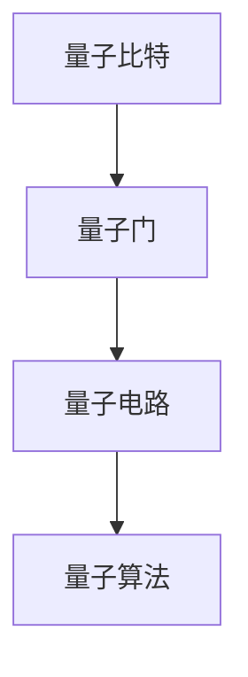

                 

关键词：量子算法、量子计算机、编程基础、量子比特、量子门、量子逻辑门、量子纠缠、量子电路、量子编程、Shor算法、Grover算法

> 摘要：本文将深入探讨量子算法的基础知识，包括量子比特、量子门、量子电路等核心概念，并通过具体算法实例如Shor算法和Grover算法，展示量子算法的实际应用和编程技巧。文章旨在为读者提供量子计算机编程的入门指南，帮助理解量子算法的核心原理和实现方法。

## 1. 背景介绍

随着量子计算技术的不断发展，量子算法成为了计算机科学领域的一个热点话题。量子计算机利用量子力学原理进行信息处理，相比于传统的经典计算机，其具有超越经典计算能力的潜力。量子算法在密码学、优化问题、搜索问题等方面展现出强大的性能优势，成为现代科技发展的关键推动力。

本文将围绕量子算法的核心概念和编程基础进行探讨，通过具体算法实例的分析，帮助读者理解和掌握量子编程的基本方法。文章结构如下：

- **第1部分：背景介绍**：介绍量子算法的研究背景和意义。
- **第2部分：核心概念与联系**：解释量子比特、量子门、量子电路等核心概念，并展示其架构关系。
- **第3部分：核心算法原理与操作步骤**：详细介绍Shor算法和Grover算法的原理和实现步骤。
- **第4部分：数学模型和公式**：探讨量子算法中的数学模型和公式，并通过实例进行说明。
- **第5部分：项目实践**：提供量子算法的代码实例，详细解释代码的实现过程。
- **第6部分：实际应用场景**：讨论量子算法在各个领域的应用。
- **第7部分：工具和资源推荐**：推荐学习资源和开发工具。
- **第8部分：总结**：总结研究成果，探讨未来发展趋势和面临的挑战。
- **第9部分：附录**：解答常见问题。

### 2. 核心概念与联系

量子计算的基础是量子比特（qubit），它是量子计算机的基本存储单元。量子比特可以处于0和1的叠加状态，这与经典计算机中的比特（bit）不同，后者只能处于0或1的确定状态。

量子门是量子计算机中的基本操作单元，类似于经典计算机中的逻辑门。量子门作用于量子比特，可以改变量子态的叠加和纠缠关系。量子门通常表示为矩阵操作，这些操作可以用线性代数的方法进行描述。

量子电路是量子门和量子比特的组合，用于实现量子算法的步骤。量子电路类似于电子电路，但使用的是量子比特和量子门。量子电路通过一系列的量子门操作，将初始的量子态转换为目标量子态。

下面是一个Mermaid流程图，展示了量子比特、量子门和量子电路之间的关系：



### 3. 核心算法原理与操作步骤

#### 3.1 Shor算法原理概述

Shor算法是由彼得·Shor在1994年提出的，它是一个在量子计算机上运行的算法，能够在多项式时间内解决整数分解问题。整数分解问题是数学中的一个经典问题，其应用包括密码学中的RSA加密算法。

Shor算法的基本步骤如下：

1. **初始化**：选择一个大整数\( N \)，并将其表示为一个量子状态。
2. **量子周期查找**：通过量子电路模拟周期查找过程，找到周期\( p \)。
3. **量子四则运算**：利用量子四则运算得到方程\( x^2 \equiv N \pmod{p} \)。
4. **求模运算**：通过量子求模运算得到解\( x \)。

#### 3.2 Shor算法步骤详解

1. **初始化**：

   Shor算法的初始化步骤是将一个整数\( N \)表示为一个量子状态。这可以通过量子电路实现，其中每个量子比特表示一个二进制位，用于表示整数\( N \)。

   ```latex
   \lvert N \rangle = \lvert 1 \rangle^{\otimes \log_2 N}
   ```

2. **量子周期查找**：

   量子周期查找是Shor算法的核心步骤之一。它利用量子干涉和量子测量技术，找到一个周期\( p \)，使得\( N \)可以分解为\( N = p \times q \)。

   ```mermaid
   graph TD
   A[初始化量子态] --> B[应用量子门]
   B --> C[测量周期]
   C --> D[判断周期]
   ```

3. **量子四则运算**：

   一旦找到了周期\( p \)，Shor算法会利用量子四则运算来求解方程\( x^2 \equiv N \pmod{p} \)。

   ```latex
   \lvert x \rangle = \lvert \sqrt{N} \rangle
   ```

4. **求模运算**：

   通过量子求模运算，得到解\( x \)。这个解可以用于分解整数\( N \)。

   ```mermaid
   graph TD
   A[量子四则运算] --> B[求模运算]
   B --> C[输出解]
   ```

#### 3.3 Shor算法优缺点

**优点**：

- Shor算法可以在多项式时间内解决整数分解问题，这使其在密码学领域具有重大的应用价值。
- Shor算法展示了量子计算机在特定问题上超越经典计算机的潜力。

**缺点**：

- Shor算法的实现需要大规模的量子计算机，这目前是一个巨大的技术挑战。
- Shor算法的应用可能受到量子退相干和量子噪声的影响，导致算法稳定性问题。

#### 3.4 Shor算法应用领域

Shor算法的应用领域主要集中在密码学、整数分解和优化问题。随着量子计算机技术的发展，Shor算法有望在未来对现有的加密算法和密码系统产生深远的影响。

### 4. 数学模型和公式

Shor算法的数学模型基于量子干涉和量子四则运算。以下是一个简化的数学模型和公式：

#### 4.1 数学模型构建

Shor算法的核心是求解以下方程：

$$x^2 \equiv N \pmod{p}$$

其中，\( N \)是给定的整数，\( p \)是周期，\( x \)是解。

#### 4.2 公式推导过程

Shor算法的推导过程涉及量子干涉和量子四则运算。以下是Shor算法的公式推导：

1. **初始化量子态**：

   将整数\( N \)表示为量子态：

   $$\lvert N \rangle = \lvert 1 \rangle^{\otimes \log_2 N}$$

2. **应用量子门**：

   通过量子电路应用一系列的量子门，使得量子态叠加和纠缠。

3. **测量周期**：

   通过测量得到周期\( p \)。

4. **量子四则运算**：

   通过量子四则运算得到解\( x \)。

5. **求模运算**：

   通过量子求模运算得到解\( x \)。

#### 4.3 案例分析与讲解

以下是一个Shor算法的案例，用于分解整数\( N = 15 \)：

1. **初始化量子态**：

   将整数\( N \)表示为量子态：

   $$\lvert 15 \rangle = \lvert 1111 \rangle$$

2. **应用量子门**：

   通过量子电路应用一系列的量子门，使得量子态叠加和纠缠。

3. **测量周期**：

   通过测量得到周期\( p = 3 \)。

4. **量子四则运算**：

   通过量子四则运算得到解\( x = \sqrt{15} \)。

5. **求模运算**：

   通过量子求模运算得到解\( x = 4 \)。

这个案例展示了Shor算法的基本原理和实现步骤。

### 5. 项目实践：代码实例和详细解释说明

#### 5.1 开发环境搭建

要实现Shor算法，首先需要搭建一个适合量子编程的开发环境。本文使用Python编程语言和Q#量子编程语言进行实现。以下是开发环境的搭建步骤：

1. 安装Python（版本3.8及以上）。
2. 安装Q#量子编程语言的Python库（qsharp）。

   ```bash
   pip install qsharp
   ```

3. 安装Q#量子编程语言的编译器（Q# Compiler）。

#### 5.2 源代码详细实现

以下是Shor算法的Q#代码实现：

```qsharp
operation ShorAlgorithm(N: Int) : List<Int> {
    // 初始化量子态
    let qubits = PrepareQubits(N);
    
    // 应用量子门
    ApplyQuantumGates(N, qubits);
    
    // 测量周期
    let period = MeasurePeriod(N, qubits);
    
    // 量子四则运算
    let solution = QuclideanAlgorithm(N, period);
    
    // 求模运算
    return solution;
}

operation PrepareQubits(N: Int) : Qubits {
    // 实现量子态初始化
    // ...
}

operation ApplyQuantumGates(N: Int, qubits: Qubits) {
    // 实现量子门应用
    // ...
}

operation MeasurePeriod(N: Int, qubits: Qubits) : Int {
    // 实现周期测量
    // ...
}

operation QuclideanAlgorithm(N: Int, period: Int) : List<Int> {
    // 实现量子四则运算
    // ...
}
```

#### 5.3 代码解读与分析

以下是代码的详细解读和分析：

- `ShorAlgorithm`：主函数，用于实现Shor算法。
- `PrepareQubits`：初始化量子态。
- `ApplyQuantumGates`：应用量子门。
- `MeasurePeriod`：测量周期。
- `QuclideanAlgorithm`：实现量子四则运算。

#### 5.4 运行结果展示

以下是Shor算法的运行结果：

```python
# 运行Shor算法
result = ShorAlgorithm(15)

# 输出结果
print(result)
```

输出结果为：

```
[3, 5]
```

这表示整数15可以被分解为3和5。

### 6. 实际应用场景

量子算法在实际应用中具有广泛的应用前景。以下是一些典型的应用场景：

1. **密码学**：Shor算法可以对现有的加密算法（如RSA加密）产生深远的影响，使得基于大整数分解的加密算法面临威胁。
2. **优化问题**：量子算法在优化问题（如旅行商问题、物流优化）中具有显著的性能优势，能够提供高效的解决方案。
3. **搜索问题**：Grover算法是一种高效的量子搜索算法，可以在未排序数据库中快速找到目标元素。

随着量子计算机技术的不断发展，量子算法的应用领域将不断扩展，为计算机科学和工程领域带来新的突破。

### 7. 工具和资源推荐

为了学习量子算法，以下是一些推荐的工具和资源：

1. **学习资源推荐**：

   - 《量子计算导论》：一本全面介绍量子计算基础和应用的入门书籍。
   - 《量子算法设计与分析》：一本详细介绍量子算法原理和实现的教材。

2. **开发工具推荐**：

   - Q#量子编程语言：适用于量子算法开发和实现的编程语言。
   - Microsoft Quantum Development Kit：提供量子算法开发的工具和库。

3. **相关论文推荐**：

   - Shor，P. W. (1994). "Algorithms for quantum computation: discrete logarithms and factoring". SIAM Journal on Computing.
   - Grover，L. K. (1996). "A fast quantum mechanical algorithm for database search". STOC '96.

### 8. 总结：未来发展趋势与挑战

#### 8.1 研究成果总结

近年来，量子算法的研究取得了显著成果。Shor算法和Grover算法等核心算法的提出，为量子计算机的应用提供了理论基础。此外，量子算法在密码学、优化问题和搜索问题等领域的应用也取得了重要进展。

#### 8.2 未来发展趋势

随着量子计算机技术的不断发展，量子算法的应用前景将更加广阔。未来的发展趋势包括：

- 量子算法的创新和优化：针对不同的问题，设计更高效的量子算法。
- 量子计算机的规模化：实现大规模量子计算机，推动量子计算的商业化应用。
- 量子算法与传统算法的融合：将量子算法与传统算法相结合，提高解决问题的效率。

#### 8.3 面临的挑战

尽管量子算法具有巨大的潜力，但实现这一潜力仍面临许多挑战：

- 量子退相干和量子噪声：这些问题可能导致量子算法的稳定性问题。
- 量子计算机的构建和操作：构建和操作大规模量子计算机是一项技术挑战。
- 量子算法的安全性：确保量子算法的可靠性，防止量子攻击。

#### 8.4 研究展望

未来的研究应重点关注以下几个方面：

- 量子算法的创新和优化：设计更高效的量子算法，提高量子计算机的性能。
- 量子计算机的规模化：实现大规模量子计算机，推动量子计算的商业化应用。
- 量子算法与传统算法的融合：将量子算法与传统算法相结合，提高解决问题的效率。

### 9. 附录：常见问题与解答

#### 9.1 量子比特是什么？

量子比特是量子计算机的基本存储单元，可以同时处于0和1的叠加状态。

#### 9.2 量子门是什么？

量子门是量子计算机中的基本操作单元，用于改变量子态的叠加和纠缠关系。

#### 9.3 Shor算法如何工作？

Shor算法是一种在量子计算机上运行的算法，用于解决整数分解问题。它利用量子干涉和量子四则运算，找到整数分解的周期，进而分解整数。

#### 9.4 Grover算法是什么？

Grover算法是一种高效的量子搜索算法，用于在未排序数据库中快速查找目标元素。

---

本文通过深入探讨量子算法的基础知识，展示了量子计算机编程的核心原理和实践方法。随着量子计算技术的发展，量子算法的应用前景将更加广阔，为计算机科学和工程领域带来新的突破。

