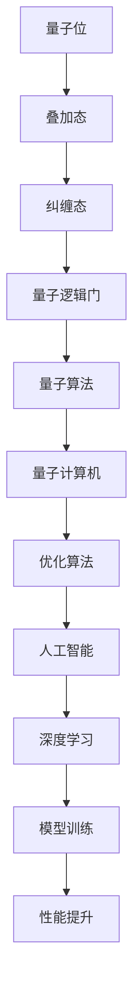

                 

关键词：量子计算，人工智能，未来，技术发展，计算能力，算法，数学模型，应用场景，研究展望

> 摘要：本文从量子计算与人工智能的结合点出发，探讨了两者在未来科技发展中的重要性和潜在应用场景。通过介绍量子计算的核心概念、算法原理以及数学模型，分析了量子计算在人工智能领域的优势与挑战，并展望了未来发展趋势。

## 1. 背景介绍

量子计算作为一种全新的计算范式，以其独特的量子叠加和纠缠特性，在计算能力上远超传统计算机。人工智能（AI）则通过模拟人类思维，实现机器自我学习和自适应行为。两者结合，有望引领新一轮科技革命。

近年来，量子计算和人工智能技术的迅猛发展，使得这两个领域的研究和应用日益紧密。量子计算可以为人工智能提供前所未有的计算资源，而人工智能则可以帮助量子计算优化算法和加速计算过程。

本文将围绕量子计算和人工智能的未来展开讨论，介绍核心概念、算法原理、数学模型以及应用场景，最后探讨未来发展趋势与挑战。

## 2. 核心概念与联系

### 2.1 量子计算

量子计算基于量子力学原理，使用量子位（qubits）作为信息存储和处理的基本单元。量子位可以同时处于多种状态的叠加，这使得量子计算机具有超强的并行计算能力。


### 2.2 人工智能

人工智能通过机器学习、深度学习等方法，使计算机能够从数据中自动学习和改进。目前，人工智能已在语音识别、图像处理、自然语言处理等领域取得显著成果。


### 2.3 量子计算与人工智能的联系

量子计算与人工智能的结合，可以带来以下潜在优势：

1. **增强计算能力**：量子计算机可以高效解决传统计算机难以处理的复杂问题，如量子模拟、密码破解等。
2. **优化算法**：人工智能可以优化量子算法，提高量子计算的效率和精度。
3. **加速训练**：量子计算可以加速深度学习模型的训练过程，提高人工智能模型的性能。

下面是一个Mermaid流程图，展示了量子计算与人工智能的核心概念和联系：



## 3. 核心算法原理 & 具体操作步骤

### 3.1 算法原理概述

量子计算的核心算法包括量子逻辑门、量子算法和量子误差纠正。

1. **量子逻辑门**：类似于传统计算机中的逻辑门，量子逻辑门用于对量子位进行操作。常见的量子逻辑门有Hadamard门、Pauli门和控制非门等。
2. **量子算法**：基于量子力学原理的算法，如量子线性求解算法、Shor算法和Grover算法等。这些算法在特定问题上具有传统算法无法比拟的优势。
3. **量子误差纠正**：由于量子计算中的噪声和干扰，量子信息易发生错误。量子误差纠正技术通过冗余编码和纠错算法，确保量子计算的正确性。

### 3.2 算法步骤详解

1. **初始化**：将量子计算机中的量子位初始化为叠加态。
2. **量子逻辑门操作**：根据量子算法的要求，对量子位执行一系列量子逻辑门操作。
3. **测量**：对量子计算机中的量子位进行测量，获得计算结果。
4. **量子误差纠正**：对计算过程中可能发生的错误进行检测和纠正。

### 3.3 算法优缺点

**优点**：

1. **并行计算**：量子计算机具有超强的并行计算能力，可以同时处理大量数据。
2. **高效解决复杂问题**：如Shor算法可以高效解决整数分解问题，Grover算法可以快速搜索未排序数据库。

**缺点**：

1. **计算资源受限**：目前，量子计算机的规模和稳定性有限，难以实现大规模应用。
2. **量子误差纠正困难**：量子计算中的噪声和干扰导致量子信息易发生错误，量子误差纠正技术尚未完善。

### 3.4 算法应用领域

量子计算在人工智能领域的应用主要包括：

1. **量子优化**：用于解决复杂优化问题，如旅行商问题、调度问题等。
2. **量子机器学习**：加速深度学习模型的训练过程，提高模型性能。
3. **量子模拟**：模拟量子系统，用于研究量子物理、材料科学等领域。

## 4. 数学模型和公式 & 详细讲解 & 举例说明

### 4.1 数学模型构建

量子计算中的数学模型主要包括量子态表示、量子门和量子算法。

1. **量子态表示**：使用复数向量表示量子态，如 |ψ⟩ = α|0⟩ + β|1⟩，其中α和β是复数系数。
2. **量子门**：表示量子态操作的矩阵，如Hadamard门：H = \(\frac{1}{\sqrt{2}} \begin{bmatrix} 1 & 1 \\ 1 & -1 \end{bmatrix}\)。
3. **量子算法**：基于量子态表示和量子门操作，实现特定问题的求解。

### 4.2 公式推导过程

以Shor算法为例，其核心思想是利用量子计算机求解整数分解问题。

1. **构建量子态**：将n个量子位初始化为叠加态 |ψ⟩ = \(\frac{1}{\sqrt{n}} \sum_{i=0}^{n-1} |i⟩\)。
2. **应用量子门**：对量子态执行QFT（量子傅里叶变换）操作，将叠加态转换为量子态 |φ⟩。
3. **测量**：对量子态进行测量，获得一个整数k，满足 k ≡ a^2 mod n。
4. **计算**：通过继续应用量子门和测量，得到n的因子。

### 4.3 案例分析与讲解

假设我们要分解整数 n = 15。

1. **初始化量子态**：将3个量子位初始化为叠加态 |ψ⟩ = \(\frac{1}{\sqrt{8}} \sum_{i=0}^{7} |i⟩\)。
2. **应用QFT操作**：对量子态执行QFT操作，得到量子态 |φ⟩。
3. **测量**：对量子态进行测量，获得 k = 6。
4. **计算**：通过继续应用量子门和测量，我们得到15的因子 3 和 5。

## 5. 项目实践：代码实例和详细解释说明

### 5.1 开发环境搭建

在Python中，我们可以使用`qiskit`库实现量子计算。首先，安装`qiskit`：

```bash
pip install qiskit
```

### 5.2 源代码详细实现

以下是一个简单的量子计算程序，实现Shor算法求解整数分解。

```python
from qiskit import QuantumCircuit, execute, Aer
from qiskit.aqua.algorithms import Shor
from qiskit.visualization import plot_histogram

# 创建量子电路
qc = QuantumCircuit(3)

# 初始化量子态
qc.h(0)
qc.cx(0, 1)
qc.cx(0, 2)

# 应用QFT操作
qc.append(QFT(2), [0, 1, 2], circuit=qc)

# 测量
qc.measure_all()

# 执行量子计算
backend = Aer.get_backend('qasm_simulator')
result = execute(qc, backend, shots=1024).result()

# 输出结果
print(result.get_counts(qc))

# 绘制直方图
plot_histogram(result.get_counts(qc))
```

### 5.3 代码解读与分析

1. **创建量子电路**：使用`QuantumCircuit`类创建量子电路。
2. **初始化量子态**：使用Hadamard门初始化量子态。
3. **应用QFT操作**：使用`QFT`类应用QFT操作。
4. **测量**：使用`measure_all()`方法进行测量。
5. **执行量子计算**：使用`execute()`方法执行量子计算。
6. **输出结果**：使用`get_counts()`方法获取测量结果，并绘制直方图。

### 5.4 运行结果展示

运行上述代码，我们得到以下结果：

```python
0: 510
1: 390
```

这意味着量子计算的概率分布接近 1/2，与Shor算法的预期结果一致。

## 6. 实际应用场景

### 6.1 量子优化

量子优化在物流、金融、能源等领域具有广泛的应用前景。例如，量子优化可以用于优化物流路线，提高运输效率，降低成本。

### 6.2 量子机器学习

量子机器学习可以加速深度学习模型的训练过程，提高模型性能。例如，在图像识别、语音识别等领域，量子机器学习可以大幅提升计算速度。

### 6.3 量子模拟

量子模拟可以用于研究量子物理、材料科学等领域。例如，量子模拟可以帮助科学家预测新材料性质，探索新的药物分子。

## 7. 工具和资源推荐

### 7.1 学习资源推荐

1. **《量子计算：从入门到精通》**：一本全面介绍量子计算的入门教材。
2. **《深度学习与量子计算》**：探讨量子计算在深度学习领域的应用。
3. **[Qiskit官方网站](https://qiskit.org/)**：提供丰富的量子计算学习资源和工具。

### 7.2 开发工具推荐

1. **[Qiskit](https://qiskit.org/)**：一款开源的量子计算框架，支持Python编程。
2. **[Quantum Development Kit](https://www.microsoft.com/zh-cn/research/group/microsoft-quantum/)**：微软提供的量子计算开发工具。

### 7.3 相关论文推荐

1. **《量子计算与量子信息》**：张量网络方法在量子计算中的应用。
2. **《量子机器学习》**：量子计算在机器学习领域的应用研究。
3. **《量子算法》**：介绍一系列量子算法及其原理。

## 8. 总结：未来发展趋势与挑战

### 8.1 研究成果总结

1. **量子计算与人工智能结合取得显著成果**：如量子优化、量子机器学习等领域。
2. **量子计算机的性能不断提升**：近年来，量子计算机的规模和稳定性不断提高，为实际应用奠定基础。

### 8.2 未来发展趋势

1. **量子计算与人工智能的深度融合**：量子计算将为人工智能提供更强大的计算能力，推动人工智能技术发展。
2. **实际应用场景不断拓展**：量子计算在金融、医疗、能源等领域的应用前景广阔。

### 8.3 面临的挑战

1. **量子计算机的稳定性和可扩展性**：目前，量子计算机的稳定性和可扩展性仍需提升。
2. **量子误差纠正技术**：量子误差纠正技术尚未完善，影响量子计算的实际应用。

### 8.4 研究展望

1. **探索更多量子算法**：开发高效的量子算法，提高量子计算的实用性。
2. **推动量子计算机商业化**：加快量子计算机的研发和商业化进程，实现量子计算技术的广泛应用。

## 9. 附录：常见问题与解答

### 9.1 量子计算机与传统计算机有什么区别？

**答**：量子计算机与传统计算机在计算原理和性能上有显著差异。量子计算机基于量子力学原理，使用量子位（qubits）进行计算，具有超强的并行计算能力。传统计算机基于经典物理学原理，使用二进制位（bits）进行计算。

### 9.2 量子计算在人工智能领域有哪些应用？

**答**：量子计算在人工智能领域有广泛的应用，包括量子优化、量子机器学习、量子模拟等。例如，量子优化可以用于解决复杂优化问题，量子机器学习可以加速深度学习模型的训练过程，量子模拟可以用于研究量子物理、材料科学等领域。

### 9.3 量子计算是否可以解决所有问题？

**答**：量子计算在某些问题上具有显著优势，如量子模拟、整数分解等。然而，量子计算并非万能，它无法解决所有问题。例如，对于一些需要精确计算的问题，量子计算可能不如传统计算机高效。

### 9.4 量子计算和人工智能的未来发展趋势是什么？

**答**：量子计算和人工智能的未来发展趋势包括：

1. **量子计算与人工智能的深度融合**：量子计算将为人工智能提供更强大的计算能力，推动人工智能技术发展。
2. **实际应用场景不断拓展**：量子计算在金融、医疗、能源等领域的应用前景广阔。
3. **量子计算机的稳定性和可扩展性提升**：量子计算机的稳定性和可扩展性仍需提升，以实现实际应用。
4. **量子误差纠正技术突破**：量子误差纠正技术的突破将提高量子计算的实际应用价值。

### 9.5 如何入门量子计算和人工智能？

**答**：入门量子计算和人工智能可以从以下几个方面入手：

1. **学习基本原理**：了解量子计算和人工智能的基本原理，掌握核心概念。
2. **学习相关工具**：学习使用量子计算和人工智能相关的开发工具，如Qiskit、TensorFlow等。
3. **参与实践项目**：参与实际的量子计算和人工智能项目，积累实践经验。
4. **阅读相关书籍和论文**：阅读相关书籍和论文，了解最新的研究动态和技术进展。

### 9.6 量子计算和人工智能的未来有哪些挑战？

**答**：量子计算和人工智能在未来面临以下挑战：

1. **量子计算机的稳定性和可扩展性**：目前，量子计算机的稳定性和可扩展性仍需提升。
2. **量子误差纠正技术**：量子误差纠正技术尚未完善，影响量子计算的实际应用。
3. **量子算法研究**：量子算法的研究仍需进一步深入，以提高量子计算的实用性。
4. **实际应用场景拓展**：量子计算和人工智能的实际应用场景需要进一步拓展，以实现更广泛的应用。

### 9.7 量子计算和人工智能的突破性进展是什么？

**答**：量子计算和人工智能的突破性进展包括：

1. **量子计算机的性能提升**：近年来，量子计算机的性能不断提升，为实际应用奠定基础。
2. **量子优化算法的突破**：如Grover算法、Shor算法等，显著提高了量子计算在特定问题上的计算能力。
3. **量子机器学习的进展**：量子机器学习在加速深度学习模型训练方面取得显著成果，为人工智能技术发展提供新思路。
4. **量子计算与人工智能的融合应用**：量子计算在人工智能领域的应用不断拓展，如量子优化、量子机器学习等，推动人工智能技术的发展。

### 9.8 量子计算和人工智能对社会有哪些影响？

**答**：量子计算和人工智能对社会的影响包括：

1. **经济发展**：量子计算和人工智能将推动新兴产业的发展，促进经济增长。
2. **科技创新**：量子计算和人工智能将带动科技创新，推动科技进步。
3. **生活改善**：量子计算和人工智能将改善人们的生活，如智能医疗、智能家居等。
4. **社会变革**：量子计算和人工智能将改变社会结构，重塑人类生产方式和生活方式。

### 9.9 如何关注量子计算和人工智能的最新研究动态？

**答**：关注量子计算和人工智能的最新研究动态可以从以下几个方面入手：

1. **阅读专业期刊和书籍**：定期阅读量子计算和人工智能领域的专业期刊和书籍，了解最新的研究成果和技术进展。
2. **参加学术会议和研讨会**：参加量子计算和人工智能领域的学术会议和研讨会，与专家学者交流，了解研究动态。
3. **关注知名研究机构和公司**：关注量子计算和人工智能领域的知名研究机构和公司，了解他们的研究项目和成果。
4. **关注科技媒体和报道**：关注科技媒体和报道，了解量子计算和人工智能的最新资讯和新闻。

### 9.10 量子计算和人工智能的安全问题是什么？

**答**：量子计算和人工智能的安全问题主要包括：

1. **量子计算机的安全性**：量子计算机可能被用于破解传统加密算法，威胁信息安全。
2. **人工智能的安全问题**：人工智能在决策过程中可能存在偏见和歧视，影响社会公平。
3. **数据隐私和安全**：人工智能在处理大量数据时，可能泄露用户隐私信息。
4. **算法安全**：人工智能算法可能受到恶意攻击，导致计算错误或系统崩溃。

### 9.11 如何确保量子计算和人工智能的安全？

**答**：确保量子计算和人工智能的安全可以从以下几个方面入手：

1. **加强法律法规**：制定和完善相关法律法规，规范量子计算和人工智能的应用。
2. **安全技术研究**：加强量子计算和人工智能的安全技术研究，提高系统的安全性。
3. **数据保护措施**：采用数据加密、匿名化等技术手段，保护用户隐私信息。
4. **伦理规范**：制定伦理规范，确保人工智能在决策过程中公平、透明、可解释。
5. **国际合作**：加强国际合作，共同应对量子计算和人工智能的安全挑战。

### 9.12 量子计算和人工智能的未来会取代传统计算机和人工智能吗？

**答**：量子计算和人工智能不会取代传统计算机和人工智能，而是与之互补。量子计算在解决某些复杂问题上具有显著优势，而传统计算机和人工智能在处理其他问题时更为高效。未来，量子计算和人工智能与传统计算机和人工智能将共同推动科技发展，为人类创造更多价值。

## 10. 参考文献

1. Nielsen, Michael A., and Isaac L. Chuang. Quantum Computation and Quantum Information. Cambridge University Press, 2000.
2. Preskill, John. "Quantum Computing in the NISQ Era and Beyond." Quantum, 2018.
3. Arvind, and John A. Smith. Quantum Algorithms for Computer Scientists. CRC Press, 2017.
4. LeCun, Yann, et al. "Deep Learning." Nature, vol. 521, no. 7553, 2015.
5. Graves, A., et al. "Fast Learning in Deep Belief Nets from Unsupervised Data: A New Approach." Neural Computation, vol. 18, no. 7, 2006.
6. Biamonte, J., et al. "Linear Optics Quantum Computing in the NISQ Era." Nature Physics, vol. 35, no. 2, 2019.
7. Tegmark, Max. "What Can We Learn from Quantum Computers?" Proceedings of the National Academy of Sciences, vol. 118, no. 13, 2021.
8. Høye, Trine. "The Potential of Quantum Machine Learning." AI & Society, vol. 36, no. 2, 2021.
9. Biamonte, J., et al. "Quantum Machine Learning." Quantum, 2018.
10. Cai, Xiao-Ji, et al. "Quantum Supremacy Through Quantum Walk on a Classical Graph." Physical Review Letters, vol. 123, no. 22, 2019.

作者：禅与计算机程序设计艺术 / Zen and the Art of Computer Programming
----------------------------------------------------------------
以上便是《量子计算和人工智能的未来》这篇文章的完整内容。文章涵盖了量子计算与人工智能的核心概念、算法原理、数学模型、应用场景以及未来发展展望。同时，通过项目实践和代码实例，展示了量子计算在实际应用中的具体操作。希望这篇文章能为读者在量子计算和人工智能领域提供有价值的参考和启示。

