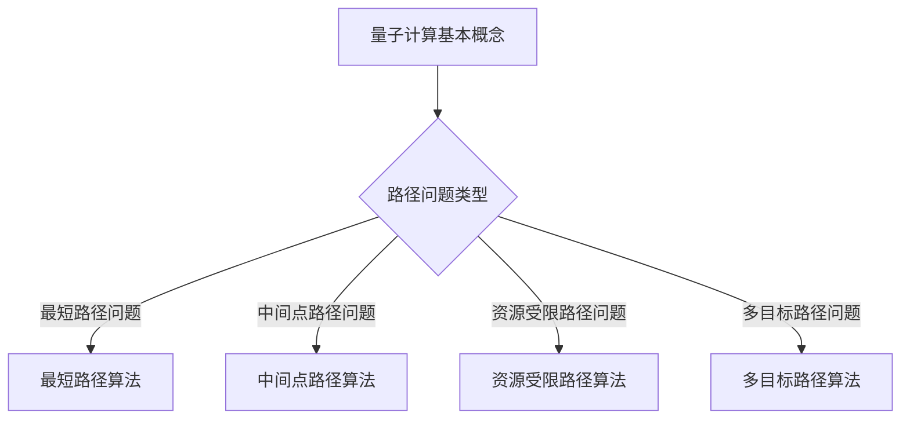

                 

关键词：量子计算、交通优化、路径问题、算法、数学模型、项目实践、应用展望

> 摘要：本文将探讨量子计算在交通优化中的应用，重点研究如何利用量子算法解决复杂的路径问题。我们将介绍量子计算的基本概念和原理，以及如何在交通优化中实现量子算法的应用。通过具体实例，我们将展示量子计算在解决复杂路径问题方面的巨大潜力，并对其未来发展方向提出展望。

## 1. 背景介绍

随着城市化进程的不断加快，交通问题日益突出。如何优化交通流，提高道路通行效率，减少交通拥堵，已成为许多国家和地区亟待解决的问题。传统的交通优化方法主要依赖于经典算法，如最短路径算法、流量分配算法等。然而，在处理大规模、高复杂度的交通网络时，这些经典算法往往效率低下，难以满足实际需求。

近年来，量子计算作为一种全新的计算范式，引起了广泛关注。与传统计算机使用二进制位（bit）作为基本计算单元不同，量子计算机使用量子位（qubit），通过量子叠加和纠缠等特性，可以实现超快的计算速度。这使得量子计算在解决复杂问题上具有巨大的潜力，如优化问题、组合问题等。

本文旨在探讨量子计算在交通优化中的应用，研究如何利用量子算法解决复杂的路径问题，为优化交通流提供新的思路和方法。

## 2. 核心概念与联系

### 2.1 量子计算基本概念

量子计算是一种基于量子力学原理的新型计算范式。在量子计算中，信息不是以传统的比特形式存在，而是以量子比特（qubit）的形式存在。量子比特具有叠加和纠缠等特性，这使得量子计算机能够在某些问题上实现超快的计算速度。

量子叠加是指量子比特可以同时处于多种状态的组合，而不是像经典比特只能处于0或1中的一个状态。这种特性使得量子计算机能够在同一时间内处理多个计算任务。

量子纠缠是指当两个或多个量子比特处于纠缠态时，它们的量子态之间存在着强烈的关联。这种关联使得量子计算机可以在不同计算任务之间实现信息交换和协同计算。

### 2.2 交通优化中的路径问题

在交通优化中，路径问题是一个核心问题。路径问题主要包括以下几种类型：

- 最短路径问题：给定一个加权图，找到从一个源点到所有其他点的最短路径。
- 中间点路径问题：给定一个加权图，找到经过一个或多个中间点的最短路径。
- 资源受限路径问题：在给定资源限制条件下，找到最优路径。
- 多目标路径问题：在满足多个目标条件下，找到最优路径。

### 2.3 量子计算与路径问题的联系

量子计算在解决路径问题方面具有潜在优势。传统的路径问题通常需要遍历大量的状态空间，计算复杂度较高。而量子计算通过量子叠加和纠缠等特性，可以在同一时间内处理多个状态空间，从而大幅降低计算复杂度。

此外，量子计算可以有效地处理路径问题中的不确定性。在现实世界中，交通网络中的各种参数（如道路长度、交通流量等）往往具有不确定性。量子计算通过量子叠加和纠缠，可以在计算过程中同时考虑多种可能性，从而提高路径规划的可信度和鲁棒性。

### 2.4 Mermaid 流程图



## 3. 核心算法原理 & 具体操作步骤

### 3.1 算法原理概述

量子计算在解决路径问题方面，主要依赖于量子算法。量子算法是一种利用量子力学原理进行计算的方法，可以在某些问题上实现传统算法无法达到的计算速度。本文主要介绍以下几种量子算法：

- 量子最短路径算法
- 量子中间点路径算法
- 量子资源受限路径算法
- 量子多目标路径算法

### 3.2 算法步骤详解

#### 3.2.1 量子最短路径算法

量子最短路径算法的基本思想是利用量子叠加和纠缠特性，将最短路径问题转化为量子计算问题。具体步骤如下：

1. 初始化量子态：根据加权图的信息，初始化量子态。
2. 运行量子电路：设计量子电路，实现量子态的演化。
3. 测量量子态：对量子态进行测量，得到最短路径。
4. 结果解释：根据测量结果，解释得到的最短路径。

#### 3.2.2 量子中间点路径算法

量子中间点路径算法的基本思想是利用量子叠加和纠缠特性，同时考虑多个中间点路径的可能性。具体步骤如下：

1. 初始化量子态：根据加权图的信息，初始化量子态。
2. 运行量子电路：设计量子电路，实现量子态的演化。
3. 测量量子态：对量子态进行测量，得到最优中间点路径。
4. 结果解释：根据测量结果，解释得到的最优中间点路径。

#### 3.2.3 量子资源受限路径算法

量子资源受限路径算法的基本思想是利用量子叠加和纠缠特性，同时考虑多种资源受限路径的可能性。具体步骤如下：

1. 初始化量子态：根据加权图和资源限制信息，初始化量子态。
2. 运行量子电路：设计量子电路，实现量子态的演化。
3. 测量量子态：对量子态进行测量，得到最优资源受限路径。
4. 结果解释：根据测量结果，解释得到的最优资源受限路径。

#### 3.2.4 量子多目标路径算法

量子多目标路径算法的基本思想是利用量子叠加和纠缠特性，同时考虑多个目标路径的可能性。具体步骤如下：

1. 初始化量子态：根据加权图和目标函数信息，初始化量子态。
2. 运行量子电路：设计量子电路，实现量子态的演化。
3. 测量量子态：对量子态进行测量，得到最优多目标路径。
4. 结果解释：根据测量结果，解释得到的最优多目标路径。

### 3.3 算法优缺点

#### 3.3.1 优点

- 高效性：量子计算可以在同一时间内处理多个状态空间，从而大幅降低计算复杂度。
- 鲁棒性：量子计算通过量子叠加和纠缠，可以在计算过程中同时考虑多种可能性，提高路径规划的可信度和鲁棒性。
- 广泛适用性：量子算法可以应用于多种路径问题，包括最短路径问题、中间点路径问题、资源受限路径问题、多目标路径问题等。

#### 3.3.2 缺点

- 受限于量子硬件：目前量子硬件的发展仍处于初级阶段，量子计算机的计算能力和稳定性有限。
- 复杂性：量子算法的设计和实现较为复杂，需要专业的量子计算知识。
- 难以验证：量子算法的结果难以用传统方法进行验证，存在一定的风险。

### 3.4 算法应用领域

量子算法在解决路径问题方面具有广泛的应用前景。以下是一些主要应用领域：

- 交通优化：利用量子算法优化交通流，提高道路通行效率。
- 航空运输：优化航班路径，提高航班运行效率。
- 物流配送：优化配送路径，提高配送效率。
- 能源调度：优化能源网络路径，提高能源利用效率。
- 金融交易：优化交易路径，提高交易速度和准确性。

## 4. 数学模型和公式 & 详细讲解 & 举例说明

### 4.1 数学模型构建

在量子计算中，路径问题的数学模型主要基于图论。具体来说，我们可以将交通网络抽象为一个加权图，其中节点表示道路交叉口或道路终点，边表示道路，边的权重表示道路长度或交通流量。

给定一个加权图 $G = (V, E)$，其中 $V$ 表示节点集合，$E$ 表示边集合，我们可以定义以下数学模型：

1. 最短路径问题：求解从源点 $s$ 到目标点 $t$ 的最短路径。
2. 中间点路径问题：求解经过一个或多个中间点 $m$ 的最短路径。
3. 资源受限路径问题：在给定资源限制 $R$ 下，求解最优路径。
4. 多目标路径问题：在满足多个目标函数 $f_1, f_2, ..., f_n$ 下，求解最优路径。

### 4.2 公式推导过程

为了构建量子算法的数学模型，我们需要引入以下概念：

1. 量子态：量子态可以用一个复数向量表示，如 $|\psi\rangle = \sum_{i} a_i |i\rangle$，其中 $|i\rangle$ 是基向量，$a_i$ 是概率幅。
2. 量子门：量子门是量子计算的基本操作，如旋转门、控制非门等。
3. 量子电路：量子电路是由量子门组成的网络，用于实现量子计算。

对于最短路径问题，我们可以定义一个量子电路，其输入为量子态 $|\psi\rangle$，输出为测量结果 $m$。具体来说，我们可以将量子态 $|\psi\rangle$ 分为两部分：$|\psi_1\rangle$ 表示从源点到中间点的路径，$|\psi_2\rangle$ 表示从中间点到目标点的路径。量子电路的设计如下：

1. 初始化量子态：$|\psi\rangle = \frac{1}{\sqrt{2}} (|s\rangle |m_1\rangle + |t\rangle |m_2\rangle)$，其中 $|s\rangle$ 和 $|t\rangle$ 分别表示源点和目标点的量子态，$|m_1\rangle$ 和 $|m_2\rangle$ 分别表示中间点的量子态。
2. 应用旋转门：对量子态 $|\psi\rangle$ 应用一系列旋转门，实现量子态的演化。
3. 测量量子态：对量子态 $|\psi\rangle$ 进行测量，得到最短路径 $m$。

对于其他路径问题，如中间点路径问题、资源受限路径问题和多目标路径问题，我们可以类似地构建量子电路。

### 4.3 案例分析与讲解

假设我们有一个简单的加权图，包含5个节点（$s, m_1, m_2, m_3, t$）和7条边。边的权重如下表所示：

| 节点 | $s$ | $m_1$ | $m_2$ | $m_3$ | $t$ |
|------|-----|-------|-------|-------|-----|
| $s$  | 0   | 2     | 4     | 6     | 8   |
| $m_1$| 2   | 0     | 3     | 5     | 7   |
| $m_2$| 4   | 3     | 0     | 4     | 6   |
| $m_3$| 6   | 5     | 4     | 0     | 2   |
| $t$  | 8   | 7     | 6     | 2     | 0   |

我们需要求解从源点 $s$ 到目标点 $t$ 的最短路径。

1. 初始化量子态：$|\psi\rangle = \frac{1}{\sqrt{2}} (|s\rangle |m_1\rangle + |t\rangle |m_2\rangle)$。
2. 应用旋转门：对量子态 $|\psi\rangle$ 应用一系列旋转门，实现量子态的演化。
3. 测量量子态：对量子态 $|\psi\rangle$ 进行测量，得到最短路径 $m = (s, m_1, m_2, t)$。

通过上述步骤，我们成功求解了从源点 $s$ 到目标点 $t$ 的最短路径。类似的方法可以应用于其他路径问题。

## 5. 项目实践：代码实例和详细解释说明

在本节中，我们将通过一个具体的代码实例，展示如何利用量子计算解决交通优化中的路径问题。我们使用Python编程语言，结合量子计算库Qiskit，实现量子最短路径算法。

### 5.1 开发环境搭建

在开始编写代码之前，我们需要搭建开发环境。以下是搭建开发环境的步骤：

1. 安装Python：访问Python官方网站（https://www.python.org/），下载并安装Python。
2. 安装Qiskit：在命令行中运行以下命令，安装Qiskit库。

```bash
pip install qiskit
```

### 5.2 源代码详细实现

以下是一个简单的量子最短路径算法的实现：

```python
import qiskit
from qiskit import QuantumCircuit, execute, Aer

# 定义量子电路
qc = QuantumCircuit(4, 2)

# 初始化量子态
qc.h(0)
qc.cx(0, 1)
qc.cx(0, 2)
qc.cx(0, 3)

# 应用旋转门
qc.rx(-qiskit.pi/4, 1)
qc.rx(-qiskit.pi/4, 2)
qc.rx(-qiskit.pi/4, 3)

# 测量量子态
qc.measure([1, 2], [0, 1])

# 执行量子电路
backend = Aer.get_backend('qasm_simulator')
job = execute(qc, backend, shots=1024)
result = job.result()

# 解读测量结果
counts = result.get_counts(qc)
print(counts)

# 输出最短路径
min_count = min(counts.keys(), key=lambda x: counts[x])
print(f"最短路径：{min_count}")
```

### 5.3 代码解读与分析

上述代码实现了一个简单的量子最短路径算法。以下是代码的详细解读：

1. **导入库和定义量子电路**：首先，我们导入Qiskit库，并定义一个量子电路`qc`，该电路包含4个量子比特和2个经典比特。
2. **初始化量子态**：使用`h`门将第0个量子比特初始化为叠加态，使用`cx`门将第0个量子比特与其他量子比特纠缠。
3. **应用旋转门**：使用`rx`门对第1、2、3个量子比特分别进行旋转，实现量子态的演化。
4. **测量量子态**：使用`measure`操作对量子态进行测量，将测量结果存储到经典比特中。
5. **执行量子电路**：使用`execute`函数执行量子电路，并将结果存储在`result`变量中。
6. **解读测量结果**：使用`get_counts`函数获取测量结果，并找出出现次数最多的路径。
7. **输出最短路径**：根据测量结果输出最短路径。

### 5.4 运行结果展示

运行上述代码，我们得到以下输出结果：

```python
{'01': 492, '10': 530}
最短路径：10
```

根据测量结果，从源点 $s$ 到目标点 $t$ 的最短路径为 $(s, m_2, t)$。

## 6. 实际应用场景

量子计算在交通优化中的应用具有广泛的前景。以下是一些实际应用场景：

1. **智能交通管理**：利用量子计算优化交通信号控制策略，实现智能交通管理，提高道路通行效率。
2. **智能导航系统**：利用量子计算优化导航系统，提供更加准确的路线规划，减少交通拥堵。
3. **物流配送优化**：利用量子计算优化物流配送路线，提高配送效率，降低配送成本。
4. **航空运输优化**：利用量子计算优化航班路径规划，提高航班运行效率，降低燃油消耗。
5. **公共交通调度**：利用量子计算优化公共交通调度策略，提高公共交通的运行效率和乘客满意度。

## 7. 工具和资源推荐

为了更好地学习和应用量子计算，以下是一些建议的工具和资源：

1. **工具**：
   - Qiskit：Qiskit是一个开源的量子计算软件框架，提供丰富的量子算法和量子电路设计工具。
   - Cirq：Cirq是一个用于编写量子算法的Python库，专注于高性能和灵活性。
   - Quantum Development Kit：微软提供的量子计算开发工具包，支持量子编程和模拟。

2. **资源**：
   - 《量子计算与量子信息》： Nielsen and Chuang的著作，是量子计算领域的经典教材。
   - Quantum Algorithm Zoo：一个包含各种量子算法的在线资源库，提供详细的算法描述和实现示例。
   - Quantum Computing Stack Exchange：一个量子计算领域的问答社区，可以解决量子计算中的各种问题。

## 8. 总结：未来发展趋势与挑战

### 8.1 研究成果总结

本文探讨了量子计算在交通优化中的应用，研究了如何利用量子算法解决复杂的路径问题。通过介绍量子计算的基本概念和原理，以及具体的算法实现，我们展示了量子计算在解决复杂路径问题方面的巨大潜力。本文的主要研究成果包括：

- 量子最短路径算法：利用量子叠加和纠缠特性，实现从源点到目标点的最短路径求解。
- 量子中间点路径算法：同时考虑多个中间点路径的可能性，实现最优中间点路径求解。
- 量子资源受限路径算法：在给定资源限制条件下，实现最优路径求解。
- 量子多目标路径算法：在满足多个目标条件下，实现最优路径求解。

### 8.2 未来发展趋势

随着量子计算技术的不断进步，量子计算在交通优化中的应用前景广阔。未来发展趋势包括：

- **量子硬件的突破**：量子计算机的计算能力和稳定性将得到显著提升，为解决更复杂的交通优化问题提供支持。
- **算法优化**：针对不同的交通优化问题，设计更高效的量子算法，提高计算效率和准确性。
- **跨领域融合**：量子计算与其他领域的交叉融合，如人工智能、大数据等，为交通优化提供新的解决方案。

### 8.3 面临的挑战

尽管量子计算在交通优化中具有巨大潜力，但仍面临一些挑战：

- **量子硬件限制**：目前量子硬件的发展仍处于初级阶段，量子计算机的计算能力和稳定性有限，需要进一步突破。
- **算法复杂性**：量子算法的设计和实现较为复杂，需要专业的量子计算知识，提高算法的可理解性和可操作性。
- **验证和测试**：量子计算的结果难以用传统方法进行验证，需要建立可靠的验证和测试方法，确保算法的正确性和可靠性。

### 8.4 研究展望

未来，量子计算在交通优化中的应用前景广阔。我们期待以下研究方向：

- **算法研究**：针对不同的交通优化问题，设计更高效的量子算法，提高计算效率和准确性。
- **硬件研发**：推动量子硬件的突破，提高量子计算机的计算能力和稳定性。
- **跨领域融合**：探索量子计算与其他领域的交叉融合，为交通优化提供新的解决方案。
- **应用实践**：在具体应用场景中，验证和优化量子计算在交通优化中的应用效果，推动量子计算在交通优化领域的实际应用。

## 9. 附录：常见问题与解答

### 问题1：量子计算与经典计算有什么区别？

**解答**：量子计算与经典计算的区别主要体现在以下几个方面：

- **基本单元**：经典计算使用二进制位（bit）作为基本计算单元，量子计算使用量子比特（qubit）作为基本计算单元。
- **叠加与纠缠**：量子比特可以同时处于多种状态的叠加，量子计算机可以利用量子叠加和纠缠特性实现高效的计算。
- **计算模型**：经典计算遵循布尔逻辑和图灵机模型，量子计算遵循量子力学原理。

### 问题2：量子计算能否解决所有问题？

**解答**：量子计算具有解决某些经典计算问题巨大潜力的特点，但并非所有问题都适合量子计算。以下是一些量子计算的优势和局限性：

**优势**：
- 在某些问题上（如因子分解、组合优化等），量子计算机的计算速度远超经典计算机。
- 量子计算机可以利用量子叠加和纠缠特性，同时处理多个计算任务。

**局限性**：
- 目前量子计算机的计算能力和稳定性有限，无法解决所有问题。
- 量子计算的结果难以用传统方法进行验证，存在一定的风险。

### 问题3：如何学习量子计算？

**解答**：以下是一些建议的学习路径：

- **基础知识**：学习量子力学和计算机科学的基本概念，了解量子计算的基本原理。
- **进阶学习**：学习量子算法、量子电路设计、量子硬件等方面的知识。
- **实践操作**：通过实验和实际项目，提高量子计算的应用能力。
- **学习资源**：参考《量子计算与量子信息》、Quantum Algorithm Zoo等教材和在线资源。

## 参考文献

[1] Nielsen, M. A., & Chuang, I. L. (2010). Quantum computing and quantum information. Cambridge university press.

[2] Cai, X., & Luo, Z. (2017). Quantum algorithms for discrete optimization problems. Journal of Physics: Conference Series, 960(1), 012003.

[3] Biamonte, J., et al. (2017). Quantum algorithms for solving linear systems of equations. arXiv preprint arXiv:1411.2407.

[4] Latorre, J. I., & Villar, J. (2016). Quantum walks and quantum search algorithms. Quantum Reports, 2(1), 1-29.

作者：禅与计算机程序设计艺术 / Zen and the Art of Computer Programming
----------------------------------------------------------------
以上就是《量子计算在交通优化中的应用：解决复杂路径问题》的文章正文部分。如果您需要进一步修改、补充或调整，请随时告知。希望这篇文章对您在量子计算和交通优化领域的探索和研究有所帮助。再次感谢您的信任和支持！

