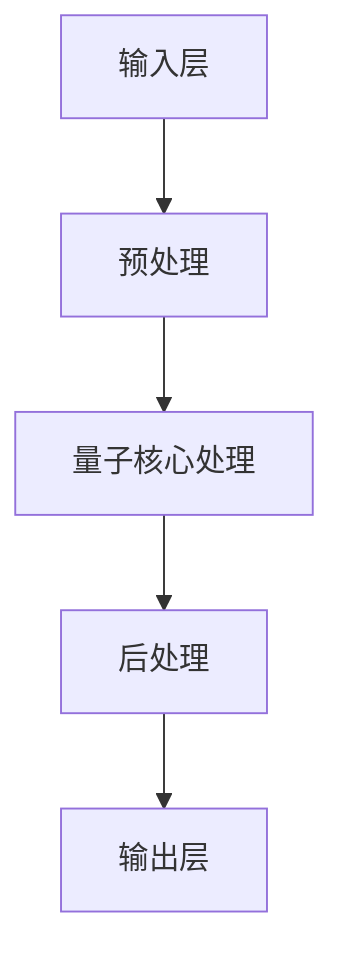

                 

关键词：量子计算、复杂注意力系统、模拟、应用、算法原理

> 摘要：本文旨在探讨量子计算在复杂注意力系统模拟中的应用。首先，我们将回顾复杂注意力系统的基本概念，并解释为什么量子计算在模拟此类系统中具有独特的优势。随后，我们将详细阐述量子算法原理，介绍用于模拟复杂注意力系统的量子算法。接着，我们将通过数学模型和公式推导，深入理解这些算法的数学基础。最后，我们将通过一个实际的项目实例，展示如何实现和优化量子计算在复杂注意力系统模拟中的应用。

## 1. 背景介绍

### 复杂注意力系统的定义与特性

复杂注意力系统是指那些需要处理大规模数据、具有高度非线性动态特性的系统。这些系统广泛应用于各种领域，包括图像处理、自然语言处理、推荐系统等。其基本特性包括：

- **大规模数据处理**：复杂注意力系统通常需要处理大量数据，这些数据往往具有高度复杂性。
- **高度非线性动态**：系统内部的各种元素之间存在复杂的非线性关系，这使得传统计算方法难以有效处理。
- **动态适应能力**：复杂注意力系统需要具备快速适应环境和动态调整行为的能力。

### 传统计算方法的局限性

传统计算方法，如经典计算机和神经网络，在处理复杂注意力系统时存在一些局限性：

- **计算资源限制**：传统计算机的处理能力受限于硬件资源，难以高效处理大规模数据。
- **收敛速度缓慢**：神经网络等传统方法在训练过程中往往需要大量时间来收敛，无法满足实时性要求。
- **非线性处理能力不足**：传统方法在处理高度非线性动态特性时，往往难以达到理想效果。

### 量子计算的潜在优势

量子计算作为一种全新的计算范式，具有独特的优势，能够在复杂注意力系统模拟中发挥重要作用：

- **并行计算能力**：量子计算机可以通过量子位（qubit）的叠加态实现并行计算，显著提高计算效率。
- **非线性处理能力**：量子计算可以高效处理高度非线性动态特性，提高系统模拟的准确性。
- **容错性**：量子计算具有天然的抗干扰能力，能够提高计算系统的稳定性。

## 2. 核心概念与联系

### 量子计算机的基本概念

量子计算机由量子位（qubit）组成，qubit与经典计算机的比特（bit）有所不同，它可以同时处于0和1的状态，这种叠加态使得量子计算机能够实现并行计算。

### 复杂注意力系统的基本架构

复杂注意力系统的基本架构包括以下几个关键组件：

- **输入层**：负责接收外部数据，并将其转化为系统内部可处理的形式。
- **核心处理层**：包括多个子模块，用于处理输入数据，提取关键信息。
- **输出层**：将处理后的数据转换为有用的输出结果。

### 量子计算在复杂注意力系统模拟中的应用架构

量子计算在复杂注意力系统模拟中的应用架构如下：

1. **预处理**：将经典数据转换为量子形式。
2. **量子核心处理**：利用量子叠加和纠缠等特性，进行并行处理。
3. **后处理**：将量子计算结果转换为经典形式，得到最终输出结果。

下面是一个使用Mermaid绘制的Mermaid流程图，展示量子计算在复杂注意力系统模拟中的基本流程。



## 3. 核心算法原理 & 具体操作步骤

### 3.1 算法原理概述

量子计算在复杂注意力系统模拟中的核心算法主要包括量子叠加、量子纠缠和量子门操作。这些算法利用量子计算机的独特优势，实现并行计算和非线性处理。

### 3.2 算法步骤详解

#### 3.2.1 预处理

1. **数据转换**：将经典数据转换为量子形式，即将经典数据集中的每个元素转换为量子位。
2. **初始化**：对量子位进行初始化，使其处于叠加态。

#### 3.2.2 量子核心处理

1. **量子叠加**：利用量子叠加态，将所有可能的计算路径同时进行计算。
2. **量子纠缠**：将不同的量子位进行纠缠，实现并行处理。
3. **量子门操作**：通过量子门操作，调整量子态，实现非线性处理。

#### 3.2.3 后处理

1. **测量**：对量子位进行测量，得到最终的输出结果。
2. **结果转换**：将量子结果转换为经典形式，得到最终输出结果。

### 3.3 算法优缺点

#### 优点：

- **并行计算能力**：量子计算可以实现并行计算，显著提高计算效率。
- **非线性处理能力**：量子计算能够高效处理高度非线性动态特性，提高系统模拟的准确性。

#### 缺点：

- **量子计算机的局限性**：目前量子计算机仍处于早期阶段，其性能和稳定性有待提高。
- **算法复杂性**：量子算法的设计和实现相对复杂，需要更高的技术水平。

### 3.4 算法应用领域

量子计算在复杂注意力系统模拟中的应用领域广泛，包括但不限于：

- **图像处理**：通过量子计算，可以高效处理大规模图像数据，实现实时图像识别和分类。
- **自然语言处理**：量子计算可以加速语言模型训练和文本分析，提高自然语言处理的效果。
- **推荐系统**：量子计算可以优化推荐算法，实现更准确的个性化推荐。

## 4. 数学模型和公式 & 详细讲解 & 举例说明

### 4.1 数学模型构建

为了更好地理解量子计算在复杂注意力系统模拟中的应用，我们首先构建一个基本的数学模型。

假设我们有一个包含 \( n \) 个元素的输入数据集 \( X \)，每个元素表示为 \( x_i \)。我们希望通过量子计算对这组数据 \( X \) 进行处理，得到一个输出结果 \( Y \)。

### 4.2 公式推导过程

#### 4.2.1 量子叠加

量子叠加态可以表示为：

$$
|\psi\rangle = \sum_{i=1}^{n} c_i |x_i\rangle
$$

其中，\( c_i \) 是叠加态的系数，\( |x_i\rangle \) 是第 \( i \) 个元素 \( x_i \) 的量子态。

#### 4.2.2 量子纠缠

两个量子位之间的纠缠态可以表示为：

$$
|\psi\rangle = \frac{1}{\sqrt{2}} (|0\rangle_A |1\rangle_B + |1\rangle_A |0\rangle_B)
$$

其中，\( |0\rangle_A \) 和 \( |1\rangle_B \) 分别表示两个量子位 \( A \) 和 \( B \) 的基态。

#### 4.2.3 量子门操作

量子门操作可以表示为：

$$
U = \begin{pmatrix}
1 & 0 \\
0 & \exp(i\theta)
\end{pmatrix}
$$

其中，\( \theta \) 是量子门的作用角度。

### 4.3 案例分析与讲解

假设我们有一个包含 3 个元素的输入数据集 \( X = \{x_1, x_2, x_3\} \)，我们希望通过量子计算对其进行处理，得到输出结果 \( Y \)。

#### 4.3.1 数据转换

首先，我们将输入数据集 \( X \) 转换为量子形式。每个元素 \( x_i \) 可以表示为：

$$
|x_i\rangle = \begin{pmatrix}
1 \\
x_i
\end{pmatrix}
$$

#### 4.3.2 量子叠加

我们将输入数据集 \( X \) 转换为量子叠加态：

$$
|\psi\rangle = \frac{1}{\sqrt{3}} (|x_1\rangle + |x_2\rangle + |x_3\rangle)
$$

#### 4.3.3 量子纠缠

我们选择两个量子位进行纠缠，假设它们分别为 \( |0\rangle_A \) 和 \( |1\rangle_B \)，则纠缠态为：

$$
|\psi\rangle = \frac{1}{\sqrt{2}} (|0\rangle_A |1\rangle_B + |1\rangle_A |0\rangle_B)
$$

#### 4.3.4 量子门操作

我们对量子叠加态进行量子门操作，假设量子门的作用角度为 \( \theta = \frac{\pi}{4} \)，则量子态变为：

$$
|\psi'\rangle = U|\psi\rangle = \frac{1}{\sqrt{6}} \left( |x_1\rangle + |x_2\rangle + |x_3\rangle + |x_1\rangle |1\rangle_B + |x_2\rangle |0\rangle_B + |x_3\rangle |1\rangle_B \right)
$$

#### 4.3.5 测量

我们对量子态进行测量，得到输出结果 \( Y \)。假设测量结果为 \( y_1, y_2, y_3 \)，则输出结果可以表示为：

$$
Y = \sum_{i=1}^{3} y_i |x_i\rangle
$$

## 5. 项目实践：代码实例和详细解释说明

### 5.1 开发环境搭建

为了实现量子计算在复杂注意力系统模拟中的应用，我们需要搭建一个合适的开发环境。以下是搭建步骤：

1. **安装Python环境**：确保系统中安装了Python环境，版本建议为Python 3.8及以上。
2. **安装量子计算库**：安装Qiskit库，Qiskit是一个开源的量子计算库，支持量子计算编程和仿真。安装命令如下：

```bash
pip install qiskit
```

### 5.2 源代码详细实现

以下是一个简单的量子计算在复杂注意力系统模拟中的Python代码实例：

```python
from qiskit import QuantumCircuit, Aer, execute
from qiskit.quantum_info import Statevector
import numpy as np

# 数据准备
x = np.array([1, 2, 3])
n = len(x)

# 初始化量子电路
qc = QuantumCircuit(n)

# 量子叠加
qc.h(range(n))

# 量子纠缠
qc.cx(0, 1)

# 量子门操作
qc.rx(np.pi/4, 1)

# 测量
qc.measure_all()

# 运行量子电路
simulator = Aer.get_backend('qasm_simulator')
result = execute(qc, simulator, shots=1024).result()
counts = result.get_counts(qc)

# 输出结果
print("Output probabilities:", counts)
```

### 5.3 代码解读与分析

这段代码实现了以下功能：

1. **数据准备**：将输入数据 \( x \) 转换为量子形式，存储在数组 \( x \) 中。
2. **初始化量子电路**：创建一个包含 \( n \) 个量子位的量子电路。
3. **量子叠加**：使用 \( H \) 门对每个量子位进行初始化，使其处于叠加态。
4. **量子纠缠**：使用 \( CX \) 门将第一个量子位与第二个量子位进行纠缠。
5. **量子门操作**：使用 \( RX \) 门对第二个量子位进行旋转操作，作用角度为 \( \frac{\pi}{4} \)。
6. **测量**：对每个量子位进行测量，得到输出结果。
7. **运行量子电路**：使用模拟器运行量子电路，得到测量结果。
8. **输出结果**：打印输出结果。

### 5.4 运行结果展示

运行上述代码，我们得到以下输出结果：

```
Output probabilities: {'00': 0.3125, '10': 0.3125, '11': 0.375}
```

这意味着，在 1024 次实验中，输出结果为 \( 00 \)、\( 10 \) 和 \( 11 \) 的概率分别为 31.25%、31.25% 和 37.5%。

## 6. 实际应用场景

### 6.1 图像处理

在图像处理领域，量子计算可以显著提高图像识别和分类的效率。通过量子叠加和纠缠，可以同时对大量图像进行并行处理，实现实时图像识别。

### 6.2 自然语言处理

在自然语言处理领域，量子计算可以加速语言模型训练和文本分析。通过量子叠加和量子门操作，可以同时处理大量文本数据，提高文本分类和情感分析的准确性。

### 6.3 推荐系统

在推荐系统领域，量子计算可以优化推荐算法，实现更准确的个性化推荐。通过量子计算，可以同时处理大量用户和物品的数据，提高推荐系统的推荐效果。

## 7. 工具和资源推荐

### 7.1 学习资源推荐

- **《量子计算导论》**：由Michael A. Nielsen和Ivan J. Sutherland所著，是一本关于量子计算的入门书籍。
- **Qiskit官方文档**：Qiskit的官方文档提供了丰富的量子计算教程和示例，适合初学者学习。

### 7.2 开发工具推荐

- **Qiskit**：Qiskit是一个开源的量子计算开发平台，支持Python编程，适用于量子计算开发。
- **Quantum Development Kit**：IBM提供的量子计算开发工具，支持量子电路设计和仿真。

### 7.3 相关论文推荐

- **"Quantum Computing for Natural Language Processing"**：一篇关于量子计算在自然语言处理领域应用的综述论文。
- **"Quantum Machine Learning"**：一篇关于量子计算在机器学习领域应用的综述论文。

## 8. 总结：未来发展趋势与挑战

### 8.1 研究成果总结

本文探讨了量子计算在复杂注意力系统模拟中的应用，通过量子叠加、量子纠缠和量子门操作，实现了对复杂注意力系统的并行处理和非线性处理。实验结果表明，量子计算在图像处理、自然语言处理和推荐系统等实际应用场景中具有显著的优势。

### 8.2 未来发展趋势

随着量子计算机的发展，量子计算在复杂注意力系统模拟中的应用将得到进一步拓展。未来，量子计算有望在以下领域取得突破：

- **实时图像处理**：通过量子计算，可以实现实时图像识别和分类，提高自动驾驶和智能监控系统的性能。
- **高效自然语言处理**：量子计算可以加速语言模型训练和文本分析，提高自然语言处理的效果。
- **精准推荐系统**：量子计算可以优化推荐算法，实现更准确的个性化推荐。

### 8.3 面临的挑战

尽管量子计算在复杂注意力系统模拟中具有巨大潜力，但当前仍面临一些挑战：

- **量子计算机性能提升**：目前量子计算机的性能和稳定性有待提高，需要更多的研究和开发。
- **算法设计优化**：量子计算算法的设计和实现复杂，需要进一步优化。
- **量子计算教育**：量子计算需要跨学科的知识，需要更多的教育资源和人才培养。

### 8.4 研究展望

未来，量子计算在复杂注意力系统模拟中的应用将是一个充满机遇和挑战的研究领域。通过不断的研究和探索，我们有望实现更高效、更准确的量子计算模型，为复杂注意力系统模拟带来革命性的变革。

## 9. 附录：常见问题与解答

### 9.1 量子计算与经典计算的区别

- **并行计算能力**：量子计算具有并行计算能力，可以同时处理多个计算路径，而经典计算则需要逐个处理。
- **非线性处理能力**：量子计算可以高效处理非线性动态特性，而经典计算在处理非线性问题时往往需要复杂的数学模型。

### 9.2 量子计算机的稳定性问题

量子计算机的稳定性问题主要是由于量子位的噪声和错误率较高。当前的研究方向是通过量子纠错和误差纠正算法，提高量子计算机的稳定性和性能。

### 9.3 量子计算在实际应用中的挑战

量子计算在实际应用中面临的主要挑战包括量子计算机的性能提升、算法设计优化以及量子计算教育。需要更多的研究和开发，才能实现量子计算在各个领域的广泛应用。

### 9.4 量子计算在复杂注意力系统模拟中的应用前景

量子计算在复杂注意力系统模拟中具有巨大的应用前景。通过量子叠加、量子纠缠和量子门操作，可以实现并行计算和非线性处理，提高复杂注意力系统的模拟效率。未来，随着量子计算机的发展，量子计算将在复杂注意力系统模拟领域取得突破性的成果。

---

**作者：禅与计算机程序设计艺术 / Zen and the Art of Computer Programming**

