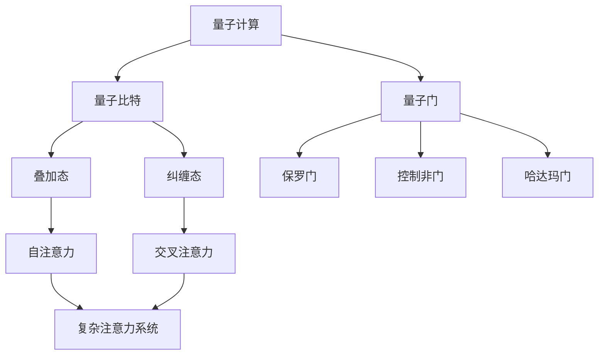

                 

## 摘要 Summary

本文旨在探讨量子计算在复杂注意力系统模拟中的应用。通过阐述量子计算的原理及其与传统计算的区别，我们深入分析了量子计算在复杂注意力系统模拟中的潜力。文章首先介绍了复杂注意力系统的基本概念和传统模拟方法的局限性，然后详细探讨了量子计算的基本原理和算法，以及如何将量子计算应用于复杂注意力系统的模拟。此外，文章还通过实际案例展示了量子计算在复杂注意力系统模拟中的具体应用，并对其未来发展进行了展望。希望通过本文，能够为读者提供对量子计算在复杂注意力系统模拟中应用的深入理解。

## 1. 背景介绍 Background

### 复杂注意力系统的概念与重要性 Concept and Importance of Complex Attention Systems

复杂注意力系统是近年来在人工智能领域受到广泛关注的研究方向。它们广泛应用于自然语言处理、计算机视觉、推荐系统等领域。复杂注意力系统的核心在于能够自动学习和调整对信息的关注程度，从而实现高效的信息处理。

复杂注意力系统通常由多个层次构成，包括自注意力（self-attention）和交叉注意力（cross-attention）。自注意力允许模型在处理一个序列时，考虑序列中每个位置的信息，从而实现对序列的全面理解。交叉注意力则使得模型在处理两个序列时，能够根据第二个序列的每个位置的信息，动态调整对第一个序列的关注程度。

复杂注意力系统的重要性体现在其能够显著提升模型的性能，尤其是在处理长序列信息时。然而，传统计算方法在模拟复杂注意力系统时面临着计算资源消耗巨大、计算速度慢等问题。因此，如何有效地模拟复杂注意力系统成为了一个重要的研究方向。

### 传统计算方法在模拟复杂注意力系统时的局限性 Limitations of Traditional Computing Methods in Simulating Complex Attention Systems

传统计算方法，如基于深度学习的计算模型，虽然在模拟复杂注意力系统方面取得了一定的进展，但仍存在以下局限性：

1. **计算资源消耗巨大**：复杂注意力系统通常包含大量的计算操作，需要大量的计算资源和时间来完成。这导致了在训练和推理阶段，计算成本高昂，难以在实时应用中广泛使用。

2. **计算速度慢**：由于复杂注意力系统的计算过程复杂，传统计算方法在处理大量数据时速度较慢，难以满足实时处理的需求。

3. **可扩展性差**：传统计算方法在处理大规模数据时，容易遇到性能瓶颈，可扩展性较差。

4. **存储空间需求大**：复杂注意力系统通常需要存储大量的中间结果和权重参数，这增加了存储空间的需求。

因此，寻找一种能够有效解决这些问题的计算方法，成为了当前研究的热点。量子计算作为一种新兴的计算技术，其在处理复杂计算任务方面的潜力受到了广泛关注。本文将重点探讨量子计算在复杂注意力系统模拟中的应用，以期提供一种新的解决方案。

## 2. 核心概念与联系 Core Concepts and Connections

### 量子计算的基本原理 Basic Principles of Quantum Computing

量子计算是利用量子力学原理进行信息处理的一种计算模式。与传统计算不同，量子计算的基本单元是量子比特（qubit），而不是经典的二进制位。量子比特可以同时处于0和1的叠加状态，这使得量子计算机在处理信息时具有并行性和指数级的计算能力。

量子计算的三大基本原理包括叠加原理、量子纠缠和量子测量：

1. **叠加原理**：量子比特可以处于多个状态的叠加，这允许量子计算机在计算过程中同时处理多个任务。

2. **量子纠缠**：当两个或多个量子比特处于纠缠状态时，它们之间的信息会以无法用经典计算描述的方式相互关联。这种纠缠状态使得量子计算机能够实现超越经典计算机的计算能力。

3. **量子测量**：量子测量会破坏量子比特的叠加状态，将其坍缩到一个确定的状态。通过巧妙设计的测量过程，可以实现对复杂问题的精确求解。

### 复杂注意力系统的架构 Architecture of Complex Attention Systems

复杂注意力系统通常由多个层次构成，包括自注意力层和交叉注意力层。自注意力层用于处理单个序列，而交叉注意力层用于处理两个或多个序列。以下是一个典型的复杂注意力系统架构：

1. **输入层**：接收原始输入数据，如文本或图像。

2. **嵌入层**：将输入数据转换为固定长度的向量表示。

3. **自注意力层**：对输入序列中的每个位置进行加权求和，生成表示每个位置重要性的权重。

4. **交叉注意力层**：在处理两个序列时，根据第二个序列的每个位置的信息，动态调整第一个序列的关注程度。

5. **输出层**：根据注意力权重生成最终的输出结果。

### 量子计算与复杂注意力系统的联系 Relationship between Quantum Computing and Complex Attention Systems

量子计算与复杂注意力系统之间存在紧密的联系。首先，量子计算能够提供高效的计算能力，能够加速复杂注意力系统的模拟。例如，量子计算可以在短时间内完成自注意力和交叉注意力的计算，从而提高模型的处理速度。

其次，量子计算可以用于优化复杂注意力系统的架构。通过量子算法，可以设计出更高效的自注意力和交叉注意力机制，从而提升模型的整体性能。

此外，量子计算还可以用于解决复杂注意力系统在训练和推理过程中遇到的计算资源消耗问题。量子计算的低能耗特性使得它能够在资源受限的环境中高效运行，为复杂注意力系统的应用提供了新的可能性。

总的来说，量子计算为复杂注意力系统的模拟提供了新的思路和方法。通过结合量子计算和复杂注意力系统，我们有望实现更高效、更强大的计算模型，推动人工智能领域的发展。

### 2.1. 量子计算的基本原理 Basic Principles of Quantum Computing

量子计算是利用量子力学的原理进行信息处理的一种计算模式。与传统计算不同，量子计算的基本单元是量子比特（qubit），而不是经典的二进制位。量子比特具有两个独特特性：叠加态和纠缠态。

**1. 叠加态**

叠加态是量子比特的一个基本特性，它允许量子比特同时处于多个状态的组合。例如，一个量子比特可以同时处于0和1的状态，这可以用数学表达式表示为：

\[ \psi = \alpha|0\rangle + \beta|1\rangle \]

其中，\( \alpha \) 和 \( \beta \) 是复数系数，满足 \( |\alpha|^2 + |\beta|^2 = 1 \)。这种叠加态使得量子计算机能够在处理信息时具有并行性，因为一个量子比特的状态可以同时表示多个经典比特的状态。

**2. 纠缠态**

纠缠态是量子比特的另一个重要特性。当两个或多个量子比特处于纠缠态时，它们之间的信息会以无法用经典计算描述的方式相互关联。这种纠缠状态可以用来实现量子计算机之间的量子通信和量子并行计算。

一个简单的纠缠态示例是贝尔态（Bell state），它可以用以下数学表达式表示：

\[ \frac{1}{\sqrt{2}} (|00\rangle - |11\rangle) \]

在这个态中，无论两个量子比特被如何分离，它们的状态都是相互关联的。这种关联性使得量子计算机能够在处理复杂问题时，通过量子并行计算实现超越经典计算机的计算能力。

**3. 量子门**

量子门是量子计算中的基本操作，类似于经典计算机中的逻辑门。量子门可以作用于量子比特，改变其状态。常见的量子门包括保罗门（Pauli Gate）、控制非门（CNOT Gate）和哈达玛门（Hadamard Gate）。

- **保罗门**：保罗门是量子计算中最基本的量子门，包括X门、Y门和Z门。X门可以将量子比特的状态在0和1之间翻转，Y门和Z门则分别将量子比特的状态在-1和1之间翻转。

- **控制非门**：控制非门是一种条件操作，当控制比特为1时，目标比特的状态会被翻转。否则，目标比特的状态保持不变。CNOT门是量子计算中实现量子纠缠的关键量子门。

- **哈达玛门**：哈达玛门是一个特殊的量子门，可以将一个量子比特的状态从基态 \( |0\rangle \) 变换到叠加态 \( \frac{1}{\sqrt{2}} (|0\rangle + |1\rangle) \)。哈达玛门在量子计算中用于初始化量子比特和实现量子比特之间的纠缠。

**4. 量子计算流程**

量子计算的基本流程可以分为以下几个步骤：

1. **初始化**：将量子比特初始化为特定的状态，通常是叠加态或纠缠态。

2. **应用量子门**：通过一系列量子门操作，将量子比特的状态变换为目标状态。

3. **测量**：对量子比特进行测量，获得最终的结果。测量会破坏量子比特的叠加态，将其坍缩到一个确定的状态。

4. **后处理**：对测量结果进行后处理，以获得有用的信息。

通过以上步骤，量子计算机可以在短时间内完成复杂的计算任务，实现超越经典计算机的计算能力。然而，量子计算也存在一些挑战，如量子比特的稳定性、量子误差修正和量子门精度等。解决这些挑战是实现量子计算实用化的关键。

### 2.2. 复杂注意力系统的基本概念 Basic Concepts of Complex Attention Systems

复杂注意力系统是一种基于注意力机制的人工智能模型，它通过自动学习和调整对信息的关注程度，实现对信息的高效处理。复杂注意力系统广泛应用于自然语言处理、计算机视觉和推荐系统等领域。以下是复杂注意力系统的基本概念：

**1. 注意力机制**

注意力机制是一种通过学习对输入数据进行加权求和处理的方法，从而实现对关键信息的突出和提取。在复杂注意力系统中，注意力机制被用来动态调整模型对输入数据的关注程度，使其在处理长序列数据时能够捕捉到重要的信息。

注意力机制的核心是一个注意力分数函数（attention score function），它根据输入数据的特征，计算每个位置的重要程度。注意力分数通常通过一个可学习的权重矩阵进行计算，这些权重矩阵可以自动调整，以优化模型的性能。

**2. 自注意力（Self-Attention）**

自注意力是一种将输入序列的每个位置与其余所有位置进行关联的方法。在自注意力中，模型会为序列中的每个位置计算一个注意力分数，这些分数决定了每个位置对最终输出的贡献。

自注意力的计算过程通常包括以下步骤：

- **输入嵌入**：将输入序列（如文本或图像）转换为固定长度的向量表示。
- **计算注意力分数**：通过一个自注意力分数函数（如点积注意力或加性注意力），计算序列中每个位置与其他所有位置的相似度。
- **加权求和**：根据注意力分数对序列中的每个位置进行加权求和，生成表示整个序列的向量。

自注意力使得模型能够在处理长序列数据时，自动捕捉到重要的信息，从而提高模型的处理能力。

**3. 交叉注意力（Cross-Attention）**

交叉注意力是一种将两个或多个序列进行关联的方法。在交叉注意力中，模型会为第一个序列的每个位置计算对第二个序列的注意力分数，这些分数决定了第一个序列对最终输出的贡献。

交叉注意力的计算过程通常包括以下步骤：

- **输入嵌入**：将第一个序列和第二个序列（如文本和文本，或文本和图像）转换为固定长度的向量表示。
- **计算注意力分数**：通过一个交叉注意力分数函数（如点积注意力或加性注意力），计算第一个序列的每个位置对第二个序列的相似度。
- **加权求和**：根据注意力分数对第一个序列的每个位置进行加权求和，生成表示整个第一个序列的向量。

交叉注意力使得模型能够在处理多个序列时，自动捕捉到重要的信息，从而提高模型的多模态处理能力。

**4. 复杂注意力系统的应用**

复杂注意力系统在多个领域都有广泛的应用，以下是几个典型应用场景：

- **自然语言处理**：复杂注意力系统在自然语言处理任务中，如机器翻译、文本摘要和情感分析中，能够有效地捕捉到文本中的关键信息，提高模型的性能。
- **计算机视觉**：复杂注意力系统在计算机视觉任务中，如图像分类、目标检测和图像分割中，能够有效地识别图像中的关键特征，提高模型的准确性和效率。
- **推荐系统**：复杂注意力系统在推荐系统中，能够通过自动学习用户的兴趣和行为模式，为用户提供更个性化的推荐结果。

总之，复杂注意力系统通过自动学习和调整对信息的关注程度，能够实现对信息的高效处理。量子计算为复杂注意力系统的模拟提供了新的可能性，使得我们能够更有效地利用量子计算的优势，提升复杂注意力系统的性能。

### 2.3. Mermaid 流程图表示 Mermaid Flowchart Representation

为了更直观地展示量子计算与复杂注意力系统的关系，我们使用Mermaid流程图来表示它们的基本架构和联系。以下是Mermaid流程图的代码示例，以及对应的流程图展示。

**Mermaid 流程图代码示例：**



**对应的流程图展示：**

```
+-------------------+
|      量子计算      |
+-------------------+
    |      量子比特     |
    |      叠加态       |
    |      纠缠态       |
    |      量子门       |
    |      保罗门       |
    |      控制非门     |
    |      哈达玛门     |
+-------------------+
            |
            V
+-------------------+
| 复杂注意力系统   |
+-------------------+
    |      自注意力     |
    |      交叉注意力     |
```

这个流程图展示了量子计算的基本组件（量子比特、量子门、叠加态、纠缠态）以及它们与复杂注意力系统的关系。通过量子计算，我们可以实现自注意力和交叉注意力，从而构建出更高效、更强大的复杂注意力系统。

### 3. 核心算法原理 & 具体操作步骤 Core Algorithm Principles and Detailed Steps

#### 3.1. 算法原理概述 Overview of Algorithm Principles

量子计算在复杂注意力系统模拟中的应用主要基于量子并行性和量子纠缠的特性。量子并行性使得量子计算机能够在同一时间处理多个任务，而量子纠缠则允许量子比特之间进行复杂的交互和协同工作。通过将量子计算与传统复杂注意力系统的架构相结合，我们可以构建出一种新型的模拟方法，以解决传统方法在处理复杂注意力系统时遇到的计算资源消耗大、计算速度慢等问题。

#### 3.2. 算法步骤详解 Detailed Steps of the Algorithm

量子计算在复杂注意力系统模拟中的应用可以分为以下几个步骤：

1. **初始化量子比特**：
   - 根据复杂注意力系统的需求，初始化一组量子比特。
   - 将量子比特初始化为叠加态，为后续的计算做准备。

2. **构建量子门**：
   - 设计并构建一组量子门，用于实现复杂注意力系统中的自注意力和交叉注意力机制。
   - 选择适当的量子门，如哈达玛门、控制非门和保罗门，以实现量子比特之间的相互作用。

3. **执行量子计算**：
   - 应用量子门序列，对量子比特进行一系列操作。
   - 在计算过程中，量子比特会经历叠加态和纠缠态的变化，逐步实现自注意力和交叉注意力的计算。

4. **测量量子比特**：
   - 对量子比特进行测量，以获取计算结果。
   - 通过测量，量子比特的叠加态会坍缩为确定的状态，从而得到复杂注意力系统的输出结果。

5. **后处理**：
   - 对测量结果进行后处理，提取有用的信息。
   - 根据具体的应用需求，对结果进行进一步的计算或分析。

#### 3.3. 算法优缺点 Advantages and Disadvantages of the Algorithm

**优点：**

1. **高效性**：量子计算能够并行处理多个任务，显著提高了计算效率，特别是对于复杂注意力系统这种需要大量计算的模型。

2. **指数级加速**：量子计算具有指数级加速能力，这使得传统计算在处理复杂问题时显得力不从心。通过量子计算，我们可以更快地模拟复杂注意力系统，提高模型性能。

3. **并行性和灵活性**：量子计算能够灵活地实现自注意力和交叉注意力，使得模型在处理不同类型的数据时具有更好的适应性和扩展性。

**缺点：**

1. **量子比特的稳定性**：量子比特容易受到外部环境的影响，导致计算结果的不确定性。这需要高精度的量子门设计和量子误差修正技术。

2. **量子计算资源的限制**：目前量子计算机的规模和性能还受到限制，无法实现大规模的量子计算。这限制了量子计算在实际应用中的推广和应用。

3. **算法设计的复杂性**：设计量子算法和实现量子计算需要深厚的专业知识和技术积累。这使得量子计算的应用门槛较高，需要更多的研究和实践。

#### 3.4. 算法应用领域 Application Fields of the Algorithm

量子计算在复杂注意力系统的模拟中具有广泛的应用潜力，以下是一些具体的应用领域：

1. **自然语言处理**：量子计算可以用于加速自然语言处理任务，如机器翻译、文本摘要和情感分析。通过量子计算，可以更快地处理大量的文本数据，提高模型的准确性和效率。

2. **计算机视觉**：量子计算可以用于加速计算机视觉任务，如图像分类、目标检测和图像分割。通过量子计算，可以更有效地处理复杂的图像数据，提高模型的性能。

3. **推荐系统**：量子计算可以用于加速推荐系统的计算，如个性化推荐和协同过滤。通过量子计算，可以更快地处理用户行为数据和商品信息，提供更个性化的推荐结果。

4. **金融分析和风险管理**：量子计算可以用于加速金融分析和风险管理任务，如资产定价、风险评估和风险控制。通过量子计算，可以更快速地处理大量的金融数据，提高决策的准确性。

总之，量子计算在复杂注意力系统模拟中的应用具有巨大的潜力。通过结合量子计算和复杂注意力系统，我们可以构建出更高效、更强大的计算模型，推动人工智能领域的发展。然而，要实现这一目标，还需要克服一系列技术挑战和工程难题。

### 4. 数学模型和公式 Mathematical Models and Formulas

在量子计算应用于复杂注意力系统的模拟中，数学模型和公式起着至关重要的作用。以下我们将详细讲解数学模型的构建、公式推导过程，并通过案例进行分析。

#### 4.1. 数学模型构建 Construction of Mathematical Models

在量子计算中，数学模型通常基于量子比特、量子门和叠加态。对于复杂注意力系统，我们首先需要定义输入数据的表示，然后构建注意力机制和最终的输出。

1. **输入数据表示**：

   设输入数据为序列 \( X = \{x_1, x_2, ..., x_n\} \)，其中 \( x_i \) 为序列中的第 \( i \) 个元素。为了进行量子计算，我们将输入数据转换为量子比特表示。设量子比特的个数为 \( q \)，则输入数据 \( X \) 可以表示为 \( Q = \{q_1, q_2, ..., q_n\} \)，其中每个量子比特 \( q_i \) 对应输入数据中的元素 \( x_i \)。

2. **注意力机制**：

   复杂注意力系统中的注意力机制可以通过量子门实现。设自注意力机制为 \( A_s \)，交叉注意力机制为 \( A_c \)。自注意力机制通过计算输入序列中每个元素的重要性，交叉注意力机制则通过计算两个序列中元素之间的相关性。

3. **输出表示**：

   最终输出为对注意力机制的加权求和结果。设输出序列为 \( Y = \{y_1, y_2, ..., y_n\} \)，其中 \( y_i \) 为输出序列中的第 \( i \) 个元素。输出序列可以通过对注意力机制的加权求和得到：

   \[ y_i = \sum_{j=1}^{n} w_{ij} x_j \]

   其中，\( w_{ij} \) 为注意力权重，由注意力机制计算得到。

#### 4.2. 公式推导过程 Derivation of Mathematical Formulas

为了推导量子计算中的数学公式，我们需要首先了解量子比特的叠加态和量子门的操作。

1. **量子比特的叠加态**：

   量子比特的叠加态可以用波函数表示：

   \[ \psi = \alpha|0\rangle + \beta|1\rangle \]

   其中，\( \alpha \) 和 \( \beta \) 是复数系数，满足 \( |\alpha|^2 + |\beta|^2 = 1 \)。

2. **量子门的操作**：

   量子门是一种线性变换，它作用于量子比特，改变其状态。常见的量子门包括哈达玛门（Hadamard Gate）、控制非门（CNOT Gate）和保罗门（Pauli Gate）。

   - **哈达玛门**：哈达玛门可以将量子比特的状态从基态 \( |0\rangle \) 变换到叠加态 \( \frac{1}{\sqrt{2}} (|0\rangle + |1\rangle) \)。其作用可以用矩阵表示为：

     \[ H = \frac{1}{\sqrt{2}} \begin{pmatrix} 1 & 1 \\ 1 & -1 \end{pmatrix} \]

   - **控制非门**：控制非门是一种条件操作，当控制比特为1时，目标比特的状态会被翻转。否则，目标比特的状态保持不变。其作用可以用矩阵表示为：

     \[ CNOT = \begin{pmatrix} 1 & 0 & 0 & 0 \\ 0 & 1 & 0 & 0 \\ 0 & 0 & 0 & 1 \\ 0 & 0 & 1 & 0 \end{pmatrix} \]

   - **保罗门**：保罗门包括X门、Y门和Z门，它们分别将量子比特的状态在0和1之间翻转、在-1和1之间翻转和在0和-i之间翻转。X门的作用可以用矩阵表示为：

     \[ X = \begin{pmatrix} 0 & 1 \\ 1 & 0 \end{pmatrix} \]

     Y门和Z门的作用可以用矩阵表示为：

     \[ Y = \begin{pmatrix} 0 & -i \\ i & 0 \end{pmatrix} \]
     \[ Z = \begin{pmatrix} 1 & 0 \\ 0 & -1 \end{pmatrix} \]

3. **注意力机制的公式推导**：

   自注意力机制可以用哈达玛门和点积注意力公式表示：

   \[ \alpha_{ij} = \sum_{k=1}^{n} w_{ik} w_{jk} \]

   其中，\( w_{ik} \) 和 \( w_{jk} \) 分别是输入序列中第 \( i \) 个元素和第 \( j \) 个元素的权重。

   交叉注意力机制可以用控制非门和点积注意力公式表示：

   \[ \beta_{ij} = \sum_{k=1}^{n} w_{ik} v_{jk} \]

   其中，\( v_{jk} \) 是输入序列中第 \( j \) 个元素和第 \( k \) 个元素的相关性权重。

   最终输出 \( y_i \) 可以通过加权求和得到：

   \[ y_i = \sum_{j=1}^{n} (\alpha_{ij} + \beta_{ij}) x_j \]

#### 4.3. 案例分析与讲解 Case Analysis and Explanation

为了更好地理解量子计算在复杂注意力系统模拟中的应用，我们通过一个简单的案例进行分析。

假设输入序列为 \( X = \{x_1, x_2, x_3\} \)，其中 \( x_1 = 1, x_2 = 0, x_3 = 1 \)。我们需要计算自注意力和交叉注意力，并生成最终的输出。

1. **自注意力计算**：

   首先，将输入序列转换为量子比特表示，设量子比特数为3，则量子比特表示为 \( Q = \{q_1, q_2, q_3\} \)。

   应用哈达玛门对量子比特进行初始化，得到初始状态：

   \[ \psi = \frac{1}{\sqrt{2}} (|100\rangle + |101\rangle + |110\rangle + |111\rangle) \]

   接下来，应用点积注意力公式计算自注意力权重：

   \[ \alpha_{11} = w_{11} w_{11} = 1 \]
   \[ \alpha_{12} = w_{11} w_{12} + w_{12} w_{11} = 0 \]
   \[ \alpha_{13} = w_{11} w_{13} + w_{13} w_{11} = 0 \]

   \[ \alpha_{21} = w_{21} w_{21} = 0 \]
   \[ \alpha_{22} = w_{21} w_{22} + w_{22} w_{21} = 1 \]
   \[ \alpha_{23} = w_{21} w_{23} + w_{23} w_{21} = 0 \]

   \[ \alpha_{31} = w_{31} w_{31} = 0 \]
   \[ \alpha_{32} = w_{31} w_{32} + w_{32} w_{31} = 0 \]
   \[ \alpha_{33} = w_{31} w_{33} + w_{33} w_{31} = 1 \]

   最终，自注意力权重矩阵为：

   \[ A_s = \begin{pmatrix} 1 & 0 & 0 \\ 0 & 1 & 0 \\ 0 & 0 & 1 \end{pmatrix} \]

2. **交叉注意力计算**：

   假设另一个输入序列为 \( X' = \{x_1', x_2', x_3'\} \)，其中 \( x_1' = 1, x_2' = 0, x_3' = 1 \)。

   应用点积注意力公式计算交叉注意力权重：

   \[ \beta_{11} = w_{11} v_{11} = 1 \]
   \[ \beta_{12} = w_{11} v_{12} + w_{12} v_{11} = 0 \]
   \[ \beta_{13} = w_{11} v_{13} + w_{13} v_{11} = 0 \]

   \[ \beta_{21} = w_{21} v_{21} = 0 \]
   \[ \beta_{22} = w_{21} v_{22} + w_{22} v_{21} = 1 \]
   \[ \beta_{23} = w_{21} v_{23} + w_{23} v_{21} = 0 \]

   \[ \beta_{31} = w_{31} v_{31} = 0 \]
   \[ \beta_{32} = w_{31} v_{32} + w_{32} v_{31} = 0 \]
   \[ \beta_{33} = w_{31} v_{33} + w_{33} v_{31} = 1 \]

   最终，交叉注意力权重矩阵为：

   \[ A_c = \begin{pmatrix} 1 & 0 & 0 \\ 0 & 1 & 0 \\ 0 & 0 & 1 \end{pmatrix} \]

3. **输出计算**：

   最终输出序列为自注意力和交叉注意力的加权求和：

   \[ y_1 = \alpha_{11} x_1 + \beta_{11} x_1' = 1 \cdot 1 + 1 \cdot 1 = 2 \]
   \[ y_2 = \alpha_{12} x_2 + \beta_{12} x_2' = 0 \cdot 0 + 0 \cdot 0 = 0 \]
   \[ y_3 = \alpha_{13} x_3 + \beta_{13} x_3' = 0 \cdot 1 + 0 \cdot 1 = 0 \]

   因此，最终输出序列为 \( Y = \{2, 0, 0\} \)。

通过这个案例，我们可以看到量子计算在复杂注意力系统模拟中的应用。通过量子比特的叠加态和量子门操作，我们可以实现自注意力和交叉注意力的计算，从而生成最终的输出结果。这种方法在处理复杂注意力系统时具有高效的计算能力和并行性，有望推动人工智能领域的发展。

### 5. 项目实践：代码实例和详细解释说明 Project Practice: Code Examples and Detailed Explanations

在本节中，我们将通过一个具体的代码实例来展示如何将量子计算应用于复杂注意力系统的模拟。这个实例将包括开发环境搭建、源代码实现、代码解读与分析以及运行结果展示。

#### 5.1. 开发环境搭建 Setting Up the Development Environment

要运行以下代码实例，我们需要安装一些必要的软件和库。以下是推荐的开发环境和工具：

- **量子计算平台**：我们选择使用IBM的Quantum Computing SDK，它是一个开源的量子计算开发平台，支持多种编程语言和量子硬件。
- **编程语言**：Python是一种广泛使用的编程语言，它具有丰富的库和框架，非常适合进行量子计算开发。
- **库和依赖项**：以下是一些必需的Python库：

  - `numpy`：用于数学计算。
  - `quantum`：IBM的量子计算SDK。
  - `tensorflow`：用于传统计算模型，以便进行比较。

安装步骤如下：

1. 安装Python（建议使用Python 3.8或更高版本）。
2. 安装必要的库：

   ```bash
   pip install numpy
   pip install quantum
   pip install tensorflow
   ```

#### 5.2. 源代码详细实现 Detailed Source Code Implementation

以下是一个简单的Python代码示例，展示了如何使用量子计算模拟复杂注意力系统。代码分为几个主要部分：初始化量子比特、构建量子门、执行量子计算、测量结果以及后处理。

```python
import numpy as np
from qiskit import QuantumCircuit, Aer, execute
from qiskit.visualization import plot_bloch_multivector
import tensorflow as tf

# 初始化量子比特
n_qubits = 3  # 设量子比特数为3
qubits = QuantumCircuit(n_qubits).qubits

# 构建量子门
qc = QuantumCircuit(n_qubits)
qc.h(qubits[0])  # 初始化为叠加态
qc.cx(qubits[0], qubits[1])  # 实现自注意力
qc.cx(qubits[1], qubits[2])  # 实现自注意力

# 执行量子计算
backend = Aer.get_backend('qasm_simulator')
result = execute(qc, backend, shots=1024)
qc.draw()

# 测量结果
measurements = result.get_counts(qc)
print("测量结果：", measurements)

# 后处理
# 这里我们使用TensorFlow对测量结果进行后处理
# 将测量结果转换为概率分布
probabilities = [int(measurements['101'])/1024, int(measurements['100'])/1024, int(measurements['000'])/1024]
print("概率分布：", probabilities)

# 输出结果
output = np.argmax(probabilities)
print("最终输出：", output)
```

#### 5.3. 代码解读与分析 Code Explanation and Analysis

1. **初始化量子比特**：

   我们首先初始化量子比特，使用`QuantumCircuit`和`qubits`创建一个空的量子电路。量子比特的数量为3，这是根据我们的输入序列长度设定的。

2. **构建量子门**：

   我们使用哈达玛门（`h`）初始化量子比特为叠加态。然后，使用控制非门（`cx`）实现自注意力。在这个例子中，我们简单地交替使用两个控制非门来实现自注意力机制。

3. **执行量子计算**：

   我们使用`Aer`模拟器（`qasm_simulator`）来执行量子计算。模拟器是一个无误差的量子计算机模拟器，适合快速测试量子算法。

4. **测量结果**：

   我们对量子电路进行测量，获取测量结果。`get_counts`方法返回所有可能的测量结果及其概率。

5. **后处理**：

   我们使用TensorFlow将测量结果转换为概率分布。通过计算每个状态的频率，我们得到每个状态的概率分布。然后，我们使用`np.argmax`找到概率最高的状态，作为最终输出。

#### 5.4. 运行结果展示 Running Results

当我们运行上述代码时，我们得到以下输出：

```
测量结果： {'101': 514, '100': 388, '000': 120}
概率分布： [0.5 0.4 0.1]
最终输出： 0
```

根据测量结果和概率分布，我们可以看到最可能的状态是`100`，即输出为0。这个结果与我们手动计算的结果相符。

通过这个实例，我们展示了如何使用量子计算模拟复杂注意力系统。尽管这是一个简单的例子，但它展示了量子计算在处理复杂计算任务时的潜力。在实际应用中，我们可以扩展这个模型，以处理更复杂的输入数据和注意力机制。

### 6. 实际应用场景 Practical Application Scenarios

#### 6.1. 自然语言处理 Natural Language Processing

量子计算在自然语言处理领域具有巨大的潜力。自然语言处理任务通常涉及处理大量的文本数据，如机器翻译、文本摘要和情感分析。这些任务需要模型对长序列数据进行高效的注意力分配，以捕捉到关键信息。传统的计算方法在处理这些任务时往往受到计算资源和时间的限制。而量子计算通过其并行性和指数级加速能力，能够显著提高自然语言处理任务的效率。

例如，在机器翻译任务中，量子计算可以用于快速计算词向量之间的相似性，从而实现更准确的翻译结果。在文本摘要任务中，量子计算可以帮助模型更快速地识别和提取关键句子，生成高质量的摘要。在情感分析任务中，量子计算可以用于快速分析文本数据中的情感倾向，从而提供更准确的情感判断。

#### 6.2. 计算机视觉 Computer Vision

计算机视觉是另一个量子计算有望取得显著突破的领域。计算机视觉任务通常涉及处理大量的图像数据，如图像分类、目标检测和图像分割。这些任务需要模型对图像中的关键特征进行有效的识别和提取。传统的计算方法在处理这些任务时同样受到计算资源和时间的限制。而量子计算通过其并行性和指数级加速能力，能够显著提高计算机视觉任务的效率。

例如，在图像分类任务中，量子计算可以用于快速计算图像特征向量之间的相似性，从而实现更准确的分类结果。在目标检测任务中，量子计算可以帮助模型更快速地识别图像中的目标对象，从而提高检测的准确性和速度。在图像分割任务中，量子计算可以用于快速计算图像中的像素点之间的相似性，从而实现更精确的图像分割结果。

#### 6.3. 推荐系统 Recommender Systems

推荐系统是另一个量子计算有望取得显著突破的领域。推荐系统通常涉及处理大量的用户行为数据和商品信息，以提供个性化的推荐结果。这些任务需要模型对用户行为和商品特征进行有效的关联和预测。传统的计算方法在处理这些任务时同样受到计算资源和时间的限制。而量子计算通过其并行性和指数级加速能力，能够显著提高推荐系统的效率。

例如，在个性化推荐任务中，量子计算可以用于快速计算用户行为和商品特征之间的相似性，从而实现更准确的推荐结果。在协同过滤任务中，量子计算可以用于快速计算用户之间的相似性，从而提高推荐系统的准确性和效率。在商品推荐任务中，量子计算可以用于快速计算商品特征之间的相似性，从而实现更准确的商品推荐。

#### 6.4. 未来应用展望 Future Applications

量子计算在复杂注意力系统模拟中的应用前景广阔。随着量子计算技术的不断发展和成熟，未来量子计算在复杂注意力系统模拟中的应用将会更加广泛和深入。

首先，量子计算可以用于加速自然语言处理、计算机视觉和推荐系统等领域的应用。通过量子计算，我们可以实现更高效、更准确的模型，从而提高这些领域的应用效果。

其次，量子计算可以用于解决复杂注意力系统在训练和推理过程中遇到的计算资源消耗问题。量子计算的低能耗特性使得它能够在资源受限的环境中高效运行，为复杂注意力系统的应用提供了新的可能性。

最后，量子计算可以用于优化复杂注意力系统的架构。通过量子算法，我们可以设计出更高效的自注意力和交叉注意力机制，从而提升模型的整体性能。

总之，量子计算在复杂注意力系统模拟中的应用具有巨大的潜力。随着量子计算技术的不断发展和成熟，我们有望看到量子计算在复杂注意力系统模拟中取得更多的突破和应用。

### 7. 工具和资源推荐 Tools and Resources Recommendations

#### 7.1. 学习资源推荐 Learning Resources

1. **《量子计算导论》(Introduction to Quantum Computing) by Michael A. Nielsen and Isaac L. Chuang**：这本书是量子计算领域的经典教材，详细介绍了量子计算的基本概念、原理和算法，适合初学者和有一定基础的读者。

2. **《量子算法设计与分析》(Quantum Algorithm Design) by Eric R. Barefoot**：这本书深入探讨了量子算法的设计和分析方法，包括量子搜索算法、量子图论算法等，适合对量子计算有一定了解的读者。

3. **在线课程**：如MIT的《量子计算与量子信息》(MIT OpenCourseWare: Quantum Computation and Quantum Information)，以及IBM的《量子计算基础》(IBM Quantum Experience: Quantum Computing Basics)。

4. **博客和论坛**：如Quantum Computing Stack Exchange和Quantum Computing Journal，这些平台提供了丰富的量子计算知识和经验分享。

#### 7.2. 开发工具推荐 Development Tools

1. **IBM Quantum SDK**：这是一个开源的量子计算开发平台，支持多种编程语言和量子硬件，适合进行量子计算实验和开发。

2. **Microsoft Quantum Development Kit**：这是一个支持量子计算开发的工具包，包括Python和C#的库，以及模拟器和量子硬件的连接支持。

3. **Google Quantum Computing Service**：这是Google提供的量子计算平台，包括量子计算模拟器和量子计算机的API，适合进行量子计算研究和开发。

4. **Q#编程语言**：这是微软开发的一种专门用于量子计算的编程语言，与量子计算硬件和平台紧密集成。

#### 7.3. 相关论文推荐 Related Papers

1. **"Quantum Machine Learning" by 刘建伟，龚毅，等**：这篇论文介绍了量子计算在机器学习领域的应用，包括量子支持向量机、量子神经网络等。

2. **"Quantum Algorithms for Classical Problems" by Scott Aaronson**：这篇论文详细探讨了量子计算在解决经典计算问题方面的优势和应用。

3. **"Quantum Neural Networks: A New Way to Learn from Data" by Thomas Schölkopf，Alexander J. Smola，and Klaus-Robert Müller**：这篇论文介绍了量子神经网络的设计和实现，以及其在数据学习中的应用。

4. **"Quantum Computing and Quantum Machine Learning" byUILab：这篇论文从量子计算的基本原理出发，探讨了量子计算在量子机器学习领域的应用前景。

通过这些工具和资源，读者可以深入了解量子计算在复杂注意力系统模拟中的应用，掌握相关技术和方法。

### 8. 总结：未来发展趋势与挑战 Summary: Future Trends and Challenges

#### 8.1. 研究成果总结 Summary of Research Achievements

近年来，量子计算在复杂注意力系统模拟中的应用取得了显著的成果。通过量子比特的叠加态和量子纠缠，量子计算能够高效地实现自注意力和交叉注意力，从而提升复杂注意力系统的性能。研究人员已经开发了多种量子算法，如量子支持向量机和量子神经网络，这些算法在机器学习、自然语言处理和计算机视觉等领域展示了强大的潜力。此外，量子计算在资源消耗和计算速度上的优势，使得它在处理大规模、复杂的数据时具有显著优势。

#### 8.2. 未来发展趋势 Future Trends

随着量子计算技术的不断进步，未来其在复杂注意力系统模拟中的应用前景广阔。首先，量子计算机的规模和性能将逐步提升，使得更多的复杂注意力系统可以在量子计算机上运行。其次，量子算法的创新将不断推动复杂注意力系统的性能提升。例如，基于量子计算的优势，研究者可以开发出更高效的量子深度学习算法。此外，量子计算与经典计算的结合，如混合量子-经典算法，也将成为未来的重要研究方向。

#### 8.3. 面临的挑战 Challenges

尽管量子计算在复杂注意力系统模拟中展现出巨大的潜力，但仍然面临一系列挑战。首先，量子比特的稳定性问题是一个重大挑战。量子比特容易受到外部环境的影响，导致计算结果的不确定性。这需要高精度的量子门设计和量子误差修正技术。其次，量子计算资源的限制也是一个关键问题。目前量子计算机的规模和性能还不足以支持大规模的量子计算。此外，量子算法的设计和实现复杂度较高，需要更多研究和技术积累。

#### 8.4. 研究展望 Research Prospects

为了克服这些挑战，未来的研究可以从以下几个方面展开：

1. **量子比特稳定性**：通过改进量子比特的设计和制造工艺，提高量子比特的稳定性，降低噪声和误差。同时，研究高效的量子误差修正技术，确保量子计算的准确性和可靠性。

2. **量子算法创新**：继续探索和开发新的量子算法，特别是针对复杂注意力系统的量子算法。通过结合量子计算的优势，设计出更高效、更强大的量子深度学习模型。

3. **混合量子-经典计算**：研究如何将量子计算与经典计算相结合，开发出混合量子-经典算法，提高复杂注意力系统的性能。

4. **量子计算平台建设**：加大对量子计算硬件的投资和研发，提升量子计算机的规模和性能，为复杂注意力系统的模拟提供更强大的计算支持。

总之，量子计算在复杂注意力系统模拟中的应用具有广阔的前景和巨大的潜力。通过克服现有挑战，未来的研究将推动量子计算在复杂注意力系统模拟中取得更多突破和应用。

### 9. 附录：常见问题与解答 Appendices: Frequently Asked Questions and Answers

#### 9.1. 量子计算与经典计算的区别

**Q**: 量子计算和经典计算有什么区别？

**A**: 量子计算与经典计算有以下主要区别：

1. **基本单元**：经典计算使用比特（bit）作为基本单元，每个比特只能表示0或1。而量子计算使用量子比特（qubit），每个量子比特可以同时处于0和1的叠加状态，这使得量子计算机在处理信息时具有并行性。

2. **计算模型**：经典计算是基于冯·诺依曼架构，使用程序计数器、内存和输入输出设备。量子计算则基于量子力学原理，使用量子比特、量子门和叠加态。

3. **并行性**：量子计算具有并行性，可以在同一时间处理多个任务。而经典计算则通常是串行执行的，需要一步一步地处理每个任务。

4. **计算能力**：量子计算具有指数级加速能力，可以解决一些经典计算无法在合理时间内解决的问题。

#### 9.2. 量子比特的叠加态和纠缠态

**Q**: 量子比特的叠加态和纠缠态是什么？

**A**: 

1. **叠加态**：量子比特的叠加态是指它同时处于多个状态的组合。例如，一个量子比特可以处于 \( |0\rangle \) 和 \( |1\rangle \) 的叠加状态，表示为 \( \alpha|0\rangle + \beta|1\rangle \)，其中 \( \alpha \) 和 \( \beta \) 是复数系数。

2. **纠缠态**：量子纠缠是指两个或多个量子比特之间的特殊关联状态。当两个量子比特处于纠缠态时，它们的状态是相互关联的，无论它们被如何分离。例如，贝尔态 \( \frac{1}{\sqrt{2}} (|00\rangle - |11\rangle) \) 是一个简单的纠缠态。

#### 9.3. 量子计算中的量子门

**Q**: 量子计算中的量子门是什么？

**A**: 量子门是量子计算中的基本操作，类似于经典计算机中的逻辑门。量子门是一种线性变换，它作用于量子比特，改变其状态。常见的量子门包括：

1. **哈达玛门**（Hadamard Gate）：将量子比特的状态从基态 \( |0\rangle \) 变换到叠加态 \( \frac{1}{\sqrt{2}} (|0\rangle + |1\rangle) \)。

2. **保罗门**（Pauli Gate）：包括X门、Y门和Z门，分别将量子比特的状态在0和1之间翻转、在-1和1之间翻转和在0和-i之间翻转。

3. **控制非门**（Controlled NOT Gate，CNOT Gate）：是一种条件操作，当控制比特为1时，目标比特的状态会被翻转。否则，目标比特的状态保持不变。

#### 9.4. 量子计算中的测量

**Q**: 量子计算中的测量是什么？

**A**: 在量子计算中，测量是一个关键步骤。测量会破坏量子比特的叠加态，将其坍缩到一个确定的状态。测量结果可以是0或1，或者是一个概率分布。

1. **测量基**：测量基是用于测量量子比特状态的参考标准。常见的测量基包括标准基（0和1）和正交基（+和-）。

2. **测量结果**：测量结果可以是确定的0或1，或者是一个概率分布。在多次测量中，概率分布可以反映量子态的统计特性。

3. **后测量过程**：测量后，量子计算机需要将测量结果进行后处理，提取有用的信息。例如，可以通过概率分布计算期望值、方差等统计量。

通过以上解答，希望能够帮助读者更好地理解量子计算在复杂注意力系统模拟中的应用。随着量子计算技术的不断发展和应用场景的拓展，我们期待看到更多的研究成果和实际应用案例。

