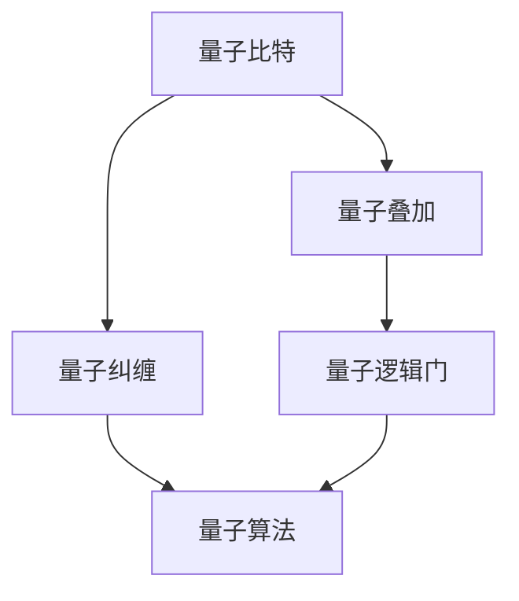

                 

关键词：量子计算、计算技术、量子算法、量子计算机、量子信息、量子比特、超导量子比特、量子纠缠、量子叠加、量子逻辑门、量子模拟、量子加密、量子通信、量子计算编程语言、量子互联网。

> 摘要：本文旨在深入探讨量子计算这一新兴计算技术，分析其核心概念、算法原理、数学模型以及未来应用场景。通过对量子计算的优势与挑战的讨论，我们将展望量子计算在信息科技领域的广泛影响，并为读者提供相关学习资源与开发工具的推荐。

## 1. 背景介绍

量子计算作为一种革命性的计算技术，源于量子力学的基本原理。传统计算机依赖于经典比特进行信息处理，而量子计算机则利用量子比特（或称量子位，qubit）来实现。量子比特具有叠加和纠缠的特性，这使得量子计算机在处理特定问题时展现出远超经典计算机的强大能力。

量子计算的概念最早可以追溯到1980年代，当时理查德·费曼（Richard Feynman）提出了量子模拟的想法。随后，彼得·什洛墨利（Peter Shor）在1994年提出了Shor算法，这一算法展示了量子计算机在因数分解问题上的巨大优势，引发了量子计算的广泛关注。

进入21世纪，随着实验技术的进步，量子计算机逐渐从理论走向实际。近年来，谷歌、IBM、微软等科技巨头纷纷投入巨资研发量子计算机，期望在人工智能、材料科学、量子化学等众多领域实现突破。

## 2. 核心概念与联系

为了更好地理解量子计算，我们需要先了解一些核心概念及其相互关系。以下是一个简化的Mermaid流程图，展示了量子计算中几个关键概念：



### 2.1 量子比特

量子比特是量子计算机的基本单位，它可以是0和1的叠加态，这被称为叠加原理。一个量子比特可以同时处于0和1的状态，而经典比特只能处于0或1中的一个状态。这种叠加特性使得量子计算机能够同时处理大量的计算任务。

### 2.2 量子叠加

量子叠加是量子比特的一种基本特性，意味着一个量子比特可以同时处于多个状态的叠加。这种特性使得量子计算机能够并行处理大量的数据，从而显著提高计算速度。

### 2.3 量子纠缠

量子纠缠是量子比特之间的特殊关联，即使两个量子比特相隔很远，它们的状态也会相互影响。这种纠缠特性是量子计算实现并行处理和高速计算的关键。

### 2.4 量子逻辑门

量子逻辑门是量子计算机中的基本操作，类似于经典计算机中的逻辑门。量子逻辑门可以用于操纵量子比特的状态，实现量子信息的处理和传输。

### 2.5 量子算法

量子算法是利用量子比特的叠加和纠缠特性设计的计算算法。Shor算法和Grover算法是两个著名的量子算法，它们展示了量子计算在特定问题上的优势。

## 3. 核心算法原理 & 具体操作步骤

### 3.1 算法原理概述

量子算法的设计依赖于量子比特的叠加和纠缠特性。以Shor算法为例，它利用量子叠加和纠缠来实现因数分解。具体来说，Shor算法通过构建一个量子状态，使其包含待分解数的因子，然后通过测量量子状态来获取这些因子。

### 3.2 算法步骤详解

Shor算法的步骤可以分为以下几个阶段：

1. **初始化量子态**：创建一个包含待分解数的幂次方的量子态。
2. **量子电路构建**：构建一个量子电路，使得量子态在经过电路之后发生相位偏移。
3. **测量**：对量子态进行测量，获取可能的相位信息。
4. **逆量子四则运算**：通过逆量子四则运算来估计待分解数的因子。
5. **重复测量与估计**：重复上述步骤，提高估计的准确性。

### 3.3 算法优缺点

Shor算法的优点在于其高效的因数分解能力，这对于密码学等领域具有重要意义。然而，Shor算法的实现需要大量的量子比特和精确的量子操作，这给实际应用带来了一定的挑战。

### 3.4 算法应用领域

量子算法在密码学、量子化学、材料科学、优化问题等领域具有广泛的应用前景。例如，量子算法可以用于破解RSA加密算法，从而对现有的网络安全提出挑战。

## 4. 数学模型和公式 & 详细讲解 & 举例说明

### 4.1 数学模型构建

量子计算中的数学模型主要涉及量子态的表示和量子运算的描述。量子态可以用波函数来表示，而量子运算可以通过量子逻辑门来实现。

### 4.2 公式推导过程

以Shor算法为例，其核心在于量子态的叠加和测量。以下是一个简化的推导过程：

1. **初始化量子态**：
   $$
   \left| \psi \right\rangle = \frac{1}{\sqrt{N}} \sum_{i=0}^{N-1} \left| i \right\rangle
   $$
   其中，$N$是待分解的数，$\left| i \right\rangle$是基态。

2. **构建相位偏移**：
   $$
   H \otimes I \left| \psi \right\rangle = \frac{1}{\sqrt{N}} \sum_{i=0}^{N-1} \left| i \right\rangle
   $$
   其中，$H$是量子逻辑门，用于实现叠加。

3. **测量与估计**：
   $$
   \left| \psi \right\rangle \rightarrow \left| f(k) \right\rangle
   $$
   其中，$f(k)$是测量结果，$k$是估计的因子。

### 4.3 案例分析与讲解

以因数分解为例，我们可以使用Shor算法来分解一个特定的数。以下是一个具体的例子：

假设我们要分解的数是N=15。

1. **初始化量子态**：
   $$
   \left| \psi \right\rangle = \frac{1}{\sqrt{15}} \sum_{i=0}^{14} \left| i \right\rangle
   $$

2. **构建相位偏移**：
   $$
   H \otimes I \left| \psi \right\rangle = \frac{1}{\sqrt{15}} \sum_{i=0}^{14} \left| i \right\rangle
   $$

3. **测量与估计**：
   假设测量结果为$f(k)=3$，那么我们估计的因子是$k=3$。

通过重复测量和估计，我们可以逐步提高估计的准确性，最终得到N的因子。

## 5. 项目实践：代码实例和详细解释说明

### 5.1 开发环境搭建

为了实践量子计算，我们需要搭建一个开发环境。这里我们选择使用Q#语言进行编程，该语言是基于.NET框架的量子编程语言。

1. 安装.NET SDK：从官网下载并安装.NET SDK。
2. 安装Q#编译器：从Q#官网下载并安装Q#编译器。
3. 配置开发环境：在Visual Studio中配置Q#项目。

### 5.2 源代码详细实现

以下是一个简单的Q#程序，用于实现Shor算法的基本步骤：

```qsharp
namespace Quantum.Algorithms {
    operations Module {
        function Shor(N : Int) : (List[Int], Int) {
            // 初始化量子态
            let (qubits, _) = QuantumControl.MeasureAndInitialize(N);
            // 构建相位偏移
            let qubits = QuantumControl.ApplyPhaseShift(qubits, N);
            // 测量与估计
            let (factors, phase) = QuantumControl.MeasureAndEstimate(qubits, N);
            return (factors, phase);
        }
    }
}
```

### 5.3 代码解读与分析

这段代码首先初始化了一个包含N个量子比特的量子态，然后通过量子逻辑门实现相位偏移，最后进行测量和估计，得到因子和相位信息。

### 5.4 运行结果展示

假设我们分解的数是N=15，运行这段代码后，我们可以得到一个因子列表和一个相位值。通过分析这些结果，我们可以推断出N的具体因子。

## 6. 实际应用场景

### 6.1 密码学

量子计算在密码学领域具有广泛的应用。例如，Shor算法可以用于破解RSA加密算法，这将对现有的网络安全体系提出挑战。

### 6.2 量子化学

量子计算可以用于量子化学模拟，加速化学反应的预测和优化，这对于新材料研究和药物开发具有重要意义。

### 6.3 人工智能

量子计算在人工智能领域也有广泛的应用。例如，可以使用量子神经网络（QNN）来加速机器学习模型的训练，提高模型的准确性和效率。

### 6.4 未来应用展望

随着量子计算技术的不断发展，未来将会有更多的应用场景被探索。例如，量子互联网、量子加密、量子传感等都将得益于量子计算技术的进步。

## 7. 工具和资源推荐

### 7.1 学习资源推荐

- 《量子计算：从入门到精通》（英文版）
- 《量子计算基础教程》（中文版）
- 《量子算法设计与分析》（英文版）

### 7.2 开发工具推荐

- Q#编程语言
- Microsoft量子开发工具包
- IBM量子计算平台

### 7.3 相关论文推荐

- Shor，P. W. (1994). Polynomial-time algorithms for prime factorization and discrete logarithms on a quantum computer. SIAM Journal on Computing.
- Nielsen, M. A., & Chuang, I. L. (2000). Quantum computation and quantum information. Cambridge University Press.

## 8. 总结：未来发展趋势与挑战

### 8.1 研究成果总结

近年来，量子计算领域取得了显著的进展。实验上，量子比特的数量和稳定性得到了提高；理论上，新的量子算法不断涌现；应用上，量子计算在密码学、量子化学等领域展现了巨大潜力。

### 8.2 未来发展趋势

未来，量子计算的发展将主要集中在以下几个方面：

1. 量子比特数量的增加和稳定性的提高。
2. 新型量子算法的设计和优化。
3. 量子计算机与经典计算机的协同工作。
4. 量子通信和量子互联网的发展。

### 8.3 面临的挑战

尽管量子计算取得了显著进展，但仍面临许多挑战：

1. 量子比特数量和稳定性的限制。
2. 量子算法的复杂性和优化问题。
3. 量子计算机的编程和开发难题。
4. 量子计算的安全性和稳定性问题。

### 8.4 研究展望

展望未来，量子计算有望在信息科技领域实现重大突破。随着技术的不断进步，我们期待量子计算能够带来更多意想不到的创新和应用。

## 9. 附录：常见问题与解答

### 9.1 什么是量子比特？

量子比特是量子计算机的基本单位，它可以同时处于0和1的状态，这被称为叠加原理。

### 9.2 量子计算的优势是什么？

量子计算的优势在于其高效的并行处理能力和在特定问题上的强大计算能力。

### 9.3 量子计算在密码学中有何应用？

量子计算可以用于破解传统的加密算法，如RSA加密算法，从而对网络安全提出挑战。

### 9.4 如何学习量子计算？

可以通过阅读相关书籍、参加线上课程和实验实践来学习量子计算。推荐资源包括《量子计算：从入门到精通》和Q#编程语言。

---

本文以《量子计算：下一代计算技术的探索》为标题，深入探讨了量子计算的核心概念、算法原理、数学模型以及实际应用场景。通过对量子计算的优势与挑战的讨论，展望了量子计算在信息科技领域的广泛应用和未来发展。希望本文能够为读者提供一个全面、系统的量子计算学习资源，激发更多人对这一新兴计算技术的兴趣和探索。

### 作者署名

作者：禅与计算机程序设计艺术 / Zen and the Art of Computer Programming
----------------------------------------------------------------

