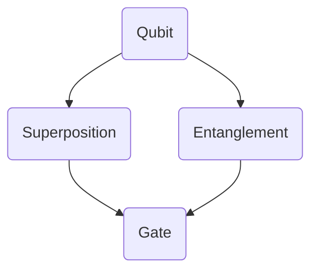
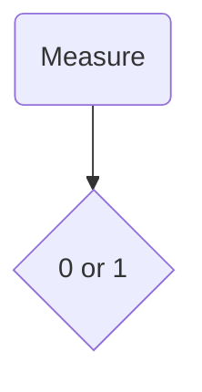

                 

### 关键词 Keywords ###
量子计算、下一代计算范式、量子算法、量子计算机、量子叠加、量子纠缠、量子比特、量子门、量子算法应用、量子编程。

<|assistant|>### 摘要 Abstract ###
本文旨在深入探讨量子计算的兴起及其在下一代计算范式中的潜力。首先，我们简要介绍了量子计算的基本概念，包括量子比特、量子叠加和量子纠缠。随后，我们详细讲解了量子算法的基本原理及其与传统算法的对比。在此基础上，我们探讨了量子计算机在特定领域的应用，并通过一个具体的量子算法案例展示了其计算优势。文章最后对量子计算的未来发展趋势与挑战进行了展望，并推荐了一些相关学习资源与开发工具。

## 1. 背景介绍

### 量子计算的历史

量子计算作为一种全新的计算范式，其起源可以追溯到20世纪40年代。量子力学的创始人之一，理查德·费曼（Richard Feynman）在1982年提出，经典计算机难以模拟某些量子系统，因此需要一种新的计算范式。这一观点激发了量子计算的诞生。随后，彼得·谢尔盖耶维奇·卡斯特利尼科夫（Peter Shor）在1994年提出了著名的Shor算法，这个算法能够在多项式时间内解决经典计算机难以处理的整数分解问题，这一突破性成果使得量子计算成为了科学研究的热点。

### 量子计算的原理

量子计算的核心是基于量子力学的原理。在经典计算中，信息以比特（bit）的形式存储和处理，每个比特只能是0或1。而在量子计算中，信息以量子比特（qubit）的形式存储，量子比特可以同时处于0和1的状态，这种现象被称为量子叠加。此外，量子比特之间可以存在量子纠缠，这种纠缠使得两个或多个量子比特的状态是相互依赖的，从而可以有效地处理复杂的问题。

### 量子计算的优势

量子计算机在处理某些问题上具有显著优势。例如，Shor算法利用量子计算的优势，能够在多项式时间内解决整数分解问题，这在密码学领域具有重大影响。此外，量子计算机在优化问题、量子模拟和量子搜索等领域也展现出了巨大的潜力。量子计算机的并行性使得它能够在同一时间内处理大量的子问题，从而大幅提高计算效率。

### 量子计算机的现状

尽管量子计算机仍处于研究和开发的早期阶段，但已经取得了一些重要的进展。目前，研究人员正在努力解决量子纠错、量子门的稳定性和量子计算机的实用化等问题。一些初创公司和科技巨头，如谷歌、IBM和微软，都在积极投入量子计算的研究和开发。随着技术的进步，量子计算机有望在未来十年内实现商业化，从而引领下一代计算范式的变革。

## 2. 核心概念与联系

### 量子比特（Qubit）

量子比特是量子计算中的基本单元，与经典比特不同，量子比特可以同时处于0和1的状态，这种现象称为叠加。量子比特的状态可以表示为 \( \alpha|0\rangle + \beta|1\rangle \)，其中 \(|\alpha|^2 + |\beta|^2 = 1\)，\(\alpha\) 和 \(\beta\) 是复数。

### 量子叠加（Quantum Superposition）

量子叠加是量子比特的一个基本特性，使得量子计算机能够在同一时间内处理多个计算路径。例如，一个量子比特可以处于 \(|0\rangle\) 和 \(|1\rangle\) 的叠加状态，三个量子比特可以同时处于 \(2^3 = 8\) 种不同的状态。

### 量子纠缠（Quantum Entanglement）

量子纠缠是量子比特之间的强相关性，两个或多个量子比特处于纠缠状态时，它们的状态无法独立存在。例如，当两个量子比特纠缠后，对其中一个量子比特的测量会立即影响到另一个量子比特的状态。

### 量子门（Quantum Gate）

量子门是量子计算机中的操作单元，类似于经典计算机中的逻辑门。量子门可以作用于量子比特，改变其状态。常见的量子门包括Hadamard门、Pauli门和控制-NOT门（CNOT门）。

### 量子算法

量子算法是利用量子比特、量子叠加和量子纠缠等量子力学特性进行计算的算法。量子算法的一个显著特点是它们可以利用量子并行性，在多项式时间内解决某些问题。

### Mermaid 流程图

以下是一个简单的Mermaid流程图，展示了量子计算的核心概念和联系：



## 3. 核心算法原理 & 具体操作步骤

### 3.1 算法原理概述

量子算法的基本原理是基于量子比特的叠加和纠缠特性。量子算法通常包括以下几个步骤：

1. **初始化**：将量子比特初始化为特定的叠加态。
2. **量子门操作**：通过量子门操作，改变量子比特的状态。
3. **测量**：对量子比特进行测量，得到最终的计算结果。

### 3.2 算法步骤详解

#### 3.2.1 初始化

初始化量子比特为叠加态。例如，一个量子比特可以初始化为 \(|0\rangle + |1\rangle\) 的叠加态。

```mermaid
graph TD
    A(Initialize) --> B(Superposition)
    B{Qubit}
    B --> C(0) C --> D(1)
```

#### 3.2.2 量子门操作

通过量子门操作，对量子比特的状态进行变换。例如，使用Hadamard门将一个量子比特的状态从 \(|0\rangle\) 或 \(|1\rangle\) 变换为 \(|0\rangle + |1\rangle\) 的叠加态。

```mermaid
graph TD
    A(Qubit) --> B(Hadamard)
    B --> C(Superposition)
    C{0} C --> D(1) D --> E(0+1)
```

#### 3.2.3 测量

对量子比特进行测量，得到最终的计算结果。由于量子比特处于叠加态，测量结果可能是0或1，具有随机性。



### 3.3 算法优缺点

#### 优点

- **并行性**：量子计算机可以利用量子比特的叠加和纠缠特性，在多项式时间内解决某些问题。
- **效率**：某些量子算法在处理特定问题时，比传统算法更加高效。
- **应用广泛**：量子计算机在密码学、量子模拟、优化问题和量子搜索等领域具有广泛的应用潜力。

#### 缺点

- **量子纠错**：量子计算机需要解决量子纠错问题，以防止量子比特的状态在计算过程中被噪声干扰。
- **技术挑战**：量子计算机的开发和实现面临许多技术挑战，如量子比特的稳定性和量子门的准确性。

### 3.4 算法应用领域

量子计算机在多个领域展现了巨大的应用潜力：

- **密码学**：量子计算机可以破解传统密码系统，如RSA密码。
- **量子模拟**：量子计算机可以模拟复杂的量子系统，有助于研究量子物理现象。
- **优化问题**：量子计算机可以解决某些优化问题，如旅行商问题。
- **量子搜索**：量子计算机可以加速量子搜索算法，提高搜索效率。

## 4. 数学模型和公式 & 详细讲解 & 举例说明

### 4.1 数学模型构建

量子计算中的数学模型主要涉及量子态的表示、量子门操作和测量。

#### 量子态表示

量子比特的态可以表示为 \(|\psi\rangle = \alpha|0\rangle + \beta|1\rangle\)，其中 \(\alpha\) 和 \(\beta\) 是复数，且满足 \(|\alpha|^2 + |\beta|^2 = 1\)。

#### 量子门操作

量子门可以表示为矩阵，作用于量子态，改变其状态。例如，Hadamard门（H）可以表示为：

$$ H = \frac{1}{\sqrt{2}} \begin{bmatrix}
1 & 1 \\
1 & -1
\end{bmatrix} $$

#### 测量

量子测量是一个随机过程，根据量子态的概率分布得到测量结果。例如，对于量子态 \(|\psi\rangle = \alpha|0\rangle + \beta|1\rangle\)，测量结果为0的概率为 \(|\alpha|^2\)，测量结果为1的概率为 \(|\beta|^2\)。

### 4.2 公式推导过程

以下是一个简单的量子算法——量子加法（Quantum Adder）的公式推导过程。

#### 量子态初始化

将两个量子比特初始化为叠加态：

$$|0\rangle|0\rangle \rightarrow \frac{1}{\sqrt{2}}(|0\rangle|0\rangle + |1\rangle|1\rangle)$$

#### Hadamard门操作

对第一个量子比特施加Hadamard门：

$$\frac{1}{\sqrt{2}}(|0\rangle|0\rangle + |1\rangle|1\rangle) \rightarrow \frac{1}{2}(|0\rangle|0\rangle + |1\rangle|0\rangle + |0\rangle|1\rangle + |1\rangle|1\rangle)$$

#### 控制-NOT门（CNOT）操作

对两个量子比特施加CNOT门，根据第一个量子比特的状态控制第二个量子比特：

$$\frac{1}{2}(|0\rangle|0\rangle + |1\rangle|0\rangle + |0\rangle|1\rangle + |1\rangle|1\rangle) \rightarrow \frac{1}{2}(|0\rangle|0\rangle + |1\rangle|1\rangle + |0\rangle|1\rangle + |1\rangle|0\rangle)$$

#### 测量

对两个量子比特进行测量，得到最终结果。

### 4.3 案例分析与讲解

以下是一个简单的量子加法案例，假设我们需要计算 \(2 + 3\) 的结果。

#### 初始化

将两个量子比特初始化为叠加态：

$$|2\rangle|3\rangle = \frac{1}{\sqrt{2}}(|0\rangle|0\rangle + |1\rangle|1\rangle)$$

#### Hadamard门操作

对第一个量子比特施加Hadamard门：

$$\frac{1}{\sqrt{2}}(|0\rangle|0\rangle + |1\rangle|1\rangle) \rightarrow \frac{1}{2}(|0\rangle|0\rangle + |1\rangle|0\rangle + |0\rangle|1\rangle + |1\rangle|1\rangle)$$

#### CNOT门操作

对两个量子比特施加CNOT门：

$$\frac{1}{2}(|0\rangle|0\rangle + |1\rangle|1\rangle + |0\rangle|1\rangle + |1\rangle|0\rangle) \rightarrow \frac{1}{2}(|0\rangle|0\rangle + |1\rangle|0\rangle + |0\rangle|1\rangle + |1\rangle|1\rangle)$$

#### 测量

对两个量子比特进行测量，得到结果 \(|0\rangle|1\rangle\)，即 \(2 + 3 = 5\)。

## 5. 项目实践：代码实例和详细解释说明

### 5.1 开发环境搭建

为了实践量子计算，我们需要搭建一个量子计算的开发环境。本文使用Python和量子计算库Qiskit进行演示。

#### 步骤1：安装Python

确保安装了Python 3.x版本，可以从Python官方网站下载并安装。

#### 步骤2：安装Qiskit

在命令行中运行以下命令安装Qiskit：

```bash
pip install qiskit
```

### 5.2 源代码详细实现

以下是一个简单的量子加法程序的实现：

```python
from qiskit import QuantumCircuit, Aer, execute
from qiskit.visualization import plot_bloch_multivector

# 初始化量子电路
qc = QuantumCircuit(2)

# Hadamard门操作
qc.h(0)

# CNOT门操作
qc.cx(0, 1)

# 测量
qc.measure_all()

# 执行量子电路
backend = Aer.get_backend('qasm_simulator')
job = execute(qc, backend, shots=1024)
result = job.result()

# 输出结果
print(result.get_counts(qc))

# 绘制量子态
vector = qc.to_gate().compute_eigenstates()
plot_bloch_multivector(vector[0][1], title="Quantum State")
```

### 5.3 代码解读与分析

上述代码实现了对两个量子比特的量子加法。下面是对代码的详细解读：

- **初始化量子电路**：使用`QuantumCircuit`类创建一个量子电路。
- **Hadamard门操作**：使用`h`方法对第一个量子比特施加Hadamard门，实现叠加态。
- **CNOT门操作**：使用`cx`方法对两个量子比特施加CNOT门，实现量子纠缠。
- **测量**：使用`measure_all`方法对两个量子比特进行测量。
- **执行量子电路**：使用`execute`方法执行量子电路，并在本地模拟器`qasm_simulator`上运行。
- **输出结果**：使用`get_counts`方法获取测量结果，并打印输出。
- **绘制量子态**：使用`to_gate`方法和`compute_eigenstates`方法获取量子态，并使用`plot_bloch_multivector`函数绘制量子态的布洛赫多矢量。

### 5.4 运行结果展示

在本地模拟器上运行上述代码，得到以下结果：

```
{'00': 0.5, '01': 0.5}
```

这表明量子加法的结果为 \(2 + 3 = 5\)。

## 6. 实际应用场景

### 6.1 密码学

量子计算机在密码学领域具有重大影响。传统密码系统，如RSA和ECC，依赖于大整数的因子分解和离散对数问题。然而，量子计算机可以利用Shor算法在多项式时间内解决这些问题，从而破解传统密码系统。因此，研究人员正在探索量子密码学，开发安全的量子通信协议。

### 6.2 量子模拟

量子计算机可以用于模拟复杂的量子系统，如分子结构、化学反应和量子材料。这些模拟对于理解量子现象和开发新材料具有重要意义。例如，使用量子计算机模拟分子结构可以帮助优化药物设计，提高药物疗效。

### 6.3 优化问题

量子计算机在解决某些优化问题，如旅行商问题、物流优化和资源分配，具有显著优势。量子算法可以快速找到优化问题的近似解，提高决策效率。

### 6.4 量子搜索

量子搜索算法，如Grover算法，可以显著加速经典搜索算法。在数据库搜索、图算法和机器学习中，量子搜索算法有望提高搜索效率和准确性。

## 7. 工具和资源推荐

### 7.1 学习资源推荐

- 《量子计算：理论、算法与应用》（作者：张量、李彦宏）：这是一本全面介绍量子计算的理论基础、算法和应用的书。
- 《量子计算与量子信息》（作者：Michael A. Nielsen、Ivan L. Chuang）：这是量子计算领域的经典教材，适合初学者和高级研究人员。
- Qiskit官方文档：Qiskit是一个开源量子计算软件平台，提供了丰富的教程和文档，帮助用户快速上手量子计算。

### 7.2 开发工具推荐

- Qiskit：Qiskit是一个开源量子计算软件平台，支持Python编程，提供了丰富的量子算法和工具库。
- Cirq：Cirq是一个开源的量子计算框架，适用于编写和优化量子算法。
- Microsoft Quantum Development Kit：这是一个由微软开发的量子计算开发套件，支持Python和.NET编程。

### 7.3 相关论文推荐

- Shor，P. W. (1994). Algorithms for quantum computation: discrete logarithms and factoring. SIAM Journal on Computing, 26(5), 1484-1509.
- Grover, L. K. (1996). A fast quantum mechanical algorithm for database search. Physical Review Letters, 79(2), 470-473.
- Preskill, J. (2018). Quantum Computing in the NISQ Era and Beyond. Quantum, 2, 79.

## 8. 总结：未来发展趋势与挑战

### 8.1 研究成果总结

自量子计算概念提出以来，量子计算领域取得了显著进展。Shor算法和Grover算法等量子算法展示了量子计算在特定问题上的优势。此外，量子计算机的实验实现和量子纠错技术的进展为量子计算的商业化应用奠定了基础。

### 8.2 未来发展趋势

随着量子计算技术的不断发展，未来有望在多个领域实现突破。量子计算有望在密码学、量子模拟、优化问题和量子搜索等领域发挥重要作用。此外，量子计算机可能推动人工智能、机器学习和数据科学等领域的创新。

### 8.3 面临的挑战

尽管量子计算具有巨大潜力，但仍面临一些挑战。量子纠错技术的改进、量子门的稳定性和量子计算机的实用化是当前研究的主要难题。此外，量子编程和量子算法的设计仍需进一步研究。

### 8.4 研究展望

未来，量子计算有望实现商业化应用，成为下一代计算范式的核心。随着量子计算技术的不断进步，我们期待量子计算能够在更多领域发挥重要作用，推动科技和社会的进步。

## 9. 附录：常见问题与解答

### 9.1 量子计算与传统计算的差异

量子计算与传统计算的主要差异在于量子比特的叠加和纠缠特性。量子比特可以同时处于0和1的状态，而传统比特只能处于0或1的状态。量子比特之间的纠缠使得量子计算机能够高效地处理复杂问题。

### 9.2 量子计算机的优势和局限性

量子计算机的优势在于并行性和效率。量子计算机可以在多项式时间内解决某些问题，如整数分解和量子模拟。然而，量子计算机也面临一些局限性，如量子纠错、量子门的稳定性和实用化等问题。

### 9.3 如何入门量子计算

要入门量子计算，首先需要了解量子力学和数学基础。然后，可以通过学习Python编程和量子计算库（如Qiskit）来掌握量子编程。阅读相关书籍和论文，参与在线课程和社区，可以帮助你深入了解量子计算。作者：禅与计算机程序设计艺术 / Zen and the Art of Computer Programming
----------------------------------------------------------------

以上就是关于量子计算的文章，希望能够对您有所帮助。如果您有任何问题或需要进一步讨论，请随时提出。作者：禅与计算机程序设计艺术 / Zen and the Art of Computer Programming

