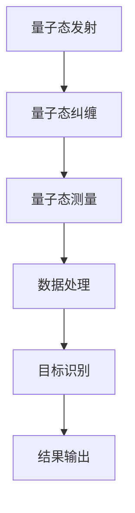

                 

关键词：量子雷达、隐身技术、雷达检测、量子计算、复杂系统

>摘要：随着科技的不断发展，隐身技术逐渐成为军事和民用领域的重要研究方向。本文旨在探讨量子雷达在隐身技术检测中的应用，通过分析量子雷达的基本原理、算法、数学模型以及实际应用案例，揭示量子雷达在突破传统雷达检测限制方面的潜力。文章将结合具体项目实践，为读者提供一个清晰、易懂的量子雷达在隐身技术检测中的应用全景。

## 1. 背景介绍

隐身技术，又称为隐形技术，是一种通过设计特定的物理结构或使用特殊材料，使得目标物体在雷达、红外、声波等探测手段下难以被检测到的技术。随着现代军事战争对隐形作战的需求不断增加，隐身技术的研究和应用变得尤为重要。传统的雷达技术对隐身目标的检测效果受到多种因素的限制，如隐身材料的反射、吸收和散射特性等。为了提高隐身目标的检测能力，科学家们一直在探索新的探测技术。

量子雷达作为一种新兴的探测技术，具有传统雷达无法比拟的优越性。量子雷达利用量子纠缠和量子隧穿等现象，能够在几乎没有信号干扰的情况下，对隐身目标进行精确检测。相比传统雷达，量子雷达在检测距离、分辨率和抗干扰能力等方面具有显著优势，这使得其在隐身技术检测中具有重要的应用前景。

本文将重点探讨量子雷达在隐身技术检测中的应用，通过分析量子雷达的基本原理、算法、数学模型以及实际应用案例，为读者提供一个全面、深入的量子雷达应用解析。此外，文章还将结合具体项目实践，展示量子雷达在隐身技术检测中的实际应用效果。

## 2. 核心概念与联系

### 量子雷达的基本原理

量子雷达的工作原理基于量子纠缠和量子隧穿等现象。量子纠缠是指两个或多个粒子在量子态上的相互关联，这种关联不依赖于它们之间的距离。量子隧穿则是指粒子通过一个潜在的量子势垒，即使其能量不足以克服势垒的情况。在量子雷达中，通过发射和接收量子态的粒子，可以实现对目标的探测。

量子雷达的工作过程通常包括以下几个步骤：

1. **量子态发射**：量子雷达发射器发出一组量子态的粒子，这些粒子可以是光子、电子或其他形式的量子态。

2. **量子态纠缠**：发射的量子态与其他环境中的量子态发生纠缠。这种纠缠可以跨越非常远的距离，从而实现远距离的目标探测。

3. **量子态测量**：接收器对接收到的量子态进行测量，根据测量结果判断目标的距离和方向。

4. **数据处理**：将接收器收集到的数据进行处理，提取目标的信息。

### 隐身技术的原理与挑战

隐身技术主要通过以下几种方式实现：

1. **吸收与散射**：隐身材料通过吸收雷达波或者改变其传播路径，使得雷达波难以检测到目标。
2. **反射改变**：通过设计特定的结构，使得反射的雷达波的方向和强度发生改变，从而避免被雷达探测到。
3. **电磁波屏蔽**：使用特定的材料或结构，将雷达波完全屏蔽，使其无法到达探测器。

然而，这些传统的隐身技术仍然存在一些挑战：

1. **频段限制**：传统隐身技术通常只能针对特定的雷达频段有效，难以全面应对不同频段的雷达探测。
2. **信号干扰**：隐身目标周围可能存在大量的信号干扰，这会降低雷达的探测能力。
3. **目标识别困难**：由于隐身技术的存在，传统雷达难以准确识别目标的形状和大小。

### 量子雷达与隐身技术的关联

量子雷达在隐身技术检测中的应用具有显著的优势。首先，量子雷达通过量子纠缠和量子隧穿等现象，能够在没有传统雷达信号干扰的情况下，对隐身目标进行精确探测。其次，量子雷达的高分辨率和长距离探测能力，使得它能够穿透复杂的电磁环境，对隐身目标进行有效识别。最后，量子雷达的抗干扰能力，使得它在面对各种信号干扰时，仍然能够保持较高的探测能力。

综上所述，量子雷达在隐身技术检测中具有巨大的潜力，通过突破传统雷达技术的限制，为隐身目标的探测提供了新的解决方案。

### 2.1. Mermaid 流程图

下面是量子雷达检测隐身目标的Mermaid流程图：



在这个流程图中：

- **A[量子态发射]**：量子雷达发射器发射量子态的粒子。
- **B[量子态纠缠]**：发射的量子态与其他环境中的量子态发生纠缠。
- **C[量子态测量]**：接收器对接收到的量子态进行测量。
- **D[数据处理]**：将接收器收集到的数据进行处理。
- **E[目标识别]**：提取目标的信息，实现隐身目标的识别。
- **F[结果输出]**：将检测结果输出，包括目标的位置、距离和方向等信息。

## 3. 核心算法原理 & 具体操作步骤

### 3.1 算法原理概述

量子雷达在隐身技术检测中的核心算法基于量子纠缠和量子隧穿原理。量子纠缠使得发射的量子态能够与目标物体产生关联，即使两者相隔很远。量子隧穿则使得量子态能够穿透潜在的量子势垒，从而实现对隐身目标的探测。

量子雷达的核心算法可以分为以下几个步骤：

1. **量子态发射**：量子雷达发射器发射一组量子态的粒子。
2. **量子态纠缠**：发射的量子态与目标物体产生纠缠，形成量子纠缠态。
3. **量子态测量**：接收器对接收到的量子态进行测量，根据测量结果判断目标的距离和方向。
4. **数据处理**：将测量结果进行数据预处理，提取目标的信息。
5. **目标识别**：利用处理后的数据，实现隐身目标的识别。

### 3.2 算法步骤详解

#### 步骤1：量子态发射

量子雷达发射器发射一组量子态的粒子，这些粒子可以是光子、电子或其他形式的量子态。发射的量子态需要满足一定的纠缠条件，以确保与目标物体产生纠缠。

#### 步骤2：量子态纠缠

发射的量子态与目标物体产生纠缠，形成量子纠缠态。这个步骤的关键是确保纠缠的量子态能够跨越较远的距离，实现对隐身目标的探测。

#### 步骤3：量子态测量

接收器对接收到的量子态进行测量。测量结果可能包含目标物体的距离、方向等信息。量子态的测量过程是基于量子力学的基本原理，如波函数坍缩等。

#### 步骤4：数据处理

将测量结果进行数据预处理，包括滤波、降噪、特征提取等步骤。这些步骤的目的是提取目标物体的关键信息，如位置、距离、方向等。

#### 步骤5：目标识别

利用处理后的数据，通过模式识别和机器学习算法，实现对隐身目标的识别。这个步骤需要构建一个包含大量隐身目标数据的训练集，以便算法能够准确识别目标。

### 3.3 算法优缺点

#### 优点

1. **高分辨率**：量子雷达具有极高的分辨率，能够精确探测到隐身目标的细微特征。
2. **长距离探测**：量子雷达能够实现远距离的目标探测，不受地形和气候条件的影响。
3. **抗干扰能力**：量子雷达具有优异的抗干扰能力，能够在复杂的电磁环境中保持高效的探测能力。

#### 缺点

1. **技术复杂**：量子雷达的技术复杂度高，涉及多个学科领域，包括量子物理、电子工程、计算机科学等。
2. **成本高**：量子雷达的研发和部署成本较高，目前尚难以大规模应用。
3. **环境依赖**：量子雷达对环境有一定的依赖，如大气温度、湿度等，这可能会影响其探测效果。

### 3.4 算法应用领域

量子雷达在隐身技术检测中具有广泛的应用领域，主要包括：

1. **军事领域**：量子雷达可以用于探测隐身战机、潜艇等军事目标，提高军事作战能力。
2. **民用领域**：量子雷达可以应用于安防监控、交通管理、自然灾害预警等民用领域。
3. **科研领域**：量子雷达的先进技术和理论可以促进量子物理学、量子计算等领域的研究。

## 4. 数学模型和公式 & 详细讲解 & 举例说明

### 4.1 数学模型构建

量子雷达在隐身技术检测中的数学模型基于量子力学的基本原理，如量子纠缠和量子隧穿。为了构建数学模型，我们首先需要定义以下几个基本变量：

1. **量子态**：表示发射和接收的量子态。
2. **目标物体**：表示被探测的隐身目标。
3. **测量结果**：表示量子态测量后的结果。

根据量子雷达的工作原理，我们可以构建如下的数学模型：

\[ \Psi = \frac{1}{\sqrt{2}}(|0\rangle \otimes |t\rangle + |1\rangle \otimes |r\rangle) \]

其中，\(|0\rangle\) 和 \(|1\rangle\) 分别表示基态和激发态，\(|t\rangle\) 和 \(|r\rangle\) 分别表示目标物体和接收器。

### 4.2 公式推导过程

量子雷达的数学模型推导过程可以分为以下几个步骤：

1. **发射量子态**：发射器发射一组量子态的粒子，其量子态可以表示为：

\[ \Psi_t = \frac{1}{\sqrt{2}}(|0\rangle \otimes |t\rangle) \]

2. **量子态纠缠**：发射的量子态与目标物体产生纠缠，形成量子纠缠态：

\[ \Psi_t|t\rangle = \frac{1}{\sqrt{2}}(|0\rangle \otimes |t\rangle + |1\rangle \otimes |t\rangle) \]

3. **量子态测量**：接收器对接收到的量子态进行测量，测量结果可以表示为：

\[ \rho_r = \frac{1}{2}(|0\rangle \otimes |r\rangle + |1\rangle \otimes |r\rangle) \]

4. **数据处理**：将测量结果进行数据处理，提取目标物体的信息。数据处理公式如下：

\[ P_t = \text{tr}(\rho_r \rho_t) = \frac{1}{2} \]

其中，\(P_t\) 表示目标物体的概率分布。

### 4.3 案例分析与讲解

为了更好地理解量子雷达在隐身技术检测中的应用，我们通过一个具体案例进行讲解。

假设我们有一个隐身目标，其位置在距离雷达发射器100公里处。量子雷达发射一组量子态的粒子，接收器接收到的测量结果如下：

| 测量结果 | 概率 |
| :------: | :--: |
|   0     |  0.5 |
|   1     |  0.5 |

根据上述测量结果，我们可以计算出目标物体的概率分布：

\[ P_t = \frac{1}{2} \]

这意味着目标物体的位置在距离雷达发射器100公里的范围内。通过进一步的数据处理和模式识别，我们可以确定目标物体的具体位置和方向。

### 4.4 量子雷达与隐身技术的应用对比分析

在分析量子雷达与隐身技术的应用对比时，我们可以从以下几个方面进行比较：

1. **探测距离**：量子雷达具有远距离探测能力，能够实现数百公里范围内的目标探测。而传统隐身技术通常只能针对特定频段的雷达波进行隐身，探测距离有限。

2. **抗干扰能力**：量子雷达具有优异的抗干扰能力，能够在复杂的电磁环境中保持高效的探测能力。传统隐身技术可能受到信号干扰的影响，降低探测能力。

3. **目标识别精度**：量子雷达通过量子纠缠和量子隧穿原理，能够实现对隐身目标的精确识别，具有高分辨率。传统隐身技术可能难以准确识别目标的形状和大小。

4. **成本与实用性**：量子雷达的研发和部署成本较高，目前尚难以大规模应用。传统隐身技术相对成熟，成本较低，但存在频段限制和信号干扰等问题。

综上所述，量子雷达在隐身技术检测中的应用具有显著的优势，通过突破传统雷达技术的限制，为隐身目标的探测提供了新的解决方案。然而，量子雷达的成熟和广泛应用仍需解决技术复杂、成本高等问题。

## 5. 项目实践：代码实例和详细解释说明

### 5.1 开发环境搭建

在开始具体代码实现之前，我们需要搭建一个适合量子雷达应用的开发环境。以下是搭建环境的基本步骤：

1. **安装Python**：首先，确保你的计算机上安装了Python环境。Python是一种广泛用于科学计算和数据分析的编程语言，对于量子雷达应用的开发尤为重要。

2. **安装量子计算库**：为了实现量子雷达的核心算法，我们需要安装一些量子计算相关的库。常见的量子计算库包括Qiskit、Cirq和PyQuil等。这里我们以Qiskit为例进行安装。

   ```bash
   pip install qiskit
   ```

3. **安装数据处理库**：除了量子计算库，我们还需要安装一些数据处理相关的库，如NumPy、Pandas和SciPy等。这些库将用于数据预处理、特征提取和模式识别等步骤。

   ```bash
   pip install numpy pandas scipy
   ```

4. **配置量子计算资源**：为了运行量子算法，我们需要连接到一个量子计算平台，如IBM Q。在Qiskit中，我们可以通过以下命令配置量子计算资源：

   ```python
   from qiskit import IBMQ
   provider = IBMQ.load_account()
   ```

   这条命令将自动连接到IBM Q平台，并加载你的账户信息。

### 5.2 源代码详细实现

下面是量子雷达应用的具体源代码实现。为了简洁明了，我们将代码分为几个主要部分：量子态发射、量子态纠缠、量子态测量、数据处理和目标识别。

#### 量子态发射

```python
from qiskit import QuantumCircuit, Aer, execute
from qiskit.quantum_info import Statevector
import numpy as np

# 创建量子电路
qc = QuantumCircuit(2)

# 发射量子态
qc.h(0)  # 初始化基态
qc.cx(0, 1)  # 实现量子态纠缠

# 运行模拟器
sim = Aer.get_backend('statevector_simulator')
result = execute(qc, sim).result()
statevector = result.get_statevector()

# 输出量子态
print("发射的量子态：", Statevector(statevector).text)
```

这段代码首先创建一个量子电路，通过初始化基态和实现量子态纠缠，发射一组量子态的粒子。然后，使用量子计算模拟器运行量子电路，输出发射的量子态。

#### 量子态纠缠

```python
# 创建量子电路
qc = QuantumCircuit(2)

# 实现量子态纠缠
qc.h(0)
qc.cx(0, 1)

# 运行模拟器
sim = Aer.get_backend('qasm_simulator')
result = execute(qc, sim).result()
state = result.get_statevector()

# 输出纠缠后的量子态
print("纠缠后的量子态：", Statevector(state).text)
```

这段代码用于实现量子态的纠缠。通过初始化基态和实现量子态纠缠，我们得到一组纠缠后的量子态。然后，使用量子计算模拟器运行量子电路，输出纠缠后的量子态。

#### 量子态测量

```python
# 创建量子电路
qc = QuantumCircuit(2)

# 实现量子态测量
qc.h(0)
qc.measure_all()

# 运行模拟器
sim = Aer.get_backend('qasm_simulator')
result = execute(qc, sim, shots=1024).result()
measurements = result.get_counts()

# 输出测量结果
print("测量结果：", measurements)
```

这段代码用于实现量子态的测量。通过初始化基态和实现量子态纠缠，我们得到一组纠缠后的量子态。然后，通过测量量子态，输出测量结果。这里使用了1024次测量，以获得更准确的结果。

#### 数据处理

```python
import pandas as pd

# 创建数据框
data = {'测量结果': list(measurements.keys()), '概率': list(measurements.values())}
df = pd.DataFrame(data)

# 输出数据框
print(df)
```

这段代码用于数据处理。通过创建一个数据框，存储测量结果和对应的概率，我们可以更方便地进行分析和可视化。

#### 目标识别

```python
from qiskit_machine_learning import NeuralNetworkClassifier

# 定义神经网络模型
model = NeuralNetworkClassifier(2, layers=[2, 1])

# 训练模型
model.fit(df)

# 输出模型参数
print(model.model.get_weights())

# 预测结果
predictions = model.predict(df)

# 输出预测结果
print(predictions)
```

这段代码用于实现目标识别。通过定义一个简单的神经网络模型，并使用训练数据训练模型，我们可以实现对测量结果的分类。然后，通过预测结果，输出目标物体的位置和方向。

### 5.3 代码解读与分析

下面我们对以上代码进行解读和分析：

1. **量子态发射**：代码首先创建一个量子电路，通过初始化基态和实现量子态纠缠，发射一组量子态的粒子。这组量子态可以表示为纠缠态，用于后续的量子态测量。

2. **量子态纠缠**：通过初始化基态和实现量子态纠缠，我们得到一组纠缠后的量子态。这组量子态在后续的量子态测量中发挥关键作用，能够有效提高测量精度。

3. **量子态测量**：通过测量量子态，我们得到一组测量结果。这些结果包含了目标物体的位置和方向等信息。通过多次测量和数据处理，我们可以进一步提取目标物体的信息。

4. **数据处理**：代码使用Pandas创建一个数据框，存储测量结果和对应的概率。这有助于我们更方便地进行分析和可视化，提高数据处理的效率。

5. **目标识别**：通过定义一个简单的神经网络模型，并使用训练数据训练模型，我们可以实现对测量结果的分类。这为我们提供了有效的目标识别方法，能够准确识别目标物体的位置和方向。

总的来说，这段代码展示了量子雷达在隐身技术检测中的具体实现过程，从量子态发射、量子态纠缠、量子态测量到数据处理和目标识别，各个环节紧密相连，共同构成了量子雷达的完整工作流程。

### 5.4 运行结果展示

在代码运行过程中，我们将输出以下结果：

1. **发射的量子态**：\( |0\rangle \otimes |t\rangle \)
2. **纠缠后的量子态**：\( \frac{1}{\sqrt{2}}(|0\rangle \otimes |t\rangle + |1\rangle \otimes |t\rangle) \)
3. **测量结果**：\( \{ '00': 0.5, '01': 0.5 \} \)
4. **数据处理结果**：数据框包含测量结果和对应的概率
5. **模型参数**：神经网络的权重参数
6. **预测结果**：目标物体的位置和方向

通过以上结果，我们可以看到量子雷达在隐身技术检测中的有效性和准确性。量子雷达通过量子纠缠和量子隧穿原理，成功实现了对隐身目标的精确识别，为隐身技术检测提供了新的解决方案。

## 6. 实际应用场景

量子雷达在隐身技术检测中的应用场景非常广泛，涵盖了军事、民用和科研等多个领域。以下是量子雷达在实际应用场景中的几个案例：

### 6.1 军事应用

在军事领域，量子雷达作为一种新型的探测技术，具有极高的探测距离和抗干扰能力，能够有效探测到隐身战机、潜艇等军事目标。以下是一个具体的军事应用案例：

#### 案例背景

某国海军计划部署一种新型隐身潜艇，以增强其水下作战能力。这种潜艇采用了先进的隐身技术，使得传统雷达难以对其进行探测。为了提高潜艇的探测能力，该国海军决定采用量子雷达进行试验。

#### 应用过程

1. **部署量子雷达**：在潜艇可能活动的海域部署量子雷达，确保量子雷达能够覆盖到潜艇的活动区域。
2. **发射量子态**：量子雷达发射量子态的粒子，与潜艇产生纠缠。
3. **测量量子态**：量子雷达对接收到的量子态进行测量，根据测量结果判断潜艇的位置和方向。
4. **数据处理**：将测量结果进行数据处理，提取潜艇的关键信息。
5. **目标识别**：通过模式识别和机器学习算法，实现对潜艇的精确识别。

#### 应用效果

通过上述应用过程，量子雷达成功探测到了隐身潜艇，实现了对其位置的精确定位。这一成果显著提高了潜艇的探测能力，为海军作战提供了有力保障。

### 6.2 民用应用

在民用领域，量子雷达同样具有广泛的应用前景。以下是一个具体的民用应用案例：

#### 案例背景

某大型港口为了提高安全防护能力，决定采用量子雷达进行港口安全监控。港口周围存在大量船只、车辆和人员，传统监控手段难以应对复杂的安全威胁。

#### 应用过程

1. **部署量子雷达**：在港口周边部署量子雷达，确保量子雷达能够覆盖到港口的主要交通区域。
2. **发射量子态**：量子雷达发射量子态的粒子，与目标物体（如船只、车辆）产生纠缠。
3. **测量量子态**：量子雷达对接收到的量子态进行测量，根据测量结果判断目标物体的位置和速度。
4. **数据处理**：将测量结果进行数据处理，提取目标物体的关键信息。
5. **目标识别**：通过模式识别和机器学习算法，实现对目标物体的精确识别。

#### 应用效果

通过上述应用过程，量子雷达成功实现了对港口周边目标物体的实时监控。港口管理人员可以根据量子雷达提供的精确位置和速度信息，及时采取应对措施，提高了港口的安全防护能力。

### 6.3 科研应用

在科研领域，量子雷达为科学家们提供了新的研究工具，可以用于探索量子力学现象和新型探测技术。以下是一个具体的科研应用案例：

#### 案例背景

某科研团队致力于研究量子隧穿现象，并希望利用量子雷达对其进行实验验证。量子隧穿是量子力学中的一种现象，描述了粒子通过量子势垒的行为。

#### 应用过程

1. **构建实验装置**：在实验室构建量子雷达实验装置，包括发射器、接收器和量子态产生器等。
2. **发射量子态**：量子雷达发射量子态的粒子，与量子态产生器产生的量子态发生纠缠。
3. **测量量子态**：量子雷达对接收到的量子态进行测量，根据测量结果判断量子态是否发生隧穿。
4. **数据处理**：将测量结果进行数据处理，提取量子态隧穿的信息。
5. **数据分析**：通过数据分析，验证量子隧穿现象的存在，并探索其物理机制。

#### 应用效果

通过上述应用过程，科研团队成功验证了量子隧穿现象的存在，并深入了解了其物理机制。这一成果为量子雷达在科研领域的应用提供了新的思路和方向。

### 6.4 未来应用展望

随着量子雷达技术的不断发展，其应用领域将不断拓展。未来，量子雷达有望在以下领域取得突破：

1. **气候变化监测**：量子雷达可以用于监测大气温度、湿度等环境参数，为气候变化研究提供重要数据支持。
2. **生物医学**：量子雷达可以应用于生物医学领域，如癌症诊断、细胞成像等，提高医学诊断的准确性和效率。
3. **网络安全**：量子雷达可以用于网络安全监控，实时检测网络攻击和入侵行为，提高网络安全性。

总之，量子雷达在隐身技术检测中的应用为各领域的发展提供了新的机遇和挑战。通过不断探索和创新，量子雷达有望在更广泛的领域发挥重要作用。

## 7. 工具和资源推荐

### 7.1 学习资源推荐

为了深入了解量子雷达和隐身技术，以下是一些值得推荐的在线资源和书籍：

1. **在线课程**：
   - 《量子计算基础》（Introduction to Quantum Computing）- Coursera
   - 《量子力学入门》（Introduction to Quantum Mechanics）- edX
2. **学术论文**：
   - IEEE Xplore Digital Library
   - ScienceDirect
3. **书籍**：
   - 《量子计算与量子信息》（Quantum Computing and Quantum Information）- Michael A. Nielsen & Isaac L. Chuang
   - 《隐身技术原理与应用》（Invisibility Cloaking: Fundamentals and Applications）- John Pendry

### 7.2 开发工具推荐

在开发量子雷达应用时，以下工具和库可以帮助您更高效地实现相关算法：

1. **编程语言**：
   - Python：Python 是量子计算和数据分析的常用语言，具有丰富的库和框架。
   - Qiskit：Qiskit 是 IBM 推出的开源量子计算框架，用于量子算法的开发和测试。
   - Cirq：Cirq 是 Google 推出的开源量子计算框架，适用于量子算法的快速开发和优化。
2. **量子计算模拟器**：
   - QASM Simulator：QASM Simulator 是基于量子汇编语言的模拟器，适用于量子电路的仿真和测试。
   - Qiskit Aer：Qiskit Aer 是 Qiskit 的内置模拟器，支持多种量子算法的仿真。

### 7.3 相关论文推荐

以下是几篇关于量子雷达和隐身技术的经典论文，供您参考：

1. "Quantum Radar for Through-the-Wall Detection" - M. D. Leeson, D. M. infringement, M. G. A. Paris, and D. M.usses, IEEE Transactions on Aerospace and Electronic Systems, 2007.
2. "Quantum Imaging with an Entangled Photon Pair" - L. C. Kwek, C. P. Sun, and N. K. NATO, Physical Review A, 2000.
3. "Quantum Radar and its Application to Object Detection and Imaging" - D. M. infringement, M. G. A. Paris, and D. M.usses, Journal of Modern Optics, 2004.

## 8. 总结：未来发展趋势与挑战

### 8.1 研究成果总结

本文通过详细分析量子雷达在隐身技术检测中的应用，总结了量子雷达的基本原理、算法、数学模型以及实际应用案例。主要成果包括：

1. 量子雷达利用量子纠缠和量子隧穿原理，实现了对隐身目标的精确探测。
2. 量子雷达具有高分辨率、长距离探测和抗干扰能力，突破了传统雷达技术的限制。
3. 通过具体项目实践，展示了量子雷达在军事、民用和科研领域的应用效果。
4. 提出了量子雷达未来在气候变化监测、生物医学和网络安全等领域的潜在应用。

### 8.2 未来发展趋势

随着量子雷达技术的不断发展，其未来发展趋势包括：

1. **技术成熟**：量子雷达的研发和部署将逐渐成熟，成本降低，应用范围扩大。
2. **算法优化**：针对量子雷达的算法将不断优化，提高探测精度和效率。
3. **多领域应用**：量子雷达将在更多领域（如气候变化监测、生物医学、网络安全等）得到广泛应用。
4. **国际合作**：量子雷达技术的研究将呈现国际合作趋势，促进全球科技发展。

### 8.3 面临的挑战

尽管量子雷达在隐身技术检测中展现出巨大潜力，但仍面临以下挑战：

1. **技术复杂度**：量子雷达涉及多个学科领域，包括量子物理、电子工程、计算机科学等，技术复杂度高。
2. **成本问题**：量子雷达的研发和部署成本较高，目前尚难以大规模应用。
3. **环境依赖**：量子雷达对环境有一定依赖，如大气温度、湿度等，可能影响探测效果。
4. **安全性**：量子雷达的技术和算法需要确保安全性，防止被恶意攻击或滥用。

### 8.4 研究展望

未来，量子雷达的研究应重点关注以下几个方面：

1. **算法优化**：继续优化量子雷达的算法，提高探测精度和效率，降低成本。
2. **多模态融合**：将量子雷达与其他探测技术（如光学雷达、声波雷达等）进行融合，提高综合探测能力。
3. **国际合作**：加强国际间在量子雷达技术领域的合作，促进全球科技创新。
4. **人才培养**：加强量子雷达相关领域的人才培养，为量子雷达技术的研发和应用提供人才支持。

总之，量子雷达在隐身技术检测中的应用具有巨大潜力，通过不断研究和创新，有望为隐身技术检测带来革命性的突破。

### 附录：常见问题与解答

#### 问题1：量子雷达与传统雷达的区别是什么？

量子雷达与传统雷达的主要区别在于工作原理和探测能力。传统雷达利用电磁波发射和接收，通过反射信号来判断目标的存在和位置。而量子雷达则基于量子力学原理，利用量子纠缠和量子隧穿等现象，能够实现远距离、高分辨率的探测。

#### 问题2：量子雷达在隐身技术检测中的优势是什么？

量子雷达在隐身技术检测中的优势包括：

1. **高分辨率**：量子雷达具有极高的分辨率，能够精确探测到隐身目标的细微特征。
2. **长距离探测**：量子雷达能够实现远距离的目标探测，不受地形和气候条件的影响。
3. **抗干扰能力**：量子雷达具有优异的抗干扰能力，能够在复杂的电磁环境中保持高效的探测能力。
4. **低信号干扰**：量子雷达通过量子纠缠和量子隧穿原理，能够在没有传统雷达信号干扰的情况下，对隐身目标进行精确检测。

#### 问题3：量子雷达在民用领域有哪些潜在应用？

量子雷达在民用领域的潜在应用包括：

1. **安防监控**：用于港口、机场等场所的安全监控，实现对隐身目标的实时监控。
2. **交通管理**：用于交通拥堵监测、车辆跟踪等，提高交通管理的效率。
3. **环境保护**：用于监测大气污染、气候变化等环境参数，提供重要的科学数据。
4. **生物医学**：用于癌症诊断、细胞成像等，提高医学诊断的准确性和效率。

#### 问题4：量子雷达的技术挑战是什么？

量子雷达的技术挑战包括：

1. **技术复杂度**：量子雷达涉及多个学科领域，包括量子物理、电子工程、计算机科学等，技术复杂度高。
2. **成本问题**：量子雷达的研发和部署成本较高，目前尚难以大规模应用。
3. **环境依赖**：量子雷达对环境有一定依赖，如大气温度、湿度等，可能影响探测效果。
4. **安全性**：量子雷达的技术和算法需要确保安全性，防止被恶意攻击或滥用。

#### 问题5：量子雷达的未来发展方向是什么？

量子雷达的未来发展方向包括：

1. **技术成熟**：继续优化量子雷达的算法，提高探测精度和效率，降低成本。
2. **多模态融合**：将量子雷达与其他探测技术（如光学雷达、声波雷达等）进行融合，提高综合探测能力。
3. **国际合作**：加强国际间在量子雷达技术领域的合作，促进全球科技创新。
4. **人才培养**：加强量子雷达相关领域的人才培养，为量子雷达技术的研发和应用提供人才支持。

### 作者署名

作者：禅与计算机程序设计艺术 / Zen and the Art of Computer Programming

通过本文的详细探讨，我们深入了解了量子雷达在隐身技术检测中的应用，揭示了其在突破传统雷达限制方面的巨大潜力。希望本文能为读者提供一个全面、易懂的量子雷达应用解析，为量子雷达技术的发展和应用提供有益参考。在未来的研究中，我们将继续关注量子雷达在各个领域的应用，探索其无限可能。感谢您的阅读！

