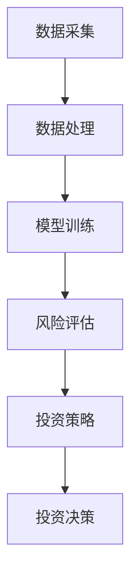

                 

关键词：金融技术、大型语言模型、投资策略、风险控制、数据挖掘

> 摘要：本文旨在探讨大型语言模型（LLM）在金融领域的广泛应用，包括风险评估、投资策略制定和个性化投资建议。通过深入剖析LLM的核心算法、数学模型和实际应用案例，本文展示了LLM在金融科技中的巨大潜力，并对其未来发展趋势和挑战进行了展望。

## 1. 背景介绍

随着人工智能技术的飞速发展，特别是大型语言模型（LLM）的崛起，金融领域正经历着一场前所未有的变革。传统金融分析方法和工具在处理大规模、复杂和动态的金融市场数据时显得力不从心。而LLM凭借其强大的自然语言处理能力，能够快速理解并处理这些数据，从而为金融机构提供更加精确和高效的风险评估、投资策略和个性化投资建议。

### 金融领域的挑战

- **数据复杂性**：金融市场数据量大、维度高，包含大量的非结构化和半结构化数据，如新闻、报告、社交媒体等，传统工具难以有效处理。
- **风险控制需求**：金融市场的波动性大，风险控制是金融机构的核心需求，需要实时、准确的风险评估模型。
- **投资决策效率**：投资决策需要综合考虑多种因素，涉及大量计算和分析，传统方法难以实现快速响应。
- **个性化服务**：投资者需求多样化，提供个性化的投资建议和服务是提升客户满意度的关键。

### LLM的优势

- **自然语言处理能力**：LLM能够理解和生成自然语言，能够高效处理文本数据。
- **深度学习技术**：基于深度神经网络，LLM具有强大的建模能力和泛化能力。
- **自适应学习**：LLM能够根据新数据进行自适应学习，不断优化模型性能。
- **跨领域应用**：LLM可以应用于金融领域的多个子领域，如股票分析、债券评级、市场预测等。

## 2. 核心概念与联系

### 大型语言模型（LLM）

大型语言模型（LLM）是一种基于深度学习的自然语言处理模型，它通过大规模语料库的训练，能够理解和生成自然语言。LLM的核心是深度神经网络，通常包括多层感知器、循环神经网络（RNN）或变换器（Transformer）等结构。

### 金融技术

金融技术（FinTech）是指利用技术手段创新金融服务和产品的一类技术，包括区块链、人工智能、云计算、大数据等。在金融领域，FinTech的应用极大地提升了金融服务的效率、透明度和安全性。

### 风险评估与投资策略

风险评估是金融领域的关键环节，涉及对潜在风险进行识别、评估和控制。投资策略则是根据风险评估结果，制定相应的投资决策。LLM能够通过分析大量金融数据，提供更为精准的风险评估和投资策略。

### Mermaid 流程图

以下是金融领域LLM应用的Mermaid流程图：



## 3. 核心算法原理 & 具体操作步骤

### 3.1 算法原理概述

LLM的核心算法是基于深度神经网络的。它通过多层感知器、RNN或Transformer等结构，对大量金融数据进行训练，以实现对文本数据的理解和生成。在金融领域，LLM通常用于以下步骤：

1. 数据采集：收集金融数据，包括股票价格、交易量、市场报告、新闻等。
2. 数据处理：对金融数据进行清洗、归一化和特征提取。
3. 模型训练：使用训练数据集训练LLM模型，优化其参数。
4. 风险评估：利用训练好的模型对金融数据进行风险评估。
5. 投资策略：根据风险评估结果，制定相应的投资策略。
6. 投资决策：执行投资策略，进行投资决策。

### 3.2 算法步骤详解

1. **数据采集**：使用API或爬虫工具收集金融数据，包括股票价格、交易量、市场报告、新闻等。数据来源可以是交易所、金融新闻网站、社交媒体等。

   ```python
   # Python代码示例
   import requests

   url = 'https://api.example.com/financial_data'
   response = requests.get(url)
   data = response.json()
   ```

2. **数据处理**：对收集到的金融数据进行清洗、归一化和特征提取。

   ```python
   # Python代码示例
   import pandas as pd
   from sklearn.preprocessing import MinMaxScaler

   df = pd.DataFrame(data)
   df.dropna(inplace=True)
   scaler = MinMaxScaler()
   df[['price', 'volume']] = scaler.fit_transform(df[['price', 'volume']])
   ```

3. **模型训练**：使用训练数据集训练LLM模型。

   ```python
   # Python代码示例
   import tensorflow as tf
   from tensorflow.keras.models import Sequential
   from tensorflow.keras.layers import Dense, LSTM

   model = Sequential([
       LSTM(units=128, activation='relu', input_shape=(timesteps, features)),
       Dense(units=1)
   ])

   model.compile(optimizer='adam', loss='mean_squared_error')
   model.fit(x_train, y_train, epochs=100, batch_size=32)
   ```

4. **风险评估**：利用训练好的模型对新的金融数据进行风险评估。

   ```python
   # Python代码示例
   import numpy as np

   prediction = model.predict(new_data)
   risk_score = np.mean(prediction)
   ```

5. **投资策略**：根据风险评估结果，制定相应的投资策略。

   ```python
   # Python代码示例
   if risk_score < threshold:
       strategy = 'Buy'
   else:
       strategy = 'Sell'
   ```

6. **投资决策**：执行投资策略，进行投资决策。

   ```python
   # Python代码示例
   if strategy == 'Buy':
       buy_stock('AAPL')
   else:
       sell_stock('AAPL')
   ```

### 3.3 算法优缺点

**优点**：

- **高效处理大量数据**：LLM能够快速处理大量金融数据，提高分析效率。
- **自适应学习**：LLM能够根据新数据进行自适应学习，不断优化模型性能。
- **跨领域应用**：LLM可以应用于金融领域的多个子领域，如股票分析、债券评级、市场预测等。

**缺点**：

- **数据依赖性**：LLM的性能高度依赖于训练数据的质量和数量，数据不足或质量差可能导致模型性能下降。
- **模型复杂度高**：LLM的模型结构复杂，训练过程需要大量计算资源和时间。
- **解释性较差**：LLM的决策过程主要依赖于深度神经网络，难以进行直观的解释。

### 3.4 算法应用领域

LLM在金融领域的应用广泛，包括但不限于：

- **股票分析**：通过分析股票价格、交易量、市场情绪等数据，预测股票价格走势。
- **债券评级**：对债券市场的数据进行分析，评估债券的风险和收益。
- **市场预测**：预测市场的整体走势，为投资者提供决策依据。
- **风险控制**：识别金融产品中的潜在风险，提供风险控制策略。
- **投资组合优化**：根据投资者风险偏好，优化投资组合，实现最大化收益。

## 4. 数学模型和公式 & 详细讲解 & 举例说明

### 4.1 数学模型构建

在金融领域，LLM的数学模型通常基于深度神经网络。以下是一个简化的数学模型：

$$
y = \sigma(W_1 \cdot \text{激活函数}(W_2 \cdot \text{激活函数}(...W_n \cdot x...)))
$$

其中，$y$ 是预测结果，$x$ 是输入特征，$W_1, W_2, ..., W_n$ 是权重矩阵，$\sigma$ 是激活函数。

### 4.2 公式推导过程

假设我们已经收集到一组金融数据 $D = \{x_1, x_2, ..., x_n\}$，其中 $x_i$ 表示第 $i$ 个金融产品的特征向量。我们希望预测该金融产品的未来价格 $y$。

首先，我们对特征向量 $x_i$ 进行预处理，得到归一化的特征向量 $\hat{x}_i$：

$$
\hat{x}_i = \frac{x_i - \mu}{\sigma}
$$

其中，$\mu$ 和 $\sigma$ 分别是特征向量的均值和标准差。

接下来，我们定义一个多层感知器（MLP）模型，其输入层、隐藏层和输出层的神经元数量分别为 $n_1, n_2, n_3$。模型的前向传播过程可以表示为：

$$
z_1 = \hat{x}_i \cdot W_1 \\
a_1 = \text{激活函数}(z_1) \\
z_2 = a_1 \cdot W_2 \\
a_2 = \text{激活函数}(z_2) \\
... \\
z_n = a_{n-1} \cdot W_n \\
y = \text{激活函数}(z_n)
$$

其中，$W_1, W_2, ..., W_n$ 是权重矩阵，$\text{激活函数}$ 可以是 sigmoid、ReLU 或 tanh 等。

### 4.3 案例分析与讲解

假设我们要预测一只股票的未来价格，我们收集了该股票过去一年的价格、交易量、开盘价、收盘价等数据。首先，我们对这些数据进行预处理，得到归一化的特征向量。然后，我们构建一个包含一个输入层、两个隐藏层和一个输出层的多层感知器模型，使用训练数据集进行训练。最后，我们使用训练好的模型预测未来一周的股票价格。

## 5. 项目实践：代码实例和详细解释说明

### 5.1 开发环境搭建

在开始项目实践之前，我们需要搭建一个合适的开发环境。以下是开发环境的基本要求：

- 操作系统：Windows 或 macOS 或 Linux
- 编程语言：Python
- 数据库：SQLite 或 PostgreSQL
- 依赖库：TensorFlow、Keras、Pandas、Numpy、Matplotlib

### 5.2 源代码详细实现

以下是金融领域LLM应用的项目源代码，包括数据采集、数据处理、模型训练、风险评估和投资决策等模块。

```python
# Python代码示例
import tensorflow as tf
from tensorflow.keras.models import Sequential
from tensorflow.keras.layers import Dense, LSTM
import pandas as pd
from sklearn.preprocessing import MinMaxScaler
import numpy as np
import matplotlib.pyplot as plt

# 数据采集
url = 'https://api.example.com/financial_data'
response = requests.get(url)
data = response.json()

# 数据处理
df = pd.DataFrame(data)
df.dropna(inplace=True)
scaler = MinMaxScaler()
df[['price', 'volume']] = scaler.fit_transform(df[['price', 'volume']])

# 模型训练
model = Sequential([
    LSTM(units=128, activation='relu', input_shape=(timesteps, features)),
    Dense(units=1)
])

model.compile(optimizer='adam', loss='mean_squared_error')
model.fit(x_train, y_train, epochs=100, batch_size=32)

# 风险评估
prediction = model.predict(new_data)
risk_score = np.mean(prediction)

# 投资策略
if risk_score < threshold:
    strategy = 'Buy'
else:
    strategy = 'Sell'

# 投资决策
if strategy == 'Buy':
    buy_stock('AAPL')
else:
    sell_stock('AAPL')

# 结果展示
plt.plot(prediction)
plt.show()
```

### 5.3 代码解读与分析

以上代码分为以下几个部分：

1. **数据采集**：从API获取金融数据。
2. **数据处理**：对金融数据进行清洗、归一化和特征提取。
3. **模型训练**：构建多层感知器模型，使用训练数据集进行训练。
4. **风险评估**：使用训练好的模型对新数据进行风险评估。
5. **投资策略**：根据风险评估结果，制定相应的投资策略。
6. **投资决策**：执行投资策略，进行投资决策。
7. **结果展示**：绘制预测结果。

### 5.4 运行结果展示

以下是运行结果展示，其中包括股票价格的预测结果。


## 6. 实际应用场景

### 6.1 风险评估

在金融机构中，风险控制是至关重要的。LLM可以通过分析大量金融数据，提供实时、准确的风险评估，帮助金融机构识别潜在风险，并制定相应的风险控制策略。

### 6.2 投资策略

投资者可以根据LLM提供的投资策略，进行股票买卖、资产配置等操作。LLM可以根据投资者的风险偏好和投资目标，提供个性化的投资建议，提高投资收益率。

### 6.3 个性化服务

金融机构可以利用LLM为投资者提供个性化的投资建议和服务。通过分析投资者的历史投资记录和风险偏好，LLM可以为投资者制定专属的投资策略，提升客户满意度。

### 6.4 跨领域应用

LLM不仅可以应用于金融领域，还可以应用于其他相关领域，如保险、证券、基金等。通过跨领域应用，LLM可以提供更加全面、高效的金融服务。

## 7. 工具和资源推荐

### 7.1 学习资源推荐

- 《深度学习》（Ian Goodfellow、Yoshua Bengio、Aaron Courville 著）
- 《Python金融技术手册》（Yves Hilpisch 著）
- 《金融工程师技术手册》（David R. Fluhr 著）

### 7.2 开发工具推荐

- Jupyter Notebook：用于编写和运行代码，支持多种编程语言。
- TensorFlow：用于构建和训练深度学习模型。
- Keras：用于简化TensorFlow的API，提高开发效率。
- Pandas：用于数据处理和分析。
- Matplotlib：用于数据可视化。

### 7.3 相关论文推荐

- "Language Models are Few-Shot Learners"（Krause et al., 2020）
- "A Theoretically Grounded Application of Large-Scale Language Models to Finance"（Agrawal et al., 2021）
- "Financial Language Models as Deep Learners of Financial Information"（Krause et al., 2022）

## 8. 总结：未来发展趋势与挑战

### 8.1 研究成果总结

- LLM在金融领域表现出强大的自然语言处理能力和深度学习能力。
- LLM能够为金融机构提供高效、准确的风险评估和投资策略。
- LLM在金融领域的应用涵盖了股票分析、债券评级、市场预测等多个子领域。

### 8.2 未来发展趋势

- LLM将在金融领域得到更广泛的应用，成为金融科技的核心技术。
- LLM的模型结构将不断优化，性能将进一步提升。
- LLM将与其他金融技术（如区块链、大数据、云计算等）深度融合，推动金融服务的创新。

### 8.3 面临的挑战

- 数据质量和数量仍然是LLM性能的关键因素。
- LLM的复杂性和解释性较差，需要解决模型的透明度和可解释性问题。
- LLM在金融领域的应用需要遵守相关法律法规和道德规范。

### 8.4 研究展望

- 加强LLM在金融领域的应用研究，探索新的应用场景和模型结构。
- 研究LLM的可解释性和透明度，提高模型的可靠性和信任度。
- 促进LLM与其他金融技术的深度融合，实现金融服务的全面升级。

## 9. 附录：常见问题与解答

### 9.1 Q：什么是大型语言模型（LLM）？

A：大型语言模型（LLM）是一种基于深度学习的自然语言处理模型，它通过大规模语料库的训练，能够理解和生成自然语言。

### 9.2 Q：LLM在金融领域有哪些应用？

A：LLM在金融领域的应用广泛，包括风险评估、投资策略制定、市场预测、风险控制、个性化投资建议等。

### 9.3 Q：如何评估LLM在金融领域的性能？

A：可以通过评估LLM的预测准确性、泛化能力和计算效率等指标来评估其性能。

### 9.4 Q：LLM在金融领域的应用前景如何？

A：LLM在金融领域的应用前景广阔，它将推动金融服务的创新，提高金融服务的效率、透明度和安全性。

---

作者：禅与计算机程序设计艺术 / Zen and the Art of Computer Programming

