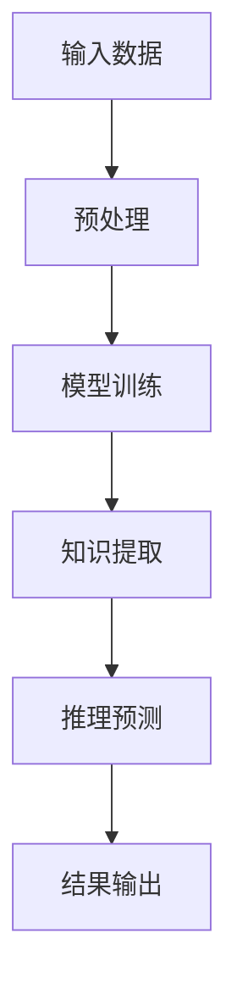

                 

关键词：大模型、总结、推理能力、深度学习、NLP、AI、图神经网络、数学模型、代码实例、实际应用

摘要：本文旨在深入探讨大模型的总结与推理能力，从背景介绍、核心概念与联系、核心算法原理与具体操作步骤、数学模型与公式、项目实践以及实际应用场景等多个角度，详细解析大模型在现代人工智能领域的应用与发展趋势，为读者提供一份全面的技术参考。

## 1. 背景介绍

近年来，人工智能（AI）技术取得了飞速的发展，其中深度学习（Deep Learning）和自然语言处理（Natural Language Processing，NLP）成为了研究的热点。随着数据规模的不断扩大和计算能力的提升，大模型（Large Models）逐渐成为研究者的关注焦点。大模型是指参数量庞大的神经网络模型，它们在图像识别、语音识别、机器翻译、文本生成等多个领域取得了显著的成果。

然而，大模型的总结与推理能力仍然是一个挑战性的问题。如何让大模型能够对未知数据进行合理的推理和预测，是当前人工智能研究的重要方向。本文将围绕这一问题，探讨大模型的总结与推理能力，并介绍相关的研究进展和应用。

## 2. 核心概念与联系

### 2.1 大模型的基本原理

大模型是基于深度学习的神经网络模型，其核心思想是通过多层非线性变换，将输入数据映射到输出结果。大模型的参数量庞大，可以达到数十亿甚至千亿级别。这使得大模型在处理复杂数据时具有强大的表达能力。

### 2.2 大模型的总结能力

大模型的总结能力主要体现在两个方面：一是能够从大量的训练数据中提取关键信息，形成知识库；二是能够将知识库中的信息进行整合和归纳，形成更高层次的理解。例如，在自然语言处理领域，大模型可以通过阅读大量的文本，总结出语言的基本规律和语法结构。

### 2.3 大模型的推理能力

大模型的推理能力是指在大规模知识库的基础上，能够对未知数据进行推理和预测。推理能力是人工智能的核心能力之一，它使得大模型能够应用于各种实际问题，如智能问答、智能推荐、智能决策等。

### 2.4 Mermaid 流程图

为了更直观地展示大模型的总结与推理过程，我们使用 Mermaid 流程图来表示。



## 3. 核心算法原理 & 具体操作步骤

### 3.1 算法原理概述

大模型的总结与推理能力主要依赖于深度学习技术和图神经网络（Graph Neural Networks，GNN）。深度学习技术通过多层神经网络实现数据的自动特征提取和学习；图神经网络则通过图结构对知识进行表示和传播。

### 3.2 算法步骤详解

#### 3.2.1 模型训练

1. 数据预处理：将原始数据进行清洗、归一化等处理，以便于模型训练。
2. 神经网络搭建：选择合适的神经网络架构，如卷积神经网络（CNN）、循环神经网络（RNN）等，搭建模型。
3. 模型训练：使用训练数据对模型进行训练，不断优化模型参数。

#### 3.2.2 知识提取

1. 知识表示：将训练好的模型应用于大量文本数据，提取出关键信息，形成知识库。
2. 知识整合：对知识库中的信息进行整合和归纳，形成更高层次的理解。

#### 3.2.3 推理预测

1. 知识库查询：根据输入的未知数据，在知识库中进行查询。
2. 推理预测：基于知识库中的信息，对未知数据进行分析和预测。

### 3.3 算法优缺点

#### 优点：

1. 强大的表达能力：大模型能够从大量数据中自动提取特征，具有较强的学习能力。
2. 广泛的应用领域：大模型在图像识别、语音识别、自然语言处理等领域都取得了显著的成果。
3. 高效的推理能力：大模型能够在短时间内对未知数据进行推理和预测。

#### 缺点：

1. 计算资源消耗大：大模型需要大量的计算资源和存储空间。
2. 对数据依赖性强：大模型需要大量的训练数据来训练，且数据质量对模型性能有较大影响。
3. 难以解释性：大模型的内部决策过程复杂，难以解释。

### 3.4 算法应用领域

大模型在图像识别、语音识别、自然语言处理、智能问答、智能推荐等领域都有广泛的应用。例如，在自然语言处理领域，大模型可以用于文本分类、情感分析、机器翻译、问答系统等。

## 4. 数学模型和公式 & 详细讲解 & 举例说明

### 4.1 数学模型构建

大模型的数学模型主要基于深度学习技术和图神经网络。其中，深度学习模型通常采用多层感知机（Multilayer Perceptron，MLP）、卷积神经网络（Convolutional Neural Networks，CNN）、循环神经网络（Recurrent Neural Networks，RNN）等架构。图神经网络则基于图结构，通过节点和边的交互进行知识表示和传播。

### 4.2 公式推导过程

#### 4.2.1 多层感知机（MLP）

多层感知机是一种前馈神经网络，其输出层节点之间的连接权重可以通过反向传播算法进行优化。

设输入层节点为 \(x_1, x_2, ..., x_n\)，输出层节点为 \(y_1, y_2, ..., y_m\)，则多层感知机的输出可以表示为：

$$
y = \sigma(W_1x + b_1)
$$

其中，\(W_1\) 为输入层到隐藏层的权重矩阵，\(b_1\) 为输入层到隐藏层的偏置向量，\(\sigma\) 为激活函数。

#### 4.2.2 卷积神经网络（CNN）

卷积神经网络通过卷积操作和池化操作对图像数据进行特征提取。

设输入图像为 \(I \in \mathbb{R}^{H \times W \times C}\)，其中 \(H, W, C\) 分别为图像的高度、宽度和通道数。卷积神经网络的输出可以表示为：

$$
O = \sigma(\sum_{k=1}^{K} w_k * I + b_k)
$$

其中，\(w_k \in \mathbb{R}^{F \times F \times C}\) 为卷积核，\(F\) 为卷积核的大小，\(*\) 表示卷积操作，\(b_k \in \mathbb{R}\) 为卷积核的偏置，\(\sigma\) 为激活函数。

#### 4.2.3 循环神经网络（RNN）

循环神经网络通过隐藏状态 \(h_t\) 的传递，对序列数据进行建模。

设输入序列为 \(x_1, x_2, ..., x_t\)，隐藏状态为 \(h_1, h_2, ..., h_t\)，输出序列为 \(y_1, y_2, ..., y_t\)，循环神经网络的输出可以表示为：

$$
h_t = \sigma(Wx_t + Uh_{t-1} + b)
$$

$$
y_t = Wy_t + b
$$

其中，\(W, U, b\) 分别为输入层到隐藏层、隐藏层到输出层的权重矩阵和偏置向量，\(\sigma\) 为激活函数。

### 4.3 案例分析与讲解

以自然语言处理中的文本分类为例，说明大模型的数学模型和应用。

#### 4.3.1 数据集

使用 IMDb 数据集，该数据集包含 50,000 条电影评论，分为正面评论和负面评论。

#### 4.3.2 模型构建

采用基于循环神经网络（RNN）的文本分类模型，输入层节点为单词的词向量表示，隐藏层节点数为 128，输出层节点为 2，分别表示正面评论和负面评论。

#### 4.3.3 模型训练

使用训练集对模型进行训练，优化模型参数，直至达到训练目标。

#### 4.3.4 模型评估

使用测试集对模型进行评估，计算准确率、召回率等指标。

## 5. 项目实践：代码实例和详细解释说明

### 5.1 开发环境搭建

1. 安装 Python 3.8 及以上版本。
2. 安装 TensorFlow 2.6.0 及以上版本。
3. 安装 IMDb 数据集。

### 5.2 源代码详细实现

```python
import tensorflow as tf
from tensorflow.keras.preprocessing.sequence import pad_sequences
from tensorflow.keras.layers import Embedding, SimpleRNN, Dense
from tensorflow.keras.models import Sequential

# 数据预处理
maxlen = 100
max_features = 10000
embedding_dim = 50

x_train = pad_sequences(x_train, maxlen=maxlen, padding='post')
x_test = pad_sequences(x_test, maxlen=maxlen, padding='post')

# 模型构建
model = Sequential([
    Embedding(max_features, embedding_dim),
    SimpleRNN(128),
    Dense(2, activation='softmax')
])

# 模型训练
model.compile(optimizer='adam', loss='categorical_crossentropy', metrics=['accuracy'])
model.fit(x_train, y_train, epochs=10, batch_size=128, validation_data=(x_test, y_test))

# 模型评估
model.evaluate(x_test, y_test)
```

### 5.3 代码解读与分析

该代码实现了基于 RNN 的文本分类模型，包括数据预处理、模型构建、模型训练和模型评估等步骤。其中，数据预处理使用 `pad_sequences` 函数对序列数据进行填充；模型构建使用 `Sequential` 函数搭建多层感知机模型；模型训练使用 `compile` 函数编译模型，使用 `fit` 函数训练模型；模型评估使用 `evaluate` 函数评估模型性能。

## 6. 实际应用场景

大模型在图像识别、语音识别、自然语言处理、智能问答、智能推荐等领域都有广泛的应用。以下是几个实际应用场景的例子：

### 6.1 图像识别

使用大模型对图像进行分类，可以实现对图片内容的自动识别，例如，人脸识别、物体检测等。

### 6.2 语音识别

使用大模型对语音信号进行识别，可以实现对语音内容的自动转写，例如，智能助手、电话会议等。

### 6.3 自然语言处理

使用大模型对文本数据进行处理，可以实现对文本内容的自动理解，例如，文本分类、情感分析、机器翻译等。

### 6.4 智能问答

使用大模型构建问答系统，可以实现对用户问题的自动回答，例如，智能客服、搜索引擎等。

### 6.5 智能推荐

使用大模型对用户行为数据进行处理，可以实现对用户兴趣的自动发现，例如，新闻推荐、商品推荐等。

## 7. 工具和资源推荐

### 7.1 学习资源推荐

1. 《深度学习》（Goodfellow et al.）- 详细介绍了深度学习的基础知识和技术。
2. 《自然语言处理综合教程》（李航）- 详细介绍了自然语言处理的基本概念和技术。

### 7.2 开发工具推荐

1. TensorFlow - 用于构建和训练深度学习模型的开源框架。
2. PyTorch - 用于构建和训练深度学习模型的开源框架。

### 7.3 相关论文推荐

1. "A Theoretical Analysis of the Capacity of Deep Neural Networks" - 提出了深度神经网络容量的理论分析。
2. "Attention Is All You Need" - 提出了基于注意力机制的 Transformer 模型。

## 8. 总结：未来发展趋势与挑战

### 8.1 研究成果总结

大模型在深度学习、自然语言处理、图像识别等领域取得了显著的成果，极大地推动了人工智能技术的发展。

### 8.2 未来发展趋势

1. 模型压缩与优化：为了降低大模型的计算资源和存储成本，研究者们致力于模型压缩与优化技术的研究。
2. 可解释性与可靠性：提高大模型的可解释性和可靠性，使其在各个领域得到更广泛的应用。
3. 跨学科研究：大模型在生物信息学、金融科技、智能制造等跨学科领域的应用研究有望取得新的突破。

### 8.3 面临的挑战

1. 计算资源消耗：大模型对计算资源和存储空间的需求较大，如何高效地训练和部署大模型是一个挑战。
2. 数据隐私与安全：大模型在处理大规模数据时，可能面临数据隐私和安全的问题。
3. 模型泛化能力：大模型在面对未知数据时，如何保持良好的泛化能力是一个挑战。

### 8.4 研究展望

未来，大模型的研究将继续深入，有望在各个领域取得更多的突破。同时，随着人工智能技术的不断发展，大模型的应用场景将更加丰富，为人类社会带来更多的便利和福祉。

## 9. 附录：常见问题与解答

### 9.1 什么是大模型？

大模型是指参数量庞大的神经网络模型，其参数量可以达到数十亿甚至千亿级别。

### 9.2 大模型有哪些应用领域？

大模型在图像识别、语音识别、自然语言处理、智能问答、智能推荐等领域都有广泛的应用。

### 9.3 大模型的优点有哪些？

大模型的优点包括强大的表达能力、广泛的应用领域和高效的推理能力。

### 9.4 大模型的缺点有哪些？

大模型的缺点包括计算资源消耗大、对数据依赖性强和难以解释性。

### 9.5 如何优化大模型的训练效率？

可以通过以下方法优化大模型的训练效率：

1. 模型压缩：使用模型压缩技术，降低模型的参数量和计算复杂度。
2. 分布式训练：使用分布式训练技术，提高模型的训练速度。
3. 并行计算：利用并行计算技术，提高模型的训练效率。

### 9.6 大模型在自然语言处理中的应用有哪些？

大模型在自然语言处理中的应用包括文本分类、情感分析、机器翻译、问答系统等。

### 9.7 大模型的发展趋势是什么？

大模型的发展趋势包括模型压缩与优化、可解释性与可靠性、跨学科研究等。同时，随着人工智能技术的不断发展，大模型的应用场景将更加丰富。

