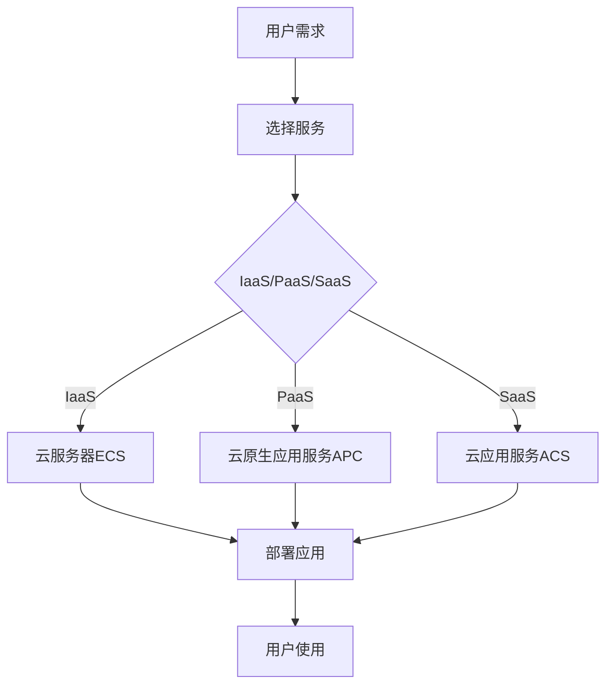

                 

关键词：阿里云、云计算服务、应用开发、云计算架构、技术实践

> 摘要：本文将深入探讨阿里云云计算服务在应用开发中的关键角色和实际应用。通过分析云计算服务的核心概念、架构及其应用领域，本文将展示如何利用阿里云平台进行高效的应用开发，并提供实用的技术指南和实例，以帮助开发者更好地利用云计算技术，实现创新性的应用解决方案。

## 1. 背景介绍

云计算作为一种分布式计算模式，正逐渐改变着企业和个人开发者的IT基础设施。阿里云作为中国领先的云计算服务提供商，其丰富的服务产品线和强大的计算能力为开发者提供了广阔的应用开发空间。随着云计算技术的不断成熟和应用场景的多样化，如何高效利用阿里云进行应用开发已成为众多开发者关注的焦点。

本文旨在帮助读者了解阿里云云计算服务的核心概念和架构，探讨云计算服务在应用开发中的应用，并提供实用的开发指南和实际案例。通过本文的阅读，读者将能够：

- 掌握阿里云云计算服务的核心架构和功能。
- 学习如何利用阿里云进行高效的应用开发和部署。
- 理解云计算服务在不同领域的应用案例。
- 获得实用的开发工具和资源推荐。

## 2. 核心概念与联系

### 2.1 云计算服务概念

云计算服务主要包括IaaS（基础设施即服务）、PaaS（平台即服务）和SaaS（软件即服务）。在阿里云中，这些服务分别对应着云服务器ECS、云原生应用服务APC和云应用服务ACS等。

- **IaaS**：提供基础的计算、存储和网络资源，用户可以根据需求进行配置和扩展。
- **PaaS**：提供开发、运行和管理应用程序的平台，降低开发者的开发难度。
- **SaaS**：提供可直接使用的应用程序，用户无需关心基础设施和平台的维护。

### 2.2 阿里云架构

阿里云的架构设计遵循高可用、可扩展和灵活性的原则。其核心包括以下几个层次：

- **基础设施层**：包括计算、存储、网络等硬件资源。
- **平台层**：提供各种云计算服务，如ECS、RDS、OSS等。
- **应用层**：提供SaaS服务，如阿里云办公套件、视频云服务等。

### 2.3 云计算服务联系

在应用开发中，开发者可以根据需求选择不同的云计算服务，实现以下联系：

- **基础设施层**：为应用提供基础计算和存储能力。
- **平台层**：提供开发、测试和管理应用的环境。
- **应用层**：为用户提供可直接使用的应用程序。

下面是一个简化的Mermaid流程图，展示云计算服务在应用开发中的流程：



## 3. 核心算法原理 & 具体操作步骤

### 3.1 算法原理概述

在云计算服务应用开发中，核心算法主要涉及以下几个方面：

- **资源调度算法**：用于优化资源的分配和利用。
- **负载均衡算法**：用于平衡不同节点的负载。
- **加密算法**：用于保障数据的安全性。

### 3.2 算法步骤详解

#### 3.2.1 资源调度算法

资源调度算法的基本步骤如下：

1. **需求分析**：收集应用程序的资源需求。
2. **资源评估**：评估现有资源的可用性。
3. **分配策略**：根据资源评估结果，选择合适的资源分配策略。
4. **资源分配**：将资源分配给应用程序。
5. **监控与调整**：持续监控资源使用情况，根据需要进行调整。

#### 3.2.2 负载均衡算法

负载均衡算法的基本步骤如下：

1. **负载监测**：监测各个节点的负载情况。
2. **负载分配**：根据监测结果，将请求分配到负载较低的节点。
3. **动态调整**：根据节点负载的变化，动态调整请求分配策略。

#### 3.2.3 加密算法

加密算法的基本步骤如下：

1. **密钥生成**：生成加密密钥。
2. **加密过程**：使用加密算法对数据进行加密。
3. **解密过程**：使用解密算法对数据进行解密。

### 3.3 算法优缺点

#### 资源调度算法

- **优点**：提高资源利用率，降低应用延迟。
- **缺点**：需要考虑复杂度，实时性要求较高。

#### 负载均衡算法

- **优点**：提高系统可用性，降低单点故障风险。
- **缺点**：可能引入额外的网络延迟。

#### 加密算法

- **优点**：保障数据安全性。
- **缺点**：可能影响数据处理速度。

### 3.4 算法应用领域

- **资源调度算法**：广泛应用于云计算、大数据等领域。
- **负载均衡算法**：广泛应用于Web应用、分布式系统等领域。
- **加密算法**：广泛应用于网络安全、数据保护等领域。

## 4. 数学模型和公式 & 详细讲解 & 举例说明

### 4.1 数学模型构建

在云计算服务应用开发中，常用的数学模型包括线性回归、决策树、神经网络等。以下是线性回归模型的基本公式：

$$ y = w_0 + w_1 \cdot x_1 + w_2 \cdot x_2 + \ldots + w_n \cdot x_n $$

其中，$y$ 是目标变量，$x_1, x_2, \ldots, x_n$ 是特征变量，$w_0, w_1, w_2, \ldots, w_n$ 是权重参数。

### 4.2 公式推导过程

线性回归模型的推导过程如下：

1. **损失函数**：选择均方误差（MSE）作为损失函数：

$$ J = \frac{1}{m} \sum_{i=1}^{m} (y_i - \hat{y}_i)^2 $$

其中，$m$ 是样本数量，$\hat{y}_i$ 是预测值，$y_i$ 是实际值。

2. **梯度下降**：对损失函数求梯度，并使用梯度下降法更新权重参数：

$$ \nabla_{w} J = -2 \cdot (y_i - \hat{y}_i) \cdot x_i $$

$$ w = w - \alpha \cdot \nabla_{w} J $$

其中，$\alpha$ 是学习率。

### 4.3 案例分析与讲解

假设我们有一个线性回归问题，需要预测房屋的价格。数据集包含房屋的面积（$x_1$）和房龄（$x_2$）作为特征变量，房价（$y$）作为目标变量。

1. **数据预处理**：将数据集进行标准化处理，消除不同特征之间的尺度差异。
2. **模型训练**：使用线性回归模型对数据集进行训练，得到权重参数。
3. **模型评估**：使用测试集对模型进行评估，计算预测误差。
4. **模型优化**：根据评估结果，调整学习率和模型参数，优化模型性能。

通过以上步骤，我们可以得到一个预测房价的线性回归模型，并根据实际需求进行调整和优化。

## 5. 项目实践：代码实例和详细解释说明

### 5.1 开发环境搭建

在开始项目实践之前，我们需要搭建一个开发环境。以下是使用阿里云服务器ECS进行环境搭建的步骤：

1. **购买ECS实例**：登录阿里云控制台，购买一个合适的ECS实例。
2. **配置ECS实例**：配置ECS实例的网络和安全组，确保能够远程访问。
3. **远程连接ECS实例**：使用SSH工具远程连接ECS实例，安装必要的开发环境和工具。

### 5.2 源代码详细实现

以下是一个简单的基于阿里云云原生应用服务APC的Web应用实例：

```python
from flask import Flask, jsonify

app = Flask(__name__)

@app.route('/')
def hello():
    return jsonify({'message': 'Hello, World!'})

if __name__ == '__main__':
    app.run(host='0.0.0.0', port=8080)
```

### 5.3 代码解读与分析

1. **Flask应用**：使用Flask框架搭建Web应用。
2. **路由**：定义一个根路由`/`，返回JSON格式的响应。
3. **运行**：在ECS实例上运行Web应用，使用8080端口对外提供服务。

### 5.4 运行结果展示

在浏览器中输入ECS实例的公网IP地址，如`http://公网IP:8080`，即可看到Web应用的响应结果。

## 6. 实际应用场景

### 6.1 企业应用

企业可以使用阿里云云计算服务构建企业级应用，如企业资源管理系统、客户关系管理系统等。通过云原生应用服务APC，企业可以快速部署和管理应用，降低运维成本。

### 6.2 物流行业

物流行业可以利用阿里云的云计算服务进行物流跟踪、运输优化和供应链管理。通过大数据分析和机器学习算法，物流企业可以实时监测物流状态，优化运输路线，提高物流效率。

### 6.3 教育行业

教育行业可以利用阿里云云计算服务提供在线教育平台、虚拟实验室等应用。通过云计算服务，学生和教师可以随时随地进行学习，提高教学效果。

## 7. 工具和资源推荐

### 7.1 学习资源推荐

- **阿里云官方文档**：https://help.aliyun.com/
- **《云计算实践教程》**：由知名云计算专家编写，涵盖了云计算的基本原理和应用实践。

### 7.2 开发工具推荐

- **Docker**：容器化工具，用于构建、运行和分发应用程序。
- **Kubernetes**：容器编排工具，用于管理容器化应用。

### 7.3 相关论文推荐

- **"云原生计算：概念与架构"**：介绍了云原生计算的基本概念和架构。
- **"云计算中的资源调度算法"**：讨论了云计算中的资源调度算法及其应用。

## 8. 总结：未来发展趋势与挑战

### 8.1 研究成果总结

云计算技术在过去几年中取得了显著进展，包括虚拟化技术的成熟、分布式系统的优化和人工智能在云计算中的应用等。这些研究成果为云计算服务的发展奠定了基础。

### 8.2 未来发展趋势

- **云计算服务生态**：随着云计算技术的不断发展，云计算服务生态将更加丰富，包括云计算平台、开发工具、中间件等。
- **人工智能与云计算**：人工智能技术与云计算的融合将成为未来发展的关键方向，如云计算中的AI优化、AI驱动的云计算服务等。
- **边缘计算**：随着物联网和5G技术的发展，边缘计算将成为云计算服务的重要组成部分。

### 8.3 面临的挑战

- **安全性**：云计算服务涉及大量数据传输和处理，安全性是云计算服务面临的主要挑战之一。
- **可靠性**：云计算服务的可靠性需要不断提高，以满足企业和用户的高要求。
- **可扩展性**：云计算服务需要具备良好的可扩展性，以应对日益增长的数据和应用需求。

### 8.4 研究展望

未来，云计算服务将朝着更加智能化、自动化和高效化的方向发展。研究将集中在以下几个方面：

- **安全性研究**：开发更强大的安全防护技术，提高云计算服务的安全性。
- **可靠性研究**：优化云计算服务的可靠性，提高系统的稳定性和可用性。
- **可扩展性研究**：研究更加灵活和高效的可扩展性架构，满足大规模应用的需求。

## 9. 附录：常见问题与解答

### 9.1 如何选择合适的云计算服务？

- **需求分析**：首先明确应用的需求，包括计算、存储、网络等资源需求。
- **成本考虑**：根据预算和业务规模，选择合适的云计算服务。
- **性能要求**：根据应用的性能要求，选择适合的计算和存储服务。
- **可靠性要求**：根据业务的重要性，选择具备高可靠性的云计算服务。

### 9.2 云计算服务的安全性如何保障？

- **数据加密**：使用加密算法对数据进行加密，确保数据传输和存储的安全性。
- **访问控制**：设置合理的访问控制策略，限制非法访问。
- **安全审计**：定期进行安全审计，检查系统漏洞和安全隐患。
- **安全培训**：对开发者和用户进行安全培训，提高安全意识和技能。

### 9.3 云计算服务的可靠性如何保障？

- **多活部署**：在多个数据中心部署应用，确保服务的高可用性。
- **故障恢复**：设置故障恢复机制，快速恢复服务。
- **性能监控**：持续监控系统性能，及时发现和处理问题。
- **备份与恢复**：定期进行数据备份，确保数据的安全性和可靠性。

# 作者署名

作者：禅与计算机程序设计艺术 / Zen and the Art of Computer Programming

