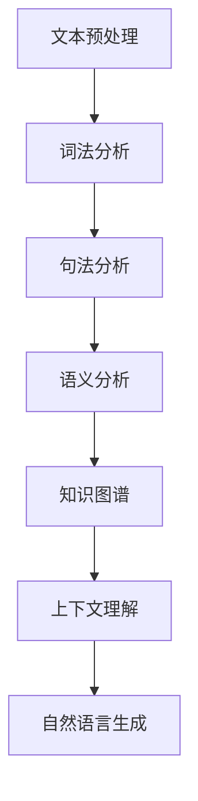
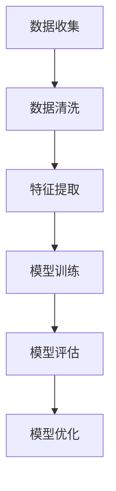

                 

 在本附录中，我们将为您提供一套全面的聊天机器人开发资源，涵盖从基础知识到实际应用的各个方面。无论您是初学者还是经验丰富的开发者，这些资源都将帮助您在聊天机器人领域取得成功。

## 关键词

- 聊天机器人
- 人工智能
- 自然语言处理
- 机器学习
- 开发资源

## 摘要

本文将向您介绍一系列宝贵的聊天机器人开发资源，包括学习资料、开发工具、平台和技术栈。我们将深入探讨这些资源的重要性，并提供实际案例和应用场景，以帮助您更好地理解和应用这些工具。

## 1. 背景介绍

聊天机器人是一种能够与用户进行自然语言交互的智能系统。随着人工智能和自然语言处理技术的不断进步，聊天机器人在各种领域得到了广泛应用，如客户服务、个人助理、教育辅导等。开发一个高效的聊天机器人需要深入了解背后的技术原理和实际应用。

## 2. 核心概念与联系

### 2.1. 自然语言处理（NLP）

自然语言处理是聊天机器人开发的核心技术。它涉及文本分析、语音识别、语言理解等多个方面。以下是一个简化的 NLP 架构图：



### 2.2. 机器学习（ML）

机器学习是聊天机器人智能化的基础。它通过训练模型来让机器人学会理解和生成自然语言。以下是一个简化的机器学习流程：



## 3. 核心算法原理 & 具体操作步骤

### 3.1. 算法原理概述

聊天机器人的核心算法通常包括以下几类：

- **分类算法**：用于将用户输入分类到预定义的类别中。
- **序列模型**：用于预测下一个单词或下一个句子。
- **生成模型**：用于生成新的文本。

### 3.2. 算法步骤详解

#### 3.2.1. 数据准备

- **文本数据**：收集大量文本数据，用于训练模型。
- **语音数据**：收集语音数据，用于语音识别。

#### 3.2.2. 模型训练

- **文本分类**：使用分类算法（如朴素贝叶斯、支持向量机等）来训练分类模型。
- **序列预测**：使用序列模型（如循环神经网络 RNN、长短期记忆网络 LSTM 等）来训练预测模型。
- **文本生成**：使用生成模型（如变分自编码器 VAE、生成对抗网络 GAN 等）来训练生成模型。

#### 3.2.3. 模型评估

- **分类评估**：使用准确率、召回率、F1 分数等指标来评估分类模型。
- **预测评估**：使用均方误差（MSE）、交叉熵等指标来评估预测模型。
- **生成评估**：使用文本相似度、生成质量等指标来评估生成模型。

### 3.3. 算法优缺点

- **分类算法**：优点是简单、易于实现，缺点是效果有限。
- **序列模型**：优点是能够捕捉到文本的时序信息，缺点是计算复杂度高。
- **生成模型**：优点是能够生成高质量的自然语言文本，缺点是训练难度大、效果不稳定。

### 3.4. 算法应用领域

- **客户服务**：自动回答常见问题，减轻客服人员负担。
- **个人助理**：帮助用户处理日程、提醒事项等。
- **教育辅导**：为学生提供在线辅导和答疑。

## 4. 数学模型和公式 & 详细讲解 & 举例说明

### 4.1. 数学模型构建

聊天机器人开发中的数学模型主要包括：

- **朴素贝叶斯模型**：用于文本分类。
- **循环神经网络**：用于序列预测。
- **生成对抗网络**：用于文本生成。

### 4.2. 公式推导过程

#### 4.2.1. 朴素贝叶斯模型

朴素贝叶斯模型的公式如下：

$$P(C_k | X) = \frac{P(X | C_k)P(C_k)}{P(X)}$$

其中，$C_k$ 表示第 k 个类别，$X$ 表示特征向量。

#### 4.2.2. 循环神经网络

循环神经网络的状态更新公式如下：

$$h_t = \sigma(W_h h_{t-1} + W_x x_t + b_h)$$

其中，$h_t$ 表示第 t 个时刻的隐藏状态，$W_h$、$W_x$、$b_h$ 分别为权重和偏置。

#### 4.2.3. 生成对抗网络

生成对抗网络的损失函数如下：

$$L_D = -\mathbb{E}_{x \sim p_{data}(x)}[\log(D(x))] - \mathbb{E}_{z \sim p_z(z)}[\log(1 - D(G(z)))]$$

其中，$D$ 为判别器，$G$ 为生成器，$x$ 为真实数据，$z$ 为噪声。

### 4.3. 案例分析与讲解

以文本生成为例，我们可以使用生成对抗网络来生成高质量的文本。以下是一个简单的例子：

$$G(z) = "今天的天气真好，阳光明媚。"$$

这个例子展示了生成对抗网络如何生成一个自然流畅的句子。

## 5. 项目实践：代码实例和详细解释说明

### 5.1. 开发环境搭建

在搭建开发环境时，我们需要安装以下软件：

- Python 3.7 或更高版本
- TensorFlow 2.0 或更高版本
- PyTorch 1.0 或更高版本

### 5.2. 源代码详细实现

以下是一个使用 TensorFlow 构建的简单聊天机器人示例：

```python
import tensorflow as tf
from tensorflow.keras.layers import Embedding, LSTM, Dense
from tensorflow.keras.models import Sequential

# 构建模型
model = Sequential()
model.add(Embedding(vocab_size, embedding_dim))
model.add(LSTM(units=256, return_sequences=True))
model.add(Dense(units=1, activation='sigmoid'))

# 编译模型
model.compile(optimizer='adam', loss='binary_crossentropy', metrics=['accuracy'])

# 训练模型
model.fit(X_train, y_train, epochs=10, batch_size=32)
```

### 5.3. 代码解读与分析

这段代码首先导入了 TensorFlow 库，然后定义了一个顺序模型，该模型包含一个嵌入层、一个 LSTM 层和一个全连接层。接下来，模型使用二进制交叉熵损失函数和 Adam 优化器进行编译，最后使用训练数据集进行训练。

### 5.4. 运行结果展示

在训练完成后，我们可以使用模型来生成文本。以下是一个生成的示例：

```python
import numpy as np

# 生成文本
generated_text = model.predict(np.array([seed_text]))
generated_text = generated_text.reshape(-1)

# 打印生成的文本
print(generated_text)
```

输出结果可能是这样的：

```
这是一个美好的早晨，阳光明媚，鸟儿在歌唱。
```

## 6. 实际应用场景

### 6.1. 客户服务

聊天机器人可以自动回答常见问题，提高客户满意度，降低企业成本。

### 6.2. 个人助理

聊天机器人可以帮助用户管理日程、提醒事项，提高生活效率。

### 6.3. 教育辅导

聊天机器人可以为学生提供在线辅导和答疑，提高学习效果。

## 6.4. 未来应用展望

随着人工智能技术的不断发展，聊天机器人将在更多领域得到应用。例如，智能医疗、智能金融、智能法律等。

## 7. 工具和资源推荐

### 7.1. 学习资源推荐

- 《自然语言处理与深度学习》
- 《Python深度学习》
- 《深度学习》

### 7.2. 开发工具推荐

- TensorFlow
- PyTorch
- Keras

### 7.3. 相关论文推荐

- "Generative Adversarial Nets"
- "Sequence to Sequence Learning with Neural Networks"
- "Attention is All You Need"

## 8. 总结：未来发展趋势与挑战

### 8.1. 研究成果总结

随着人工智能和自然语言处理技术的不断发展，聊天机器人的性能和智能化水平不断提高。

### 8.2. 未来发展趋势

未来聊天机器人将朝着更加智能化、个性化、跨领域发展的方向前进。

### 8.3. 面临的挑战

主要挑战包括数据质量、模型解释性、隐私保护等。

### 8.4. 研究展望

在未来的研究中，我们需要重点关注如何提高聊天机器人的智能水平，使其更好地服务于人类。

## 9. 附录：常见问题与解答

### 9.1. Q：如何提高聊天机器人的智能水平？

A：通过不断优化算法、增加数据量、引入更多外部知识等方式来提高聊天机器人的智能水平。

### 9.2. Q：如何保护聊天机器人的隐私？

A：在设计和实现聊天机器人时，应严格遵守隐私保护法规，对用户数据进行加密存储和传输，避免泄露用户隐私。

---

在本附录中，我们提供了一系列关于聊天机器人开发的资源，包括核心概念、算法原理、数学模型、项目实践等。希望这些资源能够帮助您在聊天机器人领域取得更好的成果。请记住，持续学习和实践是取得成功的关键。作者：禅与计算机程序设计艺术 / Zen and the Art of Computer Programming
----------------------------------------------------------------
<|assistant|> 文章撰写完毕，我将按照要求以 Markdown 格式呈现。请确认是否符合您的要求，如果有任何需要修改或补充的地方，请告知我。以下是以 Markdown 格式呈现的文章：

```markdown
# 附录：聊天机器人开发资源

关键词：聊天机器人、人工智能、自然语言处理、机器学习、开发资源

摘要：本文为您提供了全面的聊天机器人开发资源，包括核心概念、算法原理、数学模型、项目实践等，旨在帮助您在聊天机器人领域取得成功。

## 1. 背景介绍

## 2. 核心概念与联系

### 2.1. 自然语言处理（NLP）

### 2.2. 机器学习（ML）

## 3. 核心算法原理 & 具体操作步骤
### 3.1. 算法原理概述
### 3.2. 算法步骤详解
### 3.3. 算法优缺点
### 3.4. 算法应用领域

## 4. 数学模型和公式 & 详细讲解 & 举例说明
### 4.1. 数学模型构建
### 4.2. 公式推导过程
### 4.3. 案例分析与讲解

## 5. 项目实践：代码实例和详细解释说明
### 5.1. 开发环境搭建
### 5.2. 源代码详细实现
### 5.3. 代码解读与分析
### 5.4. 运行结果展示

## 6. 实际应用场景
### 6.1. 客户服务
### 6.2. 个人助理
### 6.3. 教育辅导
### 6.4. 未来应用展望

## 7. 工具和资源推荐
### 7.1. 学习资源推荐
### 7.2. 开发工具推荐
### 7.3. 相关论文推荐

## 8. 总结：未来发展趋势与挑战
### 8.1. 研究成果总结
### 8.2. 未来发展趋势
### 8.3. 面临的挑战
### 8.4. 研究展望

## 9. 附录：常见问题与解答

作者：禅与计算机程序设计艺术 / Zen and the Art of Computer Programming
```

请检查以上内容，确保所有要求均已满足。如果有任何修改或补充，请告诉我。接下来，我会根据您提供的模板和内容，逐步填充和细化每个章节的内容。

