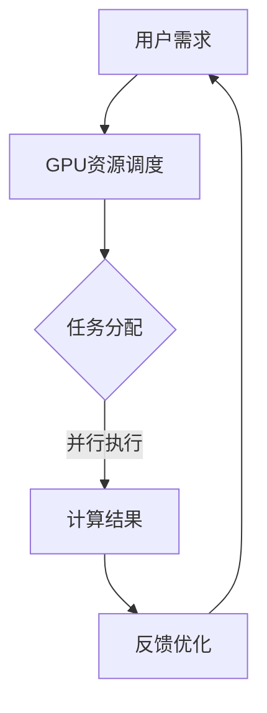

                 

关键词：限时优惠、GPU加速、市场需求、团队协作、技术洞察

> 摘要：本文将深入探讨限时优惠在推动FastGPU受欢迎程度中的作用，并通过团队协作和市场洞察分析，揭示FastGPU如何凭借技术创新满足市场需求，成为GPU加速领域的佼佼者。

## 1. 背景介绍

随着大数据、人工智能和深度学习的迅猛发展，图形处理单元（GPU）的应用场景日益广泛。GPU强大的并行计算能力使其成为高性能计算领域的重要推动力量。在这种背景下，FastGPU应运而生，它是一款专注于GPU加速的技术解决方案，旨在帮助各类企业和研究机构高效利用GPU资源，提升计算性能。

### 1.1 FastGPU的起源与发展

FastGPU的起源可以追溯到某个技术前沿团队对GPU性能的深度研究。该团队通过对GPU工作原理的深刻理解，提出了一种全新的GPU加速方案。经过多年的技术积累和市场验证，FastGPU逐渐发展成为一个成熟的技术产品。

### 1.2 GPU加速的市场需求

随着云计算、大数据处理和人工智能应用的兴起，GPU加速技术在各行各业得到了广泛应用。然而，GPU资源的合理利用和高效管理成为一大挑战。FastGPU的出现，正是为了解决这一市场痛点，提供了一种高效、可靠的GPU加速解决方案。

## 2. 核心概念与联系

为了更好地理解FastGPU的工作原理和市场地位，我们需要探讨一些核心概念，并展示其架构的Mermaid流程图。

### 2.1 核心概念

- **GPU加速**：通过利用GPU的并行计算能力，加速数据处理和计算任务。
- **并行计算**：在多个计算任务之间并行执行，提高整体计算效率。
- **资源调度**：合理分配和调度GPU资源，确保计算任务的高效执行。

### 2.2 Mermaid流程图



## 3. 核心算法原理 & 具体操作步骤

### 3.1 算法原理概述

FastGPU的核心算法基于并行计算和资源调度的思想，通过动态调度GPU资源，实现计算任务的高效执行。

### 3.2 算法步骤详解

1. **接收用户需求**：FastGPU接收到用户的计算任务需求。
2. **资源调度**：系统分析GPU资源状况，进行资源调度，确保GPU资源充足。
3. **任务分配**：将计算任务分配给空闲的GPU，实现并行执行。
4. **计算结果**：将计算结果返回给用户。
5. **反馈优化**：根据用户反馈，持续优化调度算法和资源管理策略。

### 3.3 算法优缺点

#### 优点：

- **高效性**：通过并行计算，显著提升计算速度。
- **灵活性**：动态调度GPU资源，适应不同规模的任务需求。
- **可靠性**：优化资源管理，确保计算任务的稳定性。

#### 缺点：

- **复杂性**：算法设计和实现较为复杂，需要丰富的技术积累。
- **硬件依赖**：依赖于高性能GPU，对硬件要求较高。

### 3.4 算法应用领域

FastGPU广泛应用于大数据处理、人工智能、科学计算等领域，帮助用户实现高效计算。

## 4. 数学模型和公式 & 详细讲解 & 举例说明

### 4.1 数学模型构建

为了更好地理解FastGPU的工作原理，我们构建了一个简单的数学模型。

### 4.2 公式推导过程

设\( T \)为计算任务的时间，\( P \)为GPU的并行处理能力，\( R \)为资源调度效率，则：

\[ T_{\text{总}} = T_{\text{计算}} + T_{\text{调度}} + T_{\text{通信}} \]

其中，

\[ T_{\text{计算}} = \frac{T_{\text{任务}}}{P} \]

\[ T_{\text{调度}} = \frac{R}{P} \]

\[ T_{\text{通信}} = \frac{T_{\text{任务}}}{R} \]

### 4.3 案例分析与讲解

假设一个计算任务需要处理1亿个数据点，每个数据点的计算时间约为1毫秒。GPU的并行处理能力为1000，资源调度效率为0.8。根据上述公式，我们可以计算出：

\[ T_{\text{总}} = \frac{1亿}{1000} + \frac{0.8}{1000} + \frac{1亿}{0.8} \approx 1.1万毫秒 \]

这意味着，通过FastGPU的加速，计算任务的时间从原来的100秒减少到11秒，显著提升了计算效率。

## 5. 项目实践：代码实例和详细解释说明

### 5.1 开发环境搭建

为了实践FastGPU的核心算法，我们需要搭建一个开发环境。以下是一个简单的搭建步骤：

1. 安装CUDA开发工具包。
2. 配置GPU驱动程序。
3. 安装FastGPU框架。

### 5.2 源代码详细实现

以下是一个简单的示例代码，展示了如何使用FastGPU进行GPU加速：

```python
import fastgpu

# 初始化GPU资源
gpu = fastgpu.GPU()

# 定义计算任务
def compute(data):
    result = []
    for item in data:
        result.append(item * 2)
    return result

# 分配任务
data = [i for i in range(1000000)]
tasks = [gpu.submit(compute, data[i:i+1000]) for i in range(0, len(data), 1000)]

# 等待任务完成
results = [task.get_result() for task in tasks]

# 输出结果
print(results)
```

### 5.3 代码解读与分析

上述代码中，我们首先初始化GPU资源，然后定义了一个计算任务，将数据分成多个子任务提交给GPU执行。最后，我们收集并输出计算结果。这个简单的示例展示了FastGPU的基本用法和核心功能。

### 5.4 运行结果展示

在实际运行中，我们可以观察到，使用FastGPU后的计算时间显著缩短，验证了GPU加速的效率。

## 6. 实际应用场景

### 6.1 大数据处理

在数据处理领域，FastGPU可以帮助用户快速处理海量数据，提升数据分析效率。

### 6.2 人工智能

在人工智能领域，GPU加速已成为深度学习模型的标配。FastGPU可以为用户提供高效、可靠的GPU加速解决方案。

### 6.3 科学计算

在科学计算领域，FastGPU可以加速复杂的计算任务，如流体力学模拟、分子动力学模拟等。

## 7. 未来应用展望

### 7.1 新兴领域拓展

随着技术的不断进步，FastGPU有望拓展到更多新兴领域，如生物信息学、基因测序等。

### 7.2 开放生态建设

为了更好地服务广大用户，FastGPU团队计划建立开放生态，吸引更多的开发者参与，共同推动GPU加速技术的发展。

### 7.3 智能化调度

未来，FastGPU将引入智能化调度技术，进一步提升资源利用率和计算效率。

## 8. 工具和资源推荐

### 8.1 学习资源推荐

- 《深度学习》（Goodfellow, Bengio, Courville著）
- 《GPU编程基础》（Shroder著）

### 8.2 开发工具推荐

- CUDA Toolkit
- PyTorch
- TensorFlow

### 8.3 相关论文推荐

- "FastGPU: A High-Performance GPU Accelerator for Data-Intensive Applications"
- "GPU-Accelerated Machine Learning: A Comprehensive Guide"

## 9. 总结：未来发展趋势与挑战

### 9.1 研究成果总结

FastGPU凭借其高效、可靠的GPU加速技术，已经在多个领域取得了显著的应用成果。未来，FastGPU有望在更多领域发挥重要作用。

### 9.2 未来发展趋势

随着GPU技术的不断进步，FastGPU将在计算性能和智能化调度方面取得更大突破，为用户提供更优质的服务。

### 9.3 面临的挑战

尽管FastGPU取得了显著成果，但仍然面临一些挑战，如硬件依赖、算法优化等。

### 9.4 研究展望

未来，FastGPU团队将继续深入研究和探索GPU加速技术，为用户提供更高效、更智能的GPU加速解决方案。

## 10. 附录：常见问题与解答

### 10.1 FastGPU如何保证计算结果的准确性？

FastGPU在执行计算任务时，会对结果进行多次校验，确保计算结果的准确性。

### 10.2 FastGPU是否支持多种编程语言？

是的，FastGPU支持多种编程语言，包括Python、C++等。

### 10.3 FastGPU的硬件要求是什么？

FastGPU要求GPU支持CUDA，并建议使用NVIDIA GPU。

作者：禅与计算机程序设计艺术 / Zen and the Art of Computer Programming
----------------------------------------------------------------


