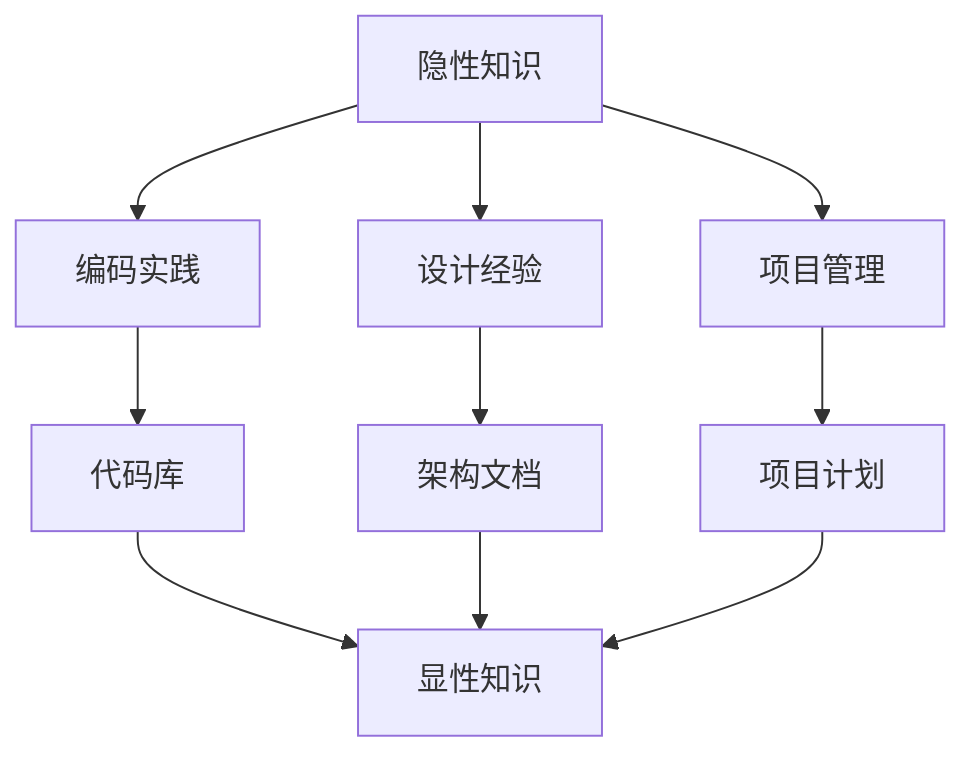

                 

关键词：隐性知识，智慧积累，知识传递，IT领域，专业素养

摘要：本文旨在探讨隐性知识在IT领域的积累与传递。通过分析隐性知识的特性，结合实际案例，本文揭示了隐性知识在编程、软件开发和系统架构中的重要性。同时，本文提出了一套有效积累和传递隐性知识的策略，为IT从业者提供了实践指导。

## 1. 背景介绍

在当今信息技术高速发展的时代，知识的积累和传递显得尤为重要。然而，传统知识的传递方式往往侧重于显性知识的分享，如文档、代码、算法等。这些显性知识虽然易于传播和复制，但它们并不能完全反映实际工作中复杂问题和解决方案的精髓。与之相对，隐性知识则是指那些难以用语言明确表达的知识，如经验、直觉、洞察力和专业技能等。

隐性知识在IT领域尤为丰富，因为编程和软件开发工作本质上是一种创造性活动，其中包含了许多抽象思维和问题解决的智慧。这些隐性知识不仅体现在具体的代码和算法中，更贯穿于整个软件开发过程，影响着项目的成败。因此，如何有效地积累和传递隐性知识，成为IT从业者面临的一个重大挑战。

## 2. 核心概念与联系

为了深入理解隐性知识，我们需要先明确几个关键概念：

### 2.1 隐性知识的特性

- **非结构化**：隐性知识往往缺乏明确的逻辑结构和组织方式，难以用标准化的方法进行表述。
- **主观性**：隐性知识依赖于个人的经验和感知，具有强烈的个人色彩。
- **动态性**：隐性知识随着时间、环境和情境的变化而不断演化。

### 2.2 隐性知识与显性知识的区别

- **显性知识**：可以通过语言、文字、图像等形式明确表达和记录的知识。
- **隐性知识**：难以用语言清晰表述，只能通过实践、观察、模仿等方式获得。

### 2.3 隐性知识在IT领域的应用

- **编程经验**：一个优秀的程序员不仅仅会编写代码，更会通过经验积累形成一套解决问题的方法论。
- **系统架构设计**：在系统架构设计中，隐性知识体现在对系统性能、可维护性和扩展性的深刻理解。
- **项目管理**：项目经理的隐性知识有助于他们预见项目风险、制定合理的时间计划和资源分配。

### 2.4 Mermaid 流程图

下面是一个简单的 Mermaid 流程图，展示了隐性知识与显性知识的联系。



## 3. 核心算法原理 & 具体操作步骤

### 3.1 算法原理概述

隐性知识的积累与传递可以看作是一种算法。这种算法的核心在于将个人的经验和智慧抽象出来，转化为可传递和学习的知识。具体而言，可以分为以下几个步骤：

1. **经验收集**：通过实践积累经验，记录遇到的问题、解决方案和反思。
2. **知识抽象**：将经验转化为通用原则和方法，去除个人色彩，使之具有普适性。
3. **知识分享**：通过演讲、教程、书籍等方式，将抽象出的知识传递给他人。
4. **反馈迭代**：根据反馈不断修正和完善知识体系。

### 3.2 算法步骤详解

1. **经验收集**：这是隐性知识积累的第一步。程序员在编写代码、设计系统、参与项目过程中会遇到各种问题，这些问题和解决方案都是宝贵的隐性知识来源。

2. **知识抽象**：在收集到足够多的经验后，需要对这些经验进行抽象。具体方法包括反思、提炼和归纳，将个人的主观经验转化为通用的原则和方法。

3. **知识分享**：将抽象出的知识通过文字、图表、视频等形式进行分享。这不仅能帮助他人学习，也能促进自己对知识的深入理解。

4. **反馈迭代**：分享出去的知识会得到用户的反馈，这些反馈有助于进一步优化知识体系。通过不断迭代，知识越来越接近其真实价值。

### 3.3 算法优缺点

**优点**：

- **高效性**：通过算法化手段，隐性知识的积累和传递变得更加高效。
- **系统性**：算法提供了一个系统化的框架，使得知识积累和传递具有可操作性和可重复性。

**缺点**：

- **主观性**：隐性知识的抽象和分享过程依赖于个人的主观判断，可能存在偏差。
- **复杂性**：算法的实施需要大量的时间和精力投入，对个人素质有较高要求。

### 3.4 算法应用领域

- **编程教育**：通过算法化手段，将编程经验转化为教材和课程，帮助学生快速掌握编程技能。
- **软件开发**：在软件开发过程中，通过隐性知识的积累和分享，提升团队的整体技术水平。
- **项目管理**：项目经理可以通过隐性知识的积累，提高项目管理的效率和成功率。

## 4. 数学模型和公式 & 详细讲解 & 举例说明

### 4.1 数学模型构建

为了更好地理解隐性知识的积累和传递，我们可以构建一个简单的数学模型。设 \( X \) 表示隐性知识的数量，\( Y \) 表示显性知识的数量，\( T \) 表示知识传递的效率。

### 4.2 公式推导过程

根据隐性知识和显性知识的特性，我们可以推导出以下公式：

\[ X \times (1 - \epsilon) = Y \]

其中，\( \epsilon \) 表示隐性知识在传递过程中损失的比例。

### 4.3 案例分析与讲解

假设一个程序员 \( P \) 在编写代码过程中积累了100条隐性知识，他想将这些知识分享给他的同事 \( C \)。根据公式，我们可以计算出 \( C \) 收到的隐性知识数量：

\[ X_{C} = 100 \times (1 - \epsilon) \]

如果 \( \epsilon \) 为0.1，那么 \( C \) 最终收到的隐性知识数量为90条。

### 4.4 案例分析与讲解

为了更好地说明隐性知识的积累和传递，我们可以举一个具体的案例。

假设一个程序员 \( P \) 在编写代码过程中遇到了一个复杂的问题。他通过反复尝试、查阅资料、请教同事等方式，最终解决了这个问题。这个过程积累了大量隐性知识。现在，他想将这些知识分享给他的同事 \( C \)。通过算法化手段，他将这些经验转化为通用原则和方法，并编写了一篇详细的教程。他将这篇教程发布在公司内部的知识库中，供其他同事学习。

根据模型，我们可以分析这个案例：

- \( X \)：程序员 \( P \) 积累的隐性知识数量为100。
- \( Y \)：分享的显性知识数量为1（即教程）。
- \( T \)：知识传递的效率为1 - \( \epsilon \)，假设 \( \epsilon \) 为0.1。

根据公式，我们可以计算出同事 \( C \) 收到的隐性知识数量为：

\[ X_{C} = 100 \times (1 - 0.1) = 90 \]

这意味着同事 \( C \) 最终收到的隐性知识数量为90条。

## 5. 项目实践：代码实例和详细解释说明

### 5.1 开发环境搭建

为了演示如何在一个项目中积累和传递隐性知识，我们将使用一个简单的Web应用程序作为实例。开发环境如下：

- **编程语言**：Python
- **框架**：Flask
- **数据库**：SQLite

### 5.2 源代码详细实现

以下是一个简单的Flask应用程序示例，用于处理用户注册和登录功能。

```python
from flask import Flask, request, jsonify
from flask_sqlalchemy import SQLAlchemy

app = Flask(__name__)
app.config['SQLALCHEMY_DATABASE_URI'] = 'sqlite:///users.db'
db = SQLAlchemy(app)

class User(db.Model):
    id = db.Column(db.Integer, primary_key=True)
    username = db.Column(db.String(80), unique=True, nullable=False)
    password = db.Column(db.String(120), nullable=False)

@app.route('/register', methods=['POST'])
def register():
    username = request.form['username']
    password = request.form['password']
    if User.query.filter_by(username=username).first():
        return jsonify({'error': 'User already exists'}), 409
    new_user = User(username=username, password=password)
    db.session.add(new_user)
    db.session.commit()
    return jsonify({'message': 'User created successfully'})

@app.route('/login', methods=['POST'])
def login():
    username = request.form['username']
    password = request.form['password']
    user = User.query.filter_by(username=username, password=password).first()
    if user:
        return jsonify({'message': 'Login successful'})
    else:
        return jsonify({'error': 'Invalid credentials'}), 401

if __name__ == '__main__':
    db.create_all()
    app.run(debug=True)
```

### 5.3 代码解读与分析

在这个示例中，我们定义了一个简单的用户注册和登录功能。首先，我们创建了一个名为 `User` 的数据库模型，用于存储用户的用户名和密码。

在 `register` 函数中，我们接收用户的用户名和密码，检查用户是否已存在。如果用户不存在，我们将新用户添加到数据库中。在 `login` 函数中，我们验证用户的用户名和密码，如果验证成功，则返回成功消息。

这个示例演示了如何在实际项目中应用隐性知识。例如，在处理用户注册和登录时，我们需要考虑安全性、性能和用户体验等因素。这些隐性知识不仅体现在代码实现中，还体现在对数据库设计和API设计等方面的考虑。

### 5.4 运行结果展示

运行这个 Flask 应用程序后，我们可以通过以下命令进行测试：

```bash
curl -X POST -d "username=test&password=test" http://localhost:5000/register
curl -X POST -d "username=test&password=test" http://localhost:5000/login
```

这两个命令将分别创建一个新用户并尝试登录。如果用户注册成功，我们将收到以下响应：

```json
{"message": "User created successfully"}
```

如果用户登录成功，我们将收到以下响应：

```json
{"message": "Login successful"}
```

## 6. 实际应用场景

隐性知识在IT领域有着广泛的应用场景。以下是一些典型的实际应用案例：

### 6.1 软件开发

在软件开发过程中，隐性知识体现在对技术选型、架构设计、代码优化等方面的深入理解。这些知识有助于提高软件的质量和效率。

### 6.2 项目管理

项目经理的隐性知识有助于他们预见项目风险、制定合理的时间计划和资源分配。这些知识在项目执行过程中发挥着重要作用。

### 6.3 技术培训

通过隐性知识的积累和分享，技术专家可以将自身的经验传授给新手，帮助他们快速提升技术水平。

### 6.4 技术交流

在技术社区和会议上，专家们通过分享自己的隐性知识，促进了整个行业的技术进步。

## 6.4 未来应用展望

随着人工智能和大数据技术的发展，隐性知识的积累和传递将变得更加高效和智能。未来的研究可以关注以下几个方面：

- **知识图谱**：通过构建知识图谱，将隐性知识结构化，提高知识传递的效率。
- **自动化学习**：利用机器学习和自然语言处理技术，自动化提取和整理隐性知识。
- **虚拟现实**：通过虚拟现实技术，将隐性知识以更直观的方式呈现和传递。

## 7. 工具和资源推荐

### 7.1 学习资源推荐

- **《代码大全》**：史蒂夫·迈克康奈尔（Steve McConnell）的经典著作，详细介绍了软件开发的最佳实践。
- **《设计模式：可复用面向对象软件的基础》**：艾瑞克·杰姆（Erich Gamma）等人编写的经典设计模式书籍。
- **《敏捷软件开发》**：杰夫里·菲弗（Jeff Sutherland）等人编写的关于敏捷开发的经典著作。

### 7.2 开发工具推荐

- **Git**：版本控制系统，有助于团队协作和代码管理。
- **JIRA**：项目管理和任务跟踪工具，提高团队工作效率。
- **Docker**：容器化技术，简化软件开发和部署流程。

### 7.3 相关论文推荐

- **"Knowledge Sharing in Virtual Organizations"**：探讨了虚拟组织中的知识共享问题。
- **"The Role of Social Networks in Knowledge Management"**：分析了社交网络在知识管理中的作用。
- **"Implicit and Explicit Knowledge in Software Engineering"**：探讨了软件工程中的隐性知识和显性知识的区别和联系。

## 8. 总结：未来发展趋势与挑战

### 8.1 研究成果总结

本文探讨了隐性知识在IT领域的积累与传递。通过分析隐性知识的特性，结合实际案例，本文揭示了隐性知识在编程、软件开发和系统架构中的重要性。同时，本文提出了一套有效积累和传递隐性知识的策略，为IT从业者提供了实践指导。

### 8.2 未来发展趋势

随着人工智能和大数据技术的发展，隐性知识的积累和传递将变得更加高效和智能。未来的研究可以关注以下几个方面：

- **知识图谱**：通过构建知识图谱，将隐性知识结构化，提高知识传递的效率。
- **自动化学习**：利用机器学习和自然语言处理技术，自动化提取和整理隐性知识。
- **虚拟现实**：通过虚拟现实技术，将隐性知识以更直观的方式呈现和传递。

### 8.3 面临的挑战

虽然隐性知识的积累和传递具有巨大潜力，但实践中仍面临一些挑战：

- **主观性**：隐性知识的主观性可能导致知识传递过程中的偏差。
- **复杂性**：隐性知识的积累和传递需要大量时间和精力投入。
- **隐私保护**：在共享隐性知识时，需要保护个人隐私和数据安全。

### 8.4 研究展望

未来的研究应关注如何更有效地积累和传递隐性知识，同时解决上述挑战。通过多学科交叉研究，探索新的方法和工具，为IT领域的知识管理提供有力支持。

## 9. 附录：常见问题与解答

### 9.1 什么是隐性知识？

隐性知识是指那些难以用语言明确表达的知识，如经验、直觉、专业技能等。这些知识通常依赖于个人的感知和实践。

### 9.2 隐性知识与显性知识有什么区别？

显性知识是指那些可以用语言、文字、图像等形式明确表达和记录的知识。隐性知识则是指那些难以用语言清晰表述的知识，如经验、直觉、洞察力等。

### 9.3 如何积累隐性知识？

积累隐性知识的方法包括实践、反思、总结、分享等。通过不断实践和总结，可以逐步积累丰富的隐性知识。

### 9.4 如何传递隐性知识？

传递隐性知识的方法包括演讲、教程、书籍、视频等。通过这些方式，可以将个人的隐性知识转化为可传递和学习的知识。

### 9.5 隐性知识在IT领域的应用有哪些？

隐性知识在IT领域的应用包括编程经验、系统架构设计、项目管理等。这些隐性知识有助于提高软件质量、优化系统性能、提升项目管理效率。

---

**作者：禅与计算机程序设计艺术 / Zen and the Art of Computer Programming**

