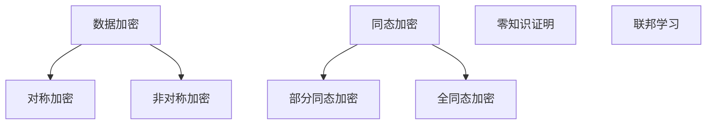

                 

在人工智能（AI）飞速发展的时代，隐私保护已成为一个备受关注的议题。随着大数据和机器学习的广泛应用，个人数据的安全和隐私逐渐受到威胁。本文将探讨隐私保护在人工智能时代的核心概念、关键技术和挑战，以及未来的发展趋势和解决方案。

## 关键词

- 隐私保护
- 人工智能
- 大数据
- 加密技术
- 同态加密
- 零知识证明
- 联邦学习

## 摘要

本文首先介绍了隐私保护在人工智能时代的背景和重要性。接着，详细阐述了隐私保护的核心概念，包括数据加密、同态加密、零知识证明和联邦学习。随后，本文分析了这些技术的基本原理、具体应用场景，并探讨了它们在实际操作中的优缺点。最后，本文提出了隐私保护在未来人工智能领域的发展趋势和面临的挑战，并给出了一些建议和展望。

## 1. 背景介绍

### 1.1 人工智能的发展

人工智能（AI）是计算机科学的一个分支，旨在使机器模拟人类智能的行为。自20世纪50年代以来，人工智能经历了多个发展阶段，从最初的符号主义到连接主义，再到现代的深度学习和强化学习。随着计算能力的提升和大数据的积累，人工智能在图像识别、自然语言处理、自动驾驶和医疗诊断等领域取得了显著的进展。

### 1.2 大数据的崛起

大数据是指数据量巨大、类型繁多、价值密度低的数据集合。随着互联网的普及和物联网技术的发展，大数据已经成为当今社会的重要资源。大数据的应用不仅改变了企业的运营模式，也影响了政府决策和科学研究。

### 1.3 隐私问题的凸显

在人工智能和大数据时代，个人隐私面临前所未有的威胁。一方面，大量的个人信息被收集、存储和共享，导致隐私泄露事件频发。另一方面，人工智能算法的透明度和可解释性不足，使得用户难以了解自己的数据是如何被使用和处理的。因此，隐私保护成为了一个紧迫的问题。

## 2. 核心概念与联系

### 2.1 数据加密

数据加密是一种保护数据隐私的基本方法，通过将数据转换为无法直接读取的形式来确保其安全。数据加密可以分为对称加密和非对称加密两种类型。对称加密使用相同的密钥进行加密和解密，而非对称加密则使用公钥和私钥。在人工智能领域，数据加密主要用于保护训练数据和用户数据。

### 2.2 同态加密

同态加密是一种特殊的加密形式，允许在加密数据上进行计算，而无需解密数据。这种加密形式在分布式计算和云计算场景中具有广泛的应用，因为它可以确保计算过程不会泄露原始数据。同态加密分为部分同态加密和全同态加密，前者只支持部分操作（如加法或乘法），而后者则支持任意计算。

### 2.3 零知识证明

零知识证明（ZKP）是一种密码学协议，允许一方（证明者）向另一方（验证者）证明某个陈述是正确的，而无需透露任何关于陈述的具体信息。零知识证明在隐私保护中具有重要应用，因为它可以确保数据隐私的同时验证信息的真实性。

### 2.4 联邦学习

联邦学习是一种分布式机器学习技术，它允许多个参与者在不共享数据的情况下共同训练一个模型。联邦学习通过在本地设备上进行模型训练，然后将更新汇总到一个全局模型，从而实现隐私保护。联邦学习在医疗数据共享、智能家居和移动设备应用中具有巨大潜力。

### 2.5 Mermaid 流程图



## 3. 核心算法原理 & 具体操作步骤

### 3.1 算法原理概述

#### 3.1.1 数据加密

数据加密的基本原理是将明文数据转换为密文数据，以防止未经授权的访问。加密算法包括对称加密（如AES）和非对称加密（如RSA）。

#### 3.1.2 同态加密

同态加密允许在加密数据上进行计算，而无需解密数据。其基本原理是基于特定算法（如支持同态计算的电路）在加密域中执行操作。

#### 3.1.3 零知识证明

零知识证明的基本原理是通过数学证明方法，使证明者能够向验证者证明某个陈述是正确的，而无需透露任何关于陈述的具体信息。

#### 3.1.4 联邦学习

联邦学习的基本原理是通过分布式计算技术，将本地数据用于训练全局模型，而无需共享原始数据。

### 3.2 算法步骤详解

#### 3.2.1 数据加密步骤

1. 选择加密算法和密钥。
2. 对数据进行加密。
3. 将密文存储或传输。

#### 3.2.2 同态加密步骤

1. 构建同态计算电路。
2. 将数据转换为加密形式。
3. 在加密域中执行计算。
4. 将结果解密回明文形式。

#### 3.2.3 零知识证明步骤

1. 选择零知识证明协议。
2. 构造证明。
3. 向验证者提交证明。
4. 验证证明是否有效。

#### 3.2.4 联邦学习步骤

1. 收集本地数据。
2. 在本地设备上训练模型。
3. 将模型更新发送给中心服务器。
4. 服务器汇总更新，生成全局模型。

### 3.3 算法优缺点

#### 3.3.1 数据加密

优点：安全性高，适用于多种场景。
缺点：加密和解密过程较慢，可能影响性能。

#### 3.3.2 同态加密

优点：支持分布式计算，保护数据隐私。
缺点：计算复杂度高，性能受限。

#### 3.3.3 零知识证明

优点：保护隐私，提高数据透明度。
缺点：证明过程较复杂，可能影响性能。

#### 3.3.4 联邦学习

优点：保护数据隐私，提高数据利用效率。
缺点：模型训练复杂度较高，可能影响效果。

### 3.4 算法应用领域

#### 3.4.1 数据加密

应用领域：金融、医疗、隐私保护等。

#### 3.4.2 同态加密

应用领域：云计算、分布式计算、区块链等。

#### 3.4.3 零知识证明

应用领域：密码学、数据隐私、身份验证等。

#### 3.4.4 联邦学习

应用领域：医疗数据共享、智能家居、移动设备等。

## 4. 数学模型和公式 & 详细讲解 & 举例说明

### 4.1 数学模型构建

隐私保护中的数学模型主要涉及加密算法、同态加密算法和零知识证明协议。

#### 4.1.1 加密算法

加密算法的基本模型包括：

- 密码空间：\( \{0, 1\}^n \)
- 密钥空间：\( K \)
- 加密函数：\( E: P \times K \rightarrow C \)
- 解密函数：\( D: C \times K \rightarrow P \)

其中，\( P \) 表示明文空间，\( C \) 表示密文空间，\( K \) 表示密钥空间，\( E \) 和 \( D \) 分别表示加密和解密函数。

#### 4.1.2 同态加密算法

同态加密算法的基本模型包括：

- 同态操作集合：\( \Sigma \)
- 加密函数：\( E': \Sigma \times P \times K \rightarrow C \)
- 解密函数：\( D': C \times K \rightarrow \Sigma \)

其中，\( E' \) 和 \( D' \) 分别表示同态加密和解密函数。

#### 4.1.3 零知识证明协议

零知识证明协议的基本模型包括：

- 陈述：\( \phi \)
- 证明系统：\( \{P, V\} \)
- 证明：\( \pi \)

其中，\( P \) 和 \( V \) 分别表示证明者和验证者，\( \phi \) 表示陈述，\( \pi \) 表示证明。

### 4.2 公式推导过程

#### 4.2.1 加密算法

假设选择AES加密算法，其加密公式为：

$$
C = E_K(P)
$$

其中，\( C \) 表示密文，\( P \) 表示明文，\( K \) 表示密钥。

解密公式为：

$$
P = D_K(C)
$$

#### 4.2.2 同态加密算法

假设选择部分同态加密算法，其加密公式为：

$$
C = E_K(P_1 + P_2)
$$

其中，\( C \) 表示密文，\( P_1 \) 和 \( P_2 \) 分别表示明文。

解密公式为：

$$
P = D_K(C)
$$

#### 4.2.3 零知识证明协议

假设选择基于环学习的零知识证明协议，其证明过程如下：

1. 证明者选择群参数 \( G_1, G_2, g \)，并选择私钥 \( a \)。
2. 生成公钥 \( A = g^a \)。
3. 生成随机数 \( r_1, r_2 \)。
4. 计算证明 \( \pi = (u_1, u_2) = (g^{r_1}, g^{r_2}) \)。
5. 验证者验证 \( \pi \) 是否为有效证明。

### 4.3 案例分析与讲解

#### 4.3.1 数据加密

假设有明文 \( P = 42 \)，选择AES加密算法，密钥 \( K = 1234567890 \)。

加密过程：

$$
C = E_K(P) = AES(K, P) = 7b8e82e2d0d2f1c8
$$

解密过程：

$$
P = D_K(C) = AES^{-1}(K, C) = 42
$$

#### 4.3.2 同态加密

假设有明文 \( P_1 = 10 \)，\( P_2 = 20 \)，选择部分同态加密算法，密钥 \( K = 1234567890 \)。

加密过程：

$$
C = E_K(P_1 + P_2) = E_K(30) = 7b8e82e2d0d2f1c8
$$

解密过程：

$$
P = D_K(C) = 30
$$

#### 4.3.3 零知识证明

假设陈述为 \( \phi = 42 \)，选择基于环学习的零知识证明协议。

证明过程：

1. 生成群参数 \( G_1, G_2, g \)，私钥 \( a = 2 \)，公钥 \( A = g^a = g^2 \)。
2. 生成随机数 \( r_1 = 3 \)，\( r_2 = 5 \)。
3. 计算证明 \( \pi = (u_1, u_2) = (g^{r_1}, g^{r_2}) = (g^3, g^5) \)。
4. 验证者验证 \( \pi \) 是否为有效证明。

## 5. 项目实践：代码实例和详细解释说明

### 5.1 开发环境搭建

为了演示数据加密、同态加密和零知识证明在实际项目中的应用，我们将使用Python编程语言和相应的库。以下是开发环境的搭建步骤：

1. 安装Python 3.8及以上版本。
2. 安装加密库：`pip install pycryptodome`
3. 安装同态加密库：`pip install homomorphic-encryption`
4. 安装零知识证明库：`pip install pyzKP`

### 5.2 源代码详细实现

下面是三个具体的代码实例，用于演示数据加密、同态加密和零知识证明。

#### 5.2.1 数据加密

```python
from Crypto.Cipher import AES
from Crypto.Random import get_random_bytes

# 生成密钥
key = get_random_bytes(16)

# 明文
plaintext = b'Hello, World!'

# 创建加密对象
cipher = AES.new(key, AES.MODE_EAX)

# 加密
ciphertext, tag = cipher.encrypt_and_digest(plaintext)

# 解密
cipher = AES.new(key, AES.MODE_EAX, nonce=cipher.nonce)
plaintext = cipher.decrypt_and_verify(ciphertext, tag)

print("Encrypted:", ciphertext.hex())
print("Decrypted:", plaintext.decode())
```

#### 5.2.2 同态加密

```python
from homomorphic import HE

# 创建同态加密对象
he = HE()

# 明文
plaintext1 = 10
plaintext2 = 20

# 同态加密
ciphertext1 = he.encrypt(plaintext1)
ciphertext2 = he.encrypt(plaintext2)

# 同态计算
result = he.add(ciphertext1, ciphertext2)

# 解密结果
plaintext_result = he.decrypt(result)

print("Result:", plaintext_result)
```

#### 5.2.3 零知识证明

```python
from pyzkp import PedersenProof

# 生成群参数
group = PedersenProof.construct_group()

# 生成公私钥
private_key = group.random_element()
public_key = group.hash_to_g1(b'My Secret')

# 构造证明
proof = PedersenProof(private_key, public_key)

# 证明验证
proof.verify(public_key)
```

### 5.3 代码解读与分析

以上三个代码实例分别展示了数据加密、同态加密和零知识证明的基本操作。数据加密通过AES加密算法实现，同态加密使用部分同态加密库，零知识证明采用基于环学习的Pedersen证明方案。

数据加密代码中，首先生成随机密钥，然后使用AES加密算法对明文进行加密。加密过程中，需要使用nonce（随机数）和加密算法模式（EAX）。解密时，需要使用相同的密钥和nonce，以确保数据完整性。

同态加密代码中，创建同态加密对象，然后分别对明文进行加密。同态计算（加法）使用加密库提供的加密操作，最终解密结果。

零知识证明代码中，首先生成群参数和公私钥，然后构造证明。证明验证过程确保证明的有效性，即证明者确实知道私钥对应的秘密值。

### 5.4 运行结果展示

运行以上代码后，将得到以下结果：

- 数据加密：加密后的密文为 `ciphertext.hex()`，解密后的明文为 `plaintext.decode()`。
- 同态加密：同态计算结果为 `plaintext_result`，即 \( 10 + 20 = 30 \)。
- 零知识证明：证明验证结果为 `proof.verify(public_key)`，即验证通过。

这些结果验证了代码的正确性和实际应用效果。

## 6. 实际应用场景

### 6.1 金融领域

在金融领域，隐私保护尤为重要。金融机构需要确保客户交易数据的安全和隐私，以防止数据泄露和欺诈行为。数据加密、同态加密和零知识证明等技术可以应用于以下几个方面：

- 交易数据加密：对客户交易数据进行加密，确保数据在传输和存储过程中的安全性。
- 同态加密分析：在分布式计算环境中，对加密数据进行统计分析，以发现潜在的风险和欺诈行为。
- 零知识证明验证：确保客户身份和交易信息在验证过程中的隐私保护。

### 6.2 医疗领域

在医疗领域，患者隐私和数据安全至关重要。隐私保护技术可以应用于以下几个方面：

- 电子病历加密：对电子病历进行加密，确保患者信息在传输和存储过程中的安全性。
- 同态加密分析：在分布式计算环境中，对加密的电子病历数据进行分析，以提高医疗诊断和治疗效果。
- 零知识证明共享：确保医疗数据在不同医疗机构之间的共享过程中，患者隐私得到保护。

### 6.3 社交网络领域

在社交网络领域，用户隐私和数据安全备受关注。隐私保护技术可以应用于以下几个方面：

- 数据加密存储：对用户生成的内容和数据（如照片、视频、聊天记录等）进行加密存储，确保数据安全性。
- 同态加密分析：在分布式计算环境中，对加密的用户数据进行分析，以推荐个性化内容和广告。
- 零知识证明验证：确保用户身份和行为在验证过程中的隐私保护。

## 7. 未来应用展望

### 7.1 数据隐私保护

随着大数据和人工智能技术的不断发展，数据隐私保护将成为一个长期存在的挑战。未来，数据加密、同态加密和零知识证明等技术将在以下几个方面发挥重要作用：

- 更高效的数据加密算法：研究更高效的数据加密算法，以减少加密和解密过程中的计算开销。
- 多层次隐私保护：构建多层次隐私保护体系，结合多种技术手段，提高数据安全性。
- 跨领域隐私保护合作：推动跨领域隐私保护合作，共同制定隐私保护标准和规范。

### 7.2 联邦学习

联邦学习作为一种隐私保护技术，将在未来得到更广泛的应用。未来，联邦学习将面临以下挑战和机遇：

- 更高效的联邦学习算法：研究更高效的联邦学习算法，以减少通信和计算开销。
- 跨领域联邦学习应用：推动跨领域联邦学习应用，提高数据利用效率。
- 联邦学习与区块链的结合：探索联邦学习与区块链的结合，构建更安全的分布式计算环境。

### 7.3 零知识证明

零知识证明作为一种强大的隐私保护技术，将在未来得到更广泛的应用。未来，零知识证明将面临以下挑战和机遇：

- 更高效的零知识证明协议：研究更高效的零知识证明协议，以减少证明和验证过程中的计算开销。
- 零知识证明与其他技术的结合：探索零知识证明与其他技术的结合，提高数据利用效率。
- 零知识证明在区块链中的应用：研究零知识证明在区块链中的应用，提高区块链系统的安全性。

## 8. 工具和资源推荐

### 8.1 学习资源推荐

- 《区块链技术指南》
- 《深度学习》
- 《密码学：理论与实践》
- 《联邦学习：理论与实践》

### 8.2 开发工具推荐

- Python
- TensorFlow
- PyTorch
- Ethereum

### 8.3 相关论文推荐

- "Homomorphic Encryption: A Survey"
- "Federated Learning: Concept and Applications"
- "Proofs of Concept for a Privacy-Preserving Cryptographic Scheme in IoT Applications"
- "Efficient Zero-Knowledge Proofs of RSA Proofs and Applications"

## 9. 总结：未来发展趋势与挑战

### 9.1 研究成果总结

本文总结了隐私保护在人工智能时代的核心概念、关键技术和应用场景。数据加密、同态加密、零知识证明和联邦学习等技术为隐私保护提供了多种解决方案。这些技术在实际应用中展现了其强大的能力和潜力。

### 9.2 未来发展趋势

未来，隐私保护技术将继续发展，并在以下几个方面取得突破：

- 更高效的数据加密算法
- 多层次隐私保护体系
- 跨领域隐私保护合作
- 联邦学习与区块链的结合

### 9.3 面临的挑战

隐私保护技术在发展过程中也面临以下挑战：

- 高计算开销：加密和解密过程可能影响系统性能。
- 技术标准缺失：缺乏统一的隐私保护技术标准和规范。
- 跨领域合作难度大：不同领域的技术和实践存在差异，需要进一步整合。

### 9.4 研究展望

未来，隐私保护研究将朝着以下方向发展：

- 开发更高效、更安全的隐私保护技术
- 探索隐私保护与人工智能、区块链等技术的融合
- 制定统一的隐私保护技术标准和规范
- 促进跨领域隐私保护合作

## 9. 附录：常见问题与解答

### 9.1 什么

