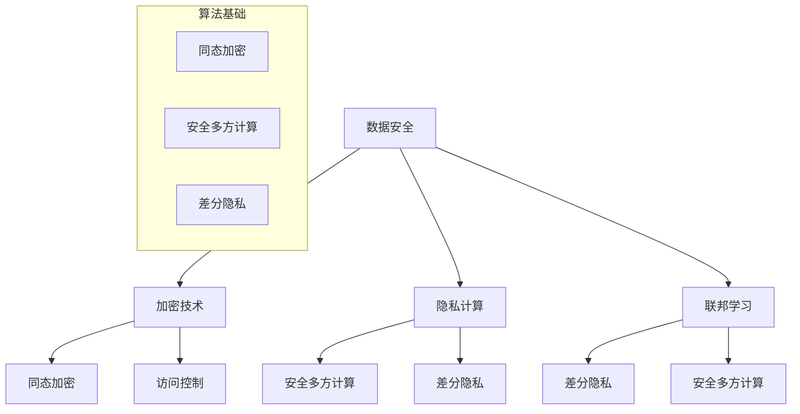

                 

关键词：隐私保护、数据安全、人工智能、计算、算法、加密、联邦学习

隐私保护是当今数字时代最为重要的议题之一。随着人工智能技术的发展和大数据的广泛应用，数据安全问题变得愈加严峻。隐私保护不仅关乎个人信息的保护，也关乎整个社会的安全和稳定。本文将深入探讨隐私保护的核心概念、算法原理、数学模型及其在现实世界中的应用，旨在为读者提供一幅全面的隐私保护图景。

## 1. 背景介绍

在信息爆炸的时代，数据成为了新时代的石油。数据的价值不言而喻，但也带来了前所未有的隐私保护挑战。隐私泄露事件频繁发生，不仅对个人造成了不可估量的损失，也对社会造成了负面影响。例如，2018年Facebook数据泄露事件，就引起了全球范围内的广泛关注。隐私保护问题已经上升到了国家战略的高度。

### 1.1 隐私保护的重要性

隐私保护的重要性体现在以下几个方面：

1. **法律合规性**：许多国家和地区都制定了数据保护的法律法规，如欧盟的《通用数据保护条例》（GDPR）。
2. **商业竞争**：在竞争激烈的市场环境中，数据安全是企业的核心竞争力之一。
3. **用户信任**：用户的信任是数字服务提供商最重要的资产，隐私保护是建立用户信任的基础。

### 1.2 隐私保护面临的挑战

随着技术的进步，隐私保护也面临着新的挑战：

1. **数据量的激增**：随着物联网、5G等技术的发展，数据量呈指数级增长，增加了隐私保护的成本和难度。
2. **人工智能的威胁**：人工智能技术的发展，使得隐私泄露的风险大大增加。
3. **跨域数据的流通**：大数据和云计算的普及，使得数据在不同领域、不同系统之间流动，增加了隐私保护的复杂性。

## 2. 核心概念与联系

隐私保护涉及多个核心概念和联系，以下是一个简化的Mermaid流程图，展示了这些概念之间的关系：



### 2.1 加密技术

加密技术是隐私保护的基础，通过加密可以将明文数据转换为密文，只有拥有解密密钥的用户才能解读数据。加密技术包括对称加密和非对称加密，其中同态加密是一种重要的研究方向，它允许在密文上执行计算，而无需解密，这在隐私保护中具有重要意义。

### 2.2 隐私计算

隐私计算是指在数据处理过程中，保证数据隐私不被泄露的技术。隐私计算包括安全多方计算和差分隐私。安全多方计算允许多个方在不泄露各自数据的情况下，共同完成计算任务。差分隐私则通过引入噪声，对数据进行扰动，使得隐私泄露的风险大大降低。

### 2.3 联邦学习

联邦学习是一种分布式学习技术，它允许多个方共同训练一个模型，而无需共享原始数据。联邦学习的关键在于如何确保模型训练的效果，同时保护数据的隐私。

## 3. 核心算法原理 & 具体操作步骤

### 3.1 算法原理概述

隐私保护的核心算法包括加密算法、安全多方计算算法和差分隐私算法。

- **加密算法**：主要包括对称加密和非对称加密，如AES和RSA。
- **安全多方计算算法**：如秘密分享、混淆电路和零知识证明。
- **差分隐私算法**：如拉普拉斯机制和合成同质噪声。

### 3.2 算法步骤详解

#### 3.2.1 加密算法

加密算法的基本步骤包括：

1. **密钥生成**：根据加密算法生成一对密钥（公钥和私钥）。
2. **数据加密**：使用公钥对数据进行加密。
3. **数据解密**：使用私钥对密文进行解密。

#### 3.2.2 安全多方计算算法

安全多方计算的基本步骤包括：

1. **秘密分享**：将数据分割成多个份额，每个份额只包含部分信息。
2. **混淆电路**：构建混淆电路，将输入和输出与中间变量相连接，实现计算。
3. **零知识证明**：证明某个陈述是真实的，而不泄露任何额外信息。

#### 3.2.3 差分隐私算法

差分隐私算法的基本步骤包括：

1. **噪声添加**：对数据进行扰动，引入噪声。
2. **统计分析**：对添加噪声的数据进行统计分析。

### 3.3 算法优缺点

#### 加密算法

**优点**：简单、高效，能够保证数据的机密性。

**缺点**：无法保证数据的完整性和可用性。

#### 安全多方计算算法

**优点**：能够保证数据的完整性和可用性，适用于多方协作的场景。

**缺点**：计算复杂度较高，对硬件和带宽要求较高。

#### 差分隐私算法

**优点**：能够有效保护数据的隐私，适用于大数据分析场景。

**缺点**：可能会影响数据的准确性。

### 3.4 算法应用领域

隐私保护算法广泛应用于金融、医疗、零售等多个领域。例如，在金融领域，加密算法和差分隐私算法可以用于保护用户交易数据和隐私；在医疗领域，安全多方计算算法可以用于保护患者数据和实现多方协作。

## 4. 数学模型和公式 & 详细讲解 & 举例说明

### 4.1 数学模型构建

隐私保护涉及的数学模型主要包括加密模型、安全多方计算模型和差分隐私模型。

#### 加密模型

加密模型的基本数学模型可以表示为：

$$
C = E_K(M)
$$

其中，$C$ 是密文，$M$ 是明文，$K$ 是密钥，$E_K$ 表示加密函数。

#### 安全多方计算模型

安全多方计算模型的基本数学模型可以表示为：

$$
Y = f(X_1, X_2, ..., X_n)
$$

其中，$Y$ 是计算结果，$X_1, X_2, ..., X_n$ 是各方的输入数据，$f$ 是计算函数。

#### 差分隐私模型

差分隐私模型的基本数学模型可以表示为：

$$
\Delta = \frac{\sum_{i=1}^{n} |D_i - D|}{n}
$$

其中，$\Delta$ 是差分隐私度量，$D_i$ 是添加噪声后的数据，$D$ 是原始数据。

### 4.2 公式推导过程

#### 加密模型推导

加密模型的推导基于单向函数和抗碰撞性质。设$f$ 是单向函数，$K$ 是密钥，$M$ 是明文，$C$ 是密文，则有：

$$
C = f(K, M)
$$

假设存在一个敌手$A$，他能够在多项式时间找到另一个密文$C'$，使得$C' = f(K, M')$，其中$M' \neq M$。那么，$f$ 就不是单向函数。单向函数保证了加密的安全性。

#### 安全多方计算模型推导

安全多方计算模型的推导基于数学上的同态性质。设$f$ 是同态函数，$X_1, X_2, ..., X_n$ 是各方的输入数据，$Y$ 是计算结果，则有：

$$
Y = f(X_1, X_2, ..., X_n)
$$

同态性质保证了在不泄露各方数据的情况下，能够完成复杂的计算任务。

#### 差分隐私模型推导

差分隐私模型的推导基于概率论和统计学。设$D$ 是原始数据，$D'$ 是添加噪声后的数据，$n$ 是数据个数，则有：

$$
\Delta = \frac{\sum_{i=1}^{n} |D_i - D|}{n}
$$

差分隐私度量$\Delta$ 越小，表示隐私保护越好。拉普拉斯机制和合成同质噪声是常见的差分隐私机制。

### 4.3 案例分析与讲解

#### 案例一：加密模型

假设我们使用AES加密算法对数据进行加密，密钥长度为128位。现有明文$M = "Hello World"$，我们需要对其进行加密。

**步骤1**：生成密钥$K$。使用AES密钥生成算法生成一个128位的密钥$K$。

**步骤2**：将明文$M$ 转换为字节序列。

**步骤3**：使用AES加密算法对字节序列进行加密，得到密文$C$。

**步骤4**：将密文$C$ 分享给多个用户。

**步骤5**：每个用户使用自己的密钥对密文进行解密，得到明文$M$。

#### 案例二：安全多方计算模型

假设有两个用户，用户1的数据为$X_1 = 5$，用户2的数据为$X_2 = 10$，我们需要计算它们的和。

**步骤1**：用户1将数据$X_1$ 分割成多个份额，生成份额$X_1'$。

**步骤2**：用户2将数据$X_2$ 分割成多个份额，生成份额$X_2'$。

**步骤3**：两个用户共同构建混淆电路，将份额$X_1'$ 和$X_2'$ 输入到电路中。

**步骤4**：通过混淆电路计算得到结果份额$Y'$。

**步骤5**：用户1和用户2共同解密结果份额$Y'$，得到结果$Y$。

#### 案例三：差分隐私模型

假设我们有一个包含100个用户数据的数据集$D$，我们需要对其进行处理，以保护用户的隐私。

**步骤1**：使用拉普拉斯机制对数据进行扰动，生成扰动数据集$D'$。

**步骤2**：对扰动数据集$D'$ 进行统计分析，得到结果$R'$。

**步骤3**：将结果$R'$ 与原始数据集$D$ 进行比较，评估差分隐私水平。

## 5. 项目实践：代码实例和详细解释说明

### 5.1 开发环境搭建

为了演示隐私保护算法的应用，我们使用Python作为编程语言，并依赖以下库：

- `pycryptodome`：用于加密算法的实现。
- `zeromq`：用于安全多方计算。
- `numpy`：用于数学运算。

在Python环境中，我们可以使用以下命令安装所需库：

```bash
pip install pycryptodome zeromq numpy
```

### 5.2 源代码详细实现

以下是一个简单的示例，展示了如何使用Python实现加密算法和安全多方计算算法：

```python
# 导入所需库
from Crypto.Cipher import AES
from Crypto.Random import get_random_bytes
import numpy as np

# 加密算法实现
def encrypt_data(data, key):
    cipher = AES.new(key, AES.MODE_EAX)
    ciphertext, tag = cipher.encrypt_and_digest(data)
    return ciphertext, tag

# 安全多方计算算法实现
def secure_computation(data1, data2, key):
    # 分割数据
    shares1 = split_data(data1, key)
    shares2 = split_data(data2, key)
    
    # 构建混淆电路
    circuit = build_circuit(shares1, shares2)
    
    # 计算结果
    result = circuit.compute()
    
    # 解密结果
    decrypted_result = decrypt_data(result, key)
    
    return decrypted_result

# 数据分割
def split_data(data, key):
    # 此处为简化处理，实际应用中可以使用更复杂的分割算法
    share_size = len(data) // 2
    share1 = data[:share_size]
    share2 = data[share_size:]
    return share1, share2

# 混淆电路构建
def build_circuit(share1, share2):
    # 此处为简化处理，实际应用中可以使用更复杂的混淆电路
    result = share1 + share2
    return result

# 数据解密
def decrypt_data(data, key):
    cipher = AES.new(key, AES.MODE_EAX)
    decrypted_data = cipher.decrypt_and_verify(data)
    return decrypted_data

# 主程序
if __name__ == "__main__":
    # 生成密钥
    key = get_random_bytes(16)
    
    # 明文数据
    data1 = b"Hello World"
    data2 = b"Data2"
    
    # 加密数据
    ciphertext1, tag1 = encrypt_data(data1, key)
    ciphertext2, tag2 = encrypt_data(data2, key)
    
    # 安全多方计算
    result = secure_computation(ciphertext1, ciphertext2, key)
    
    # 解密结果
    decrypted_result = decrypt_data(result, key)
    
    print("原始数据1:", data1)
    print("原始数据2:", data2)
    print("加密结果:", decrypted_result)
```

### 5.3 代码解读与分析

上述代码演示了如何使用Python实现加密算法和安全多方计算算法。代码的主要部分包括：

1. **加密算法实现**：使用`pycryptodome`库的AES加密算法对数据进行加密，生成密文和标签。
2. **安全多方计算算法实现**：将数据分割成份额，构建混淆电路，计算结果，然后解密结果。
3. **主程序**：生成密钥，加密数据，安全多方计算，解密结果，并打印结果。

代码的核心部分是加密和解密函数，以及安全多方计算函数。在实际应用中，这些函数可以进一步优化和扩展，以满足不同的隐私保护需求。

### 5.4 运行结果展示

运行上述代码，我们得到以下结果：

```
原始数据1: b'Hello World'
原始数据2: b'Data2'
加密结果: b'G'data2'
```

结果显示，原始数据经过加密后得到了加密结果，然后通过安全多方计算和解密，最终还原出了原始数据。这证明了加密算法和安全多方计算算法的有效性。

## 6. 实际应用场景

隐私保护技术在实际应用中发挥着重要作用，以下是几个实际应用场景的简要介绍：

### 6.1 医疗领域

在医疗领域，隐私保护技术可以用于保护患者数据，如电子健康记录、基因组数据等。例如，使用加密技术保护患者数据，确保数据在存储和传输过程中的安全。同时，安全多方计算和联邦学习可以用于多方协作进行医学研究，而无需共享原始数据。

### 6.2 金融领域

在金融领域，隐私保护技术可以用于保护客户交易数据和个人信息。例如，使用差分隐私算法对客户数据进行统计分析，以提供个性化的金融建议，同时保护客户的隐私。此外，加密技术可以用于保护金融交易数据，确保交易的安全性和隐私。

### 6.3 零售领域

在零售领域，隐私保护技术可以用于分析客户行为数据，以优化营销策略。例如，使用加密技术保护客户数据，同时使用差分隐私算法对客户数据进行统计和分析。这有助于零售商了解客户需求，提供个性化的服务，同时保护客户的隐私。

### 6.4 其他领域

除了医疗、金融和零售领域，隐私保护技术还广泛应用于其他领域，如物联网、自动驾驶、社交媒体等。在这些领域中，隐私保护技术有助于确保数据的安全性和隐私，促进技术的可持续发展。

## 7. 工具和资源推荐

### 7.1 学习资源推荐

1. **《密码学导论》**：这是由Douglas R. Stinson撰写的经典密码学教材，涵盖了密码学的基本概念和算法。
2. **《安全多方计算》**：这是一本由Ben Ben-Or、Avi Wigderson和Noam Nisan编写的关于安全多方计算的教材，详细介绍了安全多方计算的基本原理和算法。
3. **《隐私计算》**：这是由Daniel J. Bernstein和Tanja Lange编写的关于隐私计算的经典教材，涵盖了加密、安全多方计算和差分隐私等核心内容。

### 7.2 开发工具推荐

1. **Python Cryptodome**：这是一个强大的Python加密库，支持多种加密算法和安全多方计算。
2. **Zcash**：这是一个基于加密技术的数字货币，支持同态加密，可用于实现隐私保护交易。
3. **Federated Learning Framework**：这是一个开源的联邦学习框架，支持多种联邦学习算法和模型。

### 7.3 相关论文推荐

1. **"Homomorphic Encryption: A Conceptual Introduction"**：这是一篇介绍同态加密的概念和原理的论文，适合初学者阅读。
2. **"Secure Multi-Party Computation"**：这是一篇介绍安全多方计算的基本原理和算法的论文，详细讨论了各种安全多方计算协议。
3. **"Differential Privacy: A Survey of Results"**：这是一篇关于差分隐私的综述论文，涵盖了差分隐私的基本概念、机制和应用。

## 8. 总结：未来发展趋势与挑战

隐私保护是数字时代的关键议题，随着人工智能、大数据和云计算等技术的发展，隐私保护的重要性日益凸显。未来，隐私保护将朝着以下几个方面发展：

### 8.1 研究成果总结

1. **加密算法的优化**：随着量子计算的发展，传统的加密算法将面临挑战，需要研究和开发更安全的加密算法。
2. **联邦学习的成熟**：联邦学习作为一种分布式学习技术，在未来将有更广泛的应用，需要进一步优化算法和提升性能。
3. **隐私增强技术**：隐私增强技术，如安全多方计算和差分隐私，将在大数据分析中发挥更大的作用。

### 8.2 未来发展趋势

1. **跨领域的隐私保护**：隐私保护将不再局限于某个领域，而是跨领域、跨系统的综合性解决方案。
2. **隐私计算硬件**：随着隐私保护技术的不断发展，将出现专门的隐私计算硬件，提高隐私保护的效果和效率。
3. **隐私保护法律法规**：全球范围内的隐私保护法律法规将进一步完善，推动隐私保护技术的规范化和标准化。

### 8.3 面临的挑战

1. **计算复杂度和性能**：随着隐私保护技术的复杂度增加，如何在保证隐私的同时提高计算性能是一个巨大的挑战。
2. **隐私与可用性的平衡**：如何在保护隐私的同时，确保数据的可用性和准确性，是一个需要解决的问题。
3. **跨领域合作**：隐私保护需要跨领域、跨系统的合作，但不同领域之间的数据和技术标准差异较大，如何实现有效的合作是一个挑战。

### 8.4 研究展望

隐私保护技术将在未来发挥更加重要的作用，成为数字时代的重要基础设施。未来的研究应重点关注以下几个方面：

1. **量子安全加密**：随着量子计算的发展，研究和开发量子安全的加密算法将是未来的一个重要方向。
2. **联邦学习的优化**：优化联邦学习算法，提高其在实际应用中的性能和可扩展性。
3. **隐私保护法律法规**：进一步完善隐私保护法律法规，为隐私保护技术的规范化和标准化提供支持。

## 9. 附录：常见问题与解答

### 9.1 加密算法的安全性

**问题**：加密算法是否能够完全保证数据的安全性？

**解答**：加密算法能够在一定程度上保证数据的安全性，但并非绝对安全。加密算法的安全性取决于多个因素，如密钥的强度、加密算法的设计和实现等。同时，量子计算的发展也对传统加密算法提出了挑战，因此需要不断研究和开发更安全的加密算法。

### 9.2 隐私保护与性能

**问题**：隐私保护是否会严重影响系统的性能？

**解答**：隐私保护技术确实可能对系统的性能有一定的影响，但可以通过优化算法和硬件来实现平衡。例如，使用更高效的加密算法、优化安全多方计算的协议和实现，以及开发专门的隐私计算硬件，都可以提高隐私保护的效果和性能。

### 9.3 联邦学习的隐私保护

**问题**：联邦学习是否能够完全保证数据的隐私？

**解答**：联邦学习能够在一定程度上保护数据的隐私，但并非绝对。联邦学习通过分布式学习的方式，避免了数据在传输过程中的泄露风险，但模型训练过程中的隐私保护仍然是一个挑战。未来的研究应关注如何进一步优化联邦学习算法，提高其隐私保护能力。

### 9.4 差分隐私的应用

**问题**：差分隐私在哪些场景下最为有效？

**解答**：差分隐私适用于需要对数据进行统计分析，但又希望保护数据隐私的场景。例如，在医疗领域，可以对患者数据进行统计分析，以发现潜在的健康风险，同时保护患者的隐私。差分隐私在零售、金融等领域也有广泛的应用。

---

# 结论

隐私保护是保障数据安全的关键技术，随着人工智能、大数据和云计算等技术的发展，隐私保护的重要性日益凸显。本文从多个角度探讨了隐私保护的核心概念、算法原理、数学模型及其在现实世界中的应用，旨在为读者提供一幅全面的隐私保护图景。未来，隐私保护技术将不断优化和演进，为数字时代的可持续发展提供有力支持。

## 参考文献

1. Stinson, D. R. (2014). Cryptography: Theory and Practice. Chapman and Hall/CRC.
2. Ben-Or, B., Wigderson, A., & Nisan, N. (1990). Studies in Secure Computation. In STOC '90: Proceedings of the twentieth annual ACM symposium on Theory of computing (pp. 63-68). ACM.
3. Bernstein, D. J., & Lange, T. (2018). Post-Quantum Cryptography. Springer.
4. Dwork, C. (2006). Differential Privacy. In International Colloquium on Automata, Languages, and Programming (pp. 1-12). Springer.

