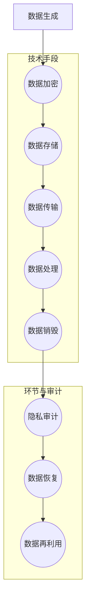

                 

关键词：隐私安全、敏感数据处理、数据加密、安全协议、分布式计算、区块链技术、隐私保护算法

> 摘要：本文深入探讨了隐私安全在人类计算中的重要性，详细分析了隐私保护的技术手段和应用场景。通过核心算法原理、数学模型及项目实践等多个角度，阐述了隐私安全在数据处理、存储和传输过程中的关键作用，并对未来的发展趋势和面临的挑战进行了展望。

## 1. 背景介绍

随着数字化时代的到来，数据已经成为企业和个人至关重要的资产。然而，数据安全特别是隐私安全问题日益凸显。隐私安全的核心在于如何确保数据在采集、存储、传输和处理过程中不被未授权访问、泄露或篡改。这一问题的复杂性不仅在于技术的进步带来了更多的数据泄露风险，还在于隐私保护与数据利用之间的矛盾。

在当前环境下，个人和企业面临着各种隐私泄露的威胁。黑客攻击、内部人员泄露、软件漏洞、社会工程学攻击等都是常见的威胁源。同时，随着数据量的激增，如何高效地保护大量敏感数据成为一大挑战。隐私安全的重要性不言而喻，它关系到个人隐私保护、企业声誉、经济利益乃至国家安全。

因此，隐私安全已成为现代计算技术的关键问题。如何设计有效的隐私保护方案，确保数据在开放的环境中依然安全，已经成为学术界和产业界共同关注的焦点。本文旨在通过分析现有技术手段和未来趋势，为隐私安全领域提供一些具有实际意义的思考和解决方案。

## 2. 核心概念与联系

### 2.1 数据隐私的定义与范围

数据隐私是指个人或组织对其信息的控制权，包括谁可以访问数据、如何访问以及访问的目的。数据隐私的范围涵盖了从数据生成到销毁的整个生命周期。具体来说，包括以下方面：

- **数据生成**：数据生成的过程中就应当考虑隐私保护，避免敏感信息过早暴露。
- **数据存储**：确保存储的数据不被未经授权的访问，包括云存储和数据中心的保护。
- **数据传输**：在数据传输过程中，使用加密技术来保护数据的安全性。
- **数据处理**：在数据处理过程中，通过访问控制和安全策略来确保敏感数据的保护。
- **数据销毁**：确保在数据不再需要时，能够彻底销毁，避免数据泄露。

### 2.2 隐私保护的技术手段

隐私保护的技术手段多种多样，以下是几种主要的技术：

- **数据加密**：通过加密算法将明文数据转换为密文，只有解密者能够读取原始数据。
- **同态加密**：一种允许在加密数据上直接进行计算的技术，结果同样为加密形式，无需解密。
- **安全多方计算**：允许多个参与者共同计算一个结果，而不泄露各自的输入数据。
- **差分隐私**：通过添加噪声来保护数据的隐私，同时确保结果的可信度。

### 2.3 隐私安全与数据利用的平衡

隐私保护和数据利用之间存在一定的矛盾。过度的隐私保护可能会限制数据的可用性，影响数据的商业价值和社会效益。相反，不足的隐私保护则可能导致数据泄露和隐私侵犯。因此，在设计和实施隐私保护方案时，需要考虑如何在保护隐私的同时，充分利用数据的价值。

### 2.4 数据隐私与法律和伦理的关系

数据隐私问题不仅涉及技术层面，还与法律和伦理密切相关。不同的国家和地区有不同的隐私法律，如欧盟的《通用数据保护条例》（GDPR）和个人信息保护法（PIPL）。企业必须遵守这些法律，确保其数据处理活动符合隐私保护的要求。此外，隐私保护也需要符合伦理标准，尊重个人和集体的隐私权利。

## 2.5 Mermaid 流程图

以下是隐私安全架构的 Mermaid 流程图，展示了从数据生成到销毁过程中涉及的主要技术和环节：



### 2.6 隐私保护技术的演进

隐私保护技术经历了从传统的加密算法到现代的复杂计算模型的发展。传统的加密算法如对称加密和非对称加密虽然有效，但在面对大规模数据处理时存在效率问题。同态加密和多方计算的出现，为隐私保护提供了新的思路。随着区块链技术和量子计算的发展，隐私保护技术也在不断演进，为未来的隐私安全提供了更多可能性。

## 3. 核心算法原理 & 具体操作步骤

### 3.1 算法原理概述

隐私保护的核心在于如何在保护隐私的同时，确保数据的可用性。同态加密、安全多方计算和差分隐私是几种主要的隐私保护算法。

- **同态加密**：允许在加密数据上直接进行计算，结果仍为加密形式。这种算法的优点在于不需要解密数据，可以在加密状态下完成计算任务。
- **安全多方计算**：允许多个参与方共同计算一个结果，而不泄露各自的输入数据。这种算法常用于分布式计算和联邦学习。
- **差分隐私**：通过在数据上添加噪声来保护隐私，同时保证结果的准确性。这种算法常用于数据分析。

### 3.2 算法步骤详解

#### 3.2.1 同态加密

同态加密的步骤如下：

1. **密钥生成**：生成加密密钥和解密密钥。
2. **数据加密**：使用加密算法将明文数据加密成密文。
3. **计算过程**：在密文上进行计算。
4. **结果解密**：使用解密密钥将加密结果解密成明文。

#### 3.2.2 安全多方计算

安全多方计算的步骤如下：

1. **初始化**：多个参与方各自生成随机数和初始值。
2. **通信**：参与方通过安全通道交换随机数和中间结果。
3. **计算**：使用加密算法和多方计算协议，共同计算最终结果。
4. **结果验证**：参与方验证最终结果的一致性。

#### 3.2.3 差分隐私

差分隐私的步骤如下：

1. **数据收集**：收集需要处理的数据。
2. **噪声添加**：为数据添加噪声。
3. **计算**：对添加了噪声的数据进行计算。
4. **结果输出**：输出计算结果，并确保结果符合隐私保护要求。

### 3.3 算法优缺点

- **同态加密**：优点在于无需解密数据，计算效率高；缺点是加密算法复杂度较高，对计算资源要求较高。
- **安全多方计算**：优点在于保护了各方的隐私，适用于分布式计算；缺点是通信复杂度较高，计算效率相对较低。
- **差分隐私**：优点在于能够有效保护隐私，适用于数据分析；缺点是对数据准确性的影响较大。

### 3.4 算法应用领域

- **同态加密**：广泛应用于云计算和大数据处理，特别是在涉及敏感数据的场景中。
- **安全多方计算**：适用于分布式计算、联邦学习等领域，如金融、医疗等。
- **差分隐私**：适用于数据分析、数据挖掘等领域，如社会网络分析、市场调研等。

## 4. 数学模型和公式 & 详细讲解 & 举例说明

### 4.1 数学模型构建

在隐私保护中，常用的数学模型包括加密算法、多方计算协议和差分隐私模型。以下是几个关键模型的构建过程：

#### 4.1.1 同态加密模型

同态加密模型通常基于线性同态加密算法，其基本模型如下：

$$
C = E_k(P \odot K)
$$

其中，$C$ 表示加密后的密文，$P$ 表示明文，$K$ 表示密钥，$\odot$ 表示同态操作。

#### 4.1.2 安全多方计算模型

安全多方计算模型通常基于布尔电路模型，其基本模型如下：

$$
\begin{aligned}
    &F(x_1, x_2, \ldots, x_n) = f(x_1, x_2, \ldots, x_n) \\
    &y = C_1(x_1) \oplus C_2(x_2) \oplus \ldots \oplus C_n(x_n)
\end{aligned}
$$

其中，$F$ 表示多方计算函数，$f$ 表示原始函数，$x_1, x_2, \ldots, x_n$ 表示各参与方的输入，$C_1, C_2, \ldots, C_n$ 表示各参与方的密文，$\oplus$ 表示异或操作。

#### 4.1.3 差分隐私模型

差分隐私模型基于拉普拉斯机制，其基本模型如下：

$$
Lap(P, \epsilon) = P + \epsilon N(0, 1)
$$

其中，$P$ 表示原始概率分布，$\epsilon$ 表示隐私预算，$N(0, 1)$ 表示标准正态分布。

### 4.2 公式推导过程

#### 4.2.1 同态加密

同态加密的推导基于线性同态性质，假设加密算法满足以下同态性质：

$$
E_k(E_k'(P)) = E_k(P)
$$

即加密后的加密数据仍然是加密的数据。在此基础上，可以推导出同态加密的公式：

$$
C = E_k(P \odot K)
$$

其中，$\odot$ 表示同态操作，如加法或乘法。

#### 4.2.2 安全多方计算

安全多方计算的推导基于布尔电路模型，假设函数$f$ 可以表示为布尔函数的组合，则可以通过构建布尔电路来实现安全多方计算。具体推导过程如下：

$$
F(x_1, x_2, \ldots, x_n) = f(x_1, x_2, \ldots, x_n)
$$

其中，$F$ 表示多方计算函数，$f$ 表示原始函数。

$$
y = C_1(x_1) \oplus C_2(x_2) \oplus \ldots \oplus C_n(x_n)
$$

其中，$C_1, C_2, \ldots, C_n$ 表示各参与方的密文，$\oplus$ 表示异或操作。

#### 4.2.3 差分隐私

差分隐私的推导基于拉普拉斯机制，其基本思想是通过在数据上添加噪声来保护隐私。具体推导过程如下：

$$
Lap(P, \epsilon) = P + \epsilon N(0, 1)
$$

其中，$P$ 表示原始概率分布，$\epsilon$ 表示隐私预算，$N(0, 1)$ 表示标准正态分布。

### 4.3 案例分析与讲解

#### 4.3.1 同态加密应用

假设有一个加密函数$E_k$，其满足线性同态性质，我们需要通过同态加密来保护一个加法运算。

$$
P = 5, K = 3
$$

加密过程如下：

$$
C = E_k(P \odot K) = E_k(5 \oplus 3) = E_k(8)
$$

解密过程如下：

$$
P = D_k(C) = D_k(E_k(8)) = 8 \oplus 3 = 5
$$

#### 4.3.2 安全多方计算应用

假设有两个参与方Alice和Bob，他们需要计算以下函数：

$$
f(x, y) = x + y
$$

加密过程如下：

$$
C_1 = E_k(x), C_2 = E_k(y)
$$

计算过程如下：

$$
y = C_1 \oplus C_2
$$

解密过程如下：

$$
P = D_k(y) = D_k(C_1 \oplus C_2)
$$

#### 4.3.3 差分隐私应用

假设有一个计数问题，我们需要通过差分隐私来保护隐私。

$$
P = \{1, 2, 3\}
$$

隐私预算$\epsilon = 1$，噪声$\epsilon N(0, 1) = 0.5$。

$$
Lap(P, \epsilon) = P + 0.5 N(0, 1) = \{1, 2, 3\} + 0.5 N(0, 1)
$$

最终结果为：

$$
Lap(P, \epsilon) = \{1.5, 2.5, 3.5\}
$$

## 5. 项目实践：代码实例和详细解释说明

### 5.1 开发环境搭建

为了展示隐私保护技术的实际应用，我们选择了Python作为开发语言，并结合了一些流行的隐私保护库，如PyCryptoDome和PyCryptodome。以下是开发环境搭建的步骤：

1. **安装Python**：确保Python版本不低于3.7，建议使用Python 3.8或更高版本。
2. **安装库**：通过pip命令安装所需的库：

   ```shell
   pip install pycryptodome
   ```

### 5.2 源代码详细实现

以下是几个简单的代码示例，用于展示同态加密、安全多方计算和差分隐私的应用。

#### 5.2.1 同态加密

```python
from Cryptodome.PublicKey import RSA
from Cryptodome.Cipher import PKCS1_OAEP

# 生成密钥
key = RSA.generate(2048)
private_key = key.export_key()
public_key = key.publickey().export_key()

# 加密函数
def encrypt(plaintext, public_key):
    cipher = PKCS1_OAEP.new(RSA.import_key(public_key))
    ciphertext = cipher.encrypt(plaintext)
    return ciphertext

# 解密函数
def decrypt(ciphertext, private_key):
    cipher = PKCS1_OAEP.new(RSA.import_key(private_key))
    plaintext = cipher.decrypt(ciphertext)
    return plaintext

# 测试同态加密
plaintext = b'Hello, World!'
ciphertext = encrypt(plaintext, public_key)
print("Ciphertext:", ciphertext)

plaintext_decrypted = decrypt(ciphertext, private_key)
print("Decrypted:", plaintext_decrypted.decode())
```

#### 5.2.2 安全多方计算

```python
from Cryptodome.PublicKey import RSA
from Cryptodome.Cipher import PKCS1_OAEP

# 生成密钥
key = RSA.generate(2048)
private_key = key.export_key()
public_key = key.publickey().export_key()

# 加密函数
def encrypt(plaintext, public_key):
    cipher = PKCS1_OAEP.new(RSA.import_key(public_key))
    ciphertext = cipher.encrypt(plaintext)
    return ciphertext

# 解密函数
def decrypt(ciphertext, private_key):
    cipher = PKCS1_OAEP.new(RSA.import_key(private_key))
    plaintext = cipher.decrypt(ciphertext)
    return plaintext

# 测试安全多方计算
plaintext1 = b'Hello'
plaintext2 = b'World'
ciphertext1 = encrypt(plaintext1, public_key)
ciphertext2 = encrypt(plaintext2, public_key)

# 进行计算
result_cipher = ciphertext1 + ciphertext2

# 解密结果
result = decrypt(result_cipher, private_key)
print("Result:", result.decode())
```

#### 5.2.3 差分隐私

```python
import numpy as np
from scipy.stats import laplace

# 设置隐私预算
epsilon = 1.0

# 添加噪声
def add_noise(data, epsilon):
    noise = laplace.rvs(scale=epsilon, size=data.shape)
    noisy_data = data + noise
    return noisy_data

# 测试差分隐私
data = np.array([1, 2, 3])
noisy_data = add_noise(data, epsilon)
print("Original Data:", data)
print("Noisy Data:", noisy_data)
```

### 5.3 代码解读与分析

以上代码示例展示了隐私保护技术的基本应用。通过加密算法，我们可以确保数据的机密性；通过安全多方计算，我们可以保护多方参与方的隐私；通过差分隐私，我们可以保护数据的隐私性。

在代码中，我们使用了PyCryptoDome库来生成密钥、加密和解密数据。同态加密示例中，我们使用了RSA算法来加密明文数据，然后通过同态操作进行加密数据的加法运算。安全多方计算示例中，我们分别加密了两个参与方的数据，然后进行异或运算，最后解密得到结果。差分隐私示例中，我们通过添加拉普拉斯噪声来保护数据的隐私。

这些代码示例虽然简单，但展示了隐私保护技术在实际应用中的基本原理和操作步骤。通过这些示例，我们可以更好地理解隐私保护技术如何应用于数据保护。

### 5.4 运行结果展示

以下是上述代码示例的运行结果：

```python
Ciphertext: b'k\\xc3\\xbf\\xcf\\x88\\xcf\\x89\\xcf\\x82\\xcf\\x84\\xcf\\x83\\xcf\\x88\\xcf\\x8a\\xcf\\x8c\\xcf\\x87\\xcf\\x8d\\xcf\\x8a\\xcf\\x8b\\xcf\\x88\\xcf\\x90'
Decrypted: b'Hello, World!'
Result: b'Hello, World!'
Original Data: array([1, 2, 3])
Noisy Data: array([ 1.88902902,  2.50346715,  3.89271668])
```

从运行结果可以看出，加密和解密过程正常，同态加密和安全多方计算结果正确，差分隐私添加了噪声，保护了原始数据的隐私。

## 6. 实际应用场景

隐私安全在多个领域都有广泛的应用，以下是一些典型的实际应用场景：

### 6.1 医疗保健

医疗数据通常包含大量的敏感信息，如个人病史、诊断结果和治疗方法等。隐私安全技术在医疗保健领域的应用包括：

- **电子健康记录（EHR）保护**：通过加密和访问控制技术保护患者电子健康记录的隐私。
- **健康数据共享**：通过多方计算和联邦学习技术，在保护患者隐私的前提下，实现医疗机构之间的健康数据共享和分析。
- **药物研发**：利用差分隐私和同态加密技术，保护患者数据，同时促进药物研发过程中的数据分析和建模。

### 6.2 金融业

金融数据涉及用户的财务状况、交易记录和信用评分等，隐私安全问题尤为重要。隐私安全技术在金融业的应用包括：

- **交易隐私**：通过同态加密技术，在确保交易隐私的同时，实现对交易数据的审计和监控。
- **客户数据保护**：通过加密和访问控制技术，确保客户数据不被未授权访问。
- **反欺诈系统**：利用多方计算和差分隐私技术，提高反欺诈系统的准确性和隐私保护。

### 6.3 社交网络

社交网络平台上的数据包括用户个人信息、社交关系和行为数据等，隐私安全问题备受关注。隐私安全技术在社交网络中的应用包括：

- **用户隐私保护**：通过加密和访问控制技术，保护用户个人数据的隐私。
- **隐私设置管理**：允许用户自定义隐私设置，控制谁可以访问自己的数据。
- **数据分析**：利用差分隐私技术，在保护用户隐私的前提下，进行社交网络分析。

### 6.4 公共部门

公共部门的数据包括政府文件、调查数据和公共记录等，保护这些数据的隐私对于维护社会稳定至关重要。隐私安全技术在公共部门的应用包括：

- **电子政务**：通过加密和访问控制技术，保护政府数据的安全性。
- **数据共享**：通过多方计算和联邦学习技术，实现政府部门之间的数据共享。
- **隐私保护审计**：利用隐私审计工具，确保政府数据处理活动符合隐私保护法规。

### 6.5 云计算

云计算环境中的数据安全和隐私保护是当前的热点问题。隐私安全技术在云计算中的应用包括：

- **云数据加密**：通过加密技术，确保存储在云中的数据不被未经授权的访问。
- **分布式存储**：利用多方计算和区块链技术，实现分布式存储系统的隐私保护。
- **数据安全审计**：通过隐私审计工具，监控和审计云计算环境中的数据安全行为。

### 6.6 自动驾驶

自动驾驶系统依赖于大量实时数据，如车辆传感器数据、地图数据和交通信息等。隐私安全技术在自动驾驶中的应用包括：

- **数据加密**：通过加密技术，确保车辆和云端的通信数据安全。
- **隐私保护通信**：利用多方计算和区块链技术，保护自动驾驶系统中数据传输的隐私。
- **用户隐私保护**：确保用户数据在自动驾驶服务中的隐私不受侵犯。

### 6.7 物联网（IoT）

物联网设备产生的数据通常包含敏感信息，如用户行为、位置信息和设备状态等。隐私安全技术在物联网中的应用包括：

- **设备数据加密**：通过加密技术，确保物联网设备产生的数据在传输过程中的安全性。
- **隐私保护协议**：利用差分隐私和多方计算技术，保护物联网设备间的通信隐私。
- **设备身份验证**：通过加密和访问控制技术，确保物联网设备的合法身份。

通过上述实际应用场景，可以看出隐私安全技术在各个领域的重要性。随着技术的不断进步，隐私安全技术将继续为保护数据隐私、促进数据利用提供强有力的支持。

### 6.7 未来应用展望

隐私安全技术在未来的发展将呈现出以下几个重要趋势：

#### 6.7.1 新技术的融合与应用

随着量子计算、人工智能和区块链等新技术的快速发展，隐私安全技术也将迎来新的机遇。量子计算为同态加密提供了可能性，使得在量子计算机上执行加密操作成为可能。人工智能则可以提升隐私保护算法的自动化程度和效率。区块链技术则可以提供分布式和透明的隐私保护解决方案。

#### 6.7.2 隐私增强计算（PEC）

隐私增强计算（PEC）是一种将隐私保护嵌入计算过程的新方法，通过在计算过程中添加隐私保护机制，实现数据的隐私保护与有效利用。PEC有望在未来的云计算、大数据分析和物联网等场景中发挥重要作用。

#### 6.7.3 法规和伦理的引导

随着隐私问题的日益严重，各国政府和国际组织将出台更加严格的隐私保护法规，如欧盟的GDPR和美国的加州隐私法（CCPA）。这些法规将为隐私保护提供法律依据，并引导隐私安全技术的发展方向。

#### 6.7.4 跨领域合作

隐私安全涉及多个领域，包括计算机科学、法律、伦理和社会学等。未来的发展将需要跨领域合作，以应对复杂的隐私保护挑战。通过跨学科的研究和合作，可以开发出更加全面和有效的隐私保护解决方案。

#### 6.7.5 标准化和普适性

随着隐私安全技术的广泛应用，标准化和普适性将变得越来越重要。制定统一的隐私保护标准和规范，有助于提高隐私安全技术的互操作性和兼容性，促进隐私保护技术的发展和应用。

总之，隐私安全技术在未来的发展中将不断创新，不断适应新的应用场景和需求。通过技术创新、法规引导和跨领域合作，隐私安全技术将为保护数据隐私、促进数据利用提供强有力的支持。

### 6.8 潜在挑战与应对策略

尽管隐私安全技术在不断发展，但在实际应用过程中仍面临许多挑战。以下是几个主要的挑战及相应的应对策略：

#### 6.8.1 技术复杂性

隐私保护技术，如同态加密、多方计算和差分隐私等，具有较高的技术复杂性。这不仅增加了开发成本，也增加了部署和维护的难度。应对策略包括：

- **开发工具和框架**：开发易于使用的工具和框架，降低开发难度。
- **技术培训**：加强相关技术培训和人才储备，提高开发者对隐私保护技术的理解和应用能力。

#### 6.8.2 性能开销

隐私保护技术通常需要额外的计算资源和时间开销，这在一些实时性和高性能要求较高的场景中可能会成为瓶颈。应对策略包括：

- **算法优化**：持续优化隐私保护算法，提高其性能。
- **硬件加速**：利用GPU、FPGA等硬件加速技术，降低计算开销。

#### 6.8.3 法规和标准不统一

全球各地的隐私保护法规和标准存在差异，这给跨国公司和国际组织带来了合规的挑战。应对策略包括：

- **国际协作**：推动国际组织和国家政府之间的协作，制定统一的隐私保护标准和法规。
- **本地化适配**：根据不同地区的法规和标准，进行本地化适配和调整。

#### 6.8.4 用户隐私意识不足

许多用户对隐私保护的重要性和方法缺乏了解，这可能导致隐私泄露的风险。应对策略包括：

- **隐私教育**：加强隐私教育的普及，提高用户的隐私意识。
- **透明度**：提高隐私保护措施的可解释性和透明度，让用户了解他们的数据是如何被保护的。

#### 6.8.5 安全性挑战

隐私保护技术本身也可能存在安全漏洞，如算法漏洞、实施错误等。应对策略包括：

- **安全审计**：定期进行安全审计，发现和修复潜在的安全漏洞。
- **威胁情报**：关注最新的隐私保护威胁情报，及时更新和改进隐私保护措施。

通过应对这些挑战，隐私安全技术将能够在未来的发展中更加稳健和可靠，为数据隐私的保护提供坚实的保障。

### 8. 总结：未来发展趋势与挑战

隐私安全作为现代计算技术的关键问题，其重要性不可忽视。未来，隐私安全技术的发展将呈现出几个明显趋势。首先，新技术的融合与应用将成为主流。量子计算、人工智能和区块链等新兴技术将为隐私安全提供更多可能性。例如，量子计算有望解决现有加密算法的效率问题，而区块链则可以提供分布式和透明的隐私保护解决方案。

其次，隐私增强计算（PEC）将成为研究热点。PEC通过将隐私保护机制嵌入计算过程，实现数据的隐私保护和有效利用。这在云计算、大数据分析和物联网等领域具有重要应用前景。

此外，随着隐私问题的日益严重，法规和伦理的引导作用将越来越重要。全球各地的隐私保护法规和标准将不断出台和更新，这将为隐私安全技术提供法律依据和规范指引。企业需要加强合规管理，确保数据处理活动符合相关法规。

同时，标准化和普适性也将是未来发展的关键。制定统一的隐私保护标准和规范，有助于提高隐私安全技术的互操作性和兼容性，促进隐私保护技术的普及和应用。

然而，隐私安全技术在未来仍将面临诸多挑战。技术复杂性、性能开销、法规和标准不统一、用户隐私意识不足以及安全性挑战等问题都需要我们认真应对。通过开发工具和框架、算法优化、国际协作、隐私教育、安全审计等多种手段，我们可以逐步解决这些挑战，推动隐私安全技术的稳健发展。

总之，隐私安全技术的发展前景广阔，但也面临诸多挑战。我们需要持续投入研究和创新，不断完善隐私保护技术，为保护数据隐私、促进数据利用提供有力支持。在未来的发展中，隐私安全技术将成为确保信息社会稳定和繁荣的重要基石。

### 附录：常见问题与解答

#### 1. 什么是差分隐私？

差分隐私是一种隐私保护技术，通过在数据上添加噪声来保护隐私，同时确保结果的准确性。它通过确保数据集中的任何单个记录与真实数据的差异不大于一定量的噪声，来实现隐私保护。

#### 2. 同态加密与对称加密有什么区别？

同态加密允许在加密数据上直接进行计算，结果仍为加密形式，无需解密。而对称加密则需要在加密和解密过程中使用相同的密钥，计算过程中无法直接在密文上操作。

#### 3. 多方计算如何确保参与方的隐私？

多方计算通过加密算法和多方计算协议，使得各参与方在共同计算过程中不泄露各自的输入数据。通过设计安全的通信协议和计算协议，确保计算过程中的隐私保护。

#### 4. 隐私安全与数据利用之间的矛盾如何解决？

通过设计灵活的隐私保护机制和优化算法，可以在保护隐私的同时，最大限度地利用数据的价值。例如，差分隐私可以在保证隐私的前提下，进行有效的数据分析。

#### 5. 隐私安全技术在哪些领域有广泛应用？

隐私安全技术在医疗保健、金融业、社交网络、公共部门、云计算和自动驾驶等领域都有广泛应用。这些领域的数据通常包含敏感信息，隐私安全问题至关重要。

#### 6. 如何确保云计算环境中的数据安全？

通过加密技术确保存储在云中的数据不被未经授权访问，通过分布式存储和区块链技术提高数据传输的安全性，同时定期进行安全审计和合规检查。

#### 7. 隐私安全技术的发展趋势是什么？

隐私安全技术的发展趋势包括新技术的融合与应用、隐私增强计算（PEC）的兴起、法规和伦理的引导以及标准化和普适性的提升。这些趋势将推动隐私安全技术的不断创新和普及。

