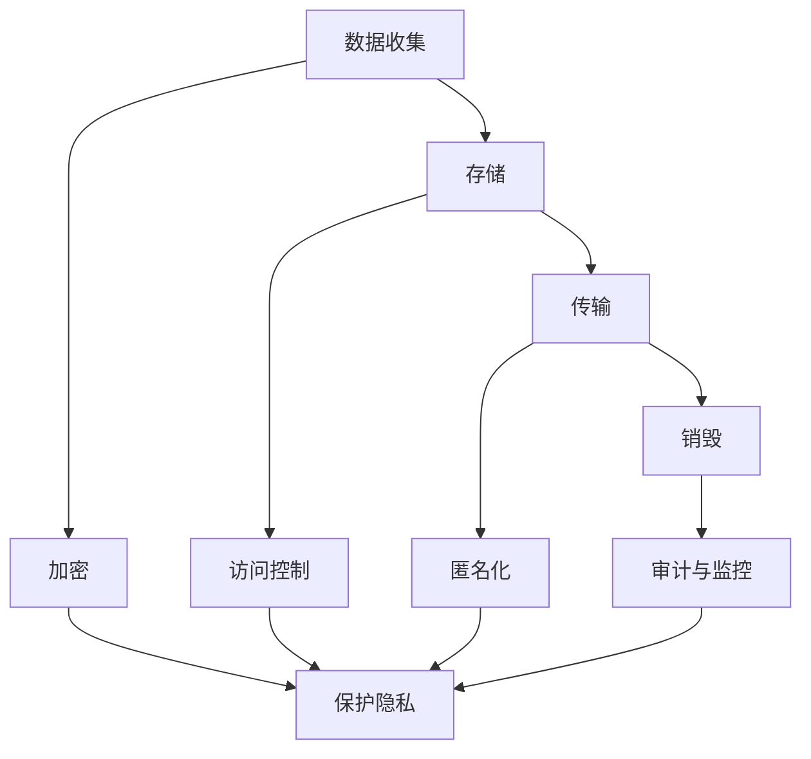

                 

关键词：隐私安全，数据保护，加密算法，人工智能，安全协议，合规性

> 摘要：本文将深入探讨隐私安全在当今数字化时代的重要性，分析现有的数据保护技术和算法，探讨其在实际应用中的挑战和解决方案，并展望未来的发展趋势。通过详细的讲解和实例分析，帮助读者更好地理解隐私安全的核心概念和实施方法，为守护人类计算的数据安全提供有力支持。

## 1. 背景介绍

随着信息技术的飞速发展，大数据、云计算、人工智能等新兴技术已经深刻改变了我们的生活方式。然而，随着数据量的急剧增长和数据类型的多样化，隐私安全成为了越来越重要的议题。隐私安全不仅仅关乎个人信息的保护，更关系到整个社会的稳定和繁荣。在数字化时代，数据成为了新的“石油”，而隐私安全则成为保护这“石油”的关键。

近年来，大量的数据泄露事件频发，给个人、企业和整个社会带来了巨大的损失。例如，2017年的Facebook数据泄露事件，就暴露了8700万用户的个人信息。这不仅损害了用户的隐私权，也对Facebook的声誉和商业利益造成了重大打击。这些事件提醒我们，隐私安全不容忽视，必须采取有效的措施来保护数据安全。

隐私安全的挑战不仅仅来自于外部攻击，还包括数据自身的特性。例如，数据的去匿名化问题，即通过分析大量数据，将匿名数据重新识别为特定个体的过程，已经成为隐私安全领域的一个重大挑战。此外，随着人工智能技术的发展，自动化攻击和数据挖掘技术也日益先进，进一步加剧了隐私安全的风险。

## 2. 核心概念与联系

### 2.1 隐私安全的核心概念

隐私安全涉及多个核心概念，包括但不限于：

- **数据加密**：通过加密算法将数据转换为不可读的形式，以防止未授权访问。
- **访问控制**：通过身份验证和授权机制，确保只有授权用户可以访问数据。
- **匿名化**：通过去除或混淆个人标识信息，将数据匿名化以保护隐私。
- **审计和监控**：通过监控和审计日志，追踪数据访问和使用情况，以便及时发现和响应异常行为。

### 2.2 数据保护与隐私安全的联系

数据保护是隐私安全的重要组成部分。数据保护包括数据的收集、存储、传输和销毁等全过程。隐私安全则更侧重于保护数据不被未经授权的访问、使用、泄露或篡改。数据保护与隐私安全的关系可以用以下Mermaid流程图表示：



### 2.3 隐私安全的关键技术

为了实现隐私安全，需要采用一系列关键技术，包括：

- **加密算法**：用于数据加密和解密，确保数据在传输和存储过程中的安全性。
- **安全协议**：用于在网络通信中保证数据的机密性、完整性和认证性。
- **匿名化技术**：用于将个人标识信息从数据中去除或混淆，以保护隐私。
- **隐私增强技术**：如差分隐私、联邦学习等，用于在数据处理和分析过程中增强隐私保护。

## 3. 核心算法原理 & 具体操作步骤

### 3.1 算法原理概述

隐私安全的核心算法主要分为加密算法、安全协议和匿名化技术。以下是这些算法的基本原理概述：

- **加密算法**：加密算法是将明文数据转换为密文的过程。常见的加密算法包括对称加密、非对称加密和哈希算法。对称加密算法如AES、DES等，使用相同的密钥进行加密和解密。非对称加密算法如RSA、ECC等，使用公钥和私钥进行加密和解密。哈希算法如SHA-256、MD5等，用于生成数据的数字指纹。

- **安全协议**：安全协议是在网络通信中保证数据安全的一系列规则和步骤。常见的安全协议包括SSL/TLS、IPSec和DTLS等。SSL/TLS用于保护Web通信的安全性，IPSec用于保护IP层通信的安全性，DTLS用于保护UDP通信的安全性。

- **匿名化技术**：匿名化技术通过去除或混淆个人标识信息，将数据匿名化以保护隐私。常见的匿名化技术包括数据遮蔽、数据混淆、数据泛化和数据去标识化等。

### 3.2 算法步骤详解

#### 3.2.1 加密算法

加密算法的具体步骤如下：

1. **选择加密算法**：根据安全需求和性能要求，选择合适的加密算法。
2. **生成密钥**：对于对称加密算法，需要生成一个密钥；对于非对称加密算法，需要生成一对公钥和私钥。
3. **加密数据**：使用密钥对数据进行加密，生成密文。
4. **解密数据**：接收方使用相应的密钥对密文进行解密，还原明文数据。

#### 3.2.2 安全协议

安全协议的具体步骤如下：

1. **建立通信通道**：客户端和服务器之间建立安全通信通道。
2. **身份验证**：通过身份验证机制，确保通信双方的身份合法。
3. **数据加密**：在通信过程中，使用加密算法对数据进行加密，确保数据的机密性。
4. **完整性验证**：使用哈希算法对数据进行完整性验证，确保数据在传输过程中未被篡改。
5. **通信结束**：通信完成后，关闭安全通道。

#### 3.2.3 匿名化技术

匿名化技术的具体步骤如下：

1. **数据预处理**：对原始数据进行预处理，包括去除个人标识信息和填充噪音等。
2. **数据匿名化**：使用匿名化算法对预处理后的数据进行匿名化处理，生成匿名化数据。
3. **隐私保护**：对匿名化数据进行隐私保护，如设置访问权限、监控和审计等。

### 3.3 算法优缺点

每种算法都有其优缺点，具体如下：

- **加密算法**：优点包括数据安全性高、适用范围广等；缺点包括计算复杂度高、密钥管理困难等。
- **安全协议**：优点包括数据传输安全性高、兼容性好等；缺点包括实现复杂、性能影响较大等。
- **匿名化技术**：优点包括数据匿名性好、隐私保护能力强等；缺点包括数据真实性降低、处理复杂度高等。

### 3.4 算法应用领域

加密算法、安全协议和匿名化技术在多个领域得到广泛应用，包括但不限于：

- **金融领域**：用于保护金融交易数据，确保交易的安全性。
- **医疗领域**：用于保护患者隐私，确保医疗数据的安全。
- **政府领域**：用于保护国家安全和社会稳定，确保政府数据的安全。
- **企业领域**：用于保护企业商业机密，确保企业数据的安全。

## 4. 数学模型和公式 & 详细讲解 & 举例说明

### 4.1 数学模型构建

隐私安全中的数学模型主要包括加密模型、安全协议模型和匿名化模型。以下是这些模型的构建：

- **加密模型**：加密模型包括密文空间、明文空间和密钥空间。加密模型的基本公式为：C = E(K, P)，其中C为密文，K为密钥，P为明文。
- **安全协议模型**：安全协议模型包括通信双方的身份验证模型、加密模型和数据完整性验证模型。安全协议模型的基本公式为：S = A(K1, K2, P)，其中S为安全通信过程，A为安全协议算法，K1和K2为通信双方的密钥，P为通信内容。
- **匿名化模型**：匿名化模型包括数据预处理模型、匿名化模型和隐私保护模型。匿名化模型的基本公式为：D = F(K, P)，其中D为匿名化数据，K为匿名化密钥，P为原始数据。

### 4.2 公式推导过程

以下是加密模型和安全协议模型的推导过程：

- **加密模型推导**：
    - 假设密文空间为C，明文空间为P，密钥空间为K。
    - 加密函数为E：C = E(K, P)。
    - 解密函数为D：P = D(K, C)。
    - 密钥生成函数为G：K = G(S)，其中S为随机数。
    - 加密模型公式推导为：C = E(G(S), P)。
- **安全协议模型推导**：
    - 假设通信双方为A和B，身份验证模型为A，加密模型为E，数据完整性验证模型为V。
    - 身份验证算法为ID_A：A = ID_A(K1, ID_B)。
    - 加密算法为E_A：C = E_A(K1, P)。
    - 数据完整性验证算法为V_A：V = V_A(K2, C)。
    - 安全协议模型公式推导为：S = A(K1, K2, P)。

### 4.3 案例分析与讲解

以下是一个简单的案例，用于说明加密模型和安全协议模型的应用：

**案例：** A和B通过SSL/TLS协议进行安全通信。

1. **身份验证**：
    - A和B分别生成自己的公钥和私钥。
    - A将公钥发送给B。
    - B使用自己的私钥对公钥进行签名，并将签名发送给A。
    - A使用B的公钥验证签名，确认B的身份。
2. **加密通信**：
    - A和B协商一个会话密钥。
    - A使用会话密钥对通信内容进行加密。
    - B使用会话密钥对加密内容进行解密。
3. **数据完整性验证**：
    - A对发送的数据进行哈希计算，生成哈希值。
    - A将哈希值发送给B。
    - B对收到的数据进行哈希计算，与收到的哈希值进行比对，验证数据完整性。

通过这个案例，我们可以看到加密模型和安全协议模型在安全通信中的应用。SSL/TLS协议通过身份验证、加密通信和数据完整性验证，确保了通信的安全性和完整性。

## 5. 项目实践：代码实例和详细解释说明

### 5.1 开发环境搭建

为了实现加密通信，我们需要搭建一个开发环境。以下是一个简单的Python开发环境搭建步骤：

1. 安装Python：在终端中执行命令 `pip install python`，下载并安装Python。
2. 安装SSL/TLS库：在终端中执行命令 `pip install ssl`，下载并安装SSL/TLS库。

### 5.2 源代码详细实现

以下是一个简单的Python代码实例，用于实现基于SSL/TLS的安全通信：

```python
import ssl
import socket

# 服务器端
def server():
    context = ssl.SSLContext(ssl.PROTOCOL_TLS_SERVER)
    context.load_cert_chain(certfile="server.crt", keyfile="server.key")

    with socket.socket(socket.AF_INET, socket.SOCK_STREAM, 0) as sock:
        sock.bind(('localhost', 12345))
        sock.listen(5)
        print("Server is listening on port 12345...")

        while True:
            client_sock, _ = sock.accept()
            print("Accepted connection from", client_sock.getpeername())

            with ssl.wrap_socket(client_sock, context=context) as ssock:
                print("Established secure connection with", ssock.getpeername())

                while True:
                    data = ssock.recv(1024)
                    if not data:
                        break
                    print("Received data:", data.decode())

            print("Connection closed.")

# 客户端
def client():
    context = ssl.SSLContext(ssl.PROTOCOL_TLS_CLIENT)
    context.check_hostname = False
    context.verify_mode = ssl.CERT_NONE

    with socket.socket(socket.AF_INET, socket.SOCK_STREAM, 0) as sock:
        sock.connect(('localhost', 12345))
        print("Connected to server on port 12345...")

        with ssl.wrap_socket(sock, context=context) as ssock:
            print("Established secure connection with server.")

            while True:
                data = input("Enter data to send: ")
                ssock.send(data.encode())

                if data == "exit":
                    break

        print("Connection closed.")

if __name__ == "__main__":
    if input("Press 's' to start the server, 'c' to start the client: ").lower() == 's':
        server()
    else:
        client()
```

### 5.3 代码解读与分析

这个代码实例实现了基于SSL/TLS的安全通信，包括服务器端和客户端。

1. **服务器端**：
    - 创建一个套接字，绑定到指定地址和端口，并监听连接请求。
    - 使用SSL/TLS库创建SSL上下文，加载服务器证书和密钥。
    - 接受客户端连接，并将套接字封装为SSL套接字。
    - 读取客户端发送的数据，并打印出来。
2. **客户端**：
    - 创建一个套接字，连接到服务器地址和端口。
    - 使用SSL/TLS库创建SSL上下文，设置主机名检查和证书验证模式。
    - 将套接字封装为SSL套接字。
    - 从用户接收数据，并将其发送到服务器。

通过这个代码实例，我们可以看到如何使用Python和SSL/TLS库实现安全通信。SSL/TLS库提供了简单易用的接口，使得实现安全通信变得相对简单。

### 5.4 运行结果展示

1. **服务器端**：
    - 运行服务器端代码，等待客户端连接。
    - 客户端连接成功，建立安全通信通道。
    - 客户端发送数据，服务器端接收并打印出来。
2. **客户端**：
    - 运行客户端代码，连接到服务器端。
    - 服务器端和客户端建立安全通信通道。
    - 客户端输入数据，发送到服务器端，服务器端接收并打印出来。

通过运行结果展示，我们可以看到服务器端和客户端成功建立了安全通信通道，并能够正常传输数据。

## 6. 实际应用场景

隐私安全在各个领域都有广泛的应用。以下是一些实际应用场景：

1. **金融领域**：
    - 银行和金融机构使用加密算法和安全协议来保护客户的财务数据，确保交易的安全性。
    - 使用匿名化技术对客户数据进行分析，以提供个性化的金融服务。

2. **医疗领域**：
    - 医疗机构使用加密算法和安全协议来保护患者的病历和医疗记录。
    - 使用匿名化技术对医疗数据进行分析，以研究疾病趋势和治疗效果。

3. **政府领域**：
    - 政府部门使用加密算法和安全协议来保护国家安全和社会稳定。
    - 使用匿名化技术对社会数据进行分析，以制定政策和规划。

4. **企业领域**：
    - 企业使用加密算法和安全协议来保护商业机密和客户数据。
    - 使用匿名化技术对市场数据进行分析，以制定营销策略和产品规划。

## 6.4 未来应用展望

随着信息技术的不断发展，隐私安全领域将继续面临新的挑战和机遇。以下是一些未来应用展望：

1. **区块链技术**：
    - 区块链技术具有去中心化和不可篡改的特点，可以用于增强隐私安全。
    - 通过将数据存储在区块链上，可以实现对数据的加密和访问控制。

2. **量子计算**：
    - 量子计算具有计算速度远超传统计算机的能力，可以用于改进加密算法和安全协议。
    - 量子计算可能对现有的加密算法构成威胁，需要开发新的加密算法来保护隐私安全。

3. **人工智能与隐私安全**：
    - 人工智能技术可以用于增强隐私安全，例如通过智能监控和异常检测来识别潜在的安全威胁。
    - 人工智能技术也可以用于数据分析和挖掘，但要确保隐私保护不被侵犯。

4. **联邦学习**：
    - 联邦学习是一种分布式机器学习技术，可以在保护数据隐私的同时进行数据分析和模型训练。
    - 联邦学习可以应用于医疗、金融、交通等领域，实现隐私安全的数据共享和分析。

## 7. 工具和资源推荐

为了更好地理解和实践隐私安全，以下是一些建议的资源和工具：

1. **学习资源**：
    - 《计算机安全：艺术与科学》（Computer Security: Art and Science） - 计算机安全领域的经典教材。
    - 《隐私增强技术》（Privacy Enhancing Technologies） - 一份关于隐私保护技术的综述论文。
  
2. **开发工具**：
    - OpenSSL - 一个广泛使用的加密工具库，支持多种加密算法和安全协议。
    - Python - 一个强大的编程语言，可用于实现隐私安全的算法和应用。

3. **相关论文**：
    - “Homomorphic Encryption: A New Hope for Data Privacy” - 一篇关于同态加密的综述论文。
    - “The Case for End-to-End Encryption” - 一篇关于端到端加密的重要论文。

## 8. 总结：未来发展趋势与挑战

隐私安全在当今数字化时代具有重要意义。随着数据量的急剧增长和人工智能技术的发展，隐私安全面临越来越多的挑战。为了守护人类计算的数据安全，我们需要不断创新和改进隐私保护技术，确保数据在收集、存储、传输和处理过程中的安全性。

未来，隐私安全领域将继续发展，新的技术和算法将不断涌现。我们需要关注区块链、量子计算、人工智能和联邦学习等新兴技术，以应对隐私安全的新挑战。同时，我们需要加强隐私安全的法律法规和标准制定，提高公众对隐私安全的认知和意识。

总之，隐私安全是保障数字化时代数据安全的基石。只有通过持续的创新和合作，我们才能守护人类计算的数据安全，创造一个安全、透明和可信的数字世界。

## 9. 附录：常见问题与解答

### 9.1 隐私安全是什么？

隐私安全是指保护个人或组织的数据和信息不被未授权访问、泄露或篡改的一门学科。它涉及到加密算法、访问控制、匿名化技术等多方面内容。

### 9.2 加密算法有哪些？

常见的加密算法包括对称加密（如AES、DES）、非对称加密（如RSA、ECC）和哈希算法（如SHA-256、MD5）。

### 9.3 安全协议是什么？

安全协议是一组规则和步骤，用于在网络通信中保证数据的机密性、完整性和认证性。常见的安全协议包括SSL/TLS、IPSec和DTLS等。

### 9.4 匿名化技术是什么？

匿名化技术是通过去除或混淆个人标识信息，将数据匿名化以保护隐私的技术。常见的匿名化技术包括数据遮蔽、数据混淆、数据泛化和数据去标识化等。

### 9.5 隐私安全有哪些实际应用场景？

隐私安全在金融、医疗、政府和企业等领域有广泛的应用。例如，银行和金融机构使用加密算法和安全协议来保护客户的财务数据；医疗机构使用匿名化技术对医疗数据进行分析，以研究疾病趋势和治疗效果。

### 9.6 如何保护个人隐私安全？

保护个人隐私安全可以从以下几个方面入手：

- 使用强密码和多因素认证。
- 定期更新和备份重要数据。
- 使用可靠的加密工具和软件。
- 注意个人信息的安全传输和存储。
- 定期检查和更新安全软件。

### 9.7 隐私安全面临哪些挑战？

隐私安全面临的挑战包括：

- 数据量的急剧增长和多样化的数据类型。
- 新兴技术（如人工智能、区块链等）对隐私保护的挑战。
- 数据去匿名化技术的进步。
- 隐私安全的法律法规和标准制定不足。

### 9.8 如何应对隐私安全的挑战？

应对隐私安全的挑战需要从以下几个方面入手：

- 加强数据加密和安全协议的应用。
- 推广匿名化技术，如差分隐私和联邦学习。
- 建立健全的隐私安全法律法规和标准。
- 提高公众对隐私安全的认知和意识。

### 9.9 隐私安全的重要性和意义是什么？

隐私安全的重要性在于保护个人和组织的合法权益，维护社会稳定和繁荣。它的意义在于确保数据的机密性、完整性和可用性，为数字化时代的可持续发展提供保障。通过隐私安全，我们可以构建一个安全、透明和可信的数字世界，促进信息技术的发展和应用。

