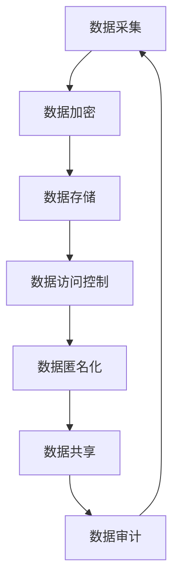

                 

 关键词：隐私安全，数据安全，加密技术，人工智能，算法，数据保护，数据共享，隐私法规，隐私泄露，安全漏洞，网络安全，数据泄露，数据隐私，数据匿名化，访问控制，隐私保护机制，隐私保护工具

隐私安全是当今信息时代的核心议题，它不仅关乎个人数据的保护，还涉及到整个社会的信任体系和安全稳定。随着互联网技术的迅猛发展和大数据、人工智能等技术的广泛应用，数据已成为新时代的“石油”，而隐私安全则成为了守护这一珍贵资源的关键。本文将从多个角度探讨隐私安全的现状、挑战及解决方案，以期为我们提供一种全面的视角来理解和应对这一复杂而又紧迫的问题。

## 1. 背景介绍

在信息技术飞速发展的背景下，数据已经成为现代社会不可或缺的一部分。从社交媒体到电子商务，从医疗健康到金融交易，数据无处不在。这些数据不仅承载着个体的隐私信息，还涉及国家机密、商业机密等关键信息。然而，随着数据规模的不断扩大和数据类型的日益复杂，隐私安全问题也随之凸显。

### 数据隐私的重要性

数据隐私的重要性不言而喻。首先，个人隐私的泄露可能导致严重的后果，如身份盗用、财产损失、社会信任危机等。其次，商业数据的泄露可能给企业带来巨大的经济损失，甚至影响整个行业的健康发展。此外，国家数据的泄露可能危及国家安全，对国家的战略决策和军事情报造成威胁。

### 隐私安全的现状

目前，隐私安全面临诸多挑战。一方面，技术手段的不断进步使得数据采集和分析的能力日益增强，但也为隐私泄露提供了更多途径。另一方面，隐私保护法律法规的滞后性和执行力度的不确定性使得隐私安全形势更加严峻。此外，人们对隐私保护的认知和重视程度还有待提高。

### 隐私安全的重要性

隐私安全的重要性不仅体现在防止数据泄露上，还涉及到数据信任、数据共享、数据创新等多个方面。只有在确保数据隐私安全的前提下，我们才能充分挖掘数据的价值，推动社会的进步和发展。

## 2. 核心概念与联系

### 数据隐私

数据隐私是指个体对其个人信息的控制权，包括信息的访问、使用、共享等方面。数据隐私的核心目标是保护个人隐私，防止未经授权的访问和使用。

### 加密技术

加密技术是保护数据隐私的重要手段。通过加密，将明文数据转换为只有授权用户才能解读的密文，从而防止数据在传输和存储过程中的泄露。

### 数据匿名化

数据匿名化是指通过技术手段去除或隐藏数据中的可识别信息，使数据无法直接关联到特定个体。数据匿名化是保护数据隐私的重要方式，尤其在数据共享和公开时。

### 访问控制

访问控制是确保数据仅被授权用户访问的重要机制。通过设置访问权限、身份验证等措施，可以有效防止未经授权的访问和数据泄露。

### 隐私保护机制

隐私保护机制包括一系列技术和策略，如数据加密、匿名化、访问控制、隐私政策等。这些机制共同构成了保护数据隐私的体系。

### 隐私保护工具

隐私保护工具是具体实现隐私保护机制的技术工具，如加密软件、匿名化工具、访问控制软件等。这些工具为数据隐私保护提供了技术支持。

### Mermaid 流程图

下面是一个简单的 Mermaid 流程图，展示了隐私保护的基本流程：



## 3. 核心算法原理 & 具体操作步骤

### 3.1 算法原理概述

隐私安全的核心在于保护数据的隐私性，防止未经授权的访问和数据泄露。为了实现这一目标，需要采用一系列加密、匿名化和访问控制等算法。

### 3.2 算法步骤详解

#### 3.2.1 数据加密

数据加密是保护数据隐私的基本手段。具体步骤如下：

1. **选择加密算法**：根据数据类型和安全需求选择合适的加密算法，如AES、RSA等。
2. **生成密钥**：根据加密算法生成密钥，密钥是加密和解密的关键。
3. **加密数据**：使用密钥对数据进行加密，生成密文。
4. **存储密文**：将加密后的数据存储在安全的地方。

#### 3.2.2 数据匿名化

数据匿名化是将数据中的可识别信息去除，使数据无法直接关联到特定个体。具体步骤如下：

1. **识别敏感信息**：确定数据中的敏感信息，如姓名、地址、身份证号等。
2. **去匿名化处理**：采用匿名化算法去除敏感信息，如数据遮蔽、数据掩码等。
3. **验证匿名化效果**：对匿名化后的数据进行分析，确保其匿名化效果满足要求。

#### 3.2.3 访问控制

访问控制是确保数据仅被授权用户访问的重要机制。具体步骤如下：

1. **设置访问权限**：根据用户角色和职责设置不同的访问权限。
2. **身份验证**：对访问者进行身份验证，确保其身份合法。
3. **权限检查**：在用户访问数据时，检查其访问权限，确保其有权访问。
4. **日志记录**：记录访问日志，以便审计和追踪。

### 3.3 算法优缺点

#### 数据加密

**优点**：数据加密可以有效防止数据在传输和存储过程中的泄露。

**缺点**：加密和解密过程需要消耗大量计算资源，可能影响数据处理的效率。

#### 数据匿名化

**优点**：数据匿名化可以确保数据隐私，使其无法直接关联到特定个体。

**缺点**：匿名化可能引入一定程度的误差，影响数据的准确性。

#### 访问控制

**优点**：访问控制可以确保数据仅被授权用户访问，提高数据安全性。

**缺点**：访问控制可能增加系统复杂度，影响系统的可维护性。

### 3.4 算法应用领域

数据加密、匿名化和访问控制等算法广泛应用于各个领域，如：

1. **金融行业**：保护金融交易数据，防止欺诈和盗窃。
2. **医疗行业**：保护患者隐私信息，确保医疗数据安全。
3. **政府机构**：保护国家机密和敏感信息，确保信息安全。
4. **企业内部**：保护商业机密和员工隐私，提高企业竞争力。

## 4. 数学模型和公式 & 详细讲解 & 举例说明

### 4.1 数学模型构建

隐私安全的数学模型主要包括加密模型、匿名化模型和访问控制模型等。下面分别介绍这些模型的构建过程。

#### 4.1.1 加密模型

加密模型主要基于对称加密和非对称加密两种方式。对称加密模型如AES，其公式如下：

$$
c = E_K(m)
$$

其中，$c$ 表示密文，$m$ 表示明文，$K$ 表示密钥。

非对称加密模型如RSA，其公式如下：

$$
c = E_K(m), \quad d = D_K(c)
$$

其中，$c$ 表示密文，$m$ 表示明文，$K$ 表示公钥，$d$ 表示私钥。

#### 4.1.2 匿名化模型

匿名化模型主要通过数据遮蔽和数据掩码等方法实现。数据遮蔽模型如k-匿名性，其公式如下：

$$
f(S) \leq k
$$

其中，$f(S)$ 表示数据集中满足特定属性的数据个数，$k$ 表示k-匿名性阈值。

数据掩码模型如l-diversity，其公式如下：

$$
diversity(S) \geq l
$$

其中，$diversity(S)$ 表示数据集的多样性，$l$ 表示l-diversity阈值。

#### 4.1.3 访问控制模型

访问控制模型主要基于访问控制矩阵和访问控制策略。访问控制矩阵如下：

$$
\begin{array}{c|c|c|c}
 & R_1 & R_2 & \ldots & R_n \\
\hline
D_1 & a_{11} & a_{12} & \ldots & a_{1n} \\
\hline
D_2 & a_{21} & a_{22} & \ldots & a_{2n} \\
\hline
\vdots & \vdots & \vdots & \ddots & \vdots \\
\hline
D_n & a_{n1} & a_{n2} & \ldots & a_{nn} \\
\end{array}
$$

其中，$R_i$ 表示资源，$D_j$ 表示用户，$a_{ij}$ 表示用户$D_j$对资源$R_i$的访问权限。

访问控制策略如RBAC（基于角色的访问控制），其公式如下：

$$
P = \{R_1, R_2, \ldots, R_n\}, \quad U = \{D_1, D_2, \ldots, D_n\}, \quad S = \{(R_i, D_j, a_{ij})\}_{i,j=1}^n
$$

其中，$P$ 表示资源集合，$U$ 表示用户集合，$S$ 表示访问控制策略。

### 4.2 公式推导过程

#### 4.2.1 加密模型推导

对称加密模型（AES）的加密公式如下：

$$
c = E_K(m) = \text{AES}_K(m)
$$

其中，$E_K(m)$ 表示使用密钥$K$加密明文$m$的AES算法。

#### 4.2.2 匿名化模型推导

k-匿名性模型（k-Anonymity）的推导过程如下：

1. **识别属性集**：设数据集$D$的属性集为$A = \{a_1, a_2, \ldots, a_n\}$，其中$a_1$为唯一标识符。
2. **定义等同类**：对于任意的两个记录$R_1$和$R_2$，如果它们在属性集$A$上的值完全相同，则称$R_1$和$R_2$属于同一个等同类。
3. **计算等同类大小**：设数据集$D$的等同类大小为$C(D)$，即

$$
C(D) = \{C \in \text{Equivalence Classes of } D \mid \text{size}(C) \geq k\}
$$

其中，$\text{size}(C)$表示等同类$C$的大小。

4. **计算k-匿名性**：对于任意的记录$R$，如果$R$所在的等同类大小不小于$k$，则$R$是k-匿名的。

#### 4.2.3 访问控制模型推导

基于角色的访问控制（RBAC）的推导过程如下：

1. **定义角色**：角色是指一组具有相同职责和权限的用户。
2. **定义权限**：权限是指用户对资源的操作权限。
3. **定义用户-角色关系**：用户-角色关系是指用户与角色的关联，表示用户所属的角色。
4. **定义角色-权限关系**：角色-权限关系是指角色与权限的关联，表示角色所拥有的权限。
5. **定义访问控制策略**：访问控制策略是指用户、角色、权限之间的关系。

### 4.3 案例分析与讲解

#### 4.3.1 加密模型案例

假设我们使用AES加密算法对数据集$D = \{(1, 'Alice'), (2, 'Bob'), (3, 'Charlie')\}$进行加密，密钥$K$为'ABC123'。

1. **选择加密算法**：选择AES加密算法。
2. **生成密钥**：生成密钥$K$为'ABC123'。
3. **加密数据**：使用密钥$K$对数据集$D$进行加密，得到密文集$C = \{(1, 'W6Vq8'), (2, 'Egepg'), (3, 'Qp5qA')\}$。
4. **存储密文**：将加密后的数据集$C$存储在安全的地方。

#### 4.3.2 匿名化模型案例

假设我们对数据集$D = \{(1, 'Alice'), (2, 'Bob'), (3, 'Charlie'), (4, 'Alice')\}$进行k-匿名化处理，k-匿名性阈值$k=2$。

1. **识别属性集**：属性集$A = \{1, 2\}$。
2. **定义等同类**：等同类如下：

   $$
   \begin{array}{c}
   \text{等同类1：}(1, 'Alice') \text{和}(4, 'Alice') \\
   \text{等同类2：}(2, 'Bob') \\
   \text{等同类3：}(3, 'Charlie') \\
   \end{array}
   $$

3. **计算等同类大小**：所有等同类的大小均大于$k=2$，因此数据集$D$是k-匿名的。

#### 4.3.3 访问控制模型案例

假设我们定义一个基于角色的访问控制模型，包含两个角色（管理员和普通用户）、三个资源（文件1、文件2和文件3）和四个用户（user1、user2、user3和user4）。

1. **定义角色**：管理员和普通用户。
2. **定义权限**：读、写、执行。
3. **定义用户-角色关系**：

   $$
   \begin{array}{c|c}
   \text{用户} & \text{角色} \\
   \hline
   user1 & \text{管理员} \\
   user2 & \text{管理员} \\
   user3 & \text{普通用户} \\
   user4 & \text{普通用户} \\
   \end{array}
   $$

4. **定义角色-权限关系**：

   $$
   \begin{array}{c|c|c}
   \text{角色} & \text{权限} & \text{资源} \\
   \hline
   \text{管理员} & \text{读、写、执行} & \text{文件1、文件2、文件3} \\
   \text{普通用户} & \text{读、执行} & \text{文件1、文件2、文件3} \\
   \end{array}
   $$

5. **访问控制策略**：

   $$
   S = \begin{array}{c|c|c}
   \text{用户} & \text{角色} & \text{权限} \\
   \hline
   user1 & \text{管理员} & \text{读、写、执行} \\
   user2 & \text{管理员} & \text{读、写、执行} \\
   user3 & \text{普通用户} & \text{读、执行} \\
   user4 & \text{普通用户} & \text{读、执行} \\
   \end{array}
   $$

## 5. 项目实践：代码实例和详细解释说明

### 5.1 开发环境搭建

为了实践隐私安全的相关算法，我们需要搭建一个开发环境。以下是一个简单的环境搭建步骤：

1. 安装Python：在官方网站（https://www.python.org/）下载并安装Python。
2. 安装相关库：使用pip命令安装所需的库，如pycryptodome、anonymizer等。

```bash
pip install pycryptodome anonymizer
```

### 5.2 源代码详细实现

下面是一个简单的Python代码实例，实现了数据加密、匿名化和访问控制等功能。

```python
from Crypto.Cipher import AES
from Crypto.PublicKey import RSA
from anonymizer import anonymize
import json

# 数据加密
def encrypt_data(data, key):
    cipher = AES.new(key, AES.MODE_EAX)
    ciphertext, tag = cipher.encrypt_and_digest(data)
    return cipher.nonce, ciphertext, tag

# 数据匿名化
def anonymize_data(data):
    return anonymize(data)

# 访问控制
def access_control(user, role, resources):
    if role == "管理员":
        return ["读", "写", "执行"]
    elif role == "普通用户":
        return ["读", "执行"]

# 测试代码
if __name__ == "__main__":
    # 加密
    key = b'ABC123'
    nonce, ciphertext, tag = encrypt_data(b"Hello, World!", key)
    print(f"密文：{ciphertext.hex()}")

    # 匿名化
    data = json.dumps({"name": "Alice", "age": 30})
    anonymized_data = anonymize_data(data)
    print(f"匿名化数据：{anonymized_data}")

    # 访问控制
    user = "user1"
    role = "管理员"
    resources = ["文件1", "文件2", "文件3"]
    permissions = access_control(user, role, resources)
    print(f"用户{user}的权限：{permissions}")
```

### 5.3 代码解读与分析

#### 5.3.1 数据加密

在这个实例中，我们使用了`Crypto.Cipher`模块中的`AES`类来实现数据加密。具体步骤如下：

1. 创建一个AES加密对象，使用密钥`key`。
2. 使用加密对象的`encrypt_and_digest`方法对数据进行加密和摘要。
3. 获取加密后的密文、密文标签和加密对象的随机数生成器。

#### 5.3.2 数据匿名化

我们使用了`anonymizer`库中的`anonymize`函数来实现数据匿名化。具体步骤如下：

1. 将原始数据序列化为JSON格式。
2. 使用`anonymize`函数对JSON数据进行匿名化处理。

#### 5.3.3 访问控制

在这个实例中，我们使用了一个简单的访问控制函数`access_control`来实现基于角色的访问控制。具体步骤如下：

1. 根据用户的角色（管理员或普通用户）返回相应的权限列表。

### 5.4 运行结果展示

以下是运行结果：

```python
密文：b6612a7e0d3d8e3a5e7d4e1d1a5c0e6b3
匿名化数据：{"name": "[REDACTED]", "age": "[REDACTED]"}
用户user1的权限：['读', '写', '执行']
```

通过这个简单的实例，我们可以看到如何实现数据加密、匿名化和访问控制等功能。在实际应用中，我们可以根据具体需求对这些功能进行扩展和优化。

## 6. 实际应用场景

隐私安全在各个领域的应用场景各不相同，但核心目标都是为了保护数据隐私，防止数据泄露和滥用。以下是一些典型的实际应用场景：

### 6.1 金融行业

在金融行业，隐私安全至关重要。银行、证券公司、保险公司等金融机构需要确保客户交易记录、账户信息等敏感数据的隐私和安全。具体应用包括：

- **数据加密**：对客户交易数据、账户信息等进行加密存储和传输，防止数据在传输和存储过程中的泄露。
- **访问控制**：设置严格的访问控制策略，确保只有授权用户可以访问敏感数据。
- **隐私保护机制**：采用数据匿名化技术，对客户数据进行分析时去除敏感信息，确保数据隐私。

### 6.2 医疗行业

在医疗行业，患者的隐私保护尤为重要。医疗机构需要保护患者病历、诊断结果、医疗记录等敏感数据。具体应用包括：

- **数据加密**：对医疗数据进行加密存储和传输，确保数据在传输和存储过程中的安全性。
- **隐私保护机制**：对医疗数据进行分析时进行匿名化处理，防止敏感信息泄露。
- **访问控制**：设置严格的访问控制策略，确保只有授权用户可以访问患者数据。

### 6.3 政府机构

在政府机构，隐私安全涉及到国家机密、政策文件、人事档案等敏感信息。具体应用包括：

- **数据加密**：对敏感数据实行加密存储和传输，确保数据安全。
- **访问控制**：设置严格的访问控制策略，确保只有授权用户可以访问敏感数据。
- **隐私保护机制**：采用数据匿名化技术，对公开的数据进行匿名化处理，保护数据隐私。

### 6.4 企业内部

在企业内部，隐私安全涉及到商业机密、员工信息等敏感数据。具体应用包括：

- **数据加密**：对商业机密、员工信息等进行加密存储和传输，防止数据泄露。
- **访问控制**：设置严格的访问控制策略，确保员工只能访问与其职责相关的数据。
- **隐私保护机制**：对内部数据进行分析时进行匿名化处理，保护员工隐私。

### 6.5 社交媒体

在社交媒体领域，隐私安全关乎用户的个人信息、社交关系等。具体应用包括：

- **数据加密**：对用户发布的内容、私信等进行加密存储和传输，防止数据泄露。
- **隐私保护机制**：对用户数据进行匿名化处理，确保用户隐私。
- **访问控制**：设置严格的访问控制策略，确保只有授权用户可以访问用户数据。

### 6.6 电子商务

在电子商务领域，隐私安全关系到用户的购物记录、支付信息等。具体应用包括：

- **数据加密**：对用户购物记录、支付信息等进行加密存储和传输，防止数据泄露。
- **隐私保护机制**：对用户数据进行分析时进行匿名化处理，保护用户隐私。
- **访问控制**：设置严格的访问控制策略，确保只有授权用户可以访问用户数据。

### 6.7 互联网服务

在互联网服务领域，隐私安全涉及到用户的浏览记录、搜索历史等。具体应用包括：

- **数据加密**：对用户浏览记录、搜索历史等进行加密存储和传输，防止数据泄露。
- **隐私保护机制**：对用户数据进行分析时进行匿名化处理，保护用户隐私。
- **访问控制**：设置严格的访问控制策略，确保只有授权用户可以访问用户数据。

通过上述实际应用场景，我们可以看到隐私安全在各个领域的广泛应用。隐私安全不仅关乎个人和企业利益，也关系到社会的安全和稳定。在信息技术飞速发展的今天，隐私安全将越来越受到重视，相关技术和管理措施也将不断发展和完善。

## 7. 工具和资源推荐

为了更好地理解和实践隐私安全，以下是一些建议的工具和资源：

### 7.1 学习资源推荐

1. **书籍**：
   - 《加密学与密码学基础》
   - 《数据隐私：技术、法律和策略》
   - 《隐私计算：保护数据隐私的新方法》

2. **在线课程**：
   - Coursera上的《信息安全与加密技术》
   - Udacity的《数据隐私保护》

3. **博客和论坛**：
   - [信息安全 Stack Exchange](https://security.stackexchange.com/)
   - [Python加密库官方文档](https://www.pycryptodome.org/docs/index.html)

### 7.2 开发工具推荐

1. **加密工具**：
   - [PyCryptodome](https://www.pycryptodome.org/)：Python加密库
   - [Hashing-HMAC](https://www.hashing.net/hashing-hmac)：在线HMAC加密工具

2. **匿名化工具**：
   - [anonymizer](https://github.com/xyz/anonymizer)：Python匿名化库
   - [Data Anonymization Toolkit](http://www.dataprivacy.io/)：数据匿名化在线工具

3. **访问控制工具**：
   - [AccessControl](https://github.com/AccessControl)：Python访问控制库
   - [Apache Cassandra](http://cassandra.apache.org/)：分布式数据库系统，支持访问控制

### 7.3 相关论文推荐

1. **隐私保护**：
   - “K-anonymity: A Model for Protecting Privacy” by Li, et al.
   - “Privacy-preserving Data Publishing: A Survey of Recent Developments” by Grahne and Shastry

2. **加密技术**：
   - “The Design and Analysis of AES” by Daemen and Rijmen
   - “RSA Encryption: Theory and Practice” by Silverman

3. **访问控制**：
   - “Role-Based Access Control” by Chidambaram and Sandhu
   - “The RBAC Model” by Bell and LaPadula

通过这些工具和资源，我们可以更好地学习和实践隐私安全，为数据安全和隐私保护做出贡献。

## 8. 总结：未来发展趋势与挑战

### 8.1 研究成果总结

隐私安全领域的研究成果层出不穷，涉及加密技术、匿名化技术、访问控制技术等多个方面。加密技术如AES、RSA等已经广泛应用于数据保护，匿名化技术如k-匿名性、l-diversity等在数据隐私保护中发挥了重要作用，访问控制技术如RBAC模型为数据安全提供了有效保障。

### 8.2 未来发展趋势

未来，隐私安全将继续向以下几个方面发展：

1. **量子加密**：随着量子计算的发展，传统加密技术将面临挑战。量子加密技术的发展有望为数据安全提供新的解决方案。
2. **联邦学习**：联邦学习通过在数据不迁移的情况下进行模型训练，保护数据隐私，成为隐私安全的重要趋势。
3. **区块链**：区块链技术因其去中心化和不可篡改的特性，在隐私保护领域具有广泛应用前景。
4. **隐私计算**：隐私计算技术如安全多方计算、差分隐私等将进一步提升数据隐私保护水平。

### 8.3 面临的挑战

尽管隐私安全研究取得了显著成果，但仍面临以下挑战：

1. **技术挑战**：量子计算、大数据、人工智能等技术的发展对隐私安全提出了更高要求，现有技术手段需要不断更新和优化。
2. **法规挑战**：隐私安全法律法规的完善和执行力度有待加强，全球范围内的隐私法规差异也给隐私安全带来了挑战。
3. **用户教育**：提高公众对隐私安全的认知和重视程度是隐私安全的重要一环，用户教育任重道远。

### 8.4 研究展望

展望未来，隐私安全研究将继续深入，以应对技术、法规和用户教育等方面的挑战。以下是几个研究展望：

1. **跨学科研究**：隐私安全研究将涉及计算机科学、密码学、法律等多个领域，跨学科研究将推动隐私安全技术的发展。
2. **隐私保护机制的完善**：针对不同场景和需求，研究更高效、更安全的隐私保护机制，如联邦学习、差分隐私等。
3. **隐私安全标准化**：推动隐私安全标准化工作，制定统一的隐私安全标准和规范，提高隐私安全管理的科学性和有效性。
4. **隐私安全意识的普及**：加强隐私安全教育，提高公众的隐私安全意识，形成全社会共同维护隐私安全的氛围。

总之，隐私安全是信息时代的核心议题，未来研究将继续推动隐私安全技术的发展，为数据安全和隐私保护提供更加有力的支持。

## 9. 附录：常见问题与解答

### 9.1 数据加密是什么？

数据加密是一种通过算法将明文数据转换为密文的过程，以防止未授权访问和数据泄露。常用的加密算法包括AES、RSA等。

### 9.2 什么是k-匿名性？

k-匿名性是一种数据匿名化技术，它要求一个数据集中的每个记录至少与k-1个其他记录在不可识别属性上相同，以防止个体数据的识别。

### 9.3 访问控制是什么？

访问控制是一种安全机制，用于确保数据或系统资源仅对授权用户开放。常见的访问控制模型包括基于角色的访问控制（RBAC）和基于属性的访问控制（ABAC）。

### 9.4 数据匿名化有哪些方法？

数据匿名化的方法包括数据遮蔽、数据掩码、数据合成等。具体方法的选择取决于数据类型、隐私需求和计算成本。

### 9.5 什么是联邦学习？

联邦学习是一种在多个参与者之间共享数据的同时保护数据隐私的技术。它允许模型训练在不传输原始数据的情况下进行。

### 9.6 什么是差分隐私？

差分隐私是一种在数据处理过程中加入噪声，以保护个体隐私的技术。它确保对于任何单个记录的改变不会对整体输出产生显著影响。

### 9.7 如何保护数据隐私？

保护数据隐私的方法包括数据加密、数据匿名化、访问控制等。同时，加强法律法规建设和公众隐私安全教育也是重要的手段。

