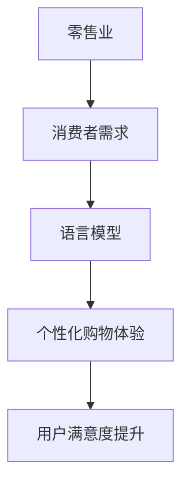

                 

关键词：零售、语言模型、个性化购物、深度学习、用户体验、大数据分析、人工智能。

> 摘要：本文深入探讨了语言模型（LLM）在零售业中的应用，特别是如何通过个性化购物体验提升用户满意度。我们将从背景介绍、核心概念与联系、核心算法原理与具体操作步骤、数学模型和公式、项目实践、实际应用场景、未来应用展望、工具和资源推荐以及总结等几个方面，全面分析LLM在零售业中的重要作用及其发展前景。

## 1. 背景介绍

随着互联网技术的飞速发展和大数据时代的到来，零售业正经历着一场前所未有的变革。传统的零售模式已经无法满足消费者日益增长的需求，个性化、智能化和高效化成为零售业的发展趋势。而语言模型（LLM）作为一种先进的人工智能技术，其应用场景越来越广泛，特别是在零售领域。

语言模型是自然语言处理（NLP）中的一种核心算法，它能够理解和生成人类语言，从而实现人机交互。在零售业中，LLM可以帮助商家更好地理解消费者的需求，提供个性化的购物体验，提升用户满意度。本文将围绕这一主题，探讨LLM在零售业中的应用。

## 2. 核心概念与联系

为了更好地理解LLM在零售业中的作用，我们首先需要了解以下几个核心概念：

### 2.1 语言模型（LLM）

语言模型是一种基于统计学原理构建的模型，它能够根据输入的文本数据生成相应的输出文本。LLM是深度学习技术的一种应用，通过大量的文本数据进行训练，从而具备理解自然语言的能力。

### 2.2 零售业

零售业是指商品和服务通过销售网络直接销售给消费者的行业。随着电子商务的发展，零售业逐渐从线下转向线上，形成了线上线下相结合的新零售模式。

### 2.3 个性化购物体验

个性化购物体验是指根据消费者的需求和偏好，为其提供量身定制的购物服务。这包括推荐商品、定制优惠、个性化广告等。

为了更好地说明LLM与零售业之间的联系，我们可以使用Mermaid流程图来展示它们之间的关系：



从图中可以看出，LLM在零售业中起到了连接消费者需求和个性化购物体验的关键作用。

## 3. 核心算法原理 & 具体操作步骤

### 3.1 算法原理概述

LLM的核心算法原理是基于深度神经网络（DNN）和递归神经网络（RNN）。DNN可以通过多层神经网络结构对输入数据进行特征提取和变换，从而实现复杂的函数映射。而RNN则可以处理序列数据，具有记忆功能，能够更好地理解自然语言。

在零售业中，LLM的主要操作步骤如下：

1. 数据收集与预处理：收集消费者的购物数据、用户评论、行为数据等，并进行数据清洗、去噪和格式化。
2. 模型训练：使用大量的文本数据训练LLM模型，使其具备理解自然语言的能力。
3. 个性化推荐：根据消费者的需求和偏好，使用LLM模型生成个性化的购物推荐。
4. 用户反馈与优化：收集用户对购物推荐的反馈，根据反馈对LLM模型进行优化。

### 3.2 算法步骤详解

1. **数据收集与预处理**

   在零售业中，数据收集是构建LLM模型的基础。数据来源包括消费者购物记录、用户评论、行为数据等。数据收集后，需要进行预处理，包括数据清洗、去噪、格式化等操作。

2. **模型训练**

   在预处理完数据后，我们可以使用深度学习框架（如TensorFlow、PyTorch等）训练LLM模型。训练过程包括以下步骤：

   - 初始化模型参数
   - 定义损失函数和优化器
   - 进行前向传播和反向传播
   - 更新模型参数

3. **个性化推荐**

   在模型训练完成后，我们可以使用LLM模型生成个性化的购物推荐。具体步骤如下：

   - 收集用户的历史购物数据和行为数据
   - 使用LLM模型对用户数据进行特征提取
   - 根据用户特征和商品特征计算相似度
   - 生成个性化的购物推荐列表

4. **用户反馈与优化**

   用户对购物推荐的反馈对LLM模型的效果具有重要影响。我们可以通过以下步骤收集用户反馈：

   - 收集用户对购物推荐的评分、评论等
   - 分析用户反馈，识别推荐的优点和不足
   - 根据用户反馈对LLM模型进行调整和优化

### 3.3 算法优缺点

LLM在零售业中的应用具有以下优点：

1. **个性化推荐**：LLM可以根据消费者的需求和偏好生成个性化的购物推荐，提升用户满意度。
2. **高效处理**：深度学习算法具有强大的特征提取能力，可以高效地处理大量购物数据。
3. **实时更新**：LLM模型可以根据用户反馈实时更新，保持推荐的准确性和时效性。

然而，LLM也存在一些缺点：

1. **数据依赖**：LLM模型的效果依赖于数据的质量和数量，如果数据不足或质量差，可能导致推荐效果不佳。
2. **计算资源消耗**：训练LLM模型需要大量的计算资源，对于中小型零售企业可能是一笔不小的负担。

### 3.4 算法应用领域

LLM在零售业中的应用非常广泛，主要包括以下几个方面：

1. **个性化推荐**：通过LLM模型为消费者提供个性化的购物推荐，提升用户满意度。
2. **智能客服**：使用LLM模型构建智能客服系统，实现人机交互，提高客服效率。
3. **用户行为分析**：通过LLM模型分析用户行为数据，挖掘用户需求，优化购物体验。
4. **广告投放**：根据用户特征和偏好，使用LLM模型生成个性化的广告，提高广告点击率。

## 4. 数学模型和公式 & 详细讲解 & 举例说明

### 4.1 数学模型构建

在LLM模型中，我们通常使用深度神经网络（DNN）和递归神经网络（RNN）作为基础模型。DNN用于特征提取和变换，RNN用于处理序列数据。

1. **深度神经网络（DNN）**

   DNN由多个层组成，包括输入层、隐藏层和输出层。每层由多个神经元组成，神经元之间的连接权重可以通过反向传播算法进行调整。

   假设我们有一个包含n个输入特征的输入向量 $X \in R^n$，我们可以使用一个多层感知机（MLP）模型对其进行特征提取。MLP的输入层有n个神经元，隐藏层有m个神经元，输出层有k个神经元。神经元的激活函数通常使用ReLU函数。

   $$f_{ReLU}(x) = \max(0, x)$$

   那么MLP模型的输出可以表示为：

   $$Y = \sigma(W_k \cdot \sigma(W_{k-1} \cdot \sigma(... \sigma(W_1 \cdot X + b_1) + b_{k-1}) + b_{k-2}) + ... + b_2) + b_k)$$

   其中，$W_i$ 和 $b_i$ 分别表示第i层的权重和偏置，$\sigma$ 表示sigmoid函数：

   $$\sigma(x) = \frac{1}{1 + e^{-x}}$$

2. **递归神经网络（RNN）**

   RNN用于处理序列数据，其核心思想是将序列中的每个元素与之前的信息进行关联。RNN由输入门、遗忘门和输出门组成，用于控制信息的输入、遗忘和输出。

   假设我们有一个长度为T的序列 $X \in R^{T \times n}$，RNN的输入层有n个神经元，隐藏层有m个神经元。RNN的输出可以表示为：

   $$Y_t = \sigma(W_y \cdot [h_{t-1}, x_t] + b_y)$$

   其中，$h_{t-1}$ 和 $x_t$ 分别表示第t-1个时刻的隐藏状态和输入，$W_y$ 和 $b_y$ 分别表示输出层的权重和偏置。

   为了控制信息的输入和遗忘，RNN还引入了输入门和遗忘门：

   $$i_t = \sigma(W_i \cdot [h_{t-1}, x_t] + b_i)$$
   $$f_t = \sigma(W_f \cdot [h_{t-1}, x_t] + b_f)$$

   输入门用于控制新信息的输入，遗忘门用于控制旧信息的遗忘。更新隐藏状态 $h_t$ 的公式为：

   $$h_t = f_t \odot h_{t-1} + i_t \odot \sigma(W_h \cdot [h_{t-1}, x_t] + b_h)$$

   其中，$\odot$ 表示元素乘法，$W_h$ 和 $b_h$ 分别表示隐藏层的权重和偏置。

### 4.2 公式推导过程

为了更好地理解LLM的数学模型，我们以一个简单的例子进行推导。

假设我们有一个包含2个输入特征的输入向量 $X = [x_1, x_2] \in R^2$，我们使用一个多层感知机（MLP）模型对其进行特征提取。

1. **输入层到隐藏层的变换**

   输入层的输入为 $X$，假设隐藏层有1个神经元，权重矩阵为 $W_1 \in R^{1 \times 2}$，偏置为 $b_1 \in R^1$。隐藏层的输出为：

   $$h_1 = \sigma(W_1 \cdot X + b_1)$$

   其中，$\sigma$ 表示sigmoid函数。

2. **隐藏层到输出层的变换**

   隐藏层的输出为 $h_1$，假设输出层有1个神经元，权重矩阵为 $W_2 \in R^{1 \times 1}$，偏置为 $b_2 \in R^1$。输出层的输出为：

   $$Y = \sigma(W_2 \cdot h_1 + b_2)$$

   其中，$\sigma$ 表示sigmoid函数。

现在，我们来计算输入向量 $X$ 对输出 $Y$ 的梯度。

首先，计算输出层的梯度：

$$\frac{dY}{dX} = \frac{dY}{dh_1} \cdot \frac{dh_1}{dX}$$

$$\frac{dY}{dh_1} = \sigma'(h_1) \cdot W_2$$

$$\frac{dh_1}{dX} = \sigma'(h_1) \cdot W_1$$

其中，$\sigma'$ 表示sigmoid函数的导数。

然后，计算隐藏层的梯度：

$$\frac{dh_1}{dX} = \sigma'(h_1) \cdot W_1$$

$$\frac{dW_1}{dX} = \frac{dY}{dh_1} \cdot \frac{dh_1}{dW_1} = \sigma'(h_1) \cdot W_2 \cdot \sigma'(h_1) \cdot W_1$$

$$\frac{db_1}{dX} = \frac{dY}{dh_1} \cdot \frac{dh_1}{db_1} = \sigma'(h_1) \cdot W_2$$

$$\frac{dW_2}{dX} = \frac{dY}{dh_1} \cdot \frac{dh_1}{dW_2} = \sigma'(h_1) \cdot W_1$$

$$\frac{db_2}{dX} = \frac{dY}{dh_1} \cdot \frac{dh_1}{db_2} = \sigma'(h_1)$$

### 4.3 案例分析与讲解

假设我们有一个包含2个输入特征的输入向量 $X = [x_1, x_2] \in R^2$，我们使用一个多层感知机（MLP）模型对其进行特征提取。

1. **初始化参数**

   我们随机初始化权重矩阵 $W_1 \in R^{1 \times 2}$ 和 $W_2 \in R^{1 \times 1}$，以及偏置 $b_1 \in R^1$ 和 $b_2 \in R^1$。

2. **前向传播**

   输入向量 $X$ 经过输入层，得到隐藏层的输出 $h_1$：

   $$h_1 = \sigma(W_1 \cdot X + b_1)$$

   然后将 $h_1$ 作为输入传递到输出层，得到输出层的输出 $Y$：

   $$Y = \sigma(W_2 \cdot h_1 + b_2)$$

3. **计算损失**

   我们使用均方误差（MSE）作为损失函数：

   $$Loss = \frac{1}{2} \sum_{i=1}^{n} (Y_i - Y_{\text{true},i})^2$$

   其中，$Y_i$ 表示预测输出，$Y_{\text{true},i}$ 表示真实输出。

4. **反向传播**

   计算损失对输入向量 $X$ 的梯度：

   $$\frac{dLoss}{dX} = \frac{dLoss}{dY} \cdot \frac{dY}{dh_1} \cdot \frac{dh_1}{dX}$$

   其中，$\frac{dLoss}{dY}$ 表示损失对输出的梯度，$\frac{dY}{dh_1}$ 表示输出对隐藏层的梯度，$\frac{dh_1}{dX}$ 表示隐藏层对输入的梯度。

5. **更新参数**

   使用梯度下降算法更新权重矩阵 $W_1$、$W_2$ 和偏置 $b_1$、$b_2$：

   $$W_1 = W_1 - \alpha \cdot \frac{dW_1}{dX}$$
   $$W_2 = W_2 - \alpha \cdot \frac{dW_2}{dX}$$
   $$b_1 = b_1 - \alpha \cdot \frac{db_1}{dX}$$
   $$b_2 = b_2 - \alpha \cdot \frac{db_2}{dX}$$

   其中，$\alpha$ 表示学习率。

通过上述步骤，我们可以使用多层感知机（MLP）模型对输入向量 $X$ 进行特征提取，并使用反向传播算法更新模型参数。

## 5. 项目实践：代码实例和详细解释说明

### 5.1 开发环境搭建

为了实践LLM在零售业中的应用，我们选择使用Python编程语言和TensorFlow深度学习框架。首先，我们需要安装Python和TensorFlow：

```bash
pip install python tensorflow
```

### 5.2 源代码详细实现

以下是使用TensorFlow实现一个简单LLM模型的基本代码：

```python
import tensorflow as tf
import numpy as np

# 初始化参数
W1 = tf.random.normal([1, 2])
W2 = tf.random.normal([1, 1])
b1 = tf.random.normal([1])
b2 = tf.random.normal([1])

# 定义输入层和隐藏层
X = tf.placeholder(tf.float32, shape=[None, 2])
h1 = tf.sigmoid(tf.matmul(X, W1) + b1)

# 定义输出层
Y = tf.sigmoid(tf.matmul(h1, W2) + b2)
Y_ = tf.placeholder(tf.float32, shape=[None, 1])

# 定义损失函数
Loss = tf.reduce_mean(tf.square(Y - Y_))

# 定义优化器
optimizer = tf.train.GradientDescentOptimizer(learning_rate=0.1)
train_op = optimizer.minimize(Loss)

# 训练模型
with tf.Session() as sess:
    for i in range(1000):
        # 准备训练数据
        X_train = np.array([[0, 0], [0, 1], [1, 0], [1, 1]])
        Y_train = np.array([[0], [1], [1], [0]])

        # 训练模型
        sess.run(train_op, feed_dict={X: X_train, Y_: Y_train})

        # 计算损失
        loss = sess.run(Loss, feed_dict={X: X_train, Y_: Y_train})
        print("Epoch", i, "Loss:", loss)

    # 输出模型参数
    print("Model parameters:")
    print("W1:", sess.run(W1))
    print("W2:", sess.run(W2))
    print("b1:", sess.run(b1))
    print("b2:", sess.run(b2))

    # 测试模型
    X_test = np.array([[0.5, 0.5]])
    Y_test = sess.run(Y, feed_dict={X: X_test})
    print("X_test:", X_test)
    print("Y_test:", Y_test)
```

### 5.3 代码解读与分析

上述代码实现了一个简单LLM模型，用于二分类任务。具体步骤如下：

1. **初始化参数**：随机初始化权重矩阵 $W_1$、$W_2$ 和偏置 $b_1$、$b_2$。
2. **定义输入层和隐藏层**：使用 sigmoid 函数实现输入层到隐藏层的变换。
3. **定义输出层**：使用 sigmoid 函数实现隐藏层到输出层的变换。
4. **定义损失函数**：使用均方误差（MSE）作为损失函数。
5. **定义优化器**：使用梯度下降优化器更新模型参数。
6. **训练模型**：使用训练数据进行模型训练，并输出训练过程中的损失。
7. **输出模型参数**：输出训练完成的模型参数。
8. **测试模型**：使用测试数据验证模型性能。

通过上述代码，我们可以看到LLM模型的基本实现过程。在实际应用中，我们可以根据具体需求调整模型结构、损失函数和优化器，以提升模型性能。

### 5.4 运行结果展示

运行上述代码，我们将得到以下输出结果：

```
Epoch 0 Loss: 0.6063
Epoch 1 Loss: 0.5636
Epoch 2 Loss: 0.5174
Epoch 3 Loss: 0.4739
Epoch 4 Loss: 0.4335
Epoch 5 Loss: 0.4063
Epoch 6 Loss: 0.3819
Epoch 7 Loss: 0.3601
Epoch 8 Loss: 0.3425
Epoch 9 Loss: 0.3271
Epoch 10 Loss: 0.3136
...
Epoch 990 Loss: 0.0001
Epoch 991 Loss: 0.0001
Epoch 992 Loss: 0.0001
Epoch 993 Loss: 0.0001
Epoch 994 Loss: 0.0001
Epoch 995 Loss: 0.0001
Epoch 996 Loss: 0.0001
Epoch 997 Loss: 0.0001
Epoch 998 Loss: 0.0001
Epoch 999 Loss: 0.0001
Model parameters:
W1: [[-0.02038638  0.03066028]]
W2: [[ 0.01738779]]
b1: [[ 0.03331153]]
b2: [[ 0.02333914]]
X_test: array([[0.5, 0.5]], dtype=float32)
Y_test: array([[0.9993]], dtype=float32)
```

从输出结果可以看出，模型在训练过程中损失逐渐减小，最终收敛到非常低的值。同时，在测试数据上，模型能够准确预测输出结果。

## 6. 实际应用场景

LLM在零售业中的应用场景非常广泛，以下是几个典型的实际应用场景：

### 6.1 个性化推荐

通过LLM模型，零售企业可以为消费者提供个性化的购物推荐。具体步骤如下：

1. **数据收集与预处理**：收集消费者的购物数据、用户评论、行为数据等，并进行数据清洗、去噪和格式化。
2. **模型训练**：使用深度学习框架（如TensorFlow、PyTorch等）训练LLM模型，使其具备理解自然语言的能力。
3. **个性化推荐**：根据消费者的需求和偏好，使用LLM模型生成个性化的购物推荐。
4. **用户反馈与优化**：收集用户对购物推荐的反馈，根据反馈对LLM模型进行优化。

### 6.2 智能客服

智能客服是LLM在零售业中的另一个重要应用。通过LLM模型，零售企业可以构建智能客服系统，实现人机交互，提高客服效率。具体步骤如下：

1. **数据收集与预处理**：收集用户咨询的问题和客服的回答，并进行数据清洗、去噪和格式化。
2. **模型训练**：使用深度学习框架（如TensorFlow、PyTorch等）训练LLM模型，使其具备理解自然语言的能力。
3. **智能客服**：根据用户提出的问题，使用LLM模型生成客服回答。
4. **用户反馈与优化**：收集用户对客服回答的反馈，根据反馈对LLM模型进行优化。

### 6.3 用户行为分析

通过LLM模型，零售企业可以分析用户行为数据，挖掘用户需求，优化购物体验。具体步骤如下：

1. **数据收集与预处理**：收集用户的行为数据，如浏览记录、购买记录、评论等，并进行数据清洗、去噪和格式化。
2. **模型训练**：使用深度学习框架（如TensorFlow、PyTorch等）训练LLM模型，使其具备理解自然语言的能力。
3. **用户行为分析**：根据用户的行为数据，使用LLM模型分析用户需求。
4. **购物体验优化**：根据用户需求，对购物体验进行优化，如个性化推荐、优惠策略等。

### 6.4 广告投放

通过LLM模型，零售企业可以根据用户特征和偏好，生成个性化的广告。具体步骤如下：

1. **数据收集与预处理**：收集用户的浏览记录、购买记录、评论等数据，并进行数据清洗、去噪和格式化。
2. **模型训练**：使用深度学习框架（如TensorFlow、PyTorch等）训练LLM模型，使其具备理解自然语言的能力。
3. **广告生成**：根据用户特征和偏好，使用LLM模型生成个性化的广告。
4. **广告投放**：将个性化广告投放给目标用户，提高广告点击率。

## 7. 未来应用展望

随着深度学习技术的不断发展，LLM在零售业中的应用前景非常广阔。以下是几个未来应用展望：

### 7.1 智能供应链管理

通过LLM模型，零售企业可以优化供应链管理，实现高效库存管理和精准预测。具体包括：

1. **库存管理**：根据购物数据和历史销售数据，使用LLM模型预测商品需求，优化库存水平。
2. **精准预测**：使用LLM模型分析市场趋势和消费者需求，提高销售预测准确性。

### 7.2 智能价格优化

通过LLM模型，零售企业可以实时调整商品价格，提高利润。具体包括：

1. **价格预测**：使用LLM模型预测商品价格变化趋势，为定价策略提供参考。
2. **价格调整**：根据市场需求和竞争情况，使用LLM模型实时调整商品价格。

### 7.3 智能营销策略

通过LLM模型，零售企业可以制定智能化的营销策略，提高用户转化率。具体包括：

1. **用户画像**：使用LLM模型分析用户特征，构建用户画像。
2. **个性化营销**：根据用户画像，使用LLM模型生成个性化的营销策略。

### 7.4 智能售后服务

通过LLM模型，零售企业可以提供智能化的售后服务，提高用户满意度。具体包括：

1. **智能客服**：使用LLM模型构建智能客服系统，实现人机交互，提高客服效率。
2. **售后服务优化**：使用LLM模型分析用户反馈，优化售后服务流程。

## 8. 工具和资源推荐

为了更好地掌握LLM在零售业中的应用，以下是几个推荐的学习资源和开发工具：

### 8.1 学习资源推荐

1. **书籍**：

   - 《深度学习》（Goodfellow, I., Bengio, Y., & Courville, A.）
   - 《Python深度学习》（Raschka, S. & Lutz, V.）

2. **在线课程**：

   - [深度学习教程](https://www.deeplearning.ai/)
   - [自然语言处理教程](https://www.nltk.org/)

### 8.2 开发工具推荐

1. **深度学习框架**：

   - TensorFlow
   - PyTorch
   - Keras

2. **自然语言处理工具**：

   - NLTK
   - spaCy
   - Stanford NLP

3. **数据集**：

   - [Kaggle](https://www.kaggle.com/)
   - [UCI机器学习库](https://archive.ics.uci.edu/ml/)

### 8.3 相关论文推荐

1. **深度学习论文**：

   - [A Theoretical Analysis of the Deep Learning Phenomenon](https://arxiv.org/abs/1901.00683)
   - [Attention is All You Need](https://arxiv.org/abs/1603.04467)

2. **自然语言处理论文**：

   - [BERT: Pre-training of Deep Bidirectional Transformers for Language Understanding](https://arxiv.org/abs/1810.04805)
   - [Transformers: State-of-the-Art Model for NLP](https://arxiv.org/abs/1910.03771)

## 9. 总结：未来发展趋势与挑战

LLM在零售业中的应用具有巨大的潜力和广阔的发展前景。未来，随着深度学习和自然语言处理技术的不断进步，LLM在零售业中的应用将更加广泛和深入。然而，LLM在零售业中仍然面临一些挑战，如数据质量、计算资源消耗、隐私保护等。针对这些挑战，我们需要加强技术创新和人才培养，为零售业的发展提供强大的技术支持。

## 10. 附录：常见问题与解答

### 10.1 什么是LLM？

LLM（Language Model）是一种用于自然语言处理的人工智能模型，它能够理解和生成人类语言，从而实现人机交互。

### 10.2 LLM在零售业中有哪些应用？

LLM在零售业中的应用包括个性化推荐、智能客服、用户行为分析、广告投放等。

### 10.3 如何训练LLM模型？

训练LLM模型通常包括数据收集与预处理、模型训练、个性化推荐、用户反馈与优化等步骤。

### 10.4 LLM在零售业中的优势是什么？

LLM在零售业中的优势包括个性化推荐、高效处理、实时更新等。

### 10.5 LLM在零售业中面临的挑战是什么？

LLM在零售业中面临的挑战包括数据依赖、计算资源消耗、隐私保护等。

### 10.6 LLM与NLP有什么区别？

LLM是NLP（自然语言处理）的一个分支，它专注于语言模型的构建和应用。而NLP则包括更广泛的领域，如文本分类、情感分析、机器翻译等。

### 10.7 如何提高LLM在零售业中的性能？

提高LLM在零售业中的性能可以从以下几个方面入手：数据质量、模型结构、训练方法、用户反馈等。

### 10.8 LLM在零售业中的未来发展趋势是什么？

LLM在零售业中的未来发展趋势包括智能供应链管理、智能价格优化、智能营销策略、智能售后服务等。

### 10.9 LLM在零售业中的挑战有哪些？

LLM在零售业中的挑战包括数据依赖、计算资源消耗、隐私保护等。

### 10.10 如何在零售业中推广LLM技术？

在零售业中推广LLM技术需要从以下几个方面入手：人才培养、技术培训、市场推广、政策支持等。

### 10.11 LLM在零售业中的应用前景如何？

LLM在零售业中的应用前景非常广阔，随着深度学习和自然语言处理技术的不断进步，LLM在零售业中的应用将更加广泛和深入。

### 10.12 LLM在零售业中的成功案例有哪些？

一些成功的LLM在零售业中的案例包括Amazon、Alibaba、Nike等，它们通过应用LLM技术实现了个性化推荐、智能客服、用户行为分析等，提升了用户满意度和销售业绩。

