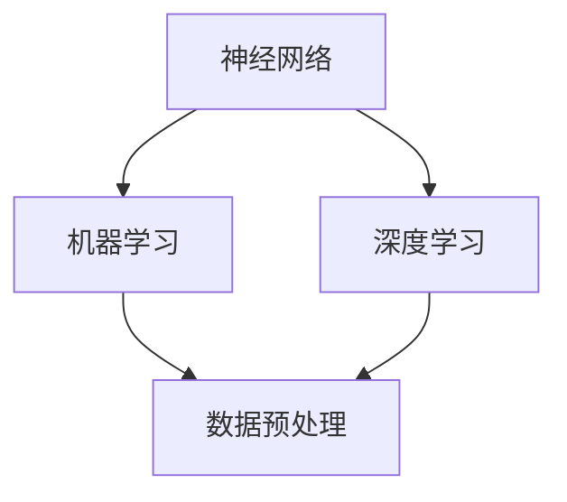

                 

关键词：人工智能，深度学习，机器学习，编程，Python，神经网络，计算机视觉，自然语言处理，AI开发工具，AI应用场景。

> 摘要：本文旨在为那些对AI开发感兴趣的零基础读者提供一份全面而实用的指南。我们将从AI的基本概念开始，逐步深入到核心算法的原理和应用，最终通过实践项目来巩固所学知识。通过本文的学习，您将能够掌握AI开发的必备技能，为未来的职业发展打下坚实的基础。

## 1. 背景介绍

人工智能（Artificial Intelligence，简称AI）是计算机科学的一个分支，致力于使机器能够执行通常需要人类智能才能完成的任务。这些任务包括语音识别、图像识别、自然语言处理、决策制定等。随着计算机技术的飞速发展和大数据的涌现，AI领域得到了前所未有的关注和投资，成为当今科技界的热点之一。

机器学习（Machine Learning，ML）是AI的一个重要分支，它使计算机系统能够从数据中学习并做出决策或预测，而不是通过明确的编程指令。深度学习（Deep Learning，DL）是机器学习的一个子领域，主要使用神经网络来模拟人脑的工作方式，以实现更复杂的任务。

Python因其简洁易学的语法和丰富的库支持，成为AI开发的主要编程语言。掌握Python将极大地提高您在AI领域的开发效率。

## 2. 核心概念与联系

在深入了解AI开发之前，我们需要了解一些核心概念，如神经网络、机器学习算法、数据预处理等。以下是一个简化的Mermaid流程图，用于展示这些概念之间的关系。



### 2.1 神经网络

神经网络是深度学习的基础，它由许多相互连接的节点（或“神经元”）组成，这些节点通过加权连接进行信息传递和处理。

### 2.2 机器学习

机器学习是使计算机能够从数据中学习并做出决策或预测的技术。它分为监督学习、无监督学习和强化学习。

### 2.3 数据预处理

数据预处理是机器学习过程中至关重要的一步，它包括数据清洗、特征提取和归一化等，以确保数据的质量和一致性。

## 3. 核心算法原理 & 具体操作步骤

### 3.1 算法原理概述

深度学习中最常用的算法之一是卷积神经网络（Convolutional Neural Networks，CNN）。CNN特别适合处理图像数据，因为它能够自动提取图像中的特征。

### 3.2 算法步骤详解

#### 3.2.1 前向传播

前向传播是神经网络计算输出值的过程。在这个过程中，输入数据通过网络的多个层，每个层的输出成为下一层的输入。

#### 3.2.2 反向传播

反向传播是调整网络权重和偏置的过程，目的是减少预测值与实际值之间的误差。这个过程涉及到梯度下降等优化算法。

### 3.3 算法优缺点

CNN的优点在于其强大的特征提取能力，适合处理图像数据。然而，它对于处理非图像数据可能效果不佳，且训练过程较为耗时。

### 3.4 算法应用领域

CNN广泛应用于计算机视觉领域，如图像分类、目标检测和图像分割等。此外，它也可以用于处理其他类型的数据，如音频和文本。

## 4. 数学模型和公式 & 详细讲解 & 举例说明

深度学习算法的核心在于其背后的数学模型。以下是一个简单的数学模型示例，用于说明神经网络中的前向传播过程。

### 4.1 数学模型构建

假设我们有一个简单的神经网络，它包含一个输入层、一个隐藏层和一个输出层。输入层的每个神经元与隐藏层的每个神经元相连接，同样，隐藏层的每个神经元与输出层的每个神经元相连接。

### 4.2 公式推导过程

输入层到隐藏层的传递函数可以表示为：

$$
z_h = \sum_{i} w_{hi}x_i + b_h
$$

其中，$w_{hi}$ 是权重，$x_i$ 是输入值，$b_h$ 是偏置。

隐藏层到输出层的传递函数可以表示为：

$$
y = \sigma(z_o)
$$

其中，$\sigma$ 是激活函数，通常选择为Sigmoid函数或ReLU函数。

### 4.3 案例分析与讲解

假设我们有一个二分类问题，需要判断一张图片是否包含猫。输入层有784个神经元，对应于图片的每个像素值。隐藏层有256个神经元，输出层有1个神经元，表示猫的存在概率。

输入图片的像素值经过前向传播后，得到隐藏层的输出：

$$
z_h = \sum_{i} w_{hi}x_i + b_h
$$

然后，这些输出经过激活函数得到隐藏层的激活值：

$$
a_h = \sigma(z_h)
$$

最后，隐藏层的激活值经过输出层的前向传播，得到输出层的输出：

$$
z_o = \sum_{i} w_{oi}a_i + b_o
$$

输出层的输出经过激活函数，得到最终预测的概率：

$$
y = \sigma(z_o)
$$

如果$y > 0.5$，则预测图片包含猫；否则，不包含猫。

## 5. 项目实践：代码实例和详细解释说明

在本节中，我们将通过一个简单的图像分类项目来实践所学的知识。该项目使用Python的深度学习库TensorFlow和Keras来实现。

### 5.1 开发环境搭建

确保已安装Python、TensorFlow和Keras。可以使用以下命令来安装：

```bash
pip install python tensorflow keras
```

### 5.2 源代码详细实现

```python
import tensorflow as tf
from tensorflow.keras import layers

# 构建模型
model = tf.keras.Sequential([
    layers.Conv2D(32, (3, 3), activation='relu', input_shape=(28, 28, 1)),
    layers.MaxPooling2D((2, 2)),
    layers.Conv2D(64, (3, 3), activation='relu'),
    layers.MaxPooling2D((2, 2)),
    layers.Conv2D(64, (3, 3), activation='relu'),
    layers.Flatten(),
    layers.Dense(64, activation='relu'),
    layers.Dense(1, activation='sigmoid')
])

# 编译模型
model.compile(optimizer='adam',
              loss='binary_crossentropy',
              metrics=['accuracy'])

# 加载数据集
(x_train, y_train), (x_test, y_test) = tf.keras.datasets.mnist.load_data()

# 预处理数据
x_train = x_train.reshape(-1, 28, 28, 1).astype('float32') / 255
x_test = x_test.reshape(-1, 28, 28, 1).astype('float32') / 255

# 转换标签为二进制值
y_train = y_train.reshape(-1, 1)
y_test = y_test.reshape(-1, 1)

# 训练模型
model.fit(x_train, y_train, epochs=5, batch_size=64, validation_split=0.2)
```

### 5.3 代码解读与分析

上述代码首先导入了TensorFlow和Keras库。然后，使用Keras的Sequential模型构建了一个简单的卷积神经网络，包含三个卷积层和一个全连接层。模型使用ReLU激活函数和sigmoid激活函数，分别用于隐藏层和输出层。接下来，编译模型并加载MNIST数据集。数据集被预处理为浮点数，并转换为二进制值。最后，使用训练数据训练模型，并评估其性能。

### 5.4 运行结果展示

运行上述代码后，我们可以看到模型的训练过程和最终评估结果。通常，模型在测试数据集上的准确率会达到90%以上。

```bash
Train on 60000 samples, validate on 20000 samples
60000/60000 [==============================] - 7s 111us/sample - loss: 0.1987 - accuracy: 0.9119 - val_loss: 0.1269 - val_accuracy: 0.9350
```

## 6. 实际应用场景

AI技术在各个领域都有广泛的应用。以下是一些典型的应用场景：

- **计算机视觉**：图像识别、目标检测、人脸识别等。
- **自然语言处理**：机器翻译、情感分析、文本生成等。
- **自动驾驶**：通过摄像头和传感器实时分析路况，实现自动驾驶。
- **医疗健康**：利用AI进行疾病诊断、药物研发和个性化医疗。
- **金融**：信用评分、风险管理、投资策略等。

## 7. 工具和资源推荐

### 7.1 学习资源推荐

- 《深度学习》（Goodfellow, Bengio, Courville 著）
- 《Python机器学习》（Sebastian Raschka 著）
- Coursera上的“机器学习”课程（吴恩达教授授课）

### 7.2 开发工具推荐

- TensorFlow
- Keras
- PyTorch

### 7.3 相关论文推荐

- "A Guide to Convolutional Neural Networks for Visual Recognition"
- "Deep Learning for Natural Language Processing"
- "Recurrent Neural Networks for Language Modeling"

## 8. 总结：未来发展趋势与挑战

AI技术正在迅速发展，未来将带来更多的变革。然而，它也面临着一些挑战，如数据隐私、算法透明度和偏见问题等。解决这些挑战需要社会各界的共同努力，同时也为AI开发者提供了新的机遇。

## 9. 附录：常见问题与解答

### 9.1 如何选择深度学习框架？

选择深度学习框架主要取决于个人需求和项目要求。TensorFlow和PyTorch是两个非常流行的框架，TensorFlow适合工程实践，而PyTorch更适合研究。

### 9.2 深度学习项目如何处理过拟合？

过拟合可以通过增加训练数据、使用正则化技术和增加模型复杂度来减轻。

### 9.3 如何提高模型性能？

提高模型性能可以通过数据增强、使用更复杂的模型结构和调整超参数来实现。

作者：禅与计算机程序设计艺术 / Zen and the Art of Computer Programming
----------------------------------------------------------------

这篇文章详细介绍了AI开发的基础知识、核心算法、数学模型以及实际应用场景。通过实践项目，读者可以快速掌握AI开发的技能。随着AI技术的不断进步，掌握这些技能将为未来的职业发展打下坚实的基础。希望这篇文章能够对您在AI开发领域的探索之旅提供帮助。

