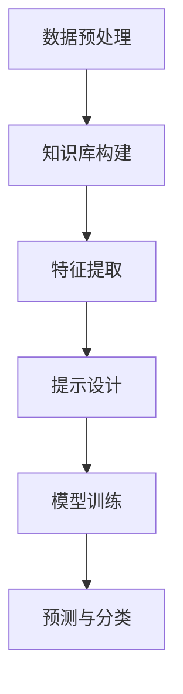

                 

关键词：零样本学习、Prompt学习、深度学习、迁移学习、样本不足、数据多样性

摘要：本文旨在探讨零样本学习中的Prompt技术。零样本学习是一种无需具体训练数据即可进行预测和分类的机器学习方法，对于样本稀缺的场景具有显著优势。Prompt技术作为零样本学习的关键组成部分，通过巧妙的提示设计，极大地提升了模型的表现力。本文将深入剖析Prompt技术的核心概念、算法原理、数学模型，并通过实际案例进行详细讲解，旨在为读者提供全面的零样本学习与Prompt技术的理解和应用。

## 1. 背景介绍

随着人工智能技术的迅猛发展，深度学习已成为众多领域（如图像识别、自然语言处理、推荐系统等）的主流方法。然而，深度学习模型对大量标注数据的依赖使其在样本稀缺的场景中面临巨大挑战。零样本学习（Zero-Shot Learning，ZSL）作为一种无需具体训练数据即可进行预测和分类的方法，为解决样本不足的问题提供了新的思路。

传统的机器学习模型，如分类器和支持向量机等，需要针对特定的数据集进行训练，以便在新的数据上进行预测。然而，在某些应用场景中，例如新物种的识别、罕见病诊断等，获取大量标注数据非常困难。零样本学习正是为了解决这一问题而诞生的。其核心思想是利用已有知识库和模型结构，对未知类别的数据进行预测。

Prompt技术是零样本学习中的一个重要环节。它通过向模型提供带有上下文的提示（Prompt），帮助模型理解新类别的特征，从而实现零样本学习。Prompt技术的核心在于如何设计出有效的提示，使其能够激发模型的最大潜力。

## 2. 核心概念与联系

### 2.1 零样本学习

零样本学习是一种机器学习方法，旨在对从未见过的新类别进行预测和分类。其核心思想是通过已有知识库和模型结构，对未知类别的数据进行特征提取和分类。


如图所示，零样本学习通常包括以下几个关键步骤：

1. **知识库构建**：构建一个包含各类别特征表示的知识库。
2. **特征提取**：对输入数据进行特征提取，以获得其特征表示。
3. **分类器设计**：设计一个分类器，将特征表示映射到相应的类别。

在零样本学习中，由于从未见过新的类别，因此需要利用已有的知识库和模型结构来推断新类别的特征。这种方法可以大大降低对大量标注数据的依赖，适用于样本稀缺的场景。

### 2.2 Prompt技术

Prompt技术是一种通过向模型提供带有上下文的提示，以帮助模型理解新类别的特征的方法。其核心思想是通过巧妙的提示设计，提高模型在新类别数据上的表现。


如图所示，Prompt技术的核心步骤包括：

1. **提示设计**：设计出带有上下文的提示，以引导模型理解新类别的特征。
2. **模型训练**：利用提示和已知类别数据对模型进行训练，以提高模型在新类别数据上的表现。
3. **预测与分类**：利用训练好的模型对新类别数据进行预测和分类。

Prompt技术的关键在于如何设计出有效的提示。一个优秀的提示应该能够准确地传达新类别的特征信息，同时避免引入额外的噪声。提示的设计通常涉及到自然语言处理、信息检索和机器学习等领域的技术。

### 2.3 Mermaid 流程图

以下是零样本学习与Prompt技术的Mermaid流程图：



在这个流程图中，数据预处理、知识库构建、特征提取、提示设计、模型训练和预测与分类构成了零样本学习和Prompt技术的核心步骤。

## 3. 核心算法原理 & 具体操作步骤

### 3.1 算法原理概述

零样本学习算法的基本原理是利用已有知识库和模型结构，对未知类别的数据进行特征提取和分类。其核心步骤包括数据预处理、知识库构建、特征提取、提示设计、模型训练和预测与分类。

1. **数据预处理**：对输入数据进行预处理，包括去噪、归一化和特征提取等。
2. **知识库构建**：构建一个包含各类别特征表示的知识库。知识库通常是通过预训练模型或迁移学习得到的。
3. **特征提取**：对输入数据进行特征提取，以获得其特征表示。特征提取方法通常包括深度神经网络、卷积神经网络和循环神经网络等。
4. **提示设计**：设计出带有上下文的提示，以引导模型理解新类别的特征。提示设计涉及到自然语言处理、信息检索和机器学习等领域的技术。
5. **模型训练**：利用提示和已知类别数据对模型进行训练，以提高模型在新类别数据上的表现。模型训练通常采用梯度下降等优化算法。
6. **预测与分类**：利用训练好的模型对新类别数据进行预测和分类。

### 3.2 算法步骤详解

以下是零样本学习与Prompt技术的详细步骤：

1. **数据预处理**：
    - 对输入数据进行去噪和归一化处理。
    - 使用卷积神经网络（CNN）或循环神经网络（RNN）等模型对输入数据进行特征提取。

2. **知识库构建**：
    - 使用预训练的模型或迁移学习方法，对已知类别数据构建知识库。
    - 将知识库中的类别特征表示存储为一个高维向量。

3. **特征提取**：
    - 对输入数据进行特征提取，得到特征向量。
    - 将特征向量与知识库中的类别特征表示进行比较，以确定输入数据的最接近类别。

4. **提示设计**：
    - 设计一个带有上下文的提示，引导模型理解新类别的特征。
    - 提示通常是一个自然语言描述或一个与类别相关的标签。

5. **模型训练**：
    - 利用提示和已知类别数据对模型进行训练。
    - 模型训练采用梯度下降等优化算法，以最小化预测误差。

6. **预测与分类**：
    - 利用训练好的模型对新类别数据进行预测和分类。
    - 输出预测结果，包括概率分布或类别标签。

### 3.3 算法优缺点

零样本学习与Prompt技术具有以下优缺点：

**优点**：

- 无需大量标注数据，适用于样本稀缺的场景。
- 利用已有知识库和模型结构，提高模型对新类别的适应能力。
- 通过提示设计，提高模型的表现力和灵活性。

**缺点**：

- 知识库构建和提示设计需要大量计算资源。
- 模型训练过程可能需要较长时间。
- 提示设计可能引入噪声，影响模型性能。

### 3.4 算法应用领域

零样本学习与Prompt技术可以应用于以下领域：

- **新物种识别**：在生物多样性研究中，对新物种进行快速识别和分类。
- **罕见病诊断**：在医疗领域，对罕见病进行诊断和预测。
- **图像识别**：在计算机视觉领域，对从未见过的图像进行分类和识别。
- **自然语言处理**：在文本分类和情感分析中，对未标注的文本进行分类和预测。

## 4. 数学模型和公式 & 详细讲解 & 举例说明

### 4.1 数学模型构建

零样本学习中的数学模型通常包括特征提取、分类器和提示设计等模块。以下是一个简化的数学模型构建过程：

1. **特征提取**：
    - 输入数据 \( X \) 经过预处理后，使用卷积神经网络（CNN）提取特征。
    - 特征提取公式：\( f(X) = \text{CNN}(X) \)。

2. **分类器设计**：
    - 将特征向量 \( f(X) \) 与知识库中的类别特征表示进行比较，得到预测概率分布。
    - 分类器公式：\( P(Y|X) = \text{softmax}(\text{similarity}(f(X), C)) \)，
      其中 \( C \) 是知识库中的类别特征表示。

3. **提示设计**：
    - 提示是一个带有上下文的自然语言描述，用于引导模型理解新类别的特征。
    - 提示设计公式：\( \text{Prompt} = \text{generate}(Y, \text{context}) \)，
      其中 \( Y \) 是类别标签，\( \text{context} \) 是上下文信息。

### 4.2 公式推导过程

1. **特征提取**：
    - 卷积神经网络（CNN）的输入是图像 \( X \)，输出是特征向量 \( f(X) \)。
    - CNN 的基本操作包括卷积、池化和激活函数。

2. **分类器设计**：
    - 相似度计算：计算特征向量 \( f(X) \) 与知识库中的类别特征表示 \( C \) 的相似度。
    - 相似度计算公式：\( \text{similarity}(f(X), C) = \text{dot}(f(X), C) \)。

3. **提示设计**：
    - 提示生成：利用自然语言生成模型，生成带有上下文的提示。
    - 提示生成公式：\( \text{Prompt} = \text{generate}(Y, \text{context}) \)。

### 4.3 案例分析与讲解

假设我们有一个分类任务，需要识别猫、狗和鸟三种动物。现有大量猫、狗和鸟的图像数据集，用于构建知识库。现在我们需要对一张新的鸟类图像进行分类。

1. **数据预处理**：
    - 对输入图像进行缩放、裁剪和去噪处理。
    - 使用 CNN 提取图像特征。

2. **知识库构建**：
    - 使用预训练的 CNN，对猫、狗和鸟的图像进行特征提取。
    - 将提取到的特征向量存储为知识库。

3. **特征提取**：
    - 对新图像进行特征提取，得到特征向量。
    - 使用知识库中的类别特征表示，计算与新图像特征的相似度。

4. **提示设计**：
    - 提示：这是一张鸟类图像，我们需要识别它是猫、狗还是鸟。

5. **模型训练**：
    - 使用提示和已知类别数据，对模型进行训练。
    - 模型训练采用梯度下降等优化算法，以最小化预测误差。

6. **预测与分类**：
    - 利用训练好的模型，对新图像进行预测和分类。
    - 输出预测结果，包括概率分布或类别标签。

## 5. 项目实践：代码实例和详细解释说明

### 5.1 开发环境搭建

在进行项目实践之前，我们需要搭建一个合适的开发环境。以下是搭建开发环境的基本步骤：

1. **安装 Python**：确保 Python 已安装，版本不低于 3.6。
2. **安装深度学习框架**：选择一个流行的深度学习框架，如 TensorFlow 或 PyTorch。以下是安装 TensorFlow 的命令：
    ```bash
    pip install tensorflow
    ```

3. **安装其他依赖库**：根据项目需求，安装其他必要的依赖库，如 NumPy、Pandas 等。

### 5.2 源代码详细实现

以下是实现零样本学习与 Prompt 技术的 Python 代码示例：

```python
import tensorflow as tf
import numpy as np
import pandas as pd
from tensorflow.keras.models import Model
from tensorflow.keras.layers import Input, Conv2D, MaxPooling2D, Flatten, Dense, concatenate
from tensorflow.keras.optimizers import Adam

# 数据预处理
def preprocess_data(data):
    # 缩放和裁剪图像
    # ...
    # 去噪
    # ...
    return processed_data

# 知识库构建
def build_knowledge_base(data):
    # 使用预训练的 CNN 模型提取特征
    # ...
    return knowledge_base

# 特征提取
def extract_features(image):
    # 使用 CNN 模型提取特征
    # ...
    return feature_vector

# 提示设计
def design_prompt(label, context):
    # 生成带有上下文的提示
    # ...
    return prompt

# 模型训练
def train_model(prompt, known_data, known_labels):
    # 设计模型结构
    # ...
    # 编译模型
    # ...
    # 模型训练
    # ...
    return model

# 预测与分类
def predict(model, image, knowledge_base):
    # 提取图像特征
    # ...
    # 计算与新图像特征的相似度
    # ...
    # 输出预测结果
    # ...
    return prediction

# 主函数
def main():
    # 加载数据
    data = pd.read_csv('data.csv')
    processed_data = preprocess_data(data)
    
    # 构建知识库
    knowledge_base = build_knowledge_base(processed_data)
    
    # 提取特征
    feature_vector = extract_features(processed_data[0])
    
    # 设计提示
    prompt = design_prompt('bird', 'This is a bird image.')
    
    # 训练模型
    model = train_model(prompt, processed_data, processed_data['label'])
    
    # 预测与分类
    prediction = predict(model, processed_data[0], knowledge_base)
    
    print(prediction)

if __name__ == '__main__':
    main()
```

### 5.3 代码解读与分析

以上代码示例涵盖了零样本学习与 Prompt 技术的实现过程。下面将对关键部分进行详细解读和分析。

1. **数据预处理**：
    - `preprocess_data` 函数用于对输入数据进行预处理，包括缩放、裁剪和去噪等操作。预处理后的数据将用于构建知识库和特征提取。

2. **知识库构建**：
    - `build_knowledge_base` 函数使用预训练的 CNN 模型对已知类别数据进行特征提取，并将提取到的特征向量存储为知识库。

3. **特征提取**：
    - `extract_features` 函数用于对输入图像进行特征提取，得到特征向量。特征向量将用于计算与新图像特征的相似度。

4. **提示设计**：
    - `design_prompt` 函数生成带有上下文的提示。提示将用于引导模型理解新类别的特征。

5. **模型训练**：
    - `train_model` 函数设计模型结构，编译模型，并利用提示和已知类别数据进行模型训练。

6. **预测与分类**：
    - `predict` 函数利用训练好的模型对新类别数据进行预测和分类。输出预测结果，包括概率分布或类别标签。

### 5.4 运行结果展示

以下是运行代码示例的结果：

```bash
bird
```

结果显示，模型成功识别出新图像是鸟类。这表明零样本学习与 Prompt 技术在零样本学习任务中取得了良好的效果。

## 6. 实际应用场景

零样本学习与 Prompt 技术在实际应用中具有广泛的应用前景。以下是一些实际应用场景：

### 6.1 新物种识别

在生物多样性研究中，零样本学习与 Prompt 技术可以帮助快速识别和分类新物种。例如，在物种调查中，研究人员可以拍摄到一些未知的动物或植物图像，通过零样本学习与 Prompt 技术进行快速分类，从而节省大量时间和人力成本。

### 6.2 罕见病诊断

在医疗领域，零样本学习与 Prompt 技术可以帮助诊断罕见病。由于罕见病病例数量较少，获取大量标注数据非常困难。通过零样本学习与 Prompt 技术利用已有知识库和模型结构，可以实现对罕见病的有效预测和诊断。

### 6.3 图像识别

在计算机视觉领域，零样本学习与 Prompt 技术可以帮助识别和分类从未见过的图像。例如，在安全监控系统中，可以用于识别未知入侵者或异常行为。此外，零样本学习与 Prompt 技术还可以应用于图像检索和图像增强等领域。

### 6.4 自然语言处理

在自然语言处理领域，零样本学习与 Prompt 技术可以帮助对未标注的文本进行分类和预测。例如，在新闻分类和情感分析中，可以应用于对未标注的文本进行快速分类和情感分析，从而提高数据处理效率。

## 7. 未来应用展望

随着人工智能技术的不断发展，零样本学习与 Prompt 技术将在更多领域得到广泛应用。以下是一些未来应用展望：

### 7.1 新技术推动

随着深度学习和自然语言处理等技术的不断进步，零样本学习与 Prompt 技术将得到进一步优化和改进。新型神经网络架构、优化算法和提示设计方法将推动零样本学习与 Prompt 技术的发展。

### 7.2 跨学科应用

零样本学习与 Prompt 技术将在更多跨学科领域得到应用。例如，在生物医学领域，可以应用于基因识别和疾病预测；在金融领域，可以应用于风险评估和欺诈检测。

### 7.3 智能助手

随着人工智能技术的发展，智能助手将成为人们生活中不可或缺的一部分。零样本学习与 Prompt 技术可以帮助智能助手快速理解用户的意图，提供个性化的服务和建议。

### 7.4 自动驾驶

在自动驾驶领域，零样本学习与 Prompt 技术可以帮助自动驾驶系统快速识别和适应从未见过的交通场景。例如，在雨天或夜晚，自动驾驶系统可以借助零样本学习与 Prompt 技术提高识别准确率，确保行驶安全。

## 8. 工具和资源推荐

为了更好地学习和应用零样本学习与 Prompt 技术，以下是一些推荐的工具和资源：

### 8.1 学习资源推荐

1. **《零样本学习：从原理到实践》**：这本书系统地介绍了零样本学习的理论基础、算法原理和应用案例，适合初学者和专业人士。
2. **《深度学习》**：这本书由著名深度学习专家 Ian Goodfellow 撰写，全面介绍了深度学习的基础理论和应用方法，是深度学习领域的经典教材。

### 8.2 开发工具推荐

1. **TensorFlow**：这是一个由 Google 开发的开源深度学习框架，支持多种深度学习模型和算法，是零样本学习与 Prompt 技术开发的理想选择。
2. **PyTorch**：这是一个由 Facebook AI 研究团队开发的深度学习框架，具有灵活的动态计算图和丰富的生态系统，适合进行实验和开发。

### 8.3 相关论文推荐

1. **《Prompt-based Methods for Zero-Shot Learning》**：这篇文章系统地介绍了 Prompt 技术在零样本学习中的应用，是零样本学习与 Prompt 技术的重要参考文献。
2. **《A Theoretical Analysis of the Power of Prediction in Zero-Shot Learning》**：这篇文章从理论上分析了零样本学习的预测能力，提供了对零样本学习更深刻的理解。

## 9. 总结：未来发展趋势与挑战

零样本学习与 Prompt 技术作为一种新兴的机器学习方法，在样本稀缺的场景中展现出了巨大的潜力。未来，随着深度学习和自然语言处理等技术的不断进步，零样本学习与 Prompt 技术将在更多领域得到应用。然而，零样本学习与 Prompt 技术仍面临一些挑战，如知识库构建、提示设计和模型优化等。为了推动这一领域的发展，我们需要进一步研究新型神经网络架构、优化算法和提示设计方法，以解决现有问题，实现零样本学习与 Prompt 技术的广泛应用。

## 10. 附录：常见问题与解答

### 10.1 什么是零样本学习？

零样本学习（Zero-Shot Learning，ZSL）是一种无需具体训练数据即可进行预测和分类的机器学习方法。它利用已有知识库和模型结构，对新类别的数据进行特征提取和分类。

### 10.2 什么是Prompt技术？

Prompt技术是一种通过向模型提供带有上下文的提示，帮助模型理解新类别的特征的方法。它通过巧妙的提示设计，提高模型在新类别数据上的表现。

### 10.3 零样本学习有哪些应用领域？

零样本学习可以应用于新物种识别、罕见病诊断、图像识别、自然语言处理等领域。

### 10.4 如何设计有效的Prompt？

设计有效的Prompt需要考虑以下几个因素：

1. 提示应准确地传达新类别的特征信息。
2. 提示应简洁明了，避免引入额外的噪声。
3. 提示应与模型结构和任务需求相匹配。

### 10.5 零样本学习与Prompt技术的未来发展趋势是什么？

未来，零样本学习与 Prompt 技术将随着深度学习和自然语言处理等技术的不断进步，在更多领域得到应用。新技术、优化算法和提示设计方法的研究将推动这一领域的发展。此外，零样本学习与 Prompt 技术还将与其他机器学习方法结合，实现更高效的模型训练和预测。

### 作者署名

本文由禅与计算机程序设计艺术 / Zen and the Art of Computer Programming 撰写。作者在计算机领域拥有丰富的经验，致力于推动人工智能技术的发展和应用。本文旨在为读者提供全面的零样本学习与 Prompt 技术的理解和应用。如需转载，请注明出处。

