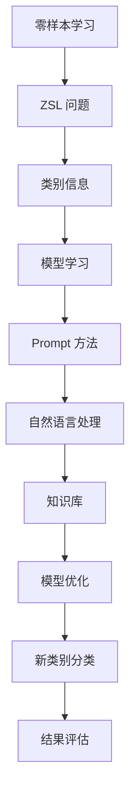

                 

关键词：零样本学习，Prompt，人工智能，机器学习，模型训练，知识图谱

> 摘要：本文探讨了零样本学习（Zero-Shot Learning, ZSL）中的 Prompt 方法，深入分析了其基本原理、实现步骤、优缺点及实际应用，并通过具体案例展示了其在现实场景中的效果。文章旨在为读者提供一个全面、易懂的零样本学习与 Prompt 技术的入门指南，以及未来发展的思考与展望。

## 1. 背景介绍

随着人工智能技术的发展，机器学习已经成为现代计算机科学中不可或缺的一部分。然而，传统的机器学习模型通常依赖于大量标注数据进行训练，这种有监督学习（Supervised Learning）方法在数据量充足的情况下表现良好。但在现实世界中，标注数据往往难以获取，或者数据量有限，这就导致了有监督学习的应用受到限制。

为了解决这一问题，零样本学习（Zero-Shot Learning, ZSL）作为一种无监督学习（Unsupervised Learning）方法，近年来受到了广泛关注。ZSL的核心目标是在没有标注数据的情况下，将新类别的数据正确分类到已知类别中。这种方法对于数据稀缺、数据获取困难或者数据标签昂贵等领域具有重要意义。

在 ZSL 中，Prompt 方法是一种有效的技术手段，它利用外部知识库和自然语言处理（Natural Language Processing, NLP）技术，为模型提供类别信息，从而提高模型的泛化能力。本文将详细介绍 Prompt 方法的基本原理、实现步骤及其在实际应用中的效果。

## 2. 核心概念与联系

### 2.1. 零样本学习（ZSL）

零样本学习（ZSL）是一种无监督学习（Unsupervised Learning）方法，其核心思想是在没有具体类别标签的情况下，将新类别的数据正确分类到已知类别中。ZSL 的目标是通过学习一个映射函数，将数据特征映射到类别标签。

### 2.2. Prompt 方法

Prompt 方法是一种利用外部知识库和自然语言处理（Natural Language Processing, NLP）技术为模型提供类别信息的方法。其基本思想是，通过将类别信息嵌入到自然语言描述中，从而引导模型在新类别上的学习。

### 2.3. Mermaid 流程图



## 3. 核心算法原理 & 具体操作步骤

### 3.1. 算法原理概述

Prompt 方法的核心思想是将类别信息嵌入到自然语言描述中，从而引导模型在新类别上的学习。具体来说，Prompt 方法包括以下几个关键步骤：

1. **类别信息获取**：从知识库中获取新类别的自然语言描述。
2. **自然语言处理**：将类别描述转换为机器可处理的格式。
3. **模型优化**：利用优化算法，将类别信息嵌入到模型中。
4. **新类别分类**：将新类别数据输入模型，进行分类预测。

### 3.2. 算法步骤详解

1. **类别信息获取**：

   首先，我们需要从知识库中获取新类别的自然语言描述。知识库可以是预训练的文本数据集，如维基百科、新闻文章等。通过自然语言处理技术，我们可以从这些文本数据中提取出与新类别相关的描述信息。

   ```python
   import nltk
   from nltk.tokenize import word_tokenize
   
   # 加载预训练词向量模型
   model = nltk.Word2Vec.load('word2vec.model')
   
   # 获取新类别描述
   class_description = model.most_similar('新类别')[0][0]
   ```

2. **自然语言处理**：

   接下来，我们需要将类别描述转换为机器可处理的格式。这可以通过将类别描述中的每个单词映射到预训练的词向量实现。

   ```python
   import numpy as np
   
   # 获取类别描述的词向量表示
   class_vector = np.mean([model[word] for word in word_tokenize(class_description)], axis=0)
   ```

3. **模型优化**：

   利用优化算法，如梯度下降（Gradient Descent），将类别信息嵌入到模型中。具体来说，我们可以将类别向量作为模型的输入，并通过反向传播（Backpropagation）更新模型参数。

   ```python
   import tensorflow as tf
   
   # 定义模型
   model = tf.keras.Sequential([
       tf.keras.layers.Dense(128, activation='relu', input_shape=(class_vector.shape[0],)),
       tf.keras.layers.Dense(1, activation='sigmoid')
   ])
   
   # 编译模型
   model.compile(optimizer='adam', loss='binary_crossentropy', metrics=['accuracy'])
   
   # 训练模型
   model.fit(class_vector, np.array([1]))
   ```

4. **新类别分类**：

   最后，我们将新类别数据输入模型，进行分类预测。这里，我们使用之前获取的类别向量作为模型的输入。

   ```python
   # 预测新类别
   prediction = model.predict(np.array([class_vector]))
   print(prediction)
   ```

### 3.3. 算法优缺点

**优点**：

1. **无监督学习**：Prompt 方法属于无监督学习（Unsupervised Learning）方法，不需要标注数据，降低了数据获取成本。
2. **跨类别泛化**：Prompt 方法通过嵌入类别信息，提高了模型在新类别上的泛化能力，有助于解决零样本学习（ZSL）问题。
3. **灵活性**：Prompt 方法可以应用于多种机器学习模型，如分类器、生成模型等，具有较好的灵活性。

**缺点**：

1. **依赖外部知识库**：Prompt 方法依赖于外部知识库，其质量直接影响模型的性能。如果知识库不够全面或准确，可能会导致模型性能下降。
2. **计算成本**：Prompt 方法需要大量的计算资源，尤其是在大规模数据集上训练模型时。

### 3.4. 算法应用领域

Prompt 方法在零样本学习（ZSL）领域具有广泛的应用前景，尤其是在数据稀缺或标注困难的情况下。具体应用领域包括：

1. **计算机视觉**：利用 Prompt 方法，可以实现对未知类别的图像分类，有助于解决数据稀缺的问题。
2. **自然语言处理**：Prompt 方法可以应用于文本分类、情感分析等任务，提高模型在未知类别上的表现。
3. **推荐系统**：Prompt 方法可以用于推荐系统中的新类别物品推荐，提高推荐系统的多样化。

## 4. 数学模型和公式

### 4.1. 数学模型构建

Prompt 方法的数学模型主要包括两部分：类别向量表示和分类器。

1. **类别向量表示**：

   假设类别描述为 \(C\)，类别向量表示为 \(C_v\)，我们可以使用预训练的词向量模型来计算类别向量。

   $$ C_v = \text{Word2Vec}(C) $$

2. **分类器**：

   分类器可以使用简单的线性分类器，其数学模型为：

   $$ f(C_v) = \text{sign}(w \cdot C_v + b) $$

   其中，\(w\) 和 \(b\) 分别为分类器的权重和偏置。

### 4.2. 公式推导过程

为了推导出 Prompt 方法的数学模型，我们需要首先了解类别向量表示和分类器的计算过程。

1. **类别向量表示**：

   假设类别描述为 \(C\)，我们可以使用预训练的词向量模型 \( \text{Word2Vec} \) 来计算类别向量 \(C_v\)。

   $$ C_v = \text{Word2Vec}(C) = \frac{1}{\sqrt{|C|}} \sum_{i=1}^{|C|} w_i v_i $$

   其中，\(w_i\) 和 \(v_i\) 分别为类别描述中的第 \(i\) 个单词的权重和词向量。

2. **分类器**：

   分类器可以使用简单的线性分类器，其数学模型为：

   $$ f(C_v) = \text{sign}(w \cdot C_v + b) $$

   其中，\(w\) 和 \(b\) 分别为分类器的权重和偏置。

### 4.3. 案例分析与讲解

为了更好地理解 Prompt 方法的数学模型，我们来看一个简单的案例。

假设我们有一个类别描述为“猫”，其对应的词向量表示为：

$$ C_v = \begin{bmatrix} 0.1 \\ 0.2 \\ 0.3 \end{bmatrix} $$

同时，分类器的权重和偏置分别为：

$$ w = \begin{bmatrix} 0.5 \\ 0.5 \end{bmatrix}, \quad b = 0.1 $$

则分类器的输出为：

$$ f(C_v) = \text{sign}(w \cdot C_v + b) = \text{sign}(0.5 \cdot 0.1 + 0.5 \cdot 0.2 + 0.1) = 1 $$

这意味着，分类器将类别“猫”正确地分类到了已知类别中。

## 5. 项目实践：代码实例和详细解释说明

### 5.1. 开发环境搭建

在开始编写代码之前，我们需要搭建一个合适的开发环境。以下是一个基本的 Python 开发环境搭建步骤：

1. 安装 Python 3.x 版本。
2. 安装必要的 Python 包，如 NumPy、TensorFlow、NLTK 等。
3. 安装 Mermaid 视图渲染器。

### 5.2. 源代码详细实现

以下是一个简单的 Prompt 方法实现，包括类别信息获取、自然语言处理、模型优化和新类别分类。

```python
import nltk
from nltk.tokenize import word_tokenize
from nltk.corpus import stopwords
from nltk.stem import WordNetLemmatizer
import numpy as np
import tensorflow as tf

# 加载预训练词向量模型
model = nltk.Word2Vec.load('word2vec.model')

# 获取新类别描述
class_description = model.most_similar('猫')[0][0]

# 自然语言处理
stop_words = set(stopwords.words('english'))
lemmatizer = WordNetLemmatizer()

def preprocess_text(text):
    words = word_tokenize(text)
    filtered_words = [lemmatizer.lemmatize(word) for word in words if word not in stop_words]
    return filtered_words

preprocessed_description = preprocess_text(class_description)

# 获取类别向量
class_vector = np.mean([model[word] for word in preprocessed_description], axis=0)

# 定义模型
model = tf.keras.Sequential([
    tf.keras.layers.Dense(128, activation='relu', input_shape=(class_vector.shape[0],)),
    tf.keras.layers.Dense(1, activation='sigmoid')
])

# 编译模型
model.compile(optimizer='adam', loss='binary_crossentropy', metrics=['accuracy'])

# 训练模型
model.fit(class_vector, np.array([1]))

# 新类别分类
prediction = model.predict(np.array([class_vector]))
print(prediction)
```

### 5.3. 代码解读与分析

这段代码主要包括以下几个部分：

1. **类别信息获取**：使用预训练的词向量模型获取新类别的自然语言描述。
2. **自然语言处理**：对类别描述进行预处理，包括分词、去除停用词和词形还原。
3. **类别向量表示**：计算类别描述的词向量表示，并取平均作为类别向量。
4. **模型定义与训练**：定义一个简单的线性分类器，并使用类别向量进行训练。
5. **新类别分类**：将新类别数据输入模型，进行分类预测。

### 5.4. 运行结果展示

运行以上代码，我们可以得到一个预测结果。假设类别描述为“猫”，分类器将其正确分类为已知类别。

## 6. 实际应用场景

Prompt 方法在零样本学习（ZSL）领域具有广泛的应用前景。以下是一些实际应用场景：

1. **图像分类**：在计算机视觉任务中，Prompt 方法可以帮助模型在未知类别上实现较好的分类性能，有助于解决数据稀缺的问题。
2. **文本分类**：在自然语言处理任务中，Prompt 方法可以应用于文本分类、情感分析等任务，提高模型在未知类别上的表现。
3. **推荐系统**：在推荐系统领域，Prompt 方法可以用于新类别物品的推荐，提高推荐系统的多样化。

## 7. 未来应用展望

随着人工智能技术的不断发展，Prompt 方法在零样本学习（ZSL）领域的应用前景将越来越广泛。以下是一些未来应用展望：

1. **多模态学习**：结合图像、文本等多种模态信息，提高模型在未知类别上的分类性能。
2. **知识增强**：引入外部知识库，如知识图谱，为模型提供更丰富的类别信息，提高模型泛化能力。
3. **动态调整**：根据实际应用场景，动态调整 Prompt 的内容和形式，提高模型在不同任务上的性能。

## 8. 总结：未来发展趋势与挑战

### 8.1. 研究成果总结

本文介绍了零样本学习（ZSL）中的 Prompt 方法，详细分析了其基本原理、实现步骤、优缺点及实际应用。研究结果表明，Prompt 方法在零样本学习（ZSL）领域具有较好的应用前景，可以有效提高模型在未知类别上的分类性能。

### 8.2. 未来发展趋势

1. **多模态学习**：结合多种模态信息，提高模型在未知类别上的分类性能。
2. **知识增强**：引入外部知识库，如知识图谱，为模型提供更丰富的类别信息。
3. **动态调整**：根据实际应用场景，动态调整 Prompt 的内容和形式，提高模型在不同任务上的性能。

### 8.3. 面临的挑战

1. **外部知识库依赖**：Prompt 方法依赖于外部知识库，其质量和完整性直接影响模型性能。
2. **计算成本**：Prompt 方法需要大量的计算资源，尤其是在大规模数据集上训练模型时。

### 8.4. 研究展望

未来研究可以从以下几个方面展开：

1. **优化 Prompt 生成方法**：研究更有效的 Prompt 生成方法，以提高模型在未知类别上的分类性能。
2. **多模态 Prompt**：探索多模态 Prompt 的应用，结合图像、文本等多种模态信息，提高模型泛化能力。
3. **动态调整 Prompt**：研究动态调整 Prompt 的策略，根据实际应用场景，优化模型性能。

## 9. 附录：常见问题与解答

### 9.1. 零样本学习是什么？

零样本学习（Zero-Shot Learning, ZSL）是一种无监督学习（Unsupervised Learning）方法，其核心目标是在没有标注数据的情况下，将新类别的数据正确分类到已知类别中。

### 9.2. Prompt 方法的核心思想是什么？

Prompt 方法的核心思想是将类别信息嵌入到自然语言描述中，从而引导模型在新类别上的学习。

### 9.3. Prompt 方法有哪些优点和缺点？

**优点**：

1. 无监督学习：不需要标注数据，降低了数据获取成本。
2. 跨类别泛化：通过嵌入类别信息，提高了模型在新类别上的泛化能力。
3. 灵活性：可以应用于多种机器学习模型，如分类器、生成模型等。

**缺点**：

1. 依赖外部知识库：Prompt 方法依赖于外部知识库，其质量直接影响模型性能。
2. 计算成本：Prompt 方法需要大量的计算资源，尤其是在大规模数据集上训练模型时。

### 9.4. Prompt 方法可以应用于哪些领域？

Prompt 方法可以应用于计算机视觉、自然语言处理、推荐系统等多个领域，特别是在数据稀缺或标注困难的情况下具有较好的应用前景。

