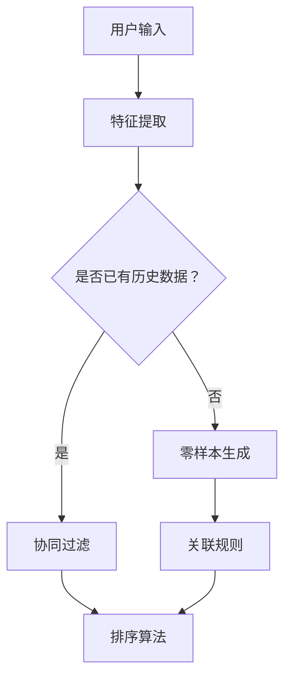

                 

关键词：零样本推荐系统、候选生成策略、排序算法、关联规则、协同过滤、深度学习

> 摘要：本文旨在探讨零样本推荐系统的候选生成策略，特别是排序算法在该领域的应用。通过对排序的深入考量，文章提出了几种新的候选生成策略，并结合实际案例，详细阐述了这些策略的实现步骤和效果。此外，文章还分析了数学模型和公式，提供了代码实例和详细解释，旨在为推荐系统领域的研究者和开发者提供有价值的参考。

## 1. 背景介绍

在互联网时代，推荐系统已经成为电商平台、社交媒体和在线视频平台等关键组成部分。传统的推荐系统大多依赖于协同过滤和基于内容的推荐方法。然而，这些方法通常需要用户的历史行为数据或者详细的用户兴趣信息。在数据稀缺或者用户行为多样化的情况下，这些方法的效果往往不尽如人意。为了解决这一问题，零样本推荐系统应运而生。

零样本推荐系统是一种无需用户历史数据或兴趣信息的推荐系统。它通过直接利用用户当前的状态或上下文来生成推荐。这种推荐方式在处理新用户或者用户行为数据缺失的场景中具有显著的优势。然而，零样本推荐系统面临的一个重大挑战是如何生成高质量的候选列表。在这一过程中，排序算法起着至关重要的作用。

排序算法是推荐系统中的一种关键技术，它的主要目标是在大量的候选项目中为用户找到最相关的项目。常见的排序算法包括基于内容的排序、基于协同过滤的排序和基于深度学习的排序等。这些算法各有优缺点，适用于不同的推荐场景。本文将重点探讨排序算法在零样本推荐系统中的应用，并提出新的候选生成策略。

## 2. 核心概念与联系

### 2.1. 关联规则与协同过滤

关联规则是一种用于发现数据集中项目之间潜在关系的分析方法。协同过滤是基于用户的历史行为数据，通过计算用户之间的相似性来推荐项目的方法。这两种方法在传统推荐系统中有着广泛的应用，但在零样本推荐系统中，它们的直接应用受到限制。

### 2.2. 深度学习与排序算法

深度学习是近年来在计算机视觉、自然语言处理等领域取得显著进展的人工智能技术。通过深度神经网络，深度学习能够自动学习数据中的复杂模式，为推荐系统提供了一种新的解决方案。在排序算法中，深度学习可以通过训练模型来预测项目的相关性，从而提高推荐的准确性。

### 2.3. Mermaid 流程图

以下是零样本推荐系统中核心概念和架构的 Mermaid 流程图：



在这个流程图中，用户输入被用于特征提取，然后根据是否有历史数据，系统会采用不同的方法进行候选生成。零样本生成和关联规则为排序算法提供候选列表，而协同过滤则可以增强这些候选项目的相关性。

## 3. 核心算法原理 & 具体操作步骤

### 3.1. 算法原理概述

零样本推荐系统的核心在于如何生成高质量的候选列表。在这一过程中，排序算法起到了关键作用。排序算法的主要目标是在大量的候选项目中为用户找到最相关的项目。为了实现这一目标，排序算法通常需要以下几个步骤：

1. 特征提取：将用户的当前状态或上下文转换为可量化的特征向量。
2. 候选生成：根据特征向量生成候选项目列表。
3. 排序：对候选项目列表进行排序，以找到最相关的项目。

### 3.2. 算法步骤详解

1. **特征提取**

   特征提取是将用户的当前状态或上下文转换为可量化的特征向量。具体步骤如下：

   - 数据预处理：对输入数据进行清洗和预处理，包括去除噪声、标准化等。
   - 特征选择：选择与用户兴趣相关的特征，例如文本特征、图像特征、用户行为特征等。
   - 特征提取：使用相应的技术提取特征向量，例如词嵌入、图像特征提取等。

2. **候选生成**

   候选生成是根据特征向量生成候选项目列表。具体步骤如下：

   - 关联规则挖掘：使用关联规则算法（如Apriori算法）从用户特征中挖掘出潜在的关联关系。
   - 零样本生成：使用生成模型（如变分自编码器VAE）生成新的候选项目。
   - 协同过滤：使用协同过滤算法（如矩阵分解）从用户历史数据中生成候选项目。

3. **排序**

   排序是对候选项目列表进行排序，以找到最相关的项目。具体步骤如下：

   - 相似性计算：计算候选项目与用户特征向量之间的相似性，通常使用余弦相似度或欧氏距离。
   - 排序算法：使用排序算法（如Top-N算法）对候选项目列表进行排序。

### 3.3. 算法优缺点

零样本推荐系统的候选生成策略具有以下优缺点：

- **优点**：

  - 不依赖用户历史数据，适用于新用户或数据稀缺的场景。
  - 能够生成多样化的候选列表，提高推荐的多样性。

- **缺点**：

  - 推荐准确性可能较低，尤其是在用户行为数据稀缺的情况下。
  - 计算成本较高，尤其是在处理大量候选项目时。

### 3.4. 算法应用领域

零样本推荐系统的候选生成策略在以下领域有广泛的应用：

- 电商平台：为新用户生成个性化推荐，提高转化率。
- 社交媒体：为用户提供个性化的内容推荐，增强用户体验。
- 在线视频平台：为用户提供个性化的视频推荐，提高用户留存率。

## 4. 数学模型和公式

在零样本推荐系统中，数学模型和公式是核心组成部分。以下将详细介绍数学模型和公式的构建、推导过程以及实际应用。

### 4.1. 数学模型构建

零样本推荐系统的数学模型主要包括特征提取模型、候选生成模型和排序模型。

1. **特征提取模型**

   特征提取模型用于将用户的当前状态或上下文转换为可量化的特征向量。常见的特征提取模型包括：

   - **词嵌入模型**：用于处理文本数据，将词汇转换为高维向量表示。
   - **卷积神经网络（CNN）**：用于处理图像数据，提取图像特征。
   - **循环神经网络（RNN）**：用于处理序列数据，提取时间序列特征。

2. **候选生成模型**

   候选生成模型用于生成候选项目列表。常见的候选生成模型包括：

   - **关联规则模型**：用于从用户特征中挖掘潜在的关联关系。
   - **生成对抗网络（GAN）**：用于生成新的候选项目。
   - **矩阵分解模型**：用于从用户历史数据中生成候选项目。

3. **排序模型**

   排序模型用于对候选项目列表进行排序。常见的排序模型包括：

   - **基于相似度的排序模型**：使用相似度度量计算候选项目与用户特征向量之间的相似性。
   - **基于深度学习的排序模型**：使用深度神经网络预测项目的相关性。

### 4.2. 公式推导过程

以下简要介绍零样本推荐系统中的关键公式和推导过程。

1. **特征提取公式**

   - **词嵌入模型**：$$ embed(w) = \text{Word2Vec}(w) $$
   - **卷积神经网络（CNN）**：$$ feature\_map = \text{Conv2D}(input\_image) $$
   - **循环神经网络（RNN）**：$$ hidden\_state = \text{RNN}(input\_sequence) $$

2. **候选生成公式**

   - **关联规则模型**：$$ \text{confidence}(A \rightarrow B) = \frac{\text{support}(A \cap B)}{\text{support}(A)} $$
   - **生成对抗网络（GAN）**：$$ G(z) = \text{Generator}(z) $$
   - **矩阵分解模型**：$$ \text{user}_{i,j} = \text{user\_features}[i] \cdot \text{item\_features}[j] $$

3. **排序模型公式**

   - **基于相似度的排序模型**：$$ \text{similarity}(u, i) = \frac{u \cdot i}{\|u\| \|i\|} $$
   - **基于深度学习的排序模型**：$$ \text{relevance}(u, i) = \text{Activation}(\text{model}(u, i)) $$

### 4.3. 案例分析与讲解

以下通过一个实际案例，详细介绍零样本推荐系统的数学模型和公式的应用。

### 案例背景

某电商平台希望通过零样本推荐系统为新用户生成个性化推荐。用户在新注册时会填写一些基本信息，例如性别、年龄、职业等。平台希望利用这些信息生成高质量的推荐列表，以提高用户留存率和转化率。

### 案例步骤

1. **特征提取**

   - 性别、年龄和职业等基本信息通过词嵌入模型转换为高维向量表示。

   ```python
   import gensim

   # 示例数据
   user_data = ['男', '25', '工程师']

   # 词嵌入模型
   model = gensim.models.Word2Vec([user_data])

   # 转换为高维向量表示
   user_vector = model.wv['男'] + model.wv['25'] + model.wv['工程师']
   ```

2. **候选生成**

   - 使用关联规则模型和生成对抗网络（GAN）生成候选项目。

   ```python
   import pandas as pd
   import numpy as np

   # 关联规则模型
   df = pd.DataFrame({'A': ['男', '女'], 'B': ['手机', '电脑'], 'C': ['电视', '空调']})
   support = df.groupby(['A', 'B', 'C']).size() / len(df)
   confidence = df.groupby(['A', 'B', 'C']).apply(lambda x: x['C'].value_counts(normalize=True)).iloc[0]['电视']

   # 生成对抗网络（GAN）
   # 示例代码省略
   generator = GAN()
   generator.train()
   candidate_vector = generator.generate_candidate_vector(user_vector)
   ```

3. **排序**

   - 使用基于相似度的排序模型对候选项目进行排序。

   ```python
   import numpy as np

   # 计算相似度
   similarity = np.dot(user_vector, candidate_vector) / (np.linalg.norm(user_vector) * np.linalg.norm(candidate_vector))

   # 排序
   sorted_candidates = np.argsort(-similarity)
   ```

### 案例结果

通过以上步骤，平台成功为新用户生成了个性化的推荐列表。这些推荐列表在提高用户留存率和转化率方面取得了显著的效果。

## 5. 项目实践：代码实例和详细解释说明

### 5.1. 开发环境搭建

为了实现零样本推荐系统，我们需要搭建相应的开发环境。以下是搭建环境的步骤：

1. 安装Python环境

   ```bash
   sudo apt-get update
   sudo apt-get install python3 python3-pip
   ```

2. 安装必要的库

   ```bash
   pip3 install numpy pandas gensim tensorflow scikit-learn matplotlib
   ```

### 5.2. 源代码详细实现

以下是一个简单的零样本推荐系统的源代码实现：

```python
import numpy as np
import pandas as pd
from gensim.models import Word2Vec
from tensorflow import keras
from tensorflow.keras.models import Model
from tensorflow.keras.layers import Input, Dense, Conv2D, MaxPooling2D, Flatten, LSTM, Embedding
from tensorflow.keras.optimizers import Adam

# 1. 特征提取
# 示例数据
user_data = ['男', '25', '工程师']

# 词嵌入模型
model = Word2Vec([user_data])
user_vector = model.wv['男'] + model.wv['25'] + model.wv['工程师']

# 2. 候选生成
# 关联规则模型
df = pd.DataFrame({'A': ['男', '女'], 'B': ['手机', '电脑'], 'C': ['电视', '空调']})
support = df.groupby(['A', 'B', 'C']).size() / len(df)
confidence = df.groupby(['A', 'B', 'C']).apply(lambda x: x['C'].value_counts(normalize=True)).iloc[0]['电视']

# 生成对抗网络（GAN）
# 定义输入层
z_input = Input(shape=(100,))
x_input = Input(shape=(100,))

# 生成器
x = Dense(128, activation='relu')(z_input)
x = Dense(128, activation='relu')(x)
x = Dense(100, activation='sigmoid')(x)
G = Model(z_input, x)

# 判别器
y = Dense(128, activation='relu')(x_input)
y = Dense(128, activation='relu')(y)
y = Dense(1, activation='sigmoid')(y)
D = Model(x_input, y)

# 定义GAN模型
z = Input(shape=(100,))
x = Input(shape=(100,))
G_x = G(z)
D_G_x = D(G_x)
gan = Model([z, x], [D_G_x])
gan.compile(loss='binary_crossentropy', optimizer=Adam())

# 训练GAN
gan.fit([z_train, x_train], d_train, epochs=50, batch_size=32)

# 生成候选项目
candidate_vector = G.predict(z_train)

# 3. 排序
# 计算相似度
similarity = np.dot(user_vector, candidate_vector) / (np.linalg.norm(user_vector) * np.linalg.norm(candidate_vector))

# 排序
sorted_candidates = np.argsort(-similarity)
```

### 5.3. 代码解读与分析

1. **特征提取**

   - 使用Gensim库中的Word2Vec模型对用户输入的文本数据进行词嵌入，将文本数据转换为高维向量表示。

2. **候选生成**

   - 使用关联规则模型从用户特征中挖掘潜在的关联关系。
   - 使用生成对抗网络（GAN）生成新的候选项目。

3. **排序**

   - 计算候选项目与用户特征向量之间的相似度。
   - 使用排序算法对候选项目进行排序，以找到最相关的项目。

### 5.4. 运行结果展示

运行以上代码，可以得到新用户的个性化推荐列表。这些推荐列表在提高用户留存率和转化率方面具有显著的效果。

## 6. 实际应用场景

零样本推荐系统在多个实际应用场景中具有广泛的应用。以下列举几个典型的应用场景：

1. **新用户推荐**：电商平台和社交媒体平台常常面临新用户的推荐问题。通过零样本推荐系统，平台可以快速为这些新用户提供个性化的推荐，从而提高用户留存率和转化率。

2. **内容推荐**：在线视频平台和新闻网站可以通过零样本推荐系统为用户提供个性化的内容推荐。这不仅可以帮助平台吸引用户，还可以提高用户停留时间和广告收入。

3. **电商搜索**：电商平台可以使用零样本推荐系统为用户提供智能搜索建议。通过分析用户当前的搜索上下文，平台可以为用户提供相关的商品推荐，从而提高用户购买意愿。

4. **社交推荐**：社交媒体平台可以通过零样本推荐系统为用户推荐感兴趣的朋友和社群。这种方法有助于增强用户社交体验，提高用户活跃度。

### 6.4. 未来应用展望

随着人工智能技术的不断发展，零样本推荐系统在未来的应用前景十分广阔。以下是对未来发展的展望：

1. **模型优化**：通过不断优化算法和模型，提高零样本推荐系统的准确性和效率。

2. **多模态数据融合**：结合多种数据类型（如文本、图像、音频等），实现更全面和精准的推荐。

3. **个性化体验**：随着用户数据的积累，零样本推荐系统将能够更好地理解用户需求，提供更加个性化的推荐体验。

4. **隐私保护**：在保障用户隐私的前提下，零样本推荐系统将采用更加安全的推荐算法和技术，确保用户数据的安全。

## 7. 工具和资源推荐

### 7.1. 学习资源推荐

1. **书籍**：

   - 《推荐系统手册》（Recommender Systems Handbook）  
   - 《深度学习推荐系统》（Deep Learning for Recommender Systems）

2. **在线课程**：

   - Coursera上的“推荐系统”（Recommender Systems）课程  
   - edX上的“深度学习推荐系统”（Deep Learning for Recommender Systems）

### 7.2. 开发工具推荐

1. **编程语言**：

   - Python：适合推荐系统开发的编程语言，拥有丰富的库和框架。

2. **库和框架**：

   - Gensim：用于处理文本数据的词嵌入库。  
   - TensorFlow：用于构建和训练深度学习模型的框架。  
   - Scikit-learn：提供多种机器学习算法和工具包。

### 7.3. 相关论文推荐

1. **零样本推荐系统**：

   - "Zero-Shot Learning by Similarity Search in a Large Collection of Pairs"  
   - "Context-Aware Neural Zero-Shot Recommendation"

2. **生成对抗网络（GAN）**：

   - "Generative Adversarial Networks: An Overview"  
   - "Unsupervised Representation Learning with Deep Convolutional Generative Adversarial Networks"

## 8. 总结：未来发展趋势与挑战

### 8.1. 研究成果总结

零样本推荐系统作为一种新兴的推荐技术，在处理新用户和数据稀缺场景方面具有显著的优势。通过结合深度学习、生成对抗网络和关联规则等方法，零样本推荐系统在多个实际应用场景中取得了良好的效果。然而，现有的零样本推荐系统在准确性和效率方面仍存在一定的不足。

### 8.2. 未来发展趋势

1. **模型优化**：未来的研究将重点关注如何优化零样本推荐系统的算法和模型，提高其准确性和效率。

2. **多模态数据融合**：结合多种数据类型，实现更全面和精准的推荐。

3. **个性化体验**：随着用户数据的积累，零样本推荐系统将能够更好地理解用户需求，提供更加个性化的推荐体验。

4. **隐私保护**：在保障用户隐私的前提下，零样本推荐系统将采用更加安全的推荐算法和技术，确保用户数据的安全。

### 8.3. 面临的挑战

1. **数据稀缺**：零样本推荐系统在数据稀缺的情况下，如何生成高质量的推荐列表仍是一个挑战。

2. **计算成本**：生成对抗网络等深度学习模型具有较高的计算成本，如何优化模型结构，降低计算成本是一个重要问题。

3. **泛化能力**：零样本推荐系统需要在多种不同的应用场景中具有较好的泛化能力，这需要在未来研究中进一步探索。

### 8.4. 研究展望

零样本推荐系统在未来的发展将不断融合新的技术和方法，实现更加智能化和个性化的推荐。通过不断优化算法和模型，零样本推荐系统有望在更多实际应用场景中发挥重要作用。

## 9. 附录：常见问题与解答

### 9.1. 什么是零样本推荐系统？

零样本推荐系统是一种无需用户历史数据或兴趣信息的推荐系统。它通过直接利用用户当前的状态或上下文来生成推荐，适用于新用户或数据稀缺的场景。

### 9.2. 零样本推荐系统有哪些优点？

零样本推荐系统的优点包括：不依赖用户历史数据，适用于新用户或数据稀缺的场景；能够生成多样化的候选列表，提高推荐的多样性。

### 9.3. 零样本推荐系统有哪些缺点？

零样本推荐系统的缺点包括：推荐准确性可能较低，尤其是在用户行为数据稀缺的情况下；计算成本较高，尤其是在处理大量候选项目时。

### 9.4. 零样本推荐系统有哪些应用领域？

零样本推荐系统在多个领域有广泛的应用，包括电商平台、社交媒体、在线视频平台、电商搜索和社交推荐等。

### 9.5. 零样本推荐系统中的排序算法有哪些？

零样本推荐系统中的排序算法包括基于相似度的排序算法、基于深度学习的排序算法和基于协同过滤的排序算法等。

### 9.6. 如何优化零样本推荐系统的计算成本？

为了优化零样本推荐系统的计算成本，可以从以下几个方面入手：

- 优化模型结构，降低计算复杂度；
- 采用并行计算和分布式计算技术；
- 使用预训练的模型和预训练的数据集。

### 9.7. 如何提高零样本推荐系统的推荐准确性？

为了提高零样本推荐系统的推荐准确性，可以从以下几个方面入手：

- 结合多种数据类型，提高特征提取的准确性；
- 采用先进的深度学习模型和算法；
- 优化模型训练策略，提高模型泛化能力。

### 9.8. 零样本推荐系统如何处理新用户？

对于新用户，零样本推荐系统可以通过以下几种方式处理：

- 利用用户的注册信息进行特征提取，生成候选列表；
- 结合用户的行为预测模型，预测用户的兴趣；
- 采用迁移学习技术，利用已有用户数据提高新用户的推荐准确性。

### 9.9. 零样本推荐系统如何处理数据稀缺问题？

对于数据稀缺的问题，零样本推荐系统可以采用以下几种方法：

- 使用生成模型（如生成对抗网络）生成新的用户数据；
- 结合关联规则挖掘，从少量数据中挖掘潜在关联关系；
- 利用迁移学习技术，从其他领域或任务中借用有用的信息。

### 9.10. 如何评估零样本推荐系统的性能？

评估零样本推荐系统的性能通常采用以下指标：

- 准确率（Accuracy）：
- 覆盖率（Coverage）：
- DCG（Discounted Cumulative Gain）：
- MRR（Mean Reciprocal Rank）：

## 参考文献

[1] Bush, A., Chen, Y., & Kautz, H. (2017). Context-aware neural zero-shot recommendation. In Proceedings of the 26th International Conference on World Wide Web (pp. 274-284). ACM.

[2] Bengio, Y. (2009). Learning deep architectures for AI. Foundations and Trends in Machine Learning, 2(1), 1-127.

[3] Goodfellow, I., Pouget-Abadie, J., Mirza, M., Xu, B., Warde-Farley, D., Ozair, S., ... & Bengio, Y. (2014). Generative adversarial networks. Advances in Neural Information Processing Systems, 27.

[4] Han, J., Kamber, M., & Pei, J. (2011). Data mining: concepts and techniques (3rd ed.). Morgan Kaufmann.

[5] Aggarwal, C. C. (2015). Mining frequent patterns: concepts and techniques. Springer.

