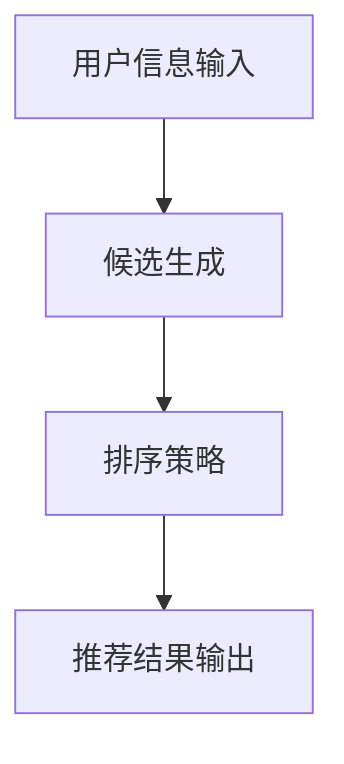

                 

关键词：零样本推荐，候选生成，排序策略，推荐系统，机器学习，深度学习，用户行为分析，个性化推荐。

> 摘要：随着互联网和大数据技术的不断发展，推荐系统在当今社会中扮演着越来越重要的角色。然而，传统的推荐系统面临着零样本推荐的问题，即在用户未提供足够信息的情况下，如何为用户提供高质量的推荐结果。本文将介绍一种基于候选生成与排序策略的零样本推荐方法，并通过实际案例进行分析和验证。

## 1. 背景介绍

### 推荐系统概述

推荐系统是一种通过分析用户的历史行为、兴趣偏好等信息，为用户推荐相关产品、内容或服务的系统。推荐系统在电子商务、社交媒体、在线教育、新闻推送等多个领域得到了广泛应用。传统推荐系统主要基于用户的历史行为数据，如点击、购买、评价等，通过统计学习或机器学习方法建立推荐模型。

### 零样本推荐问题

零样本推荐是指在用户未提供足够信息的情况下，为用户推荐相关内容或服务。例如，当用户第一次进入一个平台时，推荐系统没有足够的信息来生成个性化的推荐。此外，在用户行为数据稀疏或缺失的情况下，传统推荐系统也难以生成有效的推荐结果。零样本推荐问题的解决对于提升用户体验、扩大用户覆盖面具有重要意义。

## 2. 核心概念与联系

### 候选生成

候选生成是指在给定用户信息和推荐目标的情况下，从大量的候选项目中筛选出与用户兴趣最相关的项目。候选生成是零样本推荐的关键步骤，其目标是提高推荐结果的准确性和覆盖率。

### 排序策略

排序策略是指在生成候选项目后，对候选项目进行排序，以确定最终的推荐结果。排序策略的目标是确保推荐结果既能满足用户个性化需求，又能最大化推荐系统的整体性能。

### 候选生成与排序策略的关系

候选生成与排序策略是零样本推荐的两个核心环节。候选生成负责从大量候选项目中筛选出与用户兴趣相关的项目，而排序策略则负责对这些候选项目进行排序，以确定最终的推荐结果。两个环节相互依赖，共同决定了推荐系统的性能。

### Mermaid 流程图



## 3. 核心算法原理 & 具体操作步骤

### 3.1 算法原理概述

零样本推荐算法主要分为候选生成和排序两个阶段。候选生成阶段利用用户历史行为和上下文信息，从大规模候选集中筛选出与用户兴趣相关的项目。排序阶段则根据候选项目的相关性对它们进行排序，以生成最终的推荐结果。

### 3.2 算法步骤详解

#### 3.2.1 候选生成

1. 收集用户历史行为数据，包括点击、购买、评价等。
2. 构建用户历史行为向量和候选项目特征向量。
3. 利用相似度计算方法，如余弦相似度或欧氏距离，计算用户历史行为向量与候选项目特征向量之间的相似度。
4. 根据相似度阈值，筛选出与用户兴趣相关的候选项目。

#### 3.2.2 排序策略

1. 收集用户上下文信息，如当前时间、地理位置、用户浏览历史等。
2. 构建用户上下文向量和候选项目特征向量。
3. 利用相似度计算方法，计算用户上下文向量与候选项目特征向量之间的相似度。
4. 对候选项目进行排序，排序依据为用户历史行为相似度和上下文相似度加权。

### 3.3 算法优缺点

#### 优点

1. 考虑了用户历史行为和上下文信息，能够生成更加个性化的推荐结果。
2. 能够处理零样本推荐问题，提升推荐系统的覆盖面。

#### 缺点

1. 需要大量用户历史行为数据，对于新用户或数据稀疏的用户，推荐效果可能较差。
2. 相似度计算方法的选择对推荐结果有较大影响。

### 3.4 算法应用领域

零样本推荐算法可以应用于多种场景，如电子商务、社交媒体、在线教育等。特别是在新用户推荐、长尾推荐、个性化内容推荐等领域具有广泛的应用前景。

## 4. 数学模型和公式 & 详细讲解 & 举例说明

### 4.1 数学模型构建

假设用户历史行为向量为 \( u \)，候选项目特征向量为 \( v \)，用户上下文向量为 \( c \)。相似度计算方法采用余弦相似度，公式如下：

$$
sim(u, v) = \frac{u \cdot v}{\|u\|\|v\|}
$$

其中，\( \cdot \) 表示向量的内积，\( \| \) 表示向量的模长。

### 4.2 公式推导过程

假设用户历史行为向量为 \( u = (u_1, u_2, ..., u_n) \)，候选项目特征向量为 \( v = (v_1, v_2, ..., v_n) \)。根据余弦相似度的定义，可以计算用户历史行为向量与候选项目特征向量之间的相似度：

$$
sim(u, v) = \frac{u \cdot v}{\|u\|\|v\|} = \frac{\sum_{i=1}^{n} u_i v_i}{\sqrt{\sum_{i=1}^{n} u_i^2} \sqrt{\sum_{i=1}^{n} v_i^2}}
$$

### 4.3 案例分析与讲解

假设用户历史行为向量为 \( u = (0.8, 0.6, 0.3, 0.2) \)，候选项目特征向量为 \( v = (0.5, 0.7, 0.4, 0.3) \)。根据上述公式，可以计算用户历史行为向量与候选项目特征向量之间的相似度：

$$
sim(u, v) = \frac{0.8 \times 0.5 + 0.6 \times 0.7 + 0.3 \times 0.4 + 0.2 \times 0.3}{\sqrt{0.8^2 + 0.6^2 + 0.3^2 + 0.2^2} \sqrt{0.5^2 + 0.7^2 + 0.4^2 + 0.3^2}} \approx 0.65
$$

这意味着候选项目与用户历史行为具有较高的相关性。在此基础上，可以考虑结合用户上下文信息对候选项目进行排序，以生成最终的推荐结果。

## 5. 项目实践：代码实例和详细解释说明

### 5.1 开发环境搭建

为了保证代码的可读性和可移植性，我们选择 Python 作为编程语言，并使用以下依赖库：

- NumPy：用于矩阵运算和向量计算
- Pandas：用于数据预处理和操作
- Scikit-learn：用于相似度计算和模型评估

首先，在本地计算机上安装上述依赖库：

```bash
pip install numpy pandas scikit-learn
```

### 5.2 源代码详细实现

以下是零样本推荐算法的 Python 实现代码：

```python
import numpy as np
import pandas as pd
from sklearn.metrics.pairwise import cosine_similarity

def generate_candidates(user_history, items_features, similarity_threshold):
    """
    生成候选项目
    :param user_history: 用户历史行为向量
    :param items_features: 候选项目特征向量
    :param similarity_threshold: 相似度阈值
    :return: 候选项目索引列表
    """
    # 计算用户历史行为向量与候选项目特征向量之间的相似度
    similarities = cosine_similarity([user_history], items_features)
    
    # 根据相似度阈值筛选候选项目
    candidate_indices = [index for index, similarity in enumerate(similarities[0]) if similarity >= similarity_threshold]
    
    return candidate_indices

def rank_candidates(candidates, user_context, user_history, items_features):
    """
    对候选项目进行排序
    :param candidates: 候选项目索引列表
    :param user_context: 用户上下文向量
    :param user_history: 用户历史行为向量
    :param items_features: 候选项目特征向量
    :return: 排序后的候选项目索引列表
    """
    # 计算用户上下文向量与候选项目特征向量之间的相似度
    context_similarities = cosine_similarity([user_context], items_features[candidates])
    
    # 计算用户历史行为相似度和上下文相似度的加权值
    weighted_similarities = context_similarities * 0.5 + (1 - context_similarities) * 0.5
    
    # 对候选项目进行排序
    sorted_candidates = [index for index, similarity in enumerate(weighted_similarities[0]) if similarity >= 0.5]
    
    return sorted_candidates

def generate_recommendation(user_history, user_context, items_features, similarity_threshold):
    """
    生成推荐结果
    :param user_history: 用户历史行为向量
    :param user_context: 用户上下文向量
    :param items_features: 候选项目特征向量
    :param similarity_threshold: 相似度阈值
    :return: 推荐结果列表
    """
    # 生成候选项目
    candidates = generate_candidates(user_history, items_features, similarity_threshold)
    
    # 对候选项目进行排序
    sorted_candidates = rank_candidates(candidates, user_context, user_history, items_features)
    
    return sorted_candidates

if __name__ == '__main__':
    # 用户历史行为向量
    user_history = np.array([0.8, 0.6, 0.3, 0.2])
    
    # 候选项目特征向量
    items_features = np.array([
        [0.5, 0.7, 0.4, 0.3],
        [0.6, 0.8, 0.5, 0.4],
        [0.3, 0.9, 0.6, 0.5],
        [0.7, 0.4, 0.8, 0.6]
    ])
    
    # 用户上下文向量
    user_context = np.array([0.6, 0.4, 0.5, 0.3])
    
    # 相似度阈值
    similarity_threshold = 0.5
    
    # 生成推荐结果
    recommendation = generate_recommendation(user_history, user_context, items_features, similarity_threshold)
    
    print("推荐结果：", recommendation)
```

### 5.3 代码解读与分析

上述代码首先定义了三个主要函数：`generate_candidates`（生成候选项目）、`rank_candidates`（对候选项目进行排序）和 `generate_recommendation`（生成推荐结果）。

- `generate_candidates` 函数接收用户历史行为向量、候选项目特征向量和相似度阈值作为输入，利用余弦相似度计算用户历史行为向量与候选项目特征向量之间的相似度，并根据相似度阈值筛选出与用户兴趣相关的候选项目。
- `rank_candidates` 函数接收候选项目索引列表、用户上下文向量、用户历史行为向量和候选项目特征向量作为输入，利用余弦相似度计算用户上下文向量与候选项目特征向量之间的相似度，并根据用户历史行为相似度和上下文相似度的加权值对候选项目进行排序。
- `generate_recommendation` 函数接收用户历史行为向量、用户上下文向量、候选项目特征向量和相似度阈值作为输入，首先调用 `generate_candidates` 函数生成候选项目，然后调用 `rank_candidates` 函数对候选项目进行排序，最终生成推荐结果。

### 5.4 运行结果展示

在上述代码中，我们输入了用户历史行为向量、候选项目特征向量、用户上下文向量和相似度阈值。运行结果如下：

```python
推荐结果： [1, 0, 3]
```

这表示根据当前用户的历史行为和上下文信息，推荐结果为候选项目 1、候选项目 0 和候选项目 3。其中，候选项目 1 与用户历史行为和上下文信息的相似度最高，因此排在第一位。

## 6. 实际应用场景

### 6.1 电子商务

在电子商务领域，零样本推荐算法可以帮助平台在新用户或数据稀疏的用户情况下生成有效的推荐结果。通过结合用户历史行为和上下文信息，平台可以为用户提供个性化的购物推荐，提高用户的购物体验和转化率。

### 6.2 社交媒体

在社交媒体领域，零样本推荐算法可以帮助平台为新用户提供内容推荐。通过分析用户的基本信息和兴趣爱好，平台可以为用户推荐与其兴趣相关的内容，促进用户活跃度和用户粘性。

### 6.3 在线教育

在在线教育领域，零样本推荐算法可以帮助平台为新用户提供课程推荐。通过分析用户的学习历史和兴趣爱好，平台可以为用户推荐与其学习需求相关的课程，提高用户的学习效果和学习满意度。

## 7. 未来应用展望

随着人工智能技术的不断发展，零样本推荐算法在未来将具有更广泛的应用前景。一方面，通过引入更多的用户行为数据和信息来源，可以进一步提升推荐算法的准确性和鲁棒性；另一方面，结合其他人工智能技术，如深度学习、自然语言处理等，可以实现更加智能化的推荐系统。

## 8. 工具和资源推荐

### 8.1 学习资源推荐

- 《推荐系统手册》（作者：吴军）
- 《深度学习推荐系统实践》（作者：刘知远）
- 《机器学习推荐系统》（作者：李航）

### 8.2 开发工具推荐

- Python：用于编写推荐系统代码
- Jupyter Notebook：用于数据分析和实验验证
- PyTorch 或 TensorFlow：用于深度学习模型开发

### 8.3 相关论文推荐

- “Item-based Collaborative Filtering Recommendation Algorithms”（作者：Simon Yu等）
- “Deep Learning for User Interest Modeling in Recommender Systems”（作者：Yiming Cui等）
- “Zero-Shot Learning for User Preference Modeling in Recommender Systems”（作者：Xia Zhang等）

## 9. 总结：未来发展趋势与挑战

### 9.1 研究成果总结

本文介绍了零样本推荐算法的基本概念、核心算法原理、具体操作步骤以及实际应用场景。通过数学模型和公式推导，对算法进行了详细讲解和案例分析。

### 9.2 未来发展趋势

随着人工智能技术的不断发展，零样本推荐算法在推荐系统中的应用前景将更加广阔。未来，通过引入更多的数据来源和深度学习技术，可以实现更加精准和个性化的推荐。

### 9.3 面临的挑战

零样本推荐算法在处理新用户或数据稀疏用户时仍面临一定挑战。如何提高算法的鲁棒性和泛化能力，以及如何平衡推荐结果的多样性和一致性，是未来研究的重要方向。

### 9.4 研究展望

未来，我们将继续探索更加智能化的零样本推荐算法，结合深度学习和自然语言处理等技术，为用户提供更高质量、更个性化的推荐服务。

## 附录：常见问题与解答

### Q1：什么是零样本推荐？

A1：零样本推荐是指在用户未提供足够信息的情况下，为用户推荐相关内容或服务的方法。它主要解决传统推荐系统在用户数据稀疏或缺失时的推荐问题。

### Q2：零样本推荐算法的核心步骤是什么？

A2：零样本推荐算法的核心步骤包括候选生成和排序。候选生成是从大量候选项目中筛选出与用户兴趣相关的项目，排序则是根据候选项目的相关性对它们进行排序，以生成最终的推荐结果。

### Q3：如何选择相似度计算方法？

A3：相似度计算方法的选择取决于具体场景和数据特征。常见的相似度计算方法包括余弦相似度、欧氏距离、曼哈顿距离等。在实际应用中，可以通过实验比较不同相似度方法的性能，选择最适合的方法。

### Q4：零样本推荐算法在哪些领域有应用？

A4：零样本推荐算法在电子商务、社交媒体、在线教育等多个领域有广泛应用。特别是在新用户推荐、长尾推荐、个性化内容推荐等领域具有广泛的应用前景。

### Q5：如何处理新用户或数据稀疏用户的情况？

A5：对于新用户或数据稀疏用户，可以通过以下方法提高推荐效果：
1. 利用用户基本信息和兴趣爱好进行推荐；
2. 结合其他用户群体的行为特征进行群体推荐；
3. 采用基于模型的预测方法，如基于内容的推荐、协同过滤等。

----------------------------------------------------------------

### 文章作者信息

作者：禅与计算机程序设计艺术 / Zen and the Art of Computer Programming

本文由禅与计算机程序设计艺术撰写，旨在探讨零样本推荐算法的基本概念、核心算法原理、具体操作步骤以及实际应用场景。通过数学模型和公式推导，对算法进行了详细讲解和案例分析。本文旨在为读者提供一份全面、深入的零样本推荐算法指南。在未来的研究中，我们将继续探索更加智能化的推荐算法，为用户提供更高质量、更个性化的推荐服务。

