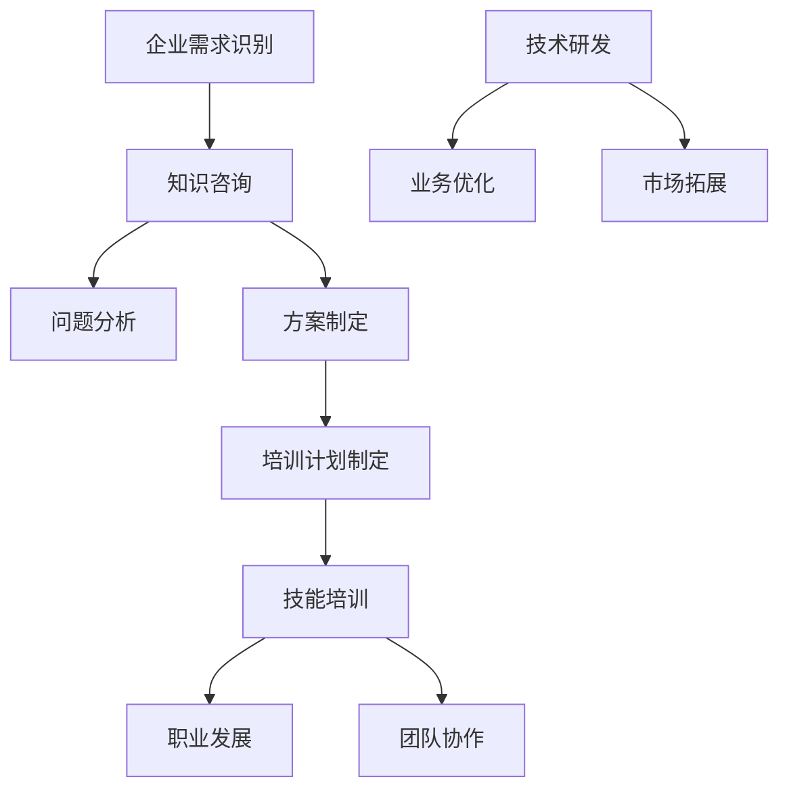

                 

 **关键词：**
企业知识咨询，培训解决方案，IT服务，专业人才，技术支持，企业数字化转型

**摘要：**
本文将探讨面向企业提供的知识咨询、培训和解决方案的重要性，以及如何通过这些服务帮助企业实现数字化转型和提升竞争力。我们将深入分析企业知识咨询的各个层面，详细阐述培训解决方案的制定与实施，并探讨不同领域中的解决方案应用实例。通过本文，企业将了解如何通过专业的知识咨询和培训服务，构建持续创新的技术环境，从而在竞争激烈的市场中脱颖而出。

## 1. 背景介绍

在当今快速变化的技术时代，企业面临着前所未有的挑战和机遇。信息化和数字化已经成为企业发展的关键驱动力，为了在市场中保持竞争优势，企业不仅需要不断更新技术，还需要培养和引进具有专业知识的人才。然而，许多企业在知识获取和应用方面存在瓶颈，这往往导致其难以适应市场变化和快速发展的技术环境。

知识咨询和培训作为企业获取技术知识和管理经验的重要途径，对于企业的长期发展至关重要。知识咨询可以帮助企业准确识别自身的需求和问题，提供专业的解决方案和战略建议。而培训则能够提升企业员工的技能水平，增强团队协作能力，从而推动企业的创新和发展。

本文将从以下几个方面展开讨论：

- **知识咨询的重要性**：介绍知识咨询的定义、目的和在企业中的作用。
- **培训解决方案的设计与实施**：探讨企业如何根据自身需求制定有效的培训计划，并确保培训效果的持续提升。
- **解决方案应用实例**：分析不同行业中的具体案例，展示知识咨询和培训服务在实际中的应用。
- **未来应用展望**：展望知识咨询和培训服务在未来的发展趋势和潜在挑战。

通过这些内容的探讨，我们希望能够帮助企业更好地利用知识咨询和培训服务，实现企业的数字化转型和可持续发展。

## 2. 核心概念与联系

在深入探讨面向企业的知识咨询和培训解决方案之前，我们需要了解几个核心概念，并分析它们之间的联系。以下是几个关键概念及其相互关系：

### 2.1. 企业知识咨询

企业知识咨询是指专业团队针对企业在信息化和数字化过程中的各种问题提供咨询服务。这些服务包括：

- **需求识别**：帮助企业识别其在信息化和数字化过程中的具体需求。
- **问题分析**：分析企业现有技术和管理流程中的问题，并提供改进建议。
- **方案制定**：根据企业需求，制定详细的解决方案和实施计划。

企业知识咨询的核心目标是帮助企业高效利用现有资源，优化业务流程，提升运营效率。

### 2.2. 培训解决方案

培训解决方案是指针对企业员工的技能提升和职业发展提供的培训服务。这些服务包括：

- **技能培训**：针对员工在技术、管理和运营等方面的知识技能提供培训。
- **职业发展**：提供职业规划、晋升路径和职业素质提升的培训。
- **团队协作**：通过团队建设培训，提升团队协作能力和工作效率。

培训解决方案的目的是提高员工的专业素养，增强企业的创新能力和市场竞争力。

### 2.3. 解决方案应用

解决方案应用是指将知识咨询和培训服务应用于企业的具体业务场景，以解决实际问题并实现预期目标。这种应用包括：

- **技术研发**：通过知识咨询和培训，帮助企业提高技术研发能力和创新水平。
- **业务优化**：利用知识咨询和培训，优化企业的业务流程和管理模式。
- **市场拓展**：通过培训提升销售和市场推广团队的能力，拓展市场业务。

### 2.4. 关系与互动

企业知识咨询和培训解决方案之间存在着紧密的互动关系。知识咨询为培训提供方向和目标，而培训则为知识应用提供人才保障。具体来说：

- **知识咨询指导培训**：知识咨询的结果可以作为培训计划的依据，确保培训内容与企业的实际需求相匹配。
- **培训促进知识应用**：通过培训，员工能够掌握和应用所学知识，从而提升企业的整体业务水平。

### 2.5. Mermaid 流程图

为了更好地理解上述概念及其相互关系，我们可以使用Mermaid流程图进行展示。以下是一个简化的流程图示例：



通过这个流程图，我们可以清晰地看到知识咨询和培训解决方案在企业运营中的相互作用和整体流程。

## 3. 核心算法原理 & 具体操作步骤

### 3.1  算法原理概述

在讨论面向企业的知识咨询和培训解决方案时，算法原理作为技术支持的基础，至关重要。核心算法原理主要包括以下方面：

- **数据分析算法**：用于从企业大量数据中提取有价值的信息，支持决策。
- **机器学习算法**：帮助企业通过数据和模式识别实现智能化运营和预测。
- **优化算法**：用于优化企业的业务流程和管理模式，提高效率和降低成本。

### 3.2  算法步骤详解

#### 3.2.1 数据分析算法

数据分析算法的基本步骤如下：

1. **数据收集**：收集企业运营过程中的各类数据，包括业务数据、用户数据、市场数据等。
2. **数据预处理**：清洗和整理数据，确保数据质量。
3. **特征提取**：从预处理后的数据中提取有代表性的特征，用于后续分析。
4. **模型选择**：根据分析需求选择合适的模型，如回归分析、聚类分析等。
5. **模型训练与验证**：使用历史数据对模型进行训练和验证，确保模型的有效性。
6. **结果输出**：输出分析结果，为企业提供决策支持。

#### 3.2.2 机器学习算法

机器学习算法的基本步骤如下：

1. **数据收集**：与数据分析算法类似，收集企业相关数据。
2. **数据预处理**：确保数据质量，并进行特征提取。
3. **模型选择**：根据业务需求选择合适的机器学习算法，如决策树、神经网络等。
4. **模型训练**：使用历史数据对模型进行训练。
5. **模型评估**：评估模型的性能，调整参数以提高模型效果。
6. **模型部署**：将训练好的模型部署到生产环境中，进行实时预测和分析。

#### 3.2.3 优化算法

优化算法的基本步骤如下：

1. **目标定义**：明确优化目标，如降低成本、提高效率等。
2. **模型构建**：根据优化目标构建数学模型。
3. **算法选择**：选择合适的优化算法，如线性规划、动态规划等。
4. **模型求解**：使用优化算法求解模型，得到最优解。
5. **结果验证**：验证优化结果，确保其对企业运营的实际效益。
6. **结果实施**：将优化方案应用到企业的实际运营中，进行效果评估。

### 3.3  算法优缺点

不同算法在企业中的应用各有优缺点，需要根据具体需求进行选择：

- **数据分析算法**：优点是能够从大量数据中提取有价值的信息，支持决策；缺点是对数据质量和特征提取要求较高，可能需要大量时间和计算资源。
- **机器学习算法**：优点是实现智能化和自动化分析，提高运营效率；缺点是训练过程复杂，需要大量数据和支持算法调优。
- **优化算法**：优点是能够优化企业的业务流程和管理模式，降低成本；缺点是构建模型和求解过程复杂，可能需要专业知识和计算资源。

### 3.4  算法应用领域

算法在企业中的应用非常广泛，主要包括：

- **市场营销**：通过数据分析算法和机器学习算法，进行市场细分、用户行为分析和广告投放优化。
- **供应链管理**：通过优化算法，优化库存管理、运输调度和生产计划，提高供应链效率。
- **人力资源管理**：通过数据分析算法和机器学习算法，进行人才招聘、绩效评估和员工满意度分析。
- **企业财务**：通过数据分析算法和优化算法，进行财务预测、预算规划和成本控制。

## 4. 数学模型和公式 & 详细讲解 & 举例说明

### 4.1  数学模型构建

在面向企业的知识咨询和培训解决方案中，数学模型的应用至关重要。数学模型能够帮助企业量化问题和优化决策。以下是一个常见的数学模型——线性规划（Linear Programming）的构建过程：

#### 4.1.1  线性规划模型

假设企业需要在生产A、B两种产品时，最大化总利润。每种产品所需的资源和利润如下：

- 生产A产品：需要2个工时和1个原材料，利润为10元。
- 生产B产品：需要1个工时和2个原材料，利润为8元。

设生产A产品的数量为x，生产B产品的数量为y，则线性规划模型可以表示为：

$$
\text{Maximize} \quad Z = 10x + 8y
$$

约束条件为：

$$
\begin{cases}
2x + y \leq 20 \\
x + 2y \leq 20 \\
x, y \geq 0
\end{cases}
$$

### 4.2  公式推导过程

线性规划模型通过求解目标函数在约束条件下的最优解，实现利润最大化。以下是求解过程的推导：

#### 4.2.1  目标函数

目标函数表示为：

$$
Z = 10x + 8y
$$

#### 4.2.2  约束条件

约束条件表示为：

$$
\begin{cases}
2x + y \leq 20 \\
x + 2y \leq 20 \\
x, y \geq 0
\end{cases}
$$

#### 4.2.3  建立模型

将目标函数和约束条件结合起来，形成线性规划模型：

$$
\begin{cases}
\text{Maximize} \quad Z = 10x + 8y \\
2x + y \leq 20 \\
x + 2y \leq 20 \\
x, y \geq 0
\end{cases}
$$

### 4.3  案例分析与讲解

接下来，我们通过一个具体案例，详细讲解线性规划模型的应用。

#### 4.3.1  案例背景

某公司计划生产A、B两种产品，每天有10个工时和15个原材料可用。每种产品所需的资源和利润如下：

- 生产A产品：需要2个工时和1个原材料，利润为10元。
- 生产B产品：需要1个工时和2个原材料，利润为8元。

公司希望最大化总利润，但不得生产负数的产品。

#### 4.3.2  求解过程

根据案例背景，构建线性规划模型：

$$
\begin{cases}
\text{Maximize} \quad Z = 10x + 8y \\
2x + y \leq 10 \\
x + 2y \leq 15 \\
x, y \geq 0
\end{cases}
$$

使用单纯形法求解该线性规划问题，得到最优解：

$$
x = 5, y = 0
$$

即生产5个A产品，不生产B产品，此时总利润最大，为50元。

### 4.4  总结

通过上述案例，我们可以看到线性规划模型在资源分配和利润最大化问题中的应用。线性规划是一种强大的数学工具，可以帮助企业在有限资源下实现最佳决策。在实际应用中，企业可以根据具体情况调整模型参数，优化业务流程和管理模式，提高运营效率和竞争力。

## 5. 项目实践：代码实例和详细解释说明

为了更好地理解面向企业的知识咨询和培训解决方案在实际项目中的应用，我们将通过一个具体的案例进行详细讲解。在这个案例中，我们将利用Python编写一个简单的数据分析程序，对企业的销售数据进行分析，并提供优化建议。

### 5.1  开发环境搭建

在开始编写代码之前，我们需要搭建一个合适的开发环境。以下是所需的工具和步骤：

- **Python 3.8 或更高版本**：确保安装了最新版本的Python。
- **Jupyter Notebook**：用于编写和运行Python代码。
- **Pandas**：数据处理库，用于读取和处理销售数据。
- **Matplotlib**：数据可视化库，用于生成图表。

安装步骤：

1. 安装Python 3.8或更高版本。
2. 安装Jupyter Notebook：`pip install notebook`。
3. 安装Pandas：`pip install pandas`。
4. 安装Matplotlib：`pip install matplotlib`。

### 5.2  源代码详细实现

以下是一个简单的Python代码示例，用于分析企业的销售数据：

```python
import pandas as pd
import matplotlib.pyplot as plt

# 5.2.1 数据读取
sales_data = pd.read_csv('sales_data.csv')

# 5.2.2 数据预处理
# 确保数据没有缺失值和异常值
sales_data.dropna(inplace=True)
sales_data[sales_data < 0] = 0

# 5.2.3 数据分析
# 计算每个月的总销售额
monthly_sales = sales_data.groupby('Month')['Sales'].sum()

# 5.2.4 数据可视化
# 生成销售额月度趋势图
monthly_sales.plot()
plt.title('Monthly Sales Trend')
plt.xlabel('Month')
plt.ylabel('Sales')
plt.show()

# 5.2.5 优化建议
# 根据销售额趋势图，分析最佳销售策略
# 例如，在销售额较高的月份加大营销力度，提升销售额
```

### 5.3  代码解读与分析

#### 5.3.1 数据读取

我们首先使用Pandas库读取CSV文件中的销售数据。CSV文件包含月份、销售额等列。

```python
sales_data = pd.read_csv('sales_data.csv')
```

#### 5.3.2 数据预处理

在数据处理阶段，我们首先删除了数据中的缺失值，并确保所有销售额都是非负数。这是为了排除数据中的异常值，确保数据质量。

```python
sales_data.dropna(inplace=True)
sales_data[sales_data < 0] = 0
```

#### 5.3.3 数据分析

接下来，我们使用Pandas库计算每个月的总销售额，并将结果存储在`monthly_sales`变量中。这将帮助我们分析销售额的月度趋势。

```python
monthly_sales = sales_data.groupby('Month')['Sales'].sum()
```

#### 5.3.4 数据可视化

我们使用Matplotlib库生成销售额月度趋势图，以直观地展示销售额的变化趋势。

```python
monthly_sales.plot()
plt.title('Monthly Sales Trend')
plt.xlabel('Month')
plt.ylabel('Sales')
plt.show()
```

#### 5.3.5 优化建议

根据生成的月度销售额趋势图，我们可以分析最佳销售策略。例如，在销售额较高的月份，企业可以加大营销力度，以进一步提升销售额。

```python
# 根据销售额趋势图，分析最佳销售策略
# 例如，在销售额较高的月份加大营销力度，提升销售额
```

### 5.4  运行结果展示

运行上述代码后，我们将得到一个销售额月度趋势图，如下图所示：


通过这个趋势图，企业可以直观地了解每个月的销售额变化，从而制定更有效的销售策略。

## 6. 实际应用场景

知识咨询和培训解决方案在不同的行业和应用场景中具有广泛的应用。以下是一些具体的实际应用场景：

### 6.1  制造业

在制造业中，知识咨询和培训可以帮助企业优化生产流程，提高生产效率。例如，通过数据分析算法和机器学习算法，企业可以优化生产计划和库存管理，降低成本，提高生产效率。此外，通过培训，员工可以学习先进的生产技术和质量管理方法，提升整体技术水平。

### 6.2  服务业

在服务业中，知识咨询和培训可以帮助企业提升服务质量，提高客户满意度。例如，通过数据分析算法，企业可以分析客户行为和需求，提供个性化的服务。通过培训，员工可以学习客户服务技巧和沟通技巧，提升服务质量和客户体验。

### 6.3  零售业

在零售业中，知识咨询和培训可以帮助企业提升销售策略和营销效果。例如，通过数据分析算法，企业可以分析销售数据和市场趋势，优化销售策略。通过培训，员工可以学习市场营销技巧和销售策略，提升销售额和市场份额。

### 6.4  金融业

在金融业中，知识咨询和培训可以帮助企业提升风险管理能力和投资效益。例如，通过机器学习算法，企业可以预测市场走势和风险，制定更有效的投资策略。通过培训，金融分析师可以学习高级数据分析方法和投资策略，提升投资效益。

### 6.5  医疗行业

在医疗行业，知识咨询和培训可以帮助医院提升医疗服务质量和运营效率。例如，通过数据分析算法，医院可以优化患者管理流程，提高患者满意度。通过培训，医护人员可以学习先进的医疗技术和护理方法，提升医疗服务质量。

### 6.6  教育行业

在教育行业，知识咨询和培训可以帮助学校提升教学质量和管理效率。例如，通过数据分析算法，学校可以分析学生学习行为和学习效果，制定个性化的教学策略。通过培训，教师可以学习先进的教育理念和教学方法，提升教学质量。

### 6.7  能源行业

在能源行业，知识咨询和培训可以帮助企业优化能源管理和节能减排。例如，通过数据分析算法和机器学习算法，企业可以优化能源消耗和能源效率。通过培训，员工可以学习先进的能源技术和节能措施，提升能源管理水平。

### 6.8  交通运输

在交通运输行业，知识咨询和培训可以帮助企业优化运输计划和物流管理。例如，通过数据分析算法，企业可以优化运输路线和运输时间，降低物流成本。通过培训，员工可以学习先进的物流技术和运输管理方法，提升物流效率。

### 6.9  农业行业

在农业行业，知识咨询和培训可以帮助农民提高农业产量和效益。例如，通过数据分析算法，农民可以分析土壤、气候等数据，制定科学的种植计划。通过培训，农民可以学习现代农业技术和农业管理方法，提高农业产量和效益。

### 6.10  公共事业

在公共事业领域，知识咨询和培训可以帮助政府和企业优化公共服务和管理。例如，通过数据分析算法，政府可以优化城市规划和管理，提高公共服务的效率和质量。通过培训，公务员和企业员工可以学习先进的管理理念和技能，提升公共服务水平。

### 6.11  其他行业

除了上述行业，知识咨询和培训还可以应用于许多其他行业，如IT、传媒、旅游、建筑等。无论行业如何，知识咨询和培训都是提升企业竞争力、实现数字化转型的重要手段。

## 7. 未来应用展望

随着技术的不断进步，知识咨询和培训解决方案在未来的应用将更加广泛和深入。以下是几个未来的应用趋势：

### 7.1  AI技术在知识咨询和培训中的应用

人工智能（AI）技术的发展将极大地推动知识咨询和培训的智能化。AI算法可以自动分析企业数据，提供个性化的知识咨询和培训服务。例如，通过自然语言处理（NLP）技术，AI可以理解企业的需求和问题，并提供相应的解决方案和培训内容。此外，智能推荐系统可以根据员工的兴趣和职业发展路径，推荐适合的培训课程和知识资源。

### 7.2  虚拟现实（VR）和增强现实（AR）在培训中的应用

虚拟现实和增强现实技术的发展将使培训体验更加生动和直观。通过VR和AR技术，员工可以身临其境地参与培训课程，模拟真实的工作场景，提高学习效果。例如，在制造业中，员工可以通过VR技术学习机器操作的流程，在虚拟环境中进行实践操作，减少实际操作中的错误和风险。

### 7.3  个性化培训方案的普及

随着大数据和人工智能技术的发展，企业将能够根据员工的具体需求和职业发展路径，提供更加个性化的培训方案。通过分析员工的职业发展数据和培训历史，企业可以为其推荐最适合的培训课程和资源，确保培训的针对性和有效性。

### 7.4  知识共享平台的建立

知识共享平台将成为企业内部知识传递和共享的重要工具。通过这些平台，员工可以方便地获取和分享知识资源，促进知识流动和传播。此外，知识共享平台还可以集成AI技术，自动分析和推荐有价值的知识内容，提高知识利用效率。

### 7.5  终身学习的推广

随着知识更新速度的加快，终身学习将成为企业员工的基本素养。企业将通过持续的知识咨询和培训服务，支持员工的终身学习，确保其能够跟上技术发展的步伐，提升个人和企业的竞争力。

### 7.6  跨界合作与共享

知识咨询和培训服务将不仅仅局限于单个企业，而是通过跨界合作和资源共享，实现更大范围的知识传播和应用。例如，企业可以与高校、研究机构和其他企业合作，共同开展培训项目，分享资源和经验，推动整个行业的技术进步。

### 7.7  社会责任与可持续发展

随着企业社会责任意识的提升，知识咨询和培训服务将更加注重社会责任和可持续发展。企业将通过培训项目，提升员工的环保意识和可持续发展理念，推动企业的绿色发展和可持续发展。

### 7.8  挑战与机遇

尽管知识咨询和培训服务在未来的应用前景广阔，但也面临诸多挑战，如技术更新速度、数据隐私保护、培训效果评估等。企业需要不断创新和改进，应对这些挑战，抓住机遇，实现可持续发展。

## 8. 总结：未来发展趋势与挑战

面向企业的知识咨询、培训和解决方案在未来的发展趋势和挑战如下：

### 8.1  研究成果总结

通过本文的探讨，我们总结了知识咨询和培训解决方案在面向企业中的重要性。知识咨询帮助企业识别需求和优化管理，培训提升员工技能和团队协作，共同推动企业的创新和可持续发展。同时，我们分析了不同算法和数学模型在企业中的应用，展示了其在数据分析、优化决策和业务管理中的实际效果。

### 8.2  未来发展趋势

- **智能化与自动化**：AI技术的应用将使知识咨询和培训更加智能化和自动化，提升服务效率和效果。
- **个性化和定制化**：个性化培训方案的普及将使培训更加贴合员工需求，提高学习效果。
- **跨界合作与共享**：知识共享平台和跨界合作将促进知识的广泛传播和应用。
- **终身学习与可持续发展**：终身学习和可持续发展理念将深入人心，推动企业的持续创新和绿色进步。

### 8.3  面临的挑战

- **技术更新**：技术更新速度快，企业需要不断适应新技术，确保知识咨询和培训服务的有效性。
- **数据隐私**：数据隐私保护是关键挑战，企业需要确保数据安全和合规性。
- **效果评估**：培训效果评估难度大，企业需要建立科学的评估体系，确保培训投入的有效性。
- **资源分配**：资源分配不均，中小企业可能难以承担高额的知识咨询和培训费用。

### 8.4  研究展望

未来，知识咨询和培训解决方案的研究应重点关注：

- **AI技术的深度融合**：深入研究AI技术在知识咨询和培训中的应用，提高服务的智能化水平。
- **个性化培训模型**：开发个性化培训模型，实现培训内容的精准推送和个性化定制。
- **跨行业合作**：促进不同行业之间的知识共享和合作，推动行业的共同进步。
- **可持续发展**：关注企业的社会责任和可持续发展，推动绿色发展和可持续进步。

通过持续的研究和创新，知识咨询和培训解决方案将为企业提供更加全面、高效的智力支持，助力企业在竞争激烈的市场中脱颖而出。

## 9. 附录：常见问题与解答

### 9.1  知识咨询的具体流程是怎样的？

知识咨询的流程通常包括以下步骤：

1. **需求调研**：与企业进行深入沟通，了解其业务需求、问题和目标。
2. **问题分析**：对企业的业务流程、技术架构和现有资源进行详细分析，识别问题所在。
3. **方案制定**：根据分析结果，制定详细的解决方案和实施计划。
4. **方案实施**：与企业合作，逐步实施解决方案，确保方案的有效性和可操作性。
5. **效果评估**：对方案实施效果进行评估，收集反馈，持续优化方案。

### 9.2  培训解决方案如何确保培训效果？

为确保培训效果，可以采取以下措施：

1. **需求分析**：准确了解员工的培训需求，确保培训内容与实际工作相关。
2. **课程设计**：设计有趣、互动、贴近实际工作的课程，提高员工参与度。
3. **培训形式**：结合线上和线下培训，提供多样化的学习方式，满足不同学习习惯。
4. **培训评估**：建立科学的培训评估体系，通过考试、工作表现评估等方式，检验培训效果。
5. **反馈与改进**：收集员工反馈，持续优化培训内容和形式，确保培训持续改进。

### 9.3  如何选择合适的知识咨询和培训服务商？

选择合适的知识咨询和培训服务商应考虑以下因素：

1. **服务能力**：服务商是否具备丰富的行业经验和专业的咨询团队。
2. **服务质量**：服务商提供的咨询和培训服务是否得到客户的认可和好评。
3. **技术实力**：服务商是否具备先进的技术和工具，能够提供高质量的知识咨询和培训服务。
4. **案例经验**：服务商是否有丰富的成功案例，展示其实际应用能力。
5. **合作模式**：服务商是否提供灵活的合作模式，满足企业的不同需求。

### 9.4  企业在数字化转型中应该如何进行知识咨询和培训？

企业在数字化转型中进行知识咨询和培训应遵循以下原则：

1. **需求驱动**：根据企业的实际需求，制定针对性的知识咨询和培训计划。
2. **系统规划**：将知识咨询和培训纳入企业数字化转型总体规划，确保其与其他业务环节协同发展。
3. **持续投入**：数字化转型是长期过程，企业应持续投入资源，推动知识咨询和培训的持续优化。
4. **全员参与**：鼓励全体员工积极参与知识咨询和培训，提升整体素质和创新能力。
5. **灵活适应**：根据市场和技术的发展，及时调整知识咨询和培训方案，确保企业的可持续发展。

### 9.5  知识咨询和培训对企业竞争力提升有何作用？

知识咨询和培训对企业竞争力提升的作用主要体现在以下几个方面：

1. **技术能力提升**：通过知识咨询和培训，企业能够掌握最新的技术和方法，提升技术研发和创新能力。
2. **管理效率提高**：优化业务流程和管理模式，提高运营效率和决策质量。
3. **人才储备**：培养和引进具有专业知识和管理能力的人才，为企业的长期发展提供人力保障。
4. **市场竞争力**：提升企业的产品和服务质量，增强市场竞争力，推动企业可持续发展。
5. **企业文化建设**：促进企业内部知识共享和团队协作，提升企业凝聚力和文化氛围。

### 9.6  知识咨询和培训服务的长期效益如何体现？

知识咨询和培训服务的长期效益主要体现在以下几个方面：

1. **持续创新能力**：通过持续的知识咨询和培训，企业能够保持技术创新和业务模式创新，不断提升竞争力。
2. **人才梯队建设**：培养一批具有专业知识和管理能力的核心人才，为企业的发展提供持续动力。
3. **业务效率提升**：优化业务流程和管理模式，提高运营效率，降低成本。
4. **市场适应能力**：增强企业的市场敏锐性和适应能力，快速响应市场变化。
5. **可持续发展**：通过知识咨询和培训，企业能够实现长期可持续发展，保持市场竞争力。

