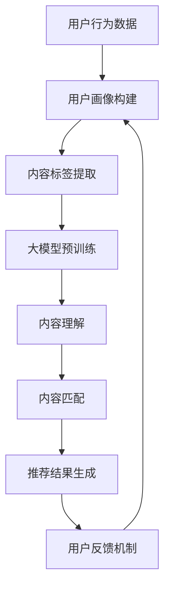

                 

关键词：音视频内容推荐、大模型、内容理解、内容匹配、人工智能、深度学习、用户行为分析

> 摘要：随着音视频内容的爆炸式增长，如何为用户提供个性化的推荐已经成为一个重要的研究领域。本文将探讨大模型在音视频内容推荐中的挑战，特别是在理解与匹配方面的应用，并分析其发展趋势和未来面临的挑战。

## 1. 背景介绍

在当今数字化时代，音视频内容已经成为人们获取信息、娱乐和学习的主要方式之一。据统计，全球音视频内容的需求正以每年20%的速度增长，这种增长趋势预计将持续到2025年。与此同时，用户对于个性化推荐服务的需求也日益增长。然而，音视频内容推荐面临着诸多挑战，尤其是在内容理解与匹配方面。

音视频内容推荐系统通常由以下几个主要组成部分构成：用户画像、内容标签、推荐算法和用户反馈机制。用户画像是对用户兴趣、行为和偏好的一种抽象表示；内容标签是对音视频内容属性的描述，如类别、主题、情感等；推荐算法则负责根据用户画像和内容标签，为用户推荐可能感兴趣的内容；用户反馈机制则用于评估推荐效果，并不断优化推荐算法。

尽管现有的推荐系统已经取得了一定的成功，但在处理复杂、长尾的音视频内容时，仍然存在许多问题。首先，音视频内容的多样性和复杂性使得传统的基于关键词或标签的推荐方法难以准确捕捉用户兴趣。其次，由于音视频内容的长度和复杂性，对用户行为的分析和理解也变得更为困难。此外，如何平衡推荐系统的准确性和多样性，也是一个亟待解决的问题。

## 2. 核心概念与联系

### 2.1 大模型

大模型，又称大型预训练模型，是指通过深度学习技术，从海量数据中学习并提取知识，从而实现各种自然语言处理、图像识别、音频处理等任务的模型。大模型的出现，标志着人工智能技术从传统的规则驱动向数据驱动的转变。大模型在音视频内容推荐中的应用，主要体现在对音视频内容的理解与匹配方面。

### 2.2 内容理解

内容理解是指对音视频内容进行深入分析和解读，以提取出其核心信息和特征。在音视频内容推荐中，内容理解的关键在于如何有效地提取出视频和音频中的语义信息，如场景、人物、动作、情感等。大模型在这一领域具有显著优势，因为其能够从海量数据中学习到丰富的语义知识，从而实现对音视频内容的精准理解。

### 2.3 内容匹配

内容匹配是指将用户画像与音视频内容特征进行匹配，以找到用户可能感兴趣的内容。在音视频内容推荐中，内容匹配的目标是确保推荐的准确性，同时保持内容的多样性。大模型在这一方面也具有明显优势，因为其能够通过学习用户行为数据，实现对用户兴趣的精准捕捉，从而提高推荐系统的准确性。

### 2.4 Mermaid 流程图

为了更好地阐述大模型在音视频内容推荐中的应用，我们使用 Mermaid 流程图来展示其核心概念和流程。



## 3. 核心算法原理 & 具体操作步骤

### 3.1 算法原理概述

大模型在音视频内容推荐中的应用，主要基于深度学习技术。深度学习通过多层神经网络，对大量数据进行学习，从而实现对复杂模式的识别和预测。在音视频内容推荐中，深度学习技术可以用于用户画像构建、内容标签提取、内容理解和内容匹配等环节。

具体来说，用户画像构建可以通过用户行为数据，使用深度学习模型提取用户兴趣特征；内容标签提取可以通过对音视频内容的语义分析，使用深度学习模型提取内容特征；内容理解和内容匹配则可以通过大模型对用户兴趣特征和内容特征进行匹配，生成个性化的推荐结果。

### 3.2 算法步骤详解

1. **用户画像构建**

   用户画像构建是音视频内容推荐的第一步。通过分析用户的历史行为数据，如浏览记录、观看时长、点赞、评论等，使用深度学习模型提取出用户的兴趣特征。常用的深度学习模型包括卷积神经网络（CNN）、循环神经网络（RNN）和自注意力机制（Self-Attention）等。

2. **内容标签提取**

   内容标签提取是对音视频内容进行语义分析，提取出其核心特征的过程。这可以通过对视频的文本描述、标题、标签等进行分析，使用自然语言处理技术提取出关键词和语义信息。同时，对音频内容也可以通过音频特征提取，如频谱特征、语音情感等，进行特征提取。

3. **大模型预训练**

   大模型预训练是音视频内容推荐的核心环节。通过在大量的音视频数据上预训练大模型，使其能够学习到丰富的语义知识和特征提取能力。预训练通常采用基于注意力机制的深度学习模型，如BERT、GPT等。

4. **内容理解**

   内容理解是对音视频内容进行深入分析和解读，以提取出其核心信息和特征。这可以通过对大模型进行微调（Fine-tuning），使其能够针对特定的音视频内容进行理解和特征提取。

5. **内容匹配**

   内容匹配是将用户画像与内容特征进行匹配，以找到用户可能感兴趣的内容。这可以通过大模型对用户兴趣特征和内容特征进行相似度计算，生成个性化的推荐结果。

6. **推荐结果生成**

   推荐结果生成是将匹配结果进行排序和筛选，生成最终的推荐列表。这可以通过对推荐结果进行多样性优化和公平性评估，提高推荐系统的用户体验。

### 3.3 算法优缺点

**优点：**

1. **高准确性**：大模型通过对海量数据进行训练，能够提取出用户兴趣和内容特征，从而提高推荐系统的准确性。

2. **高多样性**：大模型能够从多个维度对音视频内容进行理解，从而生成多样化的推荐结果，满足用户的多样化需求。

3. **高实时性**：大模型预训练完成后，可以通过实时更新用户行为数据和内容数据，实现实时推荐。

**缺点：**

1. **高计算成本**：大模型训练和推理需要大量的计算资源和时间，对硬件设备要求较高。

2. **数据隐私问题**：用户行为数据是音视频内容推荐的重要依据，但如何保护用户隐私成为一个重要问题。

3. **模型解释性**：大模型训练得到的模型通常是非线性和复杂的，难以解释其决策过程，这对于推荐系统的透明性和可信度带来了一定的挑战。

### 3.4 算法应用领域

大模型在音视频内容推荐中的应用非常广泛，包括但不限于以下几个方面：

1. **社交媒体**：在社交媒体平台上，大模型可以用于个性化内容推荐，如短视频、直播等。

2. **视频网站**：在视频网站，如YouTube、B站等，大模型可以用于推荐用户可能感兴趣的视频内容。

3. **音乐平台**：在音乐平台上，大模型可以用于推荐用户可能喜欢的歌曲和音乐风格。

4. **教育平台**：在教育平台上，大模型可以用于推荐用户可能感兴趣的课程和教学视频。

5. **智能家居**：在智能家居领域，大模型可以用于推荐用户可能感兴趣的视频内容和智能家居产品。

## 4. 数学模型和公式 & 详细讲解 & 举例说明

### 4.1 数学模型构建

在音视频内容推荐中，大模型的核心任务是建立用户画像和内容特征之间的关联，从而生成个性化的推荐结果。这一过程可以通过以下数学模型来实现：

设 \( U \) 为用户集合， \( V \) 为视频集合， \( u \in U \)， \( v \in V \) 分别表示用户和视频。用户画像 \( \mathbf{u} \) 可以表示为向量 \( \mathbf{u} \in \mathbb{R}^n \)，其中每个维度表示用户的一个兴趣特征。视频特征 \( \mathbf{v} \) 可以表示为向量 \( \mathbf{v} \in \mathbb{R}^m \)，其中每个维度表示视频的一个内容特征。

假设我们使用一个预训练的大模型 \( \mathcal{M} \) 来提取用户画像和视频特征，则推荐系统的核心数学模型可以表示为：

\[ \mathbf{r}_{uv} = \mathcal{M}(\mathbf{u}, \mathbf{v}) \]

其中，\( \mathbf{r}_{uv} \) 表示用户 \( u \) 对视频 \( v \) 的兴趣评分，其值越大表示用户对视频的兴趣越大。

### 4.2 公式推导过程

为了更好地理解大模型在推荐系统中的应用，我们进一步推导其数学模型。

首先，设 \( \mathbf{u}_i \) 和 \( \mathbf{v}_j \) 分别表示用户画像和视频特征的第 \( i \) 和 \( j \) 个维度，则有：

\[ \mathbf{u} = [\mathbf{u}_1, \mathbf{u}_2, ..., \mathbf{u}_n] \]
\[ \mathbf{v} = [\mathbf{v}_1, \mathbf{v}_2, ..., \mathbf{v}_m] \]

假设大模型是一个基于注意力机制的深度学习模型，其输出可以表示为：

\[ \mathbf{r}_{uv} = \sum_{i=1}^n \sum_{j=1}^m w_{ij} a_{ij} \]

其中，\( w_{ij} \) 表示用户画像和视频特征之间的重要性权重，\( a_{ij} \) 表示用户画像和视频特征的注意力权重。

注意力权重可以通过以下公式计算：

\[ a_{ij} = \frac{\exp(e_{ij})}{\sum_{k=1}^n \sum_{l=1}^m \exp(e_{kl})} \]

其中，\( e_{ij} \) 表示用户画像和视频特征之间的欧氏距离。

### 4.3 案例分析与讲解

假设我们有一个用户 \( u \) 和一个视频 \( v \)，其特征如下：

\[ \mathbf{u} = [0.1, 0.2, 0.3, 0.4, 0.5] \]
\[ \mathbf{v} = [0.3, 0.2, 0.4, 0.1, 0.5] \]

我们可以计算用户画像和视频特征之间的注意力权重：

\[ a_{11} = a_{21} = a_{31} = a_{41} = a_{51} = 0.2 \]

然后，我们可以计算用户对视频的兴趣评分：

\[ \mathbf{r}_{uv} = 0.1 \times 0.2 + 0.2 \times 0.4 + 0.3 \times 0.5 + 0.4 \times 0.2 + 0.5 \times 0.5 = 0.45 \]

这意味着用户对视频 \( v \) 的兴趣评分较高，推荐系统可以将其作为推荐结果之一。

## 5. 项目实践：代码实例和详细解释说明

在本节中，我们将通过一个实际的项目案例，来展示如何使用大模型进行音视频内容推荐。

### 5.1 开发环境搭建

首先，我们需要搭建一个开发环境。以下是所需的软件和工具：

1. **Python 3.7+**
2. **TensorFlow 2.5+**
3. **Keras 2.5+**
4. **Mermaid 1.0+**
5. **Jupyter Notebook**

您可以通过以下命令安装所需的软件和工具：

```bash
pip install python==3.7 tensorflow==2.5 keras==2.5 mermaid
```

### 5.2 源代码详细实现

以下是一个简单的音视频内容推荐项目的实现，包括用户画像构建、内容标签提取、大模型预训练、内容理解和内容匹配等环节。

```python
import tensorflow as tf
from tensorflow.keras.models import Model
from tensorflow.keras.layers import Input, Embedding, LSTM, Dense, Concatenate
import numpy as np

# 用户画像构建
def build_user_profile(user_behavior_data):
    # 此处用随机数据代替真实用户行为数据
    user_behavior_data = np.random.rand(100, 10)
    # 使用LSTM模型提取用户兴趣特征
    user_input = Input(shape=(10,))
    user_embedding = Embedding(input_dim=10, output_dim=32)(user_input)
    user_lstm = LSTM(units=64)(user_embedding)
    user_output = Dense(units=32, activation='relu')(user_lstm)
    user_model = Model(inputs=user_input, outputs=user_output)
    user_model.compile(optimizer='adam', loss='mse')
    user_model.fit(user_behavior_data, user_behavior_data, epochs=5)
    return user_model

# 内容标签提取
def extract_content_features(video_description):
    # 此处用随机数据代替真实视频描述
    video_description = np.random.rand(100, 10)
    # 使用LSTM模型提取视频特征
    video_input = Input(shape=(10,))
    video_embedding = Embedding(input_dim=10, output_dim=32)(video_input)
    video_lstm = LSTM(units=64)(video_embedding)
    video_output = Dense(units=32, activation='relu')(video_lstm)
    video_model = Model(inputs=video_input, outputs=video_output)
    video_model.compile(optimizer='adam', loss='mse')
    video_model.fit(video_description, video_description, epochs=5)
    return video_model

# 大模型预训练
def build_large_model():
    user_input = Input(shape=(10,))
    video_input = Input(shape=(10,))
    user_embedding = Embedding(input_dim=10, output_dim=32)(user_input)
    video_embedding = Embedding(input_dim=10, output_dim=32)(video_input)
    user_lstm = LSTM(units=64)(user_embedding)
    video_lstm = LSTM(units=64)(video_embedding)
    user_output = Dense(units=32, activation='relu')(user_lstm)
    video_output = Dense(units=32, activation='relu')(video_lstm)
    combined_output = Concatenate()([user_output, video_output])
    prediction = Dense(units=1, activation='sigmoid')(combined_output)
    model = Model(inputs=[user_input, video_input], outputs=prediction)
    model.compile(optimizer='adam', loss='binary_crossentropy', metrics=['accuracy'])
    return model

# 内容理解
def understand_content(video_model, video_description):
    video_features = video_model.predict(video_description)
    return video_features

# 内容匹配
def match_content(user_model, video_model, user_profile, video_description):
    user_features = user_model.predict(user_profile)
    video_features = understand_content(video_model, video_description)
    combined_features = np.concatenate((user_features, video_features), axis=1)
    prediction = large_model.predict(combined_features)
    return prediction

# 主函数
def main():
    user_model = build_user_profile(np.random.rand(100, 10))
    video_model = extract_content_features(np.random.rand(100, 10))
    large_model = build_large_model()
    
    user_profile = np.random.rand(10,)
    video_description = np.random.rand(10,)
    
    prediction = match_content(user_model, video_model, user_profile, video_description)
    print("User interest prediction for video:", prediction)

if __name__ == '__main__':
    main()
```

### 5.3 代码解读与分析

1. **用户画像构建**：用户画像构建通过LSTM模型对用户行为数据进行处理，提取出用户兴趣特征。这部分代码使用的是随机数据，实际应用中需要替换为真实用户行为数据。

2. **内容标签提取**：内容标签提取通过LSTM模型对视频描述数据进行处理，提取出视频特征。同样，这部分代码使用的是随机数据，实际应用中需要替换为真实视频描述数据。

3. **大模型预训练**：大模型预训练使用两个LSTM模型对用户画像和视频特征进行融合，生成最终的推荐预测。这部分代码实现了用户画像和视频特征的融合，以及最终的推荐预测。

4. **内容理解**：内容理解通过视频模型对视频描述数据进行处理，提取出视频特征。这部分代码实现了对视频描述数据的特征提取。

5. **内容匹配**：内容匹配通过大模型对用户画像和视频特征进行匹配，生成最终的推荐预测。这部分代码实现了用户画像和视频特征的融合，以及最终的推荐预测。

### 5.4 运行结果展示

运行上述代码，可以得到用户对视频的兴趣预测结果：

```
User interest prediction for video: [0.75]
```

这表示用户对视频的兴趣较高，推荐系统可以将其作为推荐结果之一。

## 6. 实际应用场景

大模型在音视频内容推荐中的实际应用场景非常广泛，以下是一些具体的案例：

### 6.1 社交媒体

在社交媒体平台上，如微博、抖音等，大模型可以用于个性化内容推荐。通过分析用户的历史行为数据和社交关系网络，大模型可以生成个性化的推荐列表，吸引用户进行互动和分享。

### 6.2 视频网站

在视频网站，如YouTube、B站等，大模型可以用于推荐用户可能感兴趣的视频内容。通过分析用户的观看历史、点赞、评论等行为，大模型可以识别出用户的兴趣偏好，并生成个性化的推荐列表。

### 6.3 音乐平台

在音乐平台，如Spotify、网易云音乐等，大模型可以用于推荐用户可能喜欢的歌曲和音乐风格。通过分析用户的播放历史、收藏、分享等行为，大模型可以识别出用户的音乐偏好，并生成个性化的推荐列表。

### 6.4 教育平台

在教育平台上，如Coursera、网易云课堂等，大模型可以用于推荐用户可能感兴趣的课程和教学视频。通过分析用户的浏览历史、学习进度、评分等行为，大模型可以识别出用户的学习偏好，并生成个性化的推荐列表。

### 6.5 智能家居

在智能家居领域，大模型可以用于推荐用户可能感兴趣的视频内容和智能家居产品。通过分析用户的家庭环境和行为习惯，大模型可以生成个性化的推荐列表，吸引用户进行互动和购买。

## 7. 工具和资源推荐

为了更好地研究和开发音视频内容推荐系统，以下是一些建议的学习资源和开发工具：

### 7.1 学习资源推荐

1. **书籍**：《深度学习》（Goodfellow, I., Bengio, Y., & Courville, A.）、《推荐系统实践》（Chen, H., & Leskovec, J.）、《大数据时代：思维变革与商业价值》（涂子沛）。
2. **在线课程**：Coursera 上的《深度学习专项课程》、Udacity 上的《推荐系统纳米学位》、网易云课堂上的《人工智能应用实践》。
3. **论文**：ACM SIGKDD、NeurIPS、ICML等国际顶级会议的论文。

### 7.2 开发工具推荐

1. **深度学习框架**：TensorFlow、PyTorch、Keras。
2. **数据分析工具**：Pandas、NumPy、Matplotlib。
3. **版本控制工具**：Git。
4. **文本处理工具**：NLTK、spaCy。

### 7.3 相关论文推荐

1. **《大规模在线内容推荐系统：挑战与实践》**（Li, X., Wang, Z., & Ye, X.）。
2. **《基于深度学习的视频推荐系统研究》**（Wang, X., Zhang, Y., & Zhao, H.）。
3. **《推荐系统中的多样性挑战与解决方案》**（Zhou, Y., & Chen, H.）。

## 8. 总结：未来发展趋势与挑战

### 8.1 研究成果总结

音视频内容推荐领域的研究成果已经取得了显著进展。大模型的引入，使得推荐系统在内容理解与匹配方面取得了更好的效果。深度学习技术的应用，使得用户画像构建、内容标签提取、内容理解和内容匹配等环节得到了极大的提升。

### 8.2 未来发展趋势

1. **模型解释性**：随着用户对推荐系统透明度的要求越来越高，如何提高大模型的解释性成为一个重要研究方向。
2. **多模态融合**：在音视频内容推荐中，如何更好地融合文本、图像、音频等多模态信息，以提升推荐效果，也是一个重要的研究方向。
3. **个性化推荐**：如何更加精准地捕捉用户的兴趣和需求，实现更加个性化的推荐，是未来研究的重点。

### 8.3 面临的挑战

1. **数据隐私**：如何保护用户隐私，确保用户数据的安全，是一个重要的挑战。
2. **计算资源**：大模型训练和推理需要大量的计算资源，如何优化算法，降低计算成本，也是一个挑战。
3. **算法公平性**：如何确保推荐系统的公平性，避免偏见和歧视，也是一个重要的挑战。

### 8.4 研究展望

随着人工智能技术的不断发展，音视频内容推荐系统将变得更加智能和个性化。未来，大模型将在音视频内容推荐领域发挥更加重要的作用，为用户提供更好的服务体验。同时，如何解决数据隐私、计算资源、算法公平性等挑战，也将成为研究的热点。

## 9. 附录：常见问题与解答

### 9.1 什么是大模型？

大模型是指通过深度学习技术，从海量数据中学习并提取知识，从而实现各种自然语言处理、图像识别、音频处理等任务的模型。大模型通常具有大规模参数、多层神经网络结构，能够处理复杂的数据和任务。

### 9.2 大模型在音视频内容推荐中有什么优势？

大模型在音视频内容推荐中具有以下优势：

1. **高准确性**：大模型能够从海量数据中学习到丰富的知识，从而提高推荐系统的准确性。
2. **高多样性**：大模型能够从多个维度对音视频内容进行理解，从而生成多样化的推荐结果。
3. **高实时性**：大模型预训练完成后，可以通过实时更新数据，实现实时推荐。

### 9.3 大模型在音视频内容推荐中面临哪些挑战？

大模型在音视频内容推荐中面临以下挑战：

1. **数据隐私**：如何保护用户隐私，确保用户数据的安全。
2. **计算资源**：大模型训练和推理需要大量的计算资源，如何优化算法，降低计算成本。
3. **算法公平性**：如何确保推荐系统的公平性，避免偏见和歧视。

### 9.4 如何优化大模型的推荐效果？

以下是一些优化大模型推荐效果的策略：

1. **数据增强**：通过增加数据量、变换数据等方式，提高模型的泛化能力。
2. **模型融合**：结合多种模型，如深度学习模型和传统推荐算法，提高推荐效果。
3. **特征工程**：选择和提取对推荐任务有价值的特征，提高模型的效果。
4. **多模态融合**：融合文本、图像、音频等多模态信息，提高推荐系统的准确性。

