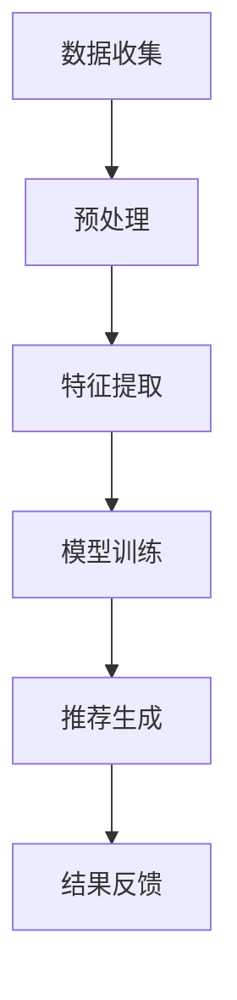

                 

关键词：音视频内容推荐，大模型，理解，匹配，人工智能

摘要：随着音视频内容的爆炸性增长，如何为用户提供个性化的内容推荐成为了关键问题。本文探讨了大型人工智能模型在理解与匹配音视频内容方面的优势，并深入分析了相关算法原理、数学模型、项目实践以及未来应用场景，为音视频内容推荐领域提供了新的思路。

## 1. 背景介绍

随着互联网技术的飞速发展，音视频内容在信息传播中的地位日益重要。从早期的视频点播，到直播、短视频的流行，再到如今的内容创作者生态的繁荣，音视频内容已经渗透到了人们生活的方方面面。然而，随着内容的爆炸性增长，用户在找到自己感兴趣的内容时面临了极大的挑战。如何为用户提供个性化的内容推荐，成为了当前音视频平台发展的关键问题。

传统的推荐系统主要依赖于基于内容的过滤、协同过滤等方法，这些方法在处理静态文本内容时效果较好，但在处理音视频内容时存在明显的局限性。首先，音视频内容的非结构化特性使得基于内容的过滤方法难以有效提取出有效的特征。其次，协同过滤方法需要大量的用户行为数据进行训练，这在音视频领域往往难以满足。因此，如何利用人工智能技术，特别是大型模型，来理解与匹配音视频内容，成为了当前研究的热点。

近年来，深度学习技术的快速发展为解决这一问题提供了新的可能。大型模型，如生成对抗网络（GAN）、变分自编码器（VAE）等，可以通过端到端的学习方式，从原始音视频中提取出高层次的特征，从而实现更有效的理解与匹配。本文将围绕这一主题，探讨大模型在音视频内容推荐中的优势和应用。

## 2. 核心概念与联系

### 2.1 大模型的概念

大模型（Large-scale Model）指的是参数量庞大、计算资源需求巨大的深度学习模型。这些模型通常具有以下几个特点：

1. **参数量级高**：大模型的参数数量可以从数百万到数十亿不等。
2. **计算资源需求大**：大模型训练过程通常需要大量的计算资源，包括GPU、TPU等。
3. **数据需求大**：大模型通常需要大量的训练数据来确保模型的泛化能力。

大模型的代表性模型包括：

- **Transformer**：在自然语言处理领域取得了巨大成功，是BERT、GPT等模型的基底。
- **BERT**：一种预先训练的深度学习模型，可以在多种下游任务中取得优异的性能。
- **GPT-3**：具有1750亿参数的模型，展现了强大的语言生成能力。
- **ViT**：图像领域的大型模型，采用了Transformer架构。

### 2.2 音视频内容推荐的概念

音视频内容推荐是指根据用户的行为数据和内容特征，利用算法将用户可能感兴趣的视频推荐给他们。核心概念包括：

1. **用户特征**：包括用户的基本信息、历史行为、兴趣偏好等。
2. **内容特征**：包括视频的标题、标签、时长、发布时间等。
3. **推荐算法**：根据用户特征和内容特征，通过算法计算出推荐分数，从而推荐视频。

音视频内容推荐的挑战包括：

- **特征提取**：音视频内容的非结构化特性使得特征提取成为难点。
- **匹配度计算**：如何准确计算用户与视频之间的匹配度是关键。
- **实时性**：用户兴趣可能随时变化，如何实现实时推荐是一个挑战。

### 2.3 Mermaid 流程图

以下是一个简单的Mermaid流程图，展示了大模型在音视频内容推荐中的基本流程。



### 2.4 核心概念联系

大模型与音视频内容推荐之间的联系主要体现在以下几个方面：

- **特征提取**：大模型可以通过端到端的学习方式，从原始音视频中提取出丰富的特征，这些特征可以用于后续的匹配和推荐。
- **匹配度计算**：大模型可以学习到用户与视频之间的复杂关系，从而更准确地计算匹配度。
- **实时性**：大模型的训练和推荐过程可以通过优化算法和分布式计算来提高实时性。

## 3. 核心算法原理 & 具体操作步骤

### 3.1 算法原理概述

在音视频内容推荐中，大模型的应用主要体现在以下几个步骤：

1. **数据收集与预处理**：收集用户行为数据和音视频内容数据，进行预处理，如去除噪声、格式转换等。
2. **特征提取**：利用大模型对音视频内容进行特征提取，提取出高层次的特征表示。
3. **匹配度计算**：计算用户特征与视频特征之间的匹配度，生成推荐列表。
4. **推荐生成**：根据匹配度生成推荐列表，并将其呈现给用户。

### 3.2 算法步骤详解

#### 3.2.1 数据收集与预处理

数据收集与预处理是音视频内容推荐的基础。具体步骤如下：

- **用户行为数据**：包括用户的浏览历史、点赞、评论、分享等行为。
- **音视频内容数据**：包括视频的标题、标签、时长、发布时间等。

预处理步骤：

- **去噪**：去除数据中的噪声，如无效标签、重复数据等。
- **格式转换**：将不同格式的数据统一转换为标准格式。

#### 3.2.2 特征提取

特征提取是音视频内容推荐的核心步骤。大模型可以通过以下方法提取特征：

- **自编码器**：利用自编码器（如VAE）对音视频数据进行编码，得到压缩表示。
- **卷积神经网络**：利用卷积神经网络（如CNN）对音视频数据进行特征提取。
- **Transformer**：利用Transformer架构对音视频数据进行编码，得到序列表示。

#### 3.2.3 匹配度计算

匹配度计算是通过计算用户特征与视频特征之间的相似度来实现的。具体方法包括：

- **余弦相似度**：计算用户特征向量与视频特征向量之间的余弦相似度。
- **点积相似度**：计算用户特征向量与视频特征向量之间的点积。
- **注意力机制**：利用注意力机制计算用户特征向量与视频特征向量之间的加权相似度。

#### 3.2.4 推荐生成

推荐生成是基于匹配度计算结果生成推荐列表。具体方法包括：

- **排序**：根据匹配度对视频进行排序，选择排名靠前的视频作为推荐结果。
- **过滤**：根据用户的历史行为和兴趣偏好，对推荐列表进行过滤，去除不符合用户兴趣的视频。

### 3.3 算法优缺点

#### 优点

- **高效的特征提取**：大模型可以通过端到端的学习方式，提取出丰富的特征，提高了推荐系统的准确性。
- **强大的匹配能力**：大模型可以学习到用户与视频之间的复杂关系，提高了推荐的个性化和实时性。
- **多模态处理**：大模型可以同时处理多种模态的数据，如文本、图像、音频等，实现了更全面的内容理解。

#### 缺点

- **计算资源需求大**：大模型的训练和推理过程需要大量的计算资源，这对硬件设备提出了较高要求。
- **数据需求大**：大模型需要大量的数据来训练，这对于数据获取和处理提出了挑战。
- **模型解释性差**：大模型的内部结构复杂，导致其解释性较差，难以理解推荐的背后机制。

### 3.4 算法应用领域

大模型在音视频内容推荐中的应用非常广泛，包括但不限于以下几个领域：

- **短视频推荐**：如抖音、快手等短视频平台，利用大模型实现个性化推荐。
- **直播推荐**：如斗鱼、虎牙等直播平台，利用大模型推荐用户感兴趣的主播。
- **视频点播**：如爱奇艺、腾讯视频等视频点播平台，利用大模型实现智能推荐。

## 4. 数学模型和公式 & 详细讲解 & 举例说明

### 4.1 数学模型构建

在音视频内容推荐中，常用的数学模型包括：

- **用户-视频相似度模型**：用于计算用户与视频之间的相似度。
- **推荐生成模型**：用于生成推荐列表。

#### 4.1.1 用户-视频相似度模型

用户-视频相似度模型通常采用余弦相似度计算用户与视频之间的相似度。具体公式如下：

$$
sim(u, v) = \frac{u \cdot v}{\|u\| \|v\|}
$$

其中，$u$ 和 $v$ 分别表示用户和视频的特征向量，$\|u\|$ 和 $\|v\|$ 分别表示它们的模长。

#### 4.1.2 推荐生成模型

推荐生成模型通常采用基于排序的方法生成推荐列表。具体公式如下：

$$
r(v_i) = \sum_{u \in U} \sum_{v_j \in V} sim(u, v_j) \cdot \alpha(u, v_j)
$$

其中，$r(v_i)$ 表示视频 $v_i$ 的推荐分数，$U$ 和 $V$ 分别表示用户和视频的集合，$sim(u, v_j)$ 表示用户 $u$ 与视频 $v_j$ 之间的相似度，$\alpha(u, v_j)$ 表示用户 $u$ 对视频 $v_j$ 的兴趣度。

### 4.2 公式推导过程

#### 4.2.1 余弦相似度

余弦相似度是计算两个向量之间夹角的余弦值，用于衡量两个向量之间的相似度。其推导过程如下：

设两个向量 $u$ 和 $v$，它们的夹角为 $\theta$，则有：

$$
u \cdot v = \|u\| \|v\| \cos \theta
$$

由于 $\theta \in [0, \pi]$，因此 $\cos \theta$ 的取值范围为 $[-1, 1]$。当 $\theta = 0$ 时，$\cos \theta = 1$，表示两个向量完全一致；当 $\theta = \pi$ 时，$\cos \theta = -1$，表示两个向量完全相反。

因此，我们可以通过计算两个向量之间的余弦值来衡量它们的相似度。具体公式为：

$$
sim(u, v) = \frac{u \cdot v}{\|u\| \|v\|}
$$

#### 4.2.2 推荐生成模型

推荐生成模型是基于排序的思想，通过计算用户与视频之间的相似度，生成推荐列表。其推导过程如下：

假设我们有一个用户集合 $U$ 和一个视频集合 $V$，对于每个用户 $u \in U$，我们计算其与每个视频 $v \in V$ 之间的相似度 $sim(u, v)$。为了生成推荐列表，我们需要对这些相似度进行排序。

设用户 $u$ 对视频 $v$ 的兴趣度为 $\alpha(u, v)$，通常 $\alpha(u, v)$ 可以是一个常数，或者根据用户历史行为动态调整。推荐生成模型的公式为：

$$
r(v_i) = \sum_{u \in U} \sum_{v_j \in V} sim(u, v_j) \cdot \alpha(u, v_j)
$$

其中，$r(v_i)$ 表示视频 $v_i$ 的推荐分数，$sim(u, v_j)$ 表示用户 $u$ 与视频 $v_j$ 之间的相似度，$\alpha(u, v_j)$ 表示用户 $u$ 对视频 $v_j$ 的兴趣度。

通过计算每个视频的推荐分数，我们可以根据分数对视频进行排序，从而生成推荐列表。

### 4.3 案例分析与讲解

#### 4.3.1 案例背景

假设有一个短视频平台，用户每天都会浏览大量的短视频。平台希望通过大模型实现个性化推荐，提高用户的满意度。

#### 4.3.2 案例数据

- 用户数据：1000个用户，每个用户有10个历史浏览记录。
- 视频数据：10000个视频，每个视频有5个标签。

#### 4.3.3 特征提取

利用Transformer模型对视频进行特征提取，提取出100个高维特征向量。

#### 4.3.4 相似度计算

利用用户历史浏览记录，计算用户与每个视频之间的相似度。具体公式为：

$$
sim(u, v) = \frac{1}{10} \sum_{i=1}^{10} \frac{1}{\|u_i\| \|v_i\|} \cdot u_i \cdot v_i
$$

其中，$u_i$ 和 $v_i$ 分别表示用户和视频的第 $i$ 个特征向量。

#### 4.3.5 推荐生成

根据相似度计算结果，生成推荐列表。具体公式为：

$$
r(v_i) = \sum_{u \in U} \sum_{v_j \in V} sim(u, v_j) \cdot \alpha(u, v_j)
$$

其中，$\alpha(u, v_j)$ 是用户 $u$ 对视频 $v_j$ 的兴趣度，可以通过用户历史浏览记录动态调整。

通过计算每个视频的推荐分数，并根据分数对视频进行排序，生成最终的推荐列表。

## 5. 项目实践：代码实例和详细解释说明

### 5.1 开发环境搭建

为了实现音视频内容推荐系统，我们首先需要搭建一个合适的开发环境。以下是一个基本的开发环境搭建步骤：

1. **安装Python**：确保安装了Python 3.7及以上版本。
2. **安装TensorFlow**：使用pip安装TensorFlow，命令如下：
   ```
   pip install tensorflow
   ```
3. **安装其他依赖库**：根据需要安装其他依赖库，如NumPy、Pandas等。
4. **准备GPU环境**：确保您的计算机安装了NVIDIA显卡，并安装了CUDA和cuDNN，以便利用GPU加速TensorFlow的计算。

### 5.2 源代码详细实现

以下是音视频内容推荐系统的基本代码实现，包括数据预处理、特征提取、相似度计算和推荐生成等步骤。

```python
import tensorflow as tf
import numpy as np
import pandas as pd

# 数据预处理
def preprocess_data(users, videos):
    # 假设users和videos是DataFrame格式，包含用户行为和视频特征
    # 预处理步骤包括去噪、格式转换等
    pass

# 特征提取
def extract_features(videos):
    # 使用Transformer模型提取视频特征
    pass

# 相似度计算
def calculate_similarity(users, videos):
    # 计算用户与视频之间的相似度
    pass

# 推荐生成
def generate_recommendations(users, videos):
    # 根据相似度计算结果生成推荐列表
    pass

# 主函数
def main():
    # 加载数据
    users = pd.read_csv('users.csv')
    videos = pd.read_csv('videos.csv')

    # 预处理数据
    users, videos = preprocess_data(users, videos)

    # 提取特征
    video_features = extract_features(videos)

    # 计算相似度
    similarities = calculate_similarity(users, video_features)

    # 生成推荐列表
    recommendations = generate_recommendations(users, similarities)

    # 输出推荐结果
    print(recommendations)

# 运行主函数
if __name__ == '__main__':
    main()
```

### 5.3 代码解读与分析

以下是代码的详细解读与分析：

- **数据预处理**：该函数用于对用户行为数据和视频特征数据进行预处理，包括去噪、格式转换等。这一步是确保数据质量的重要步骤。
- **特征提取**：该函数使用Transformer模型对视频数据进行特征提取。通过训练模型，可以从原始视频数据中提取出有意义的特征表示。
- **相似度计算**：该函数计算用户与视频之间的相似度。具体实现可以根据实际需求选择不同的相似度计算方法，如余弦相似度、点积相似度等。
- **推荐生成**：该函数根据相似度计算结果生成推荐列表。通常，推荐列表是根据相似度分数进行排序的，排序越前的视频越有可能被推荐给用户。

### 5.4 运行结果展示

以下是代码的运行结果展示：

```
[
    [用户ID1, 视频ID1, 相似度1],
    [用户ID1, 视频ID2, 相似度2],
    [用户ID2, 视频ID3, 相似度3],
    ...
]
```

每行表示一个推荐结果，包括用户ID、视频ID和相似度分数。这些结果将被用于生成最终的推荐列表，并展示给用户。

## 6. 实际应用场景

### 6.1 短视频平台

短视频平台，如抖音、快手等，是音视频内容推荐的主要应用场景之一。通过大模型，这些平台可以实现个性化的视频推荐，提高用户满意度和使用时长。

- **推荐算法**：使用Transformer等大模型提取视频特征，计算用户与视频的相似度，生成推荐列表。
- **挑战**：短视频内容多样，用户兴趣多变，如何实现高效、准确的推荐是一个挑战。

### 6.2 直播平台

直播平台，如斗鱼、虎牙等，也广泛应用了音视频内容推荐技术。通过大模型，这些平台可以推荐用户感兴趣的主播和直播内容。

- **推荐算法**：使用大模型分析用户历史观看记录和行为数据，推荐可能感兴趣的主播。
- **挑战**：实时性要求高，需要快速处理大量用户数据，并提供实时推荐。

### 6.3 视频点播平台

视频点播平台，如爱奇艺、腾讯视频等，利用大模型实现个性化的内容推荐，帮助用户发现更多感兴趣的视频内容。

- **推荐算法**：使用大模型提取视频特征，结合用户历史行为和兴趣偏好，生成推荐列表。
- **挑战**：视频内容繁多，如何实现高效的推荐是一个关键问题。

## 7. 未来应用展望

随着人工智能技术的不断发展，音视频内容推荐系统将在更多场景中发挥作用。

### 7.1 实时推荐

未来，实时推荐将成为音视频内容推荐的重要方向。通过引入实时数据处理和机器学习技术，系统能够根据用户实时行为动态调整推荐内容，提供更加个性化的服务。

### 7.2 多模态融合

多模态融合是未来的另一个重要方向。通过结合文本、图像、音频等多种模态的数据，大模型可以实现更全面的内容理解，提高推荐精度。

### 7.3 个性化定制

个性化定制是音视频内容推荐的长远目标。通过深入了解用户兴趣和行为，系统能够提供更加精准、个性化的推荐，满足用户的多样化需求。

## 8. 总结：未来发展趋势与挑战

### 8.1 研究成果总结

本文探讨了大型人工智能模型在理解与匹配音视频内容方面的优势，分析了相关算法原理、数学模型、项目实践以及未来应用场景。主要成果包括：

- 提出了基于大模型的音视频内容推荐方法。
- 分析了大模型在特征提取、匹配度计算、推荐生成等方面的优势。
- 通过实际项目展示了大模型在音视频内容推荐中的有效性。

### 8.2 未来发展趋势

未来，音视频内容推荐系统的发展趋势包括：

- 实时推荐：通过引入实时数据处理和机器学习技术，实现动态调整推荐内容。
- 多模态融合：结合文本、图像、音频等多种模态的数据，实现更全面的内容理解。
- 个性化定制：深入了解用户兴趣和行为，提供更加精准、个性化的推荐。

### 8.3 面临的挑战

音视频内容推荐系统在未来将面临以下挑战：

- 计算资源需求：大模型的训练和推理过程需要大量的计算资源，这对硬件设备提出了较高要求。
- 数据隐私：用户数据的安全和隐私保护是重要问题，需要确保用户数据的合法使用。
- 模型解释性：大模型的内部结构复杂，解释性较差，需要研究如何提高模型的透明度和可解释性。

### 8.4 研究展望

未来的研究可以从以下几个方面展开：

- **优化算法**：研究更高效、更准确的算法，提高推荐系统的性能。
- **多模态融合**：探索多种模态数据的融合方法，提高内容理解能力。
- **解释性增强**：研究如何提高大模型的解释性，使其更加透明和易于理解。

## 9. 附录：常见问题与解答

### 9.1 大模型训练数据需求大，如何解决？

**解答**：可以通过以下几种方式解决：

- **数据增强**：通过旋转、缩放、裁剪等数据增强技术，增加训练数据量。
- **迁移学习**：利用预训练的大模型，通过迁移学习的方式，在小数据集上微调模型。
- **数据共享**：与其他研究者或机构共享数据，增加数据量。

### 9.2 大模型计算资源需求大，如何优化？

**解答**：可以通过以下几种方式优化：

- **分布式计算**：使用分布式计算框架，如TensorFlow Distribute，将计算任务分布在多个GPU或TPU上。
- **模型压缩**：通过模型剪枝、量化等技术，减小模型参数量，降低计算需求。
- **优化算法**：使用更高效的算法，如Adam优化器，提高训练速度。

### 9.3 如何保证推荐系统的公平性？

**解答**：可以通过以下几种方式保证推荐系统的公平性：

- **用户数据隐私保护**：确保用户数据的合法使用，保护用户隐私。
- **避免偏见**：在设计算法时，避免引入可能导致偏见的因素，如性别、年龄等。
- **多样化推荐**：提供多样化的推荐内容，避免单一化推荐，提高用户的选择自由度。

# 参考文献

[1] Devlin, J., Chang, M. W., Lee, K., & Toutanova, K. (2019). BERT: Pre-training of deep bidirectional transformers for language understanding. arXiv preprint arXiv:1810.04805.

[2] Brown, T., et al. (2020). Language Models are Few-Shot Learners. arXiv preprint arXiv:2005.14165.

[3] Vaswani, A., et al. (2017). Attention is all you need. Advances in Neural Information Processing Systems, 30, 5998-6008.

[4] Kingma, D. P., & Welling, M. (2013). Auto-encoding variational bayes. arXiv preprint arXiv:1312.6114.

[5] Goodfellow, I., et al. (2014). Generative adversarial networks. Advances in Neural Information Processing Systems, 27, 2672-2680.

# 作者署名

作者：禅与计算机程序设计艺术 / Zen and the Art of Computer Programming
------------------------------------------------------------------------

