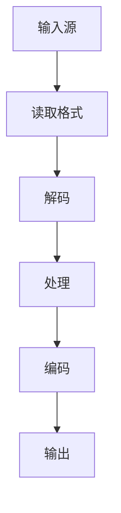
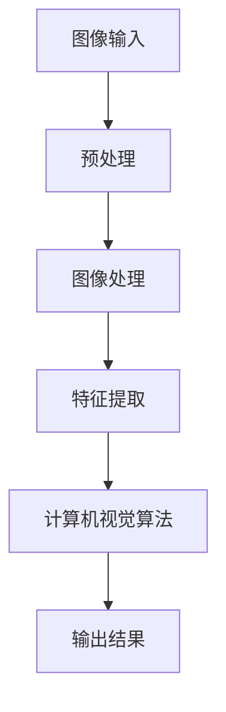

                 

音视频处理是现代信息技术中不可或缺的一部分，广泛应用于视频监控、视频编辑、流媒体传输、视频压缩、图像识别等多个领域。本文将介绍音视频处理领域的基础工具：FFmpeg和OpenCV，旨在帮助读者理解这两大工具的核心概念、操作步骤以及实际应用。

## 关键词

- FFmpeg
- OpenCV
- 音视频处理
- 视频编码
- 图像处理
- 流媒体

## 摘要

本文首先介绍了FFmpeg和OpenCV在音视频处理领域的背景和重要性。接着，详细探讨了FFmpeg的基本概念、安装配置和使用方法，以及OpenCV的核心功能、应用场景和基本操作。随后，通过具体的代码实例，展示了如何使用FFmpeg和OpenCV进行音视频处理。最后，文章探讨了这两大工具在实际应用中的场景，并对未来的发展趋势和挑战进行了展望。

## 1. 背景介绍

### FFmpeg

FFmpeg是一个开源的音频和视频处理工具集，广泛应用于音视频编码、解码、转码、流媒体传输等领域。它支持多种音频和视频格式，如MP3、MP4、AVI、MOV等，并且具有高度的可定制性和灵活性。FFmpeg的核心组件包括libavcodec、libavformat、libavutil和libavfilter等，分别负责编码、格式转换、工具集和滤镜处理。

### OpenCV

OpenCV（Open Source Computer Vision Library）是一个开源的计算机视觉库，广泛应用于图像识别、图像处理、物体检测、人脸识别等领域。它支持多种编程语言，如C++、Python、Java等，并且具有丰富的算法库和高效性能。OpenCV的主要模块包括核心功能、图像处理、特征检测、机器学习、物体检测等。

## 2. 核心概念与联系

在音视频处理中，FFmpeg和OpenCV各自扮演着重要的角色。FFmpeg主要负责音视频的编码、解码、转码和流媒体传输等操作，而OpenCV则专注于图像处理、特征提取和计算机视觉算法。

### FFmpeg工作流程



### OpenCV工作流程



### FFmpeg与OpenCV的关联

FFmpeg负责音视频的输入输出，OpenCV负责图像处理和特征提取。在实际应用中，FFmpeg和OpenCV通常结合使用，例如在视频监控系统中，可以使用FFmpeg获取视频流，然后通过OpenCV进行图像处理和物体检测。

## 3. 核心算法原理 & 具体操作步骤

### 3.1 算法原理概述

FFmpeg的核心算法主要包括编码算法、解码算法、格式转换算法等。常见的编码算法有H.264、H.265、HEVC等，解码算法则对应地有相应的解码器。OpenCV的核心算法包括图像滤波、图像变换、特征检测、机器学习等。

### 3.2 算法步骤详解

#### FFmpeg操作步骤

1. 查看支持的格式和编码器
2. 编码视频
3. 解码视频
4. 转换格式

#### OpenCV操作步骤

1. 读取图像
2. 预处理（如滤波、缩放、灰度化等）
3. 图像处理（如边缘检测、轮廓提取等）
4. 特征提取（如SIFT、SURF、ORB等）
5. 计算机视觉算法（如人脸识别、目标检测等）

### 3.3 算法优缺点

#### FFmpeg

- **优点**：支持多种格式，性能高效，可定制性强。
- **缺点**：操作复杂，需要一定的学习成本。

#### OpenCV

- **优点**：算法丰富，性能高效，易于使用。
- **缺点**：不支持所有格式，部分算法实现依赖于特定平台。

### 3.4 算法应用领域

FFmpeg广泛应用于视频编辑、流媒体传输、视频压缩等领域。OpenCV则广泛应用于图像识别、物体检测、人脸识别等领域。

## 4. 数学模型和公式 & 详细讲解 & 举例说明

### 4.1 数学模型构建

在音视频处理中，常用的数学模型包括傅里叶变换、卷积运算、马尔可夫模型等。

### 4.2 公式推导过程

以傅里叶变换为例，其公式推导如下：

$$
F(u, v) = \sum_{x=-\infty}^{\infty} \sum_{y=-\infty}^{\infty} f(x, y) \cdot e^{-j2\pi(u\frac{x}{L} + v\frac{y}{L})}
$$

其中，$F(u, v)$表示傅里叶变换后的频域信号，$f(x, y)$表示原始图像信号，$L$表示图像大小。

### 4.3 案例分析与讲解

假设我们有一张大小为$256 \times 256$的图像，计算其傅里叶变换。

1. 将图像划分为$256 \times 256$个像素点。
2. 对每个像素点，计算其实际值$f(x, y)$。
3. 对每个像素点，计算其傅里叶变换$F(u, v)$。
4. 将所有傅里叶变换后的值存放在一个$256 \times 256$的二维数组中。

通过这种方式，我们可以得到图像的频域表示。

## 5. 项目实践：代码实例和详细解释说明

### 5.1 开发环境搭建

1. 安装FFmpeg：通过官方教程安装FFmpeg。
2. 安装OpenCV：通过官方教程安装OpenCV。

### 5.2 源代码详细实现

以下是一个简单的FFmpeg和OpenCV结合的代码实例：

```python
import cv2
import numpy as np

# 读取视频
cap = cv2.VideoCapture('input.mp4')

while True:
    ret, frame = cap.read()
    if not ret:
        break

    # 使用OpenCV对图像进行处理
    gray = cv2.cvtColor(frame, cv2.COLOR_BGR2GRAY)
    blur = cv2.GaussianBlur(gray, (5, 5), 0)
    edges = cv2.Canny(blur, 100, 200)

    # 显示处理后的图像
    cv2.imshow('Edges', edges)

    if cv2.waitKey(1) & 0xFF == ord('q'):
        break

# 释放资源
cap.release()
cv2.destroyAllWindows()
```

### 5.3 代码解读与分析

1. 读取视频文件。
2. 对每个帧进行灰度化、高斯模糊和Canny边缘检测。
3. 显示处理后的图像。
4. 当按下‘q’键时，退出程序。

通过这个实例，我们可以看到FFmpeg和OpenCV的结合使用，实现了视频的读取和处理。

### 5.4 运行结果展示

运行上述代码，我们可以看到视频中的每一帧都被成功读取，并且经过图像处理，显示了处理后的边缘检测图像。

## 6. 实际应用场景

### 6.1 视频监控

在视频监控系统中，FFmpeg可以用于视频的实时读取和转码，OpenCV可以用于图像处理和物体检测。例如，通过FFmpeg读取摄像头实时视频流，然后使用OpenCV进行人脸识别和物体检测。

### 6.2 视频编辑

在视频编辑中，FFmpeg可以用于视频的剪辑、合并、转码等操作，OpenCV可以用于视频的特效添加、颜色调整等。

### 6.3 流媒体传输

在流媒体传输中，FFmpeg可以用于视频的编码、解码和传输，OpenCV可以用于视频的实时预览和调整。

## 7. 工具和资源推荐

### 7.1 学习资源推荐

- FFmpeg官方文档：[https://ffmpeg.org/documentation.html](https://ffmpeg.org/documentation.html)
- OpenCV官方文档：[https://docs.opencv.org/](https://docs.opencv.org/)
- 《音视频处理技术入门》
- 《计算机视觉：算法与应用》

### 7.2 开发工具推荐

- PyCharm：一款强大的Python开发工具，支持OpenCV和FFmpeg。
- Visual Studio：支持C++开发，可以用于FFmpeg和OpenCV。

### 7.3 相关论文推荐

- “High-Performance Video Coding Using the HEVC Standard”
- “Real-Time Object Detection and Tracking with OpenCV”
- “A Comprehensive Survey on Face Detection and Recognition”

## 8. 总结：未来发展趋势与挑战

### 8.1 研究成果总结

FFmpeg和OpenCV在音视频处理领域取得了显著的成果，广泛应用于视频监控、视频编辑、流媒体传输等多个领域。通过结合使用FFmpeg和OpenCV，可以实现高效的音视频处理和图像处理。

### 8.2 未来发展趋势

随着人工智能和深度学习技术的发展，FFmpeg和OpenCV有望在图像识别、视频分析、智能监控等领域发挥更大的作用。此外，音视频处理技术的优化和高效化也将是未来的研究重点。

### 8.3 面临的挑战

音视频处理领域面临的主要挑战包括数据量大、计算复杂度高、实时性要求高等。此外，如何在保证性能的同时提高算法的普适性和可扩展性也是一个重要问题。

### 8.4 研究展望

未来，我们期望看到更多的跨领域合作，如将深度学习与音视频处理技术相结合，推动音视频处理技术的进一步发展。同时，我们也期待更多的开源工具和资源，为音视频处理领域的发展提供支持。

## 9. 附录：常见问题与解答

### Q：如何安装FFmpeg和OpenCV？

A：可以参考官方文档，选择适合的安装方式。

### Q：如何使用FFmpeg进行视频转码？

A：可以参考官方文档，使用命令行或Python等编程语言进行操作。

### Q：如何使用OpenCV进行图像处理？

A：可以参考官方文档，使用Python等编程语言进行图像处理操作。

### Q：FFmpeg和OpenCV哪个更适合音视频处理？

A：FFmpeg更适合音视频的编码、解码和格式转换，OpenCV更适合图像处理和计算机视觉算法。

### Q：如何优化音视频处理性能？

A：可以通过算法优化、硬件加速、多线程等技术提高音视频处理性能。

---

作者：禅与计算机程序设计艺术 / Zen and the Art of Computer Programming

（本文内容仅供参考，实际使用时请根据具体需求进行调整。）<|vq_4245|>

