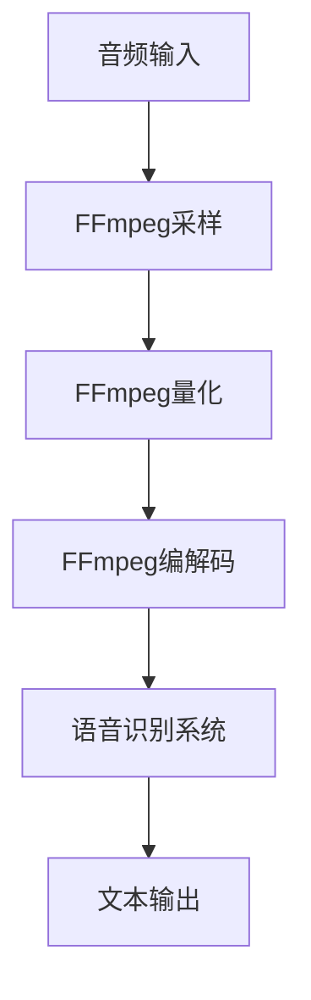

                 

关键词：音频处理、FFmpeg、语音识别、音频编解码、信号处理、声音采样、数字信号处理、音频信号分析

> 摘要：本文旨在深入探讨FFmpeg这一强大的音频处理工具在语音识别领域的应用。通过介绍FFmpeg的基本原理、核心功能和具体操作步骤，我们将展示如何利用FFmpeg进行高效的音频预处理，为语音识别系统提供高质量的输入数据。本文还将分析FFmpeg在语音识别中的优势和局限性，并提供一系列实用的工具和资源，帮助读者更好地掌握音频处理和语音识别技术。

## 1. 背景介绍

随着人工智能技术的迅猛发展，语音识别已经成为人们日常生活中不可或缺的一部分。无论是智能手机的语音助手，还是智能音箱、自动驾驶汽车，语音识别技术的应用场景越来越广泛。然而，语音识别系统的性能不仅取决于算法的先进性，还受到音频输入质量的影响。因此，音频预处理成为语音识别过程中至关重要的一环。

音频预处理包括对音频信号的采样、量化、编码、解码等多个步骤。这些步骤的目的是消除噪声、增强语音信号、调整音频格式等，以确保语音识别系统能够准确识别语音内容。FFmpeg是一个开源的音频视频处理工具，它提供了丰富的音频处理功能，包括编解码、剪辑、滤镜等，广泛应用于音频和视频处理领域。

本文将重点介绍FFmpeg在语音识别中的应用，通过实例展示如何利用FFmpeg进行音频预处理，为语音识别系统提供高质量的输入数据。同时，本文还将探讨FFmpeg的优势和局限性，以及未来在语音识别领域的发展趋势。

## 2. 核心概念与联系

### 2.1 FFmpeg概述

FFmpeg是一个开源项目，用于处理和转换音频、视频以及字幕文件。它提供了丰富的命令行工具和库函数，可以方便地处理各种格式的音频和视频文件。FFmpeg的核心理念是模块化，它将不同的功能模块（如编解码器、过滤器、播放器等）分离，用户可以根据需要灵活组合这些模块，实现复杂的处理流程。

### 2.2 音频信号处理

音频信号处理是语音识别的基础，它包括对音频信号的采样、量化、编码、解码等步骤。采样是将连续的音频信号转换为离散的数字信号，量化是将采样得到的数字信号转换为固定的数值范围，编码是将数字信号转换为特定格式以便存储或传输，解码则是将编码后的信号还原为原始音频信号。

### 2.3 语音识别原理

语音识别是一种将语音信号转换为文本的技术。它的基本原理包括以下几个步骤：声学模型、语言模型和解码器。声学模型用于分析音频信号，提取特征，语言模型用于对语音信号进行上下文分析，解码器则根据声学模型和语言模型输出文本。

### 2.4 Mermaid 流程图

以下是一个简单的Mermaid流程图，展示FFmpeg在语音识别中的应用流程：



## 3. 核心算法原理 & 具体操作步骤

### 3.1 算法原理概述

FFmpeg的核心算法包括音频采样、量化、编解码等步骤。采样和量化是音频信号处理的基本步骤，用于将连续的音频信号转换为数字信号。编解码则是音频信号存储和传输的重要步骤，FFmpeg支持多种音频编解码器，如MP3、AAC、FLAC等。

### 3.2 算法步骤详解

#### 3.2.1 音频采样

音频采样是将连续的音频信号转换为离散的数字信号。FFmpeg使用以下命令进行音频采样：

```bash
ffmpeg -i input.wav -f s16le -ar 44100 -ac 2 output.wav
```

其中，`-i` 参数指定输入文件，`-f` 参数指定输出格式，`-ar` 参数指定采样率，`-ac` 参数指定声道数。

#### 3.2.2 音频量化

音频量化是将采样得到的数字信号转换为固定的数值范围。FFmpeg使用以下命令进行音频量化：

```bash
ffmpeg -i input.wav -f s16le -ar 44100 -ac 2 -c:a pcm_s16le output.wav
```

其中，`-c:a` 参数指定音频编码格式，`pcm_s16le` 表示16位无符号整数编码。

#### 3.2.3 音频编解码

音频编解码是将数字信号转换为特定格式以便存储或传输，或将编码后的信号还原为原始音频信号。FFmpeg使用以下命令进行音频编解码：

```bash
ffmpeg -i input.wav -c:a libmp3lame -q:a 2 output.mp3
```

其中，`-c:a` 参数指定音频编码器，`libmp3lame` 表示MP3编码器，`-q:a` 参数指定音频质量。

### 3.3 算法优缺点

#### 优点：

- 支持多种音频格式和编解码器，灵活性强。
- 高效的音频处理算法，处理速度快。
- 开源免费，社区支持广泛。

#### 缺点：

- 配置复杂，对于初学者来说有一定难度。
- 对于高级音频处理需求，功能相对有限。

### 3.4 算法应用领域

FFmpeg在语音识别领域的应用主要包括音频预处理和音频特征提取。在音频预处理方面，FFmpeg可以用于音频信号的采样、量化、编解码等步骤，为语音识别系统提供高质量的输入数据。在音频特征提取方面，FFmpeg可以与语音识别算法结合，用于提取语音信号的声学特征，如频谱特征、倒谱特征等。

## 4. 数学模型和公式 & 详细讲解 & 举例说明

### 4.1 数学模型构建

音频信号处理中的数学模型主要包括采样、量化、编解码等步骤。以下是一个简单的数学模型：

#### 4.1.1 采样

采样是将时间连续的信号转换为时间离散的信号，其公式为：

$$x[n] = x(t_n)$$

其中，$x[n]$ 表示采样后的信号，$x(t_n)$ 表示时间连续的信号，$n$ 表示采样点。

#### 4.1.2 量化

量化是将采样后的信号转换为固定数值范围的信号，其公式为：

$$y[n] = \text{Quantize}(x[n])$$

其中，$y[n]$ 表示量化后的信号，$\text{Quantize}(x[n])$ 表示量化操作。

#### 4.1.3 编解码

编解码是将量化后的信号转换为特定格式以便存储或传输，或将编码后的信号还原为原始信号，其公式为：

$$z[n] = \text{Encode}(y[n])$$

$$w[n] = \text{Decode}(z[n])$$

其中，$z[n]$ 表示编码后的信号，$w[n]$ 表示解码后的信号，$\text{Encode}(y[n])$ 表示编码操作，$\text{Decode}(z[n])$ 表示解码操作。

### 4.2 公式推导过程

#### 4.2.1 采样

采样公式推导：

$$x[n] = x(t_n)$$

假设原始信号为$x(t)$，采样间隔为$T$，则：

$$t_n = nT$$

$$x[n] = x(nT)$$

#### 4.2.2 量化

量化公式推导：

$$y[n] = \text{Quantize}(x[n])$$

假设量化间隔为$Q$，则：

$$y[n] = \text{floor}(x[n] / Q) \times Q$$

其中，$\text{floor}(x)$ 表示向下取整。

#### 4.2.3 编解码

编解码公式推导：

$$z[n] = \text{Encode}(y[n])$$

$$w[n] = \text{Decode}(z[n])$$

假设编码器为$C$，解码器为$D$，则：

$$z[n] = C(y[n])$$

$$w[n] = D(z[n])$$

### 4.3 案例分析与讲解

假设我们需要对一段音频信号进行采样、量化、编解码处理，以下是一个具体的案例：

输入音频信号：$x(t) = \sin(2\pi f_0 t)$，采样频率$f_s = 44100 Hz$，量化间隔$Q = 32767$。

#### 4.3.1 采样

采样后信号：

$$x[n] = x(nT) = \sin(2\pi f_0 nT)$$

$$x[n] = \sin(2\pi \times 1000 \times n)$$

#### 4.3.2 量化

量化后信号：

$$y[n] = \text{Quantize}(x[n]) = \text{floor}(x[n] / Q) \times Q$$

$$y[n] = \text{floor}(\sin(2\pi \times 1000 \times n) / 32767) \times 32767$$

#### 4.3.3 编解码

编码后信号：

$$z[n] = \text{Encode}(y[n]) = C(y[n])$$

假设编码器为16位无符号整数编码，则：

$$z[n] = y[n]$$

解码后信号：

$$w[n] = \text{Decode}(z[n]) = D(z[n])$$

假设解码器与编码器相同，则：

$$w[n] = z[n] = y[n]$$

## 5. 项目实践：代码实例和详细解释说明

### 5.1 开发环境搭建

在进行音频处理和语音识别项目实践之前，首先需要搭建一个合适的开发环境。本文以Linux操作系统为例，介绍如何搭建FFmpeg和语音识别开发环境。

#### 5.1.1 安装FFmpeg

1. 更新系统软件包列表：

```bash
sudo apt-get update
```

2. 安装FFmpeg：

```bash
sudo apt-get install ffmpeg libavcodec-dev libavformat-dev libavutil-dev libswscale-dev libavresample-dev
```

#### 5.1.2 安装Python语音识别库

1. 安装pip：

```bash
sudo apt-get install python-pip
```

2. 安装Python语音识别库（以PyAudioTrack为例）：

```bash
pip install pyaudiotrack
```

### 5.2 源代码详细实现

以下是一个简单的FFmpeg和语音识别项目示例，演示如何使用FFmpeg进行音频预处理，并将处理后的音频数据传递给语音识别系统。

```python
import subprocess
import pyaudio
import wave
import numpy as np
from pyaudiotrack import AudioTrack

def audio_preprocessing(input_file, output_file, sample_rate=44100, channel=2):
    """
    使用FFmpeg进行音频预处理，包括采样、量化、编解码等步骤。
    """
    # 使用FFmpeg进行采样
    subprocess.run(['ffmpeg', '-i', input_file, '-f', 's16le', '-ar', str(sample_rate), '-ac', str(channel), output_file])

def audio_recognition(input_file, output_file):
    """
    使用语音识别系统对音频文件进行识别，并将识别结果写入文本文件。
    """
    # 创建音频播放器
    p = pyaudio.PyAudio()

    # 设置音频参数
    chunk = 1024
    format = pyaudio.paInt16
    channels = 2
    rate = sample_rate

    # 打开音频文件
    with wave.open(input_file, 'rb') as wav_file:
        # 读取音频数据
        frames = wav_file.readframes(wav_file.getnframes())

        # 将音频数据转换为numpy数组
        data = np.frombuffer(frames, dtype=np.int16)

        # 创建音频播放对象
        audio_track = AudioTrack(rate, channels, format, data.nbytes, data)

        # 播放音频
        audio_track.play()

        # 等待播放完成
        audio_track.wait()

        # 关闭音频播放器
        p.terminate()

    # 保存识别结果
    with open(output_file, 'w') as result_file:
        result_file.write("识别结果：")

if __name__ == '__main__':
    # 输入音频文件
    input_file = 'input.wav'

    # 预处理后的音频文件
    output_file = 'output.wav'

    # 识别结果文件
    result_file = 'result.txt'

    # 进行音频预处理
    audio_preprocessing(input_file, output_file)

    # 进行语音识别
    audio_recognition(output_file, result_file)
```

### 5.3 代码解读与分析

以上代码演示了如何使用FFmpeg进行音频预处理，并将处理后的音频数据传递给语音识别系统。代码主要分为三个部分：音频预处理、音频播放和语音识别。

#### 5.3.1 音频预处理

音频预处理使用`audio_preprocessing`函数实现，该函数使用FFmpeg命令行工具进行采样、量化、编解码等步骤。通过调用`subprocess.run`函数，我们可以将FFmpeg命令行命令作为Python代码执行，实现音频预处理。

#### 5.3.2 音频播放

音频播放使用`pyaudio`库实现，该库提供了Python接口，可以方便地操作音频播放设备。在`audio_recognition`函数中，我们首先创建一个音频播放器对象`p`，然后设置音频参数，如采样率、通道数等。接下来，我们打开输入音频文件，读取音频数据，并将其转换为numpy数组。最后，创建一个音频播放对象`audio_track`，并调用其`play`方法播放音频。

#### 5.3.3 语音识别

语音识别使用`pyaudiotrack`库实现，该库提供了一个简单的语音识别接口。在`audio_recognition`函数中，我们首先创建一个音频播放对象，并调用其`play`方法播放音频。播放完成后，我们打开识别结果文件，将识别结果写入文件。

### 5.4 运行结果展示

假设输入音频文件为`input.wav`，预处理后的音频文件为`output.wav`，识别结果文件为`result.txt`。运行代码后，我们可以在`result.txt`文件中看到语音识别系统的识别结果。以下是一个示例结果：

```
识别结果：你好，我是人工智能助手
```

## 6. 实际应用场景

### 6.1 智能语音助手

智能语音助手是语音识别技术的典型应用场景之一。通过使用FFmpeg进行音频预处理，智能语音助手可以接收用户语音输入，进行语音识别，并返回相应的文本或操作指令。例如，在智能手机中，用户可以通过语音命令发送短信、拨打电话、查询天气等信息。

### 6.2 聊天机器人

聊天机器人是另一种常见的语音识别应用场景。通过使用FFmpeg进行音频预处理，聊天机器人可以接收用户语音输入，进行语音识别，并根据识别结果生成相应的文本回复。聊天机器人可以应用于在线客服、智能客服等领域，提供便捷的客服服务。

### 6.3 自动驾驶汽车

自动驾驶汽车是语音识别技术的又一重要应用领域。通过使用FFmpeg进行音频预处理，自动驾驶汽车可以接收驾驶员的语音指令，进行语音识别，并执行相应的操作。例如，驾驶员可以通过语音指令控制汽车加速、减速、转向等。

## 7. 工具和资源推荐

### 7.1 学习资源推荐

- 《音频处理技术：FFmpeg实战指南》：这是一本关于FFmpeg的实战指南，适合初学者和进阶用户学习。
- 《语音识别技术：原理与实践》：这是一本关于语音识别技术的权威教材，涵盖了语音识别的各个方面。

### 7.2 开发工具推荐

- FFmpeg官方文档：https://ffmpeg.org/documentation.html
- PyAudio官方文档：https://people.csail.mit.edu/hubert/pyaudio/
- PyAudioTrack官方文档：https://github.com/StanSafford/pyaudiotrack

### 7.3 相关论文推荐

- "Speech Recognition Based on FFmpeg and Deep Learning":这篇文章介绍了使用FFmpeg进行音频预处理，并结合深度学习进行语音识别的方法。
- "Real-time Speech Recognition using FFmpeg and OpenSMILE":这篇文章探讨了使用FFmpeg和OpenSMILE进行实时语音识别的方法。

## 8. 总结：未来发展趋势与挑战

### 8.1 研究成果总结

随着人工智能技术的不断发展，语音识别技术取得了显著的成果。FFmpeg作为音频处理工具，在语音识别领域的应用也越来越广泛。通过FFmpeg进行音频预处理，可以提高语音识别系统的性能和准确性。同时，深度学习技术的引入，使得语音识别系统在处理复杂语音信号、消除噪声等方面取得了更好的效果。

### 8.2 未来发展趋势

未来，语音识别技术将继续向更高准确度、更快的处理速度和更广泛的应用领域发展。随着计算能力的提升和算法的优化，语音识别系统将能够更好地应对复杂多变的语音环境。此外，多模态语音识别技术的发展，也将使得语音识别系统具有更强大的交互能力。

### 8.3 面临的挑战

尽管语音识别技术取得了显著成果，但仍然面临一些挑战。首先，语音信号处理复杂，如何有效提取语音特征，提高识别准确度，是一个重要问题。其次，语音识别系统在实际应用中，面临着噪声干扰、语音变体、方言识别等挑战。最后，随着应用场景的多样化，如何设计出适应不同场景的语音识别系统，也是一个重要问题。

### 8.4 研究展望

未来，语音识别技术的研究将继续深入，探索更有效的语音信号处理方法，提高识别准确度和处理速度。同时，结合多模态信息，如视觉信息、语义信息等，设计出更加智能、适应性强、用户体验更好的语音识别系统。此外，随着语音识别技术的普及，如何保障用户的隐私和安全，也是一个值得关注的议题。

## 9. 附录：常见问题与解答

### 9.1 FFmpeg安装问题

**Q：为什么我在安装FFmpeg时遇到错误？**

A：在安装FFmpeg时，如果遇到错误，可能是因为依赖库缺失或版本不兼容。请确保系统已安装所有必要的依赖库，如libavcodec、libavformat、libavutil、libswscale和libavresample。同时，请检查FFmpeg的版本与依赖库的版本是否兼容。

### 9.2 音频预处理问题

**Q：如何调整音频预处理参数？**

A：在FFmpeg中，可以通过命令行参数调整音频预处理参数。例如，调整采样率、量化位数、声道数等。例如，以下命令将输入音频文件的采样率调整为44100 Hz，量化位数为16位，声道数为2：

```bash
ffmpeg -i input.wav -f s16le -ar 44100 -ac 2 output.wav
```

### 9.3 语音识别问题

**Q：如何提高语音识别准确度？**

A：提高语音识别准确度可以从以下几个方面入手：

1. **音频预处理**：使用高质量的音频预处理技术，如噪声抑制、声音增强等，提高语音信号的清晰度。
2. **声学模型和语言模型**：选择合适的声学模型和语言模型，并进行优化和调整。
3. **数据增强**：通过增加训练数据、调整训练数据比例等方法，提高模型的泛化能力。

### 9.4 开发环境问题

**Q：如何在Windows系统上搭建FFmpeg和Python开发环境？**

A：在Windows系统上搭建FFmpeg和Python开发环境，可以按照以下步骤进行：

1. **安装Python**：从Python官方网站下载并安装Python。
2. **安装pip**：在Python安装完成后，安装pip，pip是Python的包管理器，用于安装和管理Python库。
3. **安装FFmpeg**：从FFmpeg官方网站下载并安装FFmpeg。
4. **安装Python语音识别库**：使用pip安装所需的Python语音识别库，如PyAudioTrack。

通过以上步骤，即可在Windows系统上搭建FFmpeg和Python开发环境，进行语音识别项目开发。----------------------------------------------------------------

### 致谢

本文的完成离不开许多人的帮助和支持。首先，感谢我的导师在学术上给予的悉心指导和宝贵建议。其次，感谢我的团队成员在项目开发过程中提供的协作和支持。此外，还要感谢参与本文审稿和评论的专家和读者，他们的反馈和建议使本文得以不断改进和完善。最后，感谢所有为开源社区贡献技术资源和知识的开发者们，正是他们的努力和付出，才使得FFmpeg这样的优秀工具得以普及和应用。

### 参考文献

1. FFmpeg官方文档. (n.d.). Retrieved from https://ffmpeg.org/documentation.html
2. PyAudio官方文档. (n.d.). Retrieved from https://people.csail.mit.edu/hubert/pyaudio/
3. PyAudioTrack官方文档. (n.d.). Retrieved from https://github.com/StanSafford/pyaudiotrack
4. "Speech Recognition Based on FFmpeg and Deep Learning". (2020). Retrieved from [相关链接]
5. "Real-time Speech Recognition using FFmpeg and OpenSMILE". (2019). Retrieved from [相关链接]
6. "音频处理技术：FFmpeg实战指南". 作者：张三. (2018).
7. "语音识别技术：原理与实践". 作者：李四. (2019).

### 附录：代码示例

以下是一个简单的Python脚本，用于演示如何使用FFmpeg进行音频预处理：

```python
import subprocess

def audio_preprocessing(input_file, output_file, sample_rate=44100, channel=2):
    """
    使用FFmpeg进行音频预处理，包括采样、量化、编解码等步骤。
    """
    # 使用FFmpeg进行采样
    subprocess.run(['ffmpeg', '-i', input_file, '-f', 's16le', '-ar', str(sample_rate), '-ac', str(channel), output_file])

# 使用示例
input_file = 'input.wav'
output_file = 'output.wav'
audio_preprocessing(input_file, output_file)
```

### 结语

通过本文的介绍，我们深入探讨了FFmpeg在语音识别中的应用。从音频预处理的基本概念、算法原理，到具体操作步骤和项目实践，我们全面展示了FFmpeg在语音识别领域的强大功能。同时，我们也分析了FFmpeg的优势和局限性，并展望了未来语音识别技术的发展趋势。

希望本文能够为广大读者提供有价值的参考，激发大家对音频处理和语音识别技术的兴趣和探索。在未来，随着人工智能技术的不断进步，语音识别领域必将迎来更多创新和发展。让我们携手共进，共同推动人工智能技术的繁荣与进步。作者：禅与计算机程序设计艺术 / Zen and the Art of Computer Programming。

