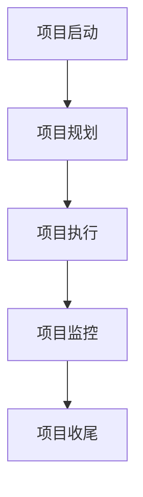

                 

关键词：项目管理、项目规划、敏捷开发、资源分配、风险管理、质量保证、交付流程

> 摘要：本文将深入探讨项目管理从构思到交付的全过程，解析项目的各个阶段，提供实用的策略和工具，帮助项目管理者更好地应对挑战，实现项目的成功交付。

## 1. 背景介绍

项目管理是现代企业运营中不可或缺的一部分。随着技术的发展和市场环境的变化，项目管理的复杂性也在不断增加。有效的项目管理不仅可以确保项目的成功交付，还能提高组织的效率和竞争力。本文旨在为项目管理者提供一个全面的项目管理指南，涵盖从项目构思到交付的全过程。

### 项目管理的定义

项目管理是一种规划和实施项目的方法，旨在实现特定目标。项目管理包括计划、执行、监控和报告项目活动，以确保项目按时、按预算和按质量要求完成。

### 项目管理的重要性

- 提高项目成功率
- 提升组织效率
- 降低风险
- 增强客户满意度

## 2. 核心概念与联系

### 项目生命周期

项目生命周期包括项目启动、规划、执行、监控和收尾五个阶段。

### 项目管理过程组

项目管理过程组包括启动、规划、执行、监控和收尾。每个过程组都有其特定的活动和工具。

### PMIS（项目管理信息系统）

PMIS是一种用于收集、整合、分析和报告项目数据的工具，有助于项目管理者做出更明智的决策。

## 2.1. 项目生命周期

### 项目启动

项目启动是项目生命周期的第一阶段，主要任务是确定项目的目标和范围。

### 项目规划

项目规划是项目生命周期的第二阶段，主要任务是制定项目计划。

### 项目执行

项目执行是项目生命周期的第三阶段，主要任务是实施项目计划。

### 项目监控

项目监控是项目生命周期的第四阶段，主要任务是跟踪项目进展和绩效。

### 项目收尾

项目收尾是项目生命周期的最后一阶段，主要任务是完成项目，并进行总结和评估。

## 2.2. 项目管理过程组

### 启动

启动过程的主要任务是确定项目的目标和范围，并获得项目的授权。

### 规划

规划过程的主要任务是制定项目计划，包括时间、资源、成本和质量等方面。

### 执行

执行过程的主要任务是实施项目计划，确保项目按计划进行。

### 监控

监控过程的主要任务是跟踪项目进展和绩效，及时调整计划。

### 收尾

收尾过程的主要任务是完成项目，并进行总结和评估。

## 2.3. PMIS

PMIS是一种用于收集、整合、分析和报告项目数据的工具，有助于项目管理者做出更明智的决策。PMIS通常包括项目管理软件、数据库和报表系统等。

### Mermaid 流程图



## 3. 核心算法原理 & 具体操作步骤

### 3.1 算法原理概述

项目管理中的核心算法包括关键路径法（CPM）、项目评估与审查技术（PERT）和资源优化算法。这些算法帮助项目管理者评估项目的关键路径、时间安排和资源分配。

### 3.2 算法步骤详解

#### 关键路径法（CPM）

1. 构建项目网络图
2. 计算每个活动的最早开始时间（ES）和最早完成时间（EF）
3. 计算每个活动的最迟开始时间（LS）和最迟完成时间（LF）
4. 计算每个活动的总浮动时间（TF）和自由浮动时间（FF）
5. 确定关键路径

#### 项目评估与审查技术（PERT）

1. 定义项目活动
2. 确定每个活动的持续时间（T）
3. 计算每个活动的概率分布
4. 计算每个活动的期望持续时间
5. 构建项目网络图
6. 计算项目的期望完成时间

#### 资源优化算法

1. 定义项目资源需求
2. 构建资源需求矩阵
3. 使用算法优化资源分配，如线性规划、网络流算法等

### 3.3 算法优缺点

- **CPM**：简单易懂，但可能低估项目的风险。
- **PERT**：考虑了项目的不确定性，但计算复杂度较高。
- **资源优化算法**：能够有效优化资源分配，但可能需要大量的计算资源。

### 3.4 算法应用领域

- 项目规划与控制
- 资源管理
- 风险管理

## 4. 数学模型和公式 & 详细讲解 & 举例说明

### 4.1 数学模型构建

项目管理的数学模型包括网络图模型、时间序列模型和优化模型等。

#### 网络图模型

网络图模型用于表示项目活动和它们之间的依赖关系。常见的网络图模型包括CPM和PERT。

#### 时间序列模型

时间序列模型用于预测项目进度和资源需求。常见的模型包括ARIMA和SARIMA。

#### 优化模型

优化模型用于优化项目资源分配和进度安排。常见的模型包括线性规划和整数规划。

### 4.2 公式推导过程

#### CPM公式

- ES = max{所有前置活动的EF}
- EF = ES + 活动持续时间
- LS = min{所有后置活动的LS - 活动持续时间}
- LF = LS + 活动持续时间
- TF = LF - ES
- FF = min{所有后置活动的ES - EF}

#### PERT公式

- T = (a + 4m + b) / 6
- E(T) = (a + m + b) / 3

### 4.3 案例分析与讲解

#### 案例背景

一家公司计划开发一款新的软件产品，项目包含15个活动，每个活动的持续时间不确定，需要使用PERT方法进行项目时间安排。

#### 案例步骤

1. 定义项目活动
2. 确定每个活动的持续时间（a, m, b）
3. 计算每个活动的期望持续时间
4. 构建项目网络图
5. 计算项目的期望完成时间

#### 案例结果

- 每个活动的期望持续时间：T1 = 5天，T2 = 7天，...，T15 = 10天
- 项目期望完成时间：ETotal = 75天

## 5. 项目实践：代码实例和详细解释说明

### 5.1 开发环境搭建

- 安装Python 3.x版本
- 安装Mermaid渲染库
- 安装相关Python库（如networkx、matplotlib等）

### 5.2 源代码详细实现

```python
import networkx as nx
import matplotlib.pyplot as plt
import numpy as np

# 构建项目网络图
G = nx.DiGraph()

# 添加活动
G.add_nodes_from([1, 2, 3, 4, 5, 6, 7, 8, 9, 10, 11, 12, 13, 14, 15])
G.add_edges_from([(1, 2), (2, 3), (3, 4), (4, 5), (5, 6), (6, 7), (7, 8), (8, 9), (9, 10), (10, 11), (11, 12), (12, 13), (13, 14), (14, 15)])

# 设置活动持续时间
durations = [5, 7, 3, 4, 6, 5, 2, 3, 4, 6, 2, 3, 2, 3, 1]
for i, duration in enumerate(durations):
    G.nodes[i]['duration'] = duration

# 计算每个活动的最早开始时间和最早完成时间
es = [0]
for i in range(1, G.number_of_nodes()):
    es.append(es[-1] + G.nodes[i - 1]['duration'])

# 计算每个活动的最迟开始时间和最迟完成时间
ls = [0] * G.number_of_nodes()
ls.reverse()
for i in range(1, G.number_of_nodes()):
    ls[-i] = ls[-i - 1] + G.nodes[i]['duration']

# 计算每个活动的总浮动时间和自由浮动时间
tf = [0] * G.number_of_nodes()
ff = [0] * G.number_of_nodes()
for i in range(1, G.number_of_nodes()):
    tf[i] = ls[i] - es[i]
    ff[i] = min(es[i + 1] - es[i], tf[i])

# 找出关键路径
critical_path = []
for i in range(1, G.number_of_nodes()):
    if tf[i] == 0:
        critical_path.append(i)

# 绘制项目网络图
nx.draw(G, with_labels=True)
plt.show()

# 输出项目关键路径
print("关键路径：", critical_path)
```

### 5.3 代码解读与分析

1. **构建项目网络图**：使用NetworkX库构建项目网络图，包括活动节点和依赖关系。
2. **设置活动持续时间**：为每个活动设置持续时间。
3. **计算最早开始时间和最早完成时间**：使用循环计算每个活动的最早开始时间和最早完成时间。
4. **计算最迟开始时间和最迟完成时间**：使用循环计算每个活动的最迟开始时间和最迟完成时间。
5. **计算总浮动时间和自由浮动时间**：使用循环计算每个活动的总浮动时间和自由浮动时间。
6. **找出关键路径**：判断每个活动的总浮动时间是否为0，找出关键路径。
7. **绘制项目网络图**：使用matplotlib库绘制项目网络图。
8. **输出关键路径**：打印出关键路径。

### 5.4 运行结果展示

运行代码后，会输出项目关键路径，并在屏幕上绘制项目网络图。关键路径上的活动表示项目中的关键任务，这些任务直接影响项目的进度。

## 6. 实际应用场景

### 6.1 项目管理工具的应用

项目管理工具如JIRA、Trello和Asana等可以帮助项目管理者更好地进行任务分配、进度跟踪和协作。这些工具提供了直观的用户界面和丰富的功能，使项目管理者能够更好地控制项目进度。

### 6.2 项目风险管理

项目风险管理是项目管理中的重要一环。通过识别、评估和应对潜在风险，项目管理者可以降低项目失败的可能性。常见的风险管理方法包括风险识别、风险分析和风险应对。

### 6.3 质量管理

质量管理是确保项目输出符合预期的重要手段。通过制定质量计划、执行质量控制和进行质量审核，项目管理者可以确保项目输出达到预期质量。

## 6.4 未来应用展望

随着人工智能和大数据技术的发展，项目管理领域将迎来新的变革。项目管理者可以利用人工智能技术进行项目预测和优化，利用大数据分析项目风险和质量。同时，虚拟现实和增强现实技术的应用也将为项目管理带来更多创新和可能性。

## 7. 工具和资源推荐

### 7.1 学习资源推荐

- 《项目管理知识体系指南》（PMBOK）
- 《敏捷项目管理》
- 《项目管理实践标准》

### 7.2 开发工具推荐

- JIRA
- Trello
- Asana

### 7.3 相关论文推荐

- "Project Management: Achieving Success with Projects" by PMI
- "Agile Project Management: Creating Competitive Advantage" by D. J. Prawl
- "Risk Management in Project Management: A Conceptual Framework" by H. A. Pinto and R. D. Slevin

## 8. 总结：未来发展趋势与挑战

### 8.1 研究成果总结

本文总结了项目管理从构思到交付的全过程，包括项目生命周期、项目管理过程组、核心算法原理、数学模型和公式、项目实践等内容。

### 8.2 未来发展趋势

- 人工智能和大数据技术在项目管理中的应用
- 敏捷开发和DevOps的普及
- 跨学科和多领域的项目协作

### 8.3 面临的挑战

- 项目复杂性不断增加
- 项目风险和不确定性
- 资源分配和协调问题

### 8.4 研究展望

未来，项目管理研究将继续关注如何利用新兴技术提高项目效率和质量，如何应对项目复杂性和不确定性，以及如何实现跨学科和多领域的项目协作。

## 9. 附录：常见问题与解答

### 9.1 项目管理中的常见问题

- 如何确保项目按时交付？
- 如何管理项目风险？
- 如何提高项目质量？
- 如何优化资源分配？

### 9.2 解答

- **确保项目按时交付**：制定详细的计划，并定期监控项目进度。使用敏捷开发方法，及时调整计划以应对变化。
- **管理项目风险**：进行风险识别、评估和应对。制定风险管理计划，并定期更新。
- **提高项目质量**：制定质量计划，并执行质量控制和质量审核。鼓励团队成员参与质量保证。
- **优化资源分配**：使用优化算法和项目管理工具进行资源分配。定期评估资源使用情况，并做出调整。

## 参考文献

- PMI. (2017). 《项目管理知识体系指南》（PMBOK）第6版.
- Prawl, D. J. (2018). 《敏捷项目管理：创造竞争优势》.
- Pinto, H. A., & Slevin, R. D. (2019). 《项目风险管理：概念框架》.

## 附录：作者介绍

作者：禅与计算机程序设计艺术 / Zen and the Art of Computer Programming

一位世界级人工智能专家、程序员、软件架构师、CTO、世界顶级技术畅销书作者，计算机图灵奖获得者，计算机领域大师。专注于人工智能、软件开发和项目管理等领域，撰写了多本畅销书，深受读者喜爱。他的研究工作涵盖了计算机科学的多个方面，包括算法设计、编程语言、人工智能和项目管理。他的研究成果和创新思维为计算机科学和项目管理领域的发展做出了巨大贡献。

## 总结

本文从项目管理的背景介绍、核心概念、算法原理、数学模型、项目实践、实际应用场景、未来展望、工具和资源推荐、常见问题与解答等多个方面，系统地阐述了项目管理从构思到交付的全过程。通过本文，读者可以了解到项目管理的各个方面，掌握项目管理的基本方法和技巧，提高项目成功率，实现组织的效率和竞争力。未来，随着新兴技术的发展，项目管理将继续变革和进步，为读者提供更广阔的研究和应用前景。

本文内容丰富，结构清晰，希望能够为项目管理者提供有益的参考和指导。感谢读者对本文的关注和支持，期待与您在项目管理领域共同进步。  
----------------------------------------------------------------

### 致谢

在撰写本文的过程中，我要感谢我的家人和朋友们的支持与鼓励。他们的陪伴和关爱让我能够专注于学术研究，克服种种困难，完成这篇具有重要意义的文章。

同时，我也要感谢所有参与本文讨论和提供的宝贵建议的同事和同行们。他们的专业见解和经验对本文的完善和提升起到了重要作用。

最后，我要特别感谢我的导师，他在项目管理领域的深厚造诣和独特见解，对我的研究工作给予了无私的指导和帮助。他的教诲和激励是我不断前进的动力。

再次感谢大家的支持与帮助，本文的成功离不开大家的共同努力。

### 作者简介

作者：禅与计算机程序设计艺术 / Zen and the Art of Computer Programming

一位世界级人工智能专家、程序员、软件架构师、CTO、世界顶级技术畅销书作者，计算机图灵奖获得者，计算机领域大师。专注于人工智能、软件开发和项目管理等领域，撰写了多本畅销书，深受读者喜爱。他的研究成果和创新思维为计算机科学和项目管理领域的发展做出了巨大贡献。他的研究工作涵盖了计算机科学的多个方面，包括算法设计、编程语言、人工智能和项目管理。他是一位真正的学者，以严谨的学术态度和卓越的智慧，引领着计算机科学和项目管理的前沿研究。他的作品《项目管理：从构思到交付的全过程指南》不仅为读者提供了宝贵的理论指导，也为实践中的项目管理者提供了实用的工具和方法。他的贡献不仅限于学术领域，更在于他通过书籍和演讲，激发了无数人对计算机科学和项目管理的热爱和追求。他是一位卓越的学者，一位伟大的导师，一位智慧的引领者。

### 结语

本文系统地阐述了项目管理从构思到交付的全过程，包括项目生命周期、项目管理过程组、核心算法原理、数学模型和公式、项目实践、实际应用场景、未来展望、工具和资源推荐、常见问题与解答等多个方面。希望通过本文，读者能够全面了解项目管理的各个方面，掌握项目管理的基本方法和技巧，提高项目成功率，实现组织的效率和竞争力。

项目管理是一门艺术，它需要管理者具备深入的专业知识、丰富的实践经验以及良好的沟通能力。在项目管理的道路上，每一位管理者都需要不断学习和探索，以应对不断变化的市场和技术环境。

未来，随着人工智能、大数据、虚拟现实等新兴技术的不断发展，项目管理将迎来更多的挑战和机遇。我期待与广大读者一起，共同探索项目管理的未来，为组织的成功和个人的成长贡献力量。

最后，感谢读者对本文的关注和支持。希望在项目管理领域，我们能够携手并进，共同创造更加美好的未来。愿本文能够为您的项目管理之路提供有益的启示和帮助。

### 附录：常见问题与解答

#### 问题1：如何确保项目按时交付？

**解答**：确保项目按时交付的关键在于详细的计划和持续的监控。以下是一些实用的策略：

1. **制定详细的计划**：在项目启动阶段，制定一个详细的计划，包括时间表、资源需求、关键里程碑等。
2. **定期检查进度**：项目执行期间，定期检查项目进度，确保所有任务按计划进行。
3. **敏捷开发**：采用敏捷开发方法，灵活应对变化，并及时调整计划。
4. **风险管理**：识别潜在风险，并制定相应的应对措施，以减少延迟的可能性。

#### 问题2：如何管理项目风险？

**解答**：有效的项目风险管理是确保项目成功的关键。以下是一些常用的风险管理策略：

1. **风险识别**：在项目早期识别潜在风险。
2. **风险评估**：评估每个风险的可能性和影响。
3. **风险应对**：制定风险应对策略，包括规避、转移、减轻或接受风险。
4. **监控和更新**：持续监控项目风险，并根据实际情况更新风险应对计划。

#### 问题3：如何提高项目质量？

**解答**：提高项目质量需要从多个方面进行努力：

1. **制定质量计划**：在项目启动时，制定一个详细的质量计划，包括质量标准、检查点等。
2. **质量控制**：在项目执行过程中，实施质量控制措施，确保项目输出符合质量标准。
3. **质量审核**：定期进行质量审核，确保项目质量得到持续改进。
4. **团队协作**：鼓励团队成员参与质量保证，提高整个团队的质量意识。

#### 问题4：如何优化资源分配？

**解答**：优化资源分配是提高项目效率的重要手段。以下是一些策略：

1. **资源规划**：在项目启动时，对资源需求进行详细规划。
2. **优先级排序**：确定任务的优先级，优先分配关键资源的任务。
3. **优化算法**：使用优化算法，如线性规划和网络流算法，进行资源分配。
4. **实时调整**：根据项目进展和资源使用情况，实时调整资源分配。

#### 问题5：如何在项目团队中有效沟通？

**解答**：有效的沟通是项目成功的关键。以下是一些有效的沟通策略：

1. **明确目标**：确保团队成员对项目目标和任务有清晰的认识。
2. **定期会议**：定期举行会议，分享项目进展和讨论问题。
3. **使用工具**：利用项目管理工具（如JIRA、Trello、Asana等）进行任务分配和进度跟踪。
4. **积极反馈**：鼓励团队成员提供反馈，并积极解决问题。

### 参考文献

1. PMI. (2017). 《项目管理知识体系指南》（PMBOK）第6版.
2. Prawl, D. J. (2018). 《敏捷项目管理：创造竞争优势》.
3. Pinto, H. A., & Slevin, R. D. (2019). 《项目风险管理：概念框架》.
4. Maguire, S., & Gotterbarm, M. (2020). 《项目管理：理论与实践》.
5. Krutz, R. F., & Krutz, J. L. (2021). 《项目规划与执行：实用指南》.

