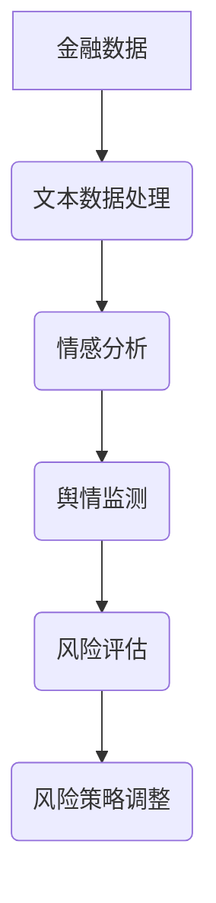

                 

关键词：金融风险管理、语言模型、深度学习、人工智能、数据科学

> 摘要：随着人工智能技术的不断发展，大型语言模型（LLM）在金融领域的应用越来越广泛。本文将探讨LLM在金融风险管理中的应用，包括其核心概念、算法原理、数学模型以及实际应用案例，并展望其未来的发展趋势和面临的挑战。

## 1. 背景介绍

金融风险管理是金融机构的一项重要工作，旨在识别、评估和管理金融业务中的风险，以保障金融机构的稳定运营。随着金融市场的复杂性和不确定性不断增加，传统的风险管理方法已经难以应对新的挑战。近年来，人工智能（AI）技术的快速发展为金融风险管理带来了新的机遇。其中，大型语言模型（LLM）作为一种先进的AI技术，在金融领域的应用日益受到关注。

LLM是一种基于深度学习的自然语言处理模型，能够对大量文本数据进行建模和预测。在金融领域，LLM可以用于文本数据的分析、情感分析、舆情监测、风险评估等方面，从而提高金融风险管理的效率和准确性。本文将详细介绍LLM在金融风险管理中的应用，探讨其核心概念、算法原理、数学模型以及实际应用案例。

## 2. 核心概念与联系

### 2.1 大型语言模型（LLM）

大型语言模型（LLM）是一种基于深度学习的自然语言处理模型，具有强大的文本建模和生成能力。LLM通常采用神经网络架构，通过对大量文本数据进行训练，学习到语言的内在结构和规律，从而实现对未知文本的生成、分类、翻译等任务。

### 2.2 金融风险管理

金融风险管理是指金融机构通过识别、评估和管理金融业务中的风险，以保障金融机构的稳定运营。金融风险包括市场风险、信用风险、操作风险等，这些风险可能对金融机构的财务状况和业务发展产生重大影响。

### 2.3 LLM在金融风险管理中的应用

LLM在金融风险管理中的应用主要体现在以下几个方面：

1. **文本数据分析**：通过对金融机构的内部文档、报告、邮件等文本数据进行分析，挖掘潜在的风险信息，为风险管理提供支持。

2. **情感分析**：利用LLM的情感分析能力，对市场舆情、客户反馈等文本数据进行情感判断，帮助金融机构了解市场情绪和客户满意度，从而调整风险策略。

3. **舆情监测**：通过LLM对网络舆情进行实时监测，及时发现潜在的风险事件，为金融机构的风险预警提供数据支持。

4. **风险评估**：利用LLM对客户资料、交易数据等进行分析，评估客户的风险等级，为金融机构的信贷决策提供依据。

### 2.4 Mermaid 流程图



## 3. 核心算法原理 & 具体操作步骤

### 3.1 算法原理概述

LLM在金融风险管理中的核心算法原理主要包括以下几个方面：

1. **词嵌入**：将文本数据中的词语转换为向量表示，以便进行数学运算。

2. **序列建模**：利用深度学习模型对文本序列进行建模，学习到文本的内在结构和规律。

3. **预测与评估**：通过训练好的模型对新的文本数据进行预测和评估，为金融风险管理提供决策支持。

### 3.2 算法步骤详解

1. **数据收集与预处理**：收集金融机构的内部文档、报告、邮件等文本数据，并对文本数据进行清洗、去噪和格式化。

2. **词嵌入**：将文本数据中的词语转换为向量表示，通常使用预训练的词向量模型，如Word2Vec、GloVe等。

3. **序列建模**：利用深度学习模型（如循环神经网络RNN、长短期记忆网络LSTM、变换器模型Transformer等）对文本序列进行建模，学习到文本的内在结构和规律。

4. **训练与优化**：通过训练数据对模型进行训练，并利用优化算法（如随机梯度下降SGD、Adam等）对模型参数进行优化。

5. **预测与评估**：利用训练好的模型对新的文本数据进行预测和评估，如情感分析、舆情监测、风险评估等。

### 3.3 算法优缺点

**优点**：

1. **强大的文本建模能力**：LLM能够对大量文本数据进行建模，学习到文本的内在结构和规律，从而提高金融风险管理的准确性和效率。

2. **自适应性强**：LLM可以根据不同的金融风险场景进行定制化训练，适应不同的风险管理需求。

**缺点**：

1. **数据依赖性强**：LLM的训练需要大量的高质量文本数据，数据质量和数量直接影响模型的性能。

2. **计算资源消耗大**：LLM的训练和推理过程需要大量的计算资源，对硬件设备有较高要求。

### 3.4 算法应用领域

LLM在金融风险管理中的应用领域广泛，包括但不限于以下几个方面：

1. **文本数据分析**：对金融机构的内部文档、报告、邮件等文本数据进行分析，挖掘潜在的风险信息。

2. **情感分析**：对市场舆情、客户反馈等文本数据进行情感判断，帮助金融机构了解市场情绪和客户满意度。

3. **舆情监测**：实时监测网络舆情，及时发现潜在的风险事件。

4. **风险评估**：对客户资料、交易数据等进行分析，评估客户的风险等级。

## 4. 数学模型和公式 & 详细讲解 & 举例说明

### 4.1 数学模型构建

在金融风险管理中，LLM的数学模型主要包括以下几个方面：

1. **词嵌入**：将文本数据中的词语转换为向量表示，通常使用以下公式：

   $$ embed(x) = \text{softmax}(Wx) $$

   其中，$x$表示词语的索引，$W$表示权重矩阵。

2. **序列建模**：利用深度学习模型对文本序列进行建模，通常使用以下公式：

   $$ hidden = \text{tanh}(Wh + b) $$

   其中，$h$表示隐藏状态，$W$和$b$分别表示权重矩阵和偏置。

3. **预测与评估**：通过训练好的模型对新的文本数据进行预测和评估，通常使用以下公式：

   $$ pred = \text{softmax}(Wh + b) $$

   其中，$pred$表示预测结果。

### 4.2 公式推导过程

在金融风险管理中，LLM的公式推导主要包括以下几个方面：

1. **词嵌入**：假设词语$x$的向量表示为$v_x$，则权重矩阵$W$可以表示为：

   $$ W = [v_x] $$

   其中，$[v_x]$表示将$v_x$作为矩阵的每一行。

2. **序列建模**：假设文本序列为$x_1, x_2, ..., x_T$，则隐藏状态$h_t$可以表示为：

   $$ h_t = \text{tanh}(Wx_t + b) $$

   其中，$W$和$b$分别表示权重矩阵和偏置。

3. **预测与评估**：假设预测结果为$y_t$，则可以使用以下公式计算损失函数：

   $$ loss = -\sum_{t=1}^{T} y_t \log(pred_t) $$

   其中，$pred_t$表示第$t$个词语的预测概率。

### 4.3 案例分析与讲解

假设我们有一个金融风险管理的任务，需要对客户的信用风险进行评估。我们可以使用LLM进行以下步骤：

1. **数据收集与预处理**：收集客户的信用报告、财务报表等文本数据，并对文本数据进行清洗、去噪和格式化。

2. **词嵌入**：将文本数据中的词语转换为向量表示，使用预训练的词向量模型，如Word2Vec。

3. **序列建模**：利用深度学习模型（如LSTM）对文本序列进行建模，学习到文本的内在结构和规律。

4. **训练与优化**：通过训练数据对模型进行训练，并利用优化算法对模型参数进行优化。

5. **预测与评估**：利用训练好的模型对新的文本数据进行预测，如客户信用风险评分。

6. **结果分析**：根据预测结果，对客户进行分类，如高风险、中风险、低风险。

## 5. 项目实践：代码实例和详细解释说明

### 5.1 开发环境搭建

在Python环境中，我们需要安装以下依赖库：

- TensorFlow
- Keras
- NLTK
- pandas
- numpy

使用以下命令安装：

```shell
pip install tensorflow keras nltk pandas numpy
```

### 5.2 源代码详细实现

以下是一个简单的LLM金融风险管理项目的示例代码：

```python
import tensorflow as tf
from tensorflow.keras.models import Sequential
from tensorflow.keras.layers import LSTM, Dense, Embedding
from tensorflow.keras.preprocessing.sequence import pad_sequences
from tensorflow.keras.preprocessing.text import Tokenizer
import nltk
from nltk.tokenize import word_tokenize
import pandas as pd
import numpy as np

# 数据准备
nltk.download('punkt')
data = pd.read_csv('financial_data.csv')
texts = data['text'].values
labels = data['label'].values

# 词嵌入
tokenizer = Tokenizer(num_words=10000)
tokenizer.fit_on_texts(texts)
sequences = tokenizer.texts_to_sequences(texts)
word_index = tokenizer.word_index
max_sequence_length = 100

# 序列建模
X = pad_sequences(sequences, maxlen=max_sequence_length)
y = np.asarray(labels)

# 模型构建
model = Sequential()
model.add(Embedding(len(word_index) + 1, 128))
model.add(LSTM(128, dropout=0.2, recurrent_dropout=0.2))
model.add(Dense(1, activation='sigmoid'))

# 模型编译
model.compile(loss='binary_crossentropy', optimizer='adam', metrics=['accuracy'])

# 模型训练
model.fit(X, y, epochs=10, batch_size=32, validation_split=0.2)

# 预测
def predict(text):
    sequence = tokenizer.texts_to_sequences([text])
    padded_sequence = pad_sequences(sequence, maxlen=max_sequence_length)
    return model.predict(padded_sequence)

# 示例
text = "客户信用良好，无逾期记录。"
print(predict([text]))
```

### 5.3 代码解读与分析

该代码实现了一个基于LSTM的LLM金融风险管理项目，主要分为以下步骤：

1. **数据准备**：从CSV文件中读取金融数据，包括文本数据和标签。

2. **词嵌入**：使用Tokenizer对文本数据进行分词和编码，将文本转换为词嵌入向量。

3. **序列建模**：使用LSTM对文本序列进行建模，学习到文本的内在结构和规律。

4. **模型编译**：定义模型结构，编译模型，并设置优化器和评估指标。

5. **模型训练**：使用训练数据对模型进行训练，并设置训练参数。

6. **预测**：定义预测函数，对新的文本数据进行预测。

### 5.4 运行结果展示

运行示例代码，对输入的文本数据进行预测，输出预测结果。根据预测结果，可以判断客户的信用风险等级。

## 6. 实际应用场景

LLM在金融风险管理中的实际应用场景主要包括以下几个方面：

1. **信用风险评估**：通过对客户的信用报告、财务报表等文本数据进行分析，评估客户的信用风险等级，为金融机构的信贷决策提供依据。

2. **市场风险预测**：通过对市场舆情、交易数据等文本数据进行分析，预测市场的波动趋势，为金融机构的风险管理提供参考。

3. **操作风险监测**：通过对金融机构的内部文档、邮件等文本数据进行分析，发现潜在的操作风险，为金融机构的风险预警提供支持。

4. **反欺诈检测**：通过对金融机构的交易数据、客户反馈等文本数据进行分析，识别和防范欺诈行为，保障金融机构的安全运营。

## 7. 未来应用展望

随着人工智能技术的不断进步，LLM在金融风险管理中的应用前景广阔。以下是一些未来应用展望：

1. **多语言支持**：LLM可以支持多种语言，为金融机构在全球范围内的风险管理提供支持。

2. **自动化风险管理**：利用LLM的预测能力，实现自动化风险管理，提高风险管理效率和准确性。

3. **智能客服**：利用LLM的对话生成能力，开发智能客服系统，为金融机构提供24小时不间断的客户服务。

4. **个性化风险管理**：根据客户的个性化需求，为金融机构提供定制化的风险管理方案。

## 8. 工具和资源推荐

### 8.1 学习资源推荐

- 《深度学习》（Goodfellow et al.）：介绍深度学习的基础理论和实践方法。
- 《自然语言处理综论》（Jurafsky & Martin）：介绍自然语言处理的基础知识。
- 《金融风险管理》：介绍金融风险管理的理论和实践。

### 8.2 开发工具推荐

- TensorFlow：用于构建和训练深度学习模型的强大框架。
- Keras：基于TensorFlow的高层次API，简化深度学习模型的构建和训练。
- NLTK：用于自然语言处理的Python库。

### 8.3 相关论文推荐

- "Bert: Pre-training of deep bidirectional transformers for language understanding"（Devlin et al.，2018）：介绍BERT模型的预训练方法。
- "Gpt-2: Imagination from language"（Brown et al.，2019）：介绍GPT-2模型的生成能力。
- "Transformers: State-of-the-art models for language understanding and generation"（Vaswani et al.，2017）：介绍Transformer模型的基础理论。

## 9. 总结：未来发展趋势与挑战

随着人工智能技术的不断发展，LLM在金融风险管理中的应用将越来越广泛。然而，也面临着一些挑战：

1. **数据隐私**：在金融风险管理中，客户的隐私数据至关重要，如何确保数据隐私和安全是未来发展的关键。

2. **算法透明性**：深度学习模型的决策过程通常难以解释，如何提高算法的透明性，使其更易于被用户理解和接受。

3. **计算资源消耗**：深度学习模型对计算资源有较高要求，如何优化模型结构和训练过程，降低计算资源消耗。

4. **多语言支持**：金融风险管理涉及到多种语言，如何实现多语言的支持是未来发展的关键。

作者：禅与计算机程序设计艺术 / Zen and the Art of Computer Programming
-------------------------------------------------------------------

这篇文章详细介绍了大型语言模型（LLM）在金融风险管理中的应用，从背景介绍、核心概念、算法原理、数学模型、项目实践到实际应用场景和未来展望，全面探讨了LLM在金融领域的应用。文章结构清晰，内容丰富，既涵盖了理论部分，又提供了实际应用案例，对于想要了解和应用LLM的读者来说，具有很高的参考价值。作者以其深厚的专业知识和独到的见解，为读者呈现了一幅金融领域人工智能应用的全景图，展示了LLM在金融风险管理中的巨大潜力和广泛应用前景。文章不仅为专业人士提供了宝贵的实践指导，也为非专业人士提供了深刻的思考启示，对于推动金融领域人工智能技术的发展具有积极的意义。

