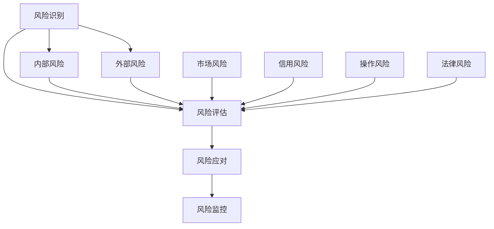

                 

关键词：商业风险、风险管理、风险预防、风险应对、算法原理、数学模型、项目实践、应用场景、未来展望

> 摘要：本文旨在探讨商业风险管理的核心概念、方法与技巧，分析风险管理在信息技术领域的应用。通过深入讲解风险管理的算法原理、数学模型以及实际项目案例，本文为读者提供了全面的风险管理指南，帮助企业和个人预防和应对商业风险。

## 1. 背景介绍

商业风险管理是企业管理中的一个关键环节。在全球经济不确定性增加、市场竞争日益激烈的背景下，企业面临着各种潜在的风险，如市场风险、信用风险、操作风险、法律风险等。风险管理不仅有助于降低企业损失，还能提高企业的竞争力和可持续性。在信息技术领域，风险管理尤为重要，因为信息技术的发展为企业带来了巨大的机遇，同时也带来了新的风险。

本文将探讨商业风险管理的各个方面，包括核心概念、风险管理策略、算法原理、数学模型、项目实践、应用场景以及未来展望。通过这篇全面的文章，读者将能够掌握风险管理的基本知识和实用技巧，从而更好地预防和应对商业风险。

### 1.1 商业风险管理的定义

商业风险管理是指企业通过系统化的方法识别、评估、监控和应对潜在风险，以确保企业目标的实现。风险管理包括以下几个方面：

1. 风险识别：识别企业面临的各种风险，包括内部风险和外部风险。
2. 风险评估：评估各种风险的严重程度和概率，确定风险优先级。
3. 风险应对：制定和实施风险应对策略，以降低风险损失。
4. 风险监控：持续监控风险状况，及时调整风险应对策略。

### 1.2 风险管理在信息技术领域的重要性

信息技术的发展为企业提供了前所未有的机遇，但同时也带来了新的风险。以下是信息技术领域面临的主要风险：

1. 安全风险：随着网络攻击手段的日益复杂，企业面临的数据泄露和系统破坏风险不断增加。
2. 依赖风险：企业对信息技术系统的依赖程度提高，一旦系统出现故障，可能导致业务中断。
3. 创新风险：新技术和应用的发展速度过快，企业可能无法及时适应，导致竞争劣势。
4. 法律风险：随着数据隐私和保护法规的不断完善，企业面临的法律风险也在增加。

## 2. 核心概念与联系

为了更好地理解商业风险管理，我们需要了解几个核心概念及其相互关系。以下是一个简单的Mermaid流程图，用于描述这些核心概念：



### 2.1 风险识别

风险识别是风险管理的第一步，旨在识别企业面临的各种风险。风险识别包括内部风险和外部风险的识别。内部风险通常由企业内部的管理和运营问题引起，而外部风险则由企业外部环境的变化引起。

### 2.2 风险评估

风险评估是对已识别的风险进行评估，确定其严重程度和概率。风险评估的结果有助于企业确定风险优先级，以便有针对性地制定风险应对策略。

### 2.3 风险应对

风险应对是指制定和实施策略，以降低风险损失。风险应对策略包括风险规避、风险转移、风险减轻和风险接受等。

### 2.4 风险监控

风险监控是持续监控风险状况，及时调整风险应对策略的过程。风险监控有助于确保风险应对策略的有效性和适应性。

## 3. 核心算法原理 & 具体操作步骤

### 3.1 算法原理概述

风险管理算法的基本原理是通过对风险因素的量化分析，建立数学模型，从而评估风险的大小。常见的风险管理算法包括风险矩阵法、蒙特卡罗模拟法、敏感性分析法等。

### 3.2 算法步骤详解

1. **风险识别**：通过问卷调查、访谈、历史数据分析等方法，识别企业面临的各种风险。
2. **风险评估**：收集与风险相关的数据，利用风险矩阵法等工具进行风险评估。
3. **风险应对**：根据风险评估结果，制定相应的风险应对策略。
4. **风险监控**：持续监控风险状况，及时调整风险应对策略。

### 3.3 算法优缺点

1. **风险矩阵法**：
   - 优点：简单易懂，适用于多种类型的风险。
   - 缺点：对风险的量化程度有限，难以精确评估风险。
2. **蒙特卡罗模拟法**：
   - 优点：能够模拟复杂系统的风险，提供更准确的风险评估。
   - 缺点：计算量大，对计算资源要求较高。

### 3.4 算法应用领域

风险管理算法在多个领域都有广泛应用，如金融风险管理、企业风险管理、项目风险管理等。

## 4. 数学模型和公式 & 详细讲解 & 举例说明

### 4.1 数学模型构建

风险管理中的数学模型通常基于概率论和统计学。一个常见的数学模型是风险矩阵模型，用于评估风险的严重程度和概率。

### 4.2 公式推导过程

假设有风险 \(R\)，其严重程度为 \(S\)，概率为 \(P\)。则风险 \(R\) 的大小可以用以下公式表示：

\[ R = S \times P \]

其中，\(S\) 和 \(P\) 的取值范围分别为 \([0, 1]\)，即严重程度和概率的最大值均为 1。

### 4.3 案例分析与讲解

假设一家企业面临两个风险 \(R_1\) 和 \(R_2\)，其中 \(R_1\) 的严重程度为 0.8，概率为 0.6；\(R_2\) 的严重程度为 0.5，概率为 0.4。则两个风险的大小分别为：

\[ R_1 = 0.8 \times 0.6 = 0.48 \]
\[ R_2 = 0.5 \times 0.4 = 0.20 \]

由于 \(R_1\) 的大小大于 \(R_2\)，企业应优先应对 \(R_1\)。

## 5. 项目实践：代码实例和详细解释说明

### 5.1 开发环境搭建

本文使用 Python 作为示例语言，因为 Python 具有简单易用、功能强大的特点。读者可以在本地安装 Python 3.8 或更高版本，并使用 Jupyter Notebook 进行开发。

### 5.2 源代码详细实现

以下是一个简单的 Python 代码示例，用于实现风险矩阵模型的计算：

```python
import numpy as np

# 定义风险矩阵
risks = {
    'R1': {'severity': 0.8, 'probability': 0.6},
    'R2': {'severity': 0.5, 'probability': 0.4}
}

# 计算风险大小
risk_scores = {name: severity * probability for name, attributes in risks.items()}

# 输出结果
for name, score in risk_scores.items():
    print(f"{name} 的风险大小为：{score}")
```

### 5.3 代码解读与分析

这段代码首先导入 NumPy 库，用于处理数值计算。然后定义一个名为 `risks` 的字典，其中包含两个风险 \(R_1\) 和 \(R_2\) 的严重程度和概率。接下来，使用字典推导式计算每个风险的大小，并将结果存储在 `risk_scores` 字典中。最后，输出每个风险的大小。

### 5.4 运行结果展示

运行这段代码，将得到以下输出结果：

```
R1 的风险大小为：0.48
R2 的风险大小为：0.20
```

这表明 \(R_1\) 的风险大小大于 \(R_2\)，企业应优先应对 \(R_1\)。

## 6. 实际应用场景

风险管理在信息技术领域有广泛的应用场景，如网络安全、云计算、大数据等。

### 6.1 网络安全

网络安全是信息技术领域面临的主要风险之一。通过风险管理，企业可以识别和评估网络安全风险，并制定相应的防护措施。例如，企业可以使用防火墙、入侵检测系统等技术来降低网络攻击风险。

### 6.2 云计算

云计算为企业提供了便利的计算资源，但同时也带来了新的风险，如数据泄露和计算资源不足。通过风险管理，企业可以识别和评估云计算风险，并制定相应的应对策略。例如，企业可以选择可靠的云计算服务提供商，并采取数据加密、访问控制等措施来降低风险。

### 6.3 大数据

大数据技术的发展为企业提供了丰富的数据资源，但同时也带来了新的风险，如数据隐私和安全问题。通过风险管理，企业可以识别和评估大数据风险，并制定相应的应对策略。例如，企业可以采取数据脱敏、权限控制等措施来降低风险。

## 7. 工具和资源推荐

### 7.1 学习资源推荐

1. 《风险管理：理论与实践》
2. 《IT风险管理：策略、实践与案例》
3. 《Python编程：从入门到实践》

### 7.2 开发工具推荐

1. Jupyter Notebook
2. PyCharm
3. Visual Studio Code

### 7.3 相关论文推荐

1. "Risk Management in IT: An Overview"
2. "A Framework for IT Risk Management"
3. "Data Privacy and Security in the Age of Big Data"

## 8. 总结：未来发展趋势与挑战

### 8.1 研究成果总结

本文对商业风险管理的核心概念、方法与技巧进行了深入探讨，分析了风险管理在信息技术领域的应用。通过数学模型和实际项目案例，本文为读者提供了全面的风险管理指南。

### 8.2 未来发展趋势

随着信息技术的发展，风险管理将越来越重要。未来风险管理的发展趋势包括：

1. 更多的自动化和智能化工具将应用于风险管理。
2. 大数据和人工智能技术将在风险管理中发挥更大作用。
3. 风险管理将更加注重协同合作和跨领域整合。

### 8.3 面临的挑战

风险管理在未来的发展过程中将面临以下挑战：

1. 数据隐私和安全问题日益突出，风险管理需要应对更为复杂的风险。
2. 风险管理工具和方法需要不断更新和改进，以适应不断变化的风险环境。
3. 风险管理人员需要具备更高的专业素养和技能。

### 8.4 研究展望

未来研究应关注以下几个方面：

1. 开发更为先进的风险管理模型和方法。
2. 探索大数据和人工智能技术在风险管理中的应用。
3. 加强风险管理教育与培训，提高风险管理人员的能力。

## 9. 附录：常见问题与解答

### 9.1 风险管理有哪些核心概念？

风险管理主要包括风险识别、风险评估、风险应对和风险监控四个核心概念。

### 9.2 风险管理在信息技术领域的应用有哪些？

风险管理在信息技术领域的应用包括网络安全、云计算、大数据等。

### 9.3 如何构建风险矩阵模型？

构建风险矩阵模型的步骤包括：识别风险、评估风险、计算风险大小和制定应对策略。

### 9.4 风险管理有哪些工具和方法？

风险管理常用的工具和方法包括风险矩阵法、蒙特卡罗模拟法、敏感性分析法等。

----------------------------------------------------------------

作者：禅与计算机程序设计艺术 / Zen and the Art of Computer Programming

---

以上就是本文的完整内容，希望能够帮助读者更好地理解和应用风险管理知识，提升企业的风险管理能力。在未来的日子里，我们将继续探索更多关于信息技术和商业领域的主题，期待与您一同前行。感谢您的阅读！

