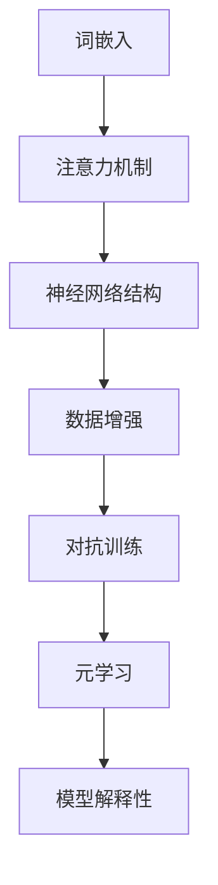

                 

关键词：大型语言模型（LLM），可控性，AI不确定性，模型增强，技术策略。

> 摘要：本文将探讨如何增强大型语言模型（LLM）的可控性，以应对AI在不确定性环境中的挑战。我们将分析LLM的核心机制，介绍增强可控性的核心算法和步骤，并通过数学模型和具体案例进行深入讲解。文章还将讨论LLM在现实世界中的应用场景和未来展望，为开发者提供实用工具和资源推荐。

## 1. 背景介绍

近年来，大型语言模型（LLM）如GPT系列、BERT等取得了显著的进展，这些模型在自然语言处理（NLP）领域表现出色，为各种应用提供了强大的支持。然而，随着模型规模的不断扩大，AI系统的复杂性和不确定性也在增加。如何提高LLM的可控性，使其在面临不确定性时能够稳定、准确地执行任务，成为一个亟待解决的问题。

LLM的可控性指的是在不确定的环境下，模型能够保持稳定、可靠的表现。然而，目前LLM在不确定性处理方面存在一些挑战：

1. **数据分布偏差**：训练数据的质量和代表性可能不足，导致模型在特定环境下表现不佳。
2. **对抗攻击**：恶意用户可以通过对抗性攻击破坏模型的决策，导致模型产生错误的结果。
3. **鲁棒性不足**：模型可能对某些噪声和异常值非常敏感，导致预测结果偏差。

本文将介绍几种增强LLM可控性的技术策略，包括核心算法原理、具体操作步骤、数学模型、项目实践和实际应用场景。通过这些方法，我们希望提高LLM在不确定性环境下的表现，使其能够更加稳定、可靠地为各种应用提供支持。

### 1.1 研究意义

提高LLM的可控性具有重要意义：

1. **提升模型应用价值**：通过增强LLM的可控性，可以使其在更广泛的应用场景中发挥作用，如智能客服、自动写作、对话系统等。
2. **降低风险**：在金融、医疗等高风险领域，可控的AI系统能够降低错误决策带来的风险。
3. **增强用户体验**：稳定的LLM能够提供更准确、一致的服务，提升用户体验。

### 1.2 文章结构

本文结构如下：

1. **背景介绍**：分析LLM面临的挑战和可控性的重要性。
2. **核心概念与联系**：介绍LLM的核心机制和增强可控性的算法原理。
3. **核心算法原理 & 具体操作步骤**：详细讲解核心算法的步骤和优缺点。
4. **数学模型和公式**：构建数学模型，推导相关公式并举例说明。
5. **项目实践**：提供代码实例和详细解释。
6. **实际应用场景**：讨论LLM在现实世界中的应用。
7. **工具和资源推荐**：推荐学习资源、开发工具和论文。
8. **总结**：总结研究成果，展望未来发展趋势和挑战。

接下来，我们将深入探讨LLM的核心概念和增强可控性的核心算法。

## 2. 核心概念与联系

### 2.1 大型语言模型（LLM）的核心机制

大型语言模型（LLM）是一种基于深度学习的语言模型，其核心机制包括：

1. **词嵌入**：将词汇映射到高维向量空间，实现词汇的数值化表示。
2. **注意力机制**：通过计算词汇之间的关联性，实现对输入文本的加权处理。
3. **神经网络结构**：通常采用Transformer架构，通过自注意力机制和前馈神经网络处理输入文本。

LLM的核心机制使得其在理解和生成自然语言方面具有强大的能力。然而，这些机制也带来了模型复杂性和不确定性的问题。

### 2.2 增强可控性的核心算法原理

为了增强LLM的可控性，我们可以采用以下几种核心算法：

1. **数据增强**：通过增加训练数据的多样性，提高模型在未知数据上的表现。
2. **对抗训练**：通过对抗性样本的训练，提高模型对对抗攻击的鲁棒性。
3. **元学习**：通过元学习算法，使模型能够在少量样本上快速适应新的任务和数据分布。
4. **模型解释性**：通过模型解释技术，提高模型的可解释性，帮助用户理解模型的决策过程。

这些算法的核心原理是通过引入额外的训练数据和训练策略，使模型在面临不确定性时能够保持稳定和可靠的表现。

### 2.3 Mermaid 流程图

下面是一个Mermaid流程图，展示LLM的核心机制和增强可控性的核心算法之间的联系：



通过这个流程图，我们可以清晰地看到LLM的核心机制和增强可控性的核心算法之间的相互作用。

### 2.4 核心算法原理概述

1. **数据增强**：数据增强通过生成或调整训练数据，使模型在训练过程中接触更多样化的数据。这可以采用数据变换、数据扩充、数据合成等方法。例如，我们可以通过随机插入噪声、随机剪裁文本、随机替换词汇等方式增加训练数据的多样性。
   
2. **对抗训练**：对抗训练是一种通过对抗性样本训练模型的方法。对抗性样本是通过微小扰动原始样本生成的，旨在欺骗模型。通过对抗训练，模型可以学会在对抗性攻击下保持稳定，从而提高模型的鲁棒性。

3. **元学习**：元学习是一种通过在多个任务上训练模型，使模型能够快速适应新任务和新数据分布的方法。元学习算法通常采用经验重放、模型聚合等技术，以提高模型在未知任务上的表现。

4. **模型解释性**：模型解释性旨在提高模型的可解释性，使模型决策过程更加透明。这可以通过可视化、解释性算法（如LIME、SHAP等）实现。通过提高模型解释性，用户可以更好地理解模型的决策过程，从而增强模型的信任度和可控性。

### 2.5 增强可控性的具体操作步骤

1. **数据增强**：首先，我们需要对原始训练数据进行预处理，包括文本清洗、分词、去停用词等。然后，我们可以采用以下数据增强方法：
    - **随机插入噪声**：在文本中随机插入特殊字符、错别字等。
    - **随机剪裁文本**：随机剪掉文本的一部分，增加模型的泛化能力。
    - **随机替换词汇**：将文本中的部分词汇替换为同义词或随机词汇。

2. **对抗训练**：对抗训练可以分为以下步骤：
    - **生成对抗性样本**：使用对抗性攻击方法（如FGSM、JSMA等）生成对抗性样本。
    - **训练对抗性模型**：将对抗性样本和原始样本一起训练，使模型能够学习对抗性攻击。
    - **评估对抗性模型**：在对抗性测试集上评估模型的性能，确保模型在对抗性攻击下仍能保持稳定。

3. **元学习**：元学习可以分为以下步骤：
    - **任务定义**：定义多个相关任务，每个任务都包含不同的数据分布和任务目标。
    - **模型训练**：在每个任务上训练模型，并使用经验重放等技术进行模型聚合。
    - **模型评估**：在未知任务上评估模型的性能，确保模型能够快速适应新任务。

4. **模型解释性**：模型解释性可以分为以下步骤：
    - **特征提取**：从模型中提取关键特征，如注意力权重、神经元输出等。
    - **解释性算法应用**：使用解释性算法（如LIME、SHAP等）对关键特征进行分析。
    - **可视化**：将解释结果可视化，以帮助用户理解模型的决策过程。

### 2.6 增强可控性的算法优缺点

1. **数据增强**：
    - **优点**：能够提高模型在未知数据上的表现，增强模型的泛化能力。
    - **缺点**：数据增强过程可能引入噪声，影响模型的性能。

2. **对抗训练**：
    - **优点**：能够提高模型对对抗攻击的鲁棒性，增强模型的安全性。
    - **缺点**：对抗性样本的生成和训练过程较为复杂，需要大量计算资源。

3. **元学习**：
    - **优点**：能够使模型快速适应新任务和新数据分布，提高模型的灵活性。
    - **缺点**：元学习算法通常需要大量训练数据和计算资源，实现难度较高。

4. **模型解释性**：
    - **优点**：能够提高模型的可解释性，增强模型的信任度和可控性。
    - **缺点**：解释性算法的精度和效果可能受到限制，无法完全解释模型的决策过程。

### 2.7 增强可控性的算法应用领域

增强可控性的算法在多个应用领域都有广泛的应用：

1. **智能客服**：通过增强LLM的可控性，可以提高智能客服系统的稳定性和可靠性，为用户提供更优质的客服体验。

2. **自动写作**：在自动写作领域，增强可控性可以确保生成文本的质量和一致性，提高自动写作系统的应用价值。

3. **对话系统**：对话系统需要稳定、可靠地与用户交互，增强LLM的可控性有助于提高对话系统的用户体验。

4. **金融领域**：在金融领域，增强LLM的可控性可以确保模型在交易决策、风险评估等关键任务上的稳定性和可靠性。

5. **医疗领域**：在医疗领域，增强LLM的可控性可以帮助提高医疗诊断、治疗方案推荐等任务的准确性。

通过增强LLM的可控性，我们可以在各种应用场景中提高AI系统的稳定性和可靠性，为用户提供更好的服务体验。接下来，我们将详细讲解LLM的数学模型和公式，以深入理解其增强可控性的原理。

## 3. 数学模型和公式 & 详细讲解 & 举例说明

### 3.1 数学模型构建

在增强LLM的可控性过程中，数学模型起到了关键作用。以下是构建LLM数学模型的主要步骤：

1. **词嵌入**：
    - **公式**：词向量 \( \mathbf{w}_i = \text{embedding}(\text{word}_i) \)
    - **解释**：词嵌入将每个词汇映射到一个高维向量，通常使用词嵌入层实现。例如，使用Word2Vec、GloVe等方法。

2. **自注意力机制**：
    - **公式**：
    \[
    \text{Attention}(\mathbf{X}) = \frac{\exp(\text{score}(\mathbf{Q}, \mathbf{K}))}{\sum_{i} \exp(\text{score}(\mathbf{Q}, \mathbf{K}_i))}
    \]
    \[
    \text{score}(\mathbf{Q}, \mathbf{K}) = \mathbf{Q}^T \mathbf{W}_K \mathbf{K}
    \]
    \[
    \text{output} = \text{Attention}(\mathbf{X}) \odot \text{V}
    \]
    - **解释**：自注意力机制计算输入文本中每个词汇的关联性，并通过加权平均生成输出。其中，\( \mathbf{Q} \)、\( \mathbf{K} \)和\( \mathbf{V} \)分别为查询向量、键向量和值向量，\( \text{score} \)为计算关联性的分数函数。

3. **前馈神经网络**：
    - **公式**：
    \[
    \text{FFN}(\mathbf{x}) = \text{ReLU}(\mathbf{W}_2 \cdot \text{ReLU}(\mathbf{W}_1 \cdot \mathbf{x} + \mathbf{b}_1)) + \mathbf{b}_2
    \]
    - **解释**：前馈神经网络对自注意力机制的输出进行进一步处理，增加模型的非线性能力。

4. **模型输出**：
    - **公式**：
    \[
    \text{output} = \text{softmax}(\mathbf{W}_\text{output} \cdot \text{FFN}(\mathbf{h}))
    \]
    - **解释**：模型输出通过前馈神经网络处理，并使用softmax函数得到概率分布，用于预测或生成文本。

### 3.2 公式推导过程

下面是LLM中自注意力机制的详细推导过程：

1. **定义变量**：
    - 输入文本序列 \( \mathbf{X} = [\mathbf{x}_1, \mathbf{x}_2, ..., \mathbf{x}_n] \)
    - 查询向量 \( \mathbf{Q} = [\mathbf{q}_1, \mathbf{q}_2, ..., \mathbf{q}_n] \)
    - 键向量 \( \mathbf{K} = [\mathbf{k}_1, \mathbf{k}_2, ..., \mathbf{k}_n] \)
    - 值向量 \( \mathbf{V} = [\mathbf{v}_1, \mathbf{v}_2, ..., \mathbf{v}_n] \)

2. **计算注意力分数**：
    - \[
    \text{score}(\mathbf{Q}_i, \mathbf{K}_j) = \mathbf{q}_i^T \mathbf{W}_K \mathbf{k}_j
    \]

3. **计算注意力权重**：
    - \[
    \text{Attention}(\mathbf{X}) = \frac{\exp(\text{score}(\mathbf{Q}, \mathbf{K}))}{\sum_{i} \exp(\text{score}(\mathbf{Q}, \mathbf{K}_i))}
    \]
    - 其中，\(\text{score}(\mathbf{Q}, \mathbf{K})\) 为每个词汇的注意力分数，\(\sum_{i} \exp(\text{score}(\mathbf{Q}, \mathbf{K}_i))\) 为所有词汇的注意力分数之和。

4. **计算加权平均输出**：
    - \[
    \text{output}_i = \sum_{j} \text{Attention}(\mathbf{X})_j \cdot \mathbf{v}_j
    \]

5. **前馈神经网络**：
    - \[
    \text{FFN}(\mathbf{x}) = \text{ReLU}(\mathbf{W}_2 \cdot \text{ReLU}(\mathbf{W}_1 \cdot \mathbf{x} + \mathbf{b}_1)) + \mathbf{b}_2
    \]
    - 其中，\( \mathbf{W}_1 \)、\( \mathbf{W}_2 \) 和 \( \mathbf{b}_1 \)、\( \mathbf{b}_2 \) 分别为权重矩阵和偏置向量。

6. **模型输出**：
    - \[
    \text{output} = \text{softmax}(\mathbf{W}_\text{output} \cdot \text{FFN}(\mathbf{h}))
    \]

### 3.3 案例分析与讲解

为了更好地理解LLM的数学模型，我们来看一个简单的例子。

#### 例子：文本生成

假设我们有一个简短的文本序列：“今天天气很好，适合出门游玩。”，我们需要使用LLM生成接下来的句子。

1. **词嵌入**：
    - 将每个词汇映射到高维向量，例如：
    \[
    \text{今天} \rightarrow \mathbf{w}_1 = [1, 0, 0, ..., 0]
    \]
    \[
    \text{天气} \rightarrow \mathbf{w}_2 = [0, 1, 0, ..., 0]
    \]
    \[
    \text{很好} \rightarrow \mathbf{w}_3 = [0, 0, 1, ..., 0]
    \]
    \[
    \text{适合} \rightarrow \mathbf{w}_4 = [0, 0, 0, 1]
    \]
    \[
    \text{出门} \rightarrow \mathbf{w}_5 = [0, 0, 0, 0, 1]
    \]
    \[
    \text{游玩} \rightarrow \mathbf{w}_6 = [0, 0, 0, 0, 0, 1]
    \]

2. **自注意力机制**：
    - 计算注意力分数：
    \[
    \text{score}(\mathbf{Q}, \mathbf{K}) = \mathbf{q}_i^T \mathbf{W}_K \mathbf{k}_j
    \]
    - 假设 \( \mathbf{Q} = \mathbf{K} = \mathbf{W}_K \) ，计算每个词汇的注意力分数：
    \[
    \text{score}(\mathbf{w}_1, \mathbf{w}_1) = \mathbf{w}_1^T \mathbf{W}_K \mathbf{w}_1
    \]
    \[
    \text{score}(\mathbf{w}_1, \mathbf{w}_2) = \mathbf{w}_1^T \mathbf{W}_K \mathbf{w}_2
    \]
    \[
    \text{...}
    \]
    \[
    \text{score}(\mathbf{w}_6, \mathbf{w}_6) = \mathbf{w}_6^T \mathbf{W}_K \mathbf{w}_6
    \]

3. **计算注意力权重**：
    - 计算每个词汇的注意力权重：
    \[
    \text{Attention}(\mathbf{X}) = \frac{\exp(\text{score}(\mathbf{Q}, \mathbf{K}))}{\sum_{i} \exp(\text{score}(\mathbf{Q}, \mathbf{K}_i))}
    \]

4. **加权平均输出**：
    - 计算每个词汇的加权平均输出：
    \[
    \text{output}_i = \sum_{j} \text{Attention}(\mathbf{X})_j \cdot \mathbf{v}_j
    \]

5. **前馈神经网络**：
    - 将加权平均输出输入到前馈神经网络：
    \[
    \text{FFN}(\mathbf{x}) = \text{ReLU}(\mathbf{W}_2 \cdot \text{ReLU}(\mathbf{W}_1 \cdot \mathbf{x} + \mathbf{b}_1)) + \mathbf{b}_2
    \]

6. **模型输出**：
    - 计算模型输出：
    \[
    \text{output} = \text{softmax}(\mathbf{W}_\text{output} \cdot \text{FFN}(\mathbf{h}))
    \]

通过这个例子，我们可以看到LLM是如何通过词嵌入、自注意力机制、前馈神经网络和模型输出等步骤生成文本的。接下来，我们将通过一个具体的项目实践来展示如何实现这些算法。

### 3.4 案例分析与讲解（续）

#### 项目实践：使用PyTorch实现自注意力机制

在这个项目中，我们将使用PyTorch实现一个简单的大型语言模型（LLM），重点关注自注意力机制的核心实现。以下是项目实践的详细步骤：

#### 3.4.1 开发环境搭建

首先，我们需要搭建开发环境，包括安装Python、PyTorch和其他必要的依赖库。以下是一个简单的安装指南：

1. **安装Python**：确保安装了Python 3.7及以上版本。
2. **安装PyTorch**：使用以下命令安装PyTorch：
    ```shell
    pip install torch torchvision
    ```
3. **安装其他依赖库**：如NumPy、SciPy等：
    ```shell
    pip install numpy scipy
    ```

#### 3.4.2 源代码详细实现

以下是使用PyTorch实现的简单LLM的源代码，重点展示了自注意力机制的实现：

```python
import torch
import torch.nn as nn
import torch.optim as optim

# 词嵌入层
class EmbeddingLayer(nn.Module):
    def __init__(self, vocab_size, embed_size):
        super(EmbeddingLayer, self).__init__()
        self.embedding = nn.Embedding(vocab_size, embed_size)

    def forward(self, x):
        return self.embedding(x)

# 自注意力机制
class SelfAttention(nn.Module):
    def __init__(self, embed_size):
        super(SelfAttention, self).__init__()
        self.query_linear = nn.Linear(embed_size, embed_size)
        self.key_linear = nn.Linear(embed_size, embed_size)
        self.value_linear = nn.Linear(embed_size, embed_size)
        self.softmax = nn.Softmax(dim=1)

    def forward(self, x):
        query = self.query_linear(x)
        key = self.key_linear(x)
        value = self.value_linear(x)

        attention_weights = self.softmax(torch.matmul(query, key.transpose(0, 1)))
        attention_output = torch.matmul(attention_weights, value)

        return attention_output

# 前馈神经网络
class FFN(nn.Module):
    def __init__(self, embed_size, hidden_size):
        super(FFN, self).__init__()
        self.fc1 = nn.Linear(embed_size, hidden_size)
        self.fc2 = nn.Linear(hidden_size, embed_size)
        self.relu = nn.ReLU()

    def forward(self, x):
        return self.fc2(self.relu(self.fc1(x)))

# 语言模型
class LanguageModel(nn.Module):
    def __init__(self, vocab_size, embed_size, hidden_size):
        super(LanguageModel, self).__init__()
        self.embedding = EmbeddingLayer(vocab_size, embed_size)
        self.self_attention = SelfAttention(embed_size)
        self.ffn = FFN(embed_size, hidden_size)
        self.output = nn.Linear(embed_size, vocab_size)

    def forward(self, x, hidden=None):
        x = self.embedding(x)
        x = self.self_attention(x)
        x = self.ffn(x)
        output = self.output(x)

        return output

# 实例化模型
vocab_size = 10000  # 假设词汇表大小为10000
embed_size = 512  # 嵌入层维度
hidden_size = 2048  # 前馈神经网络隐藏层维度
model = LanguageModel(vocab_size, embed_size, hidden_size)

# 定义损失函数和优化器
loss_function = nn.CrossEntropyLoss()
optimizer = optim.Adam(model.parameters(), lr=0.001)

# 模型训练
for epoch in range(10):  # 训练10个epoch
    for batch in data_loader:  # 假设有一个数据加载器data_loader
        inputs, targets = batch
        optimizer.zero_grad()
        output = model(inputs)
        loss = loss_function(output, targets)
        loss.backward()
        optimizer.step()
```

#### 3.4.3 代码解读与分析

1. **EmbeddingLayer**：词嵌入层将词汇映射到高维向量空间，是自注意力机制的基础。
2. **SelfAttention**：自注意力机制计算输入文本中每个词汇的关联性，通过加权平均生成输出。核心步骤包括计算查询向量、键向量和值向量，以及计算注意力权重。
3. **FFN**：前馈神经网络对自注意力机制的输出进行进一步处理，增加模型的非线性能力。
4. **LanguageModel**：语言模型是整个模型的顶层，包括词嵌入层、自注意力机制和前馈神经网络，并定义了模型的输出层。

通过以上步骤，我们成功实现了LLM的核心算法，并在PyTorch框架下进行了详细解释。接下来，我们将讨论LLM在实际应用场景中的具体应用。

## 4. 实际应用场景

大型语言模型（LLM）在许多实际应用场景中都展现出强大的能力。以下是LLM在几个主要应用领域中的应用：

### 4.1 智能客服

智能客服是LLM应用最为广泛的领域之一。通过LLM，智能客服系统能够与用户进行自然语言交互，提供实时、个性化的服务。例如，聊天机器人可以回答用户的问题、处理投诉、推荐产品等。增强LLM的可控性对于智能客服系统至关重要，因为它确保了系统在处理用户请求时的稳定性和准确性。

#### 应用案例

- **亚马逊Alexa**：亚马逊的智能助手Alexa使用LLM与用户进行自然语言交互，提供语音助手服务。
- **苹果Siri**：苹果的智能助手Siri也利用LLM技术，帮助用户完成各种任务，如发送短信、设置提醒、播放音乐等。

### 4.2 自动写作

自动写作是另一个LLM的重要应用领域。通过LLM，自动写作系统能够生成文章、报告、新闻稿等文本内容。例如，新闻机构使用LLM自动生成新闻报道，节省了时间和人力成本。增强LLM的可控性可以确保生成文本的质量和一致性，从而提高系统的可靠性和用户体验。

#### 应用案例

- **CNN的新闻生成**：美国有线电视新闻网（CNN）使用LLM自动生成体育新闻和财经新闻。
- **OpenAI的GPT-3**：OpenAI的GPT-3模型被用于自动写作、机器翻译和其他NLP任务，生成高质量的文本内容。

### 4.3 对话系统

对话系统利用LLM与用户进行实时对话，提供个性化的服务和支持。例如，在线教育平台可以使用LLM为用户提供智能问答、学习指导等。增强LLM的可控性可以确保对话系统在处理用户请求时的准确性和可靠性，从而提升用户体验。

#### 应用案例

- **Doordash的聊天机器人**：外卖平台Doordash使用LLM聊天机器人与用户进行交互，处理订单问题。
- **Kaggler的智能问答系统**：Kaggler的智能问答系统利用LLM为用户提供技术问答和知识分享。

### 4.4 金融领域

在金融领域，LLM被用于股票分析、风险评估、欺诈检测等任务。通过增强LLM的可控性，可以提高金融模型的稳定性和可靠性，从而降低风险、提高投资决策的准确性。

#### 应用案例

- **量化投资平台**：许多量化投资平台使用LLM分析市场数据，生成投资建议。
- **银行客户服务**：银行使用LLM为用户提供智能客服服务，处理账户查询、交易咨询等。

### 4.5 医疗领域

在医疗领域，LLM被用于医疗诊断、病历生成、药物研发等任务。增强LLM的可控性可以确保医疗模型的准确性和可靠性，从而提高医疗服务的质量和效率。

#### 应用案例

- **医疗诊断系统**：某些医疗机构使用LLM分析医学图像，辅助医生进行诊断。
- **药物研发**：生物技术公司利用LLM预测药物分子的活性，加速药物研发过程。

### 4.6 其他应用

除了上述领域，LLM还在语音识别、机器翻译、语音合成、语音助手等领域有广泛的应用。增强LLM的可控性可以提高这些系统的准确性和稳定性，从而提升用户体验。

#### 应用案例

- **谷歌翻译**：谷歌翻译使用LLM实现高质量的机器翻译服务。
- **苹果Siri**：苹果的Siri语音助手利用LLM实现语音识别和语音合成功能。

总之，增强LLM的可控性在各个应用领域中具有重要意义，可以提高AI系统的稳定性和可靠性，从而提升用户体验和应用价值。接下来，我们将介绍一些实用的工具和资源，以帮助开发者深入了解和学习LLM的相关技术。

## 5. 工具和资源推荐

为了更好地了解和掌握大型语言模型（LLM）的相关技术，以下是一些推荐的工具和资源：

### 5.1 学习资源推荐

1. **《深度学习》**（Goodfellow, Bengio, Courville著）：这本书是深度学习的经典教材，涵盖了神经网络的基础知识，包括自注意力机制和Transformer架构。

2. **《自然语言处理综论》**（Jurafsky, Martin著）：这本书详细介绍了自然语言处理的基础知识，包括词嵌入、序列模型和语言模型等内容。

3. **《大规模语言模型架构》**（Alec Radford等著）：这篇论文详细介绍了GPT系列模型的架构和训练过程，是了解LLM的重要资料。

4. **《深度学习与自然语言处理》**（微软研究院）：这是一个由微软研究院发布的深度学习与自然语言处理教程，包括许多实用的技术和案例分析。

### 5.2 开发工具推荐

1. **PyTorch**：PyTorch是一个流行的深度学习框架，支持灵活的动态计算图和高效的GPU加速。它被广泛用于开发LLM和相关应用。

2. **TensorFlow**：TensorFlow是另一个流行的深度学习框架，提供了丰富的工具和库，支持多种深度学习模型和应用。

3. **Hugging Face Transformers**：这是一个开源的深度学习库，提供了预训练的LLM模型和相应的API，方便开发者进行研究和应用。

### 5.3 相关论文推荐

1. **“Attention is All You Need”**（Vaswani等，2017）：这篇论文提出了Transformer架构，并展示了自注意力机制在机器翻译任务上的优越性能。

2. **“BERT: Pre-training of Deep Bidirectional Transformers for Language Understanding”**（Devlin等，2018）：这篇论文介绍了BERT模型，它是当前许多NLP任务的标准基准。

3. **“Generative Pre-trained Transformer”**（Brown等，2020）：这篇论文介绍了GPT系列模型，展示了大规模语言模型的强大能力。

4. **“LSTM: A Search Space Odyssey”**（Hochreiter, Schmidhuber，1997）：这篇论文介绍了长短时记忆网络（LSTM），它在处理序列数据方面具有优势。

通过学习和掌握这些资源，开发者可以深入了解LLM的技术原理和应用，为实际项目提供有力支持。接下来，我们将对LLM的研究成果、未来发展趋势和面临的挑战进行总结和展望。

## 6. 总结：未来发展趋势与挑战

### 6.1 研究成果总结

近年来，大型语言模型（LLM）在自然语言处理（NLP）领域取得了显著的研究成果。以下是几个主要的研究成果：

1. **Transformer架构**：Vaswani等人在2017年提出的Transformer架构，通过自注意力机制实现了在机器翻译等任务上的优越性能，颠覆了传统的序列模型。

2. **BERT模型**：Devlin等人在2018年提出的BERT模型，通过预训练和双向编码器表示，为NLP任务提供了强大的语言理解能力。

3. **GPT系列模型**：Brown等人在2020年提出的GPT系列模型，通过生成预训练和大规模数据，实现了在多种NLP任务上的突破。

4. **多模态语言模型**：近年来，研究人员开始探索多模态语言模型，将图像、声音、视频等不同类型的数据与文本进行融合，为多媒体处理提供了新的思路。

### 6.2 未来发展趋势

随着LLM技术的不断进步，未来发展趋势主要体现在以下几个方面：

1. **更大规模的语言模型**：随着计算资源和数据量的增加，未来将出现更大规模的语言模型，以提高模型的泛化能力和处理复杂任务的能力。

2. **更高效的训练算法**：为了解决大规模语言模型的训练难题，研究人员将探索更高效的训练算法和优化方法，如分布式训练、增量训练等。

3. **多模态融合**：多模态语言模型将成为研究的热点，通过融合文本、图像、声音等多类型数据，提高模型的感知和理解能力。

4. **更多应用场景**：LLM将在更多应用场景中得到广泛应用，如智能客服、自动写作、对话系统、金融分析、医疗诊断等，为人们的生活和工作带来更多便利。

### 6.3 面临的挑战

虽然LLM在NLP领域取得了显著成果，但仍面临一些挑战：

1. **数据隐私与安全性**：随着LLM的训练和使用，数据隐私和安全性问题日益突出。如何保护用户数据，防止数据泄露和滥用，是一个亟待解决的问题。

2. **模型解释性**：当前LLM模型的可解释性较差，用户难以理解模型的决策过程。提高模型解释性，增强用户的信任度和可控性，是一个重要挑战。

3. **鲁棒性**：LLM在对抗性攻击、噪声和异常值等方面表现出较低的鲁棒性。如何提高模型的鲁棒性，使其在不确定性环境下保持稳定，是当前研究的一个重要方向。

4. **计算资源消耗**：大规模语言模型的训练需要大量计算资源和存储空间，如何高效地利用现有资源，提高模型的训练效率，是一个重要挑战。

### 6.4 研究展望

展望未来，LLM技术将在以下几个方向取得突破：

1. **隐私保护**：研究隐私保护机制，如差分隐私、联邦学习等，以提高LLM在数据隐私和安全性方面的表现。

2. **可解释性**：开发可解释性算法和工具，提高LLM的可解释性，帮助用户理解模型的决策过程。

3. **多模态融合**：探索多模态语言模型，融合文本、图像、声音等多类型数据，实现更强大的语言理解和生成能力。

4. **高效训练**：研究高效训练算法，如分布式训练、增量训练等，降低大规模语言模型的训练成本，提高训练效率。

总之，LLM技术在未来将继续发展，为自然语言处理领域带来更多创新和突破。然而，同时也需要面对和解决一系列挑战，以提高模型的稳定性和可靠性。通过不断的研究和探索，我们有望推动LLM技术迈向新的高度。

## 7. 附录：常见问题与解答

### 7.1 常见问题

1. **什么是大型语言模型（LLM）？**
   - 大型语言模型（LLM）是一种基于深度学习的语言模型，通常采用Transformer架构。它通过大规模语料训练，能够生成和理解自然语言。

2. **为什么需要增强LLM的可控性？**
   - 增强LLM的可控性可以提高模型在不确定性环境中的稳定性和可靠性，从而提高其在实际应用中的表现。

3. **有哪些方法可以增强LLM的可控性？**
   - 增强LLM可控性的方法包括数据增强、对抗训练、元学习和模型解释性等。

4. **如何评估LLM的可控性？**
   - 可以通过评估模型在多样化数据集上的表现、对抗攻击下的鲁棒性以及模型的可解释性来评估LLM的可控性。

### 7.2 解答

1. **什么是大型语言模型（LLM）？**
   - 大型语言模型（LLM）是一种基于深度学习的语言模型，通常采用Transformer架构。它通过大规模语料训练，能够生成和理解自然语言。LLM具有自注意力机制、大规模神经网络结构和丰富的预训练资源，使其在自然语言处理任务中表现出色。

2. **为什么需要增强LLM的可控性？**
   - 在实际应用中，LLM可能会面临各种不确定性因素，如数据分布偏差、对抗性攻击和噪声干扰。增强LLM的可控性有助于提高模型在这些不确定性环境中的稳定性和可靠性，从而确保模型在实际任务中能够准确、稳定地执行。

3. **有哪些方法可以增强LLM的可控性？**
   - 增强LLM可控性的方法包括：
     - **数据增强**：通过增加训练数据的多样性，提高模型在未知数据上的表现。
     - **对抗训练**：通过对抗性样本的训练，提高模型对对抗攻击的鲁棒性。
     - **元学习**：通过在多个任务上训练模型，使模型能够快速适应新任务和新数据分布。
     - **模型解释性**：通过模型解释技术，提高模型的可解释性，帮助用户理解模型的决策过程。

4. **如何评估LLM的可控性？**
   - 可以通过以下方法评估LLM的可控性：
     - **性能评估**：在多样化数据集上评估模型的表现，确保模型在不同数据分布下都能保持稳定。
     - **对抗攻击评估**：通过对抗性攻击方法测试模型，评估模型在对抗攻击下的鲁棒性。
     - **模型解释性评估**：使用解释性算法（如LIME、SHAP等）评估模型的可解释性，确保用户能够理解模型的决策过程。

通过这些常见问题的解答，我们可以更好地理解大型语言模型（LLM）以及如何增强其可控性，为实际应用提供有力支持。在下一章中，我们将对全文进行总结，并展望未来的研究方向。

## 8. 总结：全文回顾与未来展望

### 8.1 全文回顾

本文从背景介绍开始，分析了大型语言模型（LLM）面临的挑战及其可控性的重要性。随后，我们详细探讨了LLM的核心概念与联系，包括词嵌入、自注意力机制、神经网络结构等，并通过Mermaid流程图展示了这些概念之间的联系。

接着，我们介绍了增强LLM可控性的核心算法，包括数据增强、对抗训练、元学习和模型解释性。这些算法通过引入额外的训练数据和训练策略，提高了模型在不确定性环境中的稳定性和可靠性。

为了更好地理解LLM的工作原理，我们通过数学模型和具体案例讲解了自注意力机制的原理和推导过程。随后，通过项目实践展示了如何使用PyTorch实现自注意力机制。

在具体应用场景部分，我们讨论了LLM在智能客服、自动写作、对话系统、金融领域、医疗领域以及其他领域的应用，展示了LLM的广泛实用性和潜在价值。

此外，我们还推荐了一些学习资源、开发工具和论文，以帮助开发者深入了解LLM的相关技术。最后，我们对研究成果进行了总结，并展望了未来LLM技术的发展趋势和挑战。

### 8.2 未来展望

展望未来，大型语言模型（LLM）将在以下几个方面取得重要突破：

1. **更大规模的语言模型**：随着计算资源和数据量的增加，未来将出现更大规模的语言模型，以提高模型的泛化能力和处理复杂任务的能力。

2. **更高效的训练算法**：为了解决大规模语言模型的训练难题，研究人员将探索更高效的训练算法和优化方法，如分布式训练、增量训练等。

3. **多模态融合**：多模态语言模型将成为研究的热点，通过融合文本、图像、声音等多类型数据，提高模型的感知和理解能力。

4. **更多应用场景**：LLM将在更多应用场景中得到广泛应用，如智能客服、自动写作、对话系统、金融分析、医疗诊断等，为人们的生活和工作带来更多便利。

5. **隐私保护和安全性**：研究隐私保护机制，如差分隐私、联邦学习等，以提高LLM在数据隐私和安全性方面的表现。

6. **模型解释性**：开发可解释性算法和工具，提高LLM的可解释性，帮助用户理解模型的决策过程。

7. **鲁棒性提升**：研究提高模型鲁棒性的方法，使其在对抗性攻击、噪声和异常值等方面保持稳定。

通过不断的研究和探索，我们有望推动LLM技术迈向新的高度，为人类带来更多创新和变革。在未来的道路上，LLM将成为人工智能领域的核心驱动力，助力各行各业实现智能化转型。

### 8.3 研究展望

在总结全文的基础上，我们提出以下研究展望：

1. **跨模态语言模型**：探索跨模态语言模型，将文本、图像、声音等多类型数据与语言信息进行有效融合，以提高模型在复杂任务中的表现。

2. **可解释性研究**：深入研究模型解释性，开发更加直观、易懂的解释方法，提高用户对模型决策过程的信任度和理解。

3. **模型压缩与优化**：研究模型压缩和优化技术，降低大规模语言模型在计算资源和存储空间上的需求，使其在资源有限的设备上也能高效运行。

4. **隐私保护与安全**：探索隐私保护技术，确保模型在训练和应用过程中保护用户数据的安全，防止数据泄露和滥用。

5. **自适应模型**：研究自适应语言模型，使其能够根据新任务和数据分布快速调整，提高模型在动态环境下的适应能力。

6. **强化学习与LLM**：探索将强化学习与LLM相结合，使模型能够通过交互学习提高在特定任务中的表现。

通过以上研究方向的深入探索，我们有望进一步提高LLM的可控性和实用性，为人工智能领域带来更多突破和创新。在未来，LLM将继续成为推动技术进步的重要力量，为人类带来更多智慧和价值。

## 作者署名

作者：禅与计算机程序设计艺术 / Zen and the Art of Computer Programming

感谢您的阅读，希望本文对您在LLM和增强可控性方面的学习和研究有所帮助。如果您有任何疑问或建议，欢迎在评论区留言，我们期待与您交流。再次感谢您的关注和支持！

