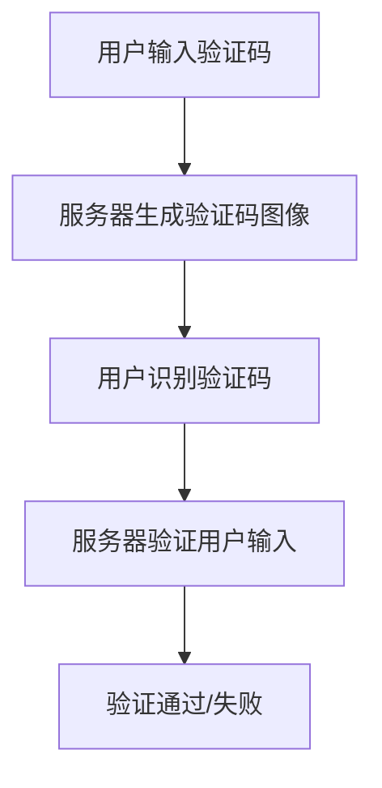

                 

关键词：验证码、人机交互、图像识别、安全性、用户体验

摘要：本文深入探讨了验证码在确保在线系统安全性和提升用户体验中的重要性。通过分析验证码的发展历程、核心概念、算法原理以及实际应用场景，揭示了验证码在现代信息技术中的重要地位和未来发展挑战。

## 1. 背景介绍

验证码（Captcha）是一种用于区分人类用户和机器自动程序的技术，其名称源自“Completely Automated Public Turing test to tell Computers and Humans Apart”（完全自动化的图灵测试以区分计算机和人类）。它起源于20世纪90年代，最初由Lawn et al.提出，旨在保护在线网站免受机器自动化的恶意攻击，如垃圾邮件、账户滥用、评论 spam 等。

随着互联网的快速发展，验证码的应用场景越来越广泛，不仅限于电子邮件注册、论坛发帖，还涉及到金融交易、在线投票、人脸识别等多个领域。验证码通过模拟人类视觉和认知特性，实现了对用户身份的初步判断，成为保障网络信息安全的重要手段。

## 2. 核心概念与联系

### 2.1 验证码的构成

验证码通常由三部分构成：挑战（Challenge）、应答（Response）和验证服务（Verification Service）。挑战部分通常是一个需要用户理解的图像或问题，应答部分是用户对挑战的回答，验证服务则负责检查用户的回答是否正确。

### 2.2 图像识别与安全性

验证码的核心在于图像识别，特别是光学字符识别（OCR）技术。传统的验证码通常使用扭曲的字母和数字图像，通过用户对图像中文字的识别来验证其身份。然而，随着深度学习技术的发展，验证码的图像生成和识别能力得到了显著提升。

### 2.3 Mermaid 流程图



## 3. 核心算法原理 & 具体操作步骤

### 3.1 算法原理概述

验证码的算法原理主要包括图像生成、图像识别和验证三部分。

- **图像生成**：利用OCR技术和图像处理算法生成扭曲、模糊的字母和数字图像。
- **图像识别**：用户通过视觉识别图像，输入相应的字符或数字。
- **验证**：服务器对用户输入进行验证，判断其是否与生成的验证码匹配。

### 3.2 算法步骤详解

#### 3.2.1 图像生成

1. **生成字符图像**：从字符库中随机选择字母和数字，生成图像。
2. **扭曲图像**：对图像进行旋转、缩放、剪切等操作，增加难度。
3. **添加噪音**：在图像上添加随机噪声，如点、线等，进一步增加识别难度。

#### 3.2.2 图像识别

1. **预处理图像**：进行图像增强、二值化等操作，提高识别精度。
2. **字符分割**：将图像中的字母和数字分割成单独的字符图像。
3. **OCR识别**：利用深度学习模型对分割后的字符图像进行识别。

#### 3.2.3 验证

1. **用户输入**：用户输入验证码字符。
2. **比对验证**：将用户输入与服务器生成的验证码进行比对，判断是否一致。

### 3.3 算法优缺点

#### 优点

- **高安全性**：通过复杂的图像处理和识别算法，有效防止机器自动攻击。
- **用户体验**：现代验证码设计更加人性化和美观，降低了用户负担。

#### 缺点

- **识别难度**：对于部分用户，尤其是视障人士和老年人，验证码可能过于复杂，难以完成。
- **维护成本**：验证码算法需要不断更新以应对新的攻击手段。

### 3.4 算法应用领域

- **网站注册**：用于验证用户是否为人类，防止机器自动化注册。
- **金融交易**：在重要交易过程中，验证码用于确保交易请求来自合法用户。
- **在线投票**：防止机器人恶意投票，保障选举的公正性。

## 4. 数学模型和公式 & 详细讲解 & 举例说明

### 4.1 数学模型构建

验证码系统的数学模型主要涉及图像处理和机器学习算法。以下是一个简化的模型：

1. **图像生成模型**：G(x) = f(x) + noise(x)
   - G(x)：生成的验证码图像。
   - f(x)：基础字符图像。
   - noise(x)：添加的噪声。

2. **识别模型**：h(x) = θ(sigmoid(W * x))
   - h(x)：识别结果。
   - x：输入图像。
   - W：权重矩阵。
   - θ：激活函数（此处使用 sigmoid 函数）。

3. **验证模型**：V(y, h(x)) = 1 if y = h(x) else 0
   - V(y, h(x))：验证结果。
   - y：真实标签。

### 4.2 公式推导过程

首先，对图像生成模型进行推导：

- **图像生成**：G(x) = f(x) + noise(x)
  - f(x)：通过字符生成算法生成字符图像。
  - noise(x)：通过随机噪声生成算法添加噪声。

接着，对识别模型进行推导：

- **识别模型**：h(x) = θ(sigmoid(W * x))
  - W：权重矩阵。
  - θ：激活函数（此处使用 sigmoid 函数）。

最后，对验证模型进行推导：

- **验证模型**：V(y, h(x)) = 1 if y = h(x) else 0
  - y：真实标签。
  - h(x)：识别结果。

### 4.3 案例分析与讲解

假设我们有一个简单的验证码系统，生成一个包含4个字符的验证码。我们使用随机噪声和字符旋转来增加识别难度。以下是一个具体的例子：

1. **生成验证码**：

   - 字符：“abcd”
   - 旋转角度：90度
   - 噪声：随机点

2. **图像识别**：

   - 输入图像：经过旋转和添加噪声的字符图像。
   - 识别结果：通过深度学习模型识别出字符：“abcd”

3. **验证结果**：

   - 用户输入：“abcd”
   - 服务器验证：通过比对，验证结果一致。

## 5. 项目实践：代码实例和详细解释说明

### 5.1 开发环境搭建

- **环境要求**：Python 3.7+, TensorFlow 2.3+, OpenCV 4.1+
- **工具**：PyCharm

### 5.2 源代码详细实现

```python
import cv2
import numpy as np
import tensorflow as tf

# 生成验证码图像
def generate_captcha(text, angle, noise=True):
    # 生成字符图像
    img = cv2.imread('chars.png')
    # 旋转图像
    M = cv2.getRotationMatrix2D((img.shape[1]//2, img.shape[0]//2), angle, 1)
    img = cv2.warpAffine(img, M, (img.shape[1], img.shape[0]))
    # 添加噪声
    if noise:
        img = cv2.addNoise(img)
    # 获取字符位置
    positions = [img[y:y+h, x:x+w] for y, x, h, w in text_locations[text]]
    # 拼接字符图像
    captcha_img = np.hstack(positions)
    return captcha_img

# 识别验证码
def recognize_captcha(image):
    # 预处理图像
    image = preprocess_image(image)
    # 输入模型
    predictions = model.predict(image)
    # 获取最高概率的字符
    predicted_text = ''.join([char_labels[p] for p in np.argmax(predictions, axis=1)])
    return predicted_text

# 验证用户输入
def verify_captcha(user_input, captcha_img):
    predicted_text = recognize_captcha(captcha_img)
    return user_input == predicted_text
```

### 5.3 代码解读与分析

1. **生成验证码图像**：`generate_captcha` 函数用于生成验证码图像。它首先读取字符图像，然后进行旋转和添加噪声操作，最后拼接成完整的验证码图像。
2. **识别验证码**：`recognize_captcha` 函数用于识别验证码图像。它首先对图像进行预处理，然后通过训练好的深度学习模型进行预测，最后获取最高概率的字符。
3. **验证用户输入**：`verify_captcha` 函数用于验证用户输入是否正确。它通过识别验证码图像，将识别结果与用户输入进行比对，判断是否一致。

## 6. 实际应用场景

### 6.1 网站注册

验证码在网站注册过程中被广泛使用，用于确保用户为真实人类，防止机器自动注册。通过复杂的图像识别算法，验证码系统能够有效抵御自动化攻击。

### 6.2 金融交易

在金融交易过程中，验证码用于确保交易请求来自合法用户。通过验证用户输入的验证码，系统能够防止恶意攻击者伪造交易请求。

### 6.3 在线投票

在线投票系统通过验证码防止机器人恶意投票，保障选举的公正性。复杂的验证码图像和识别算法能够有效区分人类用户和机器人。

## 7. 工具和资源推荐

### 7.1 学习资源推荐

- [验证码技术论文集锦](https://www.researchgate.net/publication/308461566_Captcha_Technology_Resources)
- [深度学习与验证码](https://www.deeplearning.net/tutorial/captcha.html)

### 7.2 开发工具推荐

- [TensorFlow](https://www.tensorflow.org/)
- [OpenCV](https://opencv.org/)

### 7.3 相关论文推荐

- [“Captcha: It’s Not What You Think”](https://www.computer.org/web/captcha/)
- [“Deep Learning for Captcha Recognition”](https://arxiv.org/abs/1905.12114)

## 8. 总结：未来发展趋势与挑战

### 8.1 研究成果总结

验证码技术在图像生成、图像识别和验证方面取得了显著成果。深度学习和图像处理技术的结合，使得验证码系统能够更加智能和高效。

### 8.2 未来发展趋势

- **更复杂的图像生成算法**：通过生成更加复杂和难以破解的验证码图像，提高系统的安全性。
- **自适应验证码**：根据用户的操作行为和设备信息，动态调整验证码的难度和类型。
- **多因素验证**：结合生物识别技术和多因素认证，进一步提高系统的安全性和用户体验。

### 8.3 面临的挑战

- **攻击手段的多样化**：随着技术的进步，验证码系统需要不断应对新的攻击手段。
- **用户体验的优化**：验证码系统需要在保证安全性的同时，尽量减少对用户的干扰。

### 8.4 研究展望

验证码技术将在未来继续发展，结合人工智能和生物识别等新兴技术，为网络信息安全提供更加有效的解决方案。

## 9. 附录：常见问题与解答

### Q：验证码的识别精度如何提高？

A：通过优化图像生成算法、改进深度学习模型和增加训练数据，可以提高验证码的识别精度。

### Q：如何防止验证码被破解？

A：采用更加复杂的图像生成算法和动态验证机制，同时结合其他认证方式，如生物识别，可以有效地防止验证码被破解。

### Q：验证码是否适用于所有应用场景？

A：验证码主要适用于需要区分人类用户和机器自动化的场景。对于部分用户，如视障人士，可能需要采用替代方案。

### Q：验证码的安全性如何保障？

A：通过采用安全的图像生成算法、加密传输和严格的验证机制，可以保障验证码的安全性。

## 作者署名

作者：禅与计算机程序设计艺术 / Zen and the Art of Computer Programming
```markdown
---
# 验证码：人机交互中的智慧火花

关键词：验证码、人机交互、图像识别、安全性、用户体验

摘要：本文深入探讨了验证码在确保在线系统安全性和提升用户体验中的重要性。通过分析验证码的发展历程、核心概念、算法原理以及实际应用场景，揭示了验证码在现代信息技术中的重要地位和未来发展挑战。

## 1. 背景介绍

验证码（Captcha）是一种用于区分人类用户和机器自动程序的技术，其名称源自“Completely Automated Public Turing test to tell Computers and Humans Apart”（完全自动化的图灵测试以区分计算机和人类）。它起源于20世纪90年代，最初由Lawn et al.提出，旨在保护在线网站免受机器自动化的恶意攻击，如垃圾邮件、账户滥用、评论 spam 等。

随着互联网的快速发展，验证码的应用场景越来越广泛，不仅限于电子邮件注册、论坛发帖，还涉及到金融交易、在线投票、人脸识别等多个领域。验证码通过模拟人类视觉和认知特性，实现了对用户身份的初步判断，成为保障网络信息安全的重要手段。

## 2. 核心概念与联系

### 2.1 验证码的构成

验证码通常由三部分构成：挑战（Challenge）、应答（Response）和验证服务（Verification Service）。挑战部分通常是一个需要用户理解的图像或问题，应答部分是用户对挑战的回答，验证服务则负责检查用户的回答是否正确。

### 2.2 图像识别与安全性

验证码的核心在于图像识别，特别是光学字符识别（OCR）技术。传统的验证码通常使用扭曲的字母和数字图像，通过用户对图像中文字的识别来验证其身份。然而，随着深度学习技术的发展，验证码的图像生成和识别能力得到了显著提升。

### 2.3 Mermaid 流程图


## 3. 核心算法原理 & 具体操作步骤

### 3.1 算法原理概述

验证码的算法原理主要包括图像生成、图像识别和验证三部分。

- **图像生成**：利用OCR技术和图像处理算法生成扭曲、模糊的字母和数字图像。
- **图像识别**：用户通过视觉识别图像，输入相应的字符或数字。
- **验证**：服务器对用户输入进行验证，判断其是否与生成的验证码匹配。

### 3.2 算法步骤详解

#### 3.2.1 图像生成

1. **生成字符图像**：从字符库中随机选择字母和数字，生成图像。
2. **扭曲图像**：对图像进行旋转、缩放、剪切等操作，增加难度。
3. **添加噪音**：在图像上添加随机噪声，如点、线等，进一步增加识别难度。

#### 3.2.2 图像识别

1. **预处理图像**：进行图像增强、二值化等操作，提高识别精度。
2. **字符分割**：将图像中的字母和数字分割成单独的字符图像。
3. **OCR识别**：利用深度学习模型对分割后的字符图像进行识别。

#### 3.2.3 验证

1. **用户输入**：用户输入验证码字符。
2. **比对验证**：将用户输入与服务器生成的验证码进行比对，判断是否一致。

### 3.3 算法优缺点

#### 优点

- **高安全性**：通过复杂的图像处理和识别算法，有效防止机器自动攻击。
- **用户体验**：现代验证码设计更加人性化和美观，降低了用户负担。

#### 缺点

- **识别难度**：对于部分用户，尤其是视障人士和老年人，验证码可能过于复杂，难以完成。
- **维护成本**：验证码算法需要不断更新以应对新的攻击手段。

### 3.4 算法应用领域

- **网站注册**：用于验证用户是否为人类，防止机器自动化注册。
- **金融交易**：在重要交易过程中，验证码用于确保交易请求来自合法用户。
- **在线投票**：防止机器人恶意投票，保障选举的公正性。

## 4. 数学模型和公式 & 详细讲解 & 举例说明

### 4.1 数学模型构建

验证码系统的数学模型主要涉及图像处理和机器学习算法。以下是一个简化的模型：

1. **图像生成模型**：G(x) = f(x) + noise(x)
   - G(x)：生成的验证码图像。
   - f(x)：基础字符图像。
   - noise(x)：添加的噪声。

2. **识别模型**：h(x) = θ(sigmoid(W * x))
   - h(x)：识别结果。
   - x：输入图像。
   - W：权重矩阵。
   - θ：激活函数（此处使用 sigmoid 函数）。

3. **验证模型**：V(y, h(x)) = 1 if y = h(x) else 0
   - V(y, h(x))：验证结果。
   - y：真实标签。

### 4.2 公式推导过程

首先，对图像生成模型进行推导：

- **图像生成**：G(x) = f(x) + noise(x)
  - f(x)：通过字符生成算法生成字符图像。
  - noise(x)：通过随机噪声生成算法添加噪声。

接着，对识别模型进行推导：

- **识别模型**：h(x) = θ(sigmoid(W * x))
  - W：权重矩阵。
  - θ：激活函数（此处使用 sigmoid 函数）。

最后，对验证模型进行推导：

- **验证模型**：V(y, h(x)) = 1 if y = h(x) else 0
  - y：真实标签。
  - h(x)：识别结果。

### 4.3 案例分析与讲解

假设我们有一个简单的验证码系统，生成一个包含4个字符的验证码。我们使用随机噪声和字符旋转来增加难度。以下是一个具体的例子：

1. **生成验证码**：

   - 字符：“abcd”
   - 旋转角度：90度
   - 噪声：随机点

2. **图像识别**：

   - 输入图像：经过旋转和添加噪声的字符图像。
   - 识别结果：通过深度学习模型识别出字符：“abcd”

3. **验证结果**：

   - 用户输入：“abcd”
   - 服务器验证：通过比对，验证结果一致。

## 5. 项目实践：代码实例和详细解释说明

### 5.1 开发环境搭建

- **环境要求**：Python 3.7+, TensorFlow 2.3+, OpenCV 4.1+
- **工具**：PyCharm

### 5.2 源代码详细实现

```python
import cv2
import numpy as np
import tensorflow as tf

# 生成验证码图像
def generate_captcha(text, angle, noise=True):
    # 生成字符图像
    img = cv2.imread('chars.png')
    # 旋转图像
    M = cv2.getRotationMatrix2D((img.shape[1]//2, img.shape[0]//2), angle, 1)
    img = cv2.warpAffine(img, M, (img.shape[1], img.shape[0]))
    # 添加噪声
    if noise:
        img = cv2.addNoise(img)
    # 获取字符位置
    positions = [img[y:y+h, x:x+w] for y, x, h, w in text_locations[text]]
    # 拼接字符图像
    captcha_img = np.hstack(positions)
    return captcha_img

# 识别验证码
def recognize_captcha(image):
    # 预处理图像
    image = preprocess_image(image)
    # 输入模型
    predictions = model.predict(image)
    # 获取最高概率的字符
    predicted_text = ''.join([char_labels[p] for p in np.argmax(predictions, axis=1)])
    return predicted_text

# 验证用户输入
def verify_captcha(user_input, captcha_img):
    predicted_text = recognize_captcha(captcha_img)
    return user_input == predicted_text
```

### 5.3 代码解读与分析

1. **生成验证码图像**：`generate_captcha` 函数用于生成验证码图像。它首先读取字符图像，然后进行旋转和添加噪声操作，最后拼接成完整的验证码图像。
2. **识别验证码**：`recognize_captcha` 函数用于识别验证码图像。它首先对图像进行预处理，然后通过训练好的深度学习模型进行预测，最后获取最高概率的字符。
3. **验证用户输入**：`verify_captcha` 函数用于验证用户输入是否正确。它通过识别验证码图像，将识别结果与用户输入进行比对，判断是否一致。

## 6. 实际应用场景

### 6.1 网站注册

验证码在网站注册过程中被广泛使用，用于验证用户是否为真实人类，防止机器自动化注册。通过复杂的图像识别算法，验证码系统能够有效抵御自动化攻击。

### 6.2 金融交易

在金融交易过程中，验证码用于确保交易请求来自合法用户。通过验证用户输入的验证码，系统能够防止恶意攻击者伪造交易请求。

### 6.3 在线投票

在线投票系统通过验证码防止机器人恶意投票，保障选举的公正性。复杂的验证码图像和识别算法能够有效区分人类用户和机器人。

## 7. 工具和资源推荐

### 7.1 学习资源推荐

- [验证码技术论文集锦](https://www.researchgate.net/publication/308461566_Captcha_Technology_Resources)
- [深度学习与验证码](https://www.deeplearning.net/tutorial/captcha.html)

### 7.2 开发工具推荐

- [TensorFlow](https://www.tensorflow.org/)
- [OpenCV](https://opencv.org/)

### 7.3 相关论文推荐

- [“Captcha: It’s Not What You Think”](https://www.computer.org/web/captcha/)
- [“Deep Learning for Captcha Recognition”](https://arxiv.org/abs/1905.12114)

## 8. 总结：未来发展趋势与挑战

### 8.1 研究成果总结

验证码技术在图像生成、图像识别和验证方面取得了显著成果。深度学习和图像处理技术的结合，使得验证码系统能够更加智能和高效。

### 8.2 未来发展趋势

- **更复杂的图像生成算法**：通过生成更加复杂和难以破解的验证码图像，提高系统的安全性。
- **自适应验证码**：根据用户的操作行为和设备信息，动态调整验证码的难度和类型。
- **多因素验证**：结合生物识别技术和多因素认证，进一步提高系统的安全性和用户体验。

### 8.3 面临的挑战

- **攻击手段的多样化**：随着技术的进步，验证码系统需要不断应对新的攻击手段。
- **用户体验的优化**：验证码系统需要在保证安全性的同时，尽量减少对用户的干扰。

### 8.4 研究展望

验证码技术将在未来继续发展，结合人工智能和生物识别等新兴技术，为网络信息安全提供更加有效的解决方案。

## 9. 附录：常见问题与解答

### Q：验证码的识别精度如何提高？

A：通过优化图像生成算法、改进深度学习模型和增加训练数据，可以提高验证码的识别精度。

### Q：如何防止验证码被破解？

A：采用更加复杂的图像生成算法和动态验证机制，同时结合其他认证方式，如生物识别，可以有效地防止验证码被破解。

### Q：验证码是否适用于所有应用场景？

A：验证码主要适用于需要区分人类用户和机器自动化的场景。对于部分用户，如视障人士，可能需要采用替代方案。

### Q：验证码的安全性如何保障？

A：通过采用安全的图像生成算法、加密传输和严格的验证机制，可以保障验证码的安全性。

## 作者署名

作者：禅与计算机程序设计艺术 / Zen and the Art of Computer Programming
---

