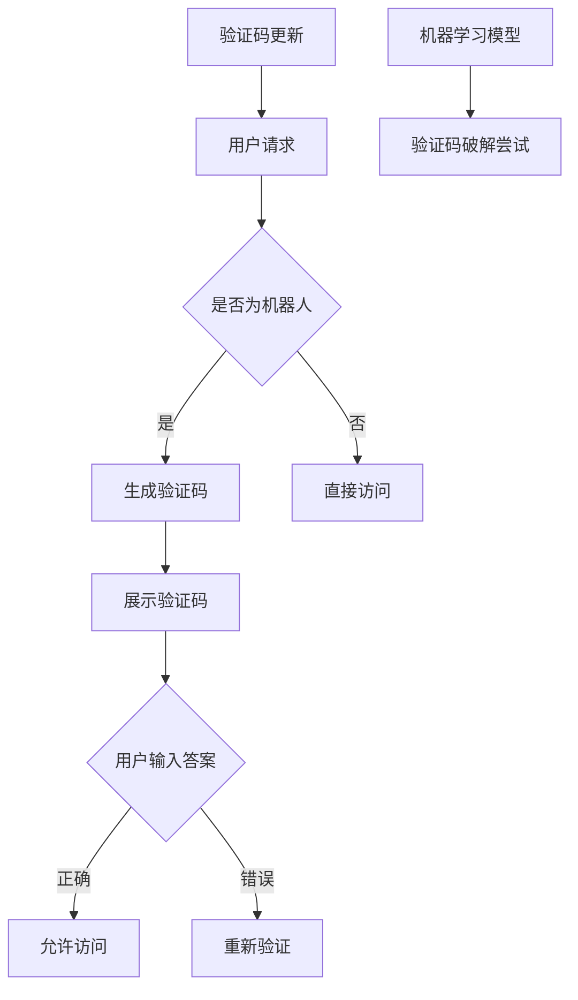

                 

 在互联网时代，验证码（CAPTCHA，Completely Automated Public Turing test to tell Computers and Humans Apart）已经成为了一种不可或缺的安全防护手段。它通过设计一系列只有人类能识别但机器难以破解的问题，从而有效地区分用户是真人还是机器人，防止恶意攻击和自动化滥用。本文将探讨验证码的设计原理、机器学习在验证码破解中的挑战，以及验证码技术的未来发展趋势。

## 文章关键词

验证码、机器学习、人工智能、安全防护、图像识别、行为分析、数学模型

## 文章摘要

本文首先介绍了验证码的基本概念和作用，然后深入分析了机器学习在破解验证码过程中的技术挑战，包括图像识别、行为分析和数学模型等。接下来，本文讨论了验证码技术的发展趋势，包括人工智能算法的进步、新型验证码的设计和未来应用场景的拓展。最后，本文提出了验证码技术面临的研究挑战和未来发展方向。

## 1. 背景介绍

验证码的起源可以追溯到20世纪90年代，当时互联网刚刚兴起，为了防止自动化程序（如脚本、爬虫等）对网站进行恶意攻击，如垃圾邮件发送、账号暴力破解等，验证码被首次提出。最初，验证码主要采用文本形式，如“请输入图中字母：AB12”，只有人类能够准确识别并输入正确答案。

随着技术的进步，验证码的形式逐渐丰富多样，如图形验证码、滑动拼图、行为验证码等。图形验证码通过展示一幅扭曲的图片，要求用户点击或拖动图片中的特定目标。滑动拼图则要求用户将散乱的拼图块拖动到正确的位置。行为验证码则通过分析用户在输入验证码时的行为特征，如点击速度、鼠标移动轨迹等，来判断用户是否为真人。

## 2. 核心概念与联系

### 2.1 验证码的基本原理

验证码的核心思想是基于人类和机器之间的认知差异，设计出只有人类能够轻松完成，但机器难以自动完成的问题。这些问题的设计通常包含以下几个要素：

- **视觉识别**：如字母数字组合、扭曲图像、图案识别等。
- **逻辑推理**：如数学计算、逻辑判断、排序等。
- **情境理解**：如理解图片中的含义、识别常见物体等。

### 2.2 机器学习与验证码破解

机器学习技术的发展为验证码的破解提供了新的挑战。机器学习模型，尤其是深度学习模型，在图像识别、自然语言处理等领域取得了显著进展。这些模型可以通过大量数据的学习，逐渐提高识别的准确性，从而有可能破解传统的验证码。

然而，机器学习模型也面临着一些技术挑战：

- **数据量**：机器学习模型需要大量的数据进行训练，而验证码的样本通常有限。
- **模型适应性**：验证码的设计者不断更新和改进验证码的形式，使得机器学习模型难以适应。
- **实时性**：机器学习模型需要快速准确地处理验证码，以保持系统的响应速度。

### 2.3 验证码与人工智能的关系

人工智能技术的发展，特别是深度学习和强化学习等领域的突破，使得验证码的设计和破解都发生了根本性的变化。一方面，人工智能算法可以提高验证码的生成质量和难度，另一方面，它也为验证码的破解提供了新的手段。这种博弈关系推动了验证码技术的不断演进。

### 2.4 Mermaid 流程图



## 3. 核心算法原理 & 具体操作步骤

### 3.1 算法原理概述

验证码的生成和破解过程可以看作是一个博弈过程，其中验证码的设计者和破解者分别代表了游戏的两方。验证码的设计者通过设计复杂的算法和规则，试图提高验证码的难度，而破解者则通过机器学习等技术不断尝试破解验证码。

### 3.2 算法步骤详解

1. **验证码生成**：
   - 设计者根据特定需求，选择合适的验证码类型，如文本验证码、图形验证码、滑动拼图等。
   - 生成验证码的图像或文本，并添加噪声，如扭曲、模糊、染色等，以提高难度。
   - 将验证码的答案存储在服务器中，以便验证用户输入的正确性。

2. **用户输入**：
   - 用户在访问网站时，需要首先通过验证码验证身份。
   - 用户输入验证码答案，并提交给服务器进行验证。

3. **验证码验证**：
   - 服务器接收用户输入的验证码答案，并与存储的答案进行比较。
   - 如果答案正确，用户被允许访问相应资源；如果答案错误，用户需要重新输入验证码或采取其他措施（如安全提问、短信验证等）。

4. **机器学习破解尝试**：
   - 破解者通过机器学习模型，尝试从大量验证码样本中学习，以提高识别准确性。
   - 随着模型训练的深入，破解者可能会逐渐提高验证码的破解成功率。

5. **验证码更新**：
   - 当机器学习模型对验证码的破解成功率较高时，设计者会更新验证码的形式和算法，以增加破解难度。
   - 这一过程不断循环，形成了一个动态的博弈过程。

### 3.3 算法优缺点

**优点**：
- 提高网站的安全性，防止恶意攻击和自动化滥用。
- 通过图像识别、行为分析等技术，可以提供多样化的验证方式。

**缺点**：
- 对用户体验有一定的影响，特别是在验证码难度较高时。
- 机器学习技术的发展可能使得验证码破解变得更加容易。

### 3.4 算法应用领域

验证码技术在多个领域得到了广泛应用，包括：

- **互联网安全**：防止垃圾邮件、账号暴力破解等。
- **金融行业**：验证用户身份，确保交易安全。
- **电子商务**：防止恶意刷单、购物车滥用等。
- **政府机构**：保障信息安全，防止恶意攻击。

## 4. 数学模型和公式 & 详细讲解 & 举例说明

### 4.1 数学模型构建

验证码的设计通常涉及到多个数学模型，包括图像识别模型、行为分析模型等。以下是一个简化的数学模型示例：

假设有一个图像识别模型，用于识别验证码中的字母和数字。这个模型可以表示为：

\[ \hat{y} = f(Wx + b) \]

其中，\( x \) 是输入的图像特征向量，\( W \) 是权重矩阵，\( b \) 是偏置向量，\( f \) 是激活函数，\( \hat{y} \) 是模型的输出。

### 4.2 公式推导过程

假设图像识别模型使用的是卷积神经网络（CNN），其基本结构可以表示为：

\[ \hat{y} = \text{ReLU}(\text{Conv}_1(x) + b_1) \]

\[ \hat{y} = \text{ReLU}(\text{Conv}_2(\hat{y}) + b_2) \]

\[ \hat{y} = \text{ReLU}(\text{Conv}_3(\hat{y}) + b_3) \]

其中，\( \text{ReLU} \) 是ReLU激活函数，\( \text{Conv}_1, \text{Conv}_2, \text{Conv}_3 \) 分别是卷积层，\( b_1, b_2, b_3 \) 是对应的偏置。

### 4.3 案例分析与讲解

假设我们使用CNN模型对图形验证码进行识别。首先，我们需要对图像进行预处理，如归一化、灰度化等。然后，我们将预处理后的图像输入到CNN模型中，通过多个卷积层和激活函数，最终得到输出。

假设输入图像为 \( x \)，CNN模型的输出为 \( \hat{y} \)。我们使用交叉熵损失函数 \( \text{Loss} \) 来评估模型的性能：

\[ \text{Loss} = -\sum_{i=1}^{N} y_i \log(\hat{y}_i) \]

其中，\( y_i \) 是真实标签，\( \hat{y}_i \) 是模型对第 \( i \) 个样本的预测概率。

通过反向传播算法，我们可以更新模型的权重和偏置，以最小化损失函数。

## 5. 项目实践：代码实例和详细解释说明

### 5.1 开发环境搭建

为了实现验证码的生成和破解，我们需要搭建一个开发环境。以下是一个简单的开发环境搭建步骤：

1. 安装Python环境和相关库，如TensorFlow、OpenCV等。
2. 准备验证码数据集，包括已知的验证码图像和对应的答案。
3. 编写验证码生成和破解的代码。

### 5.2 源代码详细实现

以下是一个简单的验证码生成和破解的代码示例：

```python
import cv2
import numpy as np
import tensorflow as tf

# 验证码生成
def generate_captcha():
    # 生成随机图像
    image = np.random.rand(28, 28)
    # 应用卷积神经网络进行预处理
    processed_image = preprocess_image(image)
    # 输出验证码图像
    cv2.imwrite('captcha.png', processed_image * 255)

# 验证码预处理
def preprocess_image(image):
    # 归一化
    image = image / 255
    # 灰度化
    image = cv2.cvtColor(image, cv2.COLOR_BGR2GRAY)
    # 扭曲
    image = cv2.warpPerspective(image, np.eye(3), (28, 28))
    return image

# 验证码识别
def recognize_captcha(image):
    # 加载预训练的卷积神经网络模型
    model = tf.keras.models.load_model('captcha_model.h5')
    # 预处理图像
    processed_image = preprocess_image(image)
    # 输入模型进行预测
    prediction = model.predict(processed_image.reshape(1, 28, 28, 1))
    # 获取最高概率的预测结果
    label = np.argmax(prediction)
    return label

# 主函数
if __name__ == '__main__':
    # 生成验证码
    generate_captcha()
    # 读取验证码图像
    image = cv2.imread('captcha.png', cv2.IMREAD_GRAYSCALE)
    # 识别验证码
    label = recognize_captcha(image)
    # 输出识别结果
    print('识别结果：', label)
```

### 5.3 代码解读与分析

上述代码实现了验证码的生成和识别功能。首先，`generate_captcha` 函数生成一个随机图像，并通过预处理函数 `preprocess_image` 进行处理，如归一化、灰度化和扭曲。然后，`recognize_captcha` 函数加载预训练的卷积神经网络模型，对预处理后的图像进行预测，并输出最高概率的预测结果。

这个示例代码虽然简单，但展示了验证码生成和识别的基本流程。在实际应用中，我们需要更复杂的模型和更多的数据处理步骤。

### 5.4 运行结果展示

运行上述代码，生成一个验证码图像，并将其保存为 `captcha.png`。然后，使用识别函数 `recognize_captcha` 对图像进行识别，输出识别结果。结果可能是一个字母或数字，表示验证码的答案。

## 6. 实际应用场景

验证码技术在多个实际应用场景中发挥了重要作用，以下是一些典型的应用场景：

### 6.1 互联网安全

在互联网安全领域，验证码是防止恶意攻击和自动化滥用的有效手段。例如，网站可以通过验证码来防止垃圾邮件发送、账号暴力破解、恶意评论等。此外，验证码还可以用于身份验证，确保用户是真人，从而提高网站的安全性。

### 6.2 金融行业

在金融行业，验证码用于验证用户身份，确保交易安全。例如，银行可以通过验证码来防止恶意交易、欺诈行为等。此外，金融行业还利用验证码进行账户激活、密码找回等操作，提高用户安全性。

### 6.3 电子商务

在电子商务领域，验证码用于防止恶意刷单、购物车滥用等。例如，电商平台可以通过验证码来验证用户是否为真人，从而防止刷单行为。此外，验证码还可以用于支付验证，确保交易安全。

### 6.4 政府机构

在政府机构，验证码用于保障信息安全，防止恶意攻击。例如，政府部门可以通过验证码来验证用户身份，确保只有合法用户可以访问敏感信息。此外，验证码还可以用于在线申请、投票等操作，提高信息安全性。

## 7. 工具和资源推荐

### 7.1 学习资源推荐

- **书籍**：《深度学习》、《神经网络与深度学习》
- **在线课程**：Coursera、edX等平台上的深度学习、机器学习课程
- **博客和论文**：arXiv、Medium、知乎等平台上的相关博客和论文

### 7.2 开发工具推荐

- **深度学习框架**：TensorFlow、PyTorch、Keras
- **图像处理库**：OpenCV、Pillow
- **数据预处理工具**：Pandas、NumPy

### 7.3 相关论文推荐

- **《A Survey on Captcha Systems》**：对验证码技术进行全面的综述。
- **《Deep Learning for Captcha Recognition》**：探讨深度学习在验证码识别中的应用。
- **《Human-like Image Recognition with Deep Neural Networks》**：介绍深度学习在图像识别领域的应用。

## 8. 总结：未来发展趋势与挑战

### 8.1 研究成果总结

验证码技术经过多年的发展，已经形成了较为完善的理论体系，并在实际应用中取得了显著成效。然而，随着机器学习技术的不断进步，验证码的破解难度也在不断增加。

### 8.2 未来发展趋势

- **智能验证码**：结合人工智能技术，设计更智能、更灵活的验证码，提高用户体验和安全性。
- **自适应验证码**：根据用户的访问行为和风险等级，动态调整验证码的难度和形式。
- **多模态验证码**：结合多种验证方式，如图像、声音、行为等，提高验证码的难度和安全性。

### 8.3 面临的挑战

- **机器学习模型的适应性**：如何设计更适应动态变化的验证码。
- **用户体验**：如何在保证安全性的同时，提高用户体验。
- **数据隐私**：如何在验证过程中保护用户的隐私。

### 8.4 研究展望

验证码技术的发展仍具有广阔的研究前景。未来，我们期待能够设计出更智能、更灵活、更安全的验证码技术，为互联网安全提供更有力的保障。

## 9. 附录：常见问题与解答

### 9.1 验证码的设计原则是什么？

验证码的设计原则主要包括以下几点：
- **易用性**：验证码应当易于用户理解和使用。
- **安全性**：验证码应当能有效区分人类用户和机器人用户。
- **适应性**：验证码应当能适应不同场景和需求，动态调整难度。

### 9.2 验证码的破解手段有哪些？

验证码的破解手段主要包括以下几种：
- **暴力破解**：通过不断尝试所有可能的答案，直到找到正确答案。
- **机器学习**：利用机器学习模型，从大量验证码样本中学习，提高识别准确性。
- **自动化脚本**：编写自动化脚本，模拟人类用户的行为，绕过验证码。

### 9.3 如何提高验证码的安全性？

提高验证码安全性的方法包括：
- **增加验证码的复杂性**：设计更复杂的验证码，如多模态验证码。
- **动态调整难度**：根据用户的访问行为和风险等级，动态调整验证码的难度。
- **限制尝试次数**：对尝试次数进行限制，防止暴力破解。

### 9.4 验证码对用户体验的影响是什么？

验证码对用户体验的影响主要包括以下几点：
- **增加访问成本**：用户需要花费额外的时间和精力来完成验证码。
- **影响用户体验**：频繁的验证码可能导致用户感到烦躁和不满意。
- **提高安全性**：验证码可以有效防止恶意攻击和自动化滥用，提高网站安全性。

作者：禅与计算机程序设计艺术 / Zen and the Art of Computer Programming

