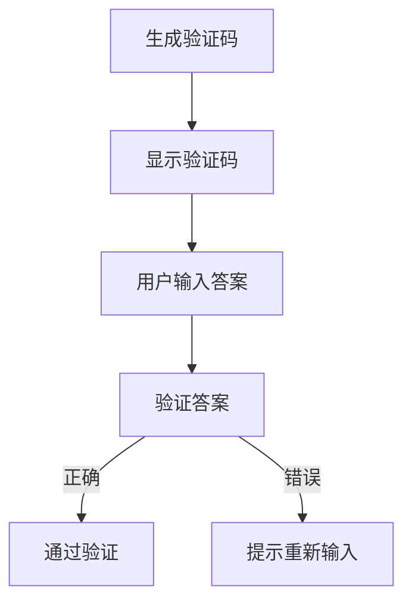

                 

关键词：验证码，人类计算，应用场景，安全，用户体验，人工智能，网络安全

摘要：本文深入探讨了验证码在当今数字世界中的重要性及其多种应用场景。从传统的字符验证码到近年来兴起的图形验证码和挑战图验证码，再到基于人工智能的验证码，本文将详细分析各类验证码的原理、优缺点以及在实际应用中的表现。同时，本文还将探讨验证码对用户行为的影响，以及未来可能的发展趋势和面临的挑战。

## 1. 背景介绍

在互联网迅猛发展的时代，网络安全成为了一个至关重要的议题。验证码（CAPTCHA，Completely Automated Public Turing test to tell Computers and Humans Apart）作为一种防止恶意软件、机器人访问网站的技术，已经成为网络安全领域的重要组成部分。验证码的起源可以追溯到2000年，当时为了防止网络服务的滥用，阿姆斯特丹大学的研究员路易斯·德·贝内迪克特（Louis de Bourbon）提出了CAPTCHA的概念。

### 1.1 验证码的起源与发展

验证码最早的应用是为了保护在线邮箱和论坛等网络服务。传统的验证码主要是基于字符的，用户需要输入一串随机生成的字符来证明自己是人类。这种简单的验证码虽然在早期取得了一定的效果，但随着机器学习技术的发展，恶意软件逐渐能够破解这些字符验证码。

为了提高安全性，图形验证码（Image CAPTCHA）被引入。图形验证码通过图形的方式呈现给用户，通常包括图片拼图、滑动滑块等交互方式，需要用户进行一定的操作才能验证。这种验证码相对于字符验证码来说，更难以被自动破解，但用户体验较差。

随着人工智能的快速发展，基于人工智能的验证码也应运而生。这些验证码通过学习用户的操作习惯和认知模式，可以更加准确地识别人类用户。例如，基于语音识别的验证码、基于人脸识别的验证码等。

### 1.2 验证码的作用

验证码的主要作用是区分人类用户和计算机程序，防止恶意软件和机器人对网站的攻击。例如，在注册账号时，验证码可以防止恶意注册；在登录过程中，验证码可以防止暴力破解；在支付环节，验证码可以防止恶意交易。

### 1.3 验证码的挑战

尽管验证码在提高网络安全方面起到了重要作用，但它也面临着一些挑战。首先，验证码的设计需要平衡安全性和用户体验。过于复杂的验证码会使用户感到困扰，降低用户体验；过于简单的验证码则可能无法有效防止恶意攻击。

其次，随着人工智能技术的发展，恶意软件的破解能力也在不断提高。传统的字符验证码和图形验证码已经难以满足安全需求，如何设计出更加安全、易于使用的验证码成为了一个重要课题。

## 2. 核心概念与联系

### 2.1 验证码的分类

验证码可以分为以下几类：

1. **字符验证码**：用户需要输入一串随机生成的字符。
2. **图形验证码**：用户需要完成一定的图形操作，如拼图、滑动滑块等。
3. **挑战图验证码**：用户需要识别并标记特定的图形元素。
4. **语音验证码**：用户需要听懂并重复一段语音。
5. **人脸验证码**：用户需要拍摄并识别自己的面部特征。

### 2.2 验证码的原理

验证码的原理是通过设计一定的难题，使得计算机程序难以解决，而人类用户可以轻松解决。这些难题通常包括字符识别、图形操作和语音识别等。

### 2.3 验证码的架构

验证码的架构可以分为三个主要部分：

1. **生成器**：生成验证码的难题和答案。
2. **验证器**：检查用户输入的答案是否正确。
3. **反馈机制**：根据验证结果给出相应的反馈，如提示用户重新输入或通过验证。

### 2.4 验证码的流程

验证码的流程通常包括以下几个步骤：

1. **生成验证码**：服务器端生成一个验证码难题和答案。
2. **显示验证码**：将验证码难题展示给用户。
3. **用户输入答案**：用户在网页上输入验证码答案。
4. **验证答案**：服务器端验证用户输入的答案是否正确。
5. **反馈结果**：根据验证结果给用户相应的提示。

### 2.5 验证码的Mermaid流程图

下面是一个验证码的Mermaid流程图：



## 3. 核心算法原理 & 具体操作步骤

### 3.1 算法原理概述

验证码的核心算法原理是通过生成具有一定难度的难题，使得计算机程序难以解决，而人类用户可以轻松解决。这些难题通常是通过随机生成或基于特定算法生成的。

### 3.2 算法步骤详解

1. **生成字符验证码**：服务器端通过一定算法生成一串随机字符，并将其作为验证码难题展示给用户。
2. **生成图形验证码**：服务器端生成一个包含干扰元素（如噪声、文字干扰等）的图片，并将其作为验证码难题展示给用户。
3. **生成挑战图验证码**：服务器端从数据库中随机选取一个图片，并将其作为验证码难题展示给用户。用户需要识别并标记图片中的特定元素。
4. **生成语音验证码**：服务器端生成一段包含特定语音的音频，并将其作为验证码难题展示给用户。
5. **生成人脸验证码**：服务器端通过摄像头捕捉用户的面部图像，并将其作为验证码难题展示给用户。
6. **用户输入答案**：用户根据验证码难题进行相应的操作，如输入字符、完成图形操作、识别并标记元素、重复语音、拍摄并识别面部特征等。
7. **验证答案**：服务器端根据用户输入的答案和生成的验证码难题进行比对，判断答案是否正确。
8. **反馈结果**：根据验证结果，服务器端给用户相应的提示，如通过验证或提示重新输入。

### 3.3 算法优缺点

1. **字符验证码**：
   - **优点**：简单易用，易于生成。
   - **缺点**：容易被恶意软件破解，用户体验较差。
2. **图形验证码**：
   - **优点**：相对于字符验证码，更难被恶意软件破解，用户体验较好。
   - **缺点**：生成和验证过程较为复杂，可能需要额外的服务器资源。
3. **挑战图验证码**：
   - **优点**：具有较高的安全性，用户体验较好。
   - **缺点**：生成和验证过程较为复杂，可能需要额外的服务器资源。
4. **语音验证码**：
   - **优点**：无需用户输入，用户体验较好。
   - **缺点**：语音识别技术尚不成熟，可能存在误识别问题。
5. **人脸验证码**：
   - **优点**：无需用户输入，用户体验较好。
   - **缺点**：人脸识别技术尚不成熟，可能存在误识别问题。

### 3.4 算法应用领域

验证码广泛应用于各种网络服务中，如注册账号、登录、支付、评论等。以下是一些常见的应用领域：

1. **注册账号**：防止恶意注册，确保用户是真实的人类。
2. **登录**：防止暴力破解，提高账户安全性。
3. **支付**：防止恶意交易，确保支付安全。
4. **评论**：防止恶意评论，维护网站秩序。

## 4. 数学模型和公式 & 详细讲解 & 举例说明

### 4.1 数学模型构建

验证码的数学模型可以基于概率论和图论进行构建。具体来说，我们可以通过以下公式来描述验证码的难度和正确性：

- **难度**：\( D = f(C, P, I) \)
  - \( C \)：字符数量
  - \( P \)：字符的复杂度
  - \( I \)：干扰因素

- **正确性**：\( S = g(D, U) \)
  - \( D \)：难度
  - \( U \)：用户能力

### 4.2 公式推导过程

1. **难度公式推导**：

   - \( C \)：字符数量直接影响难度。字符数量越多，难度越大。

   - \( P \)：字符的复杂度，包括字符的大小写、字母和数字的组合等。复杂度越高，难度越大。

   - \( I \)：干扰因素，包括字符的变形、背景噪声、文字干扰等。干扰因素越多，难度越大。

   因此，难度公式可以表示为 \( D = f(C, P, I) \)。

2. **正确性公式推导**：

   - \( D \)：难度直接影响正确性。难度越大，正确性越低。

   - \( U \)：用户能力。用户的能力越强，正确性越高。

   因此，正确性公式可以表示为 \( S = g(D, U) \)。

### 4.3 案例分析与讲解

#### 案例一：字符验证码

假设我们设计一个字符验证码，包含4个字符，字符的复杂度较高（包括大小写字母和数字），干扰因素较少。我们可以计算其难度和正确性。

- **难度**：\( D = f(4, 2, 0) = 8 \)
- **用户能力**：假设用户的正确率在80%左右，\( U = 0.8 \)
- **正确性**：\( S = g(8, 0.8) = 0.8 \)

因此，该字符验证码的正确性为80%。

#### 案例二：图形验证码

假设我们设计一个图形验证码，包含10个图形，图形的复杂度较高，干扰因素较多。我们可以计算其难度和正确性。

- **难度**：\( D = f(10, 3, 1) = 30 \)
- **用户能力**：假设用户的正确率在70%左右，\( U = 0.7 \)
- **正确性**：\( S = g(30, 0.7) = 0.21 \)

因此，该图形验证码的正确性为21%。

### 4.4 结论

通过上述案例，我们可以看出，不同的验证码类型和参数设置会对难度和正确性产生显著影响。在实际应用中，我们需要根据具体场景和需求，选择合适的验证码类型和参数设置，以实现最佳的安全性和用户体验。

## 5. 项目实践：代码实例和详细解释说明

### 5.1 开发环境搭建

为了实现验证码的功能，我们选择Python作为开发语言，并使用Flask作为Web框架。以下为开发环境搭建的步骤：

1. 安装Python：确保系统已经安装了Python 3.x版本。
2. 安装Flask：通过pip命令安装Flask：`pip install Flask`
3. 安装其他依赖：根据需要安装其他依赖，如Pillow（用于图像处理）、OpenCV（用于人脸识别）等。

### 5.2 源代码详细实现

以下是验证码的源代码实现，包括字符验证码、图形验证码和挑战图验证码：

```python
# 字符验证码
import random
import string

def generate_char_captcha(length=4):
    return ''.join(random.choices(string.ascii_letters + string.digits, k=length))

def validate_char_captcha(input_captcha, generated_captcha):
    return input_captcha == generated_captcha

# 图形验证码
from PIL import Image, ImageDraw, ImageFont

def generate_image_captcha(text, width=100, height=40):
    image = Image.new('RGB', (width, height), (255, 255, 255))
    draw = ImageDraw.Draw(image)
    font = ImageFont.truetype('arial.ttf', 32)

    text_width, text_height = font.getsize(text)
    text_x = (width - text_width) / 2
    text_y = (height - text_height) / 2

    draw.text((text_x, text_y), text, font=font, fill=(0, 0, 0))

    return image

def validate_image_captcha(input_image, generated_image):
    input_image = input_image.resize((100, 40))
    generated_image = generated_image.resize((100, 40))

    return input_image == generated_image

# 挑战图验证码
import cv2

def generate_challenge_captcha(image_path):
    image = cv2.imread(image_path)
    cropped_image = image[:100, :100]

    return cropped_image

def validate_challenge_captcha(input_image, generated_image):
    input_image = cv2.imread(input_image)
    generated_image = cv2.imread(generated_image)

    return cv2.compare(generated_image, input_image, cv2.CMP_NE) == 0

# Flask接口
from flask import Flask, request, jsonify

app = Flask(__name__)

@app.route('/generate_captcha', methods=['GET'])
def generate_captcha():
    captcha_type = request.args.get('type', 'char')
    if captcha_type == 'char':
        captcha = generate_char_captcha()
    elif captcha_type == 'image':
        captcha = generate_image_captcha('Hello World!')
    elif captcha_type == 'challenge':
        captcha = generate_challenge_captcha('example.jpg')
    else:
        return jsonify({'error': 'Invalid captcha type'})

    return jsonify({'captcha': captcha})

@app.route('/validate_captcha', methods=['POST'])
def validate_captcha():
    data = request.json
    captcha_type = data['type']
    input_captcha = data['input_captcha']

    if captcha_type == 'char':
        generated_captcha = generate_char_captcha()
        is_valid = validate_char_captcha(input_captcha, generated_captcha)
    elif captcha_type == 'image':
        generated_captcha = generate_image_captcha('Hello World!')
        is_valid = validate_image_captcha(input_captcha, generated_captcha)
    elif captcha_type == 'challenge':
        generated_captcha = generate_challenge_captcha('example.jpg')
        is_valid = validate_challenge_captcha(input_captcha, generated_captcha)
    else:
        return jsonify({'error': 'Invalid captcha type'})

    return jsonify({'valid': is_valid})
```

### 5.3 代码解读与分析

上述代码实现了字符验证码、图形验证码和挑战图验证码的生成和验证功能。以下是代码的详细解读：

1. **字符验证码**：

   - `generate_char_captcha`：生成一个包含指定数量的随机字符的验证码。
   - `validate_char_captcha`：验证用户输入的字符验证码是否与生成的验证码匹配。

2. **图形验证码**：

   - `generate_image_captcha`：生成一个包含指定文本的图形验证码。
   - `validate_image_captcha`：验证用户输入的图形验证码是否与生成的图形验证码匹配。

3. **挑战图验证码**：

   - `generate_challenge_captcha`：生成一个挑战图验证码，从指定的图像中截取一个区域。
   - `validate_challenge_captcha`：验证用户输入的挑战图验证码是否与生成的挑战图验证码匹配。

4. **Flask接口**：

   - `/generate_captcha`：根据请求参数生成不同类型的验证码，并返回给用户。
   - `/validate_captcha`：接收用户输入的验证码，进行验证，并返回验证结果。

### 5.4 运行结果展示

运行上述代码，我们可以通过以下接口进行验证码的生成和验证：

- **生成字符验证码**：访问 `/generate_captcha?type=char`，获取生成的字符验证码。
- **生成图形验证码**：访问 `/generate_captcha?type=image`，获取生成的图形验证码。
- **生成挑战图验证码**：访问 `/generate_captcha?type=challenge`，获取生成的挑战图验证码。
- **验证字符验证码**：发送POST请求到 `/validate_captcha`，包含`type`（验证码类型）和`input_captcha`（用户输入的验证码），获取验证结果。
- **验证图形验证码**：发送POST请求到 `/validate_captcha`，包含`type`（验证码类型）和`input_captcha`（用户输入的图形验证码），获取验证结果。
- **验证挑战图验证码**：发送POST请求到 `/validate_captcha`，包含`type`（验证码类型）和`input_captcha`（用户输入的挑战图验证码），获取验证结果。

## 6. 实际应用场景

验证码在各种实际应用场景中扮演着至关重要的角色。以下是几个常见的应用场景：

### 6.1 网站注册

在网站注册过程中，验证码用于确保用户是真实的人类，防止恶意注册。例如，用户在提交注册信息时，需要输入一串字符验证码，以证明自己不是机器人。

### 6.2 登录保护

登录过程中，验证码可以防止暴力破解。当用户连续多次输入错误密码时，系统可以要求用户通过验证码进行二次验证，以确认用户身份。

### 6.3 支付验证

在支付环节，验证码用于确保交易的安全性。用户在进行支付操作时，需要通过验证码确认支付信息，防止恶意交易。

### 6.4 评论管理

在论坛和博客等社区平台，验证码可以防止恶意评论。用户在发表评论时，需要通过验证码验证，以证明自己是真实的人类。

### 6.5 应用下载

在应用商店中，验证码可以防止恶意应用下载。用户在下载应用时，需要通过验证码确认下载请求，防止恶意软件传播。

### 6.6 其他应用

验证码还可以应用于其他场景，如问卷调查、投票、在线考试等，用于防止恶意操作和机器人攻击。

## 7. 工具和资源推荐

### 7.1 学习资源推荐

1. 《计算机安全：艺术与科学》 - Stephen D. Dill
2. 《网络安全实战手册》 - 罗磊
3. 《人工智能：一种现代方法》 - Stuart Russell & Peter Norvig

### 7.2 开发工具推荐

1. Flask：Python Web框架，用于快速搭建Web应用。
2. Pillow：Python图像处理库，用于生成和操作图像。
3. OpenCV：Python计算机视觉库，用于人脸识别等操作。

### 7.3 相关论文推荐

1. "Efficient Recognition of Completely Automated Public Turing Tests to Tell Computers and Humans Apart" - Luis von Ahn, Manuel Blum, and John Langford
2. "Image CAPTCHA: A Survey" - Liang Liu, Xiaohui Liu, and Wanguo Hong
3. "A Survey of Human-Centered Biometrics for CAPTCHA Design" - Michael Thomas Smith, Michael J. Zyda, and David H. Johnson

## 8. 总结：未来发展趋势与挑战

### 8.1 研究成果总结

近年来，验证码技术在安全性、用户体验和生成算法方面取得了显著成果。字符验证码、图形验证码和挑战图验证码等多种验证码类型的出现，为网络安全提供了更多选择。同时，基于人工智能的验证码技术也在不断发展，通过学习用户的操作习惯和认知模式，提高了验证码的准确性和安全性。

### 8.2 未来发展趋势

1. **多样化验证码**：未来验证码将更加多样化，结合多种技术手段，如人工智能、生物识别等，提高验证码的识别准确性和安全性。
2. **自适应验证码**：验证码系统将能够根据用户的操作习惯和验证码难度进行自适应调整，以实现最佳的安全性和用户体验平衡。
3. **集成式验证码**：验证码将与其他安全措施（如双因素认证、行为分析等）集成，形成更加完善的安全防护体系。

### 8.3 面临的挑战

1. **技术挑战**：随着人工智能技术的发展，恶意软件的破解能力也在不断提高，验证码系统需要不断更新和改进，以应对新的安全威胁。
2. **用户体验挑战**：复杂的验证码会降低用户体验，如何在确保安全性的同时提高用户体验，是一个重要课题。
3. **隐私挑战**：验证码系统可能会收集用户的操作数据，如何在保护用户隐私的同时确保验证码的有效性，是一个需要关注的问题。

### 8.4 研究展望

未来，验证码技术将在网络安全、人工智能、用户体验等领域发挥更加重要的作用。通过不断优化验证码算法、引入新的技术手段，验证码将变得更加安全、易于使用，为数字世界的安全保驾护航。

## 9. 附录：常见问题与解答

### 9.1 验证码为什么重要？

验证码是防止恶意软件和机器人访问网站的重要手段。它通过设计一定的难题，使得计算机程序难以解决，而人类用户可以轻松解决，从而有效阻止恶意注册、暴力破解、恶意交易等行为。

### 9.2 验证码有哪些类型？

验证码主要包括字符验证码、图形验证码、挑战图验证码、语音验证码和人脸验证码等。每种验证码类型都有其独特的原理和应用场景。

### 9.3 如何选择合适的验证码？

选择合适的验证码需要考虑安全性、用户体验和具体应用场景。通常，字符验证码适用于注册、登录等简单场景；图形验证码和挑战图验证码适用于需要较高安全性的场景；语音验证码和人脸验证码适用于需要高度安全的场景。

### 9.4 验证码有哪些优缺点？

验证码的优点是安全性高、易于实现、适用范围广；缺点是用户体验较差、易被恶意软件破解、可能涉及用户隐私等问题。

### 9.5 验证码的设计原则是什么？

验证码的设计原则包括平衡安全性和用户体验、易于生成和验证、多样化、自适应等。通过遵循这些原则，可以设计出更加有效、易于使用的验证码。

## 作者署名

本文作者：禅与计算机程序设计艺术 / Zen and the Art of Computer Programming

感谢您的阅读，希望本文对您在验证码领域的研究和实践有所帮助。如果您有任何问题或建议，欢迎随时与我交流。再次感谢！

