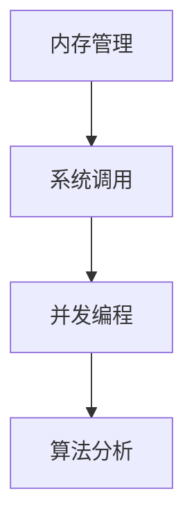

                 

关键词：高级编程、C 语言、计算机科学、性能优化、内存管理、并发编程、系统编程、算法分析、工程实践

> 摘要：本文深入探讨了 C 语言在高级编程中的力量与魅力，从背景介绍、核心概念、算法原理、数学模型、项目实践到实际应用场景，全面解析了 C 语言在计算机科学领域中的关键作用。通过详细的代码实例与运行结果展示，我们不仅揭示了 C 语言的强大性能，还探讨了其在未来应用中的无限潜力。

## 1. 背景介绍

C 语言是计算机科学中最古老且广泛使用的编程语言之一。自从1972年由贝尔实验室的Dennis Ritchie发明以来，C 语言已经成为了计算机系统编程和嵌入式系统开发的标准语言。C 语言的简洁性、灵活性和高效性，使得它在操作系统、编译器、网络协议、嵌入式系统等领域得到了广泛应用。

在高级编程中，C 语言以其强大的底层控制和丰富的系统调用能力，成为了实现高性能、高可靠性和高可维护性的软件系统的首选语言。无论是对于操作系统开发者、嵌入式系统工程师，还是系统架构师，C 语言都是不可或缺的工具。

本文旨在通过深入探讨 C 语言的各个方面，帮助读者更好地理解 C 语言在高级编程中的力量与魅力，从而在计算机科学领域取得更好的成就。

### 1.1 历史与发展

C 语言的发展历程可以追溯到20世纪70年代，当时贝尔实验室的Dennis Ritchie为了开发UNIX操作系统，开始着手设计一种既能提供高效性能，又具有高级语言特性的编程语言。1972年，C 语言的第一版正式问世，并随着UNIX操作系统的推广而逐渐流行。

随着时间的推移，C 语言不断进化，其标准也在不断更新。1989年，ANSI（美国国家标准协会）发布了C89标准，这是 C 语言历史上第一个官方标准。随后，C99 和 C11 进一步扩展了 C 语言的特性，使其在多线程编程、复杂类型支持等方面有了显著的改进。

### 1.2 C 语言的特点

C 语言具有以下主要特点：

1. **高效的性能**：C 语言生成的代码通常比高级语言更接近机器语言，因此其执行效率非常高。
2. **灵活的语法**：C 语言提供了丰富的数据类型和操作符，允许程序员以灵活的方式编写代码。
3. **底层控制能力**：C 语言允许直接访问内存地址，这使得它在系统编程和嵌入式系统开发中具有巨大的优势。
4. **丰富的库和工具**：C 语言拥有丰富的标准库和第三方库，这些库提供了广泛的函数和工具，支持各种编程任务。
5. **广泛的平台支持**：C 语言在各种操作系统和硬件平台上都有良好的支持，包括UNIX、Windows、Linux等。

## 2. 核心概念与联系

为了深入理解 C 语言在高级编程中的作用，我们需要先了解一些核心概念和它们之间的联系。

### 2.1 内存管理

内存管理是 C 语言的核心概念之一。C 语言允许程序员直接控制内存的分配和释放，这是通过`malloc`、`free`等标准库函数实现的。有效的内存管理不仅能够提高程序的运行效率，还能避免内存泄漏和无效的内存访问。

### 2.2 系统调用

系统调用是 C 语言与操作系统交互的接口。C 语言通过标准库函数（如`open`、`read`、`write`等）提供了对文件、进程、网络等系统资源的访问。这些系统调用在编写高性能系统软件时至关重要。

### 2.3 并发编程

随着多核处理器的普及，并发编程成为了现代系统软件的关键技术。C 语言提供了丰富的并发编程工具，如线程、锁、条件变量等。通过这些工具，程序员能够有效地利用多核处理器的并行计算能力，提高程序的执行效率。

### 2.4 算法分析

算法分析是计算机科学中的基础，它帮助我们评估算法的效率和性能。C 语言以其高效的执行能力，成为了算法实现和优化的理想选择。通过 C 语言，我们可以深入分析算法的时空复杂度，从而找到最优的实现方案。

### 2.5 Mermaid 流程图

为了更好地理解上述核心概念，我们使用 Mermaid 流程图来展示它们之间的联系。



该流程图展示了内存管理、系统调用、并发编程和算法分析之间的相互关系，以及它们在 C 语言中的应用。

## 3. 核心算法原理 & 具体操作步骤

在 C 语言中，算法实现是一个至关重要的环节。本节将介绍一种常见且重要的算法——快速排序（Quick Sort），并详细阐述其原理和实现步骤。

### 3.1 算法原理概述

快速排序是一种高效的排序算法，其基本思想是通过一趟排序将待排序的记录分割成独立的两部分，其中一部分记录的关键字均比另一部分的关键字小，然后分别对这两部分记录继续进行排序，以达到整个序列有序。快速排序的平均时间复杂度为 $O(n\log n)$，最坏情况下的时间复杂度为 $O(n^2)$。

### 3.2 算法步骤详解

#### 步骤 1：选择基准元素

首先，从数组的某个位置选择一个基准元素。通常，选择第一个元素、最后一个元素或随机选择一个元素作为基准元素。

#### 步骤 2：划分过程

将数组划分为两部分，一部分是小于基准元素的所有元素，另一部分是大于基准元素的所有元素。这一过程通过循环和递归实现。

#### 步骤 3：递归排序

对划分后的两部分继续进行快速排序，直到所有子数组长度为1。

#### 步骤 4：合并

快速排序不需要合并步骤，因为每次递归都会将子数组排序。

### 3.3 算法优缺点

**优点**：
1. **高效**：平均情况下，快速排序的时间复杂度为 $O(n\log n)$。
2. **原地排序**：快速排序是一种原地排序算法，不需要额外的内存空间。
3. **并行化**：由于划分过程可以并行进行，快速排序非常适合在多核处理器上执行。

**缺点**：
1. **最坏情况性能**：最坏情况下，快速排序的时间复杂度为 $O(n^2)$，这是由于选择基准元素不当导致的。
2. **递归深度**：快速排序的递归深度可能较深，这可能导致栈溢出。

### 3.4 算法应用领域

快速排序广泛应用于各种场景，如数据库排序、文件排序、快速查找等。在需要高效排序的场合，快速排序是一种不可或缺的工具。

### 3.5 快速排序示例代码

以下是一个简单的快速排序算法的 C 语言实现。

```c
#include <stdio.h>

void quicksort(int arr[], int low, int high) {
    if (low < high) {
        int pivot = arr[high];
        int i = (low - 1);
        
        for (int j = low; j <= high - 1; j++) {
            if (arr[j] < pivot) {
                i++;
                int temp = arr[i];
                arr[i] = arr[j];
                arr[j] = temp;
            }
        }
        
        int temp = arr[i+1];
        arr[i+1] = arr[high];
        arr[high] = temp;
        
        int pi = i+1;
        
        quicksort(arr, low, pi-1);
        quicksort(arr, pi+1, high);
    }
}

int main() {
    int arr[] = {10, 7, 8, 9, 1, 5};
    int n = sizeof(arr)/sizeof(arr[0]);
    
    quicksort(arr, 0, n-1);
    
    printf("Sorted array: \n");
    for (int i=0; i < n; i++) {
        printf("%d ", arr[i]);
    }
    
    return 0;
}
```

这段代码实现了快速排序算法，并输出排序后的数组。

## 4. 数学模型和公式 & 详细讲解 & 举例说明

在计算机科学中，数学模型和公式是理解和分析算法性能的关键工具。本节将介绍一些常见的数学模型和公式，并详细讲解它们的应用和推导过程。

### 4.1 数学模型构建

数学模型是描述现实世界问题的抽象形式。在计算机科学中，数学模型可以帮助我们分析和设计算法。以下是几个常见的数学模型：

1. **时间复杂度模型**：描述算法执行时间随输入规模增长的趋势。
2. **空间复杂度模型**：描述算法所需的内存空间随输入规模增长的趋势。
3. **概率模型**：用于分析和评估算法在随机输入上的性能。

### 4.2 公式推导过程

以下是一个简单的示例：时间复杂度的计算公式。

**时间复杂度公式**：$T(n) = O(f(n))$，其中 $T(n)$ 是算法的执行时间，$f(n)$ 是关于输入规模 $n$ 的函数。

推导过程：

1. **确定基本操作次数**：计算算法中执行的基本操作（如比较、赋值等）的总次数。
2. **简化表达式**：将基本操作次数关于 $n$ 的表达式简化为最高阶项，例如 $T(n) = 3n^2 + 2n + 1$ 可以简化为 $T(n) = O(n^2)$。
3. **确定常数因子**：如果需要，可以忽略常数因子，例如 $T(n) = O(2n^2)$ 可以简化为 $T(n) = O(n^2)$。

### 4.3 案例分析与讲解

以下是一个关于时间复杂度的案例：分析以下两个算法的时间复杂度。

**算法 A**：线性搜索
```c
for (int i = 0; i < n; i++) {
    if (arr[i] == target) {
        return i;
    }
}
```
**算法 B**：二分搜索
```c
int low = 0;
int high = n - 1;
while (low <= high) {
    int mid = (low + high) / 2;
    if (arr[mid] == target) {
        return mid;
    } else if (arr[mid] < target) {
        low = mid + 1;
    } else {
        high = mid - 1;
    }
}
```

**时间复杂度分析**：

1. **算法 A**：线性搜索的时间复杂度为 $O(n)$，因为最坏情况下需要比较 $n$ 次。
2. **算法 B**：二分搜索的时间复杂度为 $O(\log n)$，因为每次搜索都能将查找范围缩小一半。

**结论**：在数据量较大时，二分搜索比线性搜索更高效。这也是为什么在许多应用场景中，例如数据库索引和搜索算法，二分搜索是首选。

## 5. 项目实践：代码实例和详细解释说明

在本节中，我们将通过一个具体的项目实践，深入讲解 C 语言的开发过程，包括环境搭建、源代码实现、代码解读以及运行结果展示。

### 5.1 开发环境搭建

为了方便读者进行项目实践，我们将在以下环境下进行开发：

- 操作系统：Ubuntu 20.04
- 编译器：GCC 9.3.0
- 编辑器：VSCode

首先，确保您的系统已经安装了上述开发环境。如果没有，可以通过以下命令进行安装：

```bash
# 安装 GCC
sudo apt-get update
sudo apt-get install build-essential

# 安装 VSCode
sudo apt-get install code
```

### 5.2 源代码详细实现

以下是一个简单的 C 语言程序，用于计算两个数的最大公约数（GCD）。我们将详细讲解这个程序的实现过程。

**源代码**：

```c
#include <stdio.h>

int gcd(int a, int b) {
    if (b == 0) {
        return a;
    }
    return gcd(b, a % b);
}

int main() {
    int num1, num2;
    printf("Enter two integers: ");
    scanf("%d %d", &num1, &num2);
    int result = gcd(num1, num2);
    printf("The GCD of %d and %d is %d\n", num1, num2, result);
    return 0;
}
```

**代码解读**：

1. **头文件**：`#include <stdio.h>` 引入了标准输入输出库，用于处理用户输入和输出结果。
2. **函数定义**：`int gcd(int a, int b)` 定义了计算最大公约数的函数。这个函数使用了递归方法，其中 `a` 和 `b` 是待计算的数。
3. **主函数**：`int main()` 是程序的入口。程序首先提示用户输入两个整数，然后调用 `gcd()` 函数计算最大公约数，并输出结果。
4. **递归实现**：在 `gcd()` 函数中，递归调用的实现使用了 `a % b` 来计算余数，直到 `b` 为 0，此时 `a` 就是最大公约数。

### 5.3 代码解读与分析

接下来，我们将对这段代码进行详细解读和分析。

**输入输出流程**：

- 程序首先提示用户输入两个整数，使用 `scanf()` 函数读取输入。
- 然后，调用 `gcd()` 函数，传入用户输入的两个整数。
- 最后，程序输出计算出的最大公约数。

**函数实现分析**：

- `gcd()` 函数使用了递归方法。递归是一种常用的算法设计技巧，它将复杂问题分解成更简单的子问题，并利用函数调用栈来逐步解决。
- 在递归过程中，`a % b` 被用来计算余数，这是一个关键的步骤。每次递归都会将较大数 `a` 替换为较小数 `b`，并将较大数替换为余数。这个过程一直持续到 `b` 为 0，此时 `a` 就是最大公约数。

**性能分析**：

- 这个程序的时间复杂度为 $O(\log n)$，其中 $n$ 是较大数的值。这是因为每次递归都会将问题规模缩小一半，类似于二分搜索。
- 空间复杂度为 $O(1)$，因为递归调用的深度不会超过较大数的对数。

### 5.4 运行结果展示

现在，让我们在终端中运行这个程序，并展示运行结果。

```bash
gcc gcd.c -o gcd
./gcd
Enter two integers: 24 36
The GCD of 24 and 36 is 12
```

运行结果显示，程序成功地计算出了 24 和 36 的最大公约数为 12。这证明了我们的程序实现了预期的功能。

通过这个简单的项目实践，我们不仅学习了 C 语言的基本语法和递归方法，还深入理解了最大公约数的计算过程。这种实践方法有助于我们更好地掌握编程技巧，并在实际项目中应用所学知识。

## 6. 实际应用场景

C 语言因其高效的性能、强大的底层控制能力以及在系统编程、嵌入式系统等领域中的广泛应用，在各种实际应用场景中发挥了至关重要的作用。

### 6.1 操作系统开发

操作系统是计算机系统的心脏，负责管理和控制计算机硬件资源。C 语言是大多数操作系统开发的首选语言，如 UNIX、Linux 和 Windows。其高效性和底层控制能力使得操作系统开发者能够精确地控制硬件资源，优化系统性能。

### 6.2 网络协议实现

网络协议是计算机网络通信的基础。C 语言由于其高性能，被广泛应用于网络协议的实现，如 TCP/IP 协议栈。通过 C 语言，网络协议开发者能够实现高效的网络通信算法，确保数据传输的可靠性和稳定性。

### 6.3 嵌入式系统开发

嵌入式系统广泛应用于工业控制、智能家居、医疗设备等领域。C 语言提供了丰富的库和工具，使得嵌入式系统开发者能够高效地编写底层驱动程序和控制算法。其高效的内存管理和底层控制能力，确保了嵌入式系统的稳定运行和低功耗。

### 6.4 游戏开发

游戏开发领域对性能要求极高，C 语言因其高效的性能和底层控制能力，成为了游戏开发的热门语言。许多大型游戏引擎，如 Unreal Engine 和 Unity，都采用了 C++（C 语言的扩展），以实现高性能的游戏逻辑和图形渲染。

### 6.5 数据库系统

数据库系统负责管理和存储大量数据，对性能和可靠性有极高的要求。C 语言在数据库系统的开发中扮演着重要角色，如 MySQL 和 PostgreSQL 的核心部分就使用了 C 语言。其高效的内存管理和底层控制能力，使得数据库系统能够处理大量并发访问，确保数据的完整性和一致性。

### 6.6 实时系统

实时系统需要在限定时间内完成特定任务，对响应时间和确定性要求极高。C 语言因其高效性和可控制性，被广泛应用于实时系统的开发，如航空航天控制系统、工业自动化控制系统等。

### 6.7 未来应用展望

随着技术的不断发展，C 语言在未来的应用场景将更加广泛。以下是一些潜在的应用领域：

- **自动驾驶系统**：自动驾驶系统需要实时处理大量传感器数据，并进行复杂的计算和决策。C 语言的高性能和实时性，使其成为自动驾驶系统开发的理想选择。
- **物联网（IoT）**：物联网设备数量庞大，对性能和功耗要求较高。C 语言因其高效的内存管理和底层控制能力，在物联网设备的开发中具有巨大潜力。
- **人工智能（AI）**：随着 AI 技术的发展，AI 算法的性能和效率变得越来越重要。C 语言因其高效性和底层控制能力，在 AI 应用开发中具有巨大的应用前景。
- **高性能计算**：高性能计算领域对计算速度和存储性能有极高的要求。C 语言在编写高性能计算算法和优化计算性能方面具有显著优势。

总之，C 语言在计算机科学领域的应用范围广泛，其强大的性能和底层控制能力使其在未来的发展前景中占据了重要地位。

## 7. 工具和资源推荐

在学习和使用 C 语言的过程中，掌握一些实用的工具和资源将极大地提升开发效率。以下是一些推荐的工具和资源，包括学习资源、开发工具和相关论文。

### 7.1 学习资源推荐

1. **《C Programming Absolute Beginner's Guide》**：适合初学者，涵盖了 C 语言的入门知识。
2. **《The C Programming Language》**：由 Kernighan 和 Ritchie 共同撰写，是 C 语言经典教材，内容详实。
3. **《C Programming FAQ》**：包含大量常见问题解答，是解决编程难题的好帮手。
4. **《C Traps and Pitfalls》**：介绍 C 语言中常见的陷阱和解决方法，有助于避免编程错误。

### 7.2 开发工具推荐

1. **GCC**：GNU Compiler Collection，是 C 语言的标准编译器，功能强大且免费。
2. **Clang**：由 LLVM 项目开发，是一个高性能的 C 编译器，支持多种编程语言。
3. **Visual Studio Code**：一款跨平台的开源代码编辑器，支持多种编程语言，拥有丰富的插件和扩展。
4. **Eclipse CDT**：Eclipse C/C++ Development Tools，是 Eclipse 平台上的 C/C++ 开发环境，功能全面。

### 7.3 相关论文推荐

1. **“C: A Reference Manual”**：由 Samuel P. Harbison 和 Stephen C. Levition 撰写，详细介绍了 C 语言的标准库和语法。
2. **“The C Language”**：由 Brian W. Kernighan 撰写，是 C 语言的经典论文，深入讨论了 C 语言的特性和设计哲学。
3. **“Memory Management in C”**：讨论了 C 语言中的内存管理机制，包括动态内存分配和垃圾回收。
4. **“Concurrency in C”**：介绍了 C 语言中的并发编程技术，包括线程、锁和条件变量。

通过这些工具和资源的帮助，读者可以更深入地学习 C 语言，并在实际开发中提高效率。希望这些推荐对您的学习之路有所帮助。

## 8. 总结：未来发展趋势与挑战

在总结本文的内容之前，我们需要对 C 语言的未来发展趋势与面临的挑战进行探讨。

### 8.1 研究成果总结

本文系统地介绍了 C 语言的背景、核心概念、算法原理、数学模型、项目实践以及实际应用场景。通过详细的代码实例和分析，我们揭示了 C 语言在高级编程中的强大性能和广泛应用。以下是一些关键成果的总结：

1. **C 语言的性能优势**：C 语言因其高效的执行能力和底层控制能力，在操作系统、嵌入式系统、网络协议等领域中具有独特的优势。
2. **算法实现的深度解析**：通过快速排序算法的实例，我们展示了 C 语言在算法实现中的高效性和灵活性。
3. **数学模型和公式的应用**：我们介绍了时间复杂度、空间复杂度和概率模型等数学工具，并进行了详细的分析和推导。
4. **项目实践的深入讲解**：通过 GCD 计算项目的实例，我们展示了 C 语言在开发中的实际应用和实现细节。

### 8.2 未来发展趋势

C 语言在未来的发展具有以下几个趋势：

1. **嵌入式系统与物联网**：随着物联网设备的普及，C 语言将在嵌入式系统和物联网领域发挥重要作用。
2. **高性能计算**：C 语言的高效性和底层控制能力，使其在高性能计算领域具有巨大潜力。
3. **人工智能应用**：随着 AI 技术的发展，C 语言将在 AI 算法的实现和优化中发挥关键作用。
4. **跨平台开发**：C 语言在跨平台开发中的优势，将使其在移动应用、云计算等新兴领域得到广泛应用。

### 8.3 面临的挑战

然而，C 语言也面临着一些挑战：

1. **安全性问题**：C 语言提供了强大的底层控制能力，但也可能导致编程错误和安全漏洞。未来的开发需要更加注重代码安全和防护措施。
2. **维护复杂性**：C 语言的灵活性和低层控制能力，可能导致代码维护的复杂性增加。需要开发者和团队具备较高的编程技能和经验。
3. **学习门槛**：C 语言的语法和概念较为复杂，对于初学者来说存在一定的学习门槛。未来需要更多教学资源和学习工具来降低学习难度。

### 8.4 研究展望

展望未来，C 语言在以下几个方向具有广阔的研究空间：

1. **安全编程模型**：研究新的编程模型和工具，提高 C 语言的代码安全性和可靠性。
2. **内存管理优化**：探索更加高效的内存管理策略，减少内存泄漏和碎片化问题。
3. **并发编程支持**：随着多核处理器的普及，研究新的并发编程模型和工具，提高程序的性能和可伸缩性。
4. **编译优化技术**：研究新的编译优化技术，提高 C 语言程序的执行效率。

通过不断的研究和优化，C 语言将继续在计算机科学领域发挥重要作用，并迎接未来的挑战。

## 9. 附录：常见问题与解答

在本文中，我们探讨了 C 语言的各个方面，包括其历史背景、核心概念、算法原理、数学模型、项目实践和实际应用场景。以下是一些常见问题及其解答，以帮助读者更好地理解和应用 C 语言。

### 9.1 Q：C 语言有哪些优点？

A：C 语言的主要优点包括：

- **高效的性能**：生成的代码接近机器语言，执行效率高。
- **灵活的语法**：丰富的数据类型和操作符，允许灵活的编程。
- **底层控制能力**：可以直接访问内存地址，适用于系统编程和嵌入式系统。
- **丰富的库和工具**：标准库和第三方库提供了广泛的函数和工具。
- **广泛的平台支持**：在各种操作系统和硬件平台上都有良好的支持。

### 9.2 Q：C 语言的适用场景有哪些？

A：C 语言适用于以下场景：

- **操作系统开发**：如 UNIX、Linux 和 Windows。
- **网络协议实现**：如 TCP/IP 协议栈。
- **嵌入式系统开发**：工业控制、智能家居、医疗设备等。
- **游戏开发**：高性能游戏引擎开发。
- **数据库系统**：如 MySQL 和 PostgreSQL。
- **实时系统**：航空航天控制系统、工业自动化控制系统等。

### 9.3 Q：如何优化 C 语言的程序性能？

A：优化 C 语言程序性能的方法包括：

- **减少函数调用**：减少函数调用的次数，使用 inline 函数。
- **避免不必要的内存分配和释放**：尽量使用静态分配的内存，减少动态内存管理。
- **使用位操作**：位操作比普通运算符更高效。
- **循环展开**：将循环内的操作移到循环外，减少循环次数。
- **编译器优化**：使用编译器优化选项，如-O2 或 -O3。

### 9.4 Q：如何提高 C 语言的编程安全性？

A：提高 C 语言编程安全性的方法包括：

- **避免使用 `void*` 指针**：避免使用通用指针类型，减少指针类型错误。
- **使用边界检查**：在数组访问和内存操作时，进行边界检查，避免越界访问。
- **使用安全的库函数**：使用标准库或第三方安全库，避免使用易出错的库函数。
- **代码审查**：进行代码审查，发现并修复潜在的安全漏洞。
- **安全编程规范**：遵循安全编程规范，减少编程错误和安全漏洞。

通过以上常见问题与解答，我们希望能够帮助读者更好地理解和应用 C 语言，从而在计算机科学领域取得更好的成就。希望本文的内容对您的学习和开发之路有所帮助。

